\* 受雇于HSBC证券（美国）公司的非美国关联机构，且未根据FINRA规定注册/具备相应资格

锂

高位之后

锂价格从5月高点有所回落，但仍处于相对高位；公司估值已计入更明显的回落预期

\- 我们预计2026年下半年需求保持较强；矿山重启将在2027年增加实质性供给
\- 维持对SQM、ALB和LAR的积极观点，对LAC保持中性；调整目标估值

锂价格从高点有所回落，但仍处于相对高位：中国市场锂碳酸盐价格较2026年5月高点下跌约28%，年初至今仍上涨约25%。价格受到中国电动汽车销售增速放缓、此前受限产能重启以及全球科技公司普遍调整的影响。这种回落并非锂特有——其他主要商品（包括铜和铝）也从2026年5月高位有所回调。

一些影响因素正在形成：我们认为锂市场面临的变化增多，表明价格周期可能已经越过阶段性高点。江西某矿山的重启将消除一项不确定性，并在2026年下半年增加供给。来自津巴布韦的到港货物将进一步缓解2026年下半年的供应压力。尽管澳大利亚的重启将在2027年显著增加供给（2027年增量约6-7万吨LCE），但重启消息已对市场情绪产生一定影响。中国对锂电池征收消费税的公告也可能对价格产生一定影响。不过，我们预计2026年下半年需求将呈现季节性强劲。我们上调了2026年中国市场锂碳酸盐价格预测，但下调了2028-29年预测以反映更高供给。详见《金属季报：2026年第三季度——脆弱的“备忘录动能”》，2026年7月19日。

锂公司的估值反映出更低锂价：当前锂公司估值显示，市场在未来12个月平均隐含的锂碳酸盐价格约为每吨1.35-1.4万美元，较现货价低约33-37%。虽然我们也预计价格将趋于温和，但我们对同一时期的预测为每吨1.93万美元，明显高于当前估值隐含的水平。详见第6页分析。

维持对SQM、ALB和LAR的积极观点，对LAC保持中性；下调目标估值：我们看好SQM，因其运营效率、扎实的资产负债表和产量增长。我们认为ALB在成本和效率方面的持续改善使其能够在锂价可能变化的环境中受益。LAR在Cauchari Olaroz项目的产量持续提升表明运营稳定性。

# 公司 金属与采矿

全球

## Ishan Jain\*

分析师，金属与采矿、纸浆与造纸
HSBC Securities and Capital Markets (India) Private Limited
ishanjain@hsbc.co.in
[联系方式] +91 80 4550 3767

## Jonathan Brandt, CFA

分析师，新兴市场（除亚洲）金属与采矿、纸浆与造纸
HSBC Securities (USA) Inc.
jon.brandt@us.hsbc.com
[联系方式] +1 212 525 4499

Gustavo Hwang\*, CFA
分析师，新兴市场（除亚洲）金属与采矿、纸浆与造纸
Banco HSBC S.A.
gustavo.hwang@hsbc.com
[联系方式] +55 11 2802 3257

## Sriharsha Pappu\*

全球能源与材料负责人
HSBC Bank plc
sriharsha.pappu@hsbc.com
[联系方式] +44 20 7991 9243

评级与预测的主要调整

<table><tr><td rowspan="2">公司</td><td rowspan="2">代码</td><td rowspan="2">货币</td><td rowspan="2">当前报价</td><td colspan="2">目标估值</td><td colspan="2">观点</td><td rowspan="2">潜在空间</td><td rowspan="2">市值（百万美元）</td><td rowspan="2">三个月日均交易量（百万美元）</td><td rowspan="2">2026e EV/EBITDA</td><td rowspan="2">2027e EV/EBITDA</td><td rowspan="2">2026e 估值</td></tr><tr><td>旧</td><td>新</td><td>旧</td><td>新</td></tr><tr><td>SQM</td><td>SQM US</td><td>USD</td><td>68.84</td><td>100.00</td><td>95.00</td><td>积极</td><td>积极</td><td>38.0%</td><td>20,447</td><td>92</td><td>6.4</td><td>7.6</td><td>12.1</td></tr><tr><td>Albemarle</td><td>ALB US</td><td>USD</td><td>118.62</td><td>230.00</td><td>170.00</td><td>积极</td><td>积极</td><td>43.3%</td><td>13,989</td><td>364</td><td>5.6</td><td>7.9</td><td>10.8</td></tr><tr><td>Lithium Argentina</td><td>LAR US</td><td>USD</td><td>6.29</td><td>13.00</td><td>8.50</td><td>积极</td><td>积极</td><td>35.1%</td><td>1,032</td><td>2</td><td>13.2</td><td>20.3</td><td>20.4</td></tr><tr><td>Lithium Americas</td><td>LAC US</td><td>USD</td><td>3.06</td><td>4.75</td><td>3.30</td><td>中性</td><td>中性</td><td>7.7%</td><td>1,108</td><td>55</td><td>nm</td><td>nm</td><td>nm</td></tr></table>

来源：HSBC预测。报价日期：2026年7月21日收盘。

## 披露与免责声明

本报告必须结合披露附录中的披露事项及分析师认证、以及作为报告组成部分的免责声明一起阅读。

报告发布机构：HSBC Securities and Capital Markets (India) Private Limited

查看HSBC全球研究（Global Investment Research）：[研究网站](https://www.research.hsbc.com)

## 2026年下半年需求展望强劲

2026年上半年中国电池总销量（含出口）同比增长49%

储能已成为电池行业增量增长的主要驱动。2026年上半年，中国电池总销量（含出口）达979GWh，同比增长49%。其中，电动汽车电池661GWh（同比+36%），储能电池318GWh（同比+83%）。

从历史看，储能需求主要受可再生能源并网政策和电网现代化推动。但新的需求催化因素正在出现：AI工作负载的快速扩张。尽管AI数据中心（AIDC）在2025年仅占储能电池需求的2%（ICC数据），但AI相关电力消耗的加速正在重塑AIDC中储能部署的研究逻辑，尤其在美国。考虑到可靠电力对AI基础设施的重要性，我们认为服务于该领域的储能解决方案对价格的敏感度可能低于传统储能应用。

2026年上半年中国电动汽车电池销量（含出口）同比增长36%  
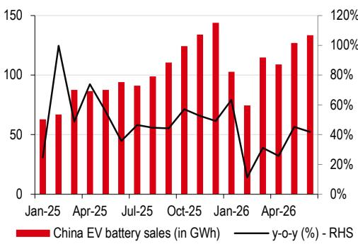  
来源：CABIA，HSBC

2026年上半年中国储能电池销量（含出口）同比增长83%  
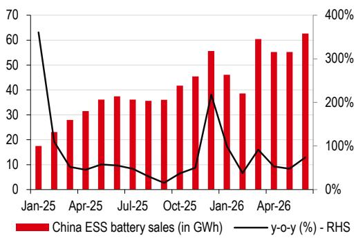  
来源：CABIA，HSBC

2026年上半年中国电动汽车电池出口同比增长50%  
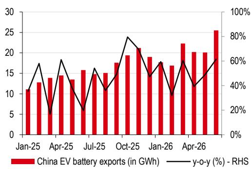  
来源：CABIA，HSBC

2026年上半年中国储能电池出口同比增长28%  
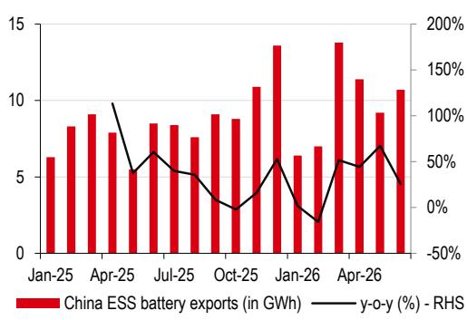  
来源：CABIA，HSBC

2026年上半年中国纯电动车销量低于我们此前预期，但受新车投放、技术升级以及置换需求释放（受补贴和供应动态影响）支撑，我们预计需求将回升。HSBC中国汽车分析师预测中国电动车销量增长10%（参见《中国电动车追踪》，2026年5月18日）。

2026年上半年，中国电动车需求较强的领域是高端大型电动SUV，与20万元人民币以上细分市场的扩张一致。尽管国内电动车整体销售增速有所放缓，但电池装车量同比增长12%，得益于单车电池容量提升和商用电动车渗透率显著上升。

展望未来，2026年下半年预计将有超过160款新电动车型投放，其中多数面向大众市场。HSBC中国汽车分析师预计这将有助于该细分市场的需求恢复。

我们预计2026年锂需求同比增长19%，2026-2030年复合增长率14%。

储能正成为增量增长的主要驱动  
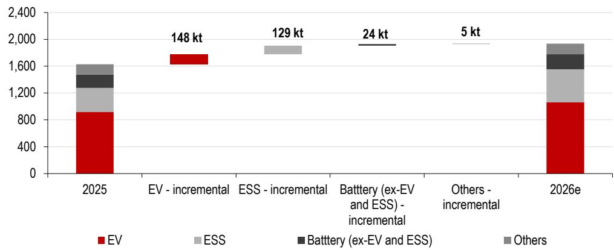  
来源：Wood Mackenzie、公司报告、HSBC预测

## 密切关注供给端

CATL旗下的江西某矿山已获得所有必要许可，正在重启中。该矿于2025年8月在相关批准未续期后停产。该矿及配套冶炼厂名义产能约每年10万吨LCE。重启时间表与我们预期基本一致，我们预计2026年产量约4.8万吨LCE。

受相对高价环境激励，我们观察到此前在上轮下行周期中置于维护状态的资产正在恢复生产——最显著的是Ngungaju、Bald Hill和Finniss。在满负荷运转下，这三个项目合计可每年贡献约50-60万吨锂精矿（相当于约6.5-8万吨LCE）。考虑到典型的产能爬坡节奏，大部分供给影响可能在2027年而非立即显现。

在最初宣布禁止锂精矿出口后，津巴布韦随后表示将在2026年转为出口配额制度，同时要求承诺建设锂硫酸盐加工产能以从2027年开始出口。我们预计2026年下半年出货将正常化。目前约有11-12万吨LCE的锂硫酸盐产能正在建设中，另有其他项目也已公布。这些进展应有助于稳定供给；但考虑到调试和爬坡，我们预计从2027年起供给将出现实质性增长。

全球还有一系列可能推进的项目，如果获批，可在本十年末进一步增加供给

我们注意到，全球有一系列可能推进的项目，如果获批，可在本十年末进一步增加供给。项目清单包括：PPG、Cauchari-Olaroz扩建、Thacker Pass二期、Wodgina扩建、Nova Andino、PMET Resources的Shaakichiuwaanaan、Franklin、Neves、Salares Altoandinos、Salar De Maricunga、P2000、Carolina等。

事实上，本周SQM与其合作伙伴Wesfarmers（WES AU，报价AUD89.90，未覆盖）宣布了最终决定，将澳大利亚Mt Holland的产能从38万吨弹性较高至76万吨（5.5% Li2O锂精矿）。项目将于2027年下半年动工，公司预计2030年上半年投产。

重启将推动明年的供给增长；全球还有一系列可能推进的项目，如果获批，可在本十年末进一步增加供给  
  
来源：Wood Mackenzie、公司报告、HSBC预测

## 2026年下半年锂价仍相对高位，但影响因素正在积聚

中国市场锂碳酸盐价格年初至今上涨25%，但从2026年5月的高点下跌约28%。江西某矿山的重启将消除一项不确定性，并在2026年下半年增加供给。来自津巴布韦的到港货物将进一步缓解2026年下半年的供应压力。尽管我们预计澳大利亚的重启将在2027年显著增加供给（2027年增量约6-7万吨LCE），但重启消息已对市场情绪产生一定影响。

过去几个月锂价有所回落，但仍相对高位  
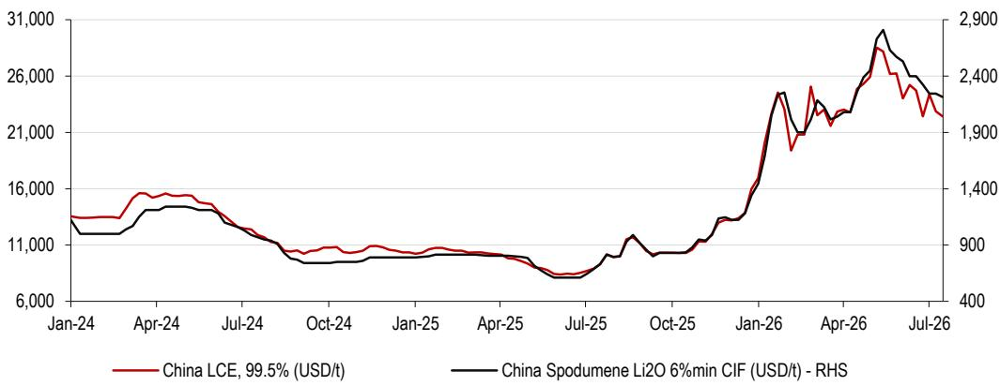  
来源：彭博，HSBC

中国已宣布自2026年9月1日起对锂电池征收2%的消费税，自2027年9月1日起升至4%。钠离子电池、固态电池、燃料电池及部分先进太阳能电池将免税至2028年底。我们认为有两方面潜在影响：短期内，买家可能在2026年第三季度提前采购以规避初始税收，这或将对电池出货量形成短期提振，进而支撑近期对电池金属的需求。尽管税率不高，但政策方向似乎旨在鼓励中长期采用非锂替代方案，强化了摆脱传统锂化学体系的激励。

请点击此处查看我们的锂供需模型及价格预测

季节性上，下半年需求更强。我们预计2026年下半年中国汽车销售将环比回升。但需求增速低于预期仍是重要关注点。我们预计锂价将维持相对高位，但重启带来的供给增长可能显著，2027年供给增速或快于需求。我们上调了2026年中国市场锂碳酸盐价格预测，但下调了2028-29年预测以反映更高供给。详见《金属季报：2026年第三季度——脆弱的“备忘录动能”》，2026年7月19日。

HSBC锂供需模型

<table><tr><td>单位：千吨LCE</td><td>2024</td><td>2025</td><td>2026e</td><td>2027e</td><td>2028e</td><td>2029e</td><td>2030e</td><td>2026-30年变化</td><td>2026e-30e复合增长率</td></tr><tr><td colspan="10">需求</td></tr><tr><td>电动汽车</td><td>707</td><td>915</td><td>1,063</td><td>1,197</td><td>1,406</td><td>1,595</td><td>1,774</td><td>859</td><td>14%</td></tr><tr><td>非电动汽车电池需求</td><td>415</td><td>561</td><td>714</td><td>806</td><td>933</td><td>1,057</td><td>1,162</td><td>601</td><td>16%</td></tr><tr><td>电池总需求</td><td>1,122</td><td>1,476</td><td>1,777</td><td>2,003</td><td>2,339</td><td>2,653</td><td>2,936</td><td>1,459</td><td>15%</td></tr><tr><td>同比</td><td>33%</td><td>32%</td><td>20%</td><td>13%</td><td>17%</td><td>13%</td><td>11%</td><td></td><td></td></tr><tr><td>非电池总需求</td><td>149</td><td>153</td><td>158</td><td>162</td><td>167</td><td>172</td><td>178</td><td>24</td><td>3%</td></tr><tr><td>同比</td><td>3%</td><td>3%</td><td>3%</td><td>3%</td><td>3%</td><td>3%</td><td>3%</td><td></td><td></td></tr><tr><td>总需求</td><td>1,271</td><td>1,630</td><td>1,935</td><td>2,165</td><td>2,507</td><td>2,825</td><td>3,114</td><td>1,484</td><td>14%</td></tr><tr><td>同比</td><td>28%</td><td>28%</td><td>19%</td><td>12%</td><td>16%</td><td>13%</td><td>10%</td><td></td><td></td></tr><tr><td colspan="10">供给</td></tr><tr><td>总精炼供给（不含回收）</td><td>1,277</td><td>1,646</td><td>1,943</td><td>2,230</td><td>2,458</td><td>2,641</td><td>2,799</td><td>1,152</td><td>11%</td></tr><tr><td>同比</td><td>38%</td><td>29%</td><td>18%</td><td>15%</td><td>10%</td><td>7%</td><td>6%</td><td></td><td></td></tr><tr><td>回收</td><td>51</td><td>68</td><td>88</td><td>122</td><td>170</td><td>208</td><td>253</td><td>185</td><td>30%</td></tr><tr><td>同比</td><td>41%</td><td>34%</td><td>28%</td><td>40%</td><td>39%</td><td>23%</td><td>22%</td><td></td><td></td></tr><tr><td>总精炼供给</td><td>1,328</td><td>1,715</td><td>2,031</td><td>2,352</td><td>2,627</td><td>2,850</td><td>3,052</td><td>1,337</td><td>12%</td></tr><tr><td>同比</td><td>38%</td><td>29%</td><td>18%</td><td>16%</td><td>12%</td><td>8%</td><td>7%</td><td></td><td></td></tr><tr><td colspan="10">市场平衡</td></tr><tr><td>库存变动</td><td>(85)</td><td>(25)</td><td>34</td><td>106</td><td>26</td><td>33</td><td>30</td><td></td><td></td></tr><tr><td>盈余/（缺口）后库存变动</td><td>141</td><td>110</td><td>62</td><td>81</td><td>95</td><td>(8)</td><td>(92)</td><td></td><td></td></tr></table>

摘自《金属季报：2026年第三季度——脆弱的“备忘录动能”》，2026年7月19日  
来源：HSBC预测、USGS、Wood Mackenzie

## 锂公司估值反映了什么价格？

我们估计，市场对锂公司的估值倍数约处于12个月远期历史均值下方一个标准差，可能反映了对锂价进一步回落的预期。

当前锂矿公司报价隐含未来12个月平均锂价为每吨1.35-1.4万美元——较当前现货价低约33-37%

如果这些公司按照历史平均倍数估值，当前报价隐含市场的预期是：未来12个月锂碳酸盐均价约为每吨1.35-1.4万美元，较当前现货价低约33-37%。

尽管我们也预计锂价将从当前水平趋于温和，但我们对未来12个月的预测均价为每吨1.93万美元，明显高于当前估值隐含的价格水平。

基于12个月远期倍数的报价隐含平均锂价

<table><tr><td colspan="4">SQM</td></tr><tr><td></td><td></td><td>低点</td><td>均值</td></tr><tr><td>当前市值</td><td>百万美元</td><td>20,068</td><td>20,068</td></tr><tr><td>净债务（上次报告）</td><td>百万美元</td><td>2,283</td><td>2,283</td></tr><tr><td>其他（优先股、少数股东等）</td><td>百万美元</td><td>47</td><td>47</td></tr><tr><td>隐含EV</td><td>百万美元</td><td>22,398</td><td>22,398</td></tr><tr><td>历史12个月远期10年平均EV/EBITDA倍数</td><td>x</td><td>5.8</td><td>9.4</td></tr><tr><td>隐含EBITDA</td><td>百万美元</td><td>3,862</td><td>2,383</td></tr><tr><td>其他部门EBITDA（含公司）</td><td>百万美元</td><td>919</td><td>919</td></tr><tr><td>隐含锂部门EBITDA</td><td>百万美元</td><td>2,942</td><td>1,464</td></tr><tr><td>未来12个月达到隐含锂EBITDA所需的平均锂价（含增值税），基于模型假设</td><td>美元/吨</td><td>22,400</td><td>13,500</td></tr></table>

<table><tr><td colspan="4">ALB</td></tr><tr><td></td><td></td><td>低点</td><td>均值</td></tr><tr><td>当前市值</td><td>百万美元</td><td>13,940</td><td>13,940</td></tr><tr><td>净债务（上次报告）</td><td>百万美元</td><td>1,461</td><td>1,461</td></tr><tr><td>其他（优先股、少数股东等）</td><td>百万美元</td><td>2,493</td><td>2,493</td></tr><tr><td>隐含EV</td><td>百万美元</td><td>17,894</td><td>17,894</td></tr><tr><td>历史12个月远期10年平均EV/EBITDA倍数</td><td>x</td><td>7.3</td><td>12.3</td></tr><tr><td>隐含EBITDA</td><td>百万美元</td><td>2,451</td><td>1,455</td></tr><tr><td>其他部门EBITDA（含公司）</td><td>百万美元</td><td>244</td><td>244</td></tr><tr><td>隐含锂部门EBITDA</td><td>百万美元</td><td>2,207</td><td>1,211</td></tr><tr><td>未来12个月达到隐含锂EBITDA所需的平均锂价（含增值税），基于模型假设</td><td>美元/吨</td><td>21,100</td><td>14,300</td></tr></table>

## SQM（SQM US，当前报价USD68.84）——维持积极观点；目标估值下调至95美元（原100美元）

## 投资论点

我们看好SQM，主要基于产量增长预期、运营效率以及扎实的资产负债表。Kwinana精炼厂的产能爬坡、澳大利亚Mt Holland的扩建以及智利方面产量的增长，应能推动产量提升并改善产品组合。

## 对锂价变化的敏感性

锂价格波动较大，SQM的报价对锂价变化高度敏感。SQM的实现价格紧密跟随现货价波动。以下表格展示了预测期内（含长期价格）锂价假设变化对EBITDA预测和NAV的影响。

锂价假设变化敏感性

<table><tr><td rowspan="2"></td><td rowspan="2">2026e EBITDA（百万美元）</td><td rowspan="2">2027e EBITDA（百万美元）</td><td rowspan="2">NAV/股（美元）</td><td colspan="3">相对基准变化（%）</td></tr><tr><td>2026e EBITDA</td><td>2027e EBITDA</td><td>NAV/股</td></tr><tr><td>价格下降20%</td><td>3,485</td><td>2,520</td><td>72.00</td><td>-8%</td><td>-19%</td><td>-24%</td></tr><tr><td>价格下降10%</td><td>3,633</td><td>2,817</td><td>84.00</td><td>-4%</td><td>-10%</td><td>-12%</td></tr><tr><td>基准</td><td>3,781</td><td>3,114</td><td>95.00</td><td></td><td></td><td></td></tr><tr><td>价格上升10%</td><td>3,930</td><td>3,410</td><td>107.00</td><td>4%</td><td>10%</td><td>13%</td></tr><tr><td>价格上升20%</td><td>4,078</td><td>3,707</td><td>118.00</td><td>8%</td><td>19%</td><td>24%</td></tr></table>

来源：HSBC预测

## 预测调整

2026年预测上调主要受锂价预测上调驱动，2028年预测下调则因锂价假设降低。我们还将Mt Holland已公布的扩建纳入模型。

SQM：2026-28年预测变化

<table><tr><td rowspan="2">百万美元，另有注明除外</td><td colspan="3">新</td><td colspan="3">旧</td><td colspan="3">变化%</td></tr><tr><td>2026e</td><td>2027e</td><td>2028e</td><td>2026e</td><td>2027e</td><td>2028e</td><td>2026e</td><td>2027e</td><td>2028e</td></tr><tr><td>收入</td><td>8,144</td><td>7,184</td><td>7,023</td><td>7,548</td><td>7,206</td><td>7,303</td><td>8%</td><td>0%</td><td>-4%</td></tr><tr><td>EBITDA</td><td>3,781</td><td>3,114</td><td>2,928</td><td>3,414</td><td>3,131</td><td>3,136</td><td>11%</td><td>-1%</td><td>-7%</td></tr><tr><td>利润率（%）</td><td>46%</td><td>43%</td><td>42%</td><td>44%</td><td>44%</td><td>43%</td><td></td><td></td><td></td></tr><tr><td>净利润</td><td>1,624</td><td>1,497</td><td>1,391</td><td>1,623</td><td>1,517</td><td>1,529</td><td>0%</td><td>-1%</td><td>-9%</td></tr><tr><td>每股收益（美元）</td><td>5.69</td><td>5.24</td><td>4.87</td><td>5.68</td><td>5.31</td><td>5.35</td><td>0%</td><td>-1%</td><td>-9%</td></tr></table>

来源：HSBC预测

SQM：我们的预测 vs 市场共识，2026-28年

<table><tr><td rowspan="2">百万美元，另有注明除外</td><td colspan="3">HSBC</td><td colspan="3">市场共识</td><td colspan="3">变化%</td></tr><tr><td>2026e</td><td>2027e</td><td>2028e</td><td>2026e</td><td>2027e</td><td>2028e</td><td>2026e</td><td>2027e</td><td>2028e</td></tr><tr><td>收入</td><td>8,144</td><td>7,184</td><td>7,023</td><td>8,170</td><td>8,223</td><td>8,352</td><td>0%</td><td>-13%</td><td>-16%</td></tr><tr><td>EBITDA</td><td>3,781</td><td>3,114</td><td>2,928</td><td>3,839</td><td>3,846</td><td>4,044</td><td>-2%</td><td>-19%</td><td>-28%</td></tr><tr><td>利润率（%）</td><td>46%</td><td>43%</td><td>42%</td><td>47%</td><td>47%</td><td>48%</td><td></td><td></td><td></td></tr><tr><td>净利润</td><td>1,624</td><td>1,497</td><td>1,391</td><td>1,834</td><td>1,944</td><td>2,150</td><td>-11%</td><td>-23%</td><td>-35%</td></tr><tr><td>每股收益（美元）</td><td>5.69</td><td>5.24</td><td>4.87</td><td>7.11</td><td>7.50</td><td>8.01</td><td>-20%</td><td>-30%</td><td>-39%</td></tr></table>

来源：彭博共识预测，HSBC预测

## 估值与关注点

我们采用分部加总法对SQM进行估值（见下表），假设WACC为7.3%（未变），基于无风险利率4.25%、国家风险溢价0.4%、股权风险溢价4.00%、杠杆贝塔1.1、债务/股权比率30/70（均未变）。参见《股权成本：2026年》，2026年7月13日，了解HSBC股权成本假设。我们使用NPV估值智利锂业务、国际锂业务及其他业务。

目标估值下调源于后期预测下降。我们对SQM US的目标估值从100美元下调至95美元，隐含38.0%的潜在空间，维持积极观点，预计在与Codelco协议最终敲定以及产量增长预期下估值将迎来修复。

对于本地股票（SQM/B CI，当前报价CLP64,540），目标估值从85,000智利比索下调至82,650智利比索，基于每股ADR对应一股，以及HSBC外汇策略师对2026年末汇率的预测870（原850）。

分部加总法（百万美元）

<table><tr><td></td><td>百万美元</td></tr><tr><td>智利锂部门</td><td>14,125</td></tr><tr><td>国际锂部门</td><td>5,785</td></tr><tr><td>其他业务</td><td>13,184</td></tr><tr><td>公司费用</td><td>(3,091)</td></tr><tr><td>EV</td><td>30,002</td></tr><tr><td>净债务</td><td>1,863</td></tr><tr><td>减：少数股东权益</td><td>47</td></tr><tr><td>股权价值</td><td>28,092</td></tr><tr><td>股数（百万）</td><td>286</td></tr><tr><td>公允价值/股（美元）</td><td>95.00</td></tr><tr><td colspan="2">来源：HSBC预测</td></tr></table>

下行关注点包括：下行周期延长影响现金流和股息；澳大利亚Kwinana锂精炼厂项目爬坡受阻；SQM其他业务出现实质性变化；以及可能改变智利锂生产格局的政策变动。

## 财务数据与估值：SQM

财务报表

<table><tr><td>截至12月</td><td>2025a</td><td>2026e</td><td>2027e</td><td>2028e</td></tr><tr><td colspan="5">利润表汇总（百万美元）</td></tr><tr><td>收入</td><td>4,576</td><td>8,144</td><td>7,184</td><td>7,023</td></tr><tr><td>EBITDA</td><td>1,580</td><td>3,781</td><td>3,114</td><td>2,928</td></tr><tr><td>折旧与摊销</td><td>-423</td><td>-428</td><td>-463</td><td>-504</td></tr><tr><td>营业利润/EBIT</td><td>1,157</td><td>3,353</td><td>2,651</td><td>2,424</td></tr><tr><td>净利息</td><td>-107</td><td>-109</td><td>-97</td><td>-77</td></tr><tr><td>税前利润</td><td>961</td><td>3,215</td><td>2,539</td><td>2,333</td></tr><tr><td>HSBC口径税前利润</td><td>961</td><td>3,215</td><td>2,539</td><td>2,333</td></tr><tr><td>税费</td><td>-320</td><td>-1,306</td><td>-817</td><td>-750</td></tr><tr><td>净利润</td><td>588</td><td>1,624</td><td>1,497</td><td>1,391</td></tr><tr><td>HSBC口径净利润</td><td>588</td><td>1,624</td><td>1,497</td><td>1,391</td></tr></table>

现金流量表汇总（百万美元）

<table><tr><td>经营活动现金流</td><td>1,314</td><td>2,352</td><td>1,962</td><td>1,901</td></tr><tr><td>资本支出</td><td>-877</td><td>-858</td><td>-996</td><td>-830</td></tr><tr><td>投资活动现金流</td><td>-772</td><td>-922</td><td>-996</td><td>-830</td></tr><tr><td>股息</td><td>-4</td><td>-294</td><td>-487</td><td>-449</td></tr><tr><td>净债务变动</td><td>-456</td><td>-1,151</td><td>-478</td><td>-622</td></tr><tr><td>股权自由现金流</td><td>438</td><td>1,494</td><td>966</td><td>1,071</td></tr></table>

资产负债表汇总（百万美元）

<table><tr><td>无形资产</td><td>2,554</td><td>2,553</td><td>2,553</td><td>2,553</td></tr><tr><td>有形资产</td><td>5,284</td><td>5,734</td><td>6,267</td><td>6,594</td></tr><tr><td>流动资产</td><td>5,780</td><td>7,640</td><td>8,096</td><td>8,729</td></tr><tr><td>现金及其他</td><td>1,750</td><td>3,345</td><td>3,823</td><td>4,445</td></tr><tr><td>总资产</td><td>14,505</td><td>16,803</td><td>17,792</td><td>18,751</td></tr><tr><td>经营性负债</td><td>1,321</td><td>2,267</td><td>2,238</td><td>2,246</td></tr><tr><td>总债务</td><td>4,764</td><td>5,208</td><td>5,208</td><td>5,208</td></tr><tr><td>净债务</td><td>3,014</td><td>1,863</td><td>1,385</td><td>762</td></tr><tr><td>股东权益</td><td>5,691</td><td>6,818</td><td>7,828</td><td>8,771</td></tr><tr><td>投入资本</td><td>10,547</td><td>10,315</td><td>10,855</td><td>11,183</td></tr></table>

比率、增长与每股分析

积极

估值数据

<table><tr><td>截至12月</td><td>12/2025a</td><td>12/2026e</td><td>12/2027e</td><td>12/2028e</td></tr><tr><td>EV/收入</td><td>5.5</td><td>3.0</td><td>3.3</td><td>3.3</td></tr><tr><td>EV/EBITDA</td><td>15.9</td><td>6.4</td><td>7.6</td><td>7.8</td></tr><tr><td>EV/IC</td><td>2.4</td><td>2.3</td><td>2.2</td><td>2.1</td></tr><tr><td>市盈率*</td><td>33.4</td><td>12.1</td><td>13.1</td><td>14.1</td></tr><tr><td>市净率</td><td>3.5</td><td>2.9</td><td>2.5</td><td>2.2</td></tr><tr><td>自由现金流回报表现（%）</td><td>2.1</td><td>7.3</td><td>4.7</td><td>5.2</td></tr><tr><td>股息回报表现（%）</td><td>0.0</td><td>1.5</td><td>2.5</td><td>2.3</td></tr></table>

<table><tr><td>截至12月</td><td>12/2025a</td><td>12/2026e</td><td>12/2027e</td><td>12/2028e</td></tr><tr><td colspan="5">同比变化%</td></tr><tr><td>收入</td><td>1.0</td><td>78.0</td><td>-11.8</td><td>-2.2</td></tr><tr><td>EBITDA</td><td>6.5</td><td>139.4</td><td>-17.7</td><td>-6.0</td></tr><tr><td>营业利润</td><td>1.4</td><td>189.8</td><td>-21.0</td><td>-8.5</td></tr><tr><td>税前利润</td><td>-1.4</td><td>234.7</td><td>-21.0</td><td>-8.1</td></tr><tr><td>HSBC每股收益</td><td></td><td>176.3</td><td>-7.8</td><td>-7.1</td></tr><tr><td colspan="5">比率（%）</td></tr><tr><td>收入/投入资本（x）</td><td>0.5</td><td>0.8</td><td>0.7</td><td>0.6</td></tr><tr><td>ROIC</td><td>8.2</td><td>19.1</td><td>17.0</td><td>14.9</td></tr><tr><td>ROE</td><td>10.8</td><td>26.0</td><td>20.4</td><td>16.8</td></tr><tr><td>ROA</td><td>5.9</td><td>13.1</td><td>10.9</td><td>9.5</td></tr><tr><td>EBITDA利润率</td><td>34.5</td><td>46.4</td><td>43.3</td><td>41.7</td></tr><tr><td>营业利润率</td><td>25.3</td><td>41.2</td><td>36.9</td><td>34.5</td></tr><tr><td>EBITDA/净利息（x）</td><td>14.8</td><td>34.8</td><td>32.0</td><td>38.1</td></tr><tr><td>净债务/权益</td><td>37.4</td><td>20.3</td><td>13.6</td><td>6.8</td></tr><tr><td>净债务/EBITDA（x）</td><td>1.9</td><td>0.5</td><td>0.4</td><td>0.3</td></tr><tr><td>经营活动现金流/净债务</td><td>43.6</td><td>126.3</td><td>141.7</td><td>249.4</td></tr><tr><td colspan="5">每股数据（美元）</td></tr><tr><td>摊薄每股收益（报告）</td><td>2.06</td><td>5.69</td><td>5.24</td><td>4.87</td></tr><tr><td>HSBC摊薄每股收益</td><td>2.06</td><td>5.69</td><td>5.24</td><td>4.87</td></tr><tr><td>每股股息</td><td>0.00</td><td>1.03</td><td>1.71</td><td>1.57</td></tr><tr><td>每股账面价值</td><td>19.92</td><td>23.87</td><td>27.41</td><td>30.71</td></tr></table>

\* 基于HSBC摊薄每股收益

ESG指标

<table><tr><td>环境指标</td><td>12/2024a</td></tr><tr><td>温室气体排放强度*</td><td>93.2</td></tr><tr><td>能源强度*</td><td>214.9</td></tr><tr><td>CO2减排政策</td><td>是</td></tr><tr><td>社会指标</td><td>12/2024a</td></tr><tr><td>员工成本占收入比例</td><td>9.7</td></tr><tr><td>员工流动率（%）</td><td>17</td></tr><tr><td>多元化政策</td><td>是</td></tr></table>

来源：公司数据，HSBC

<table><tr><td>治理指标</td><td>12/2025a</td></tr><tr><td>董事会人数</td><td>8</td></tr><tr><td>董事会平均任期（年）</td><td>n/a</td></tr><tr><td>女性董事比例（%）</td><td>12.5</td></tr><tr><td>独立董事比例（%）</td><td>25</td></tr></table>

\* 温室气体排放强度和能源强度分别按每千美元收入的千克和千瓦时计量。

发行人信息

<table><tr><td>报价（美元）</td><td>68.84</td></tr><tr><td>目标估值（美元）</td><td>95.00</td></tr><tr><td>股票代码（股票）</td><td>SQM.N</td></tr><tr><td>彭博代码（股票）</td><td>SQM US</td></tr><tr><td>市值（百万美元）</td><td>20,447</td></tr></table>

<table><tr><td>自由流通比例</td><td>34%</td></tr><tr><td>行业</td><td>金属与采矿</td></tr><tr><td>国家/地区</td><td>智利</td></tr><tr><td>分析师</td><td>Ishan Jain</td></tr><tr><td>联系方式</td><td>[联系方式] +91 80 4550 3767</td></tr></table>

价格相对走势  
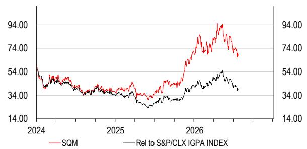  
来源：HSBC

注：报价日期为2026年7月21日收盘。

## Albemarle（ALB US，当前报价USD118.62）——维持积极观点；目标估值下调至170美元（原230美元）

## 投资论点

我们认为Albemarle在成本控制和效率方面的持续改善，使其能够在锂价相对有利的环境中受益。公司报价对锂价高度敏感。

## 对锂价变化的敏感性

锂价格波动较大，该股票报价对锂价变化高度敏感。公司约50%的产量以合约形式销售。然而，如下表敏感性分析所示，长期价格预期似乎是驱动报价波动的主要因素。

锂价假设变化敏感性

<table><tr><td rowspan="2"></td><td rowspan="2">2026e EBITDA（百万美元）</td><td rowspan="2">2027e EBITDA（百万美元）</td><td rowspan="2">NAV/股（美元）</td><td colspan="3">相对基准变化（%）</td></tr><tr><td>2026e EBITDA</td><td>2027e EBITDA</td><td>NAV/股</td></tr><tr><td>价格下降20%</td><td>2,412</td><td>1,423</td><td>94.00</td><td>-11%</td><td>-24%</td><td>-45%</td></tr><tr><td>价格下降10%</td><td>2,563</td><td>1,647</td><td>128.00</td><td>-6%</td><td>-12%</td><td>-25%</td></tr><tr><td>基准</td><td>2,713</td><td>1,871</td><td>170.00</td><td></td><td></td><td></td></tr><tr><td>价格上升10%</td><td>2,864</td><td>2,095</td><td>213.00</td><td>6%</td><td>12%</td><td>25%</td></tr><tr><td>价格上升20%</td><td>3,015</td><td>2,319</td><td>256.00</td><td>11%</td><td>24%</td><td>51%</td></tr></table>

来源：HSBC预测

## 预测调整

2026年预测上调主要受锂价预测上调驱动，2028年预测下调则因锂价假设降低和成本假设上升。

## Albemarle：2026-28年预测变化

<table><tr><td rowspan="2">百万美元，另有注明除外</td><td colspan="3">新</td><td colspan="3">旧</td><td colspan="3">变化%</td></tr><tr><td>2026e</td><td>2027e</td><td>2028e</td><td>2026e</td><td>2027e</td><td>2028e</td><td>2026e</td><td>2027e</td><td>2028e</td></tr><tr><td>收入</td><td>6,027</td><td>5,534</td><td>5,488</td><td>5,816</td><td>5,534</td><td>5,608</td><td>4%</td><td>0%</td><td>-2%</td></tr><tr><td>调整后EBITDA</td><td>2,713</td><td>1,871</td><td>1,972</td><td>2,415</td><td>1,839</td><td>2,010</td><td>12%</td><td>2%</td><td>-2%</td></tr><tr><td>利润率（%）</td><td>45%</td><td>34%</td><td>36%</td><td>42%</td><td>33%</td><td>36%</td><td></td><td></td><td></td></tr><tr><td>调整后净利润</td><td>1,356</td><td>736</td><td>854</td><td>1,103</td><td>720</td><td>889</td><td>23%</td><td>2%</td><td>-4%</td></tr><tr><td>调整后每股收益（美元）</td><td>10.99</td><td>6.20</td><td>7.20</td><td>8.87</td><td>6.07</td><td>7.50</td><td>24%</td><td>2%</td><td>-4%</td></tr></table>

来源：HSBC预测

## Albemarle：我们的预测 vs 市场共识，2026-28年

<table><tr><td rowspan="2">百万美元，另有注明除外</td><td colspan="3">HSBC</td><td colspan="3">市场共识</td><td colspan="3">变化%</td></tr><tr><td>2026e</td><td>2027e</td><td>2028e</td><td>2026e</td><td>2027e</td><td>2028e</td><td>2026e</td><td>2027e</td><td>2028e</td></tr><tr><td>收入</td><td>6,027</td><td>5,534</td><td>5,488</td><td>6,324</td><td>6,520</td><td>6,839</td><td>-5%</td><td>-15%</td><td>-20%</td></tr><tr><td>EBITDA</td><td>2,713</td><td>1,871</td><td>1,972</td><td>2,973</td><td>2,948</td><td>3,103</td><td>-9%</td><td>-37%</td><td>-36%</td></tr><tr><td>利润率（%）</td><td>45%</td><td>34%</td><td>36%</td><td>47%</td><td>45%</td><td>45%</td><td></td><td></td><td></td></tr><tr><td>净利润</td><td>1,356</td><td>736</td><td>854</td><td>1,661</td><td>1,621</td><td>1,762</td><td>-18%</td><td>-55%</td><td>-52%</td></tr><tr><td>调整后每股收益（美元）</td><td>10.99</td><td>6.20</td><td>7.20</td><td>12.46</td><td>12.08</td><td>13.53</td><td>-12%</td><td>-49%</td><td>-47%</td></tr></table>

来源：彭博共识预测，HSBC预测

## 估值与关注点

我们采用DCF方法对Albemarle进行估值，假设WACC为8.0%（原7.8%，因债务/价值比率从33%调整至30%），基于无风险利率4.25%（参见《股权成本：2026年》，2026年7月13日），股权风险溢价4.00%（未变），国家风险溢价0.4%（原0.5%，因智利CDS从0.84%降至0.77%），杠杆贝塔1.25（未变）。目标估值下调源于预测下降及WACC上升。新目标估值170美元（原230美元）隐含43.3%的潜在空间，我们对Albemarle维持积极观点，基于其效率改善和对锂价上行的较高敞口。

下行关注点包括：产能扩张延迟或意外支出；因库存积压、需求及定价变化导致的意外减产；其他业务部门表现变化。

<table><tr><td>截至12月</td><td>12/2025a</td><td>12/2026e</td><td>12/2027e</td><td>12/2028e</td></tr><tr><td colspan="5">利润表汇总（百万美元）</td></tr><tr><td>收入</td><td>5,143</td><td>6,027</td><td>5,534</td><td>5,488</td></tr><tr><td>EBITDA</td><td>1,098</td><td>2,713</td><td>1,871</td><td>1,972</td></tr><tr><td>折旧与摊销</td><td>-659</td><td>-637</td><td>-636</td><td>-631</td></tr><tr><td>营业利润/EBIT</td><td>-367</td><td>963</td><td>471</td><td>625</td></tr><tr><td>净利息</td><td>-208</td><td>-125</td><td>-113</td><td>-113</td></tr><tr><td>税前利润</td><td>-308</td><td>1,601</td><td>928</td><td>1,048</td></tr><tr><td>HSBC口径税前利润</td><td>-308</td><td>1,601</td><td>928</td><td>1,048</td></tr><tr><td>税费</td><td>-157</td><td>-200</td><td>-100</td><td>-143</td></tr><tr><td>净利润</td><td>-677</td><td>1,190</td><td>736</td><td>854</td></tr><tr><td>HSBC口径净利润</td><td>-93</td><td>1,356</td><td>736</td><td>854</td></tr><tr><td colspan="5">现金流量表汇总（百万美元）</td></tr><tr><td>经营活动现金流</td><td>1,282</td><td>1,531</td><td>1,425</td><td>1,355</td></tr><tr><td>资本支出</td><td>-590</td><td>-554</td><td>-575</td><td>-575</td></tr><tr><td>投资活动现金流</td><td>-146</td><td>86</td><td>-575</td><td>-575</td></tr><tr><td>股息</td><td>-191</td><td>-192</td><td>-193</td><td>-193</td></tr><tr><td>净债务变动</td><td>-709</td><td>-1,194</td><td>-575</td><td>-547</td></tr><tr><td>股权自由现金流</td><td>692</td><td>977</td><td>850</td><td>780</td></tr><tr><td colspan="5">资产负债表汇总（百万美元）</td></tr><tr><td>无形资产</td><td>2,206</td><td>1,696</td><td>1,696</td><td>1,696</td></tr><tr><td>有形资产</td><td>8,612</td><td>8,501</td><td>8,440</td><td>8,384</td></tr><tr><td>流动资产</td><td>4,008</td><td>3,758</td><td>4,082</td><td>4,606</td></tr><tr><td>现金及其他</td><td>1,618</td><td>1,519</td><td>2,094</td><td>2,641</td></tr><tr><td>总资产</td><td>16,374</td><td>15,921</td><td>16,384</td><td>17,039</td></tr><tr><td>经营性负债</td><td>2,910</td><td>2,729</td><td>2,639</td><td>2,622</td></tr><tr><td>总债务</td><td>3,194</td><td>1,882</td><td>1,882</td><td>1,882</td></tr><tr><td>净债务</td><td>2,225</td><td>1,031</td><td>456</td><td>-90</td></tr><tr><td>股东权益</td><td>9,533</td><td>10,618</td><td>11,160</td><td>11,821</td></tr><tr><td>投入资本</td><td>10,299</td><td>9,708</td><td>9,486</td><td>9,423</td></tr></table>

## 财务数据与估值：Albemarle Corporation

财务报表  
比率、增长与每股分析

积极

估值数据

<table><tr><td>截至12月</td><td>12/2025a</td><td>12/2026e</td><td>12/2027e</td><td>12/2028e</td></tr><tr><td>EV/收入</td><td>3.2</td><td>2.5</td><td>2.7</td><td>2.6</td></tr><tr><td>EV/EBITDA</td><td>15.0</td><td>5.6</td><td>7.9</td><td>7.2</td></tr><tr><td>EV/IC</td><td>1.6</td><td>1.6</td><td>1.6</td><td>1.5</td></tr><tr><td>市盈率*</td><td>nm</td><td>10.8</td><td>19.1</td><td>16.5</td></tr><tr><td>市净率</td><td>1.5</td><td>1.3</td><td>1.3</td><td>1.2</td></tr><tr><td>自由现金流回报表现（%）</td><td>4.9</td><td>7.0</td><td>6.1</td><td>5.6</td></tr><tr><td>股息回报表现（%）</td><td>1.4</td><td>1.4</td><td>1.4</td><td>1.4</td></tr></table>

<table><tr><td>截至12月</td><td>12/2025a</td><td>12/2026e</td><td>12/2027e</td><td>12/2028e</td></tr><tr><td colspan="5">同比变化%</td></tr><tr><td>收入</td><td>-4.4</td><td>17.2</td><td>-8.2</td><td>-0.8</td></tr><tr><td>EBITDA</td><td>-3.7</td><td>147.1</td><td>-31.1</td><td>5.4</td></tr><tr><td>营业利润</td><td></td><td></td><td>-51.1</td><td>32.7</td></tr><tr><td>税前利润</td><td></td><td></td><td>-42.0</td><td>13.0</td></tr><tr><td>HSBC每股收益</td><td></td><td></td><td>-43.6</td><td>16.1</td></tr><tr><td colspan="5">比率（%）</td></tr><tr><td>收入/投入资本（x）</td><td>0.5</td><td>0.6</td><td>0.6</td><td>0.6</td></tr><tr><td>ROIC</td><td>6.1</td><td>18.2</td><td>11.5</td><td>12.2</td></tr><tr><td>ROE</td><td>-1.0</td><td>13.5</td><td>6.8</td><td>7.4</td></tr><tr><td>ROA</td><td>-0.9</td><td>9.4</td><td>5.7</td><td>6.0</td></tr><tr><td>EBITDA利润率</td><td>21.4</td><td>45.0</td><td>33.8</td><td>35.9</td></tr><tr><td>营业利润率</td><td>-7.1</td><td>16.0</td><td>8.5</td><td>11.4</td></tr><tr><td>EBITDA/净利息（x）</td><td>5.3</td><td>21.7</td><td>16.6</td><td>17.5</td></tr><tr><td>净债务/权益</td><td>22.8</td><td>9.5</td><td>4.0</td><td>-0.7</td></tr><tr><td>净债务/EBITDA（x）</td><td>2.0</td><td>0.4</td><td>0.2</td><td>-0.0</td></tr><tr><td>经营活动现金流/净债务</td><td>57.6</td><td>148.4</td><td>312.3</td><td></td></tr><tr><td colspan="5">每股数据（美元）</td></tr><tr><td>摊薄每股收益（报告）</td><td>-5.76</td><td>10.03</td><td>6.20</td><td>7.20</td></tr><tr><td>HSBC摊薄每股收益</td><td>-0.79</td><td>10.99</td><td>6.20</td><td>7.20</td></tr><tr><td>每股股息</td><td>1.64</td><td>1.64</td><td>1.64</td><td>1.64</td></tr><tr><td>每股账面价值</td><td>81.02</td><td>90.09</td><td>94.70</td><td>100.30</td></tr></table>

\* 基于HSBC摊薄每股收益

ESG指标

<table><tr><td>环境指标</td><td>12/2024a</td></tr><tr><td>温室气体排放强度*</td><td>228.7</td></tr><tr><td>能源强度*</td><td>898.8</td></tr><tr><td>CO2减排政策</td><td>是</td></tr><tr><td>社会指标</td><td>12/2024a</td></tr><tr><td>员工成本占收入比例</td><td>n/a</td></tr><tr><td>员工流动率（%）</td><td>20</td></tr><tr><td>多元化政策</td><td>是</td></tr></table>

来源：公司数据，HSBC

<table><tr><td>治理指标</td><td>12/2025a</td></tr><tr><td>董事会人数</td><td>10</td></tr><tr><td>董事会平均任期（年）</td><td>n/a</td></tr><tr><td>女性董事比例（%）</td><td>30</td></tr><tr><td>独立董事比例（%）</td><td>90</td></tr></table>

\* 温室气体排放强度和能源强度分别按每千美元收入的千克和千瓦时计量。

发行人信息

<table><tr><td>报价（美元）</td><td>118.62</td></tr><tr><td>目标估值（美元）</td><td>170.00</td></tr><tr><td>股票代码（股票）</td><td>ALB.N</td></tr><tr><td>彭博代码（股票）</td><td>ALB US</td></tr><tr><td>市值（百万美元）</td><td>13,989</td></tr></table>

<table><tr><td>自由流通比例</td><td>100%</td></tr><tr><td>行业</td><td>化工</td></tr><tr><td>国家/地区</td><td>美国</td></tr><tr><td>分析师</td><td>Ishan Jain</td></tr><tr><td>联系方式</td><td>[联系方式] +91 80 4550 3767</td></tr></table>

价格相对走势  
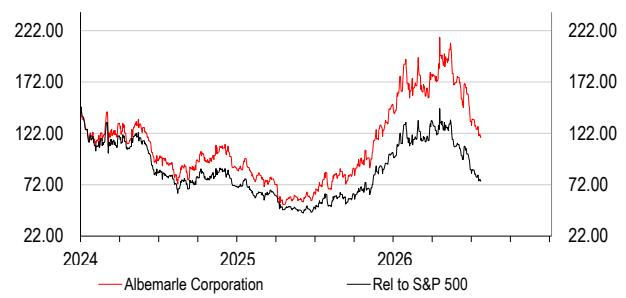  
来源：HSBC

注：报价日期为2026年7月21日收盘。

## Lithium Argentina（LAR US，当前报价USD5.90）——维持积极观点；目标估值下调至8.50美元（原13.00美元）

## 投资论点

Cauchari Olaroz的高利用率和持续下降的现金成本表明运营稳定性。两个项目——Cauchari-Olaroz二期和PPG——正逐步成为现实，提供了增长弹性。盈利和现金生成对锂价高度敏感。

## 对锂价和WACC变化的敏感性

锂价格波动较大，该股票报价对锂价变化高度敏感。以下表格展示了预测期内（含长期价格）锂价假设和WACC变化对NAV的敏感性分析。

锂价和WACC假设变化对NAV/股的敏感性

<table><tr><td rowspan="2">锂价假设变化</td><td colspan="5">WACC假设</td></tr><tr><td>11.1%</td><td>11.6%</td><td>12.1%</td><td>12.6%</td><td>13.1%</td></tr><tr><td>价格下降20%</td><td>5.90</td><td>5.30</td><td>4.70</td><td>4.30</td><td>3.80</td></tr><tr><td>价格下降10%</td><td>8.10</td><td>7.30</td><td>6.60</td><td>6.00</td><td>5.50</td></tr><tr><td>基准</td><td>10.20</td><td>9.30</td><td>8.50</td><td>7.80</td><td>7.10</td></tr><tr><td>价格上升10%</td><td>12.40</td><td>11.30</td><td>10.40</td><td>9.50</td><td>8.80</td></tr><tr><td>价格上升20%</td><td>14.60</td><td>13.30</td><td>12.20</td><td>11.30</td><td>10.40</td></tr></table>

来源：HSBC预测

## 预测调整

我们纳入了锂价预测的修订。2026年EBITDA预测上调反映更高的锂价假设。2027-2028年预测下调系锂价假设降低和成本假设上升。

Lithium Argentina：2026-28年预测变化

<table><tr><td rowspan="2">百万美元，另有注明除外</td><td colspan="3">新</td><td colspan="3">旧</td><td colspan="3">变化%</td></tr><tr><td>2026e</td><td>2027e</td><td>2028e</td><td>2026e</td><td>2027e</td><td>2028e</td><td>2026e</td><td>2027e</td><td>2028e</td></tr><tr><td>收入</td><td>-</td><td>-</td><td>-</td><td>-</td><td>-</td><td>-</td><td></td><td></td><td></td></tr><tr><td>EBITDA</td><td>67</td><td>41</td><td>29</td><td>59</td><td>43</td><td>43</td><td>13%</td><td>-4%</td><td>-33%</td></tr><tr><td>净利润</td><td>54</td><td>42</td><td>33</td><td>48</td><td>44</td><td>43</td><td>11%</td><td>-3%</td><td>-24%</td></tr><tr><td>每股收益（美元）</td><td>0.31</td><td>0.24</td><td>0.19</td><td>0.28</td><td>0.25</td><td>0.25</td><td>10%</td><td>-2%</td><td>-24%</td></tr></table>

来源：HSBC预测

## 估值与关注点

我们采用NPV估值法，假设WACC为12.1%（原10.8%），基于无风险利率4.25%（未变），股权风险溢价4.00%（未变），国家风险溢价5.0%（原3.0%，因我们将阿根廷在计算中的权重从50%提高至100%），无杠杆贝塔1.2（未变），增长率4%（未变）。参见《股权成本：2026年》，2026年7月13日。我们将PPG项目NPV纳入估值（使用相同WACC及其他假设），但考虑到融资不确定性，现在赋予75%的概率。目标估值下调源于EBITDA预测下降及WACC上升。新目标估值8.50美元（原13.00美元）隐含35.1%的潜在空间。我们维持对Lithium Argentina的积极观点，因其增长弹性。

下行关注点包括：Cauchari-Olaroz生产问题导致产品质量不佳；执行风险可能导致延迟或产量低于预期/成本超支；价格低于预期对盈利产生负面影响；宏观变化导致电动车销量减少，进而降低锂需求；以及PPG项目在寻找合作伙伴或融资方面遇到困难。

财务数据与估值：Lithium Argentina AG  
财务报表

<table><tr><td>截至12月</td><td>12/2025a</td><td>12/2026e</td><td>12/2027e</td><td>12/2028e</td></tr><tr><td colspan="5">利润表汇总（百万美元）</td></tr><tr><td>收入</td><td>0</td><td>0</td><td>0</td><td>0</td></tr><tr><td>EBITDA</td><td>-77</td><td>67</td><td>41</td><td>29</td></tr><tr><td>折旧与摊销</td><td>0</td><td>0</td><td>0</td><td>0</td></tr><tr><td>营业利润/EBIT</td><td>-77</td><td>67</td><td>41</td><td>29</td></tr><tr><td>净利息</td><td>8</td><td>7</td><td>17</td><td>16</td></tr><tr><td>税前利润</td><td>-76</td><td>71</td><td>58</td><td>45</td></tr><tr><td>HSBC口径税前利润</td><td>-76</td><td>71</td><td>58</td><td>45</td></tr><tr><td>税费</td><td>0</td><td>-19</td><td>-16</td><td>-12</td></tr><tr><td>净利润</td><td>-75</td><td>54</td><td>42</td><td>33</td></tr><tr><td>HSBC口径净利润</td><td>-75</td><td>54</td><td>42</td><td>33</td></tr><tr><td colspan="5">现金流量表汇总（百万美元）</td></tr><tr><td>经营活动现金流</td><td>-30</td><td>-36</td><td>-14</td><td>-12</td></tr><tr><td>资本支出</td><td>0</td><td>0</td><td>0</td><td>0</td></tr><tr><td>投资活动现金流</td><td>0</td><td>0</td><td>0</td><td>0</td></tr><tr><td>股息</td><td>0</td><td>0</td><td>0</td><td>0</td></tr><tr><td>净债务变动</td><td>50</td><td>36</td><td>14</td><td>12</td></tr><tr><td>股权自由现金流</td><td>-30</td><td>-36</td><td>-14</td><td>-12</td></tr><tr><td colspan="5">资产负债表汇总（百万美元）</td></tr><tr><td>无形资产</td><td>0</td><td>0</td><td>0</td><td>0</td></tr><tr><td>有形资产</td><td>350</td><td>350</td><td>350</td><td>350</td></tr><tr><td>流动资产</td><td>85</td><td>48</td><td>34</td><td>22</td></tr><tr><td>现金及其他</td><td>61</td><td>25</td><td>10</td><td>-1</td></tr><tr><td>总资产</td><td>1,100</td><td>1,152</td><td>1,194</td><td>1,227</td></tr><tr><td>经营性负债</td><td>33</td><td>33</td><td>33</td><td>33</td></tr><tr><td>总债务</td><td>237</td><td>237</td><td>237</td><td>237</td></tr><tr><td>净债务</td><td>176</td><td>212</td><td>226</td><td>238</td></tr><tr><td>股东权益</td><td>768</td><td>821</td><td>864</td><td>897</td></tr><tr><td>投入资本</td><td>341</td><td>341</td><td>341</td><td>341</td></tr></table>

积极

比率、增长与每股分析  
估值数据

<table><tr><td>截至12月</td><td>12/2025a</td><td>12/2026e</td><td>12/2027e</td><td>12/2028e</td></tr><tr><td>EV/EBITDA</td><td>nm</td><td>13.2</td><td>20.3</td><td>28.0</td></tr><tr><td>市盈率*</td><td>nm</td><td>20.4</td><td>25.8</td><td>33.2</td></tr><tr><td>股价/每股现金流</td><td></td><td></td><td></td><td></td></tr><tr><td>股价/股权自由现金流</td><td>-34.5</td><td>-28.4</td><td>-71.5</td><td>-87.5</td></tr><tr><td>股息回报表现（%）</td><td>0.0</td><td>0.0</td><td>0.0</td><td>0.0</td></tr></table>

\* 基于HSBC摊薄每股收益

ESG指标

<table><tr><td>截至12月</td><td>12/2025a</td><td>12/2026e</td><td>12/2027e</td><td>12/2028e</td></tr><tr><td colspan="5">同比变化%</td></tr><tr><td>收入</td><td></td><td></td><td></td><td></td></tr><tr><td>EBITDA</td><td></td><td></td><td>-38.2</td><td>-30.3</td></tr><tr><td>营业利润</td><td></td><td></td><td>-38.2</td><td>-30.3</td></tr><tr><td>税前利润</td><td></td><td></td><td>-18.5</td><td>-22.4</td></tr><tr><td>HSBC每股收益</td><td></td><td></td><td>-20.7</td><td>-22.4</td></tr><tr><td colspan="5">比率（%）</td></tr><tr><td>ROIC</td><td>-22.4</td><td>14.3</td><td>8.8</td><td>6.1</td></tr><tr><td>股权成本</td><td>12.1</td><td>12.1</td><td>12.1</td><td>12.1</td></tr><tr><td>EV/IC（x）</td><td>2.7</td><td>2.6</td><td>2.5</td><td>2.4</td></tr><tr><td>ROIC/股权成本（x）</td><td>-1.9</td><td>1.2</td><td>0.7</td><td>0.5</td></tr><tr><td>REP（x）</td><td></td><td>2.2</td><td>3.4</td><td>4.6</td></tr><tr><td>ROE</td><td>-9.5</td><td>6.7</td><td>5.0</td><td>3.7</td></tr><tr><td>EBITDA利润率</td><td>0.0</td><td>0.0</td><td>0.0</td><td>0.0</td></tr><tr><td>营业利润率</td><td>0.0</td><td>0.0</td><td>0.0</td><td>0.0</td></tr><tr><td>净债务/权益</td><td>21.5</td><td>24.4</td><td>24.8</td><td>25.2</td></tr><tr><td>净债务/EBITDA（x）</td><td>-2.3</td><td>3.2</td><td>5.5</td><td>8.3</td></tr><tr><td colspan="5">每股数据（美元）</td></tr><tr><td>摊薄每股收益（报告）</td><td>-0.47</td><td>0.31</td><td>0.24</td><td>0.19</td></tr><tr><td>HSBC每股收益</td><td>-0.47</td><td>0.31</td><td>0.24</td><td>0.19</td></tr><tr><td>每股现金流</td><td>-0.18</td><td>-0.22</td><td>-0.09</td><td>-0.07</td></tr><tr><td>每股股息</td><td>0.00</td><td>0.00</td><td>0.00</td><td>0.00</td></tr></table>

<table><tr><td>环境指标</td><td>12/2024a</td></tr><tr><td>温室气体排放强度*</td><td>n/a</td></tr><tr><td>能源强度*</td><td>n/a</td></tr><tr><td>CO2减排政策</td><td>是</td></tr><tr><td>社会指标</td><td>12/2024a</td></tr><tr><td>员工成本占收入比例</td><td>n/a</td></tr><tr><td>员工流动率（%）</td><td>21.1</td></tr><tr><td>多元化政策</td><td>是</td></tr></table>

来源：公司数据，HSBC

<table><tr><td>治理指标</td><td>12/2025a</td></tr><tr><td>董事会人数</td><td>8</td></tr><tr><td>董事会平均任期（年）</td><td>n/a</td></tr><tr><td>女性董事比例（%）</td><td>12.5</td></tr><tr><td>独立董事比例（%）</td><td>62.5</td></tr></table>

\* 温室气体排放强度和能源强度分别按每千美元收入的千克和千瓦时计量。

<table><tr><td colspan="2">发行人信息</td></tr><tr><td>报价（美元）</td><td>6.29</td></tr><tr><td>目标估值（美元）</td><td>8.50</td></tr><tr><td>股票代码（股票）</td><td>LAR.N</td></tr><tr><td>彭博代码（股票）</td><td>LAR US</td></tr><tr><td>市值（百万美元）</td><td>1,032</td></tr></table>

<table><tr><td>自由流通比例</td><td>87%</td></tr><tr><td>行业</td><td>金属与采矿</td></tr><tr><td>国家/地区</td><td>加拿大</td></tr><tr><td>分析师</td><td>Ishan Jain</td></tr><tr><td>联系方式</td><td>[联系方式] +91 80 4550 3767</td></tr></table>

价格相对走势  
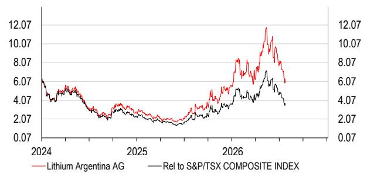  
来源：HSBC

注：报价日期为2026年7月21日收盘。

## Lithium Americas（LAC US，当前报价USD3.06）——维持中性观点；目标估值下调至3.30美元（原4.75美元）

## 投资论点

Lithium Americas已为Thacker Pass项目获得融资，缓解了流动性风险。但该公司距离首次生产仍有距离，我们提醒注意项目启动期间资本支出超支和延迟可能带来的影响。

## 对锂价和WACC变化的敏感性

锂价格波动较大，该股票报价对锂价变化高度敏感。以下表格展示了预测期内（含长期价格）锂价假设和WACC变化对NAV的敏感性分析。

锂价和WACC假设变化对NAV/股的敏感性

<table><tr><td rowspan="2">锂价假设变化</td><td colspan="5">WACC假设</td></tr><tr><td>8.2%</td><td>8.7%</td><td>9.2%</td><td>9.7%</td><td>10.2%</td></tr><tr><td>价格下降20%</td><td>1.80</td><td>1.30</td><td>0.90</td><td>0.60</td><td>0.30</td></tr><tr><td>价格下降10%</td><td>3.20</td><td>2.60</td><td>2.10</td><td>1.60</td><td>1.30</td></tr><tr><td>基准</td><td>4.70</td><td>3.90</td><td>3.30</td><td>2.70</td><td>2.30</td></tr><tr><td>价格上升10%</td><td>6.20</td><td>5.20</td><td>4.50</td><td>3.80</td><td>3.30</td></tr><tr><td>价格上升20%</td><td>7.60</td><td>6.50</td><td>5.70</td><td>4.90</td><td>4.20</td></tr></table>

来源：HSBC预测

## 预测调整

我们纳入了锂价预测的修订。由于近期股权发行，我们还增加了股数。

Lithium Americas：2026-28年预测变化

<table><tr><td rowspan="2">百万美元，另有注明除外</td><td colspan="3">新</td><td colspan="3">旧</td><td colspan="3">变化%</td></tr><tr><td>2026e</td><td>2027e</td><td>2028e</td><td>2026e</td><td>2027e</td><td>2028e</td><td>2026e</td><td>2027e</td><td>2028e</td></tr><tr><td>收入</td><td>-</td><td>36</td><td>340</td><td>-</td><td>36</td><td>350</td><td>nm</td><td>0%</td><td>-3%</td></tr><tr><td>EBITDA</td><td>(75)</td><td>(12)</td><td>176</td><td>(35)</td><td>(11)</td><td>198</td><td>nm</td><td>nm</td><td>-11%</td></tr><tr><td>净利润</td><td>(53)</td><td>(15)</td><td>14</td><td>(28)</td><td>(15)</td><td>18</td><td>nm</td><td>nm</td><td>-19%</td></tr><tr><td>每股收益（美元）</td><td>(0.15)</td><td>(0.04)</td><td>0.04</td><td>(0.08)</td><td>(0.04)</td><td>0.05</td><td>nm</td><td>nm</td><td>-19%</td></tr></table>

来源：HSBC预测

## 估值与关注点

我们采用NPV估值法对Lithium Americas进行估值。假设平均WACC为9.2%（原8.8%），基于无风险利率4.25%，股权风险溢价4.00%，无杠杆贝塔1.25（均未变）。参见《股权成本：2026年》，2026年7月13日。我们额外增加了0.5%的溢价，以反映因美国政府发行的权证可能导致的稀释。

我们下调目标估值至3.30美元（原4.75美元），原因是股数增加（因股权发行）和WACC上升。新目标估值隐含7.7%的潜在空间，我们维持中性评级，因Thacker Pass项目按时按预算完成存在不确定性。

下行关注点包括：执行风险导致延迟或产量低于预期/成本超支；价格低于预期对盈利产生负面影响；宏观变化导致电动车销量减少，降低锂需求。

上行关注点包括：执行速度超预期；锂价高于预期。

财务数据与估值：Lithium Americas Corp  
财务报表

<table><tr><td>截至12月</td><td>12/2025a</td><td>12/2026e</td><td>12/2027e</td><td>12/2028e</td></tr><tr><td colspan="5">利润表汇总（百万美元）</td></tr><tr><td>收入</td><td>0</td><td>0</td><td>36</td><td>340</td></tr><tr><td>EBITDA</td><td>-52</td><td>-75</td><td>-12</td><td>176</td></tr><tr><td>折旧与摊销</td><td>-1</td><td>0</td><td>-3</td><td>-26</td></tr><tr><td>营业利润/EBIT</td><td>-53</td><td>-75</td><td>-14</td><td>151</td></tr><tr><td>净利息</td><td>0</td><td>-10</td><td>-10</td><td>-121</td></tr><tr><td>税前利润</td><td>-86</td><td>-85</td><td>-24</td><td>30</td></tr><tr><td>HSBC口径税前利润</td><td>-86</td><td>-85</td><td>-24</td><td>30</td></tr><tr><td>税费</td><td>0</td><td>0</td><td>0</td><td>-6</td></tr><tr><td>净利润</td><td>-122</td><td>-53</td><td>-15</td><td>14</td></tr><tr><td>HSBC口径净利润</td><td>-122</td><td>-53</td><td>-15</td><td>14</td></tr><tr><td colspan="5">现金流量表汇总（百万美元）</td></tr><tr><td>经营活动现金流</td><td>-61</td><td>-85</td><td>-26</td><td>-72</td></tr><tr><td>资本支出</td><td>-765</td><td>-1,350</td><td>-516</td><td>-226</td></tr><tr><td>投资活动现金流</td><td>-765</td><td>-1,230</td><td>-376</td><td>-226</td></tr><tr><td>股息</td><td>0</td><td>0</td><td>0</td><td>0</td></tr><tr><td>净债务变动</td><td>198</td><td>1,246</td><td>542</td><td>298</td></tr><tr><td>股权自由现金流</td><td>-826</td><td>-1,435</td><td>-542</td><td>-298</td></tr><tr><td colspan="5">资产负债表汇总（百万美元）</td></tr><tr><td>无形资产</td><td>0</td><td>0</td><td>0</td><td>0</td></tr><tr><td>有形资产</td><td>1,344</td><td>2,694</td><td>3,207</td><td>3,407</td></tr><tr><td>流动资产</td><td>912</td><td>786</td><td>1,011</td><td>777</td></tr><tr><td>现金及其他</td><td>906</td><td>780</td><td>997</td><td>699</td></tr><tr><td>总资产</td><td>2,579</td><td>3,803</td><td>4,542</td><td>4,508</td></tr><tr><td>经营性负债</td><td>460</td><td>460</td><td>464</td><td>407</td></tr><tr><td>总债务</td><td>532</td><td>1,652</td><td>2,411</td><td>2,411</td></tr><tr><td>净债务</td><td>-373</td><td>872</td><td>1,414</td><td>1,712</td></tr><tr><td>股东权益</td><td>1,059</td><td>1,196</td><td>1,181</td><td>1,195</td></tr><tr><td>投入资本</td><td>890</td><td>2,240</td><td>2,758</td><td>3,079</td></tr></table>

比率、增长与每股分析

中性

估值数据

<table><tr><td>截至12月</td><td>12/2025a</td><td>12/2026e</td><td>12/2027e</td><td>12/2028e</td></tr><tr><td>EV/EBITDA</td><td>nm</td><td>nm</td><td>nm</td><td>16.0</td></tr><tr><td>市盈率*</td><td>nm</td><td>nm</td><td>nm</td><td>73.5</td></tr><tr><td>股价/每股现金流</td><td></td><td></td><td></td><td></td></tr><tr><td>股价/股权自由现金流</td><td>-1.3</td><td>-0.8</td><td>-2.0</td><td>-3.7</td></tr><tr><td>股息回报表现（%）</td><td>0.0</td><td>0.0</td><td>0.0</td><td>0.0</td></tr></table>

<table><tr><td>截至12月</td><td>12/2025a</td><td>12/2026e</td><td>12/2027e</td><td>12/2028e</td></tr><tr><td colspan="5">同比变化%</td></tr><tr><td>收入</td><td></td><td></td><td></td><td>857.7</td></tr><tr><td>EBITDA</td><td></td><td></td><td></td><td></td></tr><tr><td>营业利润</td><td></td><td></td><td></td><td></td></tr><tr><td>税前利润</td><td></td><td></td><td></td><td></td></tr><tr><td>HSBC每股收益</td><td></td><td></td><td></td><td></td></tr><tr><td colspan="5">比率（%）</td></tr><tr><td>ROIC</td><td>-8.7</td><td>-4.8</td><td>-0.6</td><td>4.1</td></tr><tr><td>股权成本</td><td>9.2</td><td>9.2</td><td>9.2</td><td>9.2</td></tr><tr><td>EV/IC（x）</td><td>0.8</td><td>0.9</td><td>0.9</td><td>0.9</td></tr><tr><td>ROIC/股权成本（x）</td><td>-0.9</td><td>-0.5</td><td>-0.1</td><td>0.4</td></tr><tr><td>REP（x）</td><td></td><td></td><td></td><td>2.1</td></tr><tr><td>ROE</td><td>-14.4</td><td>-4.7</td><td>-1.3</td><td>1.2</td></tr><tr><td>EBITDA利润率</td><td>0.0</td><td>0.0</td><td>-33.7</td><td>51.9</td></tr><tr><td>营业利润率</td><td>0.0</td><td>0.0</td><td>-40.8</td><td>44.3</td></tr><tr><td>净债务/权益</td><td>-23.5</td><td>51.6</td><td>84.8</td><td>101.3</td></tr><tr><td>净债务/EBITDA（x）</td><td>7.2</td><td>-11.6</td><td>-118.1</td><td>9.7</td></tr><tr><td colspan="5">每股数据（美元）</td></tr><tr><td>摊薄每股收益（报告）</td><td>-0.50</td><td>-0.15</td><td>-0.04</td><td>0.04</td></tr><tr><td>HSBC每股收益</td><td>-0.50</td><td>-0.15</td><td>-0.04</td><td>0.04</td></tr><tr><td>每股现金流</td><td>-0.25</td><td>-0.24</td><td>-0.08</td><td>-0.21</td></tr><tr><td>每股股息</td><td>0.00</td><td>0.00</td><td>0.00</td><td>0.00</td></tr></table>

\* 基于HSBC摊薄每股收益

ESG指标

<table><tr><td>环境指标</td><td>12/2024a</td></tr><tr><td>温室气体排放强度*</td><td>n/a</td></tr><tr><td>能源强度*</td><td>n/a</td></tr><tr><td>CO2减排政策</td><td>是</td></tr><tr><td>社会指标</td><td>12/2024a</td></tr><tr><td>员工成本占收入比例</td><td>n/a</td></tr><tr><td>员工流动率（%）</td><td>n/a</td></tr><tr><td>多元化政策</td><td>是</td></tr></table>

来源：公司数据，HSBC

<table><tr><td>治理指标</td><td>12/2025a</td></tr><tr><td>董事会人数</td><td>8</td></tr><tr><td>董事会平均任期（年）</td><td>n/a</td></tr><tr><td>女性董事比例（%）</td><td>25</td></tr><tr><td>独立董事比例（%）</td><td>62.5</td></tr></table>

\* 温室气体排放强度和能源强度分别按每千美元收入的千克和千瓦时计量。

发行人信息

<table><tr><td>报价（美元）</td><td>3.06</td></tr><tr><td>目标估值（美元）</td><td>3.30</td></tr><tr><td>股票代码（股票）</td><td>LAC.N</td></tr><tr><td>彭博代码（股票）</td><td>LAC US</td></tr><tr><td>市值（百万美元）</td><td>1,108</td></tr></table>

<table><tr><td>自由流通比例</td><td>86%</td></tr><tr><td>行业</td><td>金属与采矿</td></tr><tr><td>国家/地区</td><td>加拿大</td></tr><tr><td>分析师</td><td>Ishan Jain</td></tr><tr><td>联系方式</td><td>[联系方式] +91 80 4550 3767</td></tr></table>

价格相对走势  
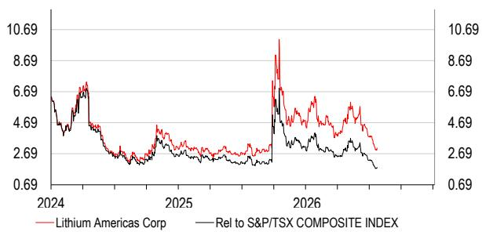  
来源：HSBC

注：报价日期为2026年7月21日收盘。

# 披露附录

## 分析师认证

以下主要负责本报告的分析师、经济学家或策略师（包括任何在报告个别章节以作者身份出现的分析师，以及分部加总估值中被列为子公司覆盖分析师的分析师）证明，其对相关证券或发行人的观点、任何在本人署名章节中表达的看法或预测，以及本报告中任何其他观点或预测（包括研究报告封底表达的观点）均准确反映其个人观点，并且其薪酬的任何部分过去、现在或将来均不直接或间接与本研究报告中的具体推荐或观点相关：Ishan Jain、Jonathan Brandt, CFA、Gustavo Hwang, CFA、Sriharsha Pappu。

## 重要披露

## 股票：评级与财务分析基础

HSBC及其关联机构（包括本报告发行人）认为，读者买卖股票的决定应取决于个人情况，如现有持仓、风险承受能力及其他考虑因素，并且读者在做出投资决策时会运用不同的纪律和投资期限。评级不应被孤立地用作研究交流。不同证券公司使用不同的评级术语和评级体系来描述其建议，因此读者应仔细阅读每份研究报告中使用的评级定义。此外，读者应仔细阅读整份研究报告，而不应仅从评级推断其内容，因为研究报告包含分析师观点及评级基础的更完整信息。

## 自2023年3月23日起，HSBC采用以下评级基础：

目标价格基于分析师对股票当前实际价值的评估，但预计市场需要6至12个月才能反映这一价值。当目标价格较当前股价高出20%以上时，该股票归为积极；当目标价格较当前股价高出5%至20%时，该股票可能归为积极或中性；当目标价格在当前股价上下5%范围内时，该股票归为中性；当目标价格较当前股价低5%至20%时，该股票可能归为中性或谨慎；当目标价格较当前股价低20%以上时，该股票归为谨慎。

我们的评级在发生“实质性变化”（首次或恢复覆盖、目标价格或预测调整）时根据这些区间重新校准。

上行/下行空间为目标价格与股价之间的百分比差异。

## 在此之前，HSBC的评级结构基于以下基础：

对每只股票，我们根据该国或适当情况下由策略团队确定的国内/区域市场股权成本设定所需回报率。目标价格代表分析师预期股票在我们考察期（12个月）内将达到的价值。若要归为增持，潜在回报（即当前股价与目标价格之间的百分比差异，包含预期股息回报表现）必须超过所需回报至少5个百分点（对于归类为波动\*的股票则为10个百分点）。若要归为减持，该股票预期在随后12个月内表现低于所需回报至少5个百分点（对于波动\*股票则为10个百分点）。介于两者之间的股票归为中性。

\* 如果股票的历史波动率超过40%、上市不足12个月（除非处于波动较低行业/板块）或分析师预期显著波动，则归类为波动。然而，我们未视为波动的股票实际上也可能具有类似表现。历史波动率定义为过去一个月的每日365天移动平均波动率均值。为避免误导性频繁评级变化，波动率必须在任一方向超过40%基准2.5个百分点时，股票的状态才会改变。

## 长期研究线索的评级分布

截至2026年6月30日，HSBC发布的所有独立评级分布如下：

积极 61%（其中13%在过去12个月内获得投资银行服务）

中性 34%（其中10%在过去12个月内获得投资银行服务）

谨慎 5%（其中8%在过去12个月内获得投资银行服务）

为上述分布目的，在从旧评级模型向当前模型过渡期间使用以下映射结构：在旧模型下，增持=积极，中性=中性，减持=谨慎；在当前模型下，积极=积极，中性=中性，谨慎=谨慎。有关两种模型下的评级定义，请参见上文“股票：评级与财务分析基础”。

对于HSBC发布的非独立评级分布，请参见披露页面 [http://www.hsbcnet.com/gbm/financial-regulation/investment-recommendations-disclosures](http://www.hsbcnet.com/gbm/financial-regulation/investment-recommendations-disclosures)。

长期研究线索的股价和评级变化

Albemarle Corporation (ALB.N) 股价表现（美元）与HSBC评级历史
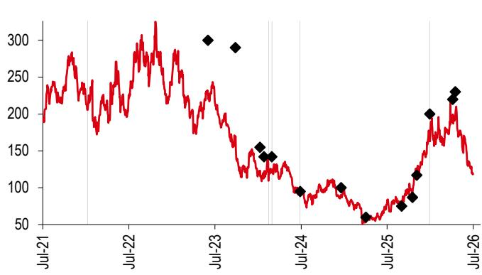  
来源：HSBC

评级与目标价格历史

<table><tr><td>从</td><td>到</td><td>日期</td><td>分析师</td></tr><tr><td>中性</td><td>积极</td><td>2022年1月26日</td><td>Santhosh Seshadri, CFA</td></tr><tr><td>积极</td><td>受限</td><td>2024年3月5日</td><td></td></tr><tr><td>受限</td><td>积极</td><td>2024年3月19日</td><td>Santhosh Seshadri, CFA</td></tr><tr><td>积极</td><td>中性</td><td>2024年7月17日</td><td>Santhosh Seshadri, CFA</td></tr><tr><td>中性</td><td>积极</td><td>2026年1月18日</td><td>Ishan Jain</td></tr><tr><td>目标价格</td><td>数值</td><td>日期</td><td>分析师</td></tr><tr><td>价格1</td><td>300.00</td><td>2023年6月22日</td><td>Santhosh Seshadri, CFA</td></tr><tr><td>价格2</td><td>290.00</td><td>2023年10月16日</td><td>Santhosh Seshadri, CFA</td></tr><tr><td>价格3</td><td>155.00</td><td>2024年1月29日</td><td>Santhosh Seshadri, CFA</td></tr><tr><td>价格4</td><td>142.00</td><td>2024年2月15日</td><td>Santhosh Seshadri, CFA</td></tr><tr><td>价格5</td><td>受限</td><td>2024年3月5日</td><td></td></tr><tr><td>价格6</td><td>142.00</td><td>2024年3月19日</td><td>Santhosh Seshadri, CFA</td></tr><tr><td>价格7</td><td>95.00</td><td>2024年7月17日</td><td>Santhosh Seshadri, CFA</td></tr><tr><td>价格8</td><td>100.00</td><td>2025年1月7日</td><td>Santhosh Seshadri, CFA</td></tr><tr><td>价格9</td><td>60.00</td><td>2025年4月22日</td><td>Santhosh Seshadri, CFA</td></tr><tr><td>价格10</td><td>75.00</td><td>2025年9月21日</td><td>Sriharsha Pappu</td></tr><tr><td>价格11</td><td>87.00</td><td>2025年11月6日</td><td>Ishan Jain</td></tr><tr><td>价格12</td><td>117.00</td><td>2025年11月24日</td><td>Ishan Jain</td></tr><tr><td>价格13</td><td>200.00</td><td>2026年1月18日</td><td>Ishan Jain</td></tr><tr><td>价格14</td><td>220.00</td><td>2026年4月26日</td><td>Ishan Jain</td></tr><tr><td>价格15</td><td>230.00</td><td>2026年5月7日</td><td>Ishan Jain</td></tr></table>

Lithium Americas Corp (LAC.N) 股价表现（美元）与HSBC评级历史  
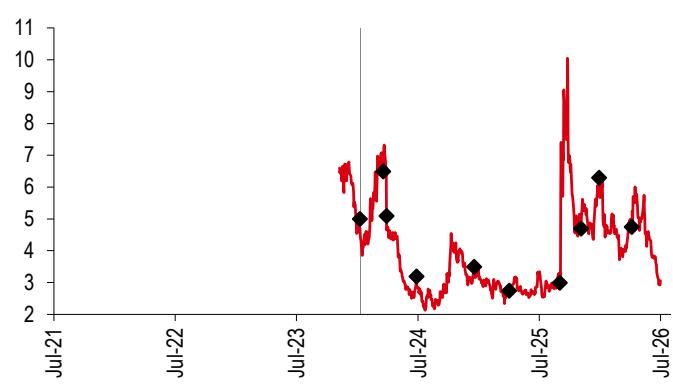  
来源：HSBC

评级与目标价格历史

<table><tr><td>从</td><td>到</td><td>日期</td><td>分析师</td></tr><tr><td>不适用</td><td>中性</td><td>2024年1月29日</td><td>Santhosh Seshadri, CFA</td></tr><tr><td>目标价格</td><td>数值</td><td>日期</td><td>分析师</td></tr><tr><td>价格1</td><td>5.00</td><td>2024年1月29日</td><td>Santhosh Seshadri, CFA</td></tr><tr><td>价格2</td><td>6.50</td><td>2024年4月8日</td><td>Santhosh Seshadri, CFA</td></tr><tr><td>价格3</td><td>5.10</td><td>2024年4月18日</td><td>Santhosh Seshadri, CFA</td></tr><tr><td>价格4</td><td>3.20</td><td>2024年7月17日</td><td>Santhosh Seshadri, CFA</td></tr><tr><td>价格5</td><td>3.50</td><td>2025年1月7日</td><td>Santhosh Seshadri, CFA</td></tr><tr><td>价格6</td><td>2.75</td><td>2025年4月22日</td><td>Santhosh Seshadri, CFA</td></tr><tr><td>价格7</td><td>3.00</td><td>2025年9月21日</td><td>Sriharsha Pappu</td></tr><tr><td>价格8</td><td>4.70</td><td>2025年11月24日</td><td>Ishan Jain</td></tr><tr><td>价格9</td><td>6.30</td><td>2026年1月18日</td><td>Ishan Jain</td></tr><tr><td>价格10</td><td>4.75</td><td>2026年4月26日</td><td>Ishan Jain</td></tr><tr><td colspan="4">来源：HSBC</td></tr></table>

来源：HSBC

来源：HSBC

Lithium Argentina AG (LAR.N) 股价表现（美元）与HSBC评级历史  
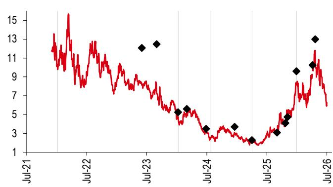  
来源：HSBC

评级与目标价格历史

<table><tr><td>从</td><td>到</td><td>日期</td><td>分析师</td></tr><tr><td>不适用</td><td>积极</td><td>2022年1月26日</td><td>Santhosh Seshadri, CFA</td></tr><tr><td>积极</td><td>中性</td><td>2024年1月29日</td><td>Santhosh Seshadri, CFA</td></tr><tr><td>中性</td><td>积极</td><td>2024年8月14日</td><td>Santhosh Seshadri, CFA</td></tr><tr><td>积极</td><td>中性</td><td>2025年4月22日</td><td>Santhosh Seshadri, CFA</td></tr><tr><td>中性</td><td>积极</td><td>2026年1月18日</td><td>Ishan Jain</td></tr><tr><td>目标价格</td><td>数值</td><td>日期</td><td>分析师</td></tr><tr><td>价格1</td><td>12.08</td><td>2023年6月22日</td><td>Santhosh Seshadri, CFA</td></tr><tr><td>价格2</td><td>12.48</td><td>2023年9月20日</td><td>Santhosh Seshadri, CFA</td></tr><tr><td>价格3</td><td>5.25</td><td>2024年1月29日</td><td>Santhosh Seshadri, CFA</td></tr><tr><td>价格4</td><td>5.60</td><td>2024年3月22日</td><td>Santhosh Seshadri, CFA</td></tr><tr><td>价格5</td><td>3.50</td><td>2024年7月17日</td><td>Santhosh Seshadri, CFA</td></tr><tr><td>价格6</td><td>3.70</td><td>2025年1月7日</td><td>Santhosh Seshadri, CFA</td></tr><tr><td>价格7</td><td>2.30</td><td>2025年4月22日</td><td>Santhosh Seshadri, CFA</td></tr><tr><td>价格8</td><td>3.10</td><td>2025年9月21日</td><td>Sriharsha Pappu</td></tr><tr><td>价格9</td><td>4.10</td><td>2025年11月11日</td><td>Ishan Jain</td></tr><tr><td>价格10</td><td>4.75</td><td>2025年11月24日</td><td>Ishan Jain</td></tr><tr><td>价格11</td><td>9.60</td><td>2026年1月18日</td><td>Ishan Jain</td></tr><tr><td>价格12</td><td>10.25</td><td>2026年4月26日</td><td>Ishan Jain</td></tr><tr><td>价格13</td><td>13.00</td><td>2026年5月12日</td><td>Ishan Jain</td></tr></table>

SQM (SQM.N) 股价表现（美元）与HSBC评级历史  
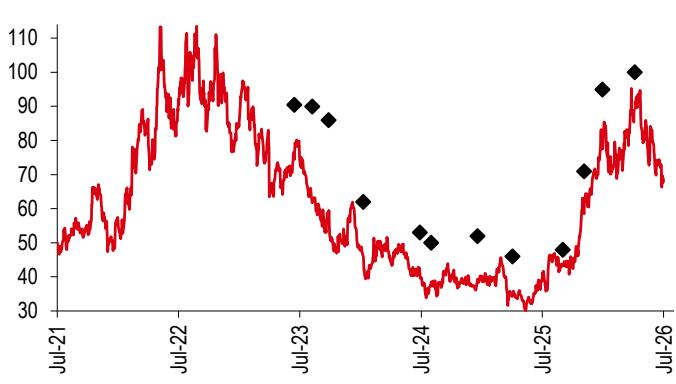  
评级与目标价格历史  
来源：HSBC

<table><tr><td>从</td><td>到</td><td>日期</td><td>分析师</td></tr><tr><td>谨慎</td><td>积极</td><td>2020年10月20日</td><td>Alexandre Falcao</td></tr><tr><td>目标价格</td><td>数值</td><td>日期</td><td>分析师</td></tr><tr><td>价格1</td><td>90.50</td><td>2023年7月5日</td><td>Santhosh Seshadri, CFA</td></tr><tr><td>价格2</td><td>90.00</td><td>2023年8月28日</td><td>Santhosh Seshadri, CFA</td></tr><tr><td>价格3</td><td>86.00</td><td>2023年10月16日</td><td>Santhosh Seshadri, CFA</td></tr><tr><td>价格4</td><td>62.00</td><td>2024年1月29日</td><td>Santhosh Seshadri, CFA</td></tr><tr><td>价格5</td><td>53.00</td><td>2024年7月17日</td><td>Santhosh Seshadri, CFA</td></tr><tr><td>价格6</td><td>50.00</td><td>2024年8月21日</td><td>Santhosh Seshadri, CFA</td></tr><tr><td>价格7</td><td>52.00</td><td>2025年1月7日</td><td>Santhosh Seshadri, CFA</td></tr><tr><td>价格8</td><td>46.00</td><td>2025年4月22日</td><td>Santhosh Seshadri, CFA</td></tr><tr><td>价格9</td><td>48.00</td><td>2025年9月21日</td><td>Sriharsha Pappu</td></tr><tr><td>价格10</td><td>71.00</td><td>2025年11月24日</td><td>Ishan Jain</td></tr><tr><td>价格11</td><td>95.00</td><td>2026年1月18日</td><td>Ishan Jain</td></tr><tr><td>价格12</td><td>100.00</td><td>2026年4月26日</td><td>Ishan Jain</td></tr></table>

SQM (SQM\_pb.SN) 股价表现（智利比索）与HSBC评级历史  
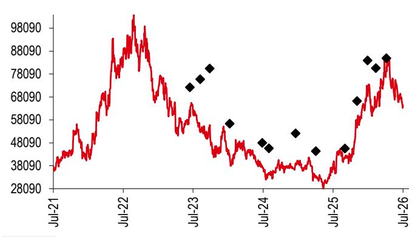

评级与目标价格历史

<table><tr><td>从</td><td>到</td><td>日期</td><td>分析师</td></tr><tr><td>谨慎</td><td>积极</td><td>2020年10月20日</td><td>Alexandre Falcao</td></tr><tr><td>目标价格</td><td>数值</td><td>日期</td><td>分析师</td></tr><tr><td>价格1</td><td>72340</td><td>2023年7月5日</td><td>Santhosh Seshadri, CFA</td></tr><tr><td>价格2</td><td>75912</td><td>2023年8月28日</td><td>Santhosh Seshadri, CFA</td></tr><tr><td>价格3</td><td>80550</td><td>2023年10月16日</td><td>Santhosh Seshadri, CFA</td></tr><tr><td>价格4</td><td>56480</td><td>2024年1月29日</td><td>Santhosh Seshadri, CFA</td></tr><tr><td>价格5</td><td>48134</td><td>2024年7月17日</td><td>Santhosh Seshadri, CFA</td></tr><tr><td>价格6</td><td>45787</td><td>2024年8月21日</td><td>Santhosh Seshadri, CFA</td></tr><tr><td>价格7</td><td>52265</td><td>2025年1月7日</td><td>Santhosh Seshadri, CFA</td></tr><tr><td>价格8</td><td>44480</td><td>2025年4月22日</td><td>Santhosh Seshadri, CFA</td></tr><tr><td>价格9</td><td>45700</td><td>2025年9月21日</td><td>Sriharsha Pappu</td></tr><tr><td>价格10</td><td>66360</td><td>2025年11月24日</td><td>Ishan Jain</td></tr><tr><td>价格11</td><td>84070</td><td>2026年1月18日</td><td>Ishan Jain</td></tr><tr><td>价格12</td><td>80750</td><td>2026年3月2日</td><td>Ishan Jain</td></tr><tr><td>价格13</td><td>85000</td><td>2026年4月26日</td><td>Ishan Jain</td></tr><tr><td colspan="4">来源：HSBC</td></tr></table>

来源：HSBC

要查看HSBC在过去12个月内发布的所有独立基本面评级/建议列表，以及我们发布非基本面建议（仅适用于固定收益和货币研究）的季度分布位置，请使用以下链接访问披露页面：

## HSBC私人银行客户：www.research.privatebank.hsbc.com/Disclosures

## 所有其他客户：www.research.hsbc.com/A/Disclosures

## HSBC及分析师披露

## 披露清单

<table><tr><td>公司</td><td>代码</td><td>近期报价</td><td>报价日期</td><td>披露编号</td></tr><tr><td>ALBEMARLE CORPORATION</td><td>ALB.N</td><td>118.62</td><td>2026年7月21日</td><td>7</td></tr><tr><td>LITHIUM AMERICAS CORP</td><td>LAC.N</td><td>3.06</td><td>2026年7月21日</td><td>-</td></tr><tr><td>LITHIUM ARGENTINA AG</td><td>LAR.N</td><td>6.29</td><td>2026年7月21日</td><td>-</td></tr><tr><td>SQM</td><td>SQM.N</td><td>68.84</td><td>2026年7月21日</td><td>7</td></tr></table>

1 HSBC在过去12个月内曾担任该公司证券公开发行的主承销商或联合主承销商。

2 HSBC预计在未来3个月内将寻求或有意向从该公司获得投资银行服务报酬。

3 在本报告发布时，HSBC Securities (USA) Inc. 是该公司的证券做市商。

4 截至2026年6月30日，HSBC实益持有该公司一类普通股证券的1%或以上。

5 该公司曾为HSBC客户，或在过去12个月内曾为HSBC客户且/或就投资银行服务向HSBC支付报酬。

6 该公司曾为HSBC客户，或在过去12个月内曾为HSBC客户且/或就非投资银行证券相关服务向HSBC支付报酬。

7 该公司曾为HSBC客户，或在过去12个月内曾为HSBC客户且/或就非证券服务向HSBC支付报酬。

8 覆盖分析师在过去12个月内曾从该公司获得报酬。

9 覆盖分析师或其家庭成员持有该公司证券的财务权益，详见下文。

10 覆盖分析师或其家庭成员是该公司的官员、董事或监事会成员，详见下文。

11 在本报告发布时，HSBC是该公司证券和/或该公司相关证券的非美国做市商。

12 截至2026年7月17日，根据SSR方法计算，HSBC实益持有该公司总已发行股本的净多头头寸超过0.5%。

13 截至2026年7月17日，根据SSR方法计算，HSBC实益持有该公司总已发行股本的净空头头寸超过0.5%。

14 HSBC前海证券有限公司持有一类普通股证券的1%或以上。

HSBC及其关联方将不时以委托或代理身份向客户买卖本报告所述公司的证券/工具（包括股权和债务及其衍生品），或担任这些证券/工具的做市商或流动性提供者。

分析师、经济学家和策略师的薪酬部分参照HSBC的盈利能力（包括投资银行、销售与交易以及自营交易收入）确定。

是否更新本分析以及更新时间表未预先确定。

非美国分析师可能不是HSBC Securities (USA) Inc. 的关联人士，因此可能不受FINRA规则2241或2242关于与主题公司沟通、公开露面以及分析师持有证券交易限制的约束。

某些司法辖区（如美国、欧盟、英国等）实施的经济制裁法律可能禁止受管辖人员从事某些类型的投资，包括交易或买卖特定发行人、行业或地区的证券。本报告不构成就此类法律提供建议，也不应被解释为引诱违反此类法律进行证券交易。

关于本报告提及的任何公司的披露信息，请参见最近发布在 www.hsbcnet.com/research 上的关于该公司的研究报告。HSBC私人银行客户应就其他研究报告查询联系其客户经理。要了解用于制作本报告的专有模型详情，请联系署名分析师。

## 附加披露

1 本报告日期为2026年7月23日。

2 除报告另有注明不同日期或具体时间外，本报告包含的所有市场数据均以2026年7月21日收盘为准。

3 HSBC已建立程序以识别和管理与研究业务相关的潜在利益冲突。HSBC的分析师及其他参与研究编制和分发的员工，其管理层级独立于HSBC的投资银行业务。投资银行、自营交易和研究业务之间设有信息隔离墙程序，以确保任何机密和/或价格敏感信息得到适当处理。

4 不得使用本文档中的任何数据作为参考，用于 (i) 确定贷款协议或其他金融合同或工具项下的应付利息或其他到期金额，(ii) 确定金融工具的买卖、交易或赎回价格或金融工具的价值，和/或 (iii) 衡量金融工具或投资基金的表现。

## 生产与分发披露

1. 本报告于GMT时间2026年7月22日15:56由作者制作并签署。

2. 如需查看本报告首次分发的时间，请参见披露页面：[https://www.research.hsbc.com/R/34/WQ6dKXR](https://www.research.hsbc.com/R/34/WQ6dKXR)

# 免责声明

截至2026年5月13日的法律实体：

HSBC Bank plc; HSBC Continental Europe; HSBC Continental Europe SA, Germany; HSBC Bank Middle East Limited, DIFC; HSBC Bank Middle East Limited, Dubai branch; HSBC Yatirim Menkul Degerler AS, Istanbul; The Hongkong and Shanghai Banking Corporation Limited, Hong Kong; The Hongkong and Shanghai Banking Corporation Limited, Singapore Branch; The Hongkong and Shanghai Banking Corporation Limited, Seoul Securities Branch; The Hongkong and Shanghai Banking Corporation Limited, Seoul Branch; HSBC Qianhai Securities Limited; HSBC Securities (Taiwan) Corporation Limited; HSBC Securities and Capital Markets (India) Private Limited, Mumbai; HSBC Bank Australia Limited; HSBC Securities (USA) Inc., New York; HSBC México, SA, Institución de Banca Múltiple, Grupo Financiero HSBC; Banco HSBC SA

报告发布机构

HSBC Securities and Capital Markets (India) Private Limited

注册办公地址

52/60 Mahatma Gandhi Road

Fort, Mumbai 400 001, India

电话：+91 22 2267 4921

传真：+91 22 2263 1983

网站：www.research.hsbc.com

SEBI注册号：INH000001287

公司识别号：U67120MH1994PTC081575

本文档由HSBC Securities and Capital Markets (India) Private Limited（“HSBC”）为其客户信息发布。HSBC Securities and Capital Markets (India) Private Limited 注册为“研究分析师”（注册号INH000001287）、商人银行（注册号INM000010353）和股票经纪人（统一注册号INZ000234533），受印度证券交易委员会监管。如果由HSBC关联方的客户收到，则其提供受接收方与该关联方之间的业务条款约束。本文档不是也不应被解释为出售或招揽购买或认购任何投资产品的要约。HSBC基于其认为可靠的来源信息编制本文档，但未独立验证；HSBC不作任何保证、陈述或担保，也不对其准确性或完整性承担任何责任。意见仅代表HSBC部门的观点，如有变更，恕不另行通知。研究分析师不时会实地走访覆盖的发行人。HSBC政策禁止研究分析师接受发行人为此类访问支付的费用或差旅报销。HSBC及其关联方和/或其高级职员、董事和员工可能持有本文档提及的任何证券（或相关投资）的头寸，并可能不时增持或减持此类证券（或投资）。HSBC及其关联方可能担任做市商，或已承销本文档所讨论公司的证券（或相关投资），可能按本金向客户出售或从客户购买这些证券，并可能就这些公司寻求或提供投资银行或承销服务，还可能在这些公司的监事会或任何其他委员会中拥有代表。关联方详情可向合规官索取，或关于HSBC Securities and Capital Markets (India) Private Limited 发布报告的投诉可报告至合规官：Neha Malviya，邮箱：neha.malviya@hsbc.co.in，电话：+91 22 4089 1536。研究报告中的信息和意见基于公开可得信息以及发布时适用的税率，税率可能随时变化。过往业绩不一定是未来业绩的指引。任何投资或收入的价值可能下跌也可能上涨，读者可能无法收回全部投资金额。如果投资以研究接收方当地货币以外的货币计价，汇率变动可能对该投资的价值、价格或收入产生不利影响。对于没有认可市场的投资，读者可能难以出售其投资或获得有关其价值或风险程度的可靠信息。SEBI的注册和NISM的认证绝不保证中介的表现或向读者提供任何回报保证。证券市场投资存在市场风险。投资前请仔细阅读所有相关文件。本文档旨在整体分发。除非管辖法律允许，否则如果您希望使用HSBC集团服务进行本文档提及的任何投资交易，必须联系您所在司法管辖区的HSBC集团成员。

在英国，由HSBC Bank plc 向其客户（定义见FCA规则）及其关联方客户分发，仅用于信息目的。本文档不排除也不限制HSBC Bank plc 根据《2000年金融服务与市场法》或FCA及PRA规则对客户承担的任何责任。选择与不是HSBC Bank plc 代表的人交易的接收方将不享有英国监管制度提供的保护。HSBC Bank plc 受金融行为监管局和审慎监管局监管。

在欧洲经济区，由HSBC Continental Europe 或接收方接受相关服务的其他HSBC关联方分发。

在日本，由HSBC Securities (Japan) Co., Ltd. 分发。在香港，由香港上海HSBC银行有限公司在其受香港监管业务中向其机构及专业客户分发；除非另有许可，否则不应向香港零售客户分发。香港上海HSBC银行有限公司不声明本文档中提及的产品或服务适用于香港人士，或根据当地法律对任何特定人士合适。此类接收方的所有查询均应向香港上海HSBC银行有限公司提出。在韩国，由香港上海HSBC银行有限公司首尔证券分行或香港上海HSBC银行有限公司首尔分行向《金融投资服务与资本市场法》第9条定义的“专业读者”分发一般信息。本文档并非FSCMA定义下的招股说明书。不得出于任何目的进一步整体或部分分发。HBAP SLS 和 HBAP SEL 均受韩国金融服务委员会和金融监督院监管。在新加坡，由香港上海HSBC银行有限公司新加坡分行向机构读者或《2001年证券与期货法》第274条和第304条规定的其他人士以及根据第275条和第305条规定条件的认可读者和其他人士分发一般信息。仅经济学或货币报告旨在分发给非认可读者、专家读者或机构读者（定义见SFA）的人士。香港上海HSBC银行有限公司新加坡分行对报告内容承担法律责任。本文档并非SFA定义下的招股说明书。不得出于任何目的进一步整体或部分分发。香港上海HSBC银行有限公司新加坡分行受新加坡金融管理局监管。新加坡接收方应就本文档引起或相关事宜联系“香港上海HSBC银行有限公司新加坡分行”代表。有关联系详情，请参阅香港上海HSBC银行有限公司新加坡分行网站 www.business.hsbc.com.sg。在澳大利亚，由香港上海HSBC银行有限公司（ABN 65 117 925 970, AFSL 301737）向其“批发”客户（定义见《2001年公司法》）分发一般信息。如果向零售客户分发，则由HSBC Bank Australia Limited（ABN 48 006 434 162, AFSL 232595）分发。这些实体不声明本文档中提及的产品或服务适用于澳大利亚人士，或根据当地法律对任何特定人士合适。未考虑任何接收方的特定投资目标、财务状况或特定需求。

HSBC Securities (USA) Inc. 对其非美国外国关联方编写的本研究报告的内容负责。在任何情况下，本文所含信息均不应被解释为研究交流，且不针对接收方的需求。所有收到和/或访问本报告并希望就本文讨论的任何证券进行交易的美国人士，应与美国的HSBC Securities (USA) Inc. 而非本报告发布方的非美国外国关联方进行交易。HSBC México, S.A., Institución de Banca Múltiple, Grupo Financiero HSBC 受墨西哥财政与公共信贷部以及国家银行与证券委员会授权和监管。在巴西，由Banco HSBC SA（“HSBC巴西”）和/或其关联方分发。根据巴西证券交易委员会第20/2021号决议要求，潜在利益冲突 (i) HSBC巴西和/或其关联方与 (ii) 负责撰写本报告的分析师之间的关系已在上方“HSBC及分析师披露”图表中说明。如果您是HSBC国际财富及卓越银行（包括HSBC私人银行）的客户，您仅在以下情况下有资格接收此出版物：(i) 您已获得适用的HSBC法律实体批准接收相关研究出版物；(ii) 您已同意适用的HSBC实体的条款和条件和/或客户声明以获取研究；(iii) 您已同意任何其他网上银行、手机银行和/或投资服务的条款和条件，通过该等服务您将访问研究出版物（与 (ii) 合称“条款”）。如果您不符合上述资格要求，请忽略此出版物，如果您是IWPB客户，请通知您的客户经理或致电相关客户热线。分发此出版物是您与之达成条款的HSBC实体的相对少见责任。接收研究出版物严格受条款约束，并受IWPB可能建议的任何其他条件或免责声明约束。© 版权所有 2026，HSBC Securities and Capital Markets (India) Private Limited，保留所有权利。未经HSBC Securities and Capital Markets (India) Private Limited 事先书面许可，不得以任何形式或方式（电子、机械、影印、录音或其他）复制、存储在检索系统中或传播本出版物的任何部分。

## 与我们及时、相关的思想领导力保持联系

## 下载HSBC全球研究应用

来自Apple App Store或Google Play  
该应用提供及时相关的精选报告、多媒体内容及即将举行的活动

## 登录HSBC全球研究网站

要访问所有报告和视频，请访问 research.hsbc.com

## 在LinkedIn上关注HSBC全球研究

搜索 #HSBCResearch 免费查看可轻松与客户和潜在客户分享的见解

## 订阅并收听

在Apple、Spotify或YouTube上收听HSBC Global Investment Research的Under the Banyan Tree

在Apple、Spotify或YouTube上收听HSBC Global Investment Research的The Macro Brief

## 新闻简报

订阅我们每月免费查看的Open Pass报告和访谈汇编，或阅读涵盖九个关键主题的片段式研究摘要《Talking Points》
