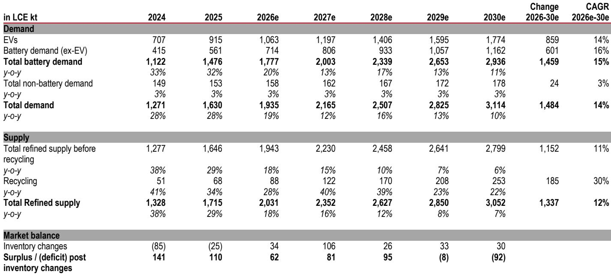
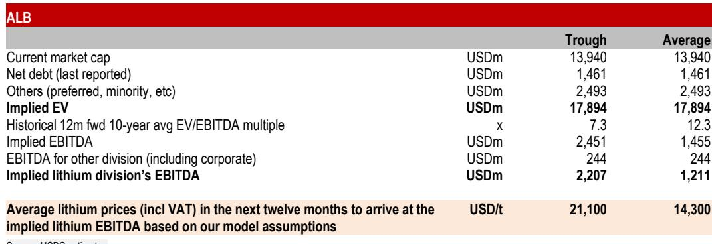
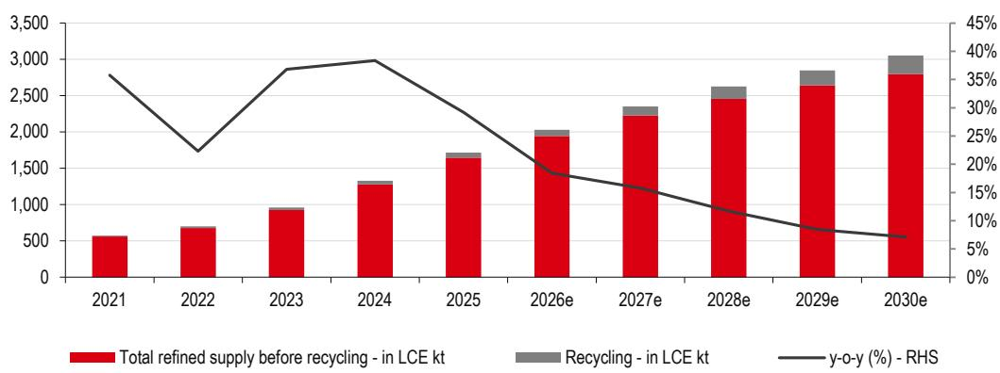

# HSBC：报价数据与市场动态观察

中国电池级碳酸锂报价自2026年5月高点回落约28%，但年内仍累计上涨约25%。HSBC在最新锂行业研究报告中指出，报价回调并非孤立现象——铜、铝等主要工业金属同期均从高位回落。更值得关注的信号是，当前锂矿企业的权益市场定价隐含的未来12个月锂平均报价仅为每吨13500-14000美元，较现货低约33%-37%，而HSBC同期预估为每吨19300美元。这意味着市场对锂价节奏变化的定价已明显超过机构基准预期。

## 1. 储能电池取代电动车成为需求增量主引擎

2026年上半年，中国电池总销量（含出口）达979GWh，同比增长49%。其中，电动车电池661GWh，增长36%；储能电池318GWh，增长83%。储能已从边缘角色转变为电池需求增量的主要贡献者。

HSBC认为，储能需求的结构正在发生变化。传统上，储能增长依赖可再生能源并网政策和电网改造，但一个新变量正在浮现：AI工作负载的快速扩张。尽管AI数据中心在2025年仅占储能电池需求的2%，但AI相关电力消耗的加速增长正在重塑储能部署的研究逻辑。由于电力可靠性对AI基础设施至关重要，服务于这一场景的储能方案可能比传统应用对报价更不敏感。

> **KC评论：** 储能电池增速（83%）是电动车电池增速（36%）的两倍以上，且AI数据中心作为新增需求场景，其价格承受力可能高于电网级储能。这意味着锂需求结构正在从单一依赖电动车向多元化转变，储能领域的定价权可能比市场预期的更强。

## 2. 矿山重启与出口政策变化将集中影响2027年供给

供给端正在发生几个关键变化。宁德时代的江西枧下窝矿已获得全部必要许可，正在重启，其矿山及配套冶炼厂名义产能约每年10万吨碳酸锂当量，HSBC预计2026年可贡献约4.8万吨产量。

澳大利亚方面，此前因报价仍在调整而进入维护状态的Ngungaju、Bald Hill和Finniss三个项目正在恢复运营。满产状态下，这三个项目合计可贡献每年约500-600千吨锂辉石精矿（约6.5-8万吨碳酸锂当量）。考虑到产能爬坡周期，供给增量主要将在2027年体现。

津巴布韦的出口政策也出现转折。在最初宣布禁止锂精矿出口后，该国转而计划实施出口配额制，并要求企业承诺从2027年起建立锂硫酸盐加工产能。目前约11-12万吨碳酸锂当量的锂硫酸盐产能正在建设中，HSBC预计2026年下半年出货将恢复正常化，但供给的实质性提升同样要到2027年。

此外，SQM与Wesfarmers已宣布将Mt Holland项目产能从38万吨弹性较高至76万吨锂辉石精矿，建设将于2027年下半年启动，预计2030年上半年投产。全球范围内还有一批待审批项目，若获批将在2020年代末进一步增加供给。

## 3. 中国锂电消费税政策的中期影响不可忽视

中国已宣布自2026年9月1日起对锂电池征收2%的消费税，2027年9月1日起升至4%。钠离子电池、固态电池、燃料电池及部分先进太阳能电池在2028年底前免税。

HSBC认为这一政策有两个潜在影响。短期看，买家可能在2026年三季度提前采购以规避初始税率，这将在短期内提振电池出货量，进而支撑电池金属的短期需求。但中期看，尽管税率不高，政策方向明确指向鼓励非锂替代技术，这将强化市场对传统锂基化学体系多元化的激励。

## 4. 权益定价与机构预测之间存在显著分歧

HSBC通过回溯历史估值倍数，计算了当前锂矿企业报价隐含的锂价预期。以SQM为例，若按10年历史平均EV/EBITDA倍数（9.4倍）估值，当前报价隐含的未来12个月锂平均报价约为每吨13500美元；若按历史低谷倍数（5.8倍）估值，则隐含平均报价约为每吨22400美元。ALB的类似测算显示，平均倍数下隐含平均报价为每吨14300美元，低谷倍数下为每吨21100美元。

综合来看，当前权益市场定价隐含的锂平均报价约为每吨13500-14000美元，较现货低33%-37%。HSBC同期预估为每吨19300美元，明显高于市场定价。HSBC上调了2026年锂价预估，但下调了2028-2029年预估以反映更充裕的供给前景。

> **KC评论：** 权益市场与机构预测之间的价差，本质上是市场对“供给释放速度”和“需求韧性”两个变量的不同判断。市场定价更悲观，意味着如果实际需求（尤其是储能和AI相关需求）持续超预期，或供给释放慢于预期，当前权益定价可能提供了安全边际。但反之，若供给如期释放且需求节奏变化，则机构预测存在下调不确定性。

HSBC维持对SQM、ALB和LAR的公司观点，对LAC的公司观点。SQM因其运营效率、强劲资产负债表和产量增长被列为首选；ALB的成本控制与效率提升被视为在锂价节奏变化周期中的缓冲；LAR的Cauchari-Olaroz项目持续改善表明运营趋于稳定。

For informational purposes only. Portions may be generated,translated,summarized,or edited with AI assistance based on source materials and may contain omissions or errors. Please verify independently. This is not investment,legal,tax,accounting,or other professional advice.

For informational purposes only. Portions may be generated,translated,summarized,or edited with AI assistance based on source materials and may contain omissions or errors. Please verify independently. This is not investment,legal,tax,accounting,or other professional advice.

