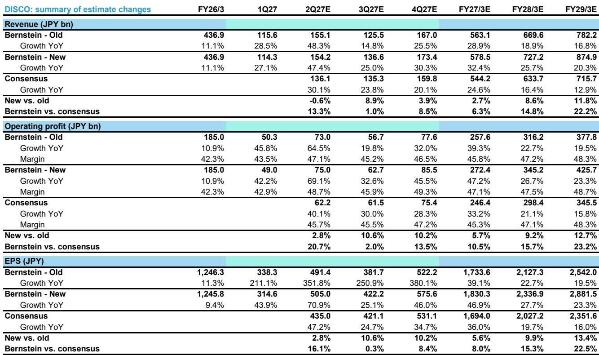
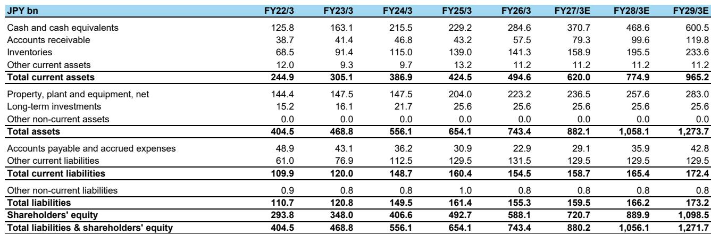
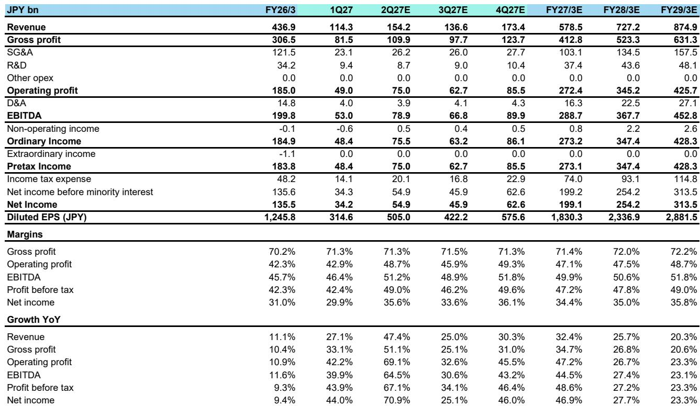

# Silicon Photonics Is No Longer a Lab Curiosity: DISCO's Q2 Guidance Reveals a Third Growth Engine Beyond HBM and OSAT

DISCO's Q2 FY27/3 shipment guidance of ¥141 billion came in 7.5% above consensus, but the more consequential signal is the emergence of Silicon Photonics as a distinct, revenue-generating application stream. For an equipment supplier whose narrative has been dominated by HBM and Chinese OSAT demand, this represents a structural broadening of the addressable market. Observers who continue to view DISCO solely on memory cycle exposure are missing the point: the company is transitioning from a single-cycle story to a multi-technology growth compounder.

The Q1 FY27/3 results already hinted at this shift. Shipment reached ¥135.9 billion, up 22.3% year-over-year, driven by a 32.7% surge in consumables and a 38.7% jump in maintenance parts. Gross margin of 71.3% substantially exceeded the company's own guidance of 68.9%, while operating margin of 42.9% beat by 330 basis points. The beat was not a one-off: management guided Q2 gross margin of 70.3%, only a 100-basis-point sequential decline, and indicated that consumables margin improvement should persist. The narrative is no longer about peak-cycle leverage; it is about sustainable margin expansion from an evolving product mix.

The critical question for observers is whether DISCO's valuation can sustain a 40x forward P/E multiple on earnings that are 9.9% above prior estimates for FY28/3. The answer depends on whether the new growth drivers — D2W hybrid bonding, V10 NAND, and especially Silicon Photonics — are one-off projects or durable revenue streams. The evidence from Q1 and Q2 guidance suggests the latter.

## DISCO's Q2 Shipment Guidance Beat Consensus by 7.5%, Driven by Structural Demand Beyond Memory

The headline figure of ¥141 billion in Q2 shipment guidance is not merely a positive variance. It represents the second consecutive quarter where DISCO's internal forecast meaningfully exceeded consensus expectations, which had been set at ¥131.1 billion. This is unusual for a company known for conservative guidance. More importantly, the composition of demand reveals a diversification that reduces the company's historical dependence on the memory cycle.

Memory applications accounted for 35% of Q1 shipment, in line with guidance. HBM remains the primary driver within memory, consistent with the broader industry buildout of high-bandwidth memory capacity for AI accelerators. But the memory share is not accelerating — it is stable. The incremental upside came from OSAT, which surprised to the upside at 35% of total shipment versus the guided 30%. This was driven by strong investment from Chinese OSAT customers, a segment that had been expected to moderate.

The OSAT surprise is instructive. Chinese semiconductor equipment demand has been subject to various factors including export controls and domestic policy shifts. Yet DISCO's exposure to China OSAT proved more resilient than anticipated. The Q2 guidance explicitly calls for a decline in OSAT as Chinese investment normalizes, but the Q1 beat suggests the base of demand is higher than previously modeled. The company's revenue to China fell 25% quarter-over-quarter to ¥31 billion, but this was offset by a 57% surge in South Korea revenue to ¥12.6 billion and a 12% increase in Taiwan to ¥39 billion. The geographic rotation confirms that DISCO's order book is not concentrated in any single region.

## Silicon Photonics Represents a Multi-Stream Revenue Opportunity That Is Already Materializing in Q2

The most significant development in the Q2 guidance call was management's explicit identification of Silicon Photonics as a new growth driver. While the company declined to quantify the revenue contribution, it confirmed that SiPh-related revenue could come from multiple streams: die-to-wafer hybrid bonding, laser semiconductor processing, and optical module and transceiver manufacturing. This is not a speculative R&D project. It is a commercial activity that is already growing into Q2.

The implications are strategic. Silicon Photonics is the enabling technology for co-packaged optics in data centers, where electrical I/O bandwidth is becoming the bottleneck for AI and high-performance computing workloads. The transition from pluggable optics to co-packaged optics requires new precision processing tools for wafer-level alignment, bonding, and singulation — exactly the capabilities where DISCO's dicing, grinding, and hybrid bonding equipment excel. The company's die-to-wafer hybrid bonding technology, which was previously viewed as an HBM enabler, now has a second application in SiPh transceiver assembly.

Management also noted that the manufacturing support program — which dispatches approximately 100 personnel to customer sites — is expected to continue at a similar scale for the foreseeable future. This is a critical detail. DISCO's business model has historically relied on selling equipment and consumables, not engineering services. The decision to maintain a large field support team signals that the SiPh ramp requires close collaboration with customers, which in turn creates switching costs and recurring revenue from consumables and maintenance parts. The 38.7% year-over-year growth in maintenance parts in Q1 is consistent with this thesis: as more advanced tools are deployed in SiPh and hybrid bonding applications, the consumables attach rate increases.

## Margin Expansion Is Becoming Structural, Not Cyclical, as Consumables Profitability Improves

Q1 gross margin of 71.3% was 240 basis points above guidance, and Q2 was guided at 70.3%, only a 100-basis-point sequential decline. Operating margin of 42.9% in Q1 beat guidance of 39.6% by 330 basis points, and Q2 operating margin guidance of 43.5% exceeded consensus of 45.7% on a revenue base that was 5.6% below consensus. The apparent contradiction — lower revenue but higher margin versus consensus — is explained by the mix shift toward consumables and maintenance parts.

Consumables shipment grew 32.7% year-over-year in Q1 to ¥27.4 billion, while precision processing equipment grew only 23.0%. Maintenance parts grew even faster at 38.7%. Both segments carry higher gross margins than equipment, and their growth is more predictable because they recur with installed base utilization. Management explicitly stated that consumables margin improvement should continue into Q2. This is not a one-quarter phenomenon. As DISCO's installed base grows with the HBM, SiPh, and V10 NAND ramps, the consumables and maintenance parts revenue should grow faster than equipment revenue, creating a natural margin tailwind.

The SG&A guidance of slightly above ¥34 billion in Q2 implies operating leverage is intact. With Q1 SG&A at ¥23.1 billion, the sequential increase reflects higher personnel costs from the manufacturing support program and R&D for new applications like SiPh hybrid bonding. But the operating margin trajectory — 42.9% in Q1, guided to 43.5% in Q2, and modeled at 47.1% for the full fiscal year — suggests that revenue growth is outpacing cost growth. The company's R&D spending of ¥9.4 billion in Q1, up from ¥8.7 billion in the prior quarter, is being deployed into precisely the technologies that will drive the next growth phase.

## A Decision Framework for Observers: DISCO Is Shifting from a Cycle-Exposed Equipment Maker to a Multi-Technology Compound

The standard framework for evaluating DISCO has been a P/E multiple on peak-cycle earnings, with the cycle defined by HBM and NAND investment. That framework is becoming obsolete. The emergence of Silicon Photonics, combined with the sustained strength in consumables and the ramp of V10 NAND, creates three semi-independent growth vectors that reduce the company's sensitivity to any single end-market.

Observers should evaluate DISCO on four dimensions. First, the HBM cycle is still in its early to middle innings, with HBM4 qualification expected to drive another wave of equipment upgrades. Second, the V10 NAND ramp represents a structural increase in wafer starts for 3D NAND, which requires DISCO's grinders and dicers for layer stacking and singulation. Third, Silicon Photonics is a new application that could scale from data center optics to lidar and quantum computing over the next three to five years. Fourth, the consumables and maintenance parts business is becoming a larger share of revenue, providing a recurring revenue base that supports higher trough margins.

The estimate revisions reflect this framework. FY27/3 revenue was raised 2.7% to ¥578.5 billion, and FY28/3 revenue was raised 8.6% to ¥727.2 billion. The larger revision in the outer year captures the SiPh ramp and V10 NAND contribution. Operating profit for FY28/3 was raised 9.2% to ¥345.2 billion, implying a 47.5% operating margin.

The risk is that SiPh revenue remains immaterial for several quarters, or that Chinese OSAT demand contracts faster than expected. The report acknowledges that OSAT is guided to decline in Q2, and the company's refusal to quantify SiPh revenue creates uncertainty. But the margin trajectory and the consumables growth are observable, not speculative. The decision framework is straightforward: if SiPh scales as management implies, the current multiple is justified by the expanded addressable market. If it does not, the valuation is supported by the HBM and consumables cycle alone.

*For informational purposes only. Portions may be generated, translated, summarized, or edited with AI assistance based on source materials and may contain omissions or errors. Please verify independently. This is not professional advice.*

For informational purposes only. Portions may be generated, translated, summarized, or edited with AI assistance based on source materials and may contain omissions or errors. Please verify independently. This is not professional advice.

