# 亚太食品饮料行业观察

## 中国啤酒市场六月动态：华润啤酒增速提升，百威亚太表现持续调整

  
Euan McLeish  
+81 3 5962 9611

euan.mcleish@bernsteinsg.com

Hao Wang, CFA

+852 2123 2627

hao.wang@bernsteinsg.com

Mufei Gao

+81 3 6777 6995

mufei.gao@bernsteinsg.com

Makoto Morozumi

+81 3 6777 6972

makoto.morozumi@bernsteinsg.com

中国啤酒整体终端销售额增速从5月的+2%放缓至6月的+1%，其中餐饮渠道增速从+3%降至+1%，而非即饮渠道增速从+1%提升至+2%。燕京啤酒（未覆盖）仍为表现最突出的企业，销售额同比增长+15%；华润啤酒增速提升至+6%（5月为+3%），领先于重庆啤酒（未覆盖）的+1%。青岛啤酒降幅收窄至-1%，但百威亚太的降幅仍为-4%。根据我们的回归模型，基于第二季度至今的终端销售表现，百威亚太的降幅预计将收窄至约-3%，青岛啤酒的降幅将扩大至约-3%，而华润啤酒的回归R²仍较低，难以提供有意义的预测。

各省份表现呈现分化。广东省仍是表现较强劲的省份，整体销售额增长+9%，餐饮渠道增长+11%；山东省仍是表现相对偏弱的省份，整体下降-11%，这对青岛啤酒持续构成影响。浙江和江苏在两渠道均保持正增长，而福建省从5月的0%进一步降至-4%。按价格带划分，中高端仍是主要增长驱动力，增速为+3%；超高端仍面临一定调整，增速为-14%；主流+价格带增速略有提升。6月非即饮渠道的动能强于餐饮渠道，多数价格带恢复正增长。

华润啤酒6月销售额增速从5月的+3%提升至+6%，高于第一季度平均的+4%。增长主要来自非即饮渠道的明显回升（+8%，5月为+1%），餐饮渠道增长保持稳健在+4%。中高端仍是主要增长驱动力，广东省表现尤为突出，餐饮渠道增速提升至+46%。我们的回归模型显示，华润啤酒2026年上半年营收增速预计将提升至约2%，但需注意R²相对较低。

百威亚太6月销售额下降4%，较5月的-3%有所扩大，仍是行业内表现相对偏弱的企业之一。非即饮渠道降幅从-10%略收窄至-9%，但餐饮渠道增速从5月的+2%回落至-1%。浙江省仍是少数亮点之一，中高端趋势相对较好，但百威在广东省的表现仍落后于该省整体强劲增长。6月数据显示，百威的调整仍在持续。

青岛啤酒6月销售额同比下降1%，较5月的-2%有所改善，也好于第一季度平均的-2%。非即饮渠道保持正增长+3%，部分抵消了餐饮渠道-3%的降幅。山东省仍是最大的拖累因素，餐饮渠道销售额仍下降-15%，但广东省、福建省和陕西省的较好表现帮助收窄了整体降幅。

重庆啤酒（未覆盖）6月整体销售额同比增长放缓至+1%，低于5月和第一季度的+9%。餐饮渠道增速从+19%大幅放缓至+1%，非即饮渠道小幅改善至+1%。新疆地区保持强劲，但广东省和重庆本地的温和趋势对整体表现构成影响。

## BERNSTEIN 公司列表

<table><tr><td rowspan="2">代码</td><td rowspan="2">评级</td><td colspan="2">2026年7月23日</td><td rowspan="2">目标价</td><td rowspan="2">TTM相对表现</td><td colspan="4">调整后每股收益</td><td colspan="3">调整后市盈率（倍）</td></tr><tr><td>货币</td><td>收盘价</td><td>货币</td><td>2025A</td><td>2026E</td><td>2027E</td><td>2025A</td><td>2026E</td><td>2027E</td></tr><tr><td>1876.HK (百威亚太)</td><td>M</td><td>HKD</td><td>6.59</td><td>7.30</td><td>(53.1)%</td><td>USD</td><td>0.04</td><td>0.05</td><td>0.05</td><td>22.7</td><td>18.6</td><td>16.2</td></tr><tr><td>原目标价</td><td></td><td></td><td></td><td>7.40</td><td></td><td></td><td></td><td></td><td></td><td></td><td></td><td></td></tr><tr><td>291.HK (华润啤酒)</td><td>O</td><td>HKD</td><td>23.88</td><td>47.50</td><td>(41.3)%</td><td>CNY</td><td>1.80</td><td>2.00</td><td>2.17</td><td>11.5</td><td>10.3</td><td>9.5</td></tr><tr><td>原目标价</td><td></td><td></td><td></td><td>46.00</td><td></td><td></td><td></td><td>1.98</td><td></td><td></td><td></td><td></td></tr><tr><td>168.HK (青岛啤酒)</td><td>O</td><td>HKD</td><td>45.80</td><td>69.00</td><td>(42.3)%</td><td>CNY</td><td>3.36</td><td>3.43</td><td>3.51</td><td>11.8</td><td>11.5</td><td>11.3</td></tr><tr><td>原目标价</td><td></td><td></td><td></td><td>71.00</td><td></td><td></td><td></td><td>3.53</td><td>3.60</td><td></td><td></td><td></td></tr><tr><td>600600.CH (青岛啤酒)</td><td>M</td><td>CNY</td><td>53.85</td><td>60.00</td><td>(50.6)%</td><td>CNY</td><td>3.36</td><td>3.43</td><td>3.51</td><td>16.0</td><td>15.7</td><td>15.3</td></tr><tr><td>原目标价</td><td></td><td></td><td></td><td>62.00</td><td></td><td></td><td></td><td>3.53</td><td>3.60</td><td></td><td></td><td></td></tr><tr><td>ASIAX</td><td></td><td></td><td>1,907.19</td><td></td><td></td><td></td><td></td><td></td><td></td><td></td><td></td><td></td></tr></table>

目标价调整 / 盈利预测调整以粗体显示

O - 优于市场，M - 与市场同步，U - 弱于市场，NR - 未评级，CS - 暂停覆盖

来源：彭博、Bernstein 预测与分析

## 研究观点

我们对华润啤酒给予优于市场评级，目标价HK$47.5（此前为HK$46.0），因我们将FY26E每股收益上调1%以反映上半年表现，同时维持18.5倍远期市盈率的目标倍数。模型：291.HK

我们对青岛啤酒H股给予优于市场评级，目标价HK$69；对青岛啤酒A股给予与市场同步评级，目标价RMB60（此前分别为HK$71和RMB62），因我们将每股收益预测下调约3%以反映第二季度表现，同时维持17.0倍远期市盈率的目标倍数。模型：168.HK

我们对百威亚太给予与市场同步评级，目标价HK$7.30（此前为HK$7.40）。我们将每股收益预测下调约1%以反映第二季度表现，维持17.5倍远期市盈率的目标倍数。模型：1876.HK

## 详细分析

图表1：根据我们的回归模型，华润啤酒上半年营收增速预计将提升至约2%，百威中国第二季度降幅预计收窄至约-3%，青岛啤酒降幅预计扩大至约-3%

中国啤酒第一季度实际与第二季度基于回归的营收同比增速预估

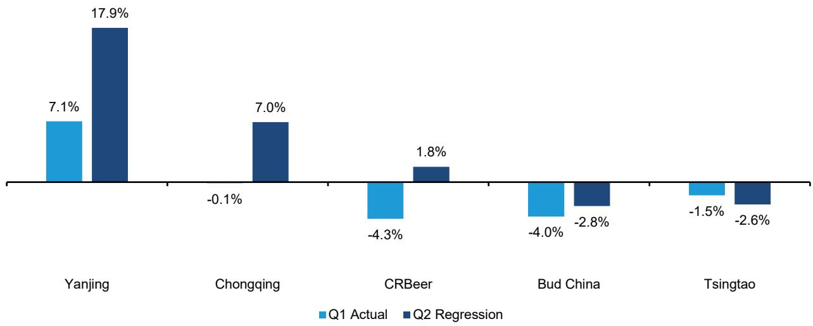  
回归基于华润啤酒上半年数据及其他公司第二季度数据；华润啤酒的两个柱形分别为2025年下半年实际值和2026年上半年基于回归的预估值  
来源：BigOne Lab、公司报告、Bernstein 分析与预测  
图表2：BigOne Lab季度啤酒销售额增速与公司报告营收增速之间存在73-96%的相关性  
BigOne Lab全国终端销售额同比增速与报告啤酒营收同比增速的回归R²（22Q3-26Q1）

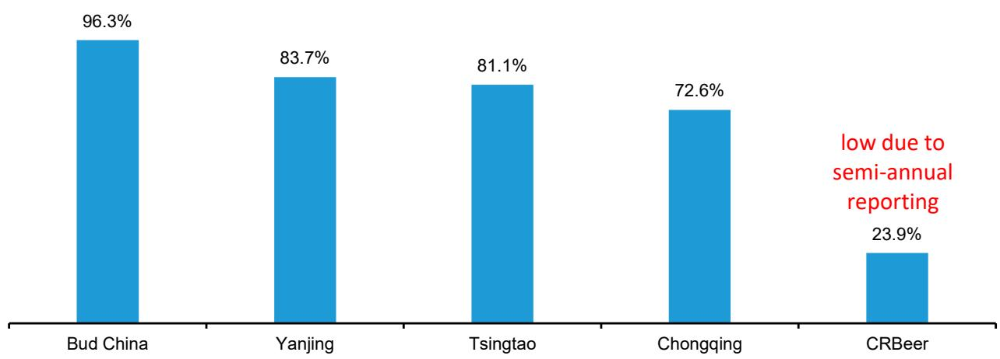  
华润啤酒为半年度报告  
来源：BigOne Lab、公司报告、Bernstein 分析

## 月度概览

我们的BigOne Lab中国啤酒数据集利用POS终端销售数据追踪全国18万家超市门店和23万家餐饮门店的菜单二维码数据，可每月按省份和价格带追踪各啤酒企业的终端销售额表现。该数据集不覆盖夜场渠道。

2026年6月，截至6月30日的三个月滚动全国啤酒整体销售额增速保持在+2%（图表3）。单月来看，6月销售额同比增速从5月的+2%放缓至+1%，餐饮渠道增速放缓而非即饮渠道持续改善。按企业划分，燕京啤酒（未覆盖）仍是表现较强的企业，销售额增速提升至+15%；华润啤酒为+6%；重庆啤酒放缓至+1%。青岛啤酒降幅收窄至-1%，而百威中国进一步降至-4%，仍是主要啤酒企业中表现相对偏弱的企业。

展望7月，华润啤酒和百威中国的同比基数将有所提升，而青岛啤酒的基数则相对较低，重庆啤酒也面临较温和的对比基数（图表14）。

图表3：2026年6月全国啤酒销售额增速小幅放缓至+1%

中国啤酒整体销售额增速（三个月滚动/月度同比%）
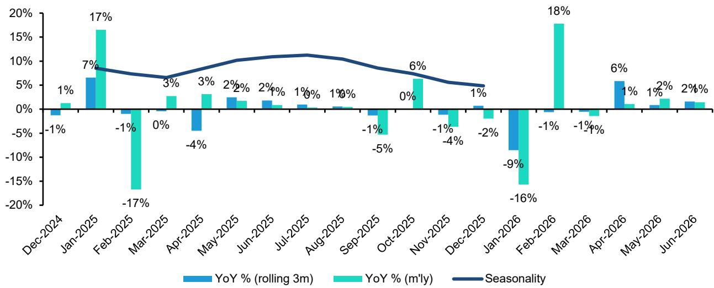  
来源：BigOne Lab、Bernstein 分析

图表4：尽管基数较低，6月餐饮渠道增速仍放缓至同比+1%
中国餐饮渠道啤酒销售额月度同比增速%
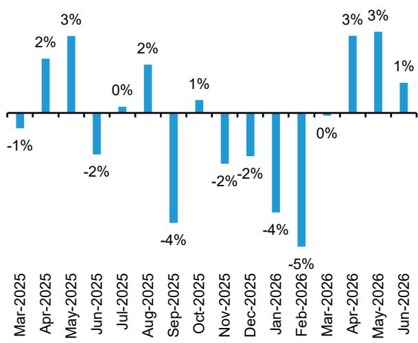  
来源：BigOne Lab、Bernstein 分析

图表5：6月非即饮渠道销售额增速进一步提升至同比+2%
中国非即饮渠道啤酒销售额月度同比增速%
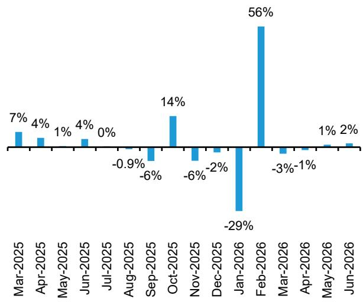  
来源：BigOne Lab、Bernstein 分析

图表6：燕京啤酒第二季度表现增强，百威中国仍处于调整但降幅收窄
各啤酒企业中国整体啤酒销售额同比增速%
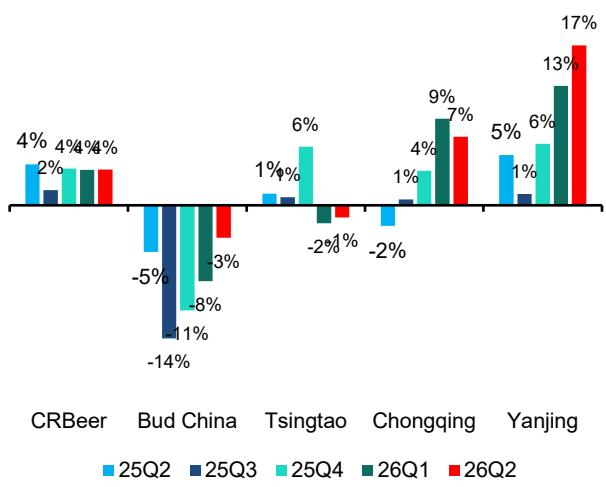  
Bernstein 未覆盖燕京啤酒或重庆啤酒  
来源：BigOne Lab、Bernstein 分析  
图表7：6月华润啤酒和燕京啤酒销售额增速提升，百威中国进一步调整

各啤酒企业中国整体啤酒销售额同比增速%
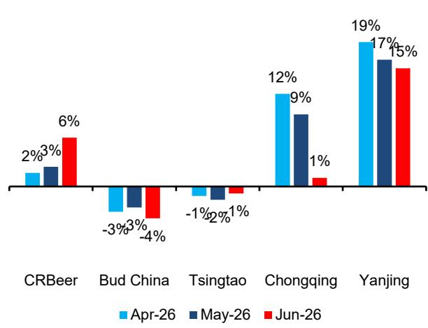  
来源：BigOne Lab、Bernstein 分析

图表8：燕京啤酒在多数价格带表现领先，百威中国除中高端和主流+外多数价格带表现偏弱

2026年5月各啤酒企业分价格带啤酒销售额同比%（两渠道合计）

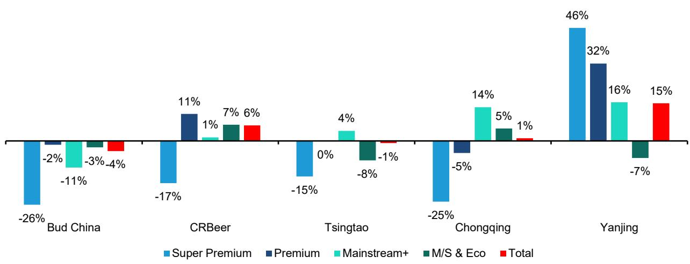  
来源：BigOne Lab、Bernstein 分析  
图表9：燕京啤酒和华润啤酒第二季度市场份额提升领先，百威中国份额降幅收窄
中国啤酒整体销售额市场份额变化（同比基点）

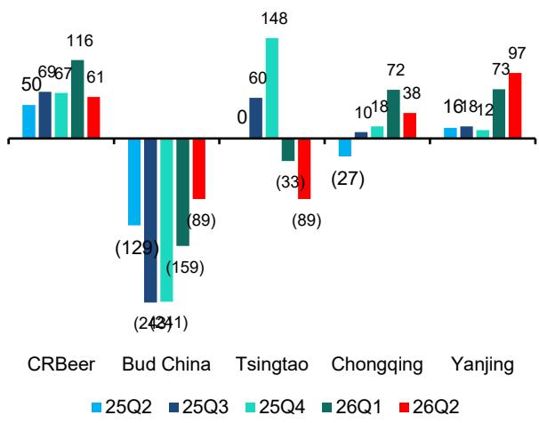  
来源：BigOne Lab、Bernstein 分析  
图表10：6月华润啤酒和燕京啤酒市场份额继续提升，百威中国份额持续调整
中国啤酒整体销售额市场份额变化（同比基点）

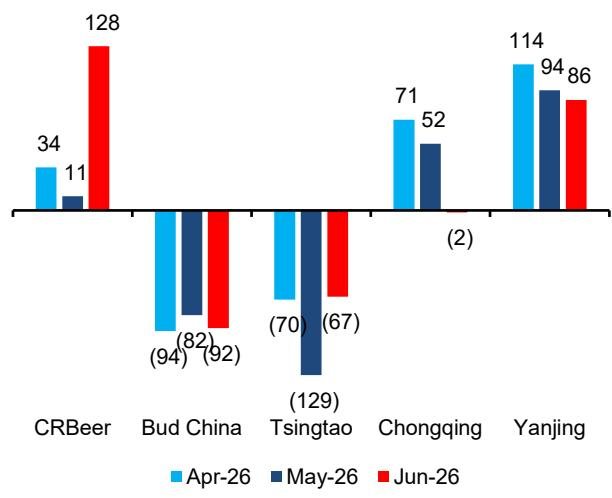  
来源：BigOne Lab、Bernstein 分析

图表11：6月全国层面华润啤酒在多数价格带实现市场份额提升，百威中国在多数价格带份额调整
2026年6月全国各价格带市场份额变化（同比基点）
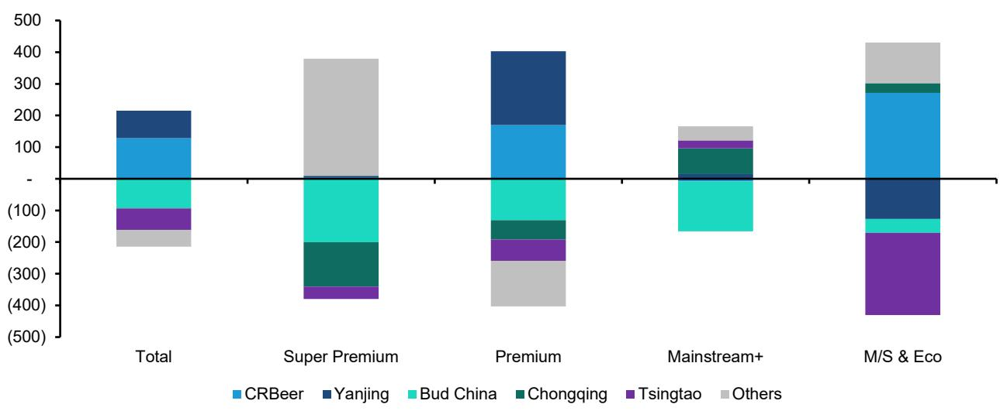  
来源：BigOne Lab、Bernstein 分析  
图表12：非即饮渠道中华润啤酒市场份额提升最多，百威中国在主流+价格带份额保持稳定
2026年6月全国非即饮渠道各价格带市场份额变化（同比基点）

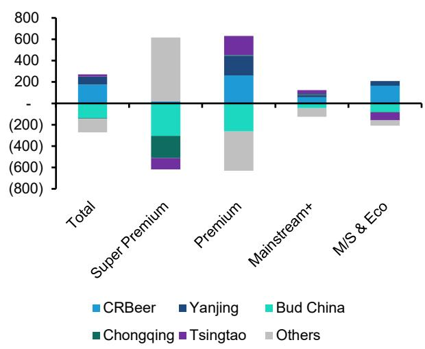  
来源：BigOne Lab、Bernstein 分析  
图表13：6月餐饮渠道市场份额提升主要集中在华润啤酒和燕京啤酒
2026年6月全国餐饮渠道各价格带市场份额变化（同比基点）

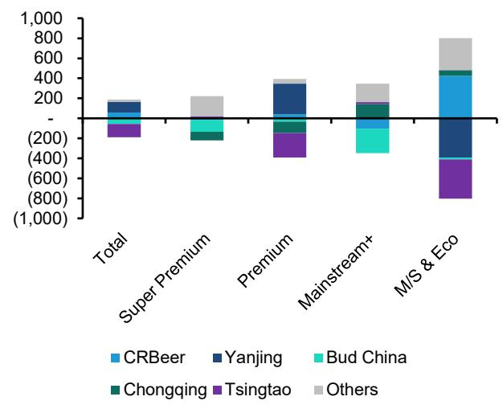  
来源：BigOne Lab、Bernstein 分析

图表14：7月青岛啤酒和华润啤酒的同比基数提升，百威中国基数相对较低
即将到来的同比基数 - 各啤酒企业中国整体啤酒销售额同比增速%
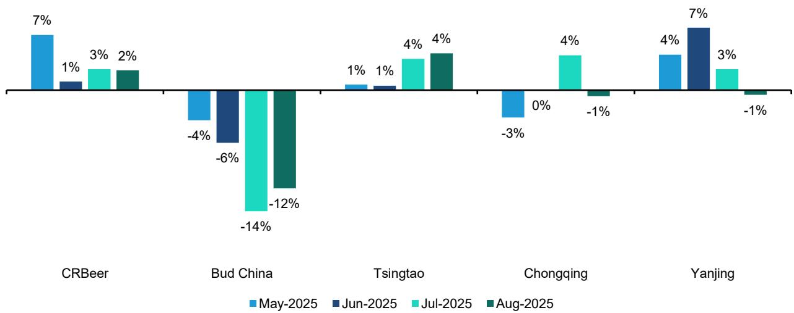  
来源：BigOne Lab、Bernstein 分析

图表15：6月广东省仍为较强省份，山东省持续偏弱，中高端增速放缓

<table><tr><td rowspan="3" colspan="2"></td><td rowspan="3">在FY25全国销售额中的权重</td><td colspan="4">两渠道合计</td></tr><tr><td colspan="4">各啤酒企业销售额同比增速%</td></tr><tr><td>2026年4月</td><td>2026年5月</td><td>2026年6月</td><>近3个月均值</td></tr>
<tr><td rowspan="7">按省份</td><td>广东</td><td>17%</td><td>16%</td><td>17%</td><td>9%</td><td>14%</td></tr>
<tr><td>福建</td><td>5%</td><td>1%</td><td>0%</td><td>-4%</td><td>-1%</td></tr>
<tr><td>浙江</td><td>7%</td><td>-2%</td><td>11%</td><td>5%</td><td>5%</td></tr>
<tr><td>江苏</td><td>6%</td><td>-6%</td><td>5%</td><td>5%</td><td>2%</td></tr>
<tr><td>山东</td><td>12%</td><td>-11%</td><td>-14%</td><td>-11%</td><td>-12%</td></tr>
<tr><td>其他</td><td>53%</td><td>1%</td><td>0%</td><td>2%</td><td>1%</td></tr>
<tr><td>合计</td><td></td><td>1%</td><td>2%</td><td>1%</td><td>2%</td></tr>
<tr><td rowspan="5">按价格带</td><td>超高端</td><td>5%</td><td>-18%</td><td>-10%</td><td>-14%</td><td>-13%</td></tr>
<tr><td>中高端</td><td>42%</td><td>4%</td><td>5%</td><td>3%</td><td>5%</td></tr>
<tr><td>主流+</td><td>28%</td><td>3%</td><td>0%</td><td>2%</td><td>2%</td></tr>
<tr><td>主流/经济</td><td>26%</td><td>-2%</td><td>2%</td><td>1%</td><td>-1%</td></tr>
<tr><td>合计</td><td></td><td>1%</td><td>2%</td><td>1%</td><td>2%</td></tr>
</table>

来源：BigOne Lab、Bernstein 分析

图表16：全国月度增长诊断 - 按省份、价格带和渠道

<table><tr><td rowspan="3" colspan="2"></td><td colspan="5">餐饮渠道</td><td colspan="5">非即饮渠道</td></tr>
<tr><td rowspan="2">在FY25全国销售额中的权重</td><td colspan="4">各啤酒企业销售额同比增速%</td><td rowspan="2">在FY25全国销售额中的权重</td><td colspan="4">各啤酒企业销售额同比增速%</td></tr>
<tr><td>2026年4月</td><td>2026年5月</td><td>2026年6月</td><td>近3个月均值</td><td>2026年4月</td><td>2026年5月</td><td>2026年6月</td><td>近3个月均值</td></tr>
<tr><td rowspan="7">按省份</td><td>广东</td><td>15%</td><td>22%</td><td>20%</td><td>11%</td><td>17%</td><td>19%</td><td>10%</td><td>14%</td><td>7%</td><td>11%</td></tr>
<tr><td>福建</td><td>5%</td><td>3%</td><td>1%</td><td>-2%</td><td>0%</td><td>4%</td><td>-3%</td><td>0%</td><td>-5%</td><td>-3%</td></tr>
<tr><td>浙江</td><td>7%</td><td>3%</td><td>12%</td><td>4%</td><td>6%</td><td>8%</td><td>-7%</td><td>11%</td><td>5%</td><td>4%</td></tr>
<tr><td>江苏</td><td>5%</td><td>1%</td><td>4%</td><td>8%</td><td>5%</td><td>7%</td><td>-11%</td><td>5%</td><td>2%</td><td>-1%</td></tr>
<tr><td>山东</td><td>16%</td><td>-16%</td><td>-20%</td><td>-16%</td><td>-18%</td><td>8%</td><td>0%</td><td>1%</td><td>-1%</td><td>0%</td></tr>
<tr><td>其他</td><td>52%</td><td>4%</td><td>5%</td><td>4%</td><td>4%</td><td>54%</td><td>-3%</td><td>-5%</td><td>0%</td><td>-3%</td></tr>
<tr><td>合计</td><td></td><td>3%</td><td>3%</td><td>1%</td><td>2%</td><td></td><td>-1%</td><td>1%</td><td>2%</td><td>1%</td></tr>
<tr><td rowspan="5">按价格带</td><td>超高端</td><td>6%</td><td>-23%</td><td>-16%</td><td>-18%</td><td>-19%</td><td>3%</td><td>-6%</td><td>5%</td><td>8%</td><td>3%</td></tr>
<tr><td>中高端</td><td>50%</td><td>9%</td><td>8%</td><td>5%</td><td>7%</td><td>33%</td><td>-3%</td><td>1%</td><td>2%</td><td>0%</td></tr>
<tr><td>主流+</td><td>32%</td><td>4%</td><td>2%</td><td>2%</td><td>3%</td><td>23%</td><td>3%</td><td>-2%</td><td>3%</td><td>1%</td></tr>
<tr><td>主流/经济</td><td>12%</td><td>-8%</td><td>-4%</td><td>-4%</td><td>-5%</td><td>41%</td><td>-2%</td><td>3%</td><td>0%</td><td>1%</td></tr>
<tr><td>合计</td><td></td><td>3%</td><td>3%</td><td>1%</td><td>2%</td><td></td><td>-1%</td><td>1%</td><td>2%</td><td>1%</td></tr>
</table>

来源：BigOne Lab、Bernstein 分析

## 各啤酒企业非即饮/餐饮渠道动能分析

## 百威中国

广东省和浙江省是6月百威中国餐饮渠道表现的最大贡献省份（图表17），中高端仍是按价格带划分的主要正贡献因素（图表18）。非即饮渠道方面，百威的降幅从5月的-10%小幅收窄至-9%，浙江省和河南省表现改善提供了支撑，但江苏省仍偏弱（图表19）。然而，餐饮渠道在5月实现+2%增长后，6月回落至-1%，主要受广东省和主流+产品趋势温和影响。中高端仍是两渠道中较强的价格带，但6月数据显示百威的恢复仍不均衡，且高度依赖少数省份和价格带。

图表17：百威中国按省份的价值桥

百威中国按省份的价值桥（以2025年6月为基准=100）

非即饮渠道

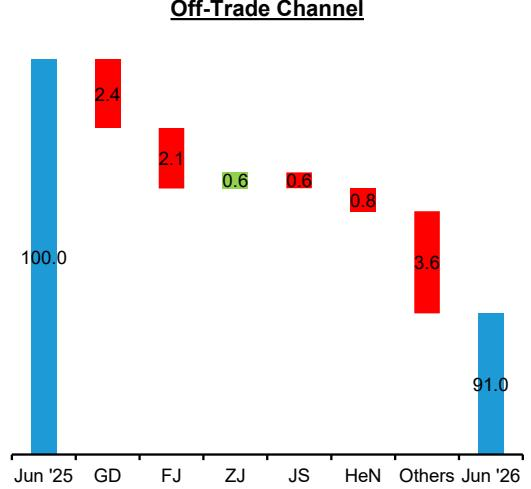  
来源：BigOne Lab、Bernstein 分析  
餐饮渠道

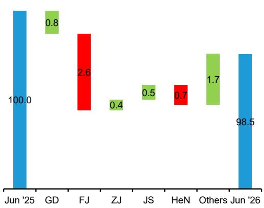

图表18：百威中国按价格带的价值桥
百威中国按价格带的价值桥（以2025年6月为基准=100）
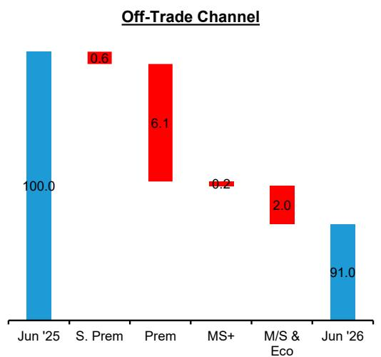  
来源：BigOne Lab、Bernstein 分析

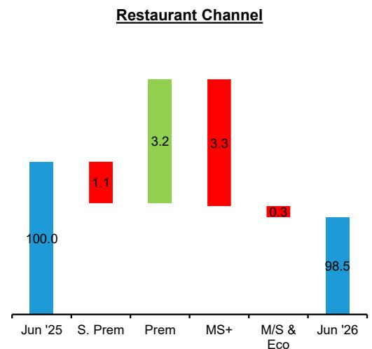

图表19：百威中国月度增长诊断 - 按省份、价格带和渠道

<table><tr><td rowspan="3" colspan="2"></td><td colspan="5">餐饮渠道</td><td colspan="5">非即饮渠道</td></tr>
<tr><td rowspan="2">在FY25全国销售额中的权重</td><td colspan="4">各啤酒企业销售额同比增速%</td><td rowspan="2">在FY25全国销售额中的权重</td><td colspan="4">各啤酒企业销售额同比增速%</td></tr>
<tr><td>2026年4月</td><td>2026年5月</td><td>2026年6月</td><td>近3个月均值</td><td>2026年4月</td><td>2026年5月</td><td>2026年6月</td><td>近3个月均值</td></tr>
<tr><td rowspan="7">按省份</td><td>广东</td><td>34%</td><td>9%</td><td>5%</td><td>-2%</td><td>3%</td><td>31%</td><td>-7%</td><td>-5%</td><td>-8%</td><td>-7%</td></tr>
<tr><td>福建</td><td>10%</td><td>-17%</td><td>-23%</td><td>-25%</td><td>-22%</td><td>10%</td><td>-20%</td><td>-19%</td><td>-21%</td><td>-20%</td></tr>
<tr><td>浙江</td><td>15%</td><td>2%</td><td>8%</td><td>2%</td><td>4%</td><td>12%</td><td>-8%</td><td>3%</td><td>5%</td><td>0%</td></tr>
<tr><td>江苏</td><td>5%</td><td>9%</td><td>7%</td><td>9%</td><td>8%</td><td>6%</td><td>-17%</td><td>-2%</td><td>-9%</td><td>-9%</td></tr>
<tr><td>河南</td><td>4%</td><td>-29%</td><td>-16%</td><td>-15%</td><td>-20%</td><td>5%</td><td>-23%</td><td>-26%</td><td>-12%</td><td>-20%</td></tr>
<tr><td>其他</td><td>33%</td><td>1%</td><td>6%</td><td>6%</td><td>4%</td><td>35%</td><td>-12%</td><td>-15%</td><td>-11%</td><td>-13%</td></tr>
<tr><td>合计</td><td></td><td>1%</td><td>2%</td><td>-1%</td><td>0%</td><td></td><td>-12%</td><td>-10%</td><td>-9%</td><td>-10%</td></tr>
<tr><td rowspan="5">按价格带</td><td>超高端</td><td>4%</td><td>-38%</td><td>-33%</td><td>-27%</td><td>-32%</td><td>3%</td><td>-23%</td><td>-12%</td><td>-25%</td><td>-20%</td></tr>
<tr><td>中高端</td><td>75%</td><td>8%</td><td>10%</td><td>4%</td><td>7%</td><td>53%</td><td>-17%</td><td>-17%</td><td>-12%</td><td>-16%</td></tr>
<tr><td>主流+</td><td>17%</td><td>-9%</td><td>-17%</td><td>-19%</td><td>-15%</td><td>15%</td><td>2%</td><td>-2%</td><td>-1%</td><td>-1%</td></tr>
<tr><td>主流/经济</td><td>4%</td><td>-30%</td><td>-17%</td><td>-7%</td><td>-17%</td><td>30%</td><td>-8%</td><td>-2%</td><td>-6%</td><td>-5%</td></tr>
<tr><td>合计</td><td></td><td>1%</td><td>2%</td><td>-1%</td><td>0%</td><td></td><td>-12%</td><td>-10%</td><td>-9%</td><td>-10%</td></tr>
</table>

来源：BigOne Lab、Bernstein 分析

## 华润啤酒

华润啤酒6月两渠道均保持增长，广东省表现最为突出，餐饮渠道增速提升至+46%，非即饮渠道保持在+20%以上（图表20）。中高端仍是两渠道中最大的增长贡献价格带，同时主流/经济价格带在非即饮渠道也明显增强（图表21）。与5月相比，华润啤酒的非即饮渠道表现从+1%显著改善至+8%，浙江省、江苏省和其他省份组均有改善。餐饮渠道增速小幅放缓至+4%，但仍保持健康，使华润啤酒成为6月被覆盖啤酒企业中表现较强的之一（图表22）。

图表20：华润啤酒按省份的价值桥
华润啤酒按省份的价值桥（以2025年6月为基准=100）

非即饮渠道

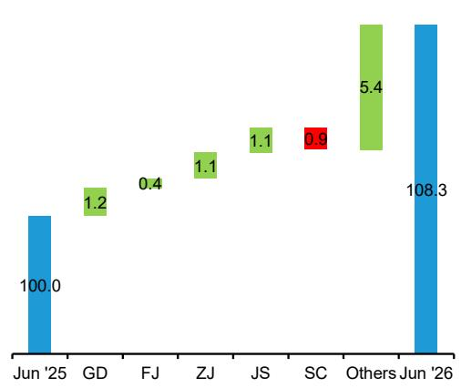  
来源：BigOne Lab、Bernstein 分析  
餐饮渠道

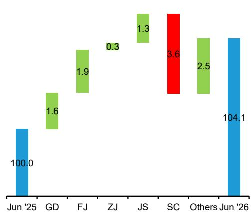  
图表21：华润啤酒按价格带的价值桥
华润啤酒按价格带的价值桥（以2025年6月为基准=100）
非即饮渠道

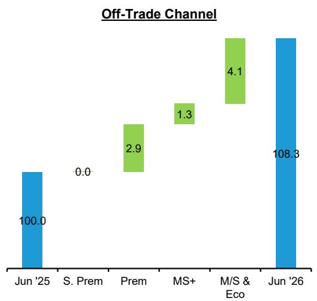  
来源：BigOne Lab、Bernstein 分析

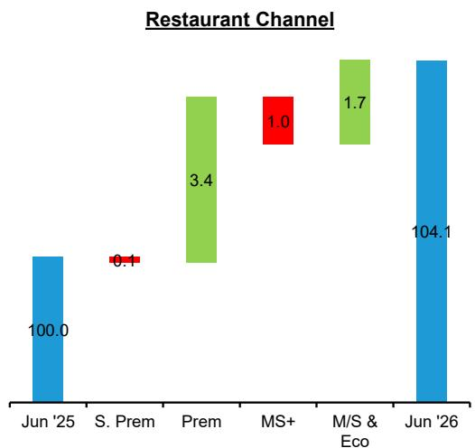

图表22：华润啤酒月度增长诊断 - 按省份、价格带和渠道

<table><tr><td rowspan="3" colspan="2"></td><td colspan="5">餐饮渠道</td><td colspan="5">非即饮渠道</td></tr>
<tr><td rowspan="2">在FY25全国销售额中的权重</td><td colspan="4">各啤酒企业销售额同比增速%</td><td rowspan="2">在FY25全国销售额中的权重</td><td colspan="4">各啤酒企业销售额同比增速%</td></tr>
<tr><td>2026年4月</td><td>2026年5月</td><td>2026年6月</td><td>近3个月均值</td><td>2026年4月</td><td>2026年5月</td><td>2026年6月</td><td>近3个月均值</td></tr>
<tr><td rowspan="7">按省份</td><td>广东</td><td>4%</td><td>21%</td><td>31%</td><td>46%</td><td>34%</td><td>6%</td><td>39%</td><td>36%</td><td>21%</td><td>31%</td></tr>
<tr><td>福建</td><td>8%</td><td>44%</td><td>30%</td><td>25%</td><td>32%</td><td>5%</td><td>8%</td><td>18%</td><td>8%</td><td>12%</td></tr>
<tr><td>浙江</td><td>12%</td><td>0%</td><td>10%</td><td>3%</td><td>5%</td><td>15%</td><td>-4%</td><td>17%</td><td>7%</td><td>8%</td></tr>
<tr><td>江苏</td><td>11%</td><td>1%</td><td>10%</td><td>12%</td><td>8%</td><td>10%</td><td>-5%</td><td>11%</td><td>9%</td><td>6%</td></tr>
<tr><td>四川</td><td>19%</td><td>-10%</td><td>-11%</td><td>-19%
