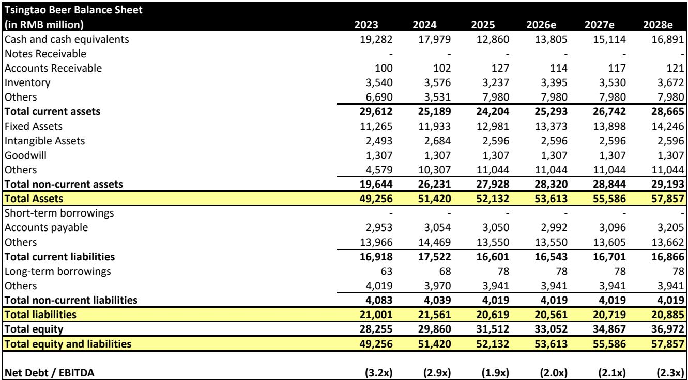
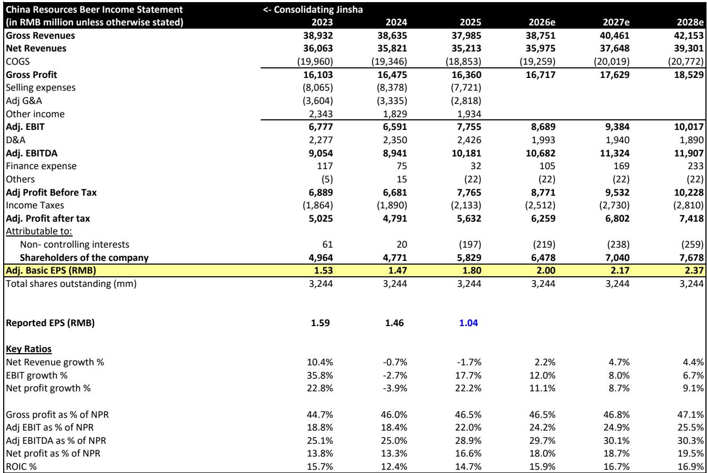
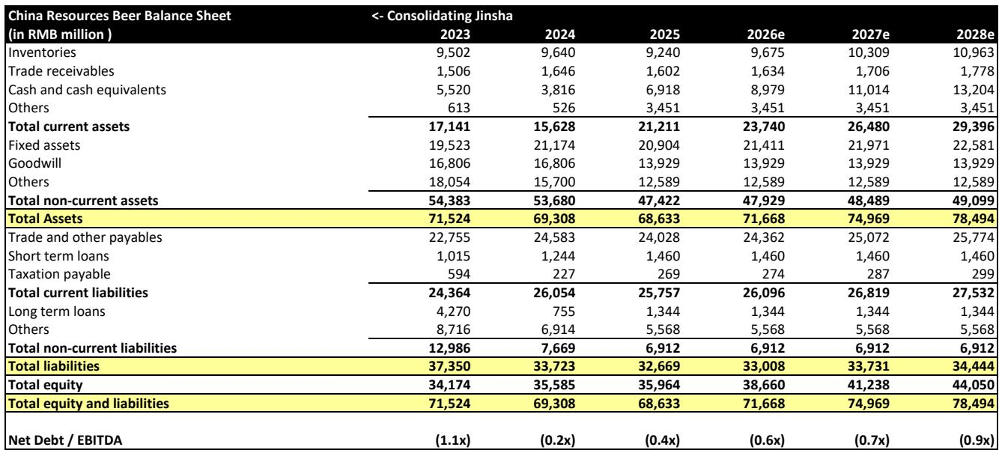

# Bernstein：消费行业数据与主题变化观察

2026年6月中国啤酒行业整体终端价值增速从5月的+2%节奏变化至+1%，但企业间分化进一步加剧。Bernstein基于BigOne Lab覆盖18万家超市和23万家餐饮门店的POS数据发现，华润啤酒6月价值增速从5月的+3%提升至+6%，超越一季度平均的+4%，成为主要啤酒企业中表现最突出的标的。百威中国则从-3%仍在调整至-4%，继续在行业中垫底。燕京啤酒（未覆盖）以+15%的增速领跑全行业，青岛啤酒降幅收窄至-1%，重庆啤酒（未覆盖）节奏变化至+1%。

这份报告的核心信号是：行业总量增长趋平，但企业间的份额转移正在加速，华润啤酒在餐饮和零售渠道同时获得动能，而百威中国的复苏仍缺乏系统性支撑。

## 1. 华润啤酒6月增速加快，零售渠道反弹是主要驱动力

华润啤酒6月价值增速从5月的+3%提升至+6%，主要得益于零售渠道的强劲反弹。该渠道增速从5月的+1%跃升至+8%，餐饮渠道则维持在+4%的健康水平。从区域看，广东市场表现尤为突出，餐饮渠道增速达到+46%。从价格带看，中高端产品仍是核心增长引擎。

Bernstein的回归模型显示，基于上半年至今的月度销售数据，华润啤酒上半年营收增速预计约为+2%。但报告同时指出，该回归模型的拟合度（r²）较低，意味着预测存在较大不确定性。

> **KC评论：** 华润啤酒的零售渠道反弹值得关注。此前该渠道增速长期仍在调整，6月的+8%可能反映了渠道库存调整或终端促销效果。但回归模型拟合度低意味着，不能简单用月度终端数据线性外推公司营收。

## 2. 百威中国6月降幅扩大，复苏仍局限于少数区域和价格带

百威中国6月价值增速从5月的-3%进一步下滑至-4%，延续了行业中最弱的表现。零售渠道降幅从-10%小幅收窄至-9%，但餐饮渠道在5月短暂转正后再次滑入负增长（-1%）。

从区域看，浙江是少数亮点，餐饮渠道保持正增长。从价格带看，中高端产品表现相对较好。但百威在广东市场的表现持续落后于行业整体增速——广东6月整体啤酒价值增长+9%，而百威在该省的餐饮渠道增速仅为-2%。

报告认为，6月数据表明百威的复苏仍然不均衡，高度依赖少数省份和价格带。

## 3. 青岛啤酒降幅收窄，但山东市场仍是最大影响

青岛啤酒6月价值增速从5月的-2%收窄至-1%，好于一季度平均的-2%。零售渠道保持+3%的正增长，部分抵消了餐饮渠道-3%的降幅。

山东市场仍是最大影响因素，该省餐饮渠道销售额同比下降-15%。不过，广东、福建和陕西市场的较强表现帮助缩小了整体降幅。Bernstein的回归模型显示，基于二季度至今的销售表现，青岛啤酒二季度营收降幅可能扩大至约-3%。

## 4. 广东和山东构成区域表现的两极，中高端仍是相对少见增长引擎

从省级数据看，广东6月整体价值增长+9%，餐饮渠道增速达+11%，连续多月领跑全国。山东则持续垫底，整体价值下降-11%，餐饮渠道降幅达-16%。浙江和江苏在两个渠道均保持正增长，福建则从5月的0%进一步出现变化至-4%。

从价格带看，中高端产品（Premium）仍是相对少见稳定的增长引擎，6月增速为+3%。超高端产品（Super Premium）继续承压，降幅为-14%。主流+产品（Mainstream+）增速略有加快。

> **KC评论：** 区域分化是理解中国啤酒市场当前格局的关键。广东作为全国最大的啤酒消费省份（占行业价值约17%），其强劲表现对华润啤酒和燕京啤酒形成支撑，但百威在该省的表现却持续落后。山东（占约12%）的持续疲软则对青岛啤酒构成结构性不确定性。这种区域分化短期内难以改变。

## 5. 7月基数效应将带来不同挑战：百威面临最宽松对比

报告提示，进入7月后各企业面临的基数效应将出现分化。华润啤酒和百威中国将面临更严格的同比基数，而青岛啤酒的基数则明显偏软。重庆啤酒也面临相对宽松的对比基础。

这意味着，7月的数据解读需要更加关注基数调整后的真实增长趋势，而非简单的同比数字。

---

For informational purposes only. Portions may be generated,translated,summarized,or edited with AI assistance based on source materials and may contain omissions or errors. Please verify independently. This is not investment,legal,tax,accounting,or other professional advice.

For informational purposes only. Portions may be generated,translated,summarized,or edited with AI assistance based on source materials and may contain omissions or errors. Please verify independently. This is not investment,legal,tax,accounting,or other professional advice.

