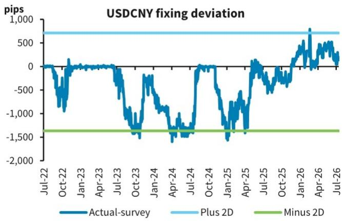
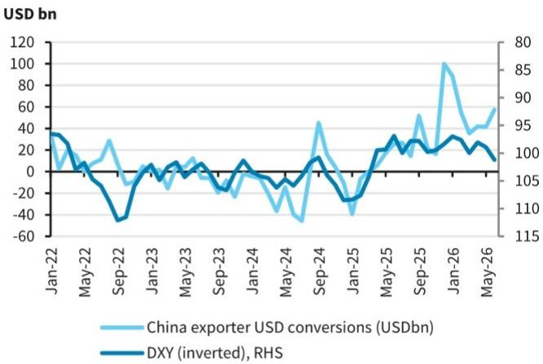
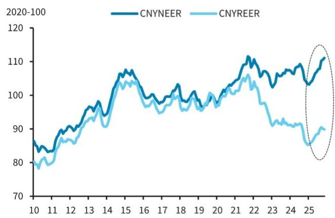

# BARC：货币市场与相关指标观察

BARC最新外汇策略报告指出，人民币对美元汇率在突破6.80后并未开启新一轮快速变化，而是进入盘整期。但这不应被解读为趋势的终结。报告维持2026年底美元兑人民币6.65的预测，认为变化路径将更为渐进，而非逆转。

这份报告的核心判断建立在一个关键区分上：政策意图是“控制变化节奏”而非“制造弱势货币”。报告列举了四个相互独立的支撑论据，同时指出了近期变化节奏变化的具体原因。

## 1. 央行持续通过中间价管理变化节奏

报告观察到，官方美元兑人民币中间价在过去数月持续弱于市场隐含的中间价水平。这一差距在近期有所收窄，但并未消失。这表明政策制定者对人民币快速变化仍感不适，即使他们大体上容忍变化方向。报告认为，短期内没有理由期待央行会实质性改变这一立场。

> **KC评论：** 中间价持续弱于市场预期，是理解当前汇率政策最直接的信号。它说明央行在主动管理变化速度，而非被动接受市场力量。读者需要区分“方向容忍”和“速度容忍”这两个不同维度。

## 2. 贸易加权汇率接近两年高位构成约束

CFETS人民币汇率指数已接近2022年8月以来的最高水平。报告指出，虽然中国出口仍具韧性，但进一步变化的空间可能正在收窄。国内需求持续调整，政策制定者无法承受出口竞争力受损的代价。同时，人民币实际有效汇率虽从低位回升，但同样强化了更渐进变化的理由。

## 3. 出口商结汇意愿可能减弱但仍是支撑

中国贸易顺差依然庞大，但报告预期出口商美元结汇将在未来数月节奏变化。结汇量已从前期峰值回落，但仍处于历史高位，这意味着对人民币的上行仍在调整将持续，只是力度减弱。报告特别指出，美元走强可能促使出口商保留更多外汇收入而非立即结汇，这是需要关注的不确定性点。

## 4. 在岸市场情绪指标转向中性

报告使用3个月25-delta不确定性逆转指标作为在岸市场情绪的代理变量。该指标显示，市场对人民币变化的预期已较年初明显减弱。虽然头寸远未达到全面看空的程度，但这一转变意味着推动人民币快速变化的动量来源正在消退。

## 5. 资本流出管控收紧提供底部支撑

报告注意到，自5月下旬以来，监管机构加强了对跨境公司交易和其他离岸研究渠道的审查。7月1日生效的修订版《境外研究条例》建立了更全面的审批框架，赋予发改委、商务部、外管局更大的自由裁量权，以节奏变化、延迟或否决可能威胁资本流动稳定的大额境外交易。这些措施表明，政策制定者仍不愿看到人民币重新进入调整周期。

综合来看，BARC认为人民币变化路径将更为渐进，但外部盈余和更严格的资本流出管理将继续提供基本面支撑。报告维持做多离岸人民币对印度卢比的相对价值交易建议，认为在美元全面走强的背景下，这一相对价值策略比单纯做多人民币更具吸引力。

For informational purposes only. Portions may be generated,translated,summarized,or edited with AI assistance based on source materials and may contain omissions or errors. Please verify independently. This is not investment,legal,tax,accounting,or other professional advice.

