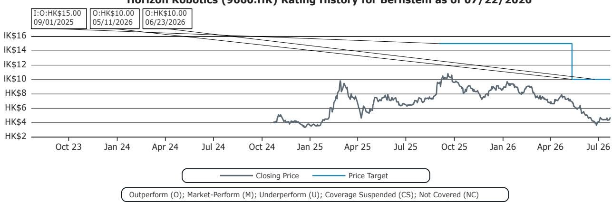
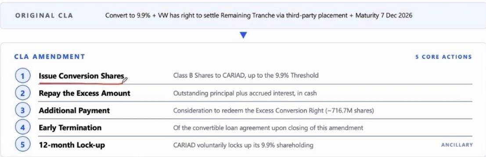
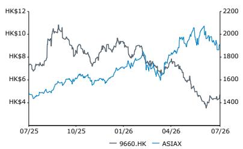

# Bernstein：地平线可转债重组与大众合作升级

地平线机器人于2026年7月23日宣布两项动作：可转债重组，以及大众汽车在L3/L4自动驾驶领域的合作扩展。Bernstein研究认为，市场当天3.8%的波动是误判，两项变化均属正面。可转债重组避免了约4.9%的潜在稀释，实际效果相当于1%的股份回购。大众自愿将其全部持股的锁定期延长12个月，同时地平线以零息新可转债替换原有计息债务，节省约2000万美元利息支出。

## 1. 可转债重组消除4.9%稀释不确定性并降低融资成本

原可转债结构下，大众持股若超过9.9%门槛，超出部分约7.16亿股须通过第三方配售处理。这会产生约4.9%的稀释，且第三方短期抛售会带来价格不确定性。地平线通过发行新可转债回购这部分超额股份，以低于市价8%的价格完成赎回。新可转债为零息、零收益，转报价5.55港元，较最新收盘价溢价16.8%。Bernstein计算显示，新结构下潜在稀释降至3.9%，较原结构降低1个百分点，相当于1%的回购效果。同时，提前终止原计息债务节省了约2000万美元名义利息。

> **KC评论：** 这笔交易的核心不是融资，而是资本结构优化。地平线用更低成本的工具替换了高成本债务，同时提高了转报价门槛，对现有股东是正向信号。市场可能低估了“避免稀释”与“降低融资成本”叠加后的财务影响。

## 2. 大众L3/L4合作验证地平线全栈技术价值

大众旗下CARIZON将获得地平线AI基础模型、C7H SoC架构和GAIA世界模型数据平台的授权。地平线管理层确认，其技术IP将嵌入大众中国自有的自动驾驶架构。首批L3级交付目标为2027年下半年，随后是L4级在乘用车和Robotaxi上的应用。Bernstein认为，这一合作表明OEM自研并不必然压缩第三方供应商空间。地平线可通过BPU和算法IP授权、标准化计算芯片、全栈解决方案或合资公司等多种方式变现。OEM在保留系统所有权的同时依赖地平线底层技术，这维持了地平线的商业相关性和客户关系。

## 3. 技术授权模式提供多元变现路径

报告指出，地平线的商业模式灵活性是其核心优势。与大众的合作模式——技术IP嵌入OEM自有架构——可复制到其他客户。地平线不要求OEM采用其完整方案，而是允许客户在BPU授权、芯片采购、算法合作等不同深度上选择合作方式。这种分层变现策略使地平线在OEM自研趋势下仍能保持收入增长。Bernstein基于10.3倍EV/Sales估值，对应2027年下半年至2028年上半年约115亿元人民币的销售预期。

For informational purposes only. Portions may be generated,translated,summarized,or edited with AI assistance based on source materials and may contain omissions or errors. Please verify independently. This is not investment,legal,tax,accounting,or other professional advice.

For informational purposes only. Portions may be generated,translated,summarized,or edited with AI assistance based on source materials and may contain omissions or errors. Please verify independently. This is not investment,legal,tax,accounting,or other professional advice.

