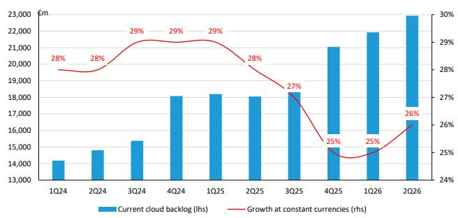
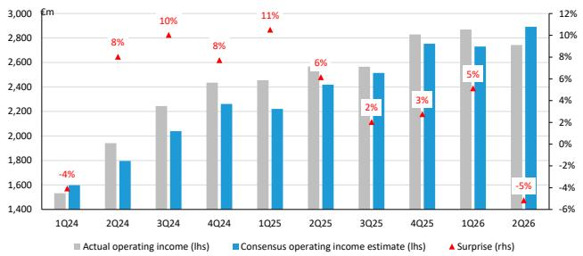
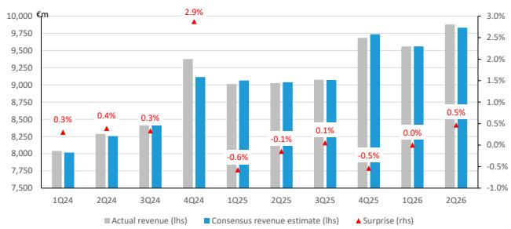
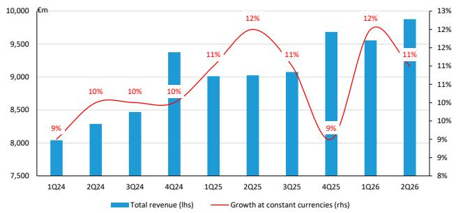
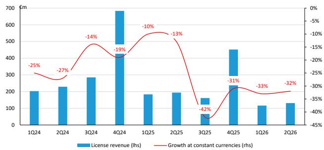
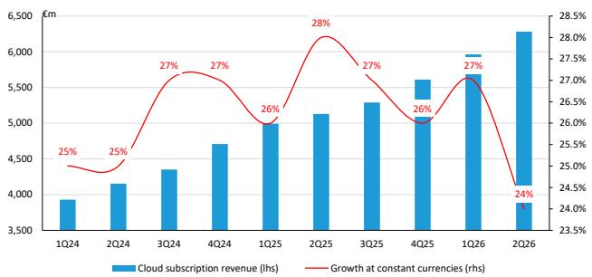
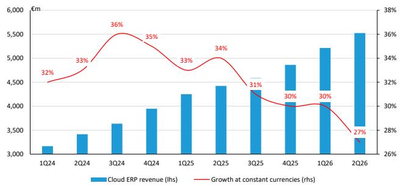
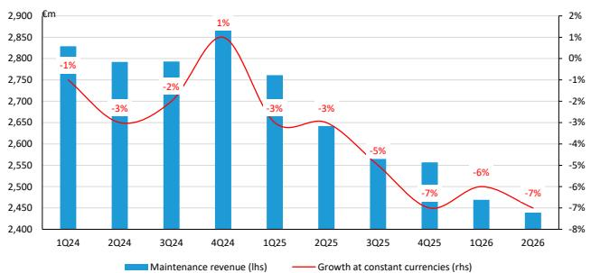
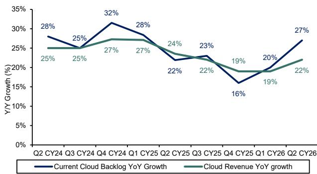
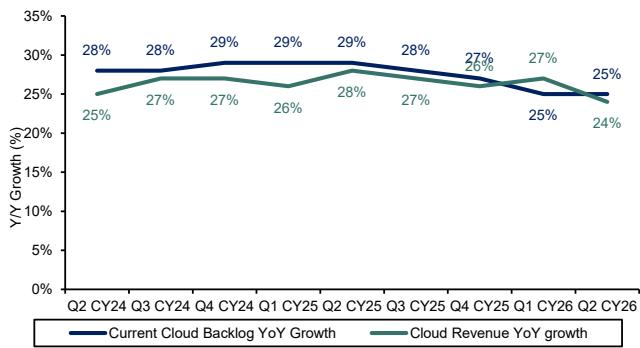

# Global Software and European Technology / Software SAP 2Q26: Healthy growth, slightly noisy on margin

Mark L. Moerdler, Ph.D.
+1 917 344 8506
mark.moerdler@bernsteinsg.com

Richard Nguyen

richard.nguyen@bernsteinsg.com

+33 1 42 13 54 22

Firoz Valliji, CFA

+1 917 344 8316

firoz.valliji@bernsteinsg.com

Derric Marcon

+33 1 58 98 06 30

derric.marcon@bernsteinsg.com

Shelly Tang, CFA

+1 917 344 8342

shelly.tang@bernsteinsg.com

SAP delivered a good Q2, with a better than expected Current Cloud Backlog (CCB) growth rate and margins below expectations. Management reiterated FY guidance, other than operating income as the recent acquisitions will negatively impact operating income. We see the CCB strength positively and are not worried about the in-quarter margins as software companies can easily manage margins if they are focused (which SAP is). We believe that management has learned and is being conservative in their approach to guidance and commentary - constantly stating how the setup for meeting guidance has improved without leading investors to expect a beat. We see this as a very smart approach given the broader environment.

SAP is well protected against AI disruption given the criticality of its software as well as to capture the upside from AI given their approach to AI. With the numbers currently driven by a Cloud transition and longer term upside from AI we like the setup, especially at the current price.

Investors were focused on the Current Cloud Backlog (CCB) as a leading indicator of growth and CCB growth was a concern for investors in 4Q. The company yet again delivered better than expected CCB growth, which sets them up for solid growth over the next 12 months. The company also maintained FY guide (except for operating income hit by acquisition costs), which was better than expected as some feared that increasing global uncertainties might further weigh on the outlook.

Operating margins were below expectations, but we believe that is one-time effects of necessary R&D investments and the launch of Autonomous ERP. The company has numerous levers to drive margin improvement, many of which they have already activated (e.g. decreased T&A)

There continues to be concern about the potential impact of the AI disruption on 1) a shift from subscription to consumption and 2) on margins. The company continues to execute and deliver AI capabilities and as was shown in our recent CIO survey (Link) and our discussion with 3 CIOs (link) enterprises would rather buy AI from packaged software providers and do not have any desire to replace these applications.

We believe many of the data points and management comments this quarter echoed with what we have called out in our recent note: SAP: Why we believe the bear case is wrong.

In summary, this was a good quarter for a business delivering improving growth and increasing margins in an environment with various global considerations. The fact that SAP delivers critical solutions for some of the largest / most complex companies in the world limits the downside risks and should result in the company's relative performance.

## BERNSTEIN TICKER TABLE

<table><tr><td></td><td colspan="4">23 Jul 2026</td><td rowspan="2">TTMRel.</td><td colspan="4">Adjusted EPS</td><td colspan="3">Adjusted P/E (x)</td></tr><tr><td>Ticker</td><td>Rating</td><td>Cur</td><td>Closing Price</td><td>Price Target</td><td>Cur</td><td>2025A</td><td>2026E</td><td>2027E</td><td>2025A</td><td>2026E</td><td>2027E</td></tr><tr><td>SAP.GR (SAP)</td><td>O</td><td>EUR</td><td>128.62</td><td>273.00</td><td>(64.6)%</td><td>EUR</td><td>6.10</td><td>7.71</td><td>8.72</td><td>21.1</td><td>16.7</td><td>14.8</td></tr><tr><td>OLD</td><td></td><td></td><td></td><td>276.00</td><td></td><td></td><td></td><td>7.54</td><td>9.02</td><td></td><td></td><td></td></tr><tr><td>SAP (SAP)</td><td>O</td><td>USD</td><td>146.38</td><td>319.00</td><td>(66.1)%</td><td>EUR</td><td>6.10</td><td>7.71</td><td>8.72</td><td>21.1</td><td>16.7</td><td>14.8</td></tr><tr><td>OLD</td><td></td><td></td><td></td><td>323.00</td><td></td><td></td><td></td><td>7.54</td><td>9.02</td><td></td><td></td><td></td></tr><tr><td>EDME</td><td></td><td></td><td>1,586.63</td><td></td><td></td><td></td><td></td><td></td><td></td><td></td><td></td><td></td></tr><tr><td>SPX</td><td></td><td></td><td>7,408.30</td><td></td><td></td><td></td><td></td><td></td><td></td><td></td><td></td><td></td></tr></table>

PRICE TARGET CHANGE / ESTIMATE CHANGE IN BOLD

O - Outperform, M - Market-Perform, U - Underperform, NR - Not Rated, CS - Coverage Suspended

Source: Bloomberg, Bernstein estimates and analysis.

## INVESTMENT IMPLICATIONS

SAP, SAP.GR (Outperform, PT \$319, €273): SAP delivered a healthy quarter delivering stable revenue and backlog growth, despite concerns around the global environment and conflict in middle-east. Operating margin missed in the quarter and management lowered full year operating profit guidance slightly (due to recent acquisitions). While some might focus on the margin, we think SAP can manage their costs and easily deliver margin improvement. We like the stability in cloud backlog growth, which could enable SAP to deliver growth acceleration in 2H26 and FY27.

Overall, we continue to think that SAP is fundamentally a Cloud transition and margin improvement story, and they are executing well on both counts. The company has also moved aggressively to shrink stock based compensation. The value of the business model and the company's ability to execute is shown in the strong backlog and new customer growth. With investors looking for durable growth, healthy margins, immunity to AI disruption and margin improvement, SAP is one of our favorite names. We like the setup for 2H26 and beyond and believe it continues to be a quality compounder. SAP is a notable name in the current AI landscape.

We lowered target price from \$323 (€276) to \$319 (€273) as we rolled forward our forecast and lowered SAP's multiple from 29x to 28x, reflecting step-down in peer group valuation.

## VALUATION COMPS TABLE

<table><tr><td colspan="2">7/23/2026</td><td colspan="2">Net Cash Per Share</td><td colspan="2">Free Cash Flow (LTM)</td><td>Revenue Growth</td><td colspan="4">Valuation Multiples</td></tr><tr><td>Company</td><td>Share Price</td><td>$</td><td>% of Share Price</td><td>Per Share ($)</td><td>% Yield</td><td>NTM (%)</td><td>EV / NTM Revenue</td><td>P / FE</td><td>Price / FCF (LTM)</td><td>PEG Ratio</td></tr><tr><td>Adobe</td><td>$211.19</td><td>(3.48)</td><td>(1.6%)</td><td>24.86</td><td>11.8%</td><td>10.0%</td><td>3.1x</td><td>8.2x</td><td>8.2x</td><td>0.6x</td></tr><tr><td>Microsoft</td><td>$379.86</td><td>(6.32)</td><td>(1.7%)</td><td>9.78</td><td>2.6%</td><td>16.2%</td><td>7.8x</td><td>20.4x</td><td>38.7x</td><td>1.4x</td></tr><tr><td>Oracle</td><td>$119.56</td><td>(46.51)</td><td>(38.9%)</td><td>(8.13)</td><td>N/A</td><td>33.0%</td><td>5.4x</td><td>14.8x</td><td>N/A</td><td>2.6x</td></tr><tr><td>MongoDB</td><td>$298.36</td><td>28.66</td><td>9.6%</td><td>7.15</td><td>2.4%</td><td>18.6%</td><td>7.0x</td><td>46.6x</td><td>40.6x</td><td>2.2x</td></tr><tr><td>Salesforce.com</td><td>$157.22</td><td>(32.98)</td><td>(21.0%)</td><td>15.67</td><td>10.0%</td><td>10.0%</td><td>3.4x</td><td>11.0x</td><td>8.8x</td><td>3.8x</td></tr><tr><td>HubSpot</td><td>$190.66</td><td>27.44</td><td>14.4%</td><td>11.56</td><td>6.1%</td><td>16.5%</td><td>2.2x</td><td>13.9x</td><td>16.0x</td><td>0.5x</td></tr><tr><td>SAP</td><td>$147.42</td><td>2.15</td><td>1.5%</td><td>6.82</td><td>4.6%</td><td>10.6%</td><td>4.3x</td><td>17.2x</td><td>22.7x</td><td>1.2x</td></tr><tr><td>Snowflake</td><td>$264.61</td><td>0.54</td><td>0.2%</td><td>3.43</td><td>1.3%</td><td>28.7%</td><td>14.1x</td><td>122.4x</td><td>78.4x</td><td>2.3x</td></tr><tr><td>Quantinuum</td><td>$55.97</td><td>2.17</td><td>3.9%</td><td>(0.85)</td><td>N/A</td><td>10.3%</td><td>504.5x</td><td>N/A</td><td>N/A</td><td>N/A</td></tr><tr><td>Workday</td><td>$127.32</td><td>2.13</td><td>1.7%</td><td>11.25</td><td>8.8%</td><td>11.0%</td><td>2.8x</td><td>11.4x</td><td>10.6x</td><td>0.8x</td></tr><tr><td>Autodesk</td><td>$204.58</td><td>0.93</td><td>0.5%</td><td>12.75</td><td>6.2%</td><td>11.7%</td><td>5.1x</td><td>15.8x</td><td>15.8x</td><td>1.0x</td></tr><tr><td>ServiceNow</td><td>$91.68</td><td>(3.64)</td><td>(4.0%)</td><td>4.39</td><td>4.8%</td><td>20.0%</td><td>5.6x</td><td>20.1x</td><td>20.7x</td><td>0.9x</td></tr><tr><td>Amadeus</td><td>$54.90</td><td>(6.97)</td><td>(12.7%)</td><td>4.44</td><td>8.1%</td><td>6.3%</td><td>3.8x</td><td>13.1x</td><td>12.0x</td><td>1.2x</td></tr><tr><td>Datadog</td><td>$244.57</td><td>9.58</td><td>3.9%</td><td>2.64</td><td>1.1%</td><td>24.0%</td><td>18.4x</td><td>96.8x</td><td>90.7x</td><td>6.5x</td></tr></table>

Source: Bloomberg, Bernstein analysis

## DETAILS

SAP delivered another good but not perfect quarter with their Q2 results (Exhibit 2). The results were relatively clean with four notable items:

\- Current Cloud Backlog (CCB): SAP beat expectations for Current Cloud Backlog (Exhibit 4), an area of specific investor concerns after missing street expectations in Q4. While the 26% CC CCB growth was helped by less than 1% by the closure of their Reltio acquisition, the company would still have beat expectations and is well positioned to incrementally beat their FY CCB growth rate. While the beat was not exceptional many investors expected CCB to continue to degrade and stability was a positive sign.

\- Margins this quarter, for the first time in a while, SAP missed their operating margins (Exhibit 5), and we believe that some will focus on margins (having switched from focusing on CCB previously). Management explained that the acquisitions plus investments in R&D and marketing impacted margins. That said, software companies are well positioned to manage their costs and management explained in the call back that they will not be meaningfully increasing hiring / spending in R&D nor marketing for the remainder of the year. While we will be watching the margin, as it is core to our investment thesis, we are not worried that this issue will abate through the remainder of the year.

\- FY Operating Profit guidance: While management reiterated most of their FY guidance, they lowered the top and bottom of their FY non-IFRS operating profit outlook range by €100B as the dilution effects of the Dremio and Prior Labs acquisitions (which closed in July) are projected to be in excess of €100 million. In other words, excluding the two acquisitions nothing has changed and in fact they may have slightly increased their guide.

\- Management confidence: We believe that the management team delivered a very high level of confidence in their ability to execute and deliver to their guidance. After the Q4 issues where many on the buy and sell side interpreted the management commentary after Q4 earnings as a sign of a strong CCB beat, we believe, they were careful not to talk about beating guidance which makes a lot of sense given the broader environment (even though).

Investor concerns increased during the quarter after mixed results across software / tech, including IBM's results (IBM 2QFY26 earnings) and after SAP's agreement with the European Commission on maintenance (SAP: From migration deadlines to migration economics) as well as all the noise; news flow; and AI concerns impacting software this is exactly what we were looking for in our joint coverage. The company's price was up ~4% in the aftermarket.

EXHIBIT 2: SAP 2Q26 Results vs. Consensus summary (in €B, except for per share items)

<table><tr><td>2Q26</td><td colspan="2">Reported</td><td colspan="2">Consensus</td><td>Surprise</td><td>EUR</td><td>CC</td></tr><tr><td>Current Cloud Backlog</td><td>€</td><td>22.93</td><td colspan="2">--</td><td>-</td><td>27%</td><td>26%</td></tr><tr><td>Cloud Revenue</td><td>€</td><td>6.28</td><td>€</td><td>6.26</td><td>0%</td><td>22%</td><td>24%</td></tr><tr><td>SaaS/PaaS</td><td>€</td><td>5.05</td><td></td><td></td><td>-</td><td>23%</td><td>25%</td></tr><tr><td>Cloud ERP Suite</td><td>€</td><td>5.53</td><td></td><td></td><td>-</td><td>25%</td><td>27%</td></tr><tr><td>Extension Suite</td><td>€</td><td>0.69</td><td></td><td></td><td>-</td><td>11%</td><td>12%</td></tr><tr><td>IaaS</td><td>€</td><td>0.07</td><td></td><td></td><td>-</td><td>-23%</td><td>-22%</td></tr><tr><td>Software Licenses Revenue</td><td>€</td><td>0.13</td><td>€</td><td>0.14</td><td>-4%</td><td>-32%</td><td>-32%</td></tr><tr><td>Software Support Revenue</td><td>€</td><td>2.44</td><td>€</td><td>2.42</td><td>1%</td><td>-8%</td><td>-7%</td></tr><tr><td>Software license and Support</td><td>€</td><td>2.57</td><td>€</td><td>2.57</td><td>0%</td><td>-9%</td><td>-8%</td></tr><tr><td>Services Revenue</td><td>€</td><td>1.03</td><td>€</td><td>1.00</td><td>3%</td><td>-3%</td><td>-2%</td></tr><tr><td>Total Revenue</td><td>€</td><td>9.88</td><td>€</td><td>9.85</td><td>0%</td><td>9%</td><td>11%</td></tr><tr><td>IFRS Operating Profit</td><td>€</td><td>2.64</td><td colspan="2">--</td><td>-</td><td>8%</td><td></td></tr><tr><td>Non-IFRS Operating Profit</td><td>€</td><td>2.74</td><td>€</td><td>2.89</td><td>-5%</td><td>7%</td><td>9%</td></tr><tr><td>IFRS Operating Margin</td><td></td><td>26.8%</td><td colspan="2">--</td><td>-</td><td>-0.5pp</td><td></td></tr><tr><td>Non-IFRS Operating Margin</td><td></td><td>27.8%</td><td></td><td>29.3%</td><td>-150bps</td><td>-0.7pp</td><td>-0.4pp</td></tr><tr><td>IFRS EPS</td><td>€</td><td>1.88</td><td>€</td><td>1.76</td><td>7%</td><td></td><td></td></tr></table>

Source: Company reports, Bernstein estimates and analysis

EXHIBIT 3: SAP: 2Q26 results - Bernstein vs Visible Alpha consensus

<table><tr><td rowspan="2">€m</td><td rowspan="2">2Q25Actual</td><td rowspan="2">2Q26Actual</td><td rowspan="2">Change %</td><td colspan="4">2Q26 estimates</td></tr><tr><td>Bernstein</td><td>Delta</td><td>Consensus</td><td>Delta</td></tr><tr><td>Total revenue</td><td>9,027</td><td>9,878</td><td>9%</td><td>9,915</td><td>0%</td><td>9,832</td><td>0%</td></tr><tr><td>Growth at constant currencies (%)</td><td>12%</td><td>11%</td><td>-100bp</td><td>12%</td><td>-100bp</td><td>11%</td><td>+0bp</td></tr><tr><td>- o/w cloud subscription revenue</td><td>5,130</td><td>6,281</td><td>22%</td><td>6,338</td><td>-1%</td><td>6,239</td><td>1%</td></tr><tr><td>Growth at constant currencies (%)</td><td>28%</td><td>24%</td><td>-400bp</td><td>25%</td><td>-100bp</td><td>23%</td><td>+100bp</td></tr><tr><td>- o/w maintenance revenue</td><td>2,642</td><td>2,439</td><td>-8%</td><td>2,415</td><td>1%</td><td>2,426</td><td>1%</td></tr><tr><td>Growth at constant currencies (%)</td><td>-3%</td><td>-7%</td><td>-400bp</td><td>-7%</td><td>+0bp</td><td>-7%</td><td>+0bp</td></tr><tr><td>- o/w license revenue</td><td>194</td><td>131</td><td>-32%</td><td>136</td><td>-4%</td><td>135</td><td>-3%</td></tr><tr><td>Growth at constant currencies (%)</td><td>-13%</td><td>-32%</td><td>-1900bp</td><td>-30%</td><td>-200bp</td><td>-30%</td><td>-200bp</td></tr><tr><td>Non-IFRS operating income</td><td>2,568</td><td>2,743</td><td>7%</td><td>2,930</td><td>-6%</td><td>2,892</td><td>-5%</td></tr><tr><td>Non-IFRS operating margin (%)</td><td>27.6%</td><td>27.8%</td><td>+20bp</td><td>29.6%</td><td>-180bp</td><td>29.4%</td><td>-160bp</td></tr><tr><td>Non-IFRS EPS (€)</td><td>1.49</td><td>1.59</td><td>7%</td><td>1.84</td><td>-14%</td><td>1.75</td><td>-9%</td></tr></table>

Source: SAP (FY to end-December), Visible Alpha consensus, Bernstein analysis and estimates

EXHIBIT 4: SAP: Current Cloud Backlog  
  
Source: SAP (FY to end-December), Bernstein analysis

EXHIBIT 5: SAP: operating income beat/miss vs Visible Alpha consensus  
  
Source: SAP (FY to end-December), Visible Alpha consensus, Bernstein analysis

## OUR HIGH LEVEL VIEW ON THE COMPANY

Overall, SAP delivered a strong start to the year, which should help re-rate the company.

There are several positives in SAP's Q2 print.

1. As mentioned earlier, SAP beat expectations for Current Cloud Backlog, an area of specific investor concerns after missing street expectations in Q4. While the 26% CC CCB growth was helped by less than 1% by the closure of their Reltio acquisition, the company would still have beat expectations and is well positioned to incrementally beat their FY CCB growth rate.

\- This quarter CCB growth was larger than Cloud revenue growth which sets the company for solid Cloud growth in the back half of the year, helping to alleviate investor concerns.

\- The solid CCB growth is particularly important, as it takes away a key argument for some. It underpins SAP's strong cloud growth prospects in the coming quarters. It also will help the company meet / beat their FY CCB guide.

2. Yet again, despite rising global uncertainties, SAP's reiteration of FY26 guidance. This demonstrates the strength of the ERP migration cycle and strong momentum in the supply chain.

3. Management stated on the call that while the global environment continues to be a consideration and that the war in the Middle East could have an impact on growth they are currently only seeing a few deals with companies directly impacted and in the region and that this is not impacting their ability to deliver.

## DRILLING INTO CURRENT CLOUD BACKLOG

Current Cloud Backlog (CCB) is a very strong leading indicator of growth of the upcoming 12 months especially in a company with a relatively small quantity of consumption revenue. As consumption revenue increases over time, with the shift to outcome based and consumption based AI, the correlation between strong CCB growth and strong revenue growth will decrease. But frankly this is going to be a consideration across software due to the effects of AI and AI pricing models.

Investors have been concerned that SAP's CCP was decelerating meaningfully and when in Q4 the company guided to CCB growth but sounded quite confident as to the likelihood of a beat. The company then delivered a more in-line CCB driven by larger ramping deals and government deals with exit terms (which are not included in backlog as per accounting rules). and many investors focused even more on CCB growth. Since then the company has been very careful as to their guidance and commentary, which makes sense especially given the broader environment.

This quarter the company beat on CCB and even after removing the tailwind to CCB growth driven by the Reltio acquisition SAP beat. While some will argue that CCB growth can be managed by a software company via driving more deals to close (e.g. with discounting and incentives, and timing of renewals), the process of using bundling, discounting and incentives are time honored approaches to meeting / beating revenue guidance especially in the more revenue fluid days of license and maintenance software.

The fact remains that CCB drives revenue growth over the upcoming 12 months and delivering better than expected constant currency CCB growth sets SAP up well to meet / beat on revenue going forward.

We see this as a good sign for the business and the ability of SAP to meet / beat FY guidance as well as setting up next year's for strong growth. It is also important to note that this quarter CCB grew faster than Cloud revenue which is also an incremental positive sign.

## OPERATING MARGIN COLOR

The issue that we believe some will focus on is the fact that operating margins missed for the first time in a long time helping to cause an operating income miss (Exhibit 5). Operating margin improvement is a core part of our SAP outperform thesis as we believe SAP has multiple levers they can pull to increase margins as they drive their Cloud transition.

This quarter management explained that a couple of factors impacted overall margins including

\- A meaningful increase in R&D expenses as the company hired high-level data scientists and AI experts as well as spending more on tokens within R&D. Management explained in the call back that they do not need to continue to hire at this rate, and they have implemented systems to manage token and model usage across the firm. They said that R&D will be much flatter for the remainder of the year.

\- S&M also increased this quarter as the company spent on the launch of Autonomous ERP and that these were one-time investments in the launch.

\- Cloud margins were also down QoQ, but they do not expect that to be a new trend.

Investors need to remember that margins and especially operating margins are more manageable by software companies than most companies, and we have already seen the management team focus on margins. We expect that they will continue their drive for YoY margin improvement.

That said, we believe that the company will take the advantage of driving revenue growth over margin improvement but not at the expense of lower long term margins so it is possible we could see the margin improvement slow near term. We will continue to monitor margin improvement, but we are not concerned.

While AI is overhanging all of software, we believe that the SAP story is driven by the Cloud transition and that over time AI will be a tailwind to growth. ERP is, we believe, the most immune to AI disruption across enterprise software and that if an ERP vendor can deliver valuable AI functionality they will be able to monetize. SAP has been one of the most AI innovative companies in our coverage, and we believe that over time AI will be a tailwind to growth.

In summary, this was a good quarter for a business delivering improving growth and increasing margins in an environment with various global considerations. The fact that SAP delivers critical solutions for some of the largest / most complex companies in the world limits the downside risks and should result in the company's relative performance.

## READ THROUGH TO THE REST OF THE SOFTWARE

We are starting to see stability in core enterprise application software businesses which is consistent with our recent CIO survey (Link) and our discussion with 3 CIOs (link). Enterprises are not going to replace systems of record or systems that touch on legal or regulatory issues. In addition, they would rather buy AI from packaged software vendors than build it themselves.

SAP's quarterly results show stability in spending in critical enterprise software and should be seen as a positive sign for results from companies such as Workday and Oracle. We await Microsoft's upcoming results (Microsoft 4Q26 preview: Stagnation or breakout?) for further signs of IT spending.

The results also show that while the Middle East conflict is having an impact it is still having a relatively subdued impact on spending for enterprise software.

EXHIBIT 6: SAP: revenue beat/miss vs Visible Alpha consensus  
  
Source: SAP (FY to end-December), Visible Alpha consensus, Bernstein analysis

EXHIBIT 7: SAP: Total revenue  
  
Source: SAP (FY to end-December), Bernstein analysis

EXHIBIT 8: SAP: License revenue  
  
Source: SAP (FY to end-December), Bernstein analysis

EXHIBIT 9: SAP: Cloud subscription revenue  
  
Source: SAP (FY to end-December), Bernstein analysis

EXHIBIT 10: SAP: Cloud ERP revenue  
  
Source: SAP (FY to end-December), Bernstein analysis

EXHIBIT 11: SAP: Maintenance revenue  
  
Source: SAP (FY to end-December), Bernstein analysis

EXHIBIT 12: Cloud revenue vs. backlog growth on a reported basis  
  
Source: Company reports, Bernstein analysis

EXHIBIT 13: Cloud revenue vs. backlog growth on a CC basis  
  
Source: Company reports, Bernstein analysis

## KEY TAKEAWAYS

This was a solid quarter with the company beating on Current Cloud Backlog, delivered in-line revenues while missed on operating profits. They also reiterated FY revenue guidance and lowered slightly on operating profit due to acquisition effects, which was positively received and gave color that the guidance incorporated what we believe was reasonable conservatism especially considering the broader environment.

\- Current Cloud backlog: investors have been very concerned about Current Cloud Backlog growth, which missed consensus 2 quarter ago and stabilized at 25% last quarter. This quarter the company delivered 26% CCB growth, which is ahead of consensus sitting around 24%. While management continues to guide to CCB decelerating slightly it is mostly due to prudence given the heightened global uncertainty more than anything else.

\- CY27 is expected to accelerate not just because of the strength of the business and the continued pressure on clients to upgrade as End of Support of ECC is approaching but also because large deals that closed in 4Q25 are ramping deals. In other words, those deals will continue to grow in FY27 adding to the backlog already in place to drive CY27 revenue growth.

\- Global environment: despite heightened global volatility, management saw solid pipeline and did not see any major backdrop. While in the Middle East a few deals got delayed here and there, it was not on a broader scale. Management is incorporating a bit of additional safety into their reiteration of CCB guidance.

\- FX has improved substantially since Q1, and while still a headwind, is much less
