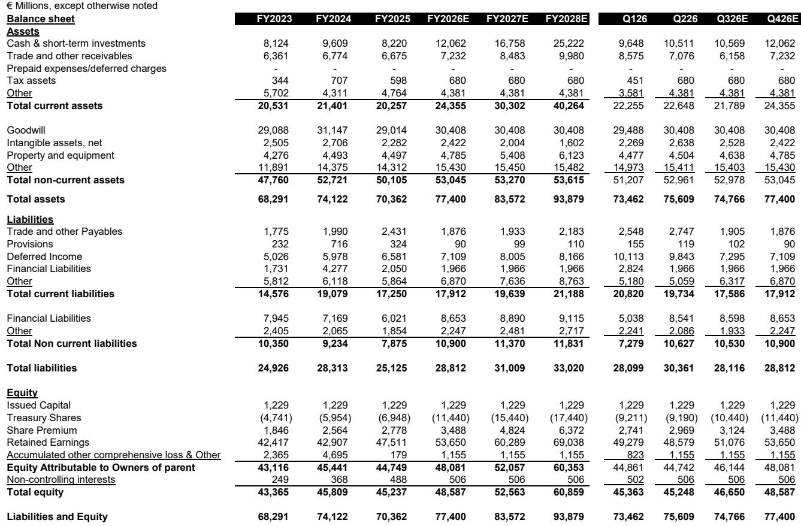
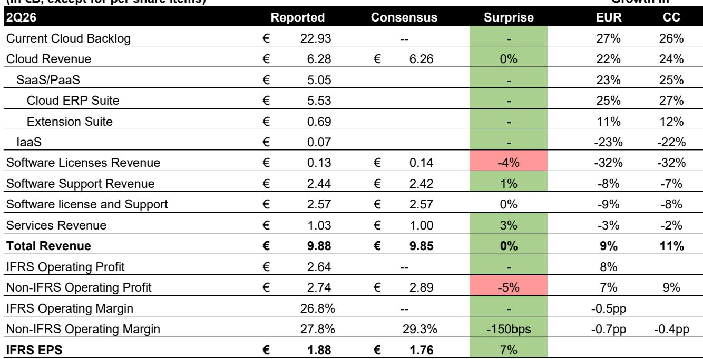
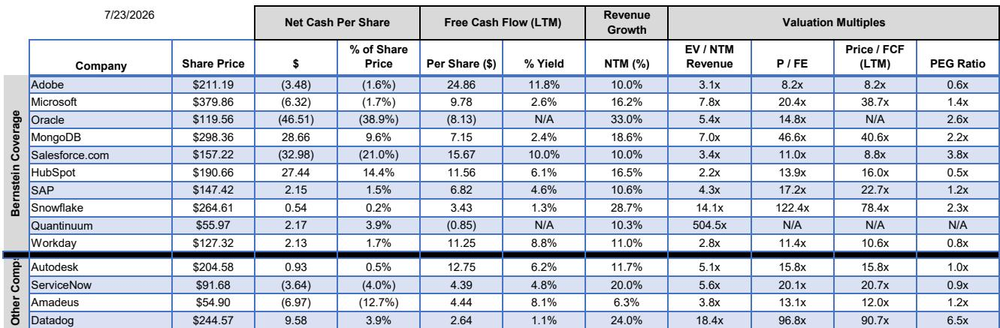

# SAP Q2 业绩观察：云转型进入验证阶段，成本管控成为关键

SAP在2026财年第二季度交出了一份值得关注的成绩单。当前云积压订单（CCB）按固定汇率计算增长26%，超出市场预期——这一指标在经历了上一季度的波动后，已成为衡量公司健康状况最受关注的参考。同期，非IFRS营业利润率为27.8%，略低于市场共识约150个基点。管理层将全年营业利润指引下调1亿欧元，以反映7月完成的两项收购（Dremio和Prior Labs）带来的稀释效应。公司股价在盘后交易中上涨约4%。

这份看似矛盾的业绩报告，实际上揭示了公司云转型进入新阶段的特征：积压订单的动能反映了真实的需求韧性，但利润率的提升已不再是收入结构变化的自然结果。那些将SAP视为不确定环境中避风港的观察者，现在需要重新审视。利润率的故事是真实的，但它不再是自动发生的。未来12个月，将区分出那些能够精准管理成本的公司，与那些依赖收入增长掩盖运营问题的公司。

## CCB超预期是最重要的数据点，因为它反驳了增长放缓的论调

在Q2业绩发布前，市场存在一个特定的担忧：SAP的当前云积压订单——即未来12个月已签约但尚未确认的云收入——可能处于持续下降的轨道。这一担忧源于2025财年Q4的业绩不及预期，当时CCB低于市场预期，管理层此前关于可能超预期的乐观表态也未能兑现。而2026财年Q2的结果——固定汇率下增长26%，且Reltio收购的贡献不到1个百分点——直接挑战了这一叙事。

这一指标的结构性意义不容忽视。对于一家消费型收入仅占云总收入一小部分的公司而言，CCB是未来四个季度增长最可靠的先行指标。当CCB增速超过当前云收入增速时（本季度正是如此），意味着承诺的未来收入管道扩张速度快于已确认收入的基数。这为2026财年下半年及2027财年云收入的加速增长奠定了基础。

这一超预期表现之所以具有说服力，还在于宏观背景。本季度是在全球不确定性上升的背景下展开的，包括中东地区的局势以及喜忧参半的软件行业财报季（IBM的Q2业绩也包含在内）。管理层在财报电话会议上表示，目前只有少数交易直接受到地区不稳定的影响。这传递了一个清晰的信号：SAP的云ERP迁移周期并未被影响其他企业软件类别的宏观因素所干扰。由传统ECC维护截止日期驱动的ERP替换周期，仍然是一个结构性的需求驱动因素，其运行在一定程度上独立于季度GDP波动。

## 利润率不及预期并非单季异常，而是对管理层成本管控能力的考验

这是几个季度以来，SAP首次未达到营业利润率共识预期。非IFRS营业利润率为27.8%，低于市场预期的29.3%，差距为150个基点。管理层将这一差距归因于与自主ERP（Autonomous ERP）发布相关的研发支出增加、营销投入加大，以及7月完成收购的初期影响。

看空的观点现在将从CCB转向利润率。这一转变是合乎逻辑的。对于一家研究逻辑建立在两大支柱——云转型和利润率提升——上的公司而言，利润率支柱现在需要主动捍卫。软件公司在选择行使成本控制权时，对其成本结构拥有非凡的杠杆作用。管理层在电话会议上明确表示，他们计划在今年剩余时间内不会大幅增加研发或营销方面的人员招聘或支出。这一声明是一个承诺，而非预测。它需要在未来几个季度中，根据可观察的行为来评判。

一个关键的细微差别是，全年营业利润指引下调1亿欧元完全归因于7月完成的Dremio和Prior Labs收购，这两项收购将使营业利润稀释超过1亿欧元。排除这两项交易，指引区间的中点实际上没有变化。这并非核心业务的恶化，而是对并购具有短期成本的透明承认。对观察者而言，问题在于管理层能否在整合这些收购的同时，实现独立业务本应产生的利润率提升，且不出现成本超支。

## SAP的AI策略是防御性护城河，而不仅仅是进攻性机会

今年困扰整个软件行业的AI颠覆叙事，对企业应用公司带来了一个特定威胁：AI原生架构将把定价从订阅制转向消费制，压缩利润率，并且客户可能会用AI代理或定制解决方案取代打包应用。SAP的Q2业绩，结合独立的调研数据，提供了一个值得认真对待的反驳观点。

近期一项由同一研究团队进行的CIO调研，以及与三位首席信息官的直接讨论，得出了一个一致的发现：企业更倾向于从其现有的打包软件供应商那里获取AI能力，而不是替换核心应用。理由很务实。像SAP这样的核心ERP系统，深度嵌入财务合并、供应链规划和合规性工作流程中。为了获得AI功能而替换它们，将带来大多数CIO不愿承担的操作风险。转换成本不仅是财务上的，更是组织层面的。

SAP的AI策略——将能力嵌入其云ERP套件，而非作为独立产品提供——与这一客户偏好相吻合。该公司并非试图将AI作为单独的收入项目。它正在利用AI来深化现有订阅关系的价值。这一策略在保护订阅收入基础的同时，也创造了长期的增量定价机会。基于现有证据，AI将商品化SAP应用的风险似乎被夸大了。更大的风险在于SAP未能执行其自身的AI路线图，而非AI使其产品过时。

## 决策框架：决定SAP能否维持其估值溢价的四个条件

SAP目前的估值约为前瞻市盈率的17.2倍，企业价值与未来12个月收入之比为4.3倍。这一倍数反映了市场对其增长、利润率提升潜力以及被认为对AI颠覆具有免疫力的溢价。这一估值只有在公司未来两到四个季度满足以下四个条件时才能得到支撑。

第一，CCB增长必须保持在固定汇率下的20%以上。增速降至22%以下将表明ERP迁移周期比预期更早达到峰值，届时无论利润率表现如何，公司估值都将面临下调。第二，非IFRS营业利润率必须在2026财年结束时超过30%，并显示出向30%中段迈进的清晰轨迹。Q2的不及预期重置了基准；观察者现在将要求环比改善，而不仅仅是同比增长。第三，云收入增长必须在2026年下半年加速，正如CCB超预期所暗示的那样。如果云收入增长在积压订单强劲的情况下反而减速，那么CCB与已确认收入之间的相关性将受到质疑。第四，管理层必须证明Dremio和Prior Labs的收购在完成后的12个月内能够贡献或提升利润率。任何表明整合成本正在侵蚀核心利润表的迹象，都将直接削弱利润率逻辑。

这四个条件相互独立且覆盖全面。如果全部满足，当前的估值是合理的，公司价值可以持续累积。如果任何一个条件未能实现，估值溢价将被压缩，SAP将更像一家成熟的企业软件公司，而非增长型公司。

## SAP的云转型进入验证阶段，利润率故事需要主动管理

2026财年Q2的业绩确认了SAP的云转型仍在正轨上。CCB超预期、重申全年指引（排除收购影响），以及管理层团队刻意避免过度乐观的措辞，都指向一家在复杂宏观环境中以纪律性执行的公司。该公司已做好准备，在下半年及2027财年实现云收入的加速增长。

但利润率的不及预期引入了一个新变量。在本轮周期中，SAP的成本结构首次未能随着收入结构变化而自动改善。公司现在必须主动管理研发、营销和收购整合成本，以实现研究逻辑所要求的利润率提升。管理层关于今年剩余时间保持员工人数和支出平稳的声明，是一个正确的信号。市场现在将关注后续的执行情况。

SAP仍然是欧洲软件领域质量最高的公司之一。其产品是全球最大、最复杂企业的关键基础设施。ERP迁移周期提供了多年的需求可见性。AI颠覆虽然真实存在，但鉴于企业倾向于从现有供应商处购买AI能力，它似乎更可能使SAP受益而非对其造成冲击。只要管理层在利润率方面执行到位，该公司在当前估值水平下的风险回报特征具有吸引力。

未来两个季度关注的焦点将不仅仅是云收入增长。它们将关乎SAP能否在收入增长的同时提升利润率——以及利润率的故事是一个结构性的现实，还是一个季度性的愿景。

*仅供参考。部分内容可能基于源材料通过AI辅助生成、翻译、总结或编辑，可能存在遗漏或错误。请独立核实。本文不构成任何专业建议。*

仅供参考。部分内容可能基于源材料通过AI辅助生成、翻译、总结或编辑，可能存在遗漏或错误。请独立核实。本文不构成任何专业建议。

