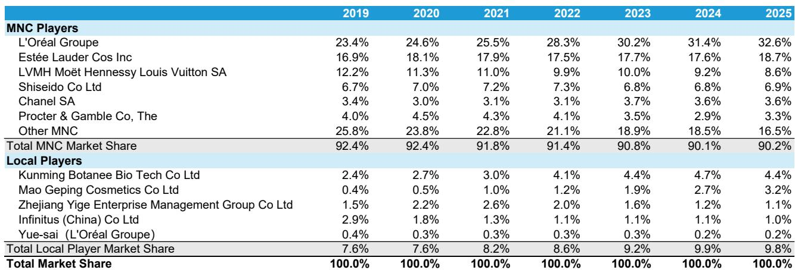
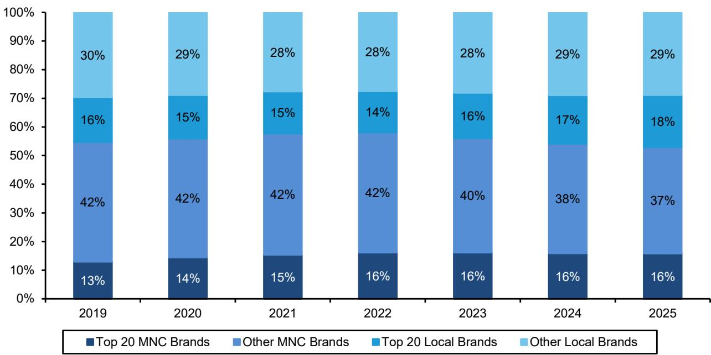
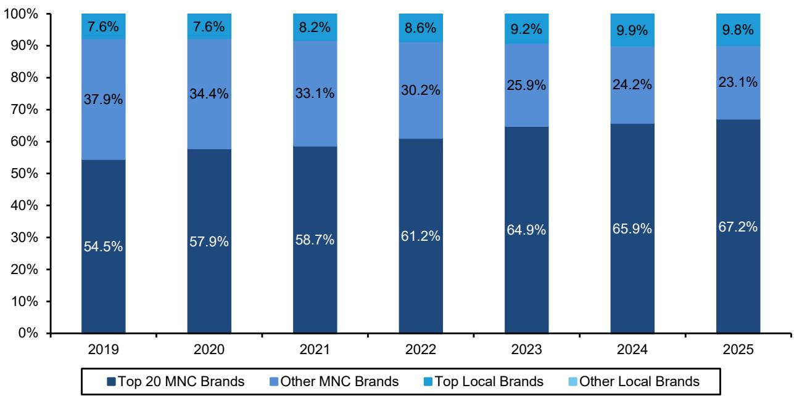

# Estée Lauder and SK-II Are Rebounding in China, but the Durability of Their Recovery Depends on Whether 2025 Was a Structural Inflection or a Temporary Tailwind

The most striking development in China’s prestige beauty market over the past year is not the return of growth itself, but the speed and concentration of it. After a 2024 decline, Estée Lauder’s portfolio in Mainland China grew 9% year over year in 2025, while Procter & Gamble’s SK-II — which had been losing share steadily since 2021 — stabilized and gained ground. Both companies outperformed a prestige beauty market that expanded 6% in 2025, a welcome reversal after a contraction the prior year. For those tracking these two turnaround narratives, the critical question is not whether the recovery is real, but whether its drivers are durable.

The answer requires separating structural improvement from one-time factors. A durable turnaround would ideally rest on three pillars: a growing addressable market, consistent share gains, and favorable sub-category tailwinds. The data from Euromonitor, analyzed in a recent Bernstein report, shows that all three conditions are present to varying degrees, but none are secure. The prestige beauty market is still below its 2021 peak, meaning there is room for further recovery, but the on-off pattern of growth makes another soft year just as plausible as a strong one. Market share trends for both Estée Lauder and SK-II improved in 2025, but the gains were not evenly distributed across brands or categories. And the sub-category mix — particularly the dominance of skincare, where loyalty is high and local competition is low — provides a favorable structural backdrop, but only if the right brands execute.

The most important insight from the competitive landscape data is what did not happen in 2025. Contrary to a widely repeated narrative, the multinational recovery was not driven by Chinese brands imploding or ceding share. Local players held 9.8% of the prestige segment in 2025, virtually unchanged from 9.9% in 2024. They did not retreat. The multinational rebound came from within the existing competitive structure, which means its sustainability depends on factors specific to each company’s strategy, not on a generalized weakening of local rivals. This is an encouraging sign for the turnaround, but it also raises the bar for proof: if the recovery was not simply a market-share reallocation from weak local competitors, then it must be explained by reinvestment, innovation, or channel dynamics — and those explanations need to hold up under scrutiny.

## The Prestige Beauty Market in China Is Growing Again, but the Pattern of Lumpy, Unpredictable Growth Means the Recovery Is Not Self-Sustaining

The prestige beauty market in China reached RMB 186 billion in 2025, equivalent to roughly USD 27 billion, up from RMB 138 billion in 2019. That represents a 5.1% compound annual growth rate over six years, a respectable figure but a far cry from the double-digit expansion that characterized the pre-Covid period. More telling is the shape of the recovery: the market grew 6% in 2025 after declining in 2024, but it remains below its 2021 peak. This is not a smooth, predictable upward trajectory. It is a series of sharp inflections driven by consumer sentiment, policy shifts, and channel realignments.

The structural trend that does stand out is the continued premiumization of Chinese beauty consumption. Prestige beauty’s share of total beauty sales rose from 37% in 2019 to 44% in 2025, and it has consistently outpaced the mass market. Over the same period, mass beauty growth was flat. This is a durable tailwind for any company with a strong position in the premium tier. However, the lumpiness of annual growth rates means that a company cannot simply rely on market expansion to carry it forward. In 2025, both Estée Lauder and SK-II grew faster than the market, which is the right direction. But the market itself is not yet on a stable growth path, and another year of contraction or stagnation would remove that tailwind entirely. The recovery is real, but it is fragile.

## Estée Lauder’s 2025 Share Gains Were Concentrated in the Namesake Brand and La Mer, Revealing a Portfolio That Depends on Two Engines Rather Than a Broad Recovery

Estée Lauder’s overall share of the China prestige beauty market rose from 17.6% in 2024 to 18.7% in 2025, a meaningful gain in a single year. But the composition of that gain matters more than the aggregate number. In skincare, which accounts for 69% of the prestige market, the Estée Lauder brand reversed a multi-year decline and grew its share from 10.3% to 10.9%. That is a notable turnaround, but it follows four consecutive years of erosion from a 2019 peak of 12.2%. The brand has not yet recovered to its prior level. Meanwhile, La Mer has been the consistent outperformer, gaining share every single year from 3.7% in 2019 to 7.6% in 2025. Clinique and Origins remain stagnant or declining.

This pattern tells a specific story. La Mer’s steady gains suggest a structural advantage in the ultra-premium segment, where brand equity, efficacy claims, and consumer loyalty are harder for competitors to disrupt. The Estée Lauder brand’s rebound, by contrast, is a recent and still fragile inflection. The key question is what caused it. The new CEO’s focus on media investment and innovation is the most plausible explanation, but the data cannot yet distinguish between a sustainable reinvestment-driven recovery and a one-time boost from channel shifts — particularly the normalization of travel retail flows, which had distorted mainland China sales in prior years. If the rebound was largely a function of destocking ending and duty-free traffic normalizing, then it may not repeat in 2026 without further spending. If it was driven by genuine brand reinvestment and product innovation, then the trajectory is more promising. The next earnings cycle will be decisive.

## SK-II’s Stabilization in 2025 Breaks a Four-Year Decline, but the Brand’s Recovery Is Still Below Its 2019 Share and Faces a Structural Headwind from Japanese Brand Sentiment

SK-II’s trajectory in China is a case study in how geopolitical and consumer sentiment shocks can reshape brand trajectories. From a 2019 share of 5.8% in prestige skincare, SK-II grew to 6.3% in 2020, then began a steady decline that bottomed at 4.1% in 2024. The 2025 rebound to 4.8% is a welcome reversal, but the brand is still a full percentage point below its 2019 level. The decline was partly driven by weaker consumer sentiment toward Japanese brands following the Fukushima wastewater discharge, a headwind that is not entirely dissipated.

The 2025 stabilization suggests that the worst of the sentiment impact may be behind the brand, and that reinvestment in marketing and distribution is having an effect. However, the recovery is narrow. SK-II’s share gain in 2025 was not enough to return it to the ranks of the top-tier skincare brands in China, and it remains well behind L’Oréal’s Lancôme and Helena Rubinstein, both of which have gained share consistently. The durability of SK-II’s recovery will depend on whether the brand can rebuild the consumer trust and desirability it lost during the decline, which is a slower and more uncertain process than the initial stabilization. A single year of share gain is not a trend.

## The Competitive Structure of Prestige Beauty Remains Dominated by Multinationals, but Local Players Are Not Retreating — They Are Consolidating in Niche Segments

One of the most frequently cited narratives in the beauty industry is that Chinese consumers are turning away from multinational brands and embracing domestic alternatives. The data supports this narrative at the total beauty market level, where local brands account for 47% of sales and have been gaining share from multinationals. But in the prestige segment, the picture is fundamentally different. Local players account for less than 10% of the market, and that share has been essentially flat since 2022. In 2025, it actually declined slightly from 9.9% to 9.8%.

This does not mean local brands are irrelevant. They are highly relevant in specific sub-categories. In color cosmetics, local penetration is 15%, compared with roughly 10% in skincare and minimal levels in fragrance and hair care. The reason is structural: consumers are more willing to experiment with new lipstick shades and makeup brands driven by trends, while demonstrating higher loyalty in skincare, where efficacy and trust matter more. Local brands like Mao Geping have gained share in color cosmetics, rising from 1.9% in 2023 to 3.2% in 2025, but they have not yet cracked the skincare dominance of multinationals. For Estée Lauder and SK-II, this means the competitive threat from local players is real but contained to specific categories where they have less exposure. The bigger risk is not that local brands will take over the prestige segment, but that they will continue to fragment the market and make it harder for any single multinational to gain share.

## A Decision Framework: Three Conditions Must Hold for the China Turnaround to Be Durable

For those evaluating Estée Lauder and Procter & Gamble, the China recovery is a critical variable, but it cannot be assessed in isolation. The durability of the turnaround depends on three conditions, each of which can be tracked with observable data.

First, the prestige beauty market must sustain growth. A return to the lumpy pattern of 2022-2024, where growth alternates with contraction, would remove the tailwind that made 2025 possible. The market is still below its 2021 peak, which provides a buffer, but the on-off nature of recent years means another decline is equally plausible. Observers should monitor quarterly prestige beauty sales data in China as a leading indicator.

Second, the Estée Lauder brand must continue to gain share in both skincare and makeup. The 2025 rebound in the namesake brand was the single most important driver of the portfolio’s improvement. If that gain was driven by reinvestment in media and innovation, it can be sustained. If it was driven by channel normalization or one-time events, it will fade. The distinction can be observed in the company’s reported marketing spending, innovation pipeline disclosures, and channel mix commentary.

Third, SK-II must show that its 2025 stabilization is the beginning of a recovery trend, not a one-time bounce. The brand’s share is still below 2019 levels, and the structural headwind from Japanese brand sentiment has not fully cleared. A second consecutive year of share gains would be a strong signal. A flat or declining year would confirm that the recovery was temporary.

If all three conditions hold, the China turnaround is structural. If any one falters, the recovery will prove to be a temporary inflection in a longer period of adjustment. The data from 2025 provides reasons for optimism, but it does not yet provide certainty. The next twelve months will be the test.

*For informational purposes only. Portions may be generated, translated, summarized, or edited with AI assistance based on source materials and may contain omissions or errors. Please verify independently. This is not professional advice.*

For informational purposes only. Portions may be generated, translated, summarized, or edited with AI assistance based on source materials and may contain omissions or errors. Please verify independently. This is not professional advice.

