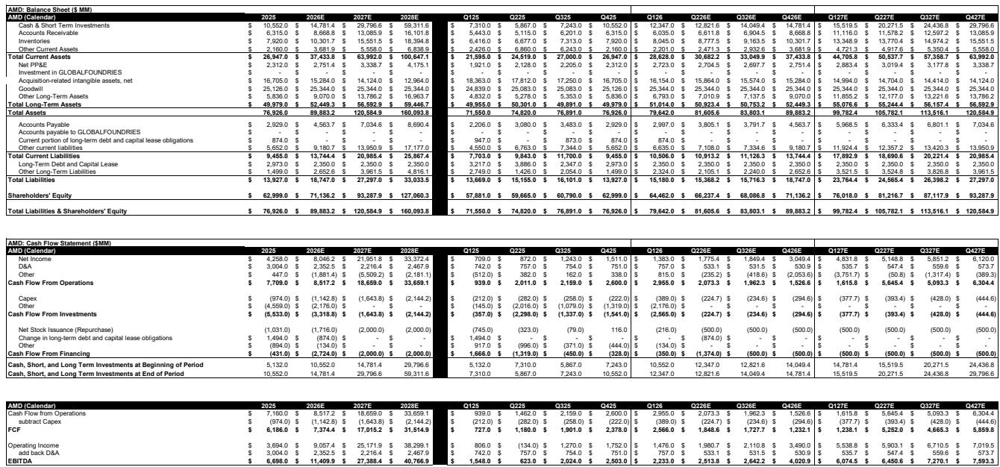
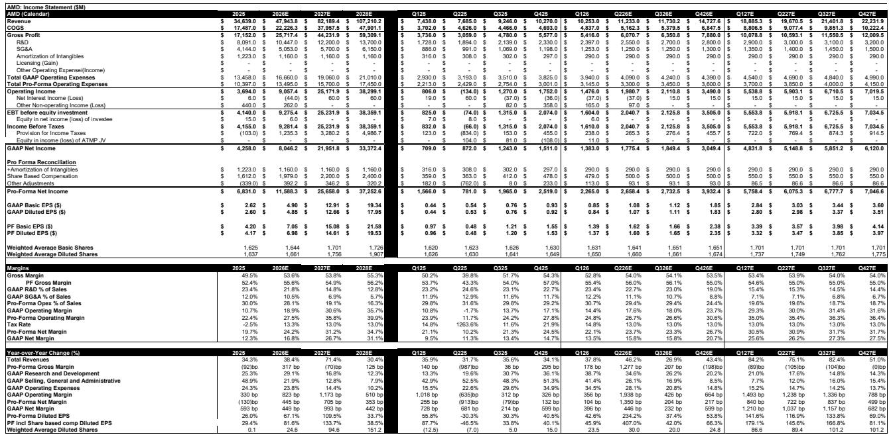
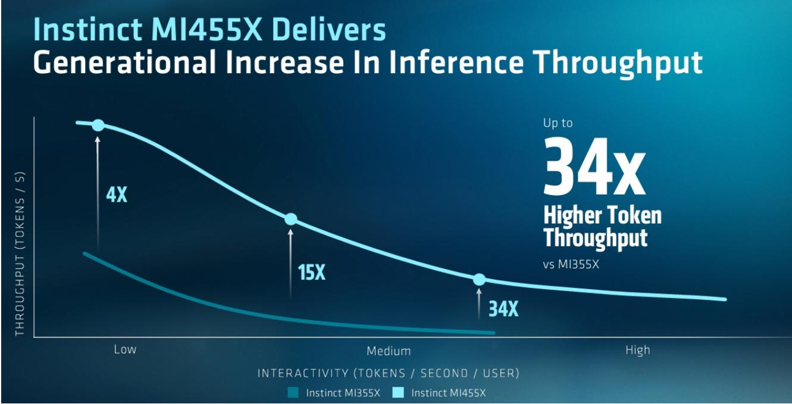

# AMD’s Advancing AI Event Reveals a Company That Has Become a Two-Engine AI Growth Story

When Advanced Micro Devices raised its addressable market for CPUs to $220 billion by 2030—nearly double the $120 billion figure it had presented just three months earlier—the company sent a clear signal that its strategic positioning has shifted. This was not a routine product update. The event, held July 22-23, culminated in a keynote and investor Q&A that revealed a company whose AI opportunity now spans both its traditional CPU business and its fast-growing GPU accelerator line. The total compute TAM AMD now sees is roughly $2 trillion by 2030, a figure that implies a compound annual growth rate of approximately 40 percent from the $365 billion base in 2025. For observers tracking the semiconductor landscape, the implications are twofold: AMD is no longer a single-product AI story, and its competitive posture against both x86 and Arm-based rivals is strengthening in ways that merit close attention.

The timing of these announcements matters. AMD’s MI455X ramp is expected to begin in the third quarter of this year and accelerate into the fourth quarter, meaning the revenue impact from its latest GPU generation is imminent. The company also unveiled its Helios architecture, branded as MI450, with performance benchmarks that management positioned as competitive against both its own prior generation and competitor roadmaps. While such internal benchmarks always warrant skepticism, the broader pattern is clear: AMD is executing on an annual release cadence for rack-scale GPU systems, with the MI500 and MI600 series slated for 2027 and 2028 respectively. The combination of an expanded TAM forecast, concrete product timelines, and new customer partnerships creates a narrative that deserves rigorous examination.

The most strategic takeaway from the event is that AMD’s AI opportunity is bifurcated and mutually reinforcing. The CPU TAM upgrade—driven overwhelmingly by agentic AI workloads—validates the thesis that inference compute demand will not be satisfied by GPUs alone. Simultaneously, the accelerator TAM projection of $1.4 trillion by 2030, growing at roughly 45 percent CAGR from $200 billion in 2025, positions AMD’s GPU business as a long-duration growth engine. The company’s challenge is no longer about proving it has a credible AI product. It is about demonstrating that it can capture share in two parallel markets while managing the operational complexity of an annual product cadence.

## The CPU TAM Upgrade Confirms That Agentic AI Will Drive a New Compute Architecture, Not Just More GPUs

AMD’s decision to nearly double its CPU TAM forecast in a three-month window deserves more than a surface-level reading. The prior estimate of $120 billion was already aggressive by historical standards. The new figure of $220 billion implies that AMD expects the CPU market to grow from roughly $26 billion in 2025 to that level by 2030, representing a compound annual growth rate exceeding 50 percent. The driver, according to management, is agentic AI—workloads where AI models act autonomously to execute multi-step tasks, requiring substantial host-node compute capacity that CPUs provide.

This is not a marginal adjustment. It reflects a fundamental assumption about how AI infrastructure will be deployed. In a world where AI agents need to interact with databases, execute code, manage workflows, and coordinate with other agents, the CPU becomes the orchestrator. AMD’s new Venice CPU portfolio, which includes variants tailored specifically for GPU server host nodes, agentic CPU servers with high core counts, and general-purpose servers, is designed to capture this heterogeneity. The Venice 256c variant, with its high core count and high average selling price, is explicitly positioned for agentic workloads. If AMD’s TAM assumption proves correct, the CPU business will generate revenue growth rates that rival those of its GPU segment, albeit from a smaller base.

The strategic implication for enterprise buyers is that CPU procurement decisions will become more complex. Organizations building AI infrastructure will need to evaluate not just GPU throughput but also the CPU architecture that supports it. AMD’s claim of a favorable competitive position against both x86 incumbents and Arm-based alternatives suggests it sees an opening to gain share in this redefined market. The risk is that the TAM forecast embeds aggressive assumptions about the pace of agentic AI adoption. If enterprises adopt agentic workloads more slowly than anticipated, the CPU growth trajectory will moderate accordingly.

## Three Tier-One Customer Partnerships Validate AMD’s GPU Architecture and Create a Credible Competitive Ecosystem

The announcement that Anthropic has joined OpenAI and Meta as a major customer for AMD’s Helios architecture marks a critical inflection point. AMD will invest up to $5 billion in this partnership, and the companies will collaborate on ROCm, AMD’s software stack. Anthropic’s commitment to deploy up to 2 gigawatts of compute, with the first gigawatt targeted for 2027, provides a tangible demand signal that extends beyond the typical hyperscaler relationship. The partnership with Microsoft to deploy Helios at scale on Azure, while lacking specific volume targets, adds another layer of validation.

These relationships matter because they address the most persistent criticism of AMD’s AI strategy: the software ecosystem. NVIDIA’s CUDA moat remains formidable, and AMD’s ROCm has historically lagged in developer adoption and tooling maturity. The introduction of ROCm.AI, an AI-driven development platform that uses AI coding agents to optimize GPU performance, represents AMD’s attempt to leapfrog rather than catch up. The platform claims a 3.3x average performance improvement across key inference models including DeepSeek-R1 and GLM-5. If ROCm.AI delivers on these claims, it could accelerate developer adoption by reducing the manual optimization effort required to achieve competitive performance.

The partnership with Cerebras for ultra-low-latency inference adds another dimension. By combining AMD’s high-throughput Instinct GPUs with Cerebras’ wafer-scale, low-latency engine, AMD is creating a hybrid solution that addresses a specific segment of the inference market: workloads that require both high throughput and sub-millisecond latency. This mirrors NVIDIA’s approach with Groq, though AMD’s partnership structure is less integrated. The joint solution is expected to be available via Cerebras Cloud in the second half of 2026. For enterprise customers with latency-sensitive applications such as real-time fraud detection or interactive AI agents, this offering could become a differentiated option.

## A Decision Framework for Evaluating AMD’s AI Strategy: Three Questions Every Observer Should Ask

The volume of announcements at the Advancing AI event can obscure the core strategic questions that determine whether AMD’s trajectory is sustainable. A disciplined evaluation framework requires focusing on three dimensions: product cycle execution, software ecosystem traction, and TAM realization.

**First, can AMD sustain an annual product cadence without execution missteps?** The roadmap for Helios, MI500, and MI600 series implies that AMD intends to release a new rack-scale system every year through 2028. This is an aggressive pace for a company that has historically struggled with GPU software stability and driver maturity. The MI455X ramp starting in the third quarter will be the first test. Any delays or quality issues would not only affect revenue but also undermine customer confidence in the roadmap. The benchmark data AMD presented—showing Helios outperforming Vera Rubin and its own MI350—should be treated as directional rather than definitive until independent validation emerges.

**Second, will ROCm.AI meaningfully close the software gap with CUDA?** The 3.3x performance improvement claim is impressive, but it applies to a specific set of models and workloads. The broader question is whether ROCm.AI reduces the total cost of ownership for enterprises deploying AI at scale. Developer time, debugging effort, and ecosystem compatibility matter as much as raw performance. AMD’s partnership with Anthropic on ROCm development is strategically significant because it aligns a major AI lab with AMD’s software stack. If Anthropic’s engineers contribute optimizations that benefit the broader ecosystem, the network effects could accelerate adoption. The risk is that ROCm.AI remains a niche tool rather than a platform that challenges CUDA’s dominance.

**Third, how much of the $2 trillion compute TAM is realistically addressable?** AMD’s TAM projections assume that AI inference will dominate compute demand and that AMD can capture a meaningful share of both CPU and GPU spending. The CPU TAM upgrade to $220 billion is particularly aggressive. It implies that agentic AI will require CPU compute at a scale that dwarfs traditional server workloads. While this thesis is plausible, it depends on assumptions about workload composition, model architecture trends, and enterprise adoption rates that are inherently uncertain. A conservative scenario where agentic AI adoption is slower, or where inference is more efficiently handled by specialized accelerators, would compress the CPU TAM significantly.

## The Enterprise and Edge AI Announcements Signal a Broader Strategy Beyond Hyperscaler Data Centers

While the hyperscaler partnerships dominate headlines, AMD’s announcements in enterprise, personal, and physical AI reveal a strategy to capture demand across the full compute stack. The Instinct 350P GPU, positioned as a cost-effective, easy-to-deploy solution for on-premises data centers handling non-frontier workloads, addresses a real pain point for enterprises that cannot or will not build hyperscale infrastructure. Power and cooling constraints, deployment complexity, and cost are cited as the primary barriers to enterprise AI adoption. The 350P is AMD’s attempt to lower those barriers.

The personal AI compute solutions, including the Ryzen AI400 and Ryzen AI Max, which can run models ranging from 24 billion to 200 billion parameters, target a different segment: developers and professionals who need local inference capability. The Gorgon Halo developer platform complements this by providing a standardized environment for AI application development. These products may seem small relative to the data center business, but they serve a strategic purpose. By enabling AI workloads on client devices, AMD creates a pipeline for developers who will later deploy at scale on AMD’s server infrastructure.

The KRIA AI Robotics platform, a turnkey robotics developer solution, extends AMD’s reach into physical AI—a market that includes autonomous machines, industrial automation, and edge inference. While the revenue contribution from robotics is likely to be modest in the near term, the strategic logic is sound. AI workloads are increasingly heterogeneous, spanning cloud, edge, and endpoint devices. AMD’s ability to offer a unified architecture across these form factors could become a competitive advantage as AI deployment becomes more distributed.

## The Revenue Trajectory Implied by AMD’s Event Is Credible but Priced for Perfection

The financial forecasts accompanying the event paint a picture of rapid growth. Revenue is projected to rise from approximately $34.6 billion in 2025 to $82.2 billion in 2027 and $107.2 billion in 2028. Pro-forma earnings per share are expected to grow from $4.17 in 2025 to $14.61 in 2027 and $19.53 in 2028. These figures imply that AMD’s GPU business will scale dramatically, driven by both volume growth and improving gross margins as the product mix shifts toward higher-value accelerator systems.

The gross margin trajectory is worth examining. Pro-forma gross margins are forecast to improve from 52.4 percent in 2025 to 55.6 percent in 2026, then moderate slightly to 54.9 percent in 2027 before rising to 56.2 percent in 2028. The moderation in 2027 likely reflects the cost of ramping new products and investing in manufacturing capacity. The long-term margin expansion assumes that AMD achieves sufficient scale to offset the inherent cost of high-performance packaging and advanced node wafers. Any disruption in supply chain, yield, or competitive pricing could compress margins below these projections.

The valuation implied by these forecasts requires careful consideration. At the current price, the forward multiple on 2027 pro-forma EPS of $14.61 would be approximately 41 times. This is not inexpensive, but it reflects the growth premium that high-conviction AI stories command. The critical question is whether AMD can deliver on the product roadmap, software ecosystem, and customer commitments that underpin these financial projections. The event provided more evidence that the strategy is coherent and the execution is improving, but the gap between promise and delivery remains substantial.

*For informational purposes only. Portions may be generated, translated, summarized, or edited with AI assistance based on source materials and may contain omissions or errors. Please verify independently. This is not professional advice.*

For informational purposes only. Portions may be generated, translated, summarized, or edited with AI assistance based on source materials and may contain omissions or errors. Please verify independently. This is not professional advice.

