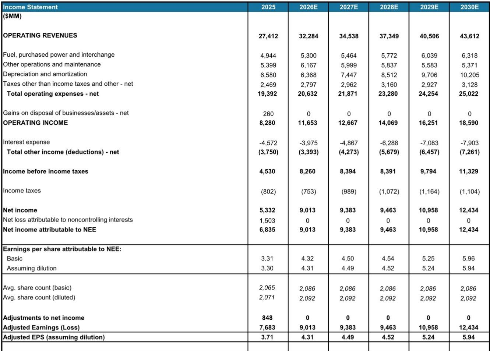
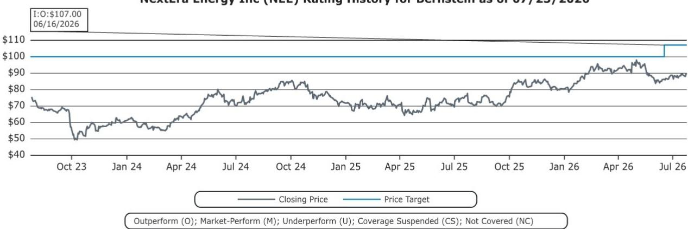
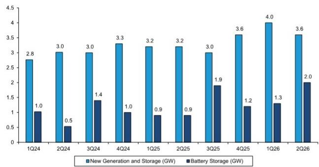

# NextEra Energy’s Q2 Results Prove the Data Center Demand Thesis Is No Longer Speculative—It Is a Measurable Growth Engine

NextEra Energy delivered adjusted earnings per share of $1.15 in the second quarter of 2026, beating consensus estimates of $1.13 and growing 9.5% year over year. The company reaffirmed its full-year 2026 adjusted EPS guidance at the high end of the $3.92 to $4.02 range. These numbers alone would constitute a solid quarter. But the real story lies beneath the surface: Florida Power & Light now reports 21 gigawatts of large-load interest, with 12 gigawatts in advanced discussions and 8 gigawatts in development expectations by 2032—up sharply from the 6-gigawatt figure previously disclosed. This is not a gradual uptick. It is a step-change in visible demand from data center operators and hyperscalers.

The significance of this quarter extends beyond the beat. NextEra Energy Resources added 3.6 gigawatts of renewables and storage origination, including 2 gigawatts of battery storage, pushing the total backlog to 35.1 gigawatts from 33 gigawatts in the prior quarter. The mix matters: battery storage now represents a growing share of new additions, reflecting a shift in what utilities and hyperscalers actually need. They are not just buying electrons. They are buying capacity, reliability, and load-following capability. NextEra is structuring its portfolio to deliver exactly that.

For observers who have followed the data center power demand narrative, the question has always been when the pipeline would convert into signed commitments and earnings visibility. This quarter provides the first concrete evidence that conversion is happening. The 12 gigawatts of advanced discussions at FPL are not exploratory inquiries. They represent active negotiations with counterparties that have passed initial screening and due diligence. Management expects to announce at least one large-load transaction at FPL by the end of the year. That milestone would transform the narrative from potential to reality.

The quarter also reinforces a structural advantage that is often underappreciated: NextEra operates across the full spectrum of the power value chain. FPL provides regulated rate base growth with 9.3% year-over-year growth in regulatory capital employed, while NEER provides unregulated growth through project development and recontracting. The Dominion merger, expected to close in the second half of 2027, adds another regulated growth platform in Virginia, North Carolina, and South Carolina—three states with their own data center demand profiles. The combined entity targets approximately 11% growth in regulatory capital employed through 2032 and 9%-plus adjusted EPS growth through 2035. This is not a single-product story. It is a multi-platform compounding machine.

## The 21-Gigawatt Large-Load Pipeline at FPL Represents a Structural Inflection in Regulated Utility Growth, Not a Cyclical Blip

Florida Power & Light has long been considered a well-run utility with steady rate base growth. The 21 gigawatts of large-load interest changes that characterization fundamentally. To put the number in context: FPL’s entire current peak load is approximately 28 gigawatts. The pipeline of potential new demand is equivalent to roughly three-quarters of the utility’s existing peak. Even the 8-gigawatt development expectation by 2032 represents nearly 30% of current peak load. For a regulated utility that typically grows rate base at 8% to 10% annually, this is a step-function acceleration.

The operational metrics behind this growth are equally important. FPL’s reliability is more than 60% better than the national average. Customer bills remain 30% below the national average. These two facts are not coincidental. They are the foundation of FPL’s competitive position in attracting large-load customers. Data center operators care about reliability above almost everything else. A utility with best-in-class reliability can command a premium in negotiations. At the same time, low customer bills reduce the political and regulatory friction that often accompanies large industrial load additions. FPL is not asking its existing residential customers to subsidize data center growth. It is absorbing that growth within a cost structure that remains favorable.

The regulatory capital employed growth of 9.3% year over year in the quarter, accelerating from 8.8% in the first quarter, confirms that the investment cycle is already underway. FPL spent approximately $2.8 billion in capex during the quarter alone, with the full-year guide remaining at $12 billion to $13 billion. As large-load customers convert from discussions to signed contracts, those capex numbers will likely move higher. The rate base compounding that has historically been steady and predictable is about to become faster and less linear.

## NEER’s Backlog Growth Is Shifting Toward Battery Storage, Signaling That the Market Now Values Firming Capacity Over Raw Megawatt-Hours

NextEra Energy Resources added 3.6 gigawatts of renewables and storage origination in the quarter, of which 2 gigawatts was battery storage. The total backlog now stands at 35.1 gigawatts, up from 33 gigawatts in the first quarter. The composition of these additions tells a more important story than the absolute number. Battery storage is not a secondary product line for NEER. It is becoming the primary driver of incremental backlog growth.

The reason is structural. Solar and wind generation are intermittent. Data centers require 24/7 power with near-zero downtime tolerance. A utility or hyperscaler that procures solar alone must also procure gas peakers or other firming capacity to cover the gaps. Battery storage solves that problem within a single procurement contract. A solar-plus-storage project can deliver a shaped output that matches the load profile of a data center more closely than solar alone. The 2 gigawatts of battery storage additions in this quarter suggest that NEER’s customers are increasingly choosing this bundled solution.

The recontracting data reinforces the same point. Since the first quarter earnings call, NEER recontracted more than 500 megawatts of existing projects at an average premium of roughly $20 per megawatt-hour above recent realized pricing, with average terms of approximately five years. This is not a distressed roll-off. It is a value-accretive renegotiation. The operating fleet is proving that legacy contracts can be replaced at higher prices, not lower. For a company with tens of gigawatts of operating assets, the ability to recontract at premiums is a material source of earnings growth that is often overlooked in favor of new build activity.

The Duane Arnold nuclear restart remains on track for no later than the first quarter of 2029. The Iowa Utilities Commission has approved a generating certificate, and NEER has acquired the remaining minority interest, becoming the sole owner of the project. Nuclear restart is technically complex and capital-intensive. But for a company that needs firm, carbon-free capacity to serve data center customers, Duane Arnold represents a uniquely valuable asset. It is also a reminder that NEER is willing to pursue non-traditional solutions when the economics justify them.

## The 30-Potential-Hub Framework and Four Origination Channels Create a Base Case of 15 Gigawatts and an Upside Case of 30 Gigawatts-Plus by 2035

NextEra Energy Resources now has 30 potential data center hubs under discussion and expects to reach 40 by year-end. The origination strategy operates through four distinct channels: hyperscalers, investor-owned utilities, cooperatives and municipal utilities, and federal partners. Each channel has a different decision-making timeline, regulatory environment, and procurement model. The diversification across channels reduces the risk that any single customer or regulatory setback derails the overall growth trajectory.

The base case of 15 gigawatts of new generation to serve large-load customers by 2035 is not an extrapolation of current trends. It is a conservative estimate that assumes only a fraction of the current pipeline converts. The upside case of 30 gigawatts-plus assumes that the conversion rate improves as regulatory frameworks become clearer and as hyperscalers move from pilot projects to full-scale deployments. Both cases are plausible. The key point is that even the base case represents a doubling of NEER’s current renewable and storage backlog in the service of large-load customers alone.

The transmission buildout supports this thesis. NextEra Energy Transmission energized a 137-mile, 345-kilovolt transmission line in New Mexico ahead of schedule and on budget. MISO selected the company as part of a consortium for two large-scale 765-kilovolt transmission projects in Illinois. Transmission is the bottleneck for data center interconnection in many parts of the country. NEER’s ability to develop transmission infrastructure internally gives it a competitive advantage in delivering power to load centers that other developers cannot reach.

## The Dominion Merger Adds a Second Regulated Growth Platform in High-Demand States, Creating a Combined Entity with 11% Regulatory Capital Growth Through 2032

The merger with Dominion Energy’s three regulated utilities in Virginia, North Carolina, and South Carolina is proceeding on schedule. On July 15, the companies filed for approval with the Virginia State Corporation Commission, the North Carolina Utilities Commission, and the Public Service Commission of South Carolina. They also filed with the Federal Energy Regulatory Commission and the Nuclear Regulatory Commission. The S-4 registration statement became effective on July 23. Management continues to target a second-half 2027 close.

The strategic logic of the merger is straightforward. Virginia is the largest data center market in the United States, driven by the concentration of hyperscalers in Northern Virginia’s Loudoun County. North Carolina and South Carolina are emerging markets with growing data center activity. The combined entity will have regulated utility operations in three states that are all experiencing above-average load growth from digital infrastructure. The target of approximately 11% growth in regulatory capital employed through 2032 and 9%-plus adjusted EPS growth through 2035 implies that the combined entity will grow faster than either company could have achieved independently.

The regulatory approvals are not guaranteed. The Virginia and North Carolina commissions will scrutinize the merger terms, rate impacts, and service quality commitments. But NEER’s track record at FPL provides a powerful argument: the company has demonstrated that it can operate a large regulated utility with industry-leading reliability and below-average customer bills. That track record should reduce regulatory resistance, even if incremental concessions are required.

## A Decision Framework for Observers: Three Leading Indicators That Will Determine Whether NextEra’s Growth Trajectory Accelerates or Decelerates

The Q2 results provide a rich set of data points, but the future trajectory depends on three observable variables that observers can track in real time.

First, the conversion of FPL’s 12 gigawatts of advanced discussions into signed customer commitments. The first large-load transaction announcement, expected by year-end, will be the single most important catalyst for the company. It will validate the pipeline quality and provide a template for how FPL structures pricing, terms, and regulatory treatment for large-load contracts. If the first deal is large—say, 500 megawatts or more—it will signal that the conversion rate is accelerating.

Second, the pace and composition of NEER’s backlog additions. Battery storage additions should continue to grow as a share of total origination. If NEER can sustain quarterly additions of 3 to 4 gigawatts with a storage mix above 50%, it will confirm that the product strategy is working. Conversely, a slowdown in origination or a reversion to solar-heavy additions would suggest that the market is not yet ready to pay for firming capacity at scale.

Third, the Dominion merger timeline and regulatory conditions. Any material delay or unfavorable condition imposed by state regulators would reduce the combined entity’s growth rate. Observers should watch for orders from the Virginia and North Carolina commissions, which are likely to be the most consequential. If the merger closes on schedule with no major concessions, the combined company will have a clear path to the 11% regulatory capital growth target.

The company currently trades at 20.8 times forward earnings. That valuation is not cheap, but it is justified by the combination of regulated rate base compounding, unregulated project development, and the structural tailwind of data center demand. The Q2 results did not raise guidance, which some may interpret as a negative. But the quality of the pipeline data and the operational execution suggest that the guidance is conservative rather than constrained. The evidence is now on the table. The thesis is no longer theoretical.

*For informational purposes only. Portions may be generated, translated, summarized, or edited with AI assistance based on source materials and may contain omissions or errors. Please verify independently. This is not professional advice.*

For informational purposes only. Portions may be generated, translated, summarized, or edited with AI assistance based on source materials and may contain omissions or errors. Please verify independently. This is not professional advice.

