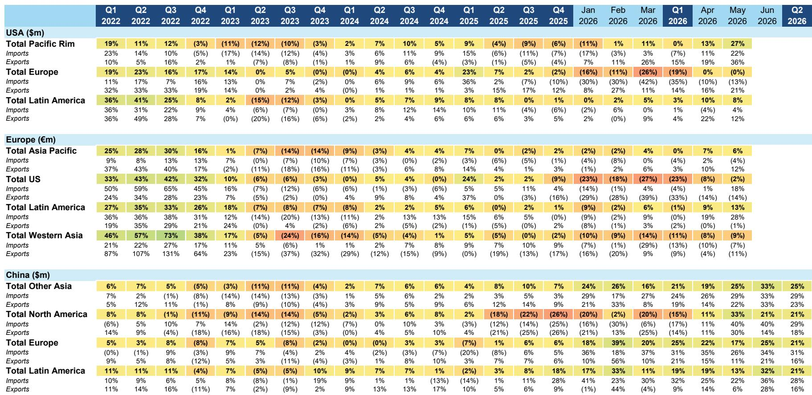
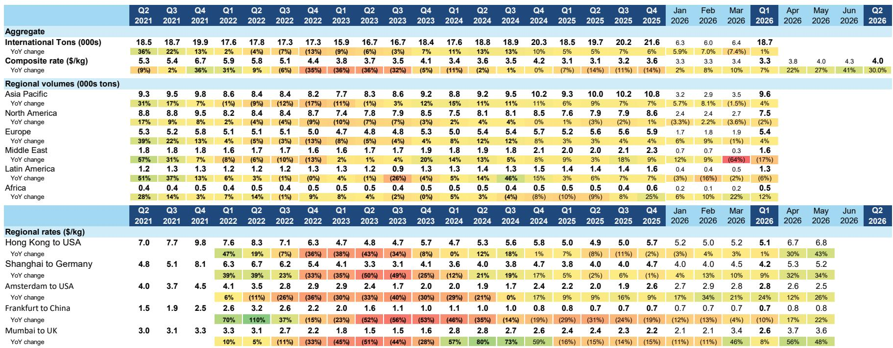
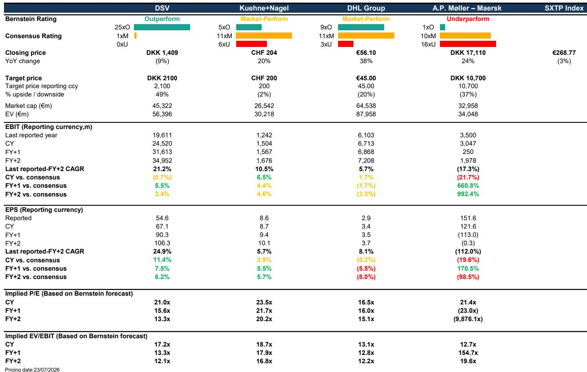

# 供应链费率结构性走高，但盈利顺风掩盖了需要选择性布局的分化

当前海运运费较冲突前水平高出逾100%。空运运费受运力紧张和燃油附加费推动，同比上涨25-30%。美国不含燃油的即期整车运费在最近一个月同比飙升48%，较5月已处于高位的34%进一步加速。全球物流行业正经历一场覆盖所有主要运输方式的同步费率上涨，人们自然会认为一场广泛的盈利繁荣正在发生。

这种直觉只有一半正确。费率环境确实对近期财务表现构成支撑，马士基已将其全年行业货运量增长预期上调至约4%。空运货量一直保持0-5%的增长，5月海运集装箱货量同比增长4%。尽管通胀压力持续且油价仍高于冲突前基线，消费需求依然保持韧性。货运量稳健与费率上升相结合，为当前季度创造了有利条件。

但推动这一周期的结构性力量在不同运输方式、地区和商业模式之间并不统一。海运的费率飙升是由红海航道关闭和季末前货物抢运共同维持的暂时现象，两者都将消退。美国卡车运输的费率飙升是由监管执法收紧和运力退出驱动的结构性现象，将持续存在。空运费率则介于两者之间，受人工智能和半导体需求支撑，但受制于自4月以来已开始恢复的运力。对观察者而言，战略问题不在于费率是否高企，而在于费率周期的哪些部分具有持久性，哪些是短暂的。

答案决定了如何在货运代理、集装箱航运公司、包裹承运商和铁路公司之间配置资源。该报告的股票评级提供了明确信号：DSV、联邦快递和联合包裹被给予“报告观点”，而马士基被给予“报告观点”。这种分化并非随意。它反映了轻资产商业模式与重资产模式之间的根本区别：前者从费率波动中受益而不承担资产风险，后者则面临即将到来的运力浪潮和结构性利润率压缩。未来12至18个月不会是所有物流公司都受益的上升浪潮，而将是一个剧烈分化的时期。

## 海运运费飙升是暂时喘息，而非机制转变

上海出口集装箱运价指数和世界集装箱指数均较冲突前水平高出逾130%，在季末附加费前货物提前出货引发的需求激增推动下，即期运费进一步上涨。马士基已上调业绩指引，行业正享受一段似乎在此前大规模集装箱船订单簿建造时难以想象的定价权时期。但这一周期的逻辑是脆弱的。

红海航道关闭阻止了2024年本可能发生的运费崩溃。绕行好望角的船只吸收了运力，收紧了供应，并赋予航运公司定价杠杆。这一动态现在正被逐步消化。中东任何持久的和平协议都将使苏伊士航线恢复通航，将吸收的运力释放回市场。集装箱航运订单簿仍然高企且不断增长，有意义的船舶拆解尚未开始。核心航运业务的大宗商品化、价格接受者性质意味着，当供应正常化时，费率将向下重置。

这就是为什么马士基的“报告观点”整合商战略——旨在将海运与端到端物流服务捆绑——七年来未能实现承诺的收入协同效应。红海中断带来的盈利提升是一次性事件，而非可持续优势。将当前海运费率水平外推为多年期论点的观察者，忽视了船舶供应的结构性过剩和地缘政治催化剂的脆弱性。

## 美国地面运输费率由结构性供应紧张驱动，而非需求

美国整车运输市场讲述了一个根本不同的故事。不含燃油的即期整车运费同比上涨48%，较5月的34%和此前三个月的约20-25%进一步加速。主要驱动力并非需求——尽管需求方面出现了一些希望曙光——而是供应。

监管执法正在多个维度收紧：语言要求、居住地规则、运营区域限制、服务时间合规性和培训标准。这些并非周期性因素，而是对可用司机和承运商池的结构性约束。更高的燃油成本增加了进一步压力，淘汰了财务困难的承运商。最高法院最近关于经纪人责任的裁决，将随着时间的推移，通过增加与经纪业务相关的法律风险进一步减少运力。影响需要时间才能显现，但方向是明确的：更少的运力、更高的费率和行业整合。

需求方面出现了一些令人鼓舞的迹象。ISM制造业读数已连续多个月为正。托运人对制造业活动的情绪有所改善，可能受到数据中心建设等工业活动的提振。年初至今国内多式联运总量今年首次转为正值，5月较去年同期高出约1%。但这些需求信号尚不足以单独推动费率周期。面向消费者的需求组成部分仍然疲弱。5月新屋开工数同比下降8.7%，低于经济学家预期的10.9%增长。

含义是明确的：美国地面运输费率是结构性看涨，而非周期性过热。这有利于具有定价权、成本纪律并涉足整车和多式联运领域的承运商。它也支持对联合太平洋、诺福克南方、JB亨特和联邦快递的“报告观点”，所有这些公司都受益于各自网络中的供应紧张，而不像面临运力浪潮的航运公司那样承担资产风险。

## 跨物流价值链布局的决策框架

暂时性与结构性费率驱动因素之间的分化，为投资组合构建提供了一个清晰的框架。该框架包含三个维度：商业模式资产密集度、对运力浪潮的敞口以及需求驱动因素的持久性。

首先，轻资产模式在波动的费率环境中胜出。DSV和德迅等货运代理拥有灵活的成本基础，不拥有船舶、卡车或飞机，从而避免了折旧和利用率风险。DSV是欧洲物流领域的首选，正是因为其并购记录和协同效应实现能力使其能够从市场波动中获取价值而不承担资产风险。对DB Schenker的整合预计将在2028年前实现税后每股收益超过100丹麦克朗，而一旦杠杆率正常化，公司重启股票回购和进行进一步交易的能力为这一论点增加了复利元素。

其次，避免面临运力浪潮的重资产模式。马士基是最明显的例子。集装箱航运订单簿将向市场交付新运力，而如果没有红海航道关闭，市场本已供应过剩。该公司的“报告观点”反映了当前盈利被一次性地缘政治事件所夸大，而非可持续竞争优势。

第三，青睐具有结构性需求顺风的承运商。空运受到人工智能、半导体和高价值电子产品运输的支撑。DHL和国际航空运输协会均预计2026年需求将增长2-3%，而货运代理业务的轻资产性质意味着货运代理能够获取费率上涨的好处，而不承担飞机拥有权风险。联邦快递和联合包裹受益于电子商务的结构性增长以及快递包裹领域的三寡头格局，这提供了定价纪律。DHL的快递部门——约占集团盈利的50%——在一个健康的寡头市场中运营，受益于贸易和电子商务推动的GDP+结构性增长。

因此，决策框架指向DSV、联邦快递、联合包裹、联合太平洋、诺福克南方和JB亨特为首选敞口，同时建议对马士基保持谨慎，并对DHL和德迅（两者均给予“市场表现”评级）进行选择性布局。

## 货运代理在上涨和下跌中均处于有利位置

货运代理在物流价值链中占据独特位置。他们不拥有实物资产，因此当费率下降时不承担折旧风险。他们管理货物运输的预订、文件和优化，因此只要货运量“报告观点”，他们在费率上升和下降时都能获取利润。这种不对称性是货运代理优势的核心。

DSV的“报告观点”是这一论点最有力的体现。该公司在二十年内完成了五次重大收购，并在实现高于最初预期的协同效应方面拥有可靠记录。DB Schenker交易是公司历史上最大的一笔，整合预计将在2028年前实现税后每股收益超过100丹麦克朗。一旦杠杆率恢复到约2倍，股票回购应以每年约240亿丹麦克朗的速度恢复，而当前市值约为3390亿丹麦克朗。进一步的并购随后成为可能，公司的雄心依然不变。

德迅遵循不同的战略，专注于有机增长和高股息支付，但轻资产原则是相同的。该公司已重新站稳脚跟，货运量增长企稳，成本削减支撑盈利。它正积极将自己定位为货运代理领域的人工智能赢家，强调其云原生运输管理系统、工作流所有权和清洁数据是竞争优势。“市场表现”评级反映了当前估值已捕捉到这些优势，但该商业模式在任何费率环境下都保持韧性。

DHL是一个更复杂的故事。该集团实际上是五个物流公司在一个企业伞下，约80%的息税前利润来自电子商务，70%来自世界贸易。快递部门提供结构性增长和定价纪律，但业务的资产密集性创造了双向作用的经营杠杆。约25%的快递运力通过短期租赁获得，提供了比表面看起来更多的灵活性，但该集团特别依赖于B2B货运量的反弹，这需要汽车、资本货物和技术等面临挑战的客户垂直领域出现改善。潜在的上涨催化剂是分拆：DHL已启动一项简化项目，将国内业务与控股公司分离并消除跨境法律实体，这两者都是任何部门分离发生前的必要条件。该公司以分拆价值折价交易，分离可能有助于缩小这一差距。3.4%的股息回报表现提供了底部支撑，但“市场表现”评级反映了对时机的不确定性。

## 铁路和包裹承运商以较少资产风险提供结构性供应紧张敞口

美国铁路和包裹行业为同一结构性主题提供了不同角度。铁路受益于卡车运输的供应紧张，因为当卡车费率上升时，多式联运需求从卡车转向铁路。国内多式联运总量年初至今的正增长是这一转变正在发生的早期迹象。联合太平洋和诺福克南方均被给予“报告观点”，反映了它们在收紧的市场中获取定价的能力，同时受益于运营改善和网络效率。

CSX被给予“市场表现”评级，反映了当前估值下更平衡的风险回报。加拿大国家铁路和加拿大太平洋堪萨斯城也被给予“市场表现”评级，跨境动态和监管环境为北美铁路主题增加了复杂性。

在包裹领域，联邦快递和联合包裹均被给予“报告观点”。快递包裹行业是一个三寡头市场，具有支持性的定价动态和电子商务的结构性增长。联邦快递受益于其全球网络和在其DRIVE计划下正在进行的成本转型。联合包裹受益于其在小型包裹递送领域的强势地位以及随着货运量恢复利润率改善的潜力。卡车运输的供应紧张也支持包裹定价，因为最后一英里配送网络面临类似的司机可用性限制。

JB亨特被给予“报告观点”，代表了对多式联运转换和整车经纪业务的纯正押注。该公司整合了多式联运、整车和经纪业务的模式，使其能够跨地面运输生态系统获取价值。卡车运输中供应驱动的费率环境直接惠及经纪业务和专用合同运输业务。

## 美国卡车运输的结构性论点建立在监管而非需求之上，这更具持久性

该报告中最重要的见解是，美国地面运输费率增长主要是一个供应故事，而非需求故事。这一区别很重要，因为供应驱动的费率周期往往比需求驱动的周期更具持久性。如果消费者支出减弱或工业生产放缓，需求可能迅速逆转。而通过监管、承运商退出和司机短缺嵌入的供应约束，则需要数年时间才能逆转。

目前正在进行的监管收紧并非暂时的政策转变。它反映了对语言能力、居住地要求、运营区域限制、服务时间合规性和培训标准等现有规则的执行。这些规则已存在多年，但执行力度不一。当前的执法周期正在减少合规承运商的可选池，而最高法院关于经纪人责任的裁决增加了另一层法律风险，将加速经纪行业的整合。

更高的燃油成本通过淘汰无法转嫁成本的财务困难承运商加剧了这一效应。油价成分因中东和平谈判进展而波动，但弱势承运商的淘汰是一个单向调整：一旦承运商退出，很少会回归。净效应是一个更小、更有纪律且拥有定价权的承运商基础。

需求方面显示出改善迹象，但改善集中在制造业和工业活动，而非面向消费者的领域。数据中心建设正在提振工业需求，ISM制造业读数已转为正值。但住房仍然疲弱，消费者可自由支配支出面临持续通胀和高利率的逆风。要使卡车运输周期从供应驱动过渡到需求驱动，消费者部门需要复苏。在此之前，费率环境由运力约束而非货运量增长支撑。

这一结构性论点有利于具有定价权、成本纪律并涉足工业和多式联运领域的承运商。它也表明，当前的费率环境比海运运费飙升更具可持续性，后者依赖于可能随时逆转的地缘政治中断。

*仅供参考。部分内容可能基于源材料通过人工智能辅助生成、翻译、总结或编辑，可能存在遗漏或错误。请独立核实。这不构成专业建议。*

仅供参考。部分内容可能基于源材料通过人工智能辅助生成、翻译、总结或编辑，可能存在遗漏或错误。请独立核实。这不构成专业建议。

