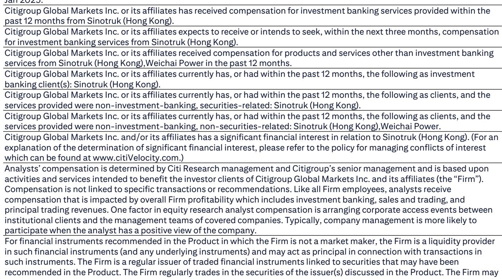
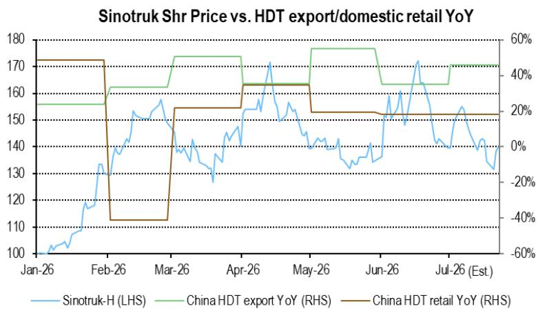

# The AI Boom Is Rewriting the Valuation Logic for China's Industrial Giants—Observers Must Separate the Two Narratives

A single statistical relationship reveals a fundamental shift in how the market prices two of China's most important industrial companies. For the year to date through 2026, an index that assigns equal weight to the daily share prices of Generac and Bloom Energy—two US-based power hardware companies with no direct Chinese heavy-truck exposure—explains 84 percent of the variance in Weichai Power's share price. The same index explains only 22 percent of the variance in Sinotruk's share price. Two companies that share a common industrial heritage, overlapping customer bases, and deep supply-chain links are now being driven by entirely different research logics. Weichai has been absorbed into the artificial intelligence infrastructure theme. Sinotruk remains tethered to export fundamentals. The divergence is not a temporary anomaly. It is a structural repricing that demands a different analytical framework for each company.

The mechanism behind this divergence matters more than the correlation statistic itself. Weichai and Bloom Energy are direct competitors in the solid oxide fuel cell space. Weichai also supplies components to Generac. These are not abstract financial correlations; they reflect genuine product-market overlap in the power generation and data center backup equipment ecosystem. As hyperscale data center buildout accelerates globally, the market has begun to value Weichai not as a diesel engine manufacturer for trucks and construction equipment, but as a proxy for the physical infrastructure layer of the AI buildout. The R-squared of 0.84 tells observers that Weichai's daily price movements are now more tightly linked to the sentiment around US-listed power hardware stocks than to Chinese heavy-duty truck sales data. This is a regime change in how the equity market discounts the company's future earnings.

Sinotruk tells the opposite story. Its share price shows a consistent 15-day lagged relationship with year-over-year export growth momentum. When export growth accelerates, Sinotruk's stock follows roughly two weeks later. The relationship is not perfect, but it is persistent across cycles and far stronger than any linkage to AI infrastructure themes. The implication is straightforward: observers who want to understand Sinotruk's near-term price direction should watch Chinese heavy-duty truck export data, not data center capital expenditure announcements. If the July export year-over-year growth print comes in strong, the lagged model suggests a rally phase from late July through mid-August. High-margin export sales directly translate into earnings upside for Sinotruk, making this a fundamental earnings story, not a thematic rerating.

The practical consequence for portfolio construction is that these two stocks can no longer be treated as interchangeable exposures to Chinese industrials. They have decoupled. An observer who buys Weichai expecting it to move with the Chinese truck cycle is implicitly taking a position on Bloom Energy and Generac earnings visibility instead. An observer who buys Sinotruk expecting AI infrastructure tailwinds will be disappointed. The two stocks now occupy different risk-factor buckets, and any portfolio that pairs them must account for their diverging sensitivities.

## Weichai's AI Correlation Is So Tight That Observers Should Monitor Generac and Bloom Energy Earnings as Leading Indicators for the Stock

The 84 percent R-squared between Weichai's share price and the AIDC/SOFC/AI-Hardware weighted index is not a statistical curiosity. It is a pricing signal that has held across multiple market regimes within the year to date. When the index rose between mid-March and mid-May, Weichai outperformed Sinotruk by a wide margin. When the index corrected, Weichai corrected with it. The pattern repeated in the most recent cycle. For an observer trying to time entry or exit in Weichai, the relevant information set is no longer Chinese truck production data or domestic infrastructure spending. It is the earnings reports and forward guidance from Generac and Bloom Energy.

Generac's power generation equipment is used extensively in data center backup and prime power applications. Bloom Energy's solid oxide fuel cells are a direct competitor to Weichai's own SOFC products. When these US-listed companies report strong order backlogs or raise revenue guidance, the market revalues the entire power hardware ecosystem upward, including Weichai. When they disappoint, the selling pressure transmits across the same channel. The relationship is causal, not coincidental. Weichai is a supplier, a competitor, and a comparable all at once. The market uses the US-listed names as price discovery vehicles because they offer greater liquidity and more transparent disclosure. Weichai's stock price then follows.

This creates a specific and actionable monitoring framework. Observers in Weichai should track Generac and Bloom Energy earnings dates as closely as they track Weichai's own results. The third quarter of this year is particularly important. If the US-listed power hardware names maintain earnings visibility and share price momentum, Weichai is likely to continue outperforming Sinotruk through the third quarter, replicating the pattern observed from mid-March to mid-May. If they falter, Weichai's AI premium will compress, and the stock will revert toward Sinotruk's valuation multiple.

The risk in this framework is that the correlation could break if the underlying product-market thesis changes. If Weichai's SOFC technology fails to gain traction in data center applications, or if Generac and Bloom Energy shift their supply chains away from Chinese partners, the linkage would weaken. But for now, the data says the relationship is intact and tightening. Observers should treat it as the primary pricing mechanism until proven otherwise.

## Sinotruk's 15-Day Export Lag Model Provides a Tactical Signal That Is More Reliable Than Any Macro Forecast

The relationship between Sinotruk's share price and export growth momentum is not instantaneous. The analysis shows that Sinotruk's stock price at day n correlates most strongly with export year-over-year growth at day n minus 15. This 15-day lag is consistent with the time required for export data to be collected, published, and absorbed by the market, and for institutional observers to adjust positions based on the new information. It is a behavioral pattern embedded in the market's reaction function, not a statistical artifact.

The practical implication is that observers can use the previous month's export data as a leading indicator for Sinotruk's near-term price direction. If July export year-over-year growth comes in strong, the model predicts a rally starting around the beginning of August and extending through mid-August. The mechanism is straightforward: high-margin export sales flow directly into Sinotruk's earnings. The company earns significantly higher margins on trucks sold abroad than on trucks sold into the domestic Chinese market, where pricing pressure from competitors and oversupply compress profitability. Export growth is therefore not just a volume story; it is a mix story that improves overall margin structure.

This export sensitivity has a corollary for risk management. Sinotruk's downside risk is concentrated in scenarios where export growth decelerates. Trade disputes, shipping disruptions, or a slowdown in key emerging-market destinations would directly impair the stock's fundamental support. Domestic Chinese truck sales, by contrast, have a much weaker correlation with Sinotruk's share price. The market has already priced in a challenging domestic demand environment. The marginal driver is export performance, and the 15-day lag model gives observers a systematic way to position for that driver.

The model's reliability depends on the assumption that the lag structure remains stable. If the market becomes faster at processing export data, the lag could shorten. If Sinotruk's export mix changes, the sensitivity of earnings to export volumes could shift. But across multiple cycles, the 15-day relationship has held. It is the single most actionable signal in the Sinotruk research case.

## The Valuation Multiples Reflect Two Different Future Earnings Profiles, and the Gap Is Justified by the Divergence in Revenue Drivers

Sinotruk's current price of HK$55 per share is based on 15 times 2026 estimated earnings, which is two standard deviations above its historical average. Weichai's price of HK$23 per share is based on 23 times 2026 estimated earnings, which is also two standard deviations above its historical average. The eight-turn valuation gap is the market's way of expressing a fundamental difference in earnings growth trajectories.

Sinotruk's premium to its own history is justified by the expectation that it will continue to grow in the medium term, driven by export market share gains. The company has established distribution networks in key emerging markets, and its product quality and pricing position it well to capture growth as Chinese truck exports expand. The 15 times multiple embeds an assumption that export growth remains robust but does not accelerate dramatically. It is a steady-state premium, not a growth-acceleration premium.

Weichai's 23 times multiple is a different animal. It factors in upside potential from data center engine earnings, which are not yet fully reflected in the current earnings base. The premium is explicitly tied to the AI infrastructure thesis. If data center-related power equipment orders materialize as expected, Weichai's earnings will grow faster than Sinotruk's, and the multiple will be justified. If the orders do not materialize, or if competition from Bloom Energy and other SOFC providers intensifies, the multiple will contract.

The key risk for Weichai is that the AI infrastructure theme is crowded and sentiment-driven. The 84 percent correlation with US-listed power hardware stocks means that Weichai is exposed to sentiment shifts in the US equity market that have nothing to do with Chinese industrial conditions. A rotation out of AI infrastructure names in the US would hit Weichai's share price regardless of its own operational performance. Sinotruk, by contrast, is insulated from that specific risk. Its correlation with US power hardware stocks is only 22 percent. Its fate is tied to export volumes, which are driven by demand from emerging economies, trade policy, and logistics conditions.

For a portfolio manager deciding between the two, the choice is not between a cheap stock and an expensive one. It is between two different risk factor exposures. Weichai offers leveraged exposure to the AI infrastructure theme with the volatility that comes with it. Sinotruk offers exposure to Chinese industrial export competitiveness with a more predictable earnings trajectory. Both can be valid positions, but they require different monitoring frameworks and different risk management approaches.

## A Decision Framework for Allocating Between Weichai and Sinotruk Based on Three Observable Signals

The analytical work supports a structured decision framework that observers can use to allocate between these two names. The framework relies on three observable signals, each of which maps to a specific driver of relative performance.

Signal one is the earnings trajectory of Generac and Bloom Energy. If these two companies report strong order books, raise guidance, or show accelerating revenue growth, the AI infrastructure theme is intact, and Weichai should outperform Sinotruk. If they disappoint, Weichai's correlation will work against it, and Sinotruk becomes the safer holding. This signal should be monitored on a quarterly basis around earnings season.

Signal two is Chinese heavy-duty truck export growth momentum. If export year-over-year growth accelerates, Sinotruk's 15-day lag model predicts a rally. If export growth decelerates, Sinotruk's fundamental support weakens. This signal should be monitored monthly when export data is released.

Signal three is the relative valuation spread. When Weichai's premium to Sinotruk widens beyond the current eight-turn gap, the incremental risk of a mean-reversion trade increases. When the gap narrows, Weichai becomes more attractive on a relative basis. This signal should be monitored continuously but acted upon only when the gap moves to extreme levels.

The framework does not prescribe a static allocation. It prescribes a conditional one. In periods when signals one and three are positive, allocate more to Weichai. In periods when signal two is positive and signal one is negative, allocate more to Sinotruk. In periods when all signals are ambiguous, hold both in equal weights and wait for clarity.

This approach acknowledges that the two stocks are no longer substitutes. They are complements with different risk factor exposures. The framework gives observers a systematic way to adjust exposure based on which risk factor is likely to dominate in the near term.

## The Divergence Between the Two Stocks Is Likely to Persist Until the AI Infrastructure Cycle Matures or Export Demand Inflects

The structural forces driving the decoupling of Weichai and Sinotruk are not about to reverse. The AI infrastructure buildout is a multiyear capital expenditure cycle driven by hyperscale cloud providers, utility companies, and sovereign investment programs. As long as data center power demand grows, Weichai's linkage to the power hardware ecosystem will remain tight. The 84 percent correlation may fluctuate, but the underlying product-market connections are real and durable.

Sinotruk's export story is equally structural. Chinese heavy-duty truck manufacturers have gained market share in emerging economies where local production capacity is limited and demand for commercial vehicles is growing with infrastructure development and trade volumes. This is a secular trend that will persist until either the destination markets develop their own production capacity or Chinese cost advantages erode.

The risk of convergence between the two stocks is low in the near term. For Weichai to decouple from AI hardware sentiment, the market would need to stop viewing it as a data center power play. That would require either a fundamental disappointment in its SOFC or generator set business, or a shift in investor narrative that reclassifies it as a pure industrial cyclical. Neither is likely in the next several quarters. For Sinotruk to become an AI beneficiary, it would need to develop a meaningful data center power business, which it has not signaled.

Observers should therefore treat the current valuation gap and correlation divergence as the new normal. The analytical effort should go into monitoring the signals that drive each stock individually, not into waiting for the two to reconverge. The market has made its distinction clear. The task for observers is to respect it.

*For informational purposes only. Portions may be generated, translated, summarized, or edited with AI assistance based on source materials and may contain omissions or errors. Please verify independently. This is not professional advice.*

For informational purposes only. Portions may be generated, translated, summarized, or edited with AI assistance based on source materials and may contain omissions or errors. Please verify independently. This is not professional advice.

