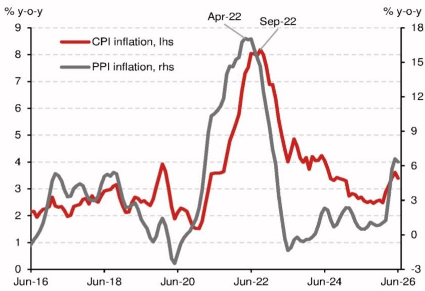
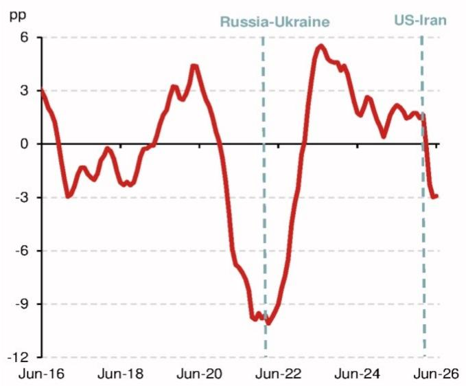
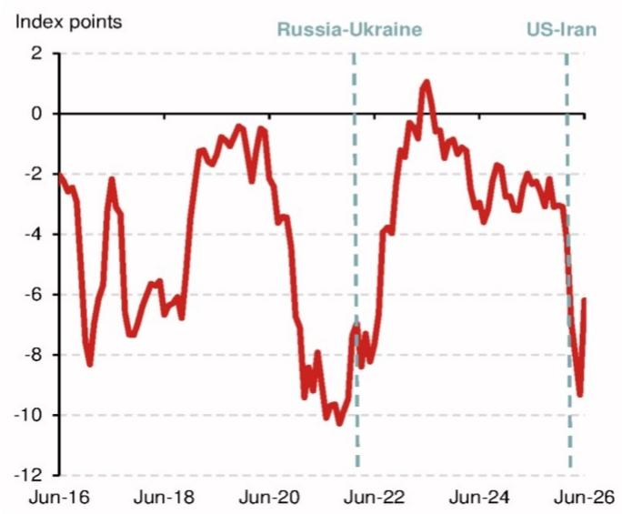
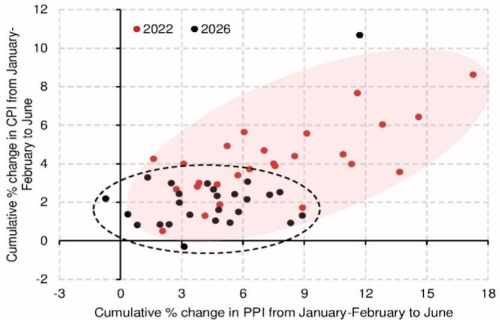
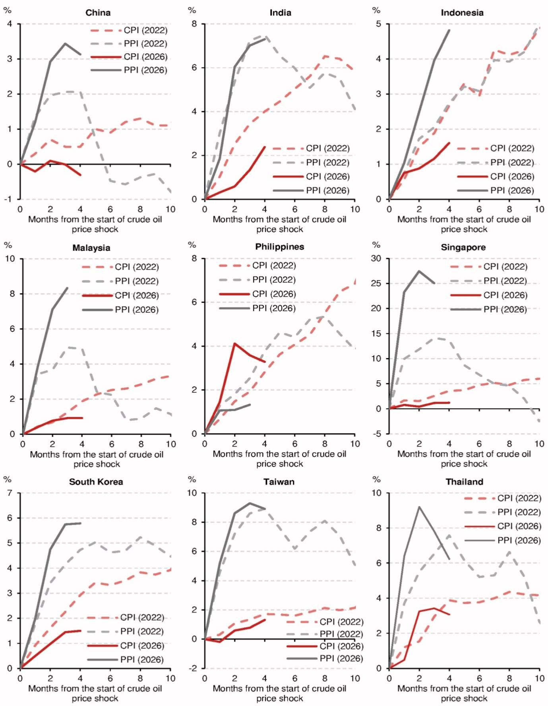
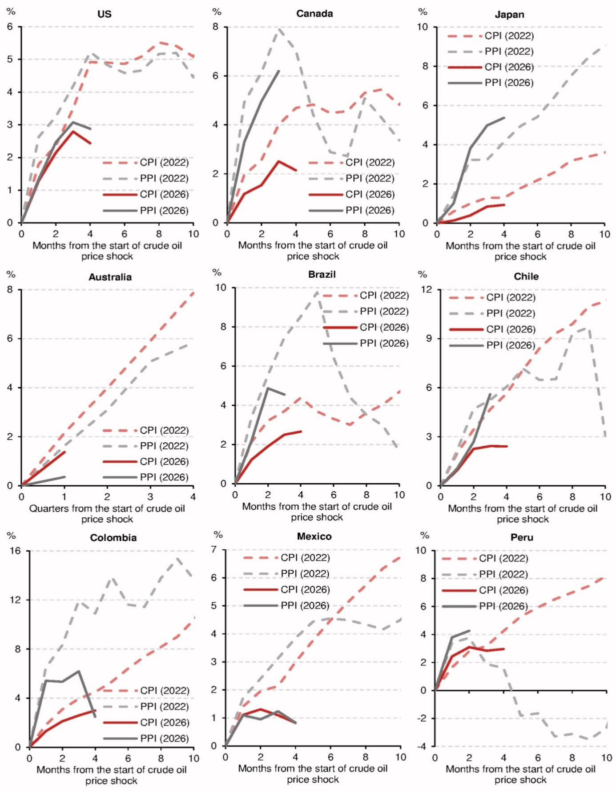
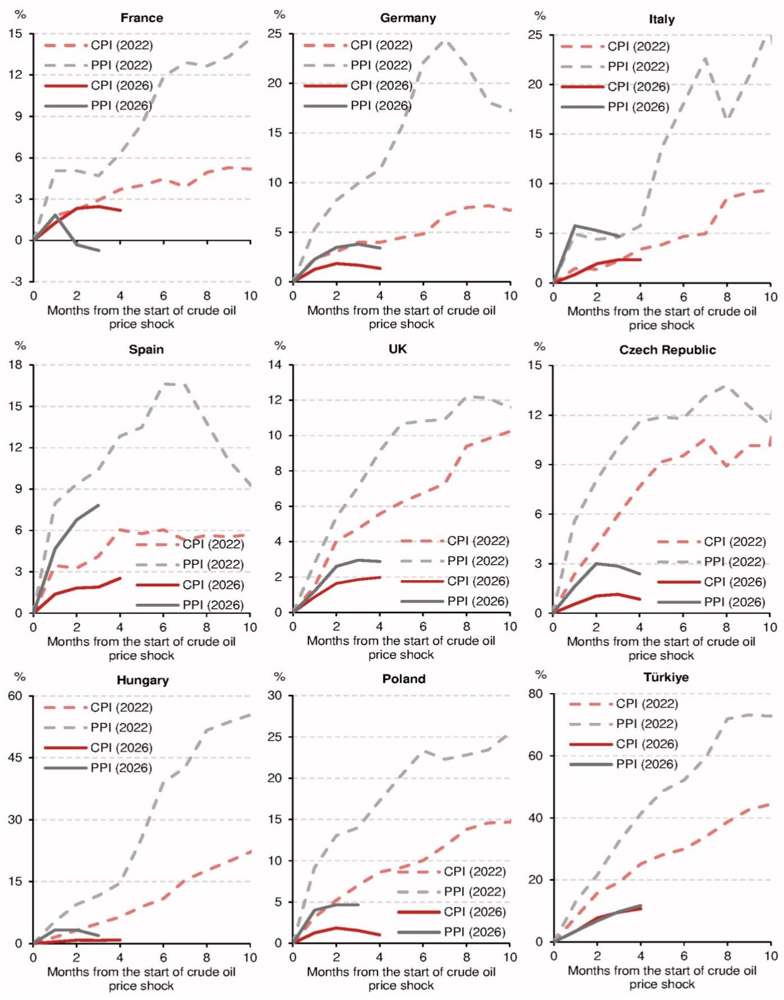
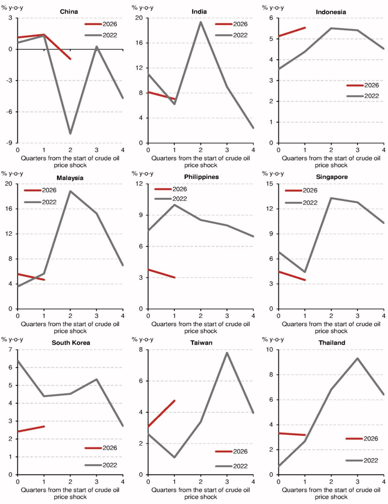
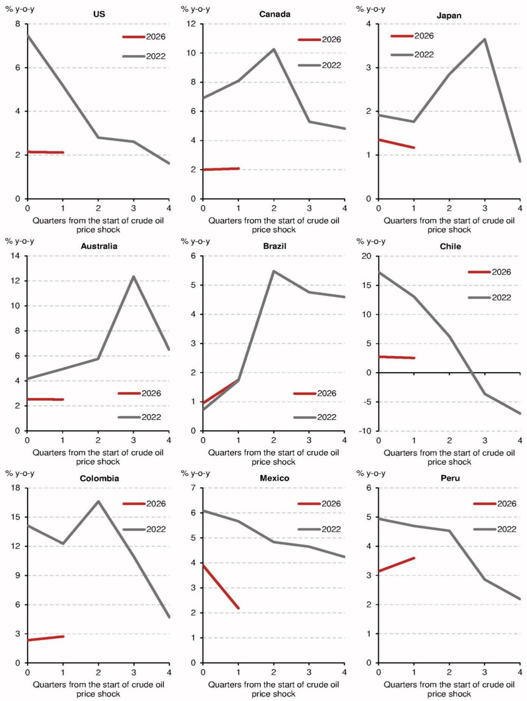
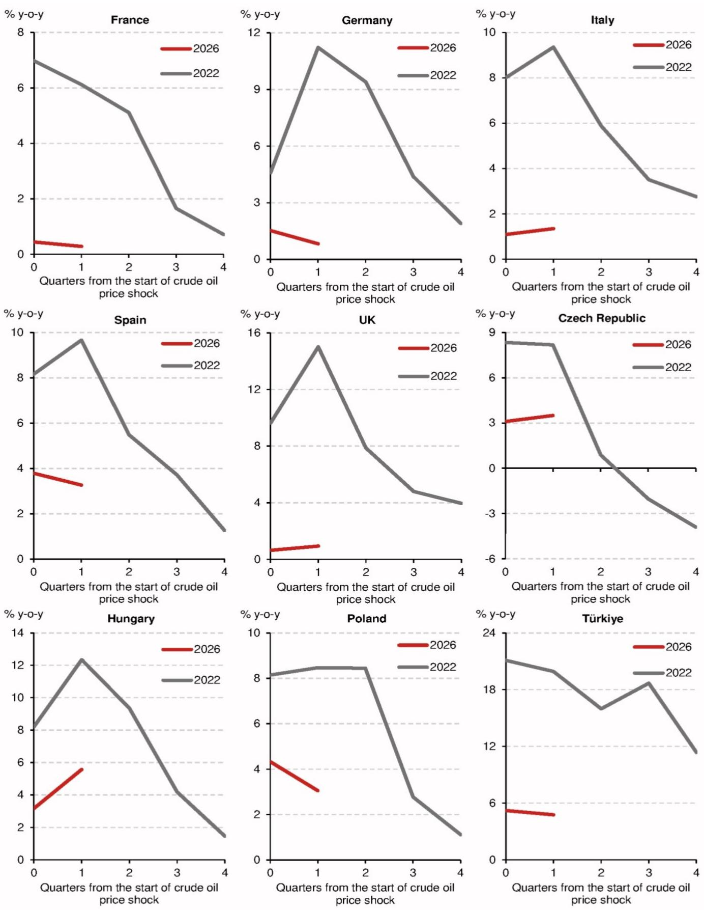

# 宏观观察

宏观环境 - 全球

## 评估全球生产者价格向消费者价格的传导

随着原油价格再次上升以及厄尔尼诺现象正式确认（参见特别报告 - 评估若食品价格飙升哪些国家受影响最大，2026年5月15日），市场对通胀前景的关注度显著提升。我们考察了27个主要发达和新兴经济体自美国-伊朗冲突爆发以来生产者价格指数（PPI）和消费者价格指数（CPI）的走势，并将其与2022年俄乌冲突后能源冲击期间的PPI和CPI走势进行了比较。主要发现如下：

- 2026年PPI向CPI的传导似乎比2022年更为有限且呈现异质性；2026年PPI与CPI累计涨幅之间的关联性弱于2022年。
- 初始条件——更健康的利润率、更弱的消费需求以及更少的财政和货币支持——有助于解释今年成本传导力度相对较小的现象。

PPI衡量供应链上游价格，通常是CPI的领先指标（图1）。27国（按购买力平价调整的世界GDP份额计算，覆盖全球约75%的GDP）的CPI通胀率在2022年PPI通胀见顶后约五个月达到峰值。今年，尽管总体PPI通胀率在6月略有缓和（仅基于部分数据），但考虑到油价再度飙升和厄尔尼诺现象，可能尚未见顶。假设相同的五个月滞后，意味着CPI通胀最早也要到今年晚些时候才可能见顶。

- 然而，如果PPI冲击持续，尤其是在CPI-PPI缺口较大且历史上PPI与CPI通胀相关性较强的国家，延迟传导的风险依然存在。

图1：全球：CPI通胀率与PPI通胀率  
  
注：27国总体数据按购买力平价调整的世界GDP份额计算，具体国家见图4。2026年4-6月，部分国家尚未发布数据，因此总体数据仅基于已发布数据的国家计算。来源：IMF、CEIC及NOM全球宏观研究。

## 利润率压缩与成本传导风险

今年，大多数国家的PPI通胀率远高于CPI通胀率。CPI与PPI通胀率之间的差距可视为利润率的代理指标。在27国总体基础上，该指标在经历了三年的正值后于3月转负，并在4-5月进一步恶化（图2）。这表明企业利润率正受到挤压，企业可能最终被迫将更高的成本转嫁给消费者。更具时效性的采购经理人调查数据，特别是制造业PMI产出价格指数减去投入价格指数，也描绘了类似情景。然而，6月的最新数据显示产出价格与投入价格之间的差距有所收窄（图3），但这一趋势可能因能源价格再度上涨而逆转。

2026年与2022年的一个关键区别在于，即使在2022年俄乌冲突之前，上述两个代理指标均已指向显著的利润率挤压，但今年情况并非如此。这表明，企业今年面对能源价格冲击时，初始利润率状况更为健康，因此有更大的缓冲空间来吸收额外成本，从而无需立即且激进地传导成本。这与2022年形成鲜明对比，当时能源价格冲击立即引发了强劲的重新定价周期，利润率迅速反弹即为明证。

图2：全球：CPI减去PPI通胀率  
  
注：27国总体数据按购买力平价调整的世界GDP份额计算，具体国家见图4。2026年4-6月，部分国家尚未发布数据，因此总体数据仅基于已发布数据的国家计算。

图3：全球：产出价格指数减去投入价格指数  
  
来源：IMF、CEIC及NOM全球宏观研究。  
注：23国总体数据（图4中27国剔除智利、匈牙利、秘鲁和新加坡，因数据不可得）按购买力平价调整的世界GDP份额计算。来源：IMF、S&P Global及NOM全球宏观研究。

为探究27国中哪些国家面临更高的PPI向CPI成本传导风险，我们对每个国家进行了滚动五年窗口的简单领先-滞后相关性分析。我们将PPI通胀率滞后0至15个月（或等价的季度），并确定每个国家CPI与PPI通胀率相关性最大化的滞后月数。在图4中，我们将这些相关系数与最新的CPI-PPI通胀率缺口进行对比。结果显示，阴影区域内的众多国家（13个）似乎面临潜在的生产者向消费者成本传导风险。

图4：相关系数与CPI减去PPI通胀率  
  
注：最新CPI减去PPI通胀率，大多数国家为2026年6月数据；巴西、加拿大、智利、法国、匈牙利、意大利、马来西亚、菲律宾、波兰、新加坡和西班牙为2026年5月数据；秘鲁为2026年4月数据；澳大利亚为2026年第一季度数据。相关系数基于滚动五年窗口计算，大多数国家截至2026年5月；秘鲁截至2026年4月；澳大利亚截至2026年第一季度。  
来源：CEIC及NOM全球宏观研究。

## 当前与2022年对比

为更深入比较2022年和2026年能源价格冲击对各国PPI和CPI通胀的影响，我们计算了两次冲击开始后每月各国PPI和CPI的累计百分比变化。2022年俄乌冲突和2026年美国-伊朗冲突均始于2月，因此我们分别以2022年和2026年1-2月平均值为基准计算累计百分比变化（采用1-2月平均值以消除亚洲数据中农历新年移动带来的扰动）。

回顾2022年，许多国家的PPI累计变化在冲突开始后10个月内达到峰值，而CPI累计变化则持续上升（见附录图册1、2、3）。这更细致地凸显了PPI通胀影响大且更直接，而CPI通胀影响则更延迟且更持久。如果当前冲击遵循类似模式，特别是随着能源价格反弹，未来几个月PPI若再次大幅上升，许多国家的CPI通胀可能继续上升，甚至可能持续到明年。

在图5中，我们总结了2022年1-2月至6月CPI和PPI的累计百分比变化，以及2022年6月的CPI-PPI通胀率缺口。我们按CPI-PPI通胀率缺口从最负到最正进行排序。我们对2026年也进行了同样的分析。对于2026年，我们的主要观察如下：

**利润率挤压较小：** 不出所料，对于大多数国家而言，今年CPI与PPI通胀率之间的缺口远小于2022年，尤其是欧洲国家，特别是土耳其，这可能表明相对利润率压力较小。然而，一些国家——新加坡、秘鲁、智利、台湾和加拿大——此次正经历更显著的利润率挤压。

图5：CPI与PPI，2022年对比2026年

<table><tr><td colspan="4">2022</td><td colspan="4">2026</td></tr><tr><td rowspan="2"></td><td>CPI累计变化%</td><td>PPI累计变化%</td><td>CPI减PPI通胀率，百分点</td><td></td><td>CPI累计变化%</td><td>PPI累计变化%</td><td>CPI减PPI通胀率，百分点</td></tr><tr><td>1-2月至6月</td><td>1-2月至6月</td><td>2022年6月</td><td></td><td>1-2月至6月</td><td>1-2月至6月</td><td>2026年6月</td></tr><tr><td>土耳其</td><td>25.1</td><td>41.3</td><td>-59.7</td><td>新加坡</td><td>1.2</td><td>25.0</td><td>-32.4</td></tr><tr><td>意大利</td><td>3.4</td><td>5.8</td><td>-39.1</td><td>秘鲁</td><td>3.0</td><td>4.3</td><td>-17.7</td></tr><tr><td>匈牙利</td><td>6.4</td><td>14.6</td><td>-34.2</td><td>智利</td><td>2.4</td><td>5.6</td><td>-16.5</td></tr><tr><td>西班牙</td><td>6.0</td><td>12.8</td><td>-33.9</td><td>台湾</td><td>1.3</td><td>8.9</td><td>-12.5</td></tr><tr><td>德国</td><td>4.0</td><td>11.3</td><td>-24.9</td><td>加拿大</td><td>2.1</td><td>6.2</td><td>-10.2</td></tr><tr><td>法国</td><td>3.7</td><td>6.3</td><td>-22.3</td><td>西班牙</td><td>2.5</td><td>7.8</td><td>-7.4</td></tr><tr><td>哥伦比亚</td><td>4.5</td><td>10.9</td><td>-22.0</td><td>意大利</td><td>2.3</td><td>4.7</td><td>-6.1</td></tr><tr><td>新加坡</td><td>3.6</td><td>13.7</td><td>-21.2</td><td>马来西亚</td><td>0.9</td><td>8.3</td><td>-5.8</td></tr><tr><td>波兰</td><td>8.6</td><td>17.3</td><td>-19.0</td><td>印度</td><td>2.4</td><td>7.3</td><td>-5.5</td></tr><tr><td>捷克</td><td>7.7</td><td>11.6</td><td>-11.9</td><td>日本</td><td>0.9</td><td>5.4</td><td>-5.4</td></tr><tr><td>台湾</td><td>1.7</td><td>8.9</td><td>-10.0</td><td>韩国</td><td>1.5</td><td>5.8</td><td>-5.4</td></tr><tr><td>智利</td><td>5.6</td><td>6.1</td><td>-9.8</td><td>泰国</td><td>3.1</td><td>6.2</td><td>-4.8</td></tr><tr><td>印度</td><td>4.0</td><td>7.5</td><td>-9.3</td><td>印度尼西亚</td><td>1.6</td><td>4.8</td><td>-3.2</td></tr><tr><td>英国</td><td>5.6</td><td>9.1</td><td>-8.1</td><td>中国</td><td>-0.3</td><td>3.1</td><td>-3.1</td></tr><tr><td>马来西亚</td><td>1.9</td><td>4.9</td><td>-7.5</td><td>美国</td><td>2.4</td><td>2.9</td><td>-2.0</td></tr><tr><td>日本</td><td>1.3</td><td>4.1</td><td>-7.5</td><td>英国</td><td>2.0</td><td>2.9</td><td>-0.8</td></tr><tr><td>巴西</td><td>4.4</td><td>8.5</td><td>-6.9</td><td>法国</td><td>2.2</td><td>-0.7</td><td>-0.6</td></tr><tr><td>加拿大</td><td>4.7</td><td>7.0</td><td>-6.3</td><td>匈牙利</td><td>0.8</td><td>1.9</td><td>-0.1</td></tr><tr><td>泰国</td><td>3.9</td><td>7.6</td><td>-6.2</td><td>波兰</td><td>1.0</td><td>4.7</td><td>0.2</td></tr><tr><td>韩国</td><td>2.9</td><td>4.7</td><td>-3.9</td><td>捷克</td><td>0.8</td><td>2.4</td><td>0.3</td></tr><tr><td>中国</td><td>0.5</td><td>2.1</td><td>-3.6</td><td>德国</td><td>1.3</td><td>3.4</td><td>0.5</td></tr><tr><td>美国</td><td>4.9</td><td>5.2</td><td>-2.2</td><td>澳大利亚</td><td>1.4</td><td>0.4</td><td>1.1</td></tr><tr><td>菲律宾</td><td>2.8</td><td>3.8</td><td>-1.7</td><td>墨西哥</td><td>0.8</td><td>0.8</td><td>1.5</td></tr><tr><td>墨西哥</td><td>3.0</td><td>3.8</td><td>-0.9</td><td>巴西</td><td>2.7</td><td>4.6</td><td>2.7</td></tr><tr><td>印度尼西亚</td><td>2.7</td><td>2.7</td><td>-0.6</td><td>哥伦比亚</td><td>3.0</td><td>2.5</td><td>2.8</td></tr><tr><td>澳大利亚</td><td>4.0</td><td>3.1</td><td>0.6</td><td>菲律宾</td><td>3.3</td><td>1.3</td><td>3.9</td></tr><tr><td>秘鲁</td><td>4.2</td><td>1.6</td><td>3.1</td><td>土耳其</td><td>10.7</td><td>11.7</td><td>4.0</td></tr></table>

注：每列应用颜色编码。巴西、加拿大、智利、法国、匈牙利、意大利、马来西亚、菲律宾、波兰、新加坡和西班牙的2026年PPI累计变化%为1-2月至5月，CPI减PPI通胀率为2026年5月；秘鲁的PPI累计变化%为1-2月至4月，CPI减PPI通胀率为2026年4月。澳大利亚的CPI和PPI累计变化%分别从2021年第四季度至2022年第一季度和2025年第四季度至2026年第一季度计算，2026年CPI减PPI通胀率为第一季度数据。印度和印度尼西亚使用批发价格指数替代PPI。美国使用最终需求PPI，加拿大使用工业产品价格指数，新加坡使用国内供应价格指数，英国使用产出PPI，欧盟国家和土耳其使用国内PPI。  
来源：CEIC及NOM全球宏观研究。

**传导更为有限：** 今年迄今为止，生产者价格向消费者价格的传导程度似乎比2022年更为有限且更具异质性。美国-伊朗冲突后生产者价格的大幅上涨，尤其是在亚洲国家，尚未像2022年那样转化为各国消费者价格的普遍上涨，当时PPI上涨与CPI上涨之间的关系在国家层面更为清晰（图6）。公平地说，2022年更强的关联性反映了俄乌冲突前疫情导致的全球供应链大规模中断所带来的滞后成本传导影响。

图6：2022年和2026年1-2月至6月CPI与PPI累计变化%  
  
注：在27国中，我们排除了两个极端值（一个黑点和一个红点）。其他详情请参见图5注释。  
来源：CEIC及NOM全球宏观研究。

但生产者价格的上涨最终是否会传导至消费者价格？迄今为止有限的传导是否实际上预示着未来更大的传导空间？一种观点认为，企业可能从2021-22年上一次通胀飙升中形成了更强的“肌肉记忆”，以便在此次迅速传导更高的成本，尤其是在美国-伊朗和平谈判失败且能源价格反弹的背景下。然而，我们认为此次油价冲击的背景与2022年不同，体现在：1）不存在被压抑的需求；2）财政空间更为有限；3）货币政策立场远未达到宽松程度。

在图7中，我们比较了2022年和2026年的实际私人消费增长、公共债务总额和政策利率，并用红色标出实际私人消费增长更高、公共债务总额和政策利率更低的年份。我们按每个指标2022年与2026年之间的差距对各国进行排序。对于实际私人消费，比较2022年与2026年的同比增长可能因疫情封锁和重新开放带来的基数效应而变得复杂；因此，我们在表格中比较了环比增长，但在附录图册4、5、6中展示了各国2022年与2026年实际私人消费同比增长的时间序列图。大多数国家2026年第一季度的实际私人消费增长慢于2022年第一季度，且面临更高的公共债务和政策利率。这与我们的假设一致，即更紧的货币政策和更少的财政空间意味着一个需求支撑较弱的环境，企业在此环境下定价权可能减弱，难以将成本上涨转嫁给消费者，因此可能被迫进一步压缩利润率。尽管如此，随着油价大幅反弹，如果能源价格冲击持续，企业通过压缩利润率来持续吸收这些成本上涨可能会越来越困难。

结论是，如果美国-伊朗冲突再度升级，且厄尔尼诺现象加剧，导致能源和食品成本进一步上升，其结果可能比2022年更具“滞胀”特征（通胀上升但增长因利润率压缩而减弱），给各国央行带来更艰难的政策权衡。

图7：实际私人消费、公共债务总额与政策利率，2022年对比2026年

<table><tr><td rowspan="2"></td><td colspan="2">实际私人消费（季调后环比%）</td><td rowspan="2"></td><td colspan="2">政府债务总额（占GDP%）</td><td rowspan="2"></td><td colspan="2">政策利率（%）</td></tr><tr><td>2022年第一季度</td><td>2026年第一季度</td><td>2022年</td><td>2026年</td><td>2022年7月底</td><td>最新</td></tr><tr><td>新加坡</td><td>3.5</td><td>0.2</td><td>中国</td><td>77.3</td><td>106.9</td><td>土耳其</td><td>14.00</td><td>37.00</td></tr><tr><td>马来西亚</td><td>3.6</td><td>0.6</td><td>新加坡</td><td>153.3</td><td>171.9</td><td>哥伦比亚</td><td>9.00</td><td>12.00</td></tr><tr><td>德国</td><td>2.7</td><td>0.0</td><td>波兰</td><td>48.8</td><td>65.7</td><td>澳大利亚</td><td>1.35</td><td>4.35</td></tr><tr><td>墨西哥</td><td>1.5</td><td>-0.8</td><td>巴西</td><td>83.9</td><td>96.5</td><td>英国</td><td>1.25</td><td>3.75</td></tr><tr><td>秘鲁</td><td>2.9</td><td>0.8</td><td>墨西哥</td><td>53.8</td><td>62.7</td><td>印度尼西亚</td><td>3.50</td><td>5.75</td></tr><tr><td>澳大利亚</td><td>2.4</td><td>0.5</td><td>加拿大</td><td>103.5</td><td>110.7</td><td>法国</td><td>0.00</td><td>2.25</td></tr><tr><td>波兰</td><td>2.2</td><td>0.2</td><td>法国</td><td>111.4</td><td>118.4</td><td>德国</td><td>0.00</td><td>2.25</td></tr><tr><td>土耳其</td><td>1.7</td><td>0.1</td><td>美国</td><td>119.1</td><td>125.8</td><td>意大利</td><td>0.00</td><td>2.25</td></tr><tr><td>泰国</td><td>2.0</td><td>0.4</td><td>泰国</td><td>60.5</td><td>66.8</td><td>西班牙</td><td>0.00</td><td>2.25</td></tr><tr><td>菲律宾</td><td>2.2</td><td>0.7</td><td>英国</td><td>97.5</td><td>103.6</td><td>菲律宾</td><td>3.25</td><td>4.75</td></tr><tr><td>英国</td><td>1.4</td><td>0.6</td><td>韩国</td><td>49.8</td><td>54.4</td><td>美国</td><td>2.50</td><td>3.75</td></tr><tr><td>加拿大</td><td>0.8</td><td>0.4</td><td>智利</td><td>37.9</td><td>42.5</td><td>日本</td><td>-0.10</td><td>1.00</td></tr><tr><td>匈牙利</td><td>2.1</td><td>1.7</td><td>马来西亚</td><td>65.5</td><td>69.5</td><td>巴西</td><td>13.25</td><td>14.25</td></tr><tr><td>西班牙</td><td>1.0</td><td>0.6</td><td>捷克</td><td>42.5</td><td>46.4</td><td>韩国</td><td>2.25</td><td>2.75</td></tr><tr><td>意大利</td><td>0.7</td><td>0.5</td><td>匈牙利</td><td>74.1</td><td>77.9</td><td>马来西亚</td><td>2.25</td><td>2.75</td></tr><tr><td>印度尼西亚</td><td>1.6</td><td>1.5</td><td>菲律宾</td><td>57.4</td><td>60.2</td><td>台湾</td><td>1.50</td><td>2.00</td></tr><tr><td>巴西</td><td>1.0</td><td>1.0</td><td>印度尼西亚</td><td>40.1</td><td>41.5</td><td>泰国</td><td>0.50</td><td>1.00</td></tr><tr><td>美国</td><td>0.1</td><td>0.1</td><td>澳大利亚</td><td>50.0</td><td>50.6</td><td>印度</td><td>4.90</td><td>5.25</td></tr><tr><td>印度</td><td>1.1</td><td>1.4</td><td>德国</td><td>64.4</td><td>64.6</td><td>加拿大</td><td>2.50</td><td>2.25</td></tr><tr><td>捷克</td><td>0.0</td><td>0.5</td><td>意大利</td><td>138.4</td><td>138.4</td><td>中国</td><td>2.10</td><td>1.40</td></tr><tr><td>法国</td><td>-0.7</td><td>-0.2</td><td>哥伦比亚</td><td>61.3</td><td>60.9</td><td>墨西哥</td><td>7.75</td><td>6.50</td></tr><tr><td>哥伦比亚</td><td>1.2</td><td>1.9</td><td>印度</td><td>84.6</td><td>83.4</td><td>秘鲁</td><td>6.00</td><td>4.25</td></tr><tr><td>日本</td><td>-0.9</td><td>0.3</td><td>台湾</td><td>29.5</td><td>27.6</td><td>波兰</td><td>6.50</td><td>3.75</td></tr><tr><td>智利</td><td>-0.5</td><td>1.0</td><td>秘鲁</td><td>33.5</td><td>30.0</td><td>捷克</td><td>7.00</td><td>3.75</td></tr><tr><td>韩国</td><td>-1.0</td><td>0.6</td><td>土耳其</td><td>29.4</td><td>25.5</td><td>匈牙利</td><td>10.75</td><td>5.75</td></tr><tr><td>台湾</td><td>-1.3</td><td>1.5</td><td>西班牙</td><td>109.2</td><td>98.2</td><td>智利</td><td>9.75</td><td>4.50</td></tr><tr><td>中国</td><td>-</td><td>-</td><td>日本</td><td>227.8</td><td>204.4</td><td>新加坡</td><td>-</td><td>-</td></tr></table>

注：我们对官方未提供季调数据的实际私人消费数据使用X-12 ARIMA进行了季节性调整。欧盟国家使用欧盟统计局发布的经季节和日历调整后的实际私人消费（包括家庭和为家庭服务的非营利机构）数据。中国季度实际私人消费数据不可得。政府债务总额数据来自IMF世界经济展望数据库（2026年4月版）。政策利率：美国为联邦基金利率目标区间上限；法国、德国、意大利和西班牙为存款便利利率；中国为7天逆回购利率。新加坡货币政策侧重于名义有效汇率而非政策利率。  
来源：IMF、彭博、欧盟统计局、CEIC及NOM全球宏观研究。

## 附录

图8：图册1：原油价格冲击后CPI和PPI累计变化%  
  
注：累计变化%分别以2022年和2026年1-2月平均值（t=0）为基准计算。PPI详情请参见图5注释。来源：CEIC及NOM全球宏观研究。

图9：图册2：原油价格冲击后CPI和PPI累计变化%  
  
注：累计变化%分别以2022年和2026年1-2月平均值（t=0）为基准计算，澳大利亚除外，其2022年事件以2021年第四季度（t=0）为基准，2026年事件以2025年第四季度为基准。PPI详情请参见图5注释。  
来源：CEIC及NOM全球宏观研究。

图10：图册3：原油价格冲击后CPI和PPI累计变化%  
  
注：累计变化%分别以2022年和2026年1-2月平均值（t=0）为基准计算。PPI详情请参见图5注释。来源：CEIC及NOM全球宏观研究。

图11：图册4：实际私人消费增长，2022年对比2026年  
  
注：中国以实际零售额增长替代。t=0：2022年事件为2021年第四季度，2026年事件为2025年第四季度。来源：CEIC、Wind及NOM全球宏观研究。

图12：图册5：实际私人消费增长，2022年对比2026年  
  
注：t=0：2022年事件为2021年第四季度，2026年事件为2025年第四季度。来源：CEIC及NOM全球宏观研究。

图13：图册6：实际私人消费增长，2022年对比2026年  
  
注：t=0：2022年事件为2021年第四季度，2026年事件为2025年第四季度。来源：CEIC及NOM全球宏观研究。

## 附录A-1

本报告由NOM新加坡有限公司（NSL）编制。

NOM集团实体详情请参见免责声明。

## 分析师认证

我们，Yiru Chen和Robert Nemmara Subbaraman，特此证明：（1）本研究报告中所表达的观点准确反映我们个人对任何或所有相关标的证券或发行人的看法；（2）我们的薪酬中没有任何部分直接或间接与本研究报告中的具体建议或观点相关；（3）我们的薪酬中没有任何部分与NOM Securities International, Inc.、NOM International plc或任何其他NOM集团公司执行的任何特定投行业务挂钩。

## 重要披露

## 研究报告在线获取及利益冲突披露

NOM集团研究报告可在www.NOMnow.com/research、彭博、Capital IQ、Factset、LSEG上获取。

重要披露信息可访问http://go.NOMnow.com/research/m/Disclosures阅读，或向NOM Securities International, Inc.索取。如网站访问遇到问题，请发送邮件至grpsupport@NOM.com寻求帮助。

编制本报告的分析师薪酬基于多种因素，包括公司总收入，其中一部分来自投行业务。除非另有说明，本报告首页列出的非美国分析师未在FINRA规则下注册/具备研究分析师资格，可能不是NSI的关联人员，且可能不受FINRA Rule 2241关于与受覆盖公司沟通、公开露面以及研究分析师账户持有证券交易限制的约束。

NOM Global Financial Products Inc. (NGFP)、NOM Derivative Products Inc. (NDP) 和 NOM International plc. (NIplc) 已在美国商品期货交易委员会和美国国家期货协会注册为掉期交易商。NGFP、NDPI和NIplc主要从事掉期及其他衍生品交易，其中任何一项均可能成为本报告的主题。

## 免责声明

本出版物包含由第1页确定的NOM集团实体编制，且（如适用）包含一个或多个NOM集团实体及其员工（其各自隶属关系在第1页或本出版物其他地方注明）贡献的材料。本文中使用的“NOM集团”指NOM Holdings, Inc.及其关联公司和子公司，包括：(a) NOM Securities Co., Ltd. ('NSC') 东京，日本；(b) NOM Financial Products Europe GmbH ('NFPE')，德国；(c) NOM International plc ('NIplc')，英国；(d) NOM Securities International, Inc. ('NSI')，纽约，美国；(e) NOM International (Hong Kong) Ltd. ('NIHK')，香港；(f) NOM Financial Investment (Korea) Co., Ltd. ('NFIK')，韩国（在韩国金融投资协会注册的NOM分析师信息可在KOFIA内网http://dis.kofia.or.kr查询）；(g) NOM Singapore Ltd. ('NSL')，新加坡（注册号197201440E，受新加坡金融管理局监管）；(h) NOM Australia Ltd. ('NAL')，澳大利亚（ABN 48 003 032 513），受澳大利亚证券和投资委员会监管，持有澳大利亚金融服务牌照号246412；(i) NOM Securities Malaysia Sdn. Bhd. ('NSM')，马来西亚；(j) NIHK, Taipei Branch ('NITB')，台湾；(k) NOM Financial Advisory and Securities (India) Private Limited ('NFASL')，印度孟买（注册地址：Ceejay House, Level 11, Plot F, Shivsagar Estate, Dr. Annie Besant Road, Worli, Mumbai- 400 018, India；电话：91 22 4037 4037，传真：91 22 4037 4111；CIN No: U74140MH2007PTC169116，SEBI股票经纪业务注册号：INZ000255633；SEBI商人银行业务注册号：INM000011419；SEBI研究业务注册号：INH000001014 - 合规官：Pratiksha Tondwalkar女士，91 22 40374904，投诉邮箱：investorgrievancesra@NOM.com 网页：链接

关于印度上市公司或由印度NFASL研究分析师编制的报告：(i) 证券市场投资存在市场风险。投资前请仔细阅读所有相关文件。(ii) SEBI的注册及NISM的认证绝不保证中介机构的业绩或向读者提供任何回报保证。(iii) NFASL获取研究服务的条款和条件已在NFASL网页上披露。

(l) NOM Fiduciary Research & Consulting Co., Ltd. ('NFRC') 东京，日本。(m) NOM Orient International Securities Co., Ltd ("NOI")，是NOM集团、东方国际（集团）有限公司和上海黄浦投资控股（集团）有限公司共同控股的合资企业。根据中华人民共和国法律（为本文件目的，不包括香港、澳门和台湾），NOI在中国境内获准提供证券研究和研究交流，并独立于NOM集团其他成员运营；特别是，NOI在中国证券中的权益不会向任何其他NOM集团实体披露或与其持仓合并，其他NOM集团实体在中国证券中的
