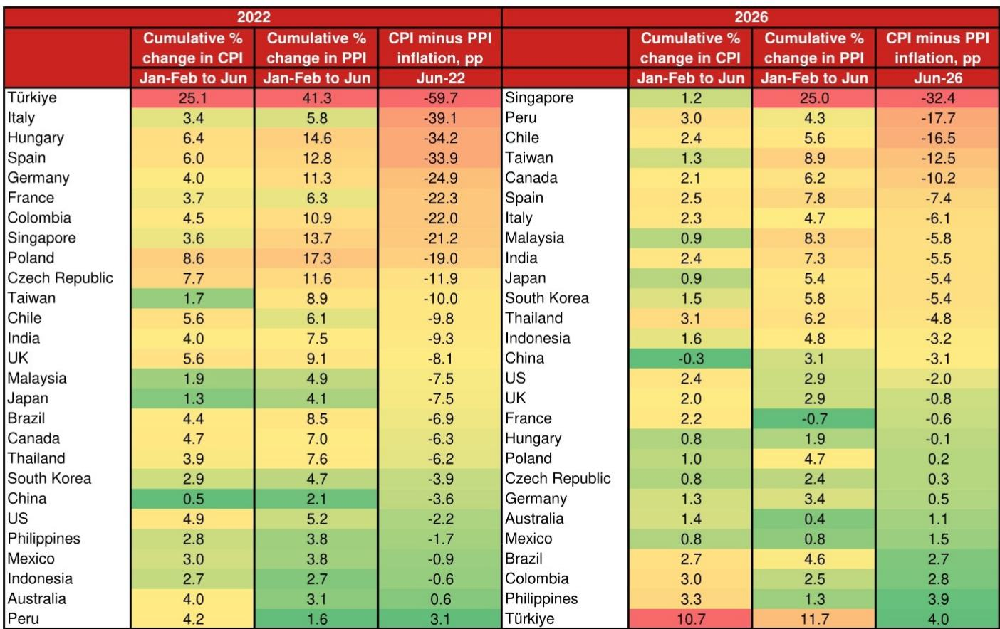
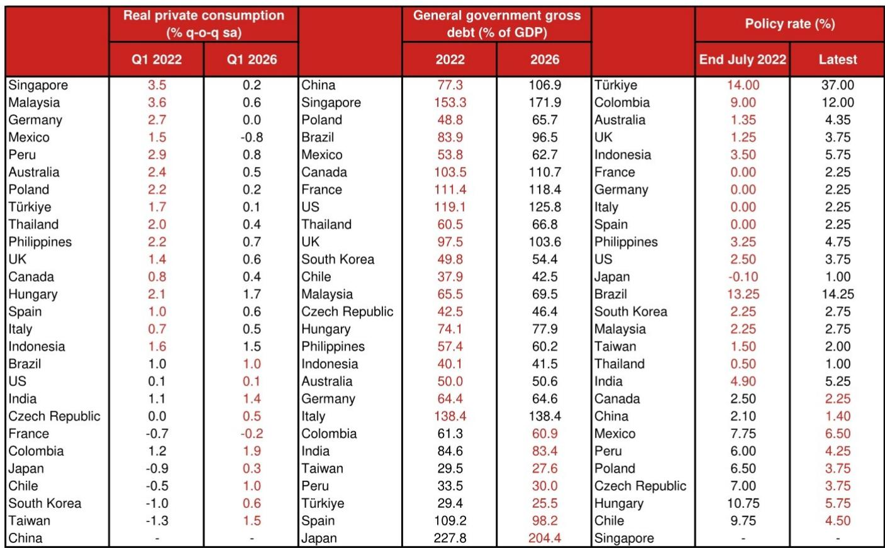
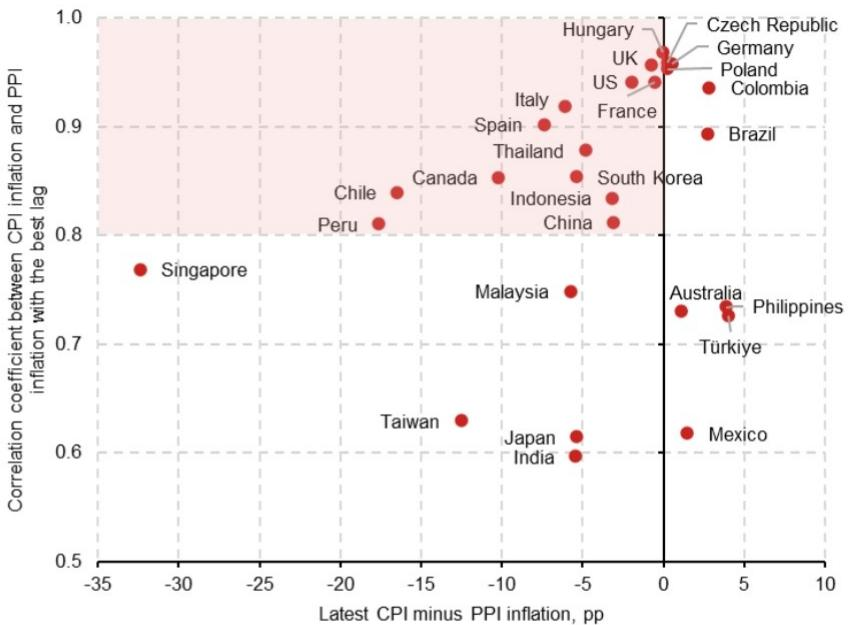

# The 2026 Inflation Shock Is Different: Weaker Pass-Through Creates a More Stagflationary Trade-Off for Central Banks

The US-Iran conflict that erupted in February 2026 has sent crude oil prices surging, and El Niño conditions are now official. Yet consumer price inflation across 27 major advanced and emerging economies has not responded the way it did in 2022. The aggregate PPI-CPI pass-through is weaker, more heterogeneous, and slower to materialize than during the Russia-Ukraine energy shock. This is not merely a matter of timing. It reflects fundamentally different initial conditions: healthier corporate margins at the start of the shock, weaker consumer demand, tighter monetary policy, and reduced fiscal space. The result is a more stagflationary configuration than 2022—higher producer costs that are compressing profits rather than being fully passed through, with the risk that persistent energy and food price pressures could eventually force a delayed repricing cycle that central banks are poorly positioned to fight.

The aggregate data make the divergence clear. For the 27 countries covered, which represent approximately 75 percent of world GDP on a purchasing power parity basis, aggregate PPI inflation moderated slightly in June 2026 based on partial data, but may not have peaked yet given the renewed oil price spike and El Niño conditions. In 2022, aggregate CPI inflation peaked roughly five months after PPI inflation peaked. If the same lag holds this year, CPI inflation is unlikely to peak until late 2026 at the earliest. But the similarity in timing masks a critical difference in magnitude: the relationship between cumulative PPI and CPI rises is far weaker in 2026 than it was in 2022. The correlation scatter plot comparing cumulative changes from January-February to June in both years reveals a much looser fit this time, with several Asian economies experiencing sharp PPI increases that have not yet translated into commensurate CPI moves.

## Firms Entered the 2026 Shock with Healthier Margins, Providing a Buffer That Delays Cost Pass-Through

The most important structural difference between the two episodes lies in the starting position of corporate profitability. The gap between CPI inflation and PPI inflation can serve as a proxy for profit margins, since it captures the spread between what firms pay upstream and what they can charge downstream. On an aggregate 27-country basis, this CPI-PPI gap turned negative in March 2026 for the first time in three years and worsened further in April and May. That sounds like margin pressure—and it is. But the critical point is that firms entered the 2026 shock from a much healthier position than in 2022. In 2022, even before the Russia-Ukraine conflict, both the CPI-PPI gap and the manufacturing PMI output prices minus input prices index were already signaling significant margin squeezes. The 2022 energy shock therefore hit firms that were already under pressure, triggering an immediate and aggressive repricing cycle. This year, by contrast, the margin squeeze started from a positive base. Firms had a larger buffer to absorb cost increases, and they have used that buffer. The PMI data for June 2026 show a narrowing of the spread between output prices and input prices, suggesting that the initial margin compression may be easing, though this could reverse if energy prices continue to rise.

This healthier starting position explains why the pass-through has been more limited so far. But it also introduces a risk: the longer the producer price shock persists, the more that buffer erodes. If energy and food costs remain elevated through the second half of 2026, firms that have been absorbing costs may eventually be forced to pass them on. The question is not whether margins will compress further, but when the compression becomes unsustainable.

## Thirteen Countries Face Elevated Pass-Through Risk, with Singapore, Peru, and Chile Under the Most Pressure

A simple lead-lag correlation analysis—lagging PPI inflation by zero to fifteen months and identifying the lag that maximizes the correlation with CPI inflation for each country—reveals which economies are most exposed. Plotting these correlation coefficients against the latest CPI-PPI inflation gap produces a clear picture: thirteen countries fall into the shaded zone where both the correlation is high and the current margin gap is large and negative. These are the economies where a delayed pass-through is most likely if the producer price shock persists.

The country-level cumulative change data from January-February to June 2026 sharpen the picture. Singapore stands out with a cumulative PPI increase of 25.0 percent against a cumulative CPI rise of just 1.2 percent, producing a CPI-PPI inflation gap of negative 32.4 percentage points. Peru, Chile, and Taiwan also show large negative gaps of 17.7, 16.5, and 12.5 percentage points respectively. Canada rounds out the top five with a gap of negative 10.2 percentage points. These are not random outliers. They are mostly small, open economies with high exposure to global commodity prices and limited domestic demand buffers. In 2022, the largest negative gaps were concentrated in European economies—Turkey, Italy, Hungary, Spain, Germany—which experienced both massive PPI spikes and aggressive pass-through. This time, the geography of margin pressure has shifted toward Asia and the Americas.

The comparison with 2022 is instructive. In 2022, the cumulative PPI increases for most countries peaked within ten months of the war's start, while CPI continued to rise. If the current shock follows a similar pattern, and particularly if PPI starts to rise sharply again in coming months as energy prices rebound, CPI inflation may continue to rise into 2027 for many of these exposed economies. The delayed pass-through is not a sign that inflation is contained. It is a sign that the transmission mechanism is operating on a longer fuse.

## Weaker Demand, Tighter Fiscal Policy, and Higher Interest Rates Reduce Firms' Pricing Power This Cycle

The 2026 environment differs from 2022 in three demand-side dimensions that collectively constrain firms' ability to pass through costs. First, real private consumption growth is markedly weaker. Comparing sequential quarter-on-quarter growth in Q1 2022 versus Q1 2026, nearly every country in the sample shows slower consumption growth this year. Singapore's sequential consumption growth dropped from 3.5 percent to 0.2 percent. Germany went from 2.7 percent to zero. Mexico turned negative at minus 0.8 percent. There is no pent-up demand in 2026. The post-pandemic consumption surge that amplified pricing power in 2022 is absent.

Second, fiscal space is more limited. General government gross debt as a share of GDP has risen across virtually every country in the sample since 2022. China's debt-to-GDP ratio increased from 77.3 percent to 106.9 percent. Singapore's rose from 153.3 percent to 171.9 percent. The United States went from 119.1 percent to 125.8 percent. Governments that had room to provide energy subsidies or direct transfers to households in 2022 have far less room now. This means that the fiscal cushion that softened the blow to consumers last time is thinner, which further weakens aggregate demand and reduces firms' pricing power.

Third, monetary policy is nowhere near as accommodative. Policy rates in mid-2022 were at or near zero in the eurozone, Japan, and several other economies. By mid-2026, rates are substantially higher across the board. Turkey's policy rate stands at 37 percent, up from 14 percent. The US federal funds rate is at 3.75 percent versus 2.50 percent. Even Japan has moved from minus 0.10 percent to 1.00 percent. Higher interest rates mean higher financing costs for working capital and inventory, which compounds the margin pressure from the input cost side. But they also mean weaker demand, which limits the ability to pass those costs through.

The combination of these three factors—weaker consumption, tighter fiscal policy, and higher interest rates—creates a demand environment in which firms have less pricing power than they did in 2022. This is the core reason why the PPI-CPI pass-through has been more limited so far. But it is also why the macroeconomic outcome is more stagflationary. Firms are absorbing cost increases through margin compression rather than passing them through, which means that the inflation impact is being suppressed at the expense of corporate profitability and, ultimately, investment and employment.

## A Decision Framework: Identifying Which Economies Face the Highest Stagflation Risk

For investors and policymakers, the key analytical task is to distinguish between economies where the limited pass-through reflects genuine inflation containment and those where it masks a growing risk of a delayed repricing cycle. A three-factor framework can help make this distinction.

The first factor is the size of the current CPI-PPI gap. A large negative gap—say, more than 10 percentage points—indicates that margins are already under severe pressure. The larger the gap, the less buffer remains and the more likely a forced pass-through becomes. Singapore, Peru, Chile, and Taiwan are in this category.

The second factor is the historical strength of the PPI-CPI correlation. Countries with a high correlation coefficient over a rolling five-year window, as shown in the lead-lag analysis, have a structural tendency for producer price movements to feed through to consumer prices. When a large negative gap coincides with a high correlation, the risk of delayed pass-through is elevated. The thirteen countries in the shaded zone of Figure 4 meet both conditions.

The third factor is the trajectory of demand. Countries with slower sequential consumption growth in 2026 compared to 2022, and with less fiscal and monetary room to stimulate demand, are less likely to see a rapid pass-through even if margins are squeezed. But this is a double-edged sword. Weak demand suppresses pass-through in the near term, but it also means that when pass-through eventually occurs, it will happen in an environment of already weak growth, amplifying the stagflationary effect.

Applying this framework to the country-level data produces a clear hierarchy of risk. Singapore is the most exposed economy in the sample: it has the largest negative CPI-PPI gap, a high historical PPI-CPI correlation, and one of the sharpest declines in sequential consumption growth. Peru, Chile, and Taiwan follow closely. At the other end of the spectrum, economies like the United States and Germany show small positive CPI-PPI gaps and more moderate demand weakness, suggesting that the pass-through risk is lower. The eurozone as a whole is in an intermediate position: aggregate margins are less squeezed than in 2022, but the correlation between PPI and CPI remains high, and demand is weak.

## Persistent Energy and Food Shocks Could Force a Delayed Repricing Cycle That Central Banks Cannot Easily Fight

The most important second-order implication of this analysis concerns the nature of the inflation risk that central banks now face. If the US-Iran conflict continues to escalate and El Niño deepens, pushing energy and food costs higher, the current margin-compression phase will eventually give way to a pass-through phase. But this pass-through will occur in a demand environment that is far weaker than in 2022, and with central banks already at elevated policy rates.

This creates a difficult trade-off. Central banks that raise rates further to preempt a delayed pass-through risk exacerbating the demand weakness and deepening the margin squeeze, potentially triggering a recession. Central banks that hold steady risk allowing the delayed pass-through to materialize, which would push CPI inflation higher at a time when growth is already slowing. The 2022 playbook—aggressive rate hikes to contain demand-driven inflation—does not fit the 2026 configuration, where the inflation pressure is coming from supply-side cost shocks that are being absorbed by margins rather than passed through to consumers.

The risk is that the current period of limited pass-through lulls markets and policymakers into a false sense of security. The data show that aggregate CPI inflation has not yet peaked, and the historical lag structure suggests that it will not peak until late 2026 at the earliest. If the producer price shock persists, the delayed pass-through could push CPI inflation higher in early 2027, catching central banks in a position where they are forced to tighten further into a weakening economy. The result would be a more stagflationary outcome than in 2022, with higher inflation, weaker growth, and compressed corporate profits—a combination that no central bank is well equipped to manage.

*For informational purposes only. Portions may be generated, translated, summarized, or edited with AI assistance based on source materials and may contain omissions or errors. Please verify independently. This is not investment, legal, tax, accounting, or other professional advice.*

For informational purposes only. Portions may be generated, translated, summarized, or edited with AI assistance based on source materials and may contain omissions or errors. Please verify independently. This is not investment, legal, tax, accounting, or other professional advice.

