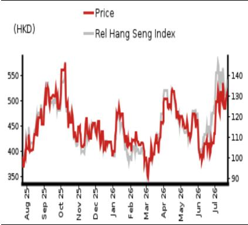

# 行业研究：医疗健康与制药

## 2026年上半年展望及全年预测调整

## 预计2026年上半年销售增长及大额非经常性收入，下半年临床催化剂值得关注

我们预计2026年上半年收入将达到14.1亿元人民币，同比增长48.4%，同时实现7.31亿元人民币的正向盈利，主要得益于法律和解款项。

我们估计科伦博泰2026年上半年收入为14.1亿元人民币（同比增长48%），其中6.5亿元来自药品销售（主要为sac-TMT），7.5亿元来自合作收入。我们认为sac-TMT的销售进展符合管理层设定的2025年销售额弹性较高目标，考虑到纳入医保目录后销售加速增长。

在利润率方面，我们估计2026年上半年毛利率同比提升9.1个百分点至78.5%。我们预计2026年上半年运营支出为9.94亿元人民币（同比增长15%），考虑到销售团队扩张。

我们预计2026年上半年其他收入达到7.5亿元人民币，主要来自与MediLink Therapeutics（未上市）法律和解收到的款项。

因此，净利润预计将转正至7.31亿元人民币（2025年上半年为亏损1.45亿元）。

对于2026年下半年，我们预计收入同比增长30%至14.4亿元人民币，主要由sac-TMT销售持续增长推动。结合81.1%的毛利率和10亿元运营支出（同比下降8.5%），2026年下半年净利润预计为2.06亿元人民币（2025年下半年为亏损2.37亿元）。

## 维持积极观点，目标价从544.42港元上调至612.66港元

我们下调2026年收入预测14%，但上调盈利预测226%（考虑上述法律和解收益），同时上调中期增长预期，考虑到近期sac-TMT临床开发的顺利进展。（参见我们的报告：科伦博泰（6990 HK）- sac-TMT在即将召开的ASCO上的又一重大成果；快评 - 科伦博泰（6990 HK）- 首个全球III期临床试验提前达到主要终点。）

因此，我们基于DCF模型（假设WACC为10.8%不变，终端增长率4.0%不变）将目标价从544.42港元上调至612.66港元。当前报价对应2025年268亿元销售额的4.0倍。

我们认为科伦博泰的海外合作伙伴默克（MRK US，未评级）提交sac-TMT的生物制品许可申请将是2026年下半年值得关注的关键事件。

<table><tr><td>截至12月31日</td><td colspan="2">2025</td><td colspan="2">2026F</td><td colspan="2">2027F</td><td colspan="2">2028F</td></tr><tr><td>货币（人民币）</td><td>实际</td><td>旧</td><td>新</td><td>旧</td><td>新</td><td>旧</td><td>新</td><td></td></tr><tr><td>收入（百万元）</td><td>2,058</td><td>3,298</td><td>2,851</td><td>4,945</td><td>4,972</td><td>6,252</td><td>6,922</td><td></td></tr><tr><td>报告净利润（百万元）</td><td>-382</td><td>287</td><td>937</td><td>1,021</td><td>999</td><td>1,640</td><td>1,746</td><td></td></tr><tr><td>正常化净利润（百万元）</td><td>-382</td><td>287</td><td>937</td><td>1,021</td><td>999</td><td>1,640</td><td>1,746</td><td></td></tr><tr><td>完全摊薄正常化每股收益</td><td>-1.74</td><td>1.31</td><td>4.26</td><td>4.64</td><td>4.54</td><td>7.45</td><td>7.93</td><td></td></tr><tr><td>完全摊薄正常化每股收益增长率（%）</td><td>–</td><td>–</td><td>–</td><td>255.6</td><td>6.7</td><td>60.6</td><td>74.7</td><td></td></tr><tr><td>完全摊薄正常化市盈率（倍）</td><td>–</td><td>–</td><td>109.3</td><td>–</td><td>102.4</td><td>–</td><td>58.6</td><td></td></tr><tr><td>企业价值/EBITDA（倍）</td><td>–</td><td>–</td><td>62.9</td><td>–</td><td>17.8</td><td>–</td><td>9.6</td><td></td></tr><tr><td>市净率（倍）</td><td>21.0</td><td>–</td><td>12.5</td><td>–</td><td>11.1</td><td>–</td><td>9.3</td><td></td></tr><tr><td>股息率（%）</td><td>–</td><td>–</td><td>–</td><td>–</td><td>–</td><td>–</td><td>–</td><td></td></tr><tr><td>净资产回报表现（%）</td><td>-9.3</td><td>5.7</td><td>14.3</td><td>18.0</td><td>11.5</td><td>23.4</td><td>17.3</td><td></td></tr><tr><td>净债务/权益（%）</td><td>净现金</td><td>净现金</td><td>净现金</td><td>净现金</td><td>净现金</td><td>净现金</td><td>净现金</td><td></td></tr></table>

来源：公司数据，NOM估计

评级维持积极

目标价
从544.42港元上调
至612.66港元

<table><tr><td>2026年7月23日收盘价</td><td>521.50港元</td></tr></table>

<table><tr><td>隐含上行空间</td><td>+17.5%</td></tr></table>

<table><tr><td>市值（百万美元）</td><td>15,897.7</td></tr><tr><td>日均交易量（百万美元）</td><td>63.4</td></tr></table>

## 相对表现图

  
来源：LSEG，NOM

## 研究分析师

中国医疗健康与制药
张嘉琳，CFA，CPA - NIHK
jialin.zhang@NOM.com
+852 2252 6134

## 科伦博泰关键数据

现金流量表（人民币百万元）

<table><tr><td>表现（%）</td><td>1个月</td><td>3个月</td><td>12个月</td><td></td><td></td></tr><tr><td>相对（港元）</td><td>31.0</td><td>12.2</td><td>39.1</td><td>市值（百万美元）</td><td>15,897.7</td></tr><tr><td>相对（美元）</td><td>31.0</td><td>12.1</td><td>39.2</td><td>自由流通比例（%）</td><td>69.4</td></tr><tr><td>相对恒生指数</td><td>23.0</td><td>15.0</td><td>40.3</td><td>3个月日均交易量（百万美元）</td><td>63.4</td></tr></table>

<table><tr><td colspan="6">利润表（人民币百万元）</td></tr><tr><td>截至12月31日</td><td>2024</td><td>2025</td><td>2026F</td><td>2027F</td><td>2028F</td></tr><tr><td>收入</td><td>1,933</td><td>2,058</td><td>2,851</td><td>4,972</td><td>6,922</td></tr><tr><td>销售成本</td><td>-659</td><td>-579</td><td>-575</td><td>-1,071</td><td>-1,429</td></tr><tr><td>毛利润</td><td>1,274</td><td>1,479</td><td>2,276</td><td>3,901</td><td>5,493</td></tr><tr><td>销售、一般及行政费用</td><td>-1,552</td><td>-1,974</td><td>-2,009</td><td>-2,798</td><td>-3,536</td></tr><tr><td>员工股份支出</td><td></td><td></td><td></td><td></td><td></td></tr><tr><td>营业利润</td><td>-279</td><td>-495</td><td>266</td><td>1,103</td><td>1,957</td></tr><tr><td>EBITDA</td><td>-222</td><td>-385</td><td>353</td><td>1,211</td><td>2,077</td></tr><tr><td>折旧</td><td>-56</td><td>-109</td><td>-86</td><td>-105</td><td>-114</td></tr><tr><td>摊销</td><td>0</td><td>-1</td><td>-1</td><td>-3</td><td>-6</td></tr><tr><td>EBIT</td><td>-279</td><td>-495</td><td>266</td><td>1,103</td><td>1,957</td></tr><tr><td>净利息支出</td><td>-4</td><td>-6</td><td>-9</td><td>-15</td><td>-21</td></tr><tr><td>联营及合营企业</td><td></td><td></td><td></td><td></td><td></td></tr><tr><td>其他收入</td><td>140</td><td>145</td><td>855</td><td>99</td><td>138</td></tr><tr><td>税前利润</td><td>-143</td><td>-356</td><td>1,113</td><td>1,187</td><td>2,074</td></tr><tr><td>所得税</td><td>-124</td><td>-26</td><td>-167</td><td>-178</td><td>-311</td></tr><tr><td>税后净利润</td><td>-267</td><td>-382</td><td>946</td><td>1,009</td><td>1,763</td></tr><tr><td>少数股东权益</td><td>0</td><td>0</td><td>-9</td><td>-10</td><td>-18</td></tr><tr><td>其他项目</td><td></td><td></td><td></td><td></td><td></td></tr><tr><td>优先股股息</td><td></td><td></td><td></td><td></td><td></td></tr><tr><td>正常化NPAT</td><td>-267</td><td>-382</td><td>937</td><td>999</td><td>1,746</td></tr><tr><td>特殊项目</td><td></td><td></td><td></td><td></td><td></td></tr><tr><td>报告NPAT</td><td>-267</td><td>-382</td><td>937</td><td>999</td><td>1,746</td></tr><tr><td>股息</td><td></td><td></td><td></td><td></td><td></td></tr><tr><td>转入储备</td><td>-267</td><td>-382</td><td>937</td><td>999</td><td>1,746</td></tr><tr><td>估值与比率</td><td></td><td></td><td></td><td></td><td></td></tr><tr><td>报告市盈率（倍）</td><td>-</td><td>-</td><td>109.3</td><td>102.4</td><td>58.6</td></tr><tr><td>正常化市盈率（倍）</td><td>-394.6</td><td>-268.0</td><td>109.3</td><td>102.4</td><td>58.6</td></tr><tr><td>完全摊薄正常化市盈率（倍）</td><td>-</td><td>-</td><td>109.3</td><td>102.4</td><td>58.6</td></tr><tr><td>股息率（%）</td><td>-</td><td>-</td><td>-</td><td>-</td><td>-</td></tr><tr><td>市现率（倍）</td><td>-</td><td>-</td><td>172.1</td><td>102.9</td><td>55.7</td></tr><tr><td>市净率（倍）</td><td>31.8</td><td>21.0</td><td>12.5</td><td>11.1</td><td>9.3</td></tr><tr><td>企业价值/EBITDA（倍）</td><td>-</td><td>-</td><td>62.9</td><td>17.8</td><td>9.6</td></tr><tr><td>企业价值/EBIT（倍）</td><td>-</td><td>-</td><td>83.4</td><td>19.5</td><td>10.2</td></tr><tr><td>毛利率（%）</td><td>65.9</td><td>71.9</td><td>79.8</td><td>78.5</td><td>79.4</td></tr><tr><td>EBITDA利润率（%）</td><td>-11.5</td><td>-18.7</td><td>12.4</td><td>24.4</td><td>30.0</td></tr><tr><td>EBIT利润率（%）</td><td>-14.4</td><td>-24.0</td><td>9.3</td><td>22.2</td><td>28.3</td></tr><tr><td>净利润率（%）</td><td>-13.8</td><td>-18.6</td><td>32.9</td><td>20.1</td><td>25.2</td></tr><tr><td>有效税率（%）</td><td>-</td><td>-</td><td>15.0</td><td>15.0</td><td>15.0</td></tr><tr><td>股息支付率（%）</td><td>-</td><td>-</td><td>0.0</td><td>0.0</td><td>0.0</td></tr><tr><td>净资产回报表现（%）</td><td>-9.5</td><td>-9.3</td><td>14.3</td><td>11.5</td><td>17.3</td></tr><tr><td>总资产回报表现（税前%）</td><td>-11.3</td><td>-17.4</td><td>9.3</td><td>33.6</td><td>51.1</td></tr><tr><td>增长率（%）</td><td></td><td></td><td></td><td></td><td></td></tr><tr><td>收入</td><td>25.5</td><td>6.5</td><td>38.5</td><td>74.4</td><td>39.2</td></tr><tr><td>EBITDA</td><td></td><td>-</td><td>-</td><td>242.9</td><td>71.4</td></tr><tr><td>正常化每股收益</td><td></td><td>-</td><td>-</td><td>6.7</td><td>74.7</td></tr><tr><td>正常化完全摊薄每股收益</td><td></td><td>-</td><td>-</td><td>6.7</td><td>74.7</td></tr></table>

来源：公司数据，NOM估计

<table><tr><td>截至12月31日</td><td>2024</td><td>2025</td><td>2026F</td><td>2027F</td><td>2028F</td></tr><tr><td>EBITDA</td><td>-222</td><td>-385</td><td>353</td><td>1,211</td><td>2,077</td></tr><tr><td>营运资本变动</td><td>-405</td><td>-58</td><td>-438</td><td>-123</td><td>-46</td></tr><tr><td>其他经营现金流</td><td>197</td><td>263</td><td>680</td><td>-94</td><td>-193</td></tr><tr><td>经营活动现金流</td><td>-430</td><td>-180</td><td>595</td><td>995</td><td>1,837</td></tr><tr><td>资本支出</td><td>-77</td><td>-126</td><td>-131</td><td>-178</td><td></td></tr><tr><td>自由现金流</td><td>-507</td><td>-307</td><td>464</td><td>817</td><td>1,837</td></tr><tr><td>投资减少</td><td>-773</td><td>504</td><td>-123</td><td>-135</td><td>-149</td></tr><tr><td colspan="6">净收购</td></tr><tr><td>其他长期资产变动</td><td>-85</td><td>-25</td><td>1</td><td>1</td><td>-11</td></tr><tr><td>其他长期负债增加</td><td>79</td><td>-33</td><td>19</td><td>20</td><td>20</td></tr><tr><td>调整</td><td>34</td><td>91</td><td>-2</td><td>-2</td><td>-170</td></tr><tr><td>投资活动后现金流</td><td>-1,252</td><td>231</td><td>359</td><td>700</td><td>1,528</td></tr><tr><td colspan="6">现金股息</td></tr><tr><td>股权发行</td><td>1,094</td><td>1,777</td><td>2,406</td><td>0</td><td>0</td></tr><tr><td>债务发行</td><td>0</td><td>0</td><td>0</td><td>0</td><td>0</td></tr><tr><td colspan="6">可转换债务发行</td></tr><tr><td>其他</td><td>-35</td><td>-101</td><td>-1</td><td>0</td><td>0</td></tr><tr><td>融资活动现金流</td><td>1,060</td><td>1,677</td><td>2,405</td><td>0</td><td>0</td></tr><tr><td>净现金流</td><td>-192</td><td>1,907</td><td>2,764</td><td>700</td><td>1,528</td></tr><tr><td>期初现金</td><td>1,529</td><td>1,337</td><td>3,244</td><td>6,008</td><td>6,708</td></tr><tr><td>期末现金</td><td>1,337</td><td>3,244</td><td>6,008</td><td>6,708</td><td>8,236</td></tr><tr><td>期末净债务</td><td>-1,337</td><td>-3,244</td><td>-6,008</td><td>-6,708</td><td>-8,236</td></tr><tr><td colspan="6">资产负债表（人民币百万元）</td></tr><tr><td>截至12月31日</td><td>2024</td><td>2025</td><td>2026F</td><td>2027F</td><td>2028F</td></tr><tr><td>现金及等价物</td><td>1,337</td><td>3,244</td><td>6,008</td><td>6,708</td><td>8,236</td></tr><tr><td>有价证券</td><td>1,732</td><td>1,228</td><td>1,351</td><td>1,486</td><td>1,634</td></tr><tr><td>应收账款</td><td>304</td><td>346</td><td>508</td><td>817</td><td>1,043</td></tr><tr><td>存货</td><td>111</td><td>241</td><td>142</td><td>235</td><td>274</td></tr><tr><td>其他流动资产</td><td>10</td><td>90</td><td>92</td><td>93</td><td>95</td></tr><tr><td>流动资产合计</td><td>3,493</td><td>5,149</td><td>8,100</td><td>9,339</td><td>11,283</td></tr><tr><td colspan="6">长期投资</td></tr><tr><td>固定资产</td><td>595</td><td>636</td><td>669</td><td>719</td><td>741</td></tr><tr><td colspan="6">商誉</td></tr><tr><td>其他无形资产</td><td>3</td><td>1</td><td>14</td><td>36</td><td>64</td></tr><tr><td>其他长期资产</td><td>178</td><td>203</td><td>202</td><td>202</td><td>213</td></tr><tr><td>总资产</td><td>4,268</td><td>5,989</td><td>8,986</td><td>10,296</td><td>12,301</td></tr><tr><td>短期债务</td><td>0</td><td>0</td><td>0</td><td>0</td><td>0</td></tr><tr><td>应付账款</td><td>447</td><td>685</td><td>293</td><td>554</td><td>752</td></tr><tr><td>其他流动负债</td><td>363</td><td>320</td><td>338</td><td>358</td><td>381</td></tr><tr><td>流动负债合计</td><td>810</td><td>1,004</td><td>631</td><td>912</td><td>1,133</td></tr><tr><td colspan="6">长期债务</td></tr><tr><td colspan="6">可转换债务</td></tr><tr><td>其他长期负债</td><td>150</td><td>117</td><td>136</td><td>156</td><td>177</td></tr><tr><td>总负债</td><td>959</td><td>1,121</td><td>767</td><td>1,068</td><td>1,309</td></tr><tr><td>少数股东权益</td><td>0</td><td>0</td><td>9</td><td>20</td><td>37</td></tr><tr><td>优先股</td><td>0</td><td>0</td><td>0</td><td>0</td><td>0</td></tr><tr><td>普通股</td><td>227</td><td>233</td><td>239</td><td>239</td><td>239</td></tr><tr><td>留存收益</td><td>3,081</td><td>4,634</td><td>7,970</td><td>8,970</td><td>10,715</td></tr><tr><td colspan="6">拟派股息</td></tr><tr><td colspan="6">其他权益及储备</td></tr><tr><td>股东权益合计</td><td>3,309</td><td>4,867</td><td>8,209</td><td>9,209</td><td>10,954</td></tr><tr><td>权益及负债合计</td><td>4,268</td><td>5,989</td><td>8,986</td><td>10,296</td><td>12,301</td></tr><tr><td colspan="6">流动性（倍）</td></tr><tr><td>流动比率</td><td>4.31</td><td>5.13</td><td>12.85</td><td>10.24</td><td>9.96</td></tr><tr><td>利息覆盖倍数</td><td>-73.4</td><td>-80.4</td><td>31.2</td><td>74.1</td><td>94.5</td></tr><tr><td colspan="6">杠杆率</td></tr><tr><td>净债务/EBITDA（倍）</td><td>–</td><td>–</td><td>净现金</td><td>净现金</td><td>净现金</td></tr><tr><td>净债务/权益（%）</td><td>净现金</td><td>净现金</td><td>净现金</td><td>净现金</td><td>净现金</td></tr><tr><td colspan="6">每股数据</td></tr><tr><td>报告每股收益（人民币）</td><td>-1.21</td><td>-1.74</td><td>4.26</td><td>4.54</td><td>7.93</td></tr><tr><td>正常化每股收益（人民币）</td><td>-1.21</td><td>-1.74</td><td>4.26</td><td>4.54</td><td>7.93</td></tr><tr><td>完全摊薄正常化每股收益（人民币）</td><td>-1.22</td><td>-1.74</td><td>4.26</td><td>4.54</td><td>7.93</td></tr><tr><td>每股账面价值（人民币）</td><td>15.03</td><td>22.11</td><td>37.30</td><td>41.84</td><td>49.77</td></tr><tr><td>每股股息（人民币）</td><td>0.00</td><td>0.00</td><td>0.00</td><td>0.00</td><td>0.00</td></tr><tr><td colspan="6">运营效率（天）</td></tr><tr><td>应收账款周转天数</td><td>49.0</td><td>57.6</td><td>54.6</td><td>48.6</td><td>49.2</td></tr><tr><td>存货周转天数</td><td>48.0</td><td>110.7</td><td>121.5</td><td>64.2</td><td>65.2</td></tr><tr><td>应付账款周转天数</td><td>268.6</td><td>356.5</td><td>310.3</td><td>144.4</td><td>167.3</td></tr><tr><td>现金周期</td><td>-171.6</td><td>-188.2</td><td>-134.2</td><td>-31.6</td><td>-52.9</td></tr></table>

来源：公司数据，NOM估计

## 公司简介

科伦博泰是一家成立于2016年的生物制药公司，是抗体药物偶联物（ADC）开发的先驱之一。科伦博泰积累了超过十年的ADC开发经验，并建立了自己的集成ADC研发平台OptiDC。该公司已与默沙东签订对外许可协议，共同开发用于癌症治疗的ADC资产，首付款和里程碑付款总额高达100亿美元。

## 估值方法

我们通过DCF模型得出612.66港元的目标价，假设WACC为10.8%，终端增长率为4.5%。该公司的基准指数为恒生指数。

可能阻碍目标价实现的风险

下行风险：（1）sac-TMT及其他药物销售增长慢于预期；（2）临床进展未达预期。

## ESG

科伦博泰优先考虑其ESG战略，遵循其使命。董事会负责监督和指导ESG倡议，并直接制定ESG战略和政策。公司还设立了环境、健康与安全（"EHS"）工作组，负责监督ESG相关事项的日常实践并实施ESG政策。截至2021年12月31日和2022年，环境合规相关支出分别为66.82万元和77.11万元。

图1：科伦博泰2026年上半年利润表

<table><tr><td>人民币百万元</td><td>2025年上半年</td><td>2026年上半年F</td><td>同比</td></tr><tr><td>收入</td><td>950</td><td>1,410</td><td>48%</td></tr><tr><td>销售成本</td><td>(290)</td><td>(303)</td><td>4%</td></tr><tr><td>毛利润</td><td>660</td><td>1,107</td><td>68%</td></tr><tr><td>毛利率（%）</td><td>69%</td><td>79%</td><td></td></tr><tr><td>研发费用</td><td>(612)</td><td>(564)</td><td>-8%</td></tr><tr><td>一般及行政费用</td><td>(74)</td><td>(120)</td><td>62%</td></tr><tr><td>销售费用</td><td>(179)</td><td>(310)</td><td>73%</td></tr><tr><td>营业利润</td><td>(204)</td><td>113</td><td>-155%</td></tr><tr><td>营业利润率（%）</td><td>-21%</td><td>8%</td><td></td></tr><tr><td>其他收入及支出</td><td>32</td><td>750</td><td>2259%</td></tr><tr><td>利息支出</td><td>(3)</td><td>(3)</td><td>-1%</td></tr><tr><td>税前利润</td><td>(176)</td><td>860</td><td>-590%</td></tr><tr><td>所得税</td><td>30</td><td>(129)</td><td>-525%</td></tr><tr><td>税后利润</td><td>(145)</td><td>731</td><td>-603%</td></tr><tr><td>少数股东权益</td><td>-</td><td>-</td><td></td></tr><tr><td>股东应占净利润</td><td>(145)</td><td>731</td><td>-603%</td></tr></table>

来源：公司数据，NOM估计

## 附录A-1

本报告由NOM International (Hong Kong) Ltd. (NIHK) 编制。有关NOM集团实体的详细信息，请参阅免责声明。

## 分析师认证

本人张嘉琳特此证明：（1）本研究报告中所表达的观点准确反映了我个人对相关证券或发行人的看法；（2）我的薪酬中没有任何部分直接或间接与本研究报告中的具体建议或观点相关；（3）我的薪酬中没有任何部分与NOM Securities International, Inc.、NOM International plc或任何其他NOM集团公司进行的任何特定投资银行业务交易挂钩。

## 发行人特定监管披露

本文中使用的"NOM"和"NOM集团"指NOM Holdings, Inc.及其关联公司和子公司，包括NOM Securities International, Inc. ('NSI') 和Instinet, LLC ('ILLC')，均为美国注册经纪交易商及SIPC成员。

## 实质性提及的发行人

521.50港元（2026年7月23日）积极（行业评级：不适用）

<table><tr><td>发行人</td><td>代码</td><td>价格</td><td>价格日期</td><td>股票评级</td><td>行业评级</td><td>披露</td></tr><tr><td>科伦博泰</td><td>6990 HK</td><td>521.50港元</td><td>2026年7月23日</td><td>积极</td><td>不适用</td><td></td></tr></table>

  
评级说明请参见图表后的股票评级说明

估值方法 我们通过DCF模型得出612.66港元的目标价，假设WACC为10.8%，终端增长率为4.5%。该公司的基准指数为恒生指数。
可能阻碍目标价实现的风险 下行风险：（1）sac-TMT及其他药物销售增长慢于预期；（2）临床进展未达预期。

## 重要披露

## 研究报告在线获取及利益冲突披露

NOM集团研究报告可在www.NOMnow.com/research、Bloomberg、Capital IQ、Factset、LSEG上获取。

重要披露可访问http://go.NOMnow.com/research/m/Disclosures阅读，或向NOM Securities International, Inc.索取。如网站访问遇到问题，请发送邮件至gr
