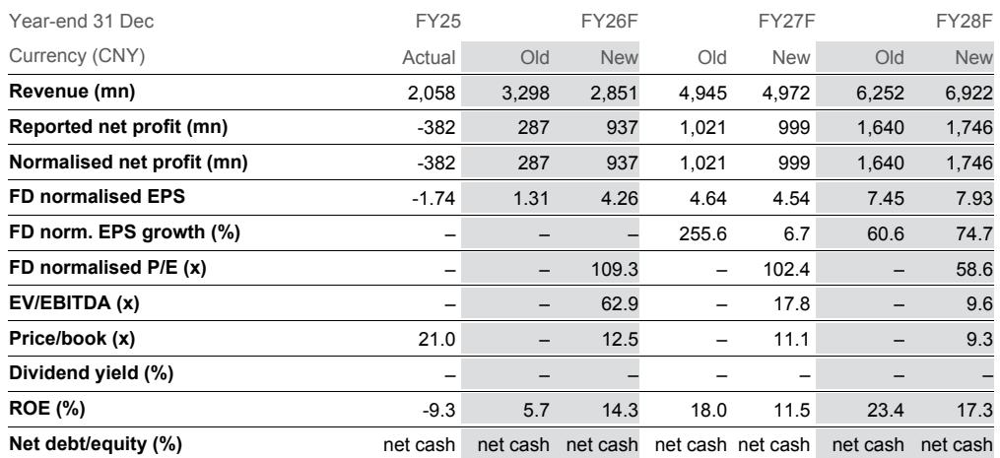
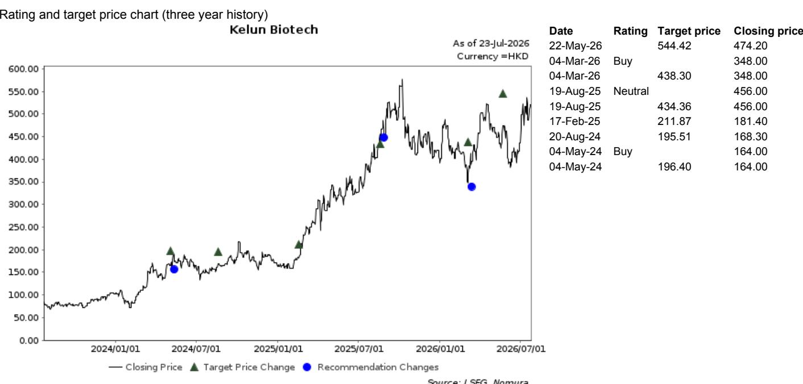
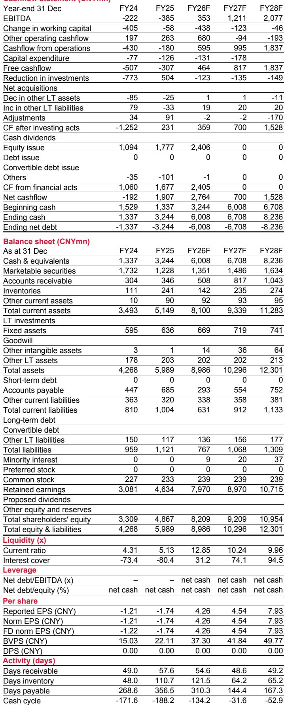

# A Biotech Turnaround Is Not a Thesis: Why Kelun Biotech's Path to Profitability Depends on a Single Drug's Commercial Maturity

Kelun Biotech is projected to report a net profit of CNY731 million in the first half of 2026, a dramatic swing from the CNY145 million loss recorded in the same period a year earlier. That swing, however, is not driven by operational leverage or a sudden surge in product demand. Nearly all of it comes from a single legal settlement payment of CNY750 million. Strip away that non-recurring item, and the company's core business shows an operating profit of only CNY113 million on revenue of CNY1.41 billion, a margin of just 8%. The company is crossing into profitability, but the crossing is not yet evidence of a self-sustaining commercial engine.

The critical question for observers is not whether Kelun Biotech will report a profit in 2026. It is whether the company can convert its flagship antibody-drug conjugate, sac-TMT, from a clinical success into a durable revenue stream that can fund its pipeline without reliance on one-off windfalls. The next twelve months will provide the answer. The BLA filing for sac-TMT by Merck, Kelun's overseas partner, is expected in the second half of 2026. That regulatory event, combined with the drug's post-NRDL sales trajectory in China, will determine whether the current valuation—trading at roughly 4.0x projected FY35 sales of CNY26.8 billion—is justified by commercial reality or inflated by clinical promise.

## The First-Half Profit Is Real but Structurally Misleading; Observers Must Separate the Signal from the Settlement

Kelun Biotech's 1H26F financials tell two different stories. The headline story is one of inflection: revenue growing 48% year-on-year to CNY1.41 billion, a gross margin expanding 9.1 percentage points to 78.5%, and a net profit of CNY731 million. These numbers are accurate, but they are not representative of the company's underlying earnings power.

The second story is hidden in the line item labeled "other income." That figure jumps to CNY750 million, up 2,259% year-on-year, entirely from a payment received from the legal settlement with MediLink Therapeutics. Without this item, Kelun Biotech's pre-tax profit would be approximately CNY110 million, not CNY860 million. The operating profit of CNY113 million suggests that even the core business is marginally profitable, but that margin is thin and vulnerable to any increase in spending.

The implication is straightforward: Kelun Biotech's first-half profitability is real but non-repeatable. The legal settlement is a one-time event. Those who extrapolate this quarter's net income into a forward earnings trajectory are likely to overestimate the company's normalized earnings power. The true test of the business model will come in the second half of 2026 and beyond, when the settlement gain is absent and the company must rely entirely on product sales and collaboration revenue to generate profit.

## Sac-TMT's Post-NRDL Trajectory Is the Only Revenue Story That Matters; Collaboration Revenue Is a Diminishing Contributor

Kelun Biotech's 1H26F revenue composition reveals a deliberate shift. Drug sales, led by sac-TMT, are expected to reach CNY650 million, while collaboration revenue contributes CNY750 million. The collaboration revenue, which includes milestone payments from out-licensing deals, has been a significant driver of top-line growth in the past. But that stream is inherently lumpy and depends on the timing of clinical and regulatory milestones from partners.

The more sustainable growth driver is sac-TMT sales. Management has set a target of doubling FY25 sales, and the accelerated ramp-up after NRDL inclusion suggests that target is achievable. NRDL inclusion, which provides reimbursement access across China's public hospitals, is a powerful catalyst for volume growth in the oncology drug market. However, it also typically comes with price concessions. The gross margin improvement to 78.5% from 69.4% a year earlier indicates that the company is either achieving better pricing than expected or benefiting from manufacturing scale.

For the full year FY26F, the company's revenue is forecast at CNY2.85 billion, with drug sales expected to grow sequentially in the second half. The collaboration revenue, however, will likely decline in 2H26F as the legal settlement payment is not repeated. The implication is that by FY27F, drug sales must account for an increasingly large share of total revenue. If sac-TMT fails to sustain its growth trajectory, the company's revenue base will be structurally smaller than current projections assume.

## The Earnings Revision Tells a Story of One-Time Gains, Not Fundamental Improvement; 公司情况更新

The report revises FY26F net profit upward by 226%, from CNY287 million to CNY937 million. That is a massive revision, but it is almost entirely attributable to the legal settlement gain. The revenue forecast, by contrast, is revised downward by 14%, from CNY3.30 billion to CNY2.85 billion. The divergence between these two revisions is a red flag: the company's top-line outlook is weakening even as its bottom-line outlook improves.

5%. A terminal growth rate of 4.5% for a biotech company in a competitive ADC market is aggressive. It implies that sac-TMT and the broader pipeline will generate sustainable growth well beyond the forecast period, with no significant erosion from biosimilar competition, pricing pressure, or clinical setbacks. If the terminal growth rate were lowered to 3.0%, a more conservative assumption for a single-product company.

Observers should also note that the stock trades at 4.0x FY35F sales of CNY26.8 billion. That multiple implies that the market is pricing in a very long duration of high growth. Any delay in sac-TMT's sales ramp-up or any negative clinical readout from Merck's ongoing trials could compress that multiple rapidly.

## The Second Half of 2026 Will Be Defined by Clinical Catalysts, Not Financial Results; the BLA Filing Is the Single Most Important Event

The report explicitly identifies the BLA filing of sac-TMT by Merck as a key monitorable in 2H26F. This filing, if successful, would trigger milestone payments and, more importantly, validate the drug's regulatory pathway in the United States. A U.S. approval would open a market many times larger than China and would significantly increase the probability of commercial success for the entire sac-TMT program.

But the BLA filing is not the only clinical catalyst. The report references a separate note indicating that the first global Phase III clinical trial for sac-TMT met its primary endpoints ahead of schedule. That is a positive signal, but it also raises the question of whether the drug's efficacy and safety profile are strong enough to differentiate it in a crowded ADC field. Sac-TMT is a Trop-2 targeting ADC, a mechanism of action that competes directly with Trodelvy and other agents. The competitive dynamics in this space are intense, and any weakness in the Phase III data could erode the drug's commercial potential.

The second-half revenue forecast of CNY1.44 billion, representing 30% year-on-year growth, assumes continued momentum in sac-TMT sales. But the company's operating expenses are expected to decline 8.5% year-on-year in 2H26F, suggesting that management is tightening cost controls. That is a prudent move, but it also limits the company's ability to invest in sales force expansion or additional clinical trials. The balance between cost discipline and growth investment will be a key tension to watch.

## A Decision Framework for Observers: Three Scenarios for Kelun Biotech's Risk-Reward Profile

The following framework translates the report's projections into actionable scenarios for observers. Each scenario is defined by the interplay of sac-TMT's commercial trajectory, the timing of the BLA filing, and the recurrence of non-operating income.

**Scenario 1: Base Case (Implied by the Report's Forecast).** Sac-TMT continues its post-NRDL ramp-up, achieving the doubling of FY25 sales by end-FY26. Merck files the BLA in 2H26F as expected. The company reports a full-year FY26F net profit of CNY937 million, with normalized net profit (excluding the settlement gain) of approximately CNY187 million. The stock trades at a forward P/E of approximately 109x on normalized earnings, which is expensive but justified by the growth potential.

**Scenario 2: Upside Case (BLA Filing Accelerates or Sales Exceed Expectations).** If Merck accelerates the BLA filing or if sac-TMT sales exceed management's target by more than 20%, the revenue and earnings forecasts would need to be revised upward. The DCF valuation would benefit from higher near-term cash flows and a longer duration of exclusivity. The market partially discounts this outcome, given the 31% one-month absolute return.

**Scenario 3: Downside Case (Sales Disappoint or BLA Is Delayed).** If sac-TMT's post-NRDL ramp-up slows due to competitive pressure or if Merck delays the BLA filing, the revenue forecast for FY27F and beyond would be at risk. The company would need to rely on additional collaboration revenue or cost cuts to maintain profitability. In this scenario, the stock could re-rate downward to a multiple consistent with single-product biotechs trading at 2-3x forward sales. The downside risk is amplified by the stock's recent outperformance relative to the Hang Seng Index.

Observers should monitor three leading indicators: monthly sac-TMT sales data in China, any public disclosure from Merck regarding the BLA timeline, and the company's operating expense trajectory. A sustained increase in opex without a corresponding revenue acceleration would suggest that the commercial model is not yet efficient.

## The Structural Question Is Whether Kelun Biotech Can Become a Multi-Product Company Before Its First-Mover Advantage Fades

Kelun Biotech's current valuation is anchored to sac-TMT. The pipeline includes other ADC assets, but none have reached late-stage clinical development. The company's out-licensing agreements with Merck, which include upfront and milestone payments totaling up to USD 10 billion, provide a financial cushion but also create dependency on a single partner's execution.

The company's integrated ADC R&D platform, OptiDC, is a genuine competitive asset. It has demonstrated the ability to generate clinically meaningful molecules. But platform value is only realized when it produces a steady stream of approved drugs. If sac-TMT is a one-hit wonder, the platform narrative collapses. If the platform generates follow-on assets, the company could transition from a single-product story to a diversified biotech.

The next 18 months will determine which path the company takes. The BLA filing in 2H26F is the first major milestone. A positive outcome would validate the platform and open the door for additional partnerships. A negative outcome would leave the company exposed to the commercial risks of a single drug in a competitive market. Observers must decide whether the current price already reflects the upside scenario or whether it leaves room for disappointment.

*For informational purposes only. Portions may be generated, translated, summarized, or edited with AI assistance based on source materials and may contain omissions or errors. Please verify independently. This is not professional advice.*

For informational purposes only. Portions may be generated, translated, summarized, or edited with AI assistance based on source materials and may contain omissions or errors. Please verify independently. This is not professional advice.

