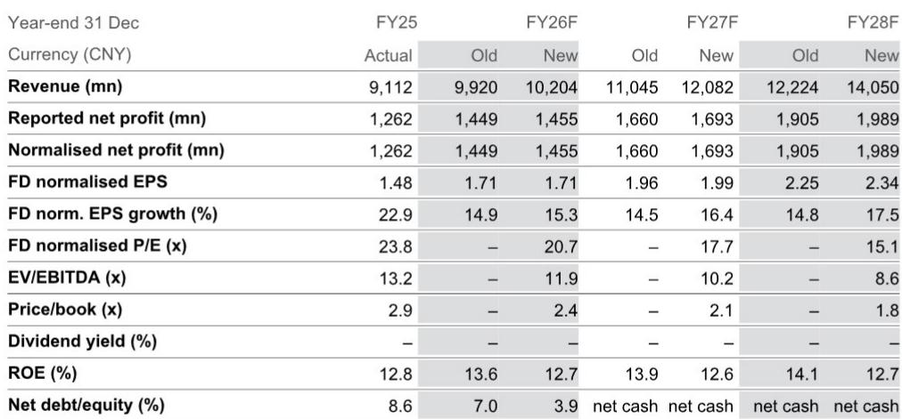
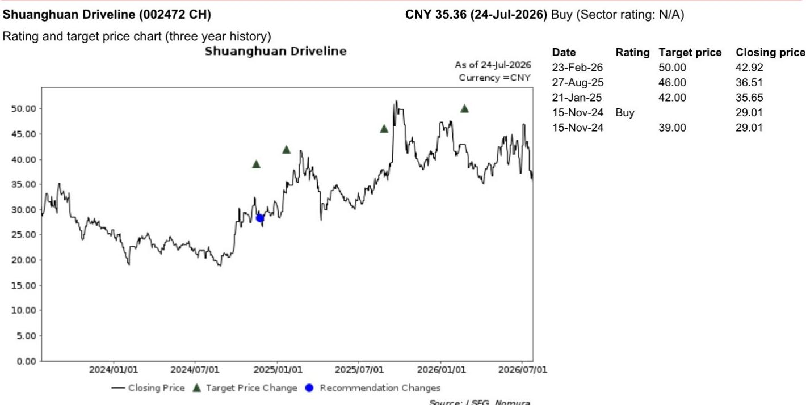
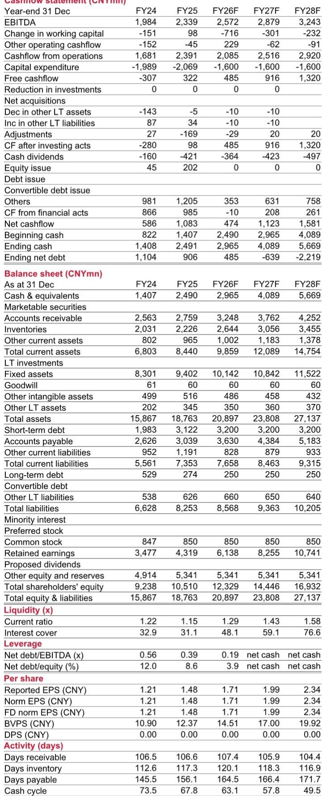

# NOM：双环传动2Q26F预览

NOM在最新报告中预计，双环传动2Q26F营收将延续增长，核心驱动力来自新能源车齿轮与工程机械两大板块。新能源车齿轮收入同比增速预计在10%至20%，其中4月持平，5至6月转正，同轴齿轮在6月开始放量。内燃机齿轮的同比降幅从1Q26的20%至30%收窄至个位数，报告认为下半年降幅将进一步收窄，全年降幅落在高个位数区间。工程机械齿轮维持20%至30%的同比增速，特斯拉Semi开始贡献少量全年收入。

这份报告的核心判断是：双环传动在2Q26F的收入结构正在从传统内燃机向新能源和工程机械切换，而机器人减速器业务虽然当前体量有限，但已进入客户交付和产能扩张的早期阶段，是2027至2028年增长的重要变量。

## 1. 新能源与工程机械齿轮构成2Q26F收入主体

NOM对双环传动2Q26F各业务线的预测显示，新能源车齿轮和工程机械齿轮是收入增长的两大支柱。新能源车齿轮同比增速10%至20%，工程机械齿轮同比增速20%至30%，两者合计贡献了大部分增量。内燃机齿轮的降幅收窄至个位数，主要得益于客户结构分散化。商用车齿轮整体持平，特斯拉Semi的贡献尚在起步阶段。

报告同时指出，2Q26F的毛利率不太可能超过1Q26，原因是产品组合变化。这意味着收入增长主要来自量的扩张，而非利润率提升。

> **KC评论：** 毛利率持平或略降，说明当前增长更多依赖规模而非定价能力。读者需要关注的是，随着同轴齿轮和工程机械齿轮占比提升，毛利率能否在2026年下半年企稳。

## 2. 机器人减速器单机价值约6000元，产能扩张已提上日程

在机器人业务上，NOM给出了具体的量化信息。对于一家机器人客户，双环传动预计为单台机器人供应6个RV减速器，平均单价约1000元，单机价值约6000元。下一代机器人将改用摆线减速器，同样供应6个。报告认为，随着Optimus等产品放量以及中国机器人厂商在成本曲线下降后加速扩产，双环传动可能进一步扩大产能。

但报告也提示了技术路线不确定性：如果机器人厂商的技术路线发生变化，单机内容价值可能被重新定义。这是一个需要持续跟踪的变量。

## 3. 2026至2028年EPS复合增速约16.5%，估值接近历史均值

NOM上调了2027和2028年每股盈利预测至1.99元和2.34元，对应2026至2028年EPS复合增速约16.5%。，对应2027年25倍市盈率，接近该股14年历史均值26倍。报告认为，当前估值水平有基本面支撑，但上行空间取决于机器人出货节奏和工程机械在4Q26的表现。

报告列出的主要不确定性包括：机器人厂商出货节奏慢于预期，以及工程机械在4Q26的出货量低于预期。这些因素可能影响2026年下半年至2027年的收入能见度。

## 4. 一个可复用的观察框架：从收入结构变化看公司转型阶段

双环传动当前的业务结构提供了一个观察制造业公司转型的框架。第一阶段是传统业务降幅收窄，第二阶段是新能源和工程机械等新业务放量，第三阶段是机器人等前沿业务从样品走向量产。目前公司处于第二阶段向第三阶段过渡的节点。判断转型是否顺利，可以关注三个指标：新能源车齿轮的季度增速是否持续高于行业均值、工程机械齿轮能否维持20%以上增速、机器人减速器是否从样品交付转向批量订单。这三个指标分别对应短期、中期和长期的增长能见度。

For informational purposes only. Portions may be generated,translated,summarized,or edited with AI assistance based on source materials and may contain omissions or errors. Please verify independently. This is not investment,legal,tax,accounting,or other professional advice.

For informational purposes only. Portions may be generated,translated,summarized,or edited with AI assistance based on source materials and may contain omissions or errors. Please verify independently. This is not investment,legal,tax,accounting,or other professional advice.

