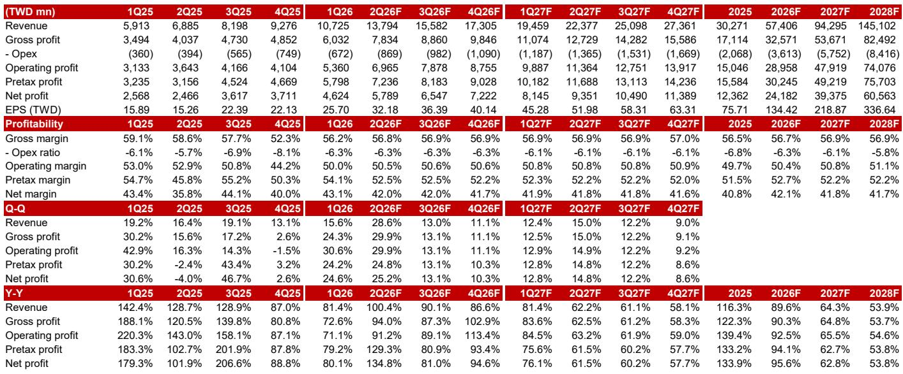
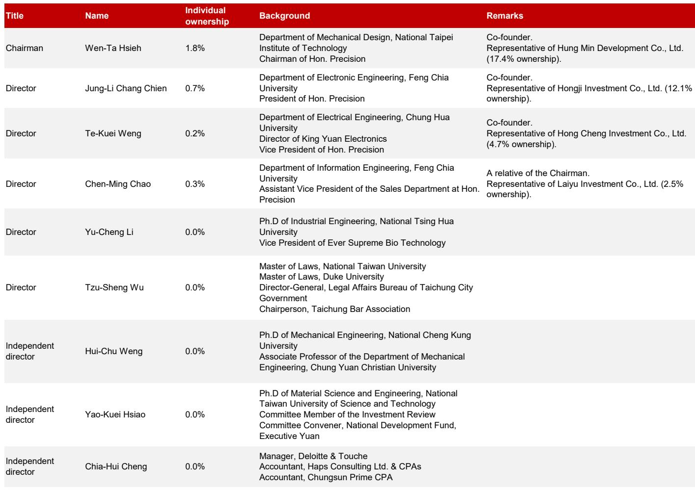
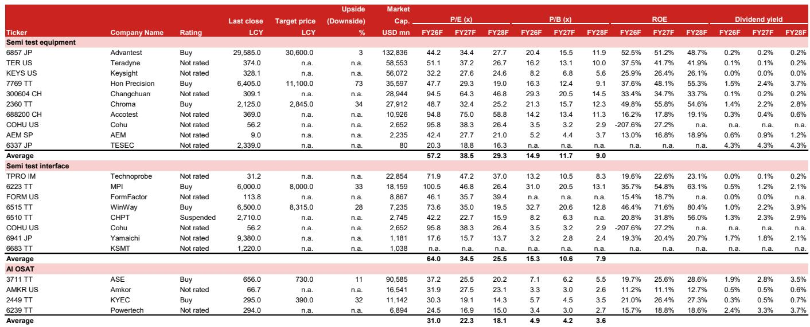

# 测试复杂度，而非芯片数量，是半导体资本设备的新增长引擎

半导体行业长期以来以晶体管数量和晶圆启动量来衡量。但在人工智能时代，瓶颈正从能制造多少芯片，转向每颗芯片能被测试得多彻底。鸿劲精密，一家总部位于台湾的IC测试分选机与主动热控系统制造商，正处在这一结构性转变的中心。AI与HPC芯片目前约占鸿劲工具订单的80%，预计公司到2028年的营收复合年增长率为59%，正常化每股收益从FY25的新台币75.69元上升至FY28F的新台币336.59元。这并非半导体需求的周期性上升，而是每颗芯片测试强度的长期扩张，由芯片设计复杂度、更大的封装尺寸以及不断上升的热管理需求驱动。其报价反映了40倍2027-28F平均每股收益的估值，这一倍数处于其历史区间的高端，但仍低于可比半导体后端设备与测试接口供应商37倍的2027E彭博共识平均市盈率。

传统的半导体设备分析框架一直锚定于晶圆制造设备支出。这一视角正变得不完整。随着芯片架构向多芯片设计、先进封装堆叠和异构集成迁移，最终测试和系统级测试阶段正吸收半导体资本支出中日益增长的份额。鸿劲的产品组合直接针对这一新兴的资本支出类别。该公司的测试分选机和主动热控系统部署在最终测试和系统级测试阶段，芯片在此处进行出货前的最后质量验证。关键洞察在于，AI和HPC芯片的测试时间正在大幅延长，并非因为生产的芯片更多，而是因为每颗芯片需要更长、更复杂的测试。这一动态将鸿劲的营收轨迹与传统半导体出货周期脱钩，转而与每颗设备的复杂度上升挂钩。

对观察者而言，这意味着鸿劲代表了一个仍处于早期阶段的趋势的结构性受益者。该公司2026-28F的每股收益预计将以58%的净利润复合年增长率增长，这一速度远超大多数半导体设备同行。这一论点的风险并非芯片需求的周期性下滑，而是CoWoS和后端测试产能扩张的放缓，或关键AI芯片客户产品更新的延迟。这些是执行和技术路线图风险，而非需求风险。对于评估半导体价值链中长期复合增长机会的严肃商业受众，鸿劲提供了高增长可见性、通过技术升级实现的定价能力，以及远超当前AI基础设施建设的多重长期驱动因素的罕见组合。

## 向先进主动热控系统的迁移为鸿劲创造了多年的平均售价上升趋势

鸿劲营收增长最直接且可量化的驱动因素是主动热控系统的升级周期。随着AI芯片功率密度增加，测试期间的热管理要求变得更加严格。鸿劲的ATC解决方案并非可选配件，而是测试高性能芯片的必备设备，这些芯片在运行中会产生大量热量。报告指出了由客户迁移至更强大热控系统驱动的明确ATC升级路线图。这不是一次性事件，而是一个重复的周期。每一代新的AI芯片，特别是那些为领先AI GPU客户2028平台构建的GPU-on-GPU系统级集成芯片堆叠，都将需要更先进的ATC能力。这些升级带来的平均售价提升是显著且可见的。

这一趋势对鸿劲尤为有价值之处在于，它不依赖于芯片市场的数量增长。即使AI芯片的总出货量保持不变，为测试这些芯片而迁移至更高性能的ATC单元仍将推动营收增长。报告指出，OSAT可能需要在2027-28F之后升级分选机，以适应大型封装，包括10-11倍光罩尺寸的中间层、芯片-封装-基板设计以及嵌入式多芯片互连桥接架构。这些并非假设情景，而是领先AI芯片设计师路线图中固有的工程要求。鸿劲对这些路线图的可见性，加上其执行记录，使其相对于可能缺乏同等客户亲密度或技术广度的竞争对手处于有利地位。

## 由新封装技术和新兴测试插入驱动的分选机升级将把增长周期延长至2028年之后

测试分选机业务常被视为成熟，但报告提出了有力论据，认为新封装技术正在为分选机升级和新购创造增量需求。共封装光学测试插入和微通道盖板的出现代表了全新的测试要求，这些要求在之前的芯片世代中并不存在。CPO将光学组件直接集成到芯片封装中，需要能够同时处理光学接口和电气测试的专用测试分选机。MCL通过嵌入芯片盖板的微通道结构提供先进冷却，需要能够与这些新型热管理特性交互的分选机。这两项技术都处于早期采用阶段，意味着相关的测试设备支出才刚刚开始。

除了AI和HPC，报告观察到移动应用处理器和CPU中的测试内容也在增长，这由先进封装和多芯片布局驱动。这是一个关键点，因为它将鸿劲的可寻址市场扩展到AI数据中心领域之外。智能手机应用处理器越来越多地采用多芯片架构，这需要更广泛的最终测试。CPU制造商也在走类似的道路。鸿劲在这些领域的最终测试分选机中拥有强大立足点，意味着它可以同时捕捉多个终端市场的测试强度增长。报告对FY26F、FY27F和FY28F的营收预测分别为新台币574亿元、新台币943亿元和新台币1451亿元，这表明分选机升级周期预计将在预测期内加速，而非趋于平稳。

## 鸿劲的商业模式展现出运营杠杆，将营收增长放大为更快的盈利增长

报告中的财务预测揭示了一家不仅营收增长，而且利润率改善、现金流强劲的公司。毛利率预计在FY25-28F期间稳定在56.5%至56.9%的范围内，这对于一家在FY26F营收同比增长近90%的公司而言是显著的。这种稳定性表明鸿劲对其客户具有定价能力，且其成本结构具有可扩展性。营业利润率预计从FY25的49.7%提升至FY28F的51.1%，表明销售、一般及行政费用增长慢于营收。结果是净利润增长快于营收，正常化净利润从FY25的新台币124亿元增至FY28F的新台币606亿元。

现金流状况同样引人注目。自由现金流预计从FY25的新台币159亿元增至FY28F的新台币472亿元，且公司预计在整个预测期内保持净现金状态。净资产回报表现预计从FY25的34.5%增至FY28F的55.3%，这一水平标志着卓越的资本效率。对于观察者而言，高营收增长、稳定利润率、强劲现金流和改善的净资产回报表现的组合在半导体设备行业中实属罕见。这表明鸿劲不仅是在顺风而行，而是在构建一个具有真正竞争优势的企业，使其能够将营收增长转化为不成比例的盈利增长。

## 评估鸿劲研究逻辑及其关键风险因素的决策框架

对于机构评估者而言，评估鸿劲的主要分析任务是权衡增长驱动因素的可见性与可能破坏论点的特定风险。报告指出了四个主要下行风险：CoWoS和后端测试产能扩张放缓、AI芯片客户产品更新或平台升级慢于预期、测试分选机竞争加剧，以及终端市场需求（尤其是AI服务器）弱于预期。这些风险中的每一个都可以根据可观察的信号进行评估。

CoWoS和后端测试产能扩张风险最为关键。如果主要AI芯片客户或其OSAT合作伙伴决定放缓产能增加，鸿劲的营收轨迹将受到直接影响。评估者应关注领先OSAT的资本支出公告以及代工合作伙伴的CoWoS产能增加步伐。报告的基本案例假设持续扩张，但减速将压缩估值倍数。产品更新风险相关但不同。如果领先的AI GPU客户推迟其下一代平台，相关的测试设备订单也将延迟。然而，报告指出鸿劲对明确的ATC路线图具有可见性，这表明该公司已与客户就下一代要求展开合作。

测试分选机领域的竞争是长期风险，但鸿劲在移动AP和CPU最终测试分选机中的强大立足点，加上其ATC能力，提供了一定程度的隔离。报告未点名具体竞争对手，但暗示鸿劲集成的分选机和热控系统组合为客户创造了转换成本。最后，AI服务器的终端市场需求风险是真实的，但被测试强度动态所缓解。即使AI服务器出货量增长慢于预期，每颗芯片的测试时间仍在增加，这为鸿劲的营收提供了缓冲。

## 鸿劲的财务轨迹表明，当前估值并未完全反映增长机会的持续时间

该报价为29倍FY27F每股收益（新台币219元），低于可比半导体后端设备与测试接口供应商37倍的2027E彭博共识平均市盈率。报告的目标倍数为40倍2027-28F平均每股收益，处于鸿劲自IPO以来19-52倍历史交易区间的高端。40倍的倍数在相对值上可能看似苛刻，但必须对照预期的盈利增长来评估。随着每股收益从FY25的新台币75.69元增至FY28F的新台币336.59元，远期市盈率迅速压缩。股息率也预计从FY25的1.0%上升至FY28F的3.7%，为总回报提供了不断增长的收益组成部分。

报告的估值方法使用市盈率倍数，而非折现现金流或分类加总估值法，这对于像鸿劲这样具有盈利可见性和利润率稳定性的公司是合适的。关键假设是2026-28F期间58%的净利润复合年增长率是可实现的。如果这一增长实现，当前估值并不苛刻。如果增长不及预期，倍数将收缩。报告中的证据平衡支持以下观点：增长驱动因素是结构性的，而非周期性的，且鸿劲的竞争地位足够强大，能够捕捉不断扩大的测试设备市场中的不成比例份额。

*仅供参考。部分内容可能基于源材料通过AI辅助生成、翻译、总结或编辑，可能存在遗漏或错误。请独立核实。这不构成专业建议。*

仅供参考。部分内容可能基于源材料通过AI辅助生成、翻译、总结或编辑，可能存在遗漏或错误。请独立核实。这不构成专业建议。

