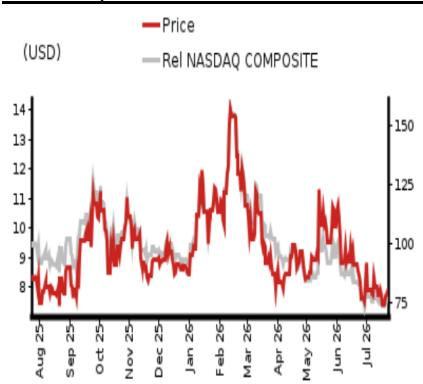

EQUITY: TECHNOLOGY

# 2Q26F 业绩预览

维持正面看法，目标价调整至13美元

## 2Q26F 业绩预览：营收同比增长13%，调整后EBITDA同比增长23%

我们预计公司2Q26F营收同比增长13.2%至27.6亿元人民币（环比增长2.4%），其中零售IDC业务营收同比增长1.2%，批发IDC业务营收同比增长36.4%，非IDC业务营收同比持平。我们估计本季度批发IT电力净增约60兆瓦，环比基本持平，主要受国内芯片产能爬坡节奏影响。我们预计公司2Q26F调整后EBITDA同比增长23.1%至9.02亿元人民币，调整后EBITDA利润率同比扩大2.6个百分点至32.7%（环比下降0.4个百分点），主要得益于批发IDC业务收入贡献增加。

## 长期需求保持稳定，积压订单增长稳健

我们预计2026-28F国内AIDC需求将保持稳健增长，主要受国内主要云服务提供商持续投入以及国内大语言模型厂商快速发展的支撑。我们认为公司凭借在内蒙古地区的区域优势，2026-28F年产能交付量可达400-500兆瓦。考虑到国内大语言模型及AI应用需求旺盛，我们预计公司批发IDC业务在2027-28F的定价将保持稳定或略有上升。

## 维持正面看法，目标价调整至13美元

我们将2026-28F营收预测下调1.2-2.7%，以反映云服务客户近期入驻节奏慢于预期，导致收入确认周期延长。另一方面，我们将2026-28F调整后EBITDA预测上调0.6-1.9%，主要得益于批发IDC业务快速增长及有效的成本控制。我们维持正面看法，目标价调整至13美元，基于DCF估值模型，假设加权平均资本成本为7.0%（不变），终值增长率为2.0%（不变）。目标价对应2027F EV/EBITDA为12.7倍。当前报价对应2027F EV/EBITDA为11倍。

<table><tr><td>截至12月31日</td><td colspan="2">FY25</td><td colspan="2">FY26F</td><td colspan="2">FY27F</td><td colspan="2">FY28F</td></tr><tr><td>货币（人民币）</td><td>实际</td><td>原预测</td><td>新预测</td><td>原预测</td><td>新预测</td><td>原预测</td><td>新预测</td><td></td></tr><tr><td>营收（百万元）</td><td>9,949</td><td>11,697</td><td>11,556</td><td>14,740</td><td>14,385</td><td>18,522</td><td>18,028</td><td></td></tr><tr><td>报告净利润（百万元）</td><td>-257</td><td>595</td><td>-1,994</td><td>874</td><td>433</td><td>1,552</td><td>707</td><td></td></tr><tr><td>标准化净利润（百万元）</td><td>-257</td><td>595</td><td>-1,994</td><td>874</td><td>433</td><td>1,552</td><td>707</td><td></td></tr><tr><td>完全摊薄标准化每股收益</td><td>-96.49c</td><td>2.21</td><td>-7.41</td><td>3.25</td><td>1.61</td><td>5.77</td><td>2.63</td><td></td></tr><tr><td>完全摊薄标准化每股收益增长率（%）</td><td>-237.1</td><td>-</td><td>-</td><td>46.9</td><td>-</td><td>77.7</td><td>63.6</td><td></td></tr><tr><td>完全摊薄标准化市盈率（倍）</td><td>-</td><td>-</td><td>-</td><td>-</td><td>34.7</td><td>-</td><td>21.2</td><td></td></tr><tr><td>EV/EBITDA（倍）</td><td>12.2</td><td>-</td><td>12.3</td><td>-</td><td>11.1</td><td>-</td><td>9.4</td><td></td></tr><tr><td>市净率（倍）</td><td>2.3</td><td>-</td><td>3.4</td><td>-</td><td>3.1</td><td>-</td><td>2.7</td><td></td></tr><tr><td>股息率（%）</td><td>-</td><td>-</td><td>-</td><td>-</td><td>-</td><td>-</td><td>-</td><td></td></tr><tr><td>净资产回报表现（%）</td><td>-4.1</td><td>9.1</td><td>-38.1</td><td>12.0</td><td>9.7</td><td>18.2</td><td>14.0</td><td></td></tr><tr><td>净负债/权益（%）</td><td>232.0</td><td>338.9</td><td>556.1</td><td>379.8</td><td>631.0</td><td>341.2</td><td>624.5</td><td></td></tr></table>

来源：公司数据，NOM预测

评级维持正面

目标价
从14.10美元下调
13.00美元

2026年7月23日收盘价 7.77美元

<table><tr><td>隐含上行空间</td><td>+67.3%</td></tr></table>

<table><tr><td>市值（百万美元）</td><td>2,212.1</td></tr><tr><td>日均交易量（百万美元）</td><td>66.0</td></tr></table>

## 相对表现图

  
来源：LSEG，NOM

## 研究分析师

中国科技行业

Ethan Zhang - NIHK

ethan.zhang@NOM.com

+852 2252 2157

Bing Duan - NIHK
bing.duan1@NOM.com
+852 2252 2141

## 关于VNET Group的关键数据

现金流量表（百万元人民币）

<table><tr><td>表现(%)</td><td>1个月</td><td>3个月</td><td>12个月</td><td></td><td></td></tr><tr><td>相对（美元）</td><td>-7.1</td><td>-12.1</td><td>-11.1</td><td>市值（百万美元）</td><td>2,212.1</td></tr><tr><td>相对（美元）</td><td>-7.1</td><td>-12.1</td><td>-11.1</td><td>自由流通比例（%）</td><td>26.1</td></tr><tr><td>相对纳斯达克综合指数</td><td>-5.3</td><td>-15.0</td><td>-30.7</td><td>3个月日均交易量（百万美元）</td><td>66.0</td></tr></table>

<table><tr><td colspan="6">利润表（百万元人民币）</td></tr><tr><td>截至12月31日</td><td>FY24</td><td>FY25</td><td>FY26F</td><td>FY27F</td><td>FY28F</td></tr><tr><td>营收</td><td>8,259</td><td>9,949</td><td>11,556</td><td>14,385</td><td>18,028</td></tr><tr><td>营业成本</td><td>-6,427</td><td>-7,757</td><td>-8,928</td><td>-11,042</td><td>-13,658</td></tr><tr><td>毛利润</td><td>1,832</td><td>2,192</td><td>2,628</td><td>3,343</td><td>4,370</td></tr><tr><td>销售、一般及管理费用</td><td>-1,163</td><td>-1,412</td><td>-1,459</td><td>-1,682</td><td>-2,090</td></tr><tr><td>员工股份支付费用</td><td></td><td></td><td></td><td></td><td></td></tr><tr><td>营业利润</td><td>669</td><td>780</td><td>1,168</td><td>1,662</td><td>2,281</td></tr><tr><td>EBITDA</td><td>2,276</td><td>2,706</td><td>3,604</td><td>4,598</td><td>5,871</td></tr><tr><td>折旧</td><td>-1,503</td><td>-1,822</td><td>-2,332</td><td>-2,878</td><td>-3,532</td></tr><tr><td>摊销</td><td>-104</td><td>-104</td><td>-104</td><td>-58</td><td>-58</td></tr><tr><td>息税前利润</td><td>669</td><td>780</td><td>1,168</td><td>1,662</td><td>2,281</td></tr><tr><td>净利息费用</td><td>-373</td><td>-561</td><td>-734</td><td>-983</td><td>-1,171</td></tr><tr><td>联营及合营企业</td><td>8</td><td>7</td><td>0</td><td>0</td><td>0</td></tr><tr><td>其他收入</td><td>178</td><td>198</td><td>0</td><td>0</td><td>0</td></tr><tr><td>税前利润</td><td>483</td><td>424</td><td>434</td><td>678</td><td>1,110</td></tr><tr><td>所得税</td><td>-234</td><td>-558</td><td>-565</td><td>-102</td><td>-166</td></tr><tr><td>税后净利润</td><td>248</td><td>-133</td><td>-130</td><td>577</td><td>943</td></tr><tr><td>少数股东权益</td><td>-65</td><td>-123</td><td>-1,863</td><td>-144</td><td>-236</td></tr><tr><td>其他项目</td><td></td><td></td><td></td><td></td><td></td></tr><tr><td>优先股股息</td><td>0</td><td>0</td><td>0</td><td>0</td><td>0</td></tr><tr><td>标准化净利润</td><td>183</td><td>-257</td><td>-1,994</td><td>433</td><td>707</td></tr><tr><td>特殊项目</td><td></td><td></td><td></td><td></td><td></td></tr><tr><td>报告净利润</td><td>183</td><td>-257</td><td>-1,994</td><td>433</td><td>707</td></tr><tr><td>股息</td><td>0</td><td>0</td><td>0</td><td>0</td><td>0</td></tr><tr><td>转入储备</td><td>183</td><td>-257</td><td>-1,994</td><td>433</td><td>707</td></tr><tr><td>估值与比率</td><td></td><td></td><td></td><td></td><td></td></tr><tr><td>报告市盈率（倍）</td><td>79.5</td><td>-</td><td>-</td><td>34.7</td><td>21.2</td></tr><tr><td>标准化市盈率（倍）</td><td>79.5</td><td>-57.9</td><td>-7.5</td><td>34.7</td><td>21.2</td></tr><tr><td>完全摊薄标准化市盈率（倍）</td><td>79.5</td><td>-</td><td>-</td><td>34.7</td><td>21.2</td></tr><tr><td>股息率（%）</td><td>-</td><td>-</td><td>-</td><td>-</td><td>-</td></tr><tr><td>市现率（倍）</td><td>7.3</td><td>7.7</td><td>6.4</td><td>4.8</td><td>3.7</td></tr><tr><td>市净率（倍）</td><td>2.3</td><td>2.3</td><td>3.4</td><td>3.1</td><td>2.7</td></tr><tr><td>EV/EBITDA（倍）</td><td>11.6</td><td>12.2</td><td>12.3</td><td>11.1</td><td>9.4</td></tr><tr><td>EV/EBIT（倍）</td><td>39.1</td><td>42.1</td><td>38.1</td><td>30.6</td><td>24.3</td></tr><tr><td>毛利率（%）</td><td>22.2</td><td>22.0</td><td>22.7</td><td>23.2</td><td>24.2</td></tr><tr><td>EBITDA利润率（%）</td><td>27.6</td><td>27.2</td><td>31.2</td><td>32.0</td><td>32.6</td></tr><tr><td>EBIT利润率（%）</td><td>8.1</td><td>7.8</td><td>10.1</td><td>11.6</td><td>12.7</td></tr><tr><td>净利润率（%）</td><td>2.2</td><td>-2.6</td><td>-17.3</td><td>3.0</td><td>3.9</td></tr><tr><td>有效税率（%）</td><td>48.5</td><td>131.5</td><td>130.0</td><td>15.0</td><td>15.0</td></tr><tr><td>股息支付率（%）</td><td>0.0</td><td>-</td><td>-</td><td>0.0</td><td>0.0</td></tr><tr><td>净资产回报表现（%）</td><td>3.0</td><td>-4.1</td><td>-38.1</td><td>9.7</td><td>14.0</td></tr><tr><td>总资产回报表现（税前%）</td><td>2.3</td><td>2.3</td><td>2.7</td><td>3.2</td><td>3.9</td></tr><tr><td>增长率（%）</td><td></td><td></td><td></td><td></td><td></td></tr><tr><td>营收</td><td>11.4</td><td>20.5</td><td>16.1</td><td>24.5</td><td>25.3</td></tr><tr><td>EBITDA</td><td></td><td>18.9</td><td>33.2</td><td>27.6</td><td>27.7</td></tr><tr><td>标准化每股收益</td><td></td><td>-237.1</td><td>-</td><td>-</td><td>63.6</td></tr><tr><td>标准化完全摊薄每股收益</td><td></td><td>-237.1</td><td>-</td><td>-</td><td>63.6</td></tr></table>

来源：公司数据，NOM预测

<table><tr><td>截至12月31日</td><td>FY24</td><td>FY25</td><td>FY26F</td><td>FY27F</td><td>FY28F</td></tr><tr><td>EBITDA</td><td>2,276</td><td>2,706</td><td>3,604</td><td>4,598</td><td>5,871</td></tr><tr><td>营运资金变动</td><td>3,111</td><td>1,281</td><td>32</td><td>-381</td><td>-505</td></tr><tr><td>其他经营活动现金流</td><td>-3,381</td><td>-2,068</td><td>-1,279</td><td>-1,065</td><td>-1,318</td></tr><tr><td>经营活动现金流</td><td>2,005</td><td>1,919</td><td>2,357</td><td>3,152</td><td>4,049</td></tr><tr><td>资本支出</td><td>-4,924</td><td>-7,657</td><td>-11,350</td><td>-9,000</td><td>-8,100</td></tr><tr><td>自由现金流</td><td>-2,918</td><td>-5,738</td><td>-8,993</td><td>-5,848</td><td>-4,051</td></tr><tr><td>投资减少</td><td></td><td></td><td></td><td></td><td></td></tr><tr><td>净收购</td><td>205</td><td>707</td><td>-187</td><td>-187</td><td>-187</td></tr><tr><td>其他长期资产减少</td><td></td><td></td><td></td><td></td><td></td></tr><tr><td>其他长期负债增加</td><td></td><td></td><td></td><td></td><td></td></tr><tr><td>调整项</td><td>328</td><td>-1,062</td><td>0</td><td>0</td><td>0</td></tr><tr><td>投资活动后现金流</td><td>-2,385</td><td>-6,093</td><td>-9,180</td><td>-6,035</td><td>-4,238</td></tr><tr><td>现金股息</td><td></td><td></td><td></td><td></td><td></td></tr><tr><td>股权发行</td><td>0</td><td>0</td><td>0</td><td>0</td><td>0</td></tr><tr><td>债务发行</td><td>2,751</td><td>4,834</td><td>7,000</td><td>5,000</td><td>5,000</td></tr><tr><td>可转换债券发行</td><td>-4,262</td><td>3,085</td><td>0</td><td>0</td><td>0</td></tr><tr><td>其他</td><td>3,145</td><td>2,206</td><td>0</td><td>0</td><td>0</td></tr><tr><td>融资活动现金流</td><td>1,634</td><td>10,124</td><td>7,000</td><td>5,000</td><td>5,000</td></tr><tr><td>净现金流</td><td>-751</td><td>4,031</td><td>-2,180</td><td>-1,035</td><td>762</td></tr><tr><td>期初现金</td><td>2,244</td><td>1,492</td><td>5,524</td><td>3,343</td><td>2,308</td></tr><tr><td>期末现金</td><td>1,492</td><td>5,524</td><td>3,343</td><td>2,308</td><td>3,070</td></tr><tr><td>期末净债务</td><td>10,182</td><td>14,426</td><td>23,607</td><td>29,642</td><td>33,880</td></tr><tr><td>资产负债表（百万元人民币）</td><td></td><td></td><td></td><td></td><td></td></tr><tr><td>截至12月31日</td><td>FY24</td><td>FY25</td><td>FY26F</td><td>FY27F</td><td>FY28F</td></tr><tr><td>现金及等价物</td><td>1,492</td><td>5,524</td><td>3,343</td><td>2,308</td><td>3,070</td></tr><tr><td>有价证券</td><td>0</td><td>0</td><td>0</td><td>0</td><td>0</td></tr><tr><td>应收账款</td><td>1,656</td><td>2,222</td><td>2,284</td><td>2,863</td><td>3,612</td></tr><tr><td>存货</td><td>0</td><td>0</td><td>0</td><td>0</td><td>0</td></tr><tr><td>其他流动资产</td><td>3,672</td><td>3,706</td><td>3,706</td><td>3,706</td><td>3,706</td></tr><tr><td>流动资产合计</td><td>6,820</td><td>11,452</td><td>9,333</td><td>8,877</td><td>10,388</td></tr><tr><td>长期投资</td><td>0</td><td>0</td><td>0</td><td>0</td><td>0</td></tr><tr><td>固定资产</td><td>17,217</td><td>22,776</td><td>31,794</td><td>37,915</td><td>42,483</td></tr><tr><td>商誉</td><td>0</td><td>0</td><td>0</td><td>0</td><td>0</td></tr><tr><td>其他无形资产</td><td>1,404</td><td>2,005</td><td>2,096</td><td>2,233</td><td>2,370</td></tr><tr><td>其他长期资产</td><td>6,916</td><td>8,362</td><td>8,354</td><td>8,346</td><td>8,338</td></tr><tr><td>资产总计</td><td>32,357</td><td>44,594</td><td>51,577</td><td>57,372</td><td>63,580</td></tr><tr><td>短期债务</td><td>2,009</td><td>3,232</td><td>3,232</td><td>3,232</td><td>3,232</td></tr><tr><td>应付账款</td><td>709</td><td>742</td><td>835</td><td>1,033</td><td>1,278</td></tr><tr><td>其他流动负债</td><td>6,625</td><td>8,474</td><td>8,474</td><td>8,474</td><td>8,474</td></tr><tr><td>流动负债合计</td><td>9,343</td><td>12,447</td><td>12,540</td><td>12,738</td><td>12,983</td></tr><tr><td>长期债务</td><td>7,767</td><td>11,580</td><td>18,580</td><td>23,580</td><td>28,580</td></tr><tr><td>可转换债券</td><td>1,898</td><td>5,139</td><td>5,139</td><td>5,139</td><td>5,139</td></tr><tr><td>其他长期负债</td><td>6,428</td><td>6,864</td><td>6,864</td><td>6,864</td><td>6,864</td></tr><tr><td>负债合计</td><td>25,436</td><td>36,030</td><td>43,123</td><td>48,321</td><td>53,565</td></tr><tr><td>少数股东权益</td><td>555</td><td>2,346</td><td>4,209</td><td>4,353</td><td>4,589</td></tr><tr><td>优先股</td><td>0</td><td>0</td><td>0</td><td>0</td><td>0</td></tr><tr><td>普通股</td><td>17,299</td><td>17,360</td><td>17,380</td><td>17,400</td><td>17,420</td></tr><tr><td>留存收益</td><td>-10,860</td><td>-11,126</td><td>-13,119</td><td>-12,687</td><td>-11,979</td></tr><tr><td>拟派股息</td><td></td><td></td><td></td><td></td><td></td></tr><tr><td>其他权益及储备</td><td>-73</td><td>-16</td><td>-16</td><td>-16</td><td>-16</td></tr><tr><td>股东权益合计</td><td>6,366</td><td>6,218</td><td>4,245</td><td>4,697</td><td>5,425</td></tr><tr><td>负债及权益总计</td><td>32,357</td><td>44,594</td><td>51,577</td><td>57,371</td><td>63,579</td></tr><tr><td>流动性（倍）</td><td></td><td></td><td></td><td></td><td></td></tr><tr><td>流动比率</td><td>0.73</td><td>0.92</td><td>0.74</td><td>0.70</td><td>0.80</td></tr><tr><td>利息覆盖倍数</td><td>1.8</td><td>1.4</td><td>1.6</td><td>1.7</td><td>1.9</td></tr><tr><td>杠杆率</td><td></td><td></td><td></td><td></td><td></td></tr><tr><td>净债务/EBITDA（倍）</td><td>4.47</td><td>5.33</td><td>6.55</td><td>6.45</td><td>5.77</td></tr><tr><td>净债务/权益（%）</td><td>159.9</td><td>232.0</td><td>556.1</td><td>631.0</td><td>624.5</td></tr><tr><td>每股数据</td><td></td><td></td><td></td><td></td><td></td></tr><tr><td>报告每股收益（人民币）</td><td>70.38c</td><td>-96.49c</td><td>-7.41</td><td>1.61</td><td>2.63</td></tr><tr><td>标准化每股收益（人民币）</td><td>70.38c</td><td>-96.49c</td><td>-7.41</td><td>1.61</td><td>2.63</td></tr><tr><td>完全摊薄标准化每股收益（人民币）</td><td>70.38c</td><td>-96.49c</td><td>-7.41</td><td>1.61</td><td>2.63</td></tr><tr><td>每股净资产（人民币）</td><td>24.46</td><td>23.37</td><td>15.78</td><td>17.46</td><td>20.16</td></tr><tr><td>每股股息（人民币）</td><td>0.00</td><td>0.00</td><td>0.00</td><td>0.00</td><td>0.00</td></tr><tr><td>运营效率（天）</td><td></td><td></td><td></td><td></td><td></td></tr><tr><td>应收账款周转天数</td><td>74.5</td><td>71.1</td><td>71.2</td><td>65.3</td><td>65.7</td></tr><tr><td>存货周转天数</td><td>0.0</td><td>0.0</td><td>0.0</td><td>0.0</td><td></td></tr><tr><td>应付账款周转天数</td><td>39.9</td><td>34.1</td><td>32.2</td><td>30.9</td><td>31.0</td></tr><tr><td>现金循环周期</td><td>34.6</td><td>37.0</td><td>38.9</td><td>34.4</td><td>34.8</td></tr></table>

来源：公司数据，NOM预测

## 公司简介

VNET在中国开发并运营互联网数据中心（IDC）。公司为云服务提供商、互联网公司、金融机构及其他大型国内私营企业或跨国公司提供托管、管理托管及咨询服务。

## 估值方法

我们的目标价13.00美元基于DCF估值模型。我们假设加权平均资本成本为7.0%，终值增长率为2.0%。现金流折现至2026年末。目标价对应2027F EV/EBITDA为12.7倍。基准指数为纳斯达克。

可能阻碍目标价实现的风险

下行风险包括：（1）新建数据中心利用率爬坡慢于预期；（2）市场竞争加剧导致月经常性收入下降速度快于预期。

## ESG

VNET一直致力于以行业领先标准建设数据中心，以最大化能源利用效率。公司还计划增加可再生能源在其数据中心电力使用中的比例。

图1：VNET – 2Q26F业绩预览

<table><tr><td rowspan="2" colspan="2">（百万元人民币）</td><td rowspan="2">1Q25实际</td><td rowspan="2">2Q25实际</td><td rowspan="2">3Q25实际</td><td rowspan="2">4Q25实际</td><td rowspan="2">1Q26实际</td><td rowspan="2">2Q26F预测</td><td rowspan="2">3Q26F预测</td><td rowspan="2">4Q26F预测</td><td colspan="2">变动百分比</td></tr><tr><td>同比</td><td>环比</td></tr><tr><td>净营收</td><td></td><td>2,246</td><td>2,434</td><td>2,582</td><td>2,687</td><td>2,691</td><td>2,757</td><td>2,901</td><td>3,207</td><td>13.2%</td><td>2.4%</td></tr><tr><td></td><td>同比</td><td>18.3%</td><td>22.1%</td><td>21.7%</td><td>19.6%</td><td>19.8%</td><td>13.2%</td><td>12.4%</td><td>19.3%</td><td></td><td></td></tr><tr><td>营业成本</td><td></td><td>(1,681)</td><td>(1,886)</td><td>(2,043)</td><td>(2,147)</td><td>(2,075)</td><td>(2,159)</td><td>(2,272)</td><td>(2,422)</td><td>14.4%</td><td>4.0%</td></tr><tr><td>毛利润</td><td></td><td>565</td><td>548</td><td>539</td><td>540</td><td>616</td><td>598</td><td>629</td><td>785</td><td>9.1%</td><td>-2.9%</td></tr><tr><td></td><td>同比</td><td>37.6%</td><td>28.9%</td><td>9.6%</td><td>7.0%</td><td>8.9%</td><td>9.1%</td><td>16.7%</td><td>45.2%</td><td></td><td></td></tr><tr><td>调整后现金毛利润</td><td></td><td>968</td><td>1,062</td><td
