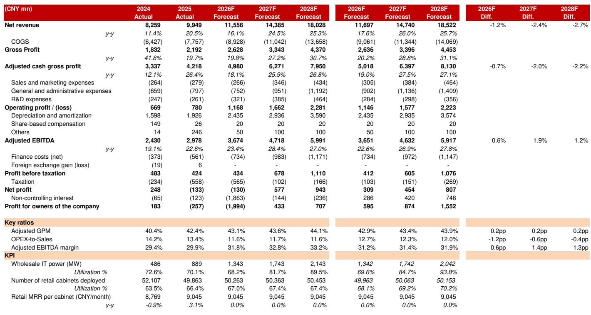
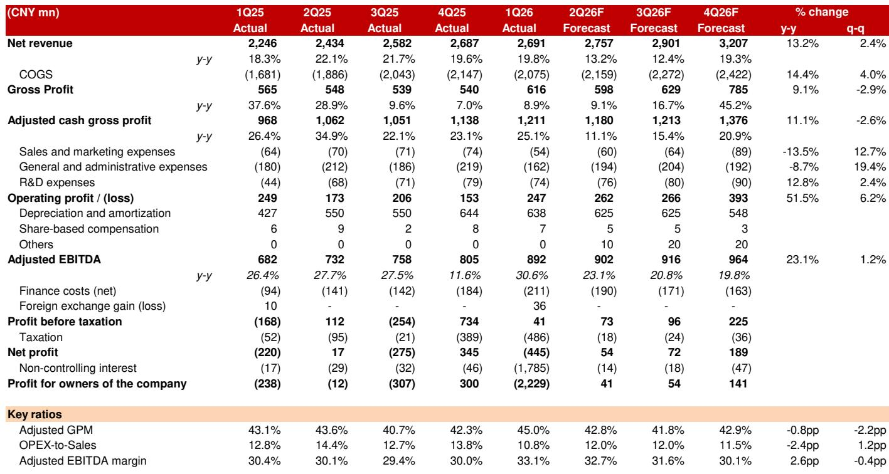
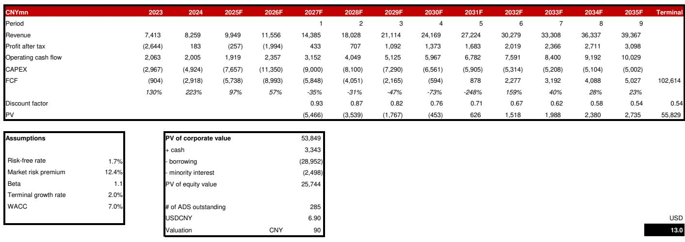

# 中国AI基础设施领域：从规模扩张转向效率优先——市场更关注EBITDA纪律而非单纯产能扩张

世纪互联预计在2026财年第二季度实现营收27.6亿元人民币，同比增长13.2%，调整后EBITDA增长23.1%至9.02亿元人民币。对于一家服务于AI建设需求的中国数据中心运营商而言，这一增长率看似稳健。然而，该公司当前报价为7.77美元，这并非估值异常，而是反映了市场评估中国AI基础设施公司方式的根本性转变：单纯奖励产能扩张的时代正在让位于要求EBITDA转化效率、资本效率和资产负债表可持续性的新阶段。

当前格局中的关键矛盾在于：世纪互联的批发IDC收入同比增长36.4%，公司预计到2028年每年在内蒙古交付400-500兆瓦的产能。来自中国云服务商和国内大语言模型开发商的长期需求依然稳固。但近期收入确认因云客户入驻速度慢于预期而延迟，这受到国内芯片产能爬坡的制约。市场并非质疑需求逻辑，而是在质疑现金流产生的时间节点和建设融资成本。

## 批发IDC收入激增，但结构变化短期压缩毛利率

批发业务是世纪互联增长的主要引擎。批发IDC收入同比增长36.4%，而零售IDC仅增长1.2%，非IDC收入持平。这是一个结构性转变：超大规模云服务商和AI公司更倾向于大型标准化容量区块而非零售托管，世纪互联在内蒙古的布局使其能够满足这一需求。公司本季度新增约60兆瓦已利用批发IT电力，环比基本持平，受限于客户安装和调试国内AI芯片的进度。

收入结构变化带来利润率影响。批发合同通常每兆瓦收入低于零售，但提供更高的可见性、更长的合同期限和更低的销售与营销成本。世纪互联调整后EBITDA利润率同比扩大2.6个百分点至32.7%，得益于批发业务贡献增长和有效的成本控制。环比下降0.4个百分点反映了客户入驻的不规律性以及收入确认前电力与基础设施的前期成本。战略问题不在于利润率是否会扩大，而在于批发规模带来的运营杠杆能多快抵消单位收入下降的稀释效应。

## 积压订单真实存在，但转化时间取决于尚未完全成熟的国内芯片供应链

世纪互联的长期需求前景得到中国云服务商持续AI投入和国内大语言模型企业快速发展的支撑。公司到2028财年在内蒙古每年交付400-500兆瓦产能的目标，意味着多年可见性，这是大多数全球数据中心运营商所羡慕的。批发合同定价预计在2027和2028财年保持稳定或上升，受国内大语言模型和智能体AI应用需求激增推动。

然而，瓶颈并非需求，而是国内芯片供应链。云客户入驻速度慢于预期，与国内AI芯片生产的爬坡直接相关。中国云服务商优先采用国产加速器，这些芯片的可用性决定了它们能多快填充和激活新的数据中心容量。这造成了时间错配：世纪互联建造外壳、安装电力基础设施并承担折旧和运营成本，但收入确认仅在客户接管并部署设备后才开始。风险在于资本支出持续领先于现金流产生，从而拉伸资产负债表。

财务报表使这一矛盾清晰可见。2026财年资本支出预计为113.5亿元人民币，高于2025财年的76.6亿元。全年自由现金流预计为负89.9亿元。净债务预计从2025财年末的144亿元增至2026财年的236亿元，推动净债务权益比达到556%。公司通过债务发行为其建设融资，仅2026财年预计新增债务70亿元。

## 估值模型从收入倍数转向EBITDA倍数，当前报价仍具压缩空间

加权平均资本成本为7.0%，终值增长率为2.0%。这意味着2027财年EV/EBITDA为12.7倍。当前报价为同一指标的11倍。折价并不显著，但对于一家未来两年EBITDA预计增长27-28%的公司而言，这一差异具有意义。

估值的趣味在于其不对称性。分析师已将2026至2028财年的收入预测下调1.2%至2.7%，反映了较慢的入驻速度。然而，同期调整后EBITDA预测上调了0.6%至1.9%，得益于批发结构变化和成本控制。这意味着即使营收增长略低于先前预期，利润率扩张也能抵消对现金流的影响。当前报价似乎反映了市场对下行情景（收入转化放缓、持续负自由现金流）的高概率定价，而未充分计入上行情景（芯片供应正常化、入驻加速、运营杠杆发挥作用）。

## 评估中国AI基础设施投资的决策框架

对于评估世纪互联或可比中国数据中心运营商的观察者，以下框架有助于区分在当前环境中能够蓬勃发展的公司与可能面临挑战的公司。

首先，评估批发与零售收入结构的平衡。批发份额较高的公司将显示更快的营收增长，但短期内可能经历毛利率压缩。关键指标不是毛利率水平，而是调整后EBITDA利润率的轨迹。能够在批发收入增长的同时扩大EBITDA利润率的公司，正在展示真正的运营杠杆。世纪互联同比2.6个百分点的利润率扩张支持了这一论点。

其次，评估资本支出到收入的转化周期。数据中心运营商必须在盈利前大量投入。关键问题是一单位资本支出需要多长时间才能产生一单位收入。在世纪互联的案例中，约束是外部的：客户入驻速度取决于芯片可用性。观察者应监测季度已利用容量增量作为领先指标。如果已利用增量加速，转化周期缩短，自由现金流将更早转正。

第三，审视杠杆结构和再融资风险。世纪互联的净债务与EBITDA比率在2026财年预计为6.55倍，2027财年升至6.45倍，随后在2028财年降至5.77倍。利息覆盖倍数在2026财年仅为1.6倍。公司未产生自由现金流，且通过债务为资本支出融资。这对基础设施建设而言并不罕见，但客户入驻持续延迟或利率上升可能给资产负债表带来压力。支持性股权基础和国内信贷市场准入在一定程度上缓解了这一风险，但并未消除它。

第四，区分需求可见性与需求实现。中国云服务商和大语言模型公司正在积极投入AI基础设施。这是一个可见的需求信号。但这一需求实际转化为数据中心运营商收入的程度，取决于芯片供应、监管审批和企业AI采用速度。市场目前正在对可见性与实现之间差距最大的公司进行折价。

## 市场谨慎合理，但风险回报对耐心观察者正变得有利

短期逆风是真实的。较慢的入驻速度确实存在，负自由现金流轨迹对短期视野的观察者而言令人担忧。过去12个月报价下跌11%，相对纳斯达克综合指数表现落后30.7%，表明许多担忧已被定价。

当前报价未反映的是未来两年利润率扩张的复合效应。调整后EBITDA预计从2026财年的36亿元增长至2028财年的59亿元，复合年增长率约为28%。如果公司能够实现这一轨迹，同时将净债务与EBITDA比率控制在6倍以下，当前2027财年EV/EBITDA的11倍倍数在事后看来将显得便宜。

世纪互联的研究案例依赖于一系列特定事件：国内芯片供应在未来两到三个季度内正常化，客户入驻加速，收入确认赶上已建容量，自由现金流改善。这一序列是合理的，但并非必然。当前报价为愿意接受短期资产负债表压力以换取合理倍数下中国AI基础设施建设的观察者提供了安全边际。对于需要即时现金流产生和低杠杆的观察者而言，风险尚不值得回报。

*仅供参考。部分内容可能基于源材料通过AI辅助生成、翻译、总结或编辑，可能存在遗漏或错误。请独立核实。本文不构成专业建议。*

仅供参考。部分内容可能基于源材料通过AI辅助生成、翻译、总结或编辑，可能存在遗漏或错误。请独立核实。本文不构成专业建议。

