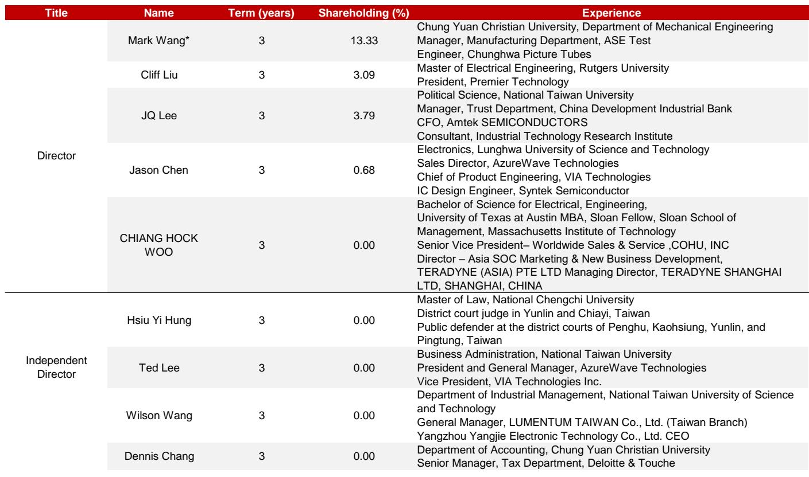
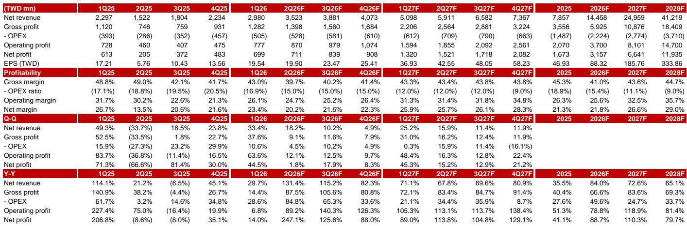
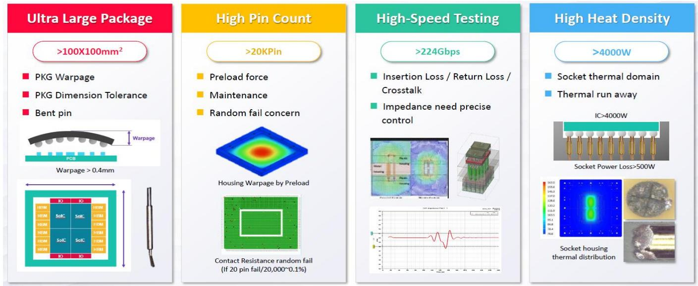

# WinWay Technology: 测试接口供应商，AI相关收入有望持续增长

半导体测试接口市场正在经历结构性转变，这一变化尚未被多数市场参与者充分反映在相关公司的报价中。WinWay Technology，一家总部位于台湾的探针卡和测试插座供应商，正处于三重驱动力的交汇点：AI加速器的普及使得每颗芯片需要更多测试插次，技术升级推动引脚数增加和封装尺寸扩大从而提升单位产品价值，以及全新测试协议的出现，例如共封装光学器件的功能老化测试和系统级测试。一家全球性研究机构开始对WinWay进行覆盖，并设定了新台币6,500元的目标价位。该机构预计，其营收将从2025财年的新台币79亿元增长至2028财年的新台币412亿元，年复合增长率为74%。同期，正常化每股收益预计将从新台币46.93元升至新台币333.86元，增长约七倍。这并非周期性的复苏故事，而是一个基于AI芯片架构物理需求的结构性增长逻辑。

该覆盖报告的发布时机值得关注，因为该公司报价自2026年7月以来已回调27%，相对台湾加权指数落后25个百分点。市场对数据中心建设暂缓的宏观担忧以及6月季度公司层面的毛利率波动，共同创造了一个估值观察点。该机构估计，2026财年第二季度毛利率为39.7%，受MEMS探针卡和消费电子营收占比提升的挤压。该机构认为这是暂时现象，预计随着营收结构重新转向高价值的AI和网络产品，毛利率将在2026财年下半年回升。按当前报价计算，该股对应2026财年预期收益的市盈率为73.6倍，但到2027财年降至35倍，2028财年进一步降至19.5倍。对于愿意审视短期波动的观察者而言，其风险回报特征具有不对称性。

## WinWay的营收增长源于AI芯片复杂度，而非半导体周期性需求

对于测试接口供应商的传统认知是，其业绩随全球半导体出货量波动。WinWay打破了这一模式。其增长动力来自每颗芯片的测试插次以及每次插次的技术难度，这两者均独立于芯片出货量而上升。该机构指出，最新的AI和高性能计算芯片需要额外的测试步骤，如老化测试和系统级测试，而领先的芯片设计公司正在考虑功能老化测试等新流程。每一次额外的测试插次都为WinWay的探针卡和插座产品带来新的收入来源。该机构预测，在2026至2028财年，探针卡和同轴插座（两者在2026财年第一季度合计占总营收的70%）的营收年复合增长率将分别达到67%和86%。这些并非历史增长率的简单外推，而是基于领先GPU厂商已知的产品放量、在这些插座中的主导份额以及系统级测试中的份额增长所做的自下而上估算。该机构还指出，该公司也参与了共封装光学器件的测试插次，特别是插入点3和插入点4，这代表着一个新兴但具有结构性重要市场的早期机会。其中许多发展尚处于初期阶段，但其方向由难以逆转的结构性力量所锚定。

## 插座业务是高壁垒的特许经营权，而非大宗商品组件业务

测试插座常常被关注更显眼的探针卡市场的观察者所忽视，但WinWay的插座业务拥有更高的利润率和更深的客户根基。该机构表示，WinWay在领先GPU厂商的插座产品中享有主导份额，而即将到来的TPU项目有望进一步推动增长。此处的“主导份额”意味着插座设计已通过客户测试流程的认证，不易被替换。该插座必须处理更高的引脚数、更大的封装尺寸、更高的速度和频率以及更高的热密度。这些技术要求中的每一项都提升了每个插座的产品价值含量。该机构还强调了WinWay创新的HyperSocket解决方案，预计到2028财年，该产品将贡献约5%的总营收。HyperSocket代表了插座性能的阶跃式提升，并将进一步扩大其相对于竞争对手的护城河。该机构的营收模型暗示，仅基于同轴插座86%的年复合增长率，插座业务的相对营收将从2025财年的约新台币28亿元增长至2028财年的超过新台币180亿元。如此规模的增长不仅需要保持市场份额，还需要在新客户项目和新测试协议中实现有意义的扩张。

## 毛利率压缩是暂时的产品组合效应，而非结构性恶化

近期市场参与者焦虑的最大单一来源是毛利率走势。该机构估计，2026财年第二季度毛利率将为39.7%，低于2025财年全年的45.3%。这一下降由两个因素驱动：来自MEMS探针卡的营收贡献增加（其利润率低于公司核心的同轴插座产品），以及向消费电子产品的产品组合不利倾斜。该机构将此定性为暂时现象，并预计毛利率将在2026财年下半年回升。利润率扩张的结构性理由在于产品组合向高价值AI和网络产品转移，这些产品定价更高且生产周期更长。该机构的模型显示，毛利率将在2027财年恢复至43.6%，2028财年恢复至44.7%，仍低于2025财年的峰值，但营收基数已是当时的五倍以上。更重要的利润率指标是营业利润率，该机构预测，随着营收增长超过固定成本吸收，该指标将从2025财年的26.3%扩大至2028财年的35.7%。该业务的经营杠杆显著，因为支持增长所需的增量资本支出相对于其带来的营收而言较为温和。该机构预计，2026财年资本支出为新台币13亿元，2027财年升至新台币34亿元，但自由现金流在2028财年将强劲转正，达到新台币85亿元。

## 评估WinWay研究案例的决策框架

对于考虑关注WinWay的观察者而言，相关的框架并非AI芯片需求在某个季度会增长还是放缓，而是每颗芯片测试接口内容的结构性驱动因素是否完好，以及WinWay的竞争地位是在加强还是削弱。以下三点框架概括了关键变量。

首先，关注每颗前沿芯片的测试插次数量。该机构指出，AI芯片正在增加前几代产品中不存在的老化测试和系统级测试插次。如果领先的芯片设计公司继续增加测试步骤以提高良率和可靠性，那么无论芯片出货量如何，WinWay产品的总可寻址市场都将扩大。风险在于芯片设计公司通过可测试性设计技术找到减少测试步骤的方法，但该机构的证据表明相反的趋势正在发生。

其次，追踪WinWay在每个客户插座和探针卡采购中的份额。该机构表示，WinWay在领先GPU厂商中拥有主导份额。如果竞争对手推出技术更优的产品，或者客户决定采用双源采购，主导份额可能会被侵蚀。该机构认为HyperSocket到2028财年将贡献5%营收的信心，暗示WinWay并未固守现有地位，而是在积极扩展其技术领先优势。

第三，评估共封装光学器件采用的步伐。该机构指出，WinWay参与了CPO测试插次，特别是插入点3和插入点4。如果CPO从早期采用走向主流部署，它将创造一个新的测试协议，需要专门的插座和探针卡。WinWay的早期参与使其能够在这一市场中占据不成比例的份额。该机构未量化CPO的机会，但其被纳入研究论点表明这是一个重要的上行情景。

## 随着盈利拐点出现，估值快速压缩，但风险在于营收轨迹的执行

2028财年正常化每股收益。该倍数处于WinWay历史交易区间的中段。按当前新台币6,500元的价格计算，该股对应2027财年收益的35倍市盈率和2028财年收益的19.5倍市盈率。隐含的远期市盈率压缩幅度较大，但这与该机构的营收增长轨迹一致。该报价反映了市场对营收在2028财年达到新台币412亿元的高度信心。主要风险并非市盈率进一步收缩，而是营收轨迹未能实现。该机构指出了三个具体的下行风险：AI/HPC市场需求减弱或AI普及放缓，测试接口市场竞争激烈导致份额流失，以及盈利能力不及预期。第一个风险是宏观层面的，无法通过公司特定分析来对冲。第二和第三个风险是公司层面的，可以通过季度业绩和客户认证公告来监测。

该机构的覆盖报告并未披露其营收构建的每一个细节，但三年内74%的隐含营收年复合增长率要求WinWay在多个方面同时执行：提升探针卡产量，赢得GPU和TPU客户的新插座项目，将HyperSocket商业化，并在CPO测试中建立地位。估值中的安全边际在于，即使营收比该机构估计低20%，正常化每股收益仍将约为新台币267元，该股将以此数值的24倍交易，低于历史周期中值倍数。如果营收轨迹得以实现或超越，下行风险相对于上行空间是不对称的。

*仅供参考。部分内容可能基于源材料通过AI辅助生成、翻译、总结或编辑，可能存在遗漏或错误。请独立核实。本文不构成专业建议。*

仅供参考。部分内容可能基于源材料通过AI辅助生成、翻译、总结或编辑，可能存在遗漏或错误。请独立核实。本文不构成专业建议。

