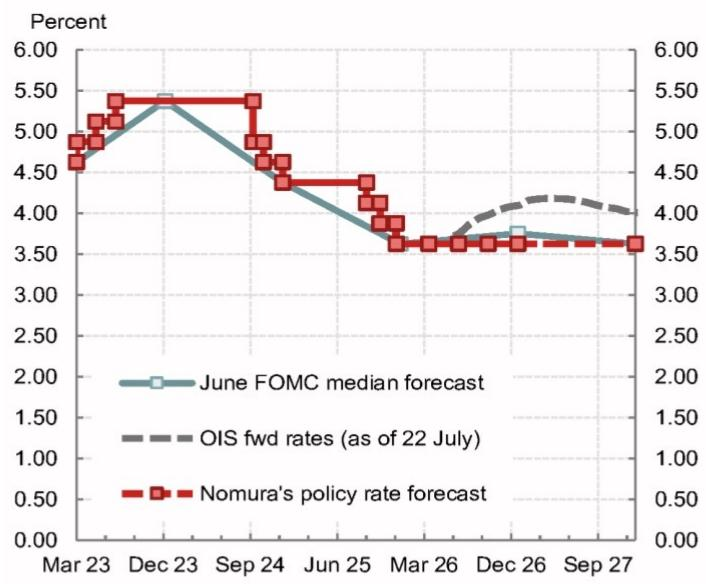
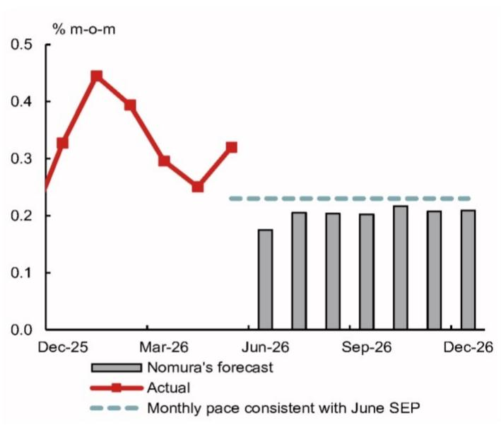
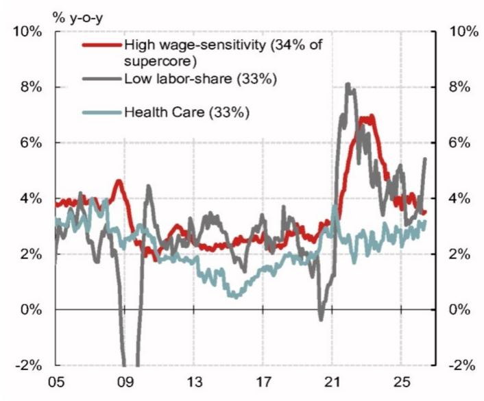
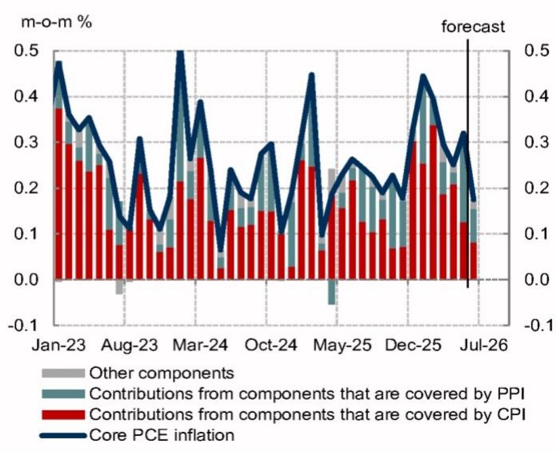
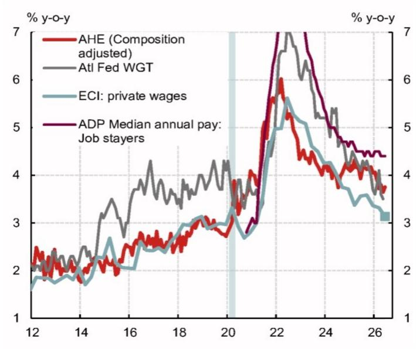
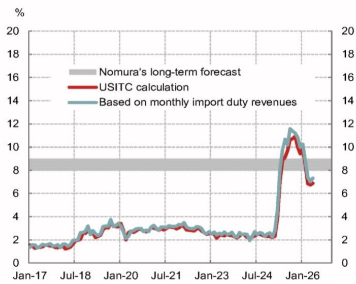
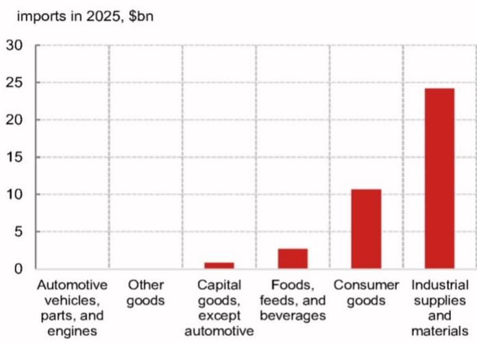

# 北美宏观环境观察

## 关于利率政策的讨论

- 市场普遍预期联邦公开市场委员会在7月会议上将维持当前利率水平不变，但可能有两位鹰派委员持不同意见，倾向于上调利率。
- 预计主席沃什将强调控制通胀的可信度，但不会明确给出利率调整的具体触发条件。他可能还会重申一些偏鸽派的观点。
- 下周即将公布的数据可能进一步支持维持利率不变的判断。预计6月核心个人消费支出价格指数环比增速将明显放缓，这与美联储2%的目标方向一致。第二季度就业成本指数可能有所回落，显示工资压力正在缓解。

## 研究团队

北美宏观环境研究  
Aichi Amemiya - NSI  
aichi.amemiya@NOM.com  
+1 212 667 9347

Jeremy Schwartz - NSI
jeremy.schwartz@NOM.com
+1 212 667 9637

Ruchir Sharma - NSI  
ruchir.sharma@NOM.com  
+1 212 667 9186

- 本周政府宣布了新的关税措施。总体来看，由于豁免范围有所扩大，新政策的影响相对温和。

图1：预计7月会议将维持利率不变，但可能有两位鹰派委员持不同意见  
  
来源：FRB, Bloomberg, NOM

图2：预计美联储将长期维持当前利率水平  
NOM对货币政策的展望

<table><tr><td>工具</td><td>关键假设</td></tr><tr><td colspan="2">政策利率</td></tr><tr><td>2026年</td><td>不降息，年末利率3.625%</td></tr><tr><td>2027年</td><td>不降息，年末利率3.625%</td></tr><tr><td>终端利率</td><td>3.50 - 3.75%</td></tr><tr><td colspan="2">资产负债表政策</td></tr><tr><td>规模</td><td>储备管理购买每月100亿美元。纽约联储根据季节性流动性需求和市场状况积极管理储备购买。预计中期内资产负债表月均增长约200亿美元。</td></tr><tr><td>构成</td><td>MBS将继续缩减，所得资金再投资于国债。再投资和储备管理购买都将偏向短期国债。</td></tr></table>

来源：FRB, NOM

## 预计美联储将维持利率不变

预计7月会议将维持政策利率在3.625%不变（图1和图2），会后声明不会有实质性变化。

市场对7月加息的预期近期有所上升，但这更多反映了前瞻指引有限以及对美联储反应机制的不确定性，而非宏观环境前景发生了实质性改变。

近期数据也支持维持利率不变。6月CPI和PPI数据低于预期，表明核心PCE通胀将明显放缓。虽然部分临时因素可能放大了6月的放缓幅度，但整体趋势仍然积极，通胀动能正在减弱（图3）。多数与工资相关的分项近期也有所回落（图4）。季节性残留因素、统计方法修订以及工资压力的缓解，应有助于核心PCE通胀进一步放缓。

多数美联储官员似乎也倾向于“观望”策略，他们预计通胀将逐步回落。在6月CPI报告公布前，理事沃勒曾对通胀风险表示谨慎，并提到政策决策应基于最新的通胀数据。我们认为6月CPI和PPI报告可能使他倾向于在7月会议上维持利率不变。

图3：预计核心PCE通胀月度增速将低于美联储SEP预测的2026年核心PCE通胀路径  
  
来源：BLS, BEA, Haver, NOM

图4：近期与工资相关的服务业通胀呈下降趋势  
  
来源：BLS, BEA, Haver, NOM

## 关于主动加息的讨论

市场对7月会议加息的概率定价约为三分之一。但我们仍对主动加息的理由持怀疑态度。意外加息可能增加美联储反应机制的不确定性，并强化市场对更鹰派政策路径的预期，而非被视为替代未来的加息。

近期市场波动似乎也削弱了意外收紧政策的理由。

此外，长期通胀预期仍然稳定，5-10年盈亏平衡通胀率约为2.2-2.3%（理事沃勒在4月曾指出这一水平是令人放心的信号）。这表明市场并未质疑美联储控制通胀的可信度。

## 预计将有两位鹰派委员持不同意见

预计克利夫兰联储主席哈马克和达拉斯联储主席洛根将持不同意见，倾向于加息。两人均认为，通胀高企、增长稳健以及金融条件宽松，表明当前政策并不具有限制性。他们还强调了通胀上行风险，同时指出劳动力市场稳定，表明美联储的双重使命之间不存在冲突。

明尼阿波利斯联储主席卡什卡利也可能持不同意见，但这并非我们的基准情景。截至6月FOMC会议，卡什卡利预计今年晚些时候会有一次加息，这表明他的政策立场并不像其他超级鹰派那样强硬。

## 通胀数据可能支持耐心观望

预计下周的通胀数据将显示价格压力正在缓解，从而支持耐心观望的立场。

预计6月核心PCE通胀环比增速将明显放缓至0.175%，年化增速接近2%（图5）。同比来看，核心PCE可能从3.4%降至3.3%。低于预期的CPI和PPI数据表明核心服务通胀正在放缓，而核心商品通胀可能小幅回升。

展望未来，关税传导效应的减弱和季节性残留因素应使核心PCE保持逐步下行的趋势。预计在当前统计方法下，到年底核心PCE同比增速将放缓至3.2%（在计划的方法修订后约为3.0%）。月度核心PCE增速在0.2%左右将意味着在实现美联储通胀目标方面取得进一步进展，并降低近期加息的可能性。

预计美联储偏好的工资增长指标——就业成本指数（ECI）第二季度环比增速将从0.9%放缓至0.7%。私营部门工资可能保持稳定，而州和地方政府工资增速放缓。福利部分在第一季度强劲增长后也有所回落。我们对ECI的预测表明工资压力正在缓解（图6），与其他工资指标一致，表明劳动密集型服务业的通胀可能会继续放缓。

图5：6月核心PCE通胀环比增速可能明显放缓至0.175%

按数据来源分解月度核心PCE通胀  
  
来源：BLS, BEA, Haver, NOM

图6：预计第二季度ECI增速放缓，表明工资压力缓解  
  
注：Q2 ECI为NOM预测值  
来源：Atlanta Fed, ADP, BLS, NBER, Haver, NOM

## 新关税政策体现延续性

政府宣布了根据301条款的新关税，以取代即将到期的122条款下的10%普遍关税。从122条款向301条款关税的过渡，将使平均有效关税率提高约1个百分点至8%，这与我们的预期基本一致（图7）。

然而，公告中也包含了一些缓解措施。对部分主要贸易伙伴进口商品的额外影响将被最惠国待遇关税所抵消。此外，一般豁免产品清单有所扩大，包括一些消费品/食品（图8）。这些调整表明政府并未打算大幅升级关税政策。

我们仍然认为，对可负担性问题和通胀上升的关注，将可能阻止美国关税政策在未来大幅升级。我们维持对终端平均有效关税率为8-9%的预期。

需要关注的主要风险包括正在进行的USMCA谈判以及另一项关于产能过剩的301条款调查。

图7：新的301条款关税可能使有效关税率提高1个百分点至8%，符合我们的长期预期  
平均有效关税率与NOM的长期预测  
  
来源：US Treasury, USITC, Haver, NOM

图8：一般关税豁免清单进一步扩大  
一般关税豁免清单的新增项目（相对于122条款关税）  
  
来源：The White House, USITC, Haver, NOM

## 第二季度实际GDP增速可能加快

预计第二季度实际GDP环比年化增速将从第一季度的2.1%加快至2.5%。面向国内私人购买者的实际最终销售额可能从2.2%升至3.4%，主要受个人消费增长反弹和设备投资强劲的推动。虽然2026年初AI相关的资本支出引领了企业投资，但近期数据显示投资动能正在扩大。预计第二季度住宅投资将自2024年第四季度以来首次实现增长，而非住宅建筑投资仍然低迷。政府支出、净出口和库存等波动性较大的分项弱于第一季度，可能对整体GDP增长构成拖累。

## 数据预览

## 下周展望

预计7月FOMC会议将维持利率不变，但可能有两位鹰派委员持不同意见，倾向于加息。

耐用品订单（周一）：预计6月耐用品订单环比增长3.4%，5月为下降4.5%。非国防飞机订单可能上升，因为波音净订单从5月的11架增至6月的113架。汽车及零部件订单在产量回升的支撑下可能保持强劲。

剔除波动较大的运输设备后，预计6月耐用品订单环比增速从5月的1.4%放缓至0.8%。各制造业调查的新订单指数整体略有下降，6月耐用品制造业的工业生产也出现下滑。预计核心资本品出货量（非国防资本品扣除飞机）6月环比增长1.1%，该数据是GDP中设备投资的输入项。

商品贸易初值（周二）：预计6月商品贸易逆差从5月的1059亿美元小幅收窄至1045亿美元。主要贸易伙伴的数据显示，在AI相关商品持续强劲的推动下，进口仍保持强劲。商品出口也可能强劲增长。

消费者信心（周二）：预计7月世界大型企业联合会消费者信心指数从6月的91.2小幅降至90.5。中东冲突再起、能源价格上涨以及市场波动可能影响了消费者情绪。劳动力市场差异指标（报告“工作充足”与“工作难找”的家庭比例之差）在前两个月大幅下降后可能保持稳定。

FOMC会议（周三）：预计7月FOMC会议将波澜不惊，政策维持不变，主席沃什的新闻发布会也不会提供有意义的未来指引。本次会议不会更新SEP或点阵图。

沃什在新闻发布会上的措辞可能继续聚焦于控制通胀的可信度。但我们预计他不会明确给出加息的门槛，或美联储在通胀持续高企时应采取何种行动。预计沃什将重申一些偏鸽派的观点，包括他相信AI对通胀的下行影响、对官方通胀数据质量的怀疑，以及可能提及货币增长在通胀前景中的作用。

预计将有两位鹰派委员持不同意见，倾向于加息，分别是达拉斯联储主席洛根和克利夫兰联储主席哈马克。明尼阿波利斯联储主席卡什卡利可能成为第三位持不同意见者，这是一个风险。

中间派和鸽派官员在7月静默期前曾暗示未来可能加息，但多数人表示，通胀的逐步下降将支持维持利率不变。鉴于6月通胀数据放缓，这表明绝大多数投票委员倾向于“观望”策略。

尽管市场对下周加息有一定概率的定价，但沃什固有的鸽派倾向以及过度收紧金融条件的潜在风险，可能使他不会主张加息。

失业金申领（周四）：本周失业金申领人数下降，继续凸显劳动力市场的韧性。请注意，定于下周公布的持续申领数据对应的是7月非农调查参考周。

PCE平减指数（周四）：基于6月CPI和PPI数据，预计6月核心PCE环比增速将明显放缓至0.175%，年化增速约为2%。同比来看，核心PCE通胀可能从5月的3.4%降至6月的3.3%。

核心CPI通胀低于预期，6月环比下降0.017%，远低于5月的+0.208%，这是自2020年5月以来首次月度下降。CPI和PPI数据的细节表明，核心服务PCE通胀放缓，而核心商品PCE通胀小幅回升。

展望未来，预计关税效应的减弱和季节性残留因素将使核心PCE通胀保持逐步下行的趋势。我们仍然预计，在当前统计方法下，到年底核心PCE同比增速将放缓至3.2%（计划的方法修订可能使其进一步降至约3.0%）。月度核心PCE增速在0.2%左右将意味着在实现美联储通胀目标方面取得进一步进展，并应降低近期加息的可能性。

个人收入与支出（周四）：预计6月个人收入环比增速从5月的0.7%放缓至0.3%。雇员薪酬保持强劲，私营部门工资收入当月有所增长；但这被其他分项所抵消，因为美国农业部灾害救济金的一次性农场主收入增长在当月消退。

预计6月个人支出环比增速从5月的0.7%放缓至0.3%。零售销售当月放缓，因能源相关支出减少。服务支出增长也可能放缓。根据我们对PCE通胀的估计，预计实际支出环比增长0.4%。

第二季度GDP初值（周四）：预计第二季度实际GDP环比年化增速从第一季度的2.1%加快至2.5%。预计面向国内私人购买者的实际最终销售额环比年化增速从之前的2.2%大幅加快至3.4%，主要受个人消费增长反弹和设备投资强劲增长的推动。住宅投资可能在第二季度实现自2024年第四季度以来的首次增长。政府支出、净出口和库存投资等波动性较大的分项弱于第一季度，对实际GDP增长构成拖累。

就业成本指数（周五）：预计美联储偏好的工资指标——就业成本指数（ECI）第二季度环比增速从第一季度的0.9%放缓至0.7%（0.74%）。私营部门雇员的工资增速可能略有上升，但四舍五入后仍保持在0.7%的水平，而州和地方政府雇员的工资增速可能放缓。在私营部门，预计商品生产行业的工资增速在建筑业的带动下有所回升，而服务业的工资增速放缓。福利部分（通常在第一季度增长）的环比增速可能从第一季度的1.2%降至0.8%。总体而言，我们的ECI预测表明工资增长正在逐步放缓，与其他指标一致。

密歇根大学消费者信心（周五）：密歇根大学消费者信心的终值可能从初值的54.4小幅降至54.0。在调查访谈期间，美国与伊朗之间的紧张局势升级，能源价格上涨。此外，Morning Consult和旧金山联储每日新闻情绪指数的高频数据也指向情绪恶化。

图9：7月27日当周经济指标预测

<table><tr><td colspan="2">7月27日 周一</td><td>单位</td><td>时期</td><td>前值2</td><td>前值1</td><td>最新</td><td>NOM</td><td>共识</td></tr><tr><td>8:30</td><td>耐用品订单</td><td>% 环比</td><td>6月-初值</td><td>1.3</td><td>8.5</td><td>-4.5</td><td>3.4</td><td>1.5</td></tr><tr><td>8:30</td><td>耐用品订单（除运输）</td><td>% 环比</td><td>6月-初值</td><td>1.1</td><td>1.5</td><td>1.4</td><td>0.8</td><td>0.9</td></tr><tr><td>13:00</td><td>2年期国债拍卖</td><td>十亿美元</td><td></td><td></td><td></td><td></td><td>69</td><td></td></tr><tr><td>13:00</td><td>5年期国债拍卖</td><td>十亿美元</td><td></td><td></td><td></td><td></td><td>70</td><td></td></tr><tr><td colspan="9">7月28日 周二</td></tr><tr><td>8:30</td><td>商品贸易初值</td><td>十亿美元</td><td>6月</td><td>-85.1</td><td>-82.2</td><td>-105.9</td><td>-104.5</td><td>-97.8</td></tr><tr><td>8:30</td><td>批发库存</td><td>% 环比</td><td>6月-初值</td><td>1.5</td><td>0.7</td><td>0.1</td><td>n.a.</td><td>n.a.</td></tr><tr><td>9:00</td><td>Case-Shiller 20城指数</td><td>% 同比</td><td>5月</td><td>1.0</td><td>0.9</td><td>1.1</td><td>n.a.</td><td>n.a.</td></tr><tr><td>9:00</td><td>Case-Shiller 20城指数</td><td>% 环比</td><td>5月</td><td>-0.1</td><td>-0.2</td><td>0.0</td><td>n.a.</td><td>n.a.</td></tr><tr><td>10:00</td><td>消费者信心</td><td>指数</td><td>7月</td><td>93.8</td><td>90.6</td><td>91.2</td><td>90.5</td><td>92.0</td></tr><tr><td>13:00</td><td>7年期国债拍卖</td><td>十亿美元</td><td></td><td></td><td></td><td></td><td>44</td><td></td></tr><tr><td colspan="9">7月29日 周三</td></tr><tr><td>7:00</td><td>抵押贷款申请</td><td>% 周环比</td><td>5月22日</td><td>-4.4</td><td>1.7</td><td>-2.3</td><td>n.a.</td><td>n.a.</td></tr><tr><td>13:00</td><td>2年期FRN拍卖</td><td>十亿美元</td><td></td><td></td><td></td><td></td><td>30</td><td></td></tr><tr><td>14:00</td><td>FOMC会议</td><td></td><td>7月</td><td></td><td></td><td></td><td></td><td></td></tr><tr><td>14:00</td><td>FOMC利率决议（上限）</td><td>%</td><td>7月</td><td>3.75</td><td>3.75</td><td>3.75</td><td>3.75</td><td>3.75</td></tr><tr><td>14:00</td><td>FOMC利率决议（下限）</td><td>%</td><td>7月</td><td>3.50</td><td>3.50</td><td>3.50</td><td>3.50</td><td>3.50</td></tr><tr><td>14:00</td><td>FOMC准备金利率（IOR）</td><td>%</td><td>7月</td><td>3.65</td><td>3.65</td><td>3.65</td><td>3.65</td><td>3.65</td></tr><tr><td colspan="9">7月30日 周四</td></tr><tr><td>8:30</td><td>首次失业金申领</td><td>千人</td><td>7月25日</td><td>217</td><td>209</td><td>187</td><td>n.a.</td><td>n.a.</td></tr><tr><td>8:30</td><td>持续失业金申领</td><td>千人</td><td>7月18日</td><td>1821</td><td>1798</td><td>1796</td><td>n.a.</td><td>n.a.</td></tr><tr><td>8:30</td><td>个人收入</td><td>% 环比</td><td>6月</td><td>0.5</td><td>0.0</td><td>0.7</td><td>0.3</td><td>0.3</td></tr><tr><td>8:30</td><td>个人支出</td><td>% 环比</td><td>6月</td><td>0.9</td><td>0.4</td><td>0.7</td><td>0.3</td><td>0.4</td></tr><tr><td>8:30</td><td>PCE平减指数</td><td>% 环比</td><td>6月</td><td>0.7</td><td>0.4</td><td>0.4</td><td>-0.072</td><td>-0.1</td></tr><tr><td>8:30</td><td>PCE平减指数</td><td>% 同比</td><td>6月</td><td>3.5</td><td>3.8</td><td>4.1</td><td>3.700</td><td>3.6</td></tr><tr><td>8:30</td><td>核心PCE平减指数</td><td>% 环比</td><td>6月</td><td>0.3</td><td>0.3</td><td>0.3</td><td>0.175</td><td>0.1</td></tr><tr><td>8:30</td><td>核心PCE平减指数</td><td>% 同比</td><td>6月</td><td>3.3</td><td>3.3</td><td>3.4</td><td>3.321</td><td>3.3</td></tr><tr><td>8:30</td><td>GDP</td><td>% 环比年化</td><td>Q2-初值</td><td>4.4</td><td>0.5</td><td>2.1</td><td>2.5</td><td>2.3</td></tr><tr><td>8:30</td><td>核心PCE平减指数</td><td>% 环比年化</td><td>Q2-初值</td><td>2.9</td><td>2.7</td><td>4.4</td><td>3.5</td><td>n.a.</td></tr><tr><td colspan="9">7月31日 周五</td></tr><tr><td>8:30</td><td>就业成本指数</td><td>% 环比</td><td>Q2</td><td>0.8</td><td>0.7</td><td>0.9</td><td>0.7</td><td>0.8</td></tr><tr><td>10:00</td><td>密歇根大学消费者信心</td><td>指数</td><td>7月-终值</td><td>44.8</td><td>49.5</td><td>54.4</td><td>54.0</td><td>n.a.</td></tr><tr><td>10:00</td><td>密歇根大学5-10年通胀预期</td><td>%</td><td>7月-终值</td><td>3.9</td><td>3.3</td><td>3.3</td><td>n.a.</td><td>n.a.</td></tr></table>

注：美国东部夏令时间（EDT）。所有NOM预测均为模态预测。  
来源：Haver, Bloomberg, NOM

## 美国宏观环境展望

由于价格压力持续、劳动力市场稳定以及政治压力减弱，预计美联储将长期维持利率不变（风险偏向于加息）。

经济活动：近期增长保持稳健，得益于关税不确定性的缓解、财政刺激措施以及美联储降息在宽松金融条件下的滞后效应。企业投资似乎正在从AI领域向外扩展。尽管伊朗战争导致能源价格上涨，但消费仍保持韧性，部分原因是退税增加和工资收入强劲增长。非农就业数据虽有波动，但一系列指标显示劳动力市场趋于稳定，并出现初步的重新加速迹象。虽然近期失业率下降是由于一次性因素，但我们预计失业率到年底将逐步降至4.1%。由于能源商品在家庭支出中所占份额较小，以及国内能源生产，美国经济相对不受伊朗战争导致的原油价格冲击的影响。

通胀：核心通胀仍远高于美联储2%的目标，且风险偏向上行。我们预测2026年第四季度核心PCE通胀同比为3.3%，但BEA计划对某些PCE价格分项进行方法修订，可能使2026年第四季度核心PCE通胀同比下降约20个基点至3.1%。工资增长正在放缓，关税相关的价格压力正在减弱，但强劲需求和供应短缺带来的新的AI相关价格压力可能推高商品通胀。总体而言，我们预计核心PCE通胀将在未来几个月内因油价下跌、季节性残留因素和工资增长放缓而见顶。我们预计租金通胀将继续放缓，尽管是逐步的。

政策：预计美联储将长期维持利率不变。美联储主席沃什可能仍有放松政策的动机，但近期通胀读数偏高和鹰派言论表明，他可能无法说服多数委员支持降息。此外，他可能鼓励委员会维持政策利率稳定，直到最近宣布的工作组就数据和货币政策的各个方面提出建议。虽然近期加息似乎不太可能，但美联储对通胀压力的初步迹象反应迟缓，增加了其最终可能“落后于曲线”并需要快速加息以重建可信度的风险。风险平衡倾向于收紧。在关税方面，更广泛的122条款豁免、较低的关税率以及对可负担性的关注，表明美国贸易政策进一步升级的空间有限。我们预计共和党在中期选举前不会通过另一项和解方案来提供实质性的经济刺激。

风险：地缘政治风险的进一步升级可能导致金融条件收紧和财政前景恶化。对FOMC参与者日益增加的政治压力可能削弱美联储的可信度并引发市场剧烈反应。AI泡沫破裂可能导致资产估值大幅修正和企业投资减少。由于伊朗战争持续，内存芯片持续短缺和供应链中断可能导致第二轮

图10：美国：预测详情

<table><tr><td>%</td><td></td><td>1Q25</td><td>2Q25</td><td>3Q25</td><td>4Q25</td><td>1Q26</td><td>2Q26</td><td>3Q26</td><td>4Q26</td><td>1Q27</td><td>2Q27</td><td>3Q27</td><td>4Q27</td><td>2025</td><td>2026</td><td>2027</td><td>2025</td><td>2026</td><td>2027</td></tr><tr><td></td><td colspan="19">环比</td></tr><tr><td rowspan="2">实际GDP</td><td>(%, 年化)</td><td>-0.6</td><td>3.8</td><td>4.4</td><td>0.5</td><td>2.1</td><td>2.5</td><td>2.1</td><td>1.9</td><td>1.9</td><td>1.9</td><td>1.6</td><td>1.6</td><td>2.1</td><td>2.3</td><td>1.9</td><td>2.0</td><td>2.2</td><td>1.8</td></tr><tr><td>(%)</td><td>-0.2</td><td>0.9</td><td>1.1</td><td>0.1</td><td>0.5</td><td>0.6</td><td>0.5</td><td>0.5</td><td>0.5</td><td>0.5</td><td>0.4</td><td>0.4</td><td></td><td></td><td></td><td></td><td></td><td></td></tr><tr><td>个人消费</td><td>(%, 年化)</td><td>0.6</td><td>2.5</td><td>3.5</td><td>1.9</td><td>0.5</td><td>2.7</td><td>1.9</td><td>1.8</td><td>1.7</td><td>1.7</td><td>1.5</td><td>1.5</td><td>2.6</td><td>1.9</td><td>1.8</td><td>2.1</td><td>1.7</td><td>2.0</td></tr><tr><td>非住宅固定投资</td><td>(%, 年化)</td><td>9.5</td><td>7.3</td><td>3.2</td><td>2.4</td><td>10.6</td><td>11.5</td><td>4.5</td><td>3.6</td><td>3.4</td><td>3.1</td><td>2.5</td><td>2.5</td><td>4.1</td><td>6.8</td><td>3.8</td><td>5.6</td><td>7.5</td><td>5.7</td></tr><tr><td>住宅固定投资</td><td>(%, 年化)</td><td>-1.0</td><td>-5.1</td><td>-7.1</td><td>-1.7</td><td>-7.8</td><td>2.7</td><td>3.2</td><td>3.0</td><td>2.8</td><td>2.8</td><td>2.5</td><td>2.5</td><td>-2.2</td><td>-2.5</td><td>2.8</td><td>-3.8</td><td>0.2</td><td>2.9</td></tr><tr><td>政府支出</td><td>(%, 年化)</td><td>-1.0</td><td>-0.1</td><td>2.2</td><td>-5.6</td><td>4.4</td><td>2.4</td><td>0.9</td><td>0.9</td><td>0.9</td><td>0.9</td><td>0.9</td><td>0.9</td><td>1.1</td><td>0.9</td><td>1.0</td><td>-1.2</td><td>2.2</td><td>1.3</td></tr><tr><td>出口</td><td>(%, 年化)</td><td>0.2</td><td>-1.8</td><td>9.6</td><td>-3.2</td><td>10.9</td><td>11.7</td><td>2.3</td><td>2.3</td><td>2.3</td><td>2.3</td><td>2.2</td><td>2.1</td><td>1.6</td><td>5.7</td><td>2.8</td><td>1.1</td><td>6.7</td><td>4.5</td></tr><tr><td>进口</td><td>(%, 年化)</td><td>38.0</td><td>-29.3</td><td>-4.4</td><td>-1.0</td><td>11.8</td><td>17.0</td><td>3.5</td><td>3.3</td><td>2.8</td><td>2.5</td><td>2.3</td><td>2.0</td><td>2.7</td><td>3.5</td><td>3.6</td><td>-1.9</td><td>8.8</td><td>6.5</td></tr><tr><td colspan="20">对GDP的贡献：</td></tr><tr><td>最终销售额</td><td>(百分点, 年化)</td><td>-3.2</td><td>7.3</td><td>4.5</td><td>0.3</td><td>1.9</td><td>2.9</td><td>2.0</td><td>1.8</td><td>1.8</td><td>1.8</td><td>1.6</td><td>1.6</td><td>2.2</td><td>2.5</td><td>1.9</td><td>2.1</td><td>2.2</td><td>1.7</td></tr><tr><td>净贸易</td><td>(百分点, 年化)</td><td>-4.7</td><td>4.8</td><td>1.6</td><td>-0.2</td><td>-0.4</td><td>-0.9</td><td>-0.2</td><td>-0.2</td><td>-0.1</td><td>-0.1</td><td>-0.1</td><td>0.0</td><td>-0.2</td><td>0.1</td><td>-0.2</td><td>0.4</td><td>-0.4</td><td>-0.1</td></tr><tr><td>库存</td><td>(百分点, 年化)</td><td>2.6</td><td>-3.4</td><td>-0.1</td><td>0.1</td><td>0.2</td><td>-0.4</td><td>0.2</td><td>0.1</td><td>0.1</td><td>0.1</td><td>0.1</td><td>0.0</td><td>-0.1</td><td>-0.2</td><td>0.1</td><td>-0.1</td><td>0.0</td><td>0.1</td></tr><tr><td></td><td colspan="19">按说明</td></tr><tr><td>失业率</td><td>(%)</td><td>4.1
