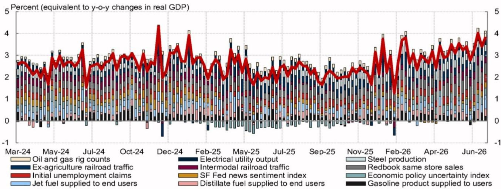
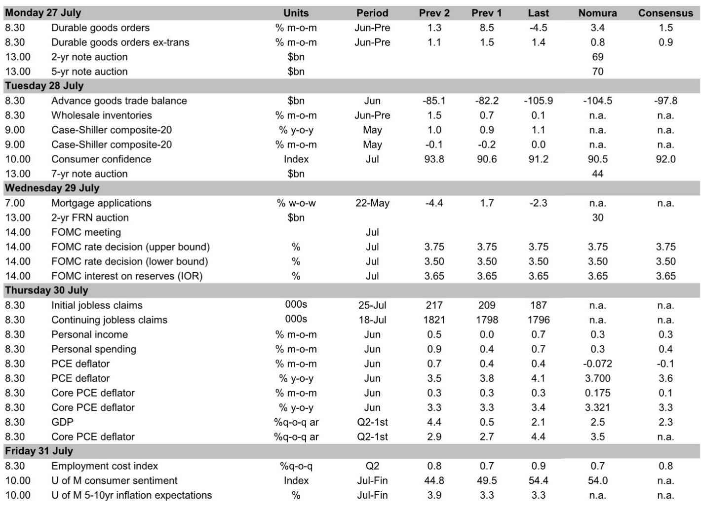
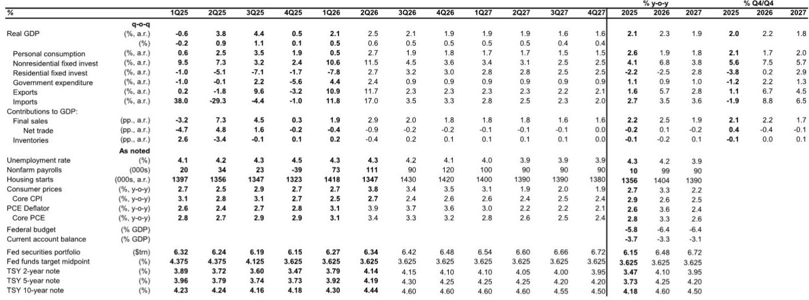

# 美联储7月会议观察：表面之下的策略转向

联邦公开市场委员会将在7月会议上维持政策利率不变，但决议本身并非关键信号。真正的信号在于委员会内部鹰派异议与多数委员所支持的数据驱动耐心立场之间日益扩大的分歧。两位地区联储主席——克利夫兰的哈马克和达拉斯的洛根——预计将投票支持加息，这将是自主席沃什上任以来首次对其领导地位提出的正式内部挑战。然而，最新经济数据，特别是6月通胀数据，明确反对收紧政策。委员会内部动态与实体经济通缩轨迹之间的这种紧张关系，构成了观察者需要关注的核心格局。

近期市场对7月加息的定价有所上升，但这种变动反映的是前瞻指引的真空，而非通胀前景的根本转变。美联储的反应函数仍不透明，主席沃什刻意避免为加息设定具体门槛。在此环境下，市场正在为不确定性定价。然而，数据本身并不模糊。6月核心PCE通胀预计将大幅放缓至环比0.175%，年化水平接近2%——与美联储自身目标一致。作为央行偏好的工资指标，雇佣成本指数可能从0.9%放缓至环比0.7%，表明整体经济中的工资压力正在缓解。

不应将7月会议视为无足轻重的事件。鹰派异议、鸽派主席以及改善的通胀数据共同构成了一个特定的决策框架。美联储并非处于降息边缘，尽管存在鹰派少数派的噪音，但也并非处于加息边缘。战略问题在于这种平衡能维持多久，以及什么因素会打破它。

## 鹰派异议属于少数派观点，不会成为主流

两次支持加息的异议将是自疫情时期紧缩周期以来内部分歧最明显的信号。克利夫兰联储主席哈马克和达拉斯联储主席洛根均认为，高通胀、韧性增长以及宽松的金融条件意味着当前政策不够紧缩。他们强调了通胀上行风险，并指出稳定的劳动力市场不会在美联储双重使命目标之间产生冲突。明尼阿波利斯联储主席卡什卡利可能提出第三次异议，但并非基准情形，因为截至6月会议，他预计今年晚些时候仅有一次加息。

这些异议之所以重要，有两个原因。首先，它们表明FOMC内部有一个派系愿意公开与主席决裂，这会削弱一致性的观感，并可能随时间推移改变市场预期。其次，这些异议基于对经济的不同解读。哈马克和洛根认为劳动力市场仍然过于紧张，金融条件已过度宽松，通胀下降速度不足以证明按兵不动的合理性。他们不仅是在为未来的鹰派立场做铺垫，更是在提出实质性论点，认为当前政策立场不足。

但数据并不支持他们的观点。6月CPI和PPI均意外下行，6月隐含核心PCE读数为数月来最低。工资敏感型服务业通胀已呈下降趋势，长期通胀预期仍保持良好锚定，5-10年盈亏平衡通胀率约为2.2-2.3%——这一水平是理事沃勒本人在4月曾指出令人安心的。鹰派是从静态视角看待经济，而数据正朝相反方向移动。

对于观察者而言，这些异议是需要关注的信号，但不应据此进行交易。它们增加了声明或主席沃什新闻发布会措辞转向鹰派的概率，但不会改变政策的近期路径。包括中间派和鸽派成员在内的委员会多数已表示，渐进式通缩支持观望态度。6月通胀数据强化了这一立场。

## 主席沃什将强调可信度，但不会承诺具体门槛

主席沃什的新闻发布会将是7月会议最受关注的环节。他的措辞一贯聚焦于抗通胀可信度，预计将继续这一主题。但他也很可能不会指明加息的具体门槛或对未来行动做出任何预先承诺。这是一个刻意的战略选择。

沃什有几个预计会重申的鸽派论点。他对官方通胀数据的质量表示怀疑，认为方法论问题可能夸大了真实的价格压力。他认为人工智能的通缩效应被低估，并将持续拉低核心通胀。他还提出，货币增长动态的通胀影响可能低于历史关系所暗示的水平。这些并非随意提及，而是构成其耐心立场的思想基础。

市场的风险在于，沃什对可信度的强调可能被误解为鹰派。他可能会重申美联储致力于将通胀率拉回2%，且不会过早宣布胜利。但缺乏加息的具体门槛意味着市场将继续为不确定性定价。沃什的鸽派直觉与其公开姿态之间的差距造成了一种紧张关系，这种关系只能由数据来解决。

观察者应关注沃什没有说什么。如果他避免提及9月会议加息是一个可选方案，那将确认观望立场。如果他明确提及6月通胀数据令人鼓舞，那将强化通缩叙事。最重要的信号将是鹰派转向的缺席，而非其存在。

## 6月通胀数据将强化耐心立场，而非紧缩理由

6月核心PCE平减指数预计环比为0.175%，较前几个月大幅减速，年化水平接近2%。同比来看，核心PCE可能从3.4%放缓至3.3%。这尚未达到美联储目标，但代表了有意义的进展。细节比总体数据更为重要。

剔除食品、能源和住房的超核心PCE通胀，作为美联储密切关注的国内价格压力指标，根据6月CPI和PPI数据预计将显著放缓。核心商品通胀可能温和反弹，但预计是暂时的。更广泛的趋势是关税传导效应减弱和残余季节性因素拉低通胀。

关键的是，第二季度雇佣成本指数预计从0.9%放缓至0.7%。美联储已将ECI确定为其偏好的工资指标，此处的放缓与劳动密集型服务业通胀前景直接相关。私营部门工资可能小幅上升，但四舍五入后仍维持在0.7%的水平，而州和地方政府工资则有所放缓。通常在第一季度飙升的福利部分也有所缓和。这与其他工资指标一致，表明紧张的劳动力市场不再产生加速的工资压力。

对观察者而言，含义是明确的。月度核心PCE环比0.2%的读数将代表向美联储通胀目标取得进一步进展，并应降低近期加息的可能性。数据正在告诉美联储等待。问题在于委员会是否会倾听。

## 新关税公告对通胀前景温和有利

特朗普政府本周宣布了新的301条款关税，以取代即将到期的122条款普遍关税。这一过渡预计将使平均有效关税税率提高约一个百分点至8%，大致符合此前预期。但细节比总体标题更为有利。

对某些主要贸易伙伴进口的额外影响将被最惠国待遇关税所抵消，从而降低有效增幅。更重要的是，一般豁免产品清单已扩大，纳入了此前面临关税风险的消费品和食品。这表明政府对可负担性问题敏感，不打算在通胀仍高于目标时大幅升级关税政策。

终端平均有效关税税率预计将保持在8-9%的范围内，从通胀角度看是可控的。需要关注的主要风险是正在进行的USMCA谈判以及可能对过剩产能展开的另一项301调查，但两者均非迫在眉睫。就目前而言，关税渠道是温和的逆风，而非通胀上行风险的主要来源。

## 观察者的决策框架：三种情景及其触发数据

7月FOMC会议及周边数据为观察者提供了一个清晰的决策框架。基准情形是长期观望，政策利率至少在2027年底前维持在3.625%，这与NOM展望一致。但需要定义可能打破这种平衡的情景以及预示转变的数据。

情景一：观望持续。这要求核心PCE通胀继续维持在环比0.2%或以下，ECI保持在季度环比0.8%以下，金融条件大体稳定。在此情景下，鹰派异议仍属少数，主席沃什的鸽派直觉占上风，美联储无限期维持观望。这是最可能的路径。

情景二：鹰派获胜。这需要核心PCE通胀连续两个月重新加速至环比0.3%以上，ECI大幅上升至季度环比1.0%以上，或金融条件显著宽松，美联储认为这与通胀使命不符。在此情景下，异议投票将获得牵引力，委员会将开始为9月或10月会议加息定价。这是尾部风险，但并非为零。

情景三：鸽派突围。这需要核心PCE通胀连续多月降至环比0.1%以下，劳动力市场出现明显疲软迹象（超出当前渐进式放缓），或关税或地缘政治事件导致负面需求冲击。在此情景下，市场将开始为降息定价，主席沃什的鸽派倾向将变得明确。这也是尾部风险，但在12个月的时间范围内，其可能性高于加息。

需要关注的关键数据点是月度核心PCE数据、季度ECI发布以及每周初请失业金人数。如果初请失业金人数开始趋势性高于30万，那将预示劳动力市场恶化，并将平衡转向情景三。如果核心PCE重新加速至环比0.3%以上，那将把平衡转向情景二。目前，数据支持情景一。

7月FOMC会议并非转折点。它是对现状的确认。但现状本身就是一个战略选择，而异议提醒我们，并非委员会所有人都同意这一选择。观察者应关注数据而非措辞，并为长期观望（略微偏向通缩）做好准备。鹰派声音响亮，但数字是安静的——而数字正在获胜。

*仅供参考。部分内容可能基于源材料通过AI辅助生成、翻译、总结或编辑，可能存在遗漏或错误。请独立核实。这不构成专业建议。*

仅供参考。部分内容可能基于源材料通过AI辅助生成、翻译、总结或编辑，可能存在遗漏或错误。请独立核实。这不构成专业建议。

