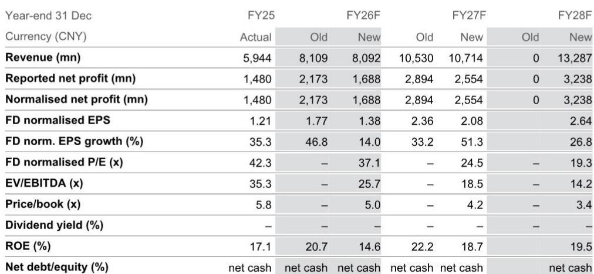
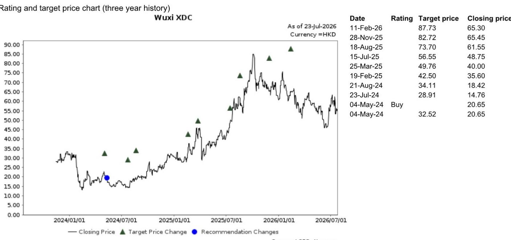
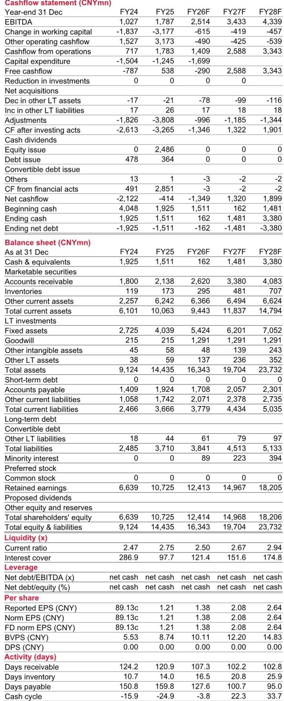

# NOM：药明合联1H26预览与FY26F预测修订

药明合联即将披露的2026年上半年业绩，收入增速依然可观，但利润端受到多重因素影响。NOM在最新研究报告中预计，公司1H26收入约38.15亿元人民币，同比增长41.2%，主要来自现有业务高增长以及4月起并表的BioDlink贡献约2.25亿元。然而，同期净利润仅约7.47亿元，同比增幅收窄至0.2%，背后是人民币对美元升值约4%带来的汇兑影响，以及BioDlink并购相关管理费用上升。

这份报告的核心判断是：药明合联的营收增长逻辑并未改变，但短期利润释放节奏被一次性因素打乱。NOM将FY26F净利润预测下调22.3%，主要反映汇率和并购费用，但更新公司观点，隐含约48%的上行空间。

## 1. 毛利率稳定但运营利润率承压

1H26毛利率预计维持在36.0%左右，与1H25的36.1%基本持平。NOM认为，规模效应部分抵消了汇率影响。但运营利润率从1H25的28.5%降至27.4%，同比下降1.1个百分点，主要原因是BioDlink并购导致管理费用同比大增77%。

> **KC评论：** 毛利率稳定说明公司核心业务的定价能力和成本控制没有出现变化，运营利润率下降是并购整合期的正常现象。读者需要关注的是，管理费用上升是一次性还是可持续。

## 2. 汇率与并购费用构成双重影响

报告特别指出，人民币对美元在1H26期间升值约4%，这对以美元计价收入为主的药明合联形成直接汇兑影响。此外，其他收入和支出项从1H25的净收益1.06亿元转为净亏损0.76亿元，同比变化-172%，NOM将其归因于汇兑影响和并购相关费用。

NOM下调FY26F净利润预测至16.88亿元，较此前预测的21.73亿元减少22.3%，比彭博一致预期低17.4%。但收入预测仅微调0.2%，表明利润下调主要来自费用端而非收入端。

## 3. 下半年增速预期节奏变化但仍保持30%以上

对于2H26，NOM预计收入约43亿元，同比增长32%；净利润约9.41亿元，同比增长28%。增速较1H26有所节奏变化，但仍在30%以上，主要驱动力来自商业化项目贡献和运营效率提升。

从全年看，FY26F收入预计80.92亿元，同比增长36.1%；正常化净利润16.88亿元，同比增长14.0%。净利润增速明显低于收入增速，反映出汇率和并购费用对利润率的压制。

## 4. 估值框架：DCF假设不变，公司情况更新

NOM采用DCF估值法，WACC假设10.3%，终端增长率4.5%，均未调整。，完全由盈利预测下调驱动。，对应FY26F正常化PE约37.1倍，FY27F约24.5倍。

报告列出的主要节奏变化不确定性包括：地缘政治紧张、未能获得商业化阶段项目、ADC赛道吸引力下降、竞争加剧。这些不确定性在行业层面已有讨论，但报告未提供新的量化分析。

For informational purposes only. Portions may be generated,translated,summarized,or edited with AI assistance based on source materials and may contain omissions or errors. Please verify independently. This is not investment,legal,tax,accounting,or other professional advice.

For informational purposes only. Portions may be generated,translated,summarized,or edited with AI assistance based on source materials and may contain omissions or errors. Please verify independently. This is not investment,legal,tax,accounting,or other professional advice.

