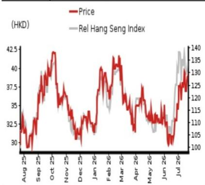

EQUITY: HEALTH CARE & PHARMACEUTICALS

# 1H26F preview and FY26F forecast revisions

# We expect solid operations but anticipate headwind from FX impact and investment losses

We estimate 1H26F top-line grew $15.5\%$ , while non-recurring items likely drove bottom line down $15.3\%$ y-y

We expect Wuxi Bio to report 1H26F revenue of CNY11.5bn (+15.5% y-y). By segment, we forecast revenue of pre-IND / early-stage services / late-stage manufacturing registered 12%/18%/18% y-y growth to CNY4.6bn/CNY1.6bn/CNY5.1bn, considering the robust "R" business growth (despite the base being a bit high) and big commercial stage projects (management noted that the top 3 manufacturing projects should each generate over USD100mn revenue in 2026E).

By margin, we estimate gross margin declined slightly by 0.7pp to $42.0\%$ and operating margin contracted 0.9pp to $27.8\%$ , led by an FX impact headwind (average USD/CNY declined from 7.18 in 1H25 to 6.89 in 1H26). For 1H26F, anticipating loss from investment owing to challenging market conditions, we forecast net profit to shareholders came in at CNY2.0bn (-15% y-y).

Maintain Buy rating and raise TP to HKD51.38 from HKD50.54, implying $30.9\%$ upside

Recall that in end-May, management updated the company's healthy growing trend and reiterated its 2026E top-line growth target (see our report: Quick Note - Wuxi Bio (2269 HK) (Buy) - FY26E topline guidance reaffirmed and mid-term topline growth target provided).

For 2H26F, we expect revenue/net profit to shareholders to increase by $15.1\% / 14.0\%$ y-y to CNY13.6bn/CNY2.9bn, with anticipation of less impact from non-recurring items. We lower FY26F revenue forecast by $-1.9\%$ while we cut earnings estimate by $14.0\%$ , reflecting the stronger FX negative impact and loss on investment. We raise pur mid-term top-line growth forecast, owing to the brighter outlook provided by management earlier in May.

We maintain our Buy rating and slightly raise our DCF-based (assuming a WACC of 10.1% and a terminal growth rate of 4.0% – both unchanged) TP to HKD51.38 from HKD50.54. The stock currently trades at 28.7x FY26F fully diluted EPS of CNY1.16.

<table><tr><td>Year-end 31 Dec</td><td colspan="2">FY25</td><td colspan="2">FY26F</td><td colspan="2">FY27F</td><td colspan="2">FY28F</td></tr><tr><td>Currency (CNY)</td><td>Actual</td><td>Old</td><td>New</td><td>Old</td><td>New</td><td>Old</td><td>New</td><td></td></tr><tr><td>Revenue (mn)</td><td>21,790</td><td>25,604</td><td>25,123</td><td>29,093</td><td>29,450</td><td>0</td><td>33,528</td><td></td></tr><tr><td>Reported net profit (mn)</td><td>4,908</td><td>5,708</td><td>4,911</td><td>6,756</td><td>6,653</td><td>0</td><td>7,661</td><td></td></tr><tr><td>Normalised net profit (mn)</td><td>4,908</td><td>5,708</td><td>4,911</td><td>6,756</td><td>6,653</td><td>0</td><td>7,661</td><td></td></tr><tr><td>FD normalised EPS</td><td>1.16</td><td>1.35</td><td>1.16</td><td>1.66</td><td>1.63</td><td></td><td>1.88</td><td></td></tr><tr><td>FD norm. EPS growth (%)</td><td>46.3</td><td>16.3</td><td>0.1</td><td>22.6</td><td>40.3</td><td></td><td>15.1</td><td></td></tr><tr><td>FD normalised P/E (x)</td><td>28.7</td><td>-</td><td>28.7</td><td>-</td><td>20.5</td><td>-</td><td>17.8</td><td></td></tr><tr><td>EV/EBITDA (x)</td><td>16.5</td><td>-</td><td>14.9</td><td>-</td><td>11.4</td><td>-</td><td>9.3</td><td></td></tr><tr><td>Price/book (x)</td><td>2.9</td><td>-</td><td>2.6</td><td>-</td><td>2.3</td><td>-</td><td>2.0</td><td></td></tr><tr><td>Dividend yield (%)</td><td>-</td><td>-</td><td>-</td><td>-</td><td>-</td><td>-</td><td>-</td><td></td></tr><tr><td>ROE (%)</td><td>11.0</td><td>11.5</td><td>9.9</td><td>12.1</td><td>12.0</td><td></td><td>12.2</td><td></td></tr><tr><td>Net debt/equity (%)</td><td>net cash</td><td>net cash</td><td>net cash</td><td>net cash</td><td>net cash</td><td></td><td>net cash</td><td></td></tr></table>

Source: Company data, NOM estimates

Rating Remains Buy

Target price
Increased from
HKD 50.54
HKD 51.38

<table><tr><td>Closing price23 July 2026</td><td>HKD 39.24</td></tr></table>

<table><tr><td>Implied upside</td><td>+30.9%</td></tr></table>

<table><tr><td>Market Cap (USD mn)</td><td>20,664.0</td></tr><tr><td>ADT (USD mn)</td><td>136.1</td></tr></table>

## Relative performance chart

  
Source: LSEG, NOM

## Research Analysts

China Health Care & Pharmaceuticals

Jialin Zhang, CFA, CPA - NIHK  
jialin.zhang@NOM.com  
+852 2252 6134

## Key data on Wuxi Bio

<table><tr><td>Performance(%)</td><td>1M</td><td>3M</td><td>12M</td><td></td><td></td></tr><tr><td>Absolute (HKD)</td><td>26.0</td><td>15.7</td><td>36.5</td><td>M cap (USDmn)</td><td>20,664.0</td></tr><tr><td>Absolute (USD)</td><td>26.0</td><td>15.6</td><td>36.6</td><td>Free float (%)</td><td>84.3</td></tr><tr><td>Rel to Hang Seng Index</td><td>18.0</td><td>18.4</td><td>37.8</td><td>3-mth ADT (USDmn)</td><td>136.1</td></tr></table>

<table><tr><td colspan="6">Income statement (CNYmn)</td></tr><tr><td>Year-end 31 Dec</td><td>FY24</td><td>FY25</td><td>FY26F</td><td>FY27F</td><td>FY28F</td></tr><tr><td>Revenue</td><td>18,675</td><td>21,790</td><td>25,123</td><td>29,450</td><td>33,528</td></tr><tr><td>Cost of goods sold</td><td>-11,025</td><td>-11,772</td><td>-14,019</td><td>-15,785</td><td>-17,904</td></tr><tr><td>Gross profit</td><td>7,651</td><td>10,019</td><td>11,104</td><td>13,665</td><td>15,624</td></tr><tr><td>SG&amp;A</td><td>-2,914</td><td>-3,167</td><td>-3,613</td><td>-4,192</td><td>-4,722</td></tr><tr><td>Employee share expense</td><td></td><td></td><td></td><td></td><td></td></tr><tr><td>Operating profit</td><td>4,737</td><td>6,852</td><td>7,491</td><td>9,473</td><td>10,903</td></tr><tr><td>EBITDA</td><td>6,035</td><td>8,219</td><td>8,872</td><td>11,048</td><td>12,641</td></tr><tr><td>Depreciation</td><td>-1,243</td><td>-1,308</td><td>-1,258</td><td>-1,433</td><td>-1,575</td></tr><tr><td>Amortisation</td><td>-55</td><td>-59</td><td>-123</td><td>-142</td><td>-164</td></tr><tr><td>EBIT</td><td>4,737</td><td>6,852</td><td>7,491</td><td>9,473</td><td>10,903</td></tr><tr><td>Net interest expense</td><td>-158</td><td>-143</td><td>-157</td><td>-173</td><td>-190</td></tr><tr><td>Associates &amp; JCEs</td><td></td><td></td><td></td><td></td><td></td></tr><tr><td>Other income</td><td>255</td><td>548</td><td>-251</td><td>294</td><td>335</td></tr><tr><td>Earnings before tax</td><td>4,834</td><td>7,257</td><td>7,082</td><td>9,595</td><td>11,047</td></tr><tr><td>Income tax</td><td>-889</td><td>-1,524</td><td>-1,346</td><td>-1,823</td><td>-2,099</td></tr><tr><td>Net profit after tax</td><td>3,945</td><td>5,733</td><td>5,737</td><td>7,772</td><td>8,948</td></tr><tr><td>Minority interests</td><td>-589</td><td>-825</td><td>-825</td><td>-1,118</td><td>-1,287</td></tr><tr><td>Other items</td><td></td><td></td><td></td><td></td><td></td></tr><tr><td>Preferred dividends</td><td></td><td></td><td></td><td></td><td></td></tr><tr><td>Normalised NPAT</td><td>3,356</td><td>4,908</td><td>4,911</td><td>6,653</td><td>7,661</td></tr><tr><td>Extraordinary items</td><td></td><td></td><td></td><td></td><td></td></tr><tr><td>Reported NPAT</td><td>3,356</td><td>4,908</td><td>4,911</td><td>6,653</td><td>7,661</td></tr><tr><td>Dividends</td><td></td><td></td><td></td><td></td><td></td></tr><tr><td>Transfer to reserves</td><td>3,356</td><td>4,908</td><td>4,911</td><td>6,653</td><td>7,661</td></tr><tr><td>Valuations and ratios</td><td></td><td></td><td></td><td></td><td></td></tr><tr><td>Reported P/E (x)</td><td>40.6</td><td>27.7</td><td>27.7</td><td>20.5</td><td>17.8</td></tr><tr><td>Normalised P/E (x)</td><td>40.6</td><td>27.7</td><td>27.7</td><td>20.5</td><td>17.8</td></tr><tr><td>FD normalised P/E (x)</td><td>42.0</td><td>28.7</td><td>28.7</td><td>20.5</td><td>17.8</td></tr><tr><td>Dividend yield (%)</td><td>-</td><td>-</td><td>-</td><td>-</td><td>-</td></tr><tr><td>Price/cashflow (x)</td><td>27.0</td><td>22.2</td><td>16.5</td><td>15.7</td><td>13.3</td></tr><tr><td>Price/book (x)</td><td>3.3</td><td>2.9</td><td>2.6</td><td>2.3</td><td>2.0</td></tr><tr><td>EV/EBITDA (x)</td><td>22.5</td><td>16.5</td><td>14.9</td><td>11.4</td><td>9.3</td></tr><tr><td>EV/EBIT (x)</td><td>28.7</td><td>19.8</td><td>17.6</td><td>13.3</td><td>10.8</td></tr><tr><td>Gross margin (%)</td><td>41.0</td><td>46.0</td><td>44.2</td><td>46.4</td><td>46.6</td></tr><tr><td>EBITDA margin (%)</td><td>32.3</td><td>37.7</td><td>35.3</td><td>37.5</td><td>37.7</td></tr><tr><td>EBIT margin (%)</td><td>25.4</td><td>31.4</td><td>29.8</td><td>32.2</td><td>32.5</td></tr><tr><td>Net margin (%)</td><td>18.0</td><td>22.5</td><td>19.5</td><td>22.6</td><td>22.8</td></tr><tr><td>Effective tax rate (%)</td><td>18.4</td><td>21.0</td><td>19.0</td><td>19.0</td><td>19.0</td></tr><tr><td>Dividend payout (%)</td><td>0.0</td><td>0.0</td><td>0.0</td><td>0.0</td><td>0.0</td></tr><tr><td>ROE (%)</td><td>8.2</td><td>11.0</td><td>9.9</td><td>12.0</td><td>12.2</td></tr><tr><td>ROA (pretax %)</td><td>9.9</td><td>13.3</td><td>13.3</td><td>16.0</td><td>17.7</td></tr><tr><td>Growth (%)</td><td></td><td></td><td></td><td></td><td></td></tr><tr><td>Revenue</td><td>9.6</td><td>16.7</td><td>15.3</td><td>17.2</td><td>13.8</td></tr><tr><td>EBITDA</td><td>7.1</td><td>36.2</td><td>7.9</td><td>24.5</td><td>14.4</td></tr><tr><td>Normalised EPS</td><td>0.9</td><td>46.3</td><td>0.1</td><td>35.5</td><td>15.1</td></tr><tr><td>Normalised FDEPS</td><td>2.2</td><td>46.3</td><td>0.1</td><td>40.3</td><td>15.1</td></tr></table>

Source: Company data, NOM estimates

<table><tr><td colspan="6">Cashflow statement (CNYmn)</td></tr><tr><td>Year-end 31 Dec</td><td>FY24</td><td>FY25</td><td>FY26F</td><td>FY27F</td><td>FY28F</td></tr><tr><td>EBITDA</td><td>6,035</td><td>8,219</td><td>8,872</td><td>11,048</td><td>12,641</td></tr><tr><td>Change in working capital</td><td>-3,000</td><td>1,423</td><td>2,229</td><td>474</td><td>1,240</td></tr><tr><td>Other operating cashflow</td><td>2,182</td><td>-3,302</td><td>-2,569</td><td>-2,863</td><td>-3,633</td></tr><tr><td>Cashflow from operations</td><td>5,217</td><td>6,341</td><td>8,531</td><td>8,658</td><td>10,249</td></tr><tr><td>Capital expenditure</td><td>-3,842</td><td>492</td><td>-5,100</td><td></td><td></td></tr><tr><td>Free cashflow</td><td>1,375</td><td>6,833</td><td>3,431</td><td>8,658</td><td>10,249</td></tr><tr><td>Reduction in investments</td><td>0</td><td>0</td><td>0</td><td>0</td><td></td></tr><tr><td>Net acquisitions</td><td></td><td></td><td></td><td></td><td></td></tr><tr><td>Dec in other LT assets</td><td>-1,043</td><td>-4,266</td><td>-1,057</td><td>-1,150</td><td>-1,219</td></tr><tr><td>Inc in other LT liabilities</td><td>-673</td><td>-497</td><td>44</td><td>44</td><td>45</td></tr><tr><td>Adjustments</td><td>1,616</td><td>1,184</td><td>957</td><td>-1,676</td><td>-1,635</td></tr><tr><td>CF after investing acts</td><td>1,276</td><td>3,254</td><td>3,375</td><td>5,877</td><td>7,441</td></tr><tr><td>Cash dividends</td><td></td><td></td><td></td><td></td><td></td></tr><tr><td>Equity issue</td><td>0</td><td>0</td><td>0</td><td>0</td><td>0</td></tr><tr><td>Debt issue</td><td>490</td><td>-1,629</td><td>96</td><td>105</td><td>115</td></tr><tr><td>Convertible debt issue</td><td>0</td><td>0</td><td>0</td><td>0</td><td>0</td></tr><tr><td>Others</td><td>-3,156</td><td>-690</td><td>863</td><td>1,210</td><td>1,728</td></tr><tr><td>CF from financial acts</td><td>-2,666</td><td>-2,319</td><td>958</td><td>1,315</td><td>1,843</td></tr><tr><td>Net cashflow</td><td>-1,391</td><td>935</td><td>4,333</td><td>7,192</td><td>9,284</td></tr><tr><td>Beginning cash</td><td>9,670</td><td>8,279</td><td>9,214</td><td>13,547</td><td>20,739</td></tr><tr><td>Ending cash</td><td>8,279</td><td>9,214</td><td>13,547</td><td>20,739</td><td>30,023</td></tr><tr><td>Ending net debt</td><td>-5,643</td><td>-8,171</td><td>-12,409</td><td>-19,495</td><td>-28,664</td></tr><tr><td colspan="6">Balance sheet (CNYmn)</td></tr><tr><td>As at 31 Dec</td><td>FY24</td><td>FY25</td><td>FY26F</td><td>FY27F</td><td>FY28F</td></tr><tr><td>Cash &amp; equivalents</td><td>8,279</td><td>9,214</td><td>13,547</td><td>20,739</td><td>30,023</td></tr><tr><td>Marketable securities</td><td></td><td></td><td></td><td></td><td></td></tr><tr><td>Accounts receivable</td><td>6,241</td><td>8,853</td><td>7,880</td><td>8,914</td><td>9,781</td></tr><tr><td>Inventories</td><td>1,522</td><td>1,381</td><td>2,090</td><td>2,353</td><td>2,669</td></tr><tr><td>Other current assets</td><td>6,008</td><td>3,361</td><td>3,405</td><td>3,450</td><td>3,496</td></tr><tr><td>Total current assets</td><td>22,049</td><td>22,809</td><td>26,922</td><td>35,457</td><td>45,970</td></tr><tr><td>LT investments</td><td></td><td></td><td></td><td></td><td></td></tr><tr><td>Fixed assets</td><td>26,070</td><td>27,739</td><td>30,451</td><td>30,498</td><td>30,341</td></tr><tr><td>Goodwill</td><td>1,530</td><td>1,530</td><td>1,530</td><td>1,530</td><td>1,530</td></tr><tr><td>Other intangible assets</td><td>442</td><td>467</td><td>470</td><td>475</td><td>479</td></tr><tr><td>Other LT assets</td><td>6,885</td><td>11,152</td><td>12,208</td><td>13,359</td><td>14,577</td></tr><tr><td>Total assets</td><td>56,977</td><td>63,697</td><td>71,582</td><td>81,319</td><td>92,897</td></tr><tr><td>Short-term debt</td><td>2,435</td><td>874</td><td>961</td><td>1,057</td><td>1,163</td></tr><tr><td>Accounts payable</td><td>3,426</td><td>3,287</td><td>4,477</td><td>5,128</td><td>5,915</td></tr><tr><td>Other current liabilities</td><td>2,760</td><td>4,147</td><td>4,966</td><td>6,131</td><td>7,814</td></tr><tr><td>Total current liabilities</td><td>8,621</td><td>8,308</td><td>10,404</td><td>12,316</td><td>14,891</td></tr><tr><td>Long-term debt</td><td>201</td><td>169</td><td>178</td><td>187</td><td>196</td></tr><tr><td>Convertible debt</td><td></td><td></td><td></td><td></td><td></td></tr><tr><td>Other LT liabilities</td><td>2,678</td><td>2,180</td><td>2,224</td><td>2,269</td><td>2,314</td></tr><tr><td>Total liabilities</td><td>11,500</td><td>10,657</td><td>12,806</td><td>14,771</td><td>17,401</td></tr><tr><td>Minority interest</td><td>3,658</td><td>5,791</td><td>6,616</td><td>7,734</td><td>9,022</td></tr><tr><td>Preferred stock</td><td></td><td></td><td></td><td></td><td></td></tr><tr><td>Common stock</td><td>0</td><td>0</td><td>0</td><td>0</td><td>0</td></tr><tr><td>Retained earnings</td><td>41,819</td><td>47,248</td><td>52,160</td><td>58,813</td><td>66,474</td></tr><tr><td>Proposed dividends</td><td></td><td></td><td></td><td></td><td></td></tr><tr><td>Other equity and reserves</td><td></td><td></td><td></td><td></td><td></td></tr><tr><td>Total shareholders&#x27; equity</td><td>41,819</td><td>47,249</td><td>52,160</td><td>58,814</td><td>66,474</td></tr><tr><td>Total equity &amp; liabilities</td><td>56,977</td><td>63,697</td><td>71,582</td><td>81,319</td><td>92,897</td></tr><tr><td>Liquidity (x)</td><td></td><td></td><td></td><td></td><td></td></tr><tr><td>Current ratio</td><td>2.56</td><td>2.75</td><td>2.59</td><td>2.88</td><td>3.09</td></tr><tr><td>Interest cover</td><td>30.1</td><td>47.9</td><td>47.6</td><td>54.7</td><td>57.3</td></tr><tr><td>Leverage</td><td></td><td></td><td></td><td></td><td></td></tr><tr><td>Net debt/EBITDA (x)</td><td>net cash</td><td>net cash</td><td>net cash</td><td>net cash</td><td>net cash</td></tr><tr><td>Net debt/equity (%)</td><td>net cash</td><td>net cash</td><td>net cash</td><td>net cash</td><td>net cash</td></tr><tr><td>Per share</td><td></td><td></td><td></td><td></td><td></td></tr><tr><td>Reported EPS (CNY)</td><td>82.21c</td><td>1.20</td><td>1.20</td><td>1.63</td><td>1.88</td></tr><tr><td>Norm EPS (CNY)</td><td>82.21c</td><td>1.20</td><td>1.20</td><td>1.63</td><td>1.88</td></tr><tr><td>FD norm EPS (CNY)</td><td>79.39c</td><td>1.16</td><td>1.16</td><td>1.63</td><td>1.88</td></tr><tr><td>BVPS (CNY)</td><td>10.24</td><td>11.57</td><td>12.78</td><td>14.41</td><td>16.28</td></tr><tr><td>DPS (CNY)</td><td>0.00</td><td>0.00</td><td>0.00</td><td>0.00</td><td>0.00</td></tr><tr><td>Activity (days)</td><td></td><td></td><td></td><td></td><td></td></tr><tr><td>Days receivable</td><td>122.5</td><td>126.4</td><td>121.5</td><td>104.1</td><td>102.0</td></tr><tr><td>Days inventory</td><td>54.4</td><td>45.0</td><td>45.2</td><td>51.4</td><td>51.3</td></tr><tr><td>Days payable</td><td>112.6</td><td>104.1</td><td>101.1</td><td>111.1</td><td>112.9</td></tr><tr><td>Cash cycle</td><td>64.3</td><td>67.3</td><td>65.7</td><td>44.4</td><td>40.5</td></tr></table>

Source: Company data, NOM estimates

## Company profile

WuXi Biologics is a leading global open-access biologics technology platform offering end-to-end solutions to empower organizations to discover, develop, and manufacture biologics from concept to commercial manufacturing. The company's history and achievements demonstrate its commitment to providing a truly ONE-stop service offering and strong value proposition to its global clients. The company is currently conducting on behalf of its clients and partners (as of Dec 31, 2025) a total of 945 integrated projects, including 463 in pre-clinical development stage; 383 in early-phase (phase I and II) clinical development; 74 in late-phase (phase III) development; and 25 in commercial manufacturing.

## Valuation Methodology

Our target price of HKD51.38 is based on a DCF model, assuming WACC $10.1\%$ and terminal growth of $4.0\%$ . The benchmark index for the stock is Hang Seng Index

Risks that may impede the achievement of the target price

Downside risks include: (1) increasing global competition; and (2) geopolitical tensions

## ESG

Wuxi Bio has clear blueprint and actions on ESG management. To the environment protection, the group aims to reduce its scope 1 and scope 2 GHG emission intensity by $50\%$ by 2030 from a 2020 base year, and to reduce water consumption intensity by $18\%$ by 2025 from a 2019 base year. To social responsibility, Wuxi Bio not only financially supports areas hit by natural adversity, but also formed a volunteer association at group level. To corporate governance, the group always focus on diversity, equity and inclusion, making related policies to create equal and inclusive culture.

Fig. 1: Wuxi Bio 1H26F income statement forecast

<table><tr><td>CNYmn</td><td>1H25</td><td>1H26F</td><td>YoY</td></tr><tr><td>Revenue</td><td>9,953</td><td>11,496</td><td>15.5%</td></tr><tr><td>COGS</td><td>(5,700)</td><td>(6,668)</td><td>17.0%</td></tr><tr><td>Gross profit</td><td>4,253</td><td>4,828</td><td>13.5%</td></tr><tr><td>GP margin(%)</td><td>42.7%</td><td>42.0%</td><td>-0.7%</td></tr><tr><td>R&amp;D expenses</td><td>(344)</td><td>(414)</td><td>20.5%</td></tr><tr><td>G&amp;A expenses</td><td>(781)</td><td>(897)</td><td>14.8%</td></tr><tr><td>Selling expenses</td><td>(270)</td><td>(322)</td><td>19.2%</td></tr><tr><td>Operating profit</td><td>2,858</td><td>3,196</
