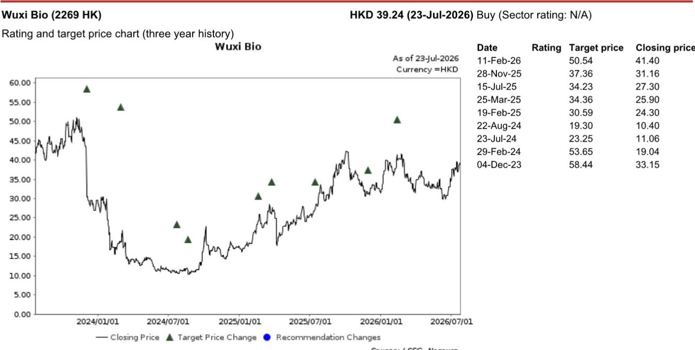
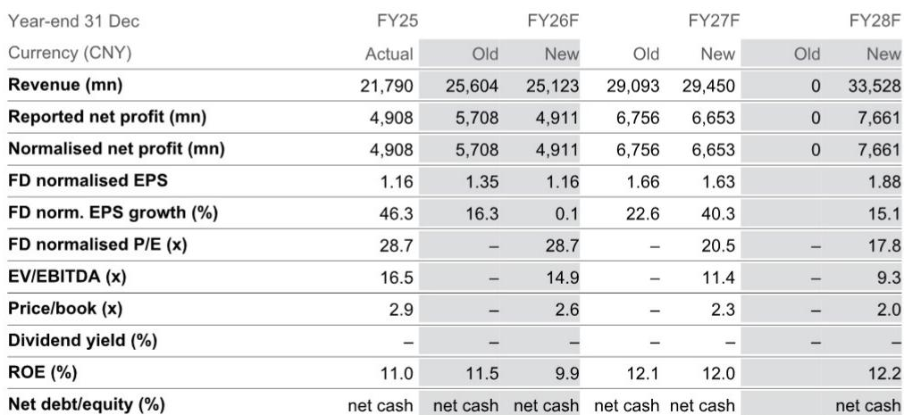
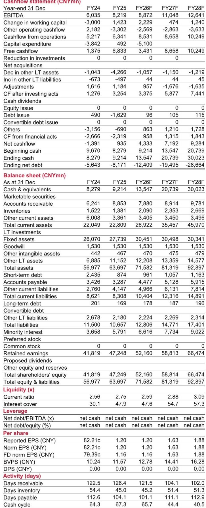

# Wuxi Bio's Revenue Engine Is Running Strong, but Currency Shifts and Investment Losses Are Obscuring the Earnings Story

The fundamental tension in Wuxi Biologics' near-term outlook is not about demand. Revenue growth in the first half of fiscal 2026 is projected at 15.5% year-over-year, reaching CNY 11.5 billion, driven by a robust research business and large-scale commercial manufacturing projects. Yet, net profit to shareholders is expected to fall by 15.3% over the same period, landing at approximately CNY 2.0 billion. This divergence between top-line momentum and bottom-line contraction is the central strategic issue for those assessing the company today.

The explanation lies in two non-operational forces that are temporarily suppressing earnings: a meaningful foreign exchange headwind and losses from the company's investment portfolio. The average USD/CNY exchange rate moved from 7.18 in the first half of 2025 to 6.89 in the first half of 2026, a shift that directly compresses margins for a company that earns a substantial portion of its revenue in U.S. dollars while reporting in renminbi. Separately, challenging market conditions have generated losses on investments, further weighing on reported net profit. These are not signals of operational weakness. They are financial mechanics that must be decoupled from the underlying business trajectory.

For the full fiscal year 2026, the revenue forecast has been trimmed by 1.9% to CNY 25.1 billion, and the earnings estimate has been cut by 14.0% to CNY 4.9 billion. These downward revisions reflect the same FX and investment headwinds, not a deterioration in the company's competitive position or project pipeline. The stock currently trades at 28.7 times fully diluted normalized earnings per share of CNY 1.16 for fiscal 2026, a multiple that, while not inexpensive, sits within a context of accelerating normalized EPS growth projected at 40.3% for fiscal 2027 and 15.1% for fiscal 2028.

Management's reaffirmation of its 2026E top-line growth target in late May, along with the provision of a mid-term growth outlook, provides a critical anchor. The company's guidance suggests that the core business remains on a healthy trajectory, and the temporary nature of the current earnings drag is a key input for any forward-looking valuation. The 报告观点 and a slightly ice of HKD 39.24, reflect the view that the market is over-discounting short-term financial noise relative to long-term operational value.

## The "R" Business and Commercial-Stage Manufacturing Are the Twin Engines Driving 15.5% Top-Line Growth

Revenue growth in the first half of fiscal 2026 is not a broad, undifferentiated lift. It is concentrated in two segments that reveal the structure of Wuxi Bio's competitive advantage. Pre-IND and early-stage services are forecast to grow 12% year-over-year to CNY 4.6 billion, while late-stage manufacturing is projected to grow 18% to CNY 5.1 billion. The early-stage segment, or the "R" business, is benefiting from a robust pipeline of discovery and preclinical work, even against a high base of comparison. The late-stage segment is being propelled by large commercial projects, with management noting that the top three manufacturing projects are each expected to generate over USD 100 million in revenue in calendar 2026.

This dual-engine structure matters for two reasons. First, it provides diversification across the drug development lifecycle. A slowdown in early-stage client activity would not cripple the company because late-stage manufacturing provides a counterbalance, and vice versa. Second, the commercial manufacturing revenue carries higher visibility and longer duration, which supports more predictable cash flows and reduces the lumpiness that often plagues contract development and manufacturing organizations. The 18% growth in late-stage manufacturing is particularly significant because it signals that client programs are successfully advancing through clinical trials and into commercial production, a validation of the platform's technical capabilities and client stickiness.

The operating margin is forecast to contract by 0.9 percentage points to 27.8%, and gross margin by 0.7 percentage points to 42.0%. These margin declines are primarily attributable to the FX headwind rather than to any structural cost inflation or pricing pressure. When the USD weakens against the CNY, the renminbi-denominated value of dollar-denominated revenue contracts, compressing margins mechanically. Observers should track the trajectory of the USD/CNY exchange rate as a near-term earnings variable, but they should not interpret the margin compression as a loss of pricing power or operational efficiency.

## Currency Translation and Investment Losses Are Temporary, Not Structural, Drags on Earnings

The 15.3% year-over-year decline in net profit to shareholders for the first half of fiscal 2026 is the most jarring data point in the forecast, but it requires careful decomposition. The two primary drivers are the FX impact and losses from investments. The average USD/CNY rate declined from 7.18 to 6.89 between the first half of 2025 and the first half of 2026, a 4.0% appreciation of the renminbi against the dollar. For a company that reports in renminbi but derives a significant share of revenue from U.S. dollar-denominated contracts, this translation effect directly reduces reported revenue and profit.

The investment losses are a second, separate headwind. In challenging market conditions, the company's portfolio of investments has generated losses that flow through the income statement. These are non-operating items and are inherently volatile and unpredictable. The forecast for the second half of fiscal 2026 assumes a less severe impact from these non-recurring items, which is why net profit is expected to rebound to CNY 2.9 billion, a 14.0% year-over-year increase in the second half. This half-on-half recovery is the clearest signal that the first-half earnings weakness is transient.

The full-year fiscal 2026 normalized net profit forecast of CNY 4.9 billion is essentially flat with fiscal 2025's actual normalized net profit of CNY 4.9 billion. This zero growth in EPS for fiscal 2026 is a function of the FX and investment drags, not a reflection of a stagnant business. The normalized EPS growth projections for fiscal 2027 and fiscal 2028 are 40.3% and 15.1%, respectively, implying that once the temporary headwinds dissipate, the underlying earnings power of the business will reassert itself. Focus should be on the normalized EPS trajectory rather than the fiscal 2026 base year.

## The Discounted Cash Flow Valuation Is Sensitive to Terminal Growth, and Management's Mid-Term Guidance Provides the Anchor

hted average cost of capital of 10.1% and a terminal growth rate of 4.0%, both unchanged from the prior estimate. The slight increase from the previous target of HKD 50.54 reflects the brighter mid-term top-line growth outlook provided by management in May, which has been incorporated into the cash flow projections beyond fiscal 2026. The terminal growth rate of 4.0% is a critical assumption, as it implies that the company can sustain growth above the broad economy's long-term trend indefinitely. This is plausible for a leading biologics CDMO with a deep pipeline and global client base, but it also means that the valuation is sensitive to any erosion in the company's competitive positioning or market opportunity.

The implied upside of 30.9% from the current price of HKD 39.24 is substantial, but it is contingent on the market accepting the management's growth narrative and looking through the near-term earnings noise. The stock's current valuation of 28.7 times fiscal 2026 normalized EPS is not demanding if the fiscal 2027 and fiscal 2028 growth materializes. At 20.5 times fiscal 2027 normalized EPS and 17.8 times fiscal 2028 normalized EPS, the forward multiple compression is significant, suggesting that the market may be pricing in a slower growth trajectory than the company is guiding toward.

The balance sheet remains a source of strength. The company is in a net cash position across all forecast periods, with net debt-to-equity consistently negative. This financial flexibility provides a buffer against adverse scenarios and supports the ability to invest in capacity expansion or pursue strategic opportunities without resorting to dilutive equity issuance. The net cash position also reduces the risk profile of the equity, which is not always fully reflected in the cost of capital assumptions.

## A Decision Framework: Distinguishing Between Transient Noise and Structural Signal

For those evaluating Wuxi Bio at current levels, the key analytical task is to separate the transient financial mechanics from the structural business signals. The following framework can guide that assessment.

First, evaluate the revenue quality. The 15.5% top-line growth in the first half of fiscal 2026 is being driven by the "R" business and commercial-stage manufacturing. Both segments are supported by a project backlog of 945 integrated projects as of December 2025, with 25 in commercial manufacturing and 74 in late-stage phase III development. The conversion of late-stage projects into commercial revenue is a multi-year tailwind that provides visibility beyond the current fiscal year. As long as this pipeline conversion continues, the revenue growth is structurally sound.

Second, isolate the earnings headwinds. The FX impact is a function of macroeconomic forces outside the company's control, but it is also reversible. If the USD strengthens against the CNY, the translation effect will become a tailwind. The investment losses are non-operating and should be evaluated separately from the company's core CDMO business. A "normalized" earnings power that excludes these items should be calculated to assess the underlying profitability trajectory.

Third, assess the margin trajectory on a constant-currency basis. The gross margin decline of 0.7 percentage points is largely attributable to FX. On a constant-currency basis, the company's gross margin may be stable or even improving, driven by scale efficiencies in commercial manufacturing and a favorable mix shift toward later-stage, higher-margin projects. The fiscal 2027 and fiscal 2028 gross margin forecasts of 46.4% and 46.6%, respectively, suggest that management and analysts expect a recovery once the FX headwind stabilizes.

Fourth, consider the risk factors explicitly. The report identifies increasing global competition and geopolitical tensions as downside risks. The CDMO industry is competitive, and Wuxi Bio's position could be challenged by capacity additions from competitors or by client decisions to bring manufacturing in-house. Geopolitical risks, particularly those related to U.S.-China tensions, could disrupt client relationships or regulatory pathways. These risks are real and should be factored into any position sizing or portfolio allocation decision.

The case for Wuxi Bio at the current price rests on the premise that the market is over-penalizing the stock for temporary earnings weakness and underappreciating the structural growth in the underlying business. The first half of fiscal 2026 results will provide a critical test. If the company delivers revenue in line with expectations and management provides a confident outlook for the second half, the market may begin to re-rate. If the earnings weakness persists or the FX headwind intensifies, the recovery timeline will extend, and the stock may remain range-bound. The decision framework above allows monitoring of the key variables and adjustment of views accordingly.

*For informational purposes only. Portions may be generated, translated, summarized, or edited with AI assistance based on source materials and may contain omissions or errors. Please verify independently. This is not professional advice.*

For informational purposes only. Portions may be generated, translated, summarized, or edited with AI assistance based on source materials and may contain omissions or errors. Please verify independently. This is not professional advice.

