# 全球宏观环境观察与策略

## 不确定性重现——但韧性持续

## 核心观点

全球宏观环境在近期地缘事件及重要航道相关变化后，经历了一次显著的外部冲击。尽管由此产生的压力和不确定性对整体表现产生了一定影响，但截至目前，这种影响仍在可控范围内，全球宏观环境展现出持续的韧性。值得注意的是，我们对今年全球增长的预测仍维持在约2.5%附近，仅比年初时下调了零点几个百分点。这一观察使我们对今年剩余时间的前景相对更为乐观，即便能源市场的压力可能持续存在。现实情况是，与过去几十年相比，全球宏观环境对能源的依赖程度有所降低。此外，去年积累的大量石油库存仅部分被消化，全球库存水平总体仍然充足。

油价仍存在多种情景——如果相关航道运输恢复，油价有可能回落至每桶70美元。然而，如果紧张局势以更持续的方式重现，油价超过每桶100美元也是可能的。随着11月中期选举的临近，相关方面似乎倾向于一条缓和路径，至少在相关方愿意谈判并履行其协议的情况下是如此。因此，我们的基准预测仍然认为油价将走低。

人工智能支出的激增正在支持今年的全球增长——根据我们的估算，美国的人工智能投资已从去年的不到3000亿美元（占GDP的1%）增加到第一季度的4300亿美元。行业对今年全年的估计显示，投资将激增至6000亿美元。人工智能支出也在支持其他经济体的活动，包括相关地区。

我们对全球整体通胀的预测自2月以来上调了0.75个百分点——这反映了油价上涨的直接影响，以及供应链中断、运输成本增加和持续的二轮效应带来的间接压力。在国家层面，我们对包括美国、欧元区、越南和巴西在内的一系列经济体的预测已上调了整整一个百分点，而泰国和菲律宾的上调幅度则更大。

各主要央行已转向不那么宽松的政策立场——在我们追踪的27家主要央行中，我们现在预计今年将有十二家加息，另外七家将按兵不动。在预计将降息的八家中，有六家的降息幅度为50个基点或更少。只有巴西和匈牙利预计将有更显著的降息。

全球韧性是我们研究中的一个反复出现的主题——近年来，全球宏观环境展现出显著的能力来抵御冲击并保持稳健增长。我们认为，这反映了经济供给侧灵活性和适应性的增强，或许是由允许广泛获取信息和实时通信的技术创新所驱动的。

## 目录

不确定性重现——但韧性持续 3
全球主要央行 6
重点经济体讨论 13
北美 13
美国 13
加拿大 14
欧元区 15
德国 16
法国 16
意大利 16
西班牙 17
英国 17
北欧 19
瑞典 19
挪威 19
日本 19
澳大利亚与新西兰 21
澳大利亚 21
新西兰 21
中国 22
印度 23
韩国与印度尼西亚 24
香港、新加坡与台湾 25
捷克、匈牙利与波兰 26
土耳其 28
埃及、沙特阿拉伯与南非 28
巴西与墨西哥 30
阿根廷、智利与哥伦比亚 31
全球权益市场策略 33
发达市场利率策略 34
美国利率 34
欧元利率与EGB利差 34
英国 35
日本 35
大宗商品 36
全球外汇展望 38
附录 A-1 40

© 2026 Citi Inc. 未经Citi书面许可不得转载。
来源：Citi

图2. 2026年全球增长预测修正（Citi预测）
自2025年12月以来的变化（百分点）

## 不确定性重现——但韧性持续

美国与相关地区之间的紧张局势继续给全球能源市场蒙上阴影。就在几周前，油价还接近每桶70美元，相关航道的运输看起来正在正常化（图1）。然而，最近冲突再次升级，油价也随之反弹。本周，布伦特价格已升至每桶90美元以上，市场参与者高度警惕，等待来自该地区的进一步消息。

显然，油价仍存在多种情景。如果美国与相关方恢复谈判——并且航道运输恢复——我们可能会看到油价回落至每桶70美元。然而，如果紧张局势以更持续的方式重现，油价顽固地保持在每桶100美元以上也是可能的。随着11月中期选举的临近，我们的观点是，相关方更倾向于缓和路径，至少在相关方愿意谈判并履行其协议的情况下是如此。因此，我们的基准预测认为油价将走低。但就目前而言，这一关键不确定性仍然存在。

图1. 布伦特原油价格（2026年）
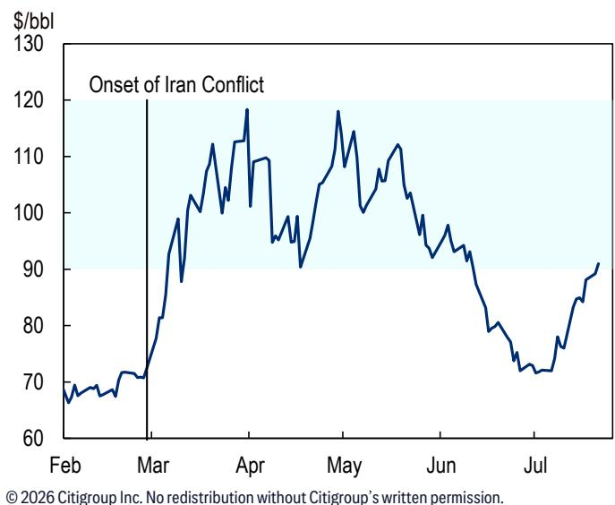
© 2026 Citi Inc. 未经Citi书面许可不得转载。
来源：Citi, Bloomberg

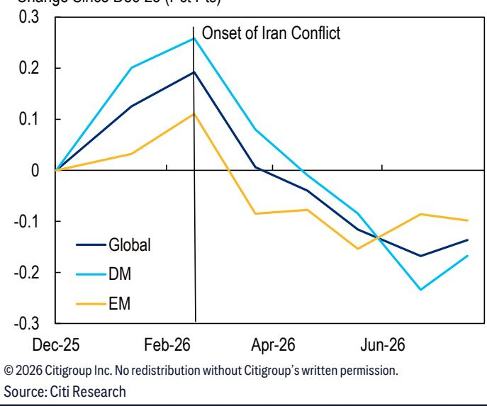

好消息是，全球宏观环境展现出持续的韧性。我们对今年增长的预测约为2.5%，仅比冲突爆发时下调了零点几个百分点（图2）。近年来，全球宏观环境展现出显著的能力来抵御冲击并继续录得稳健增长。我们认为，这反映了经济供给侧灵活性和适应性的增强，这得益于促进信息获取和实时通信的技术创新。

图3. 全球PMI：制造业与服务业
50+=扩张
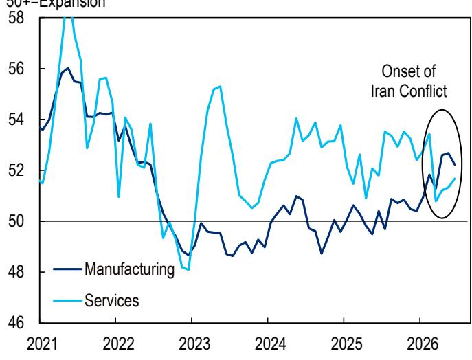
© 2026 Citi Inc. 未经Citi书面许可不得转载。来源：Citi, S&P Global, Haver Analytics

图4. 全球电子行业PMI与计算子指数 50+=扩张（3个月移动平均）
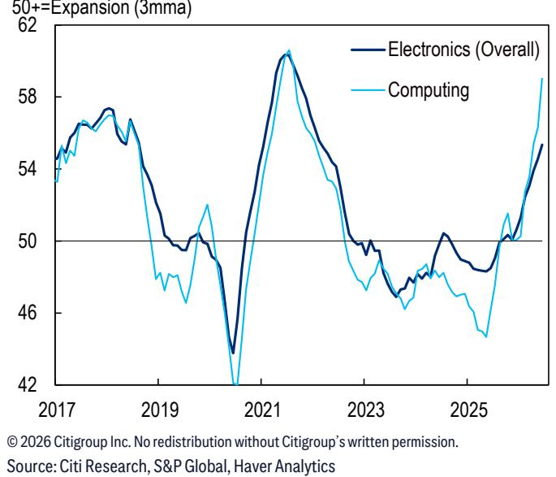
© 2026 Citi Inc. 未经Citi书面许可不得转载。
来源：Citi, S&P Global, Haver Analytics

这一主题得到了全球PMI近期表现的强化（图3）。全球服务业PMI在紧张局势爆发时有所回落，但此后已回升并稳定运行在50以上——这是扩张与收缩的分界线。制造业PMI自去年年底以来一直处于上升趋势。这反映了在2025年底强大的代理工具发布后，人工智能支出的蓬勃发展。与此观察一致，全球电子行业PMI近几个月来大幅上升（图4）。制造业PMI也反映了一些暂时性因素，包括为抢在冲突造成的干扰之前而激增的库存需求。

尽管油价上涨，但全球宏观环境总体上得到了人工智能支出增长的支撑。根据我们的估算，美国的人工智能投资——我们有最清晰的数据——已从去年的不到3000亿美元（占GDP的1%）激增至第一季度的4300亿美元。对于2026年全年，行业估计可能支出为6000亿美元（接近GDP的2%）。

在我们看来，这种人工智能支出具有相当大的势头，看起来强劲且可能持续。然而，鉴于其上升的速度以及已经出现的高估值，增速放缓——甚至暂时逆转——是我们仍在关注的可能的下行可能性。尽管存在短期波动的风险，但我们相信人工智能是一项强大的技术，将在长期内显著提高生产率增长水平。

这些主题在国家层面也得到了呼应。图5显示了自美国与相关地区冲突爆发以来，我们对增长预测的修正。值得注意的是，三个技术密集型经济体——台湾、韩国和新加坡——近几个月来出现了显著的上调，因为飙升的人工智能需求支撑了增长。相反，我们对不生产人工智能的石油进口国的预测已明显下调，包括菲律宾、瑞典、智利和欧元区。我们对美国的预测仅下调了零点几个百分点。

图6对我们的整体通胀预测进行了同样的分析。我们的全球预测自2月以来上调了0.75个百分点。这反映了油价上涨的直接影响，以及供应链中断、运输成本增加和持续的二轮效应带来的间接压力。

在国家层面，包括美国、欧元区、越南和巴西在内的一系列经济体的整体通胀预测已上调了整整一个百分点，而泰国和菲律宾的上调幅度则更大。在那些增幅较小的国家中，包括印度尼西亚、中国和印度在内的几个国家，已有机制来限制油价上涨向国内通胀的传导。

图5. 2026年增长预测：自2月以来的变化（Citi）
百分点
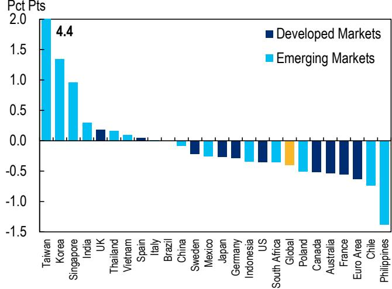
© 2026 Citi Inc. 未经Citi书面许可不得转载。
来源：Citi

图6. 2026年整体通胀预测修正（Citi）\* 百分点
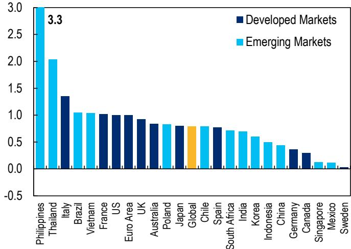
© 2026 Citi Inc. 未经Citi书面许可不得转载。
\*自2月预测的变化；美国预测为PCE。
来源：Citi

显然，我们的通胀预测存在上行和下行风险，这取决于油价到年底的走势。如果美国与相关方重返谈判，且航道石油运输恢复，通胀仍有可能低于我们的预测。然而，如果油价回升至每桶100美元以上，也存在通胀上升的风险。

总之，全球宏观环境在伊朗冲突和霍尔木兹海峡关闭后，因油价上涨而吸收了一次显著冲击。正如近期事态发展所凸显的那样，这一冲击仍然非常活跃。虽然由此产生的压力和不确定性对全球表现产生了一定影响，但迄今为止的影响比我们预期的更为可控。

图7. GDP的能源强度
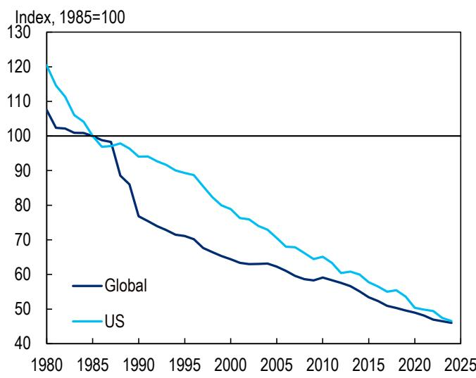
© 2026 Citi Inc. 未经Citi书面许可不得转载。来源：Citi, Energy Institute, Haver Analytics

图8. 全球库存：石油与精炼产品
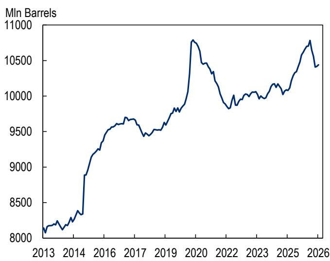
© 2026 Citi Inc. 未经Citi书面许可不得转载。
来源：Citi, OilX, OECD

这一观察使我们对今年剩余时间的前景相对更为乐观，即便能源市场的压力可能持续存在。现实情况是，与过去几十年相比，全球宏观环境对能源的依赖程度有所降低（图7）。此外，去年积累的大量石油库存仅部分被消化，全球库存水平总体仍然充足（图8）。

我们文章的其余部分将基于这一讨论，审视全球主要央行面临的变化格局及相关政策挑战。相对于冲突爆发前的预期，货币政策似乎正走上一条不那么具有支持性的轨迹，因为各央行正寻求将通胀恢复到其目标水平。

## 全球主要央行

今年年初，全球主要央行正处于宽松周期之中，这正在解除疫情后的加息（图9）。然而，自伊朗冲突爆发以来，各央行面临着日益加剧的通胀压力，并且在许多情况下，实现其目标的努力出现了倒退。虽然这种倒退主要是由油价上涨驱动的（图10），但许多央行对于重拾疫情后"看穿"不断演变的供给冲击的策略犹豫不决。尽管这种更强烈的反应有"过度学习"上一轮教训的风险，但央行的沟通和市场定价已明显转向更紧缩的政策方向。

图9. 全球主要央行：加息者 vs. 降息者
央行数量
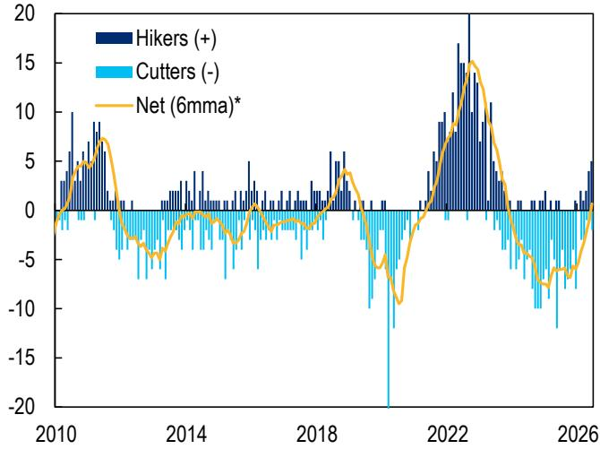
\*在27家主要央行中，净加息（+）或降息（-）的数量。来源：Citi, 各国统计来源, Haver Analytics

图10. 全球通胀\*
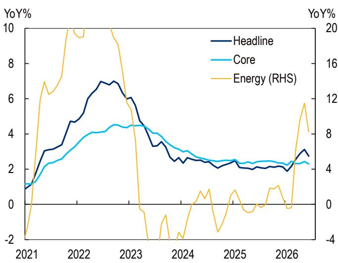
© 2026 Citi Inc. 未经Citi书面许可不得转载。
\*整体、核心和能源通胀覆盖15个经济体。
来源：Citi, 各国统计来源, Haver Analytics

图11. 2026年政策利率变化（Citi预测）
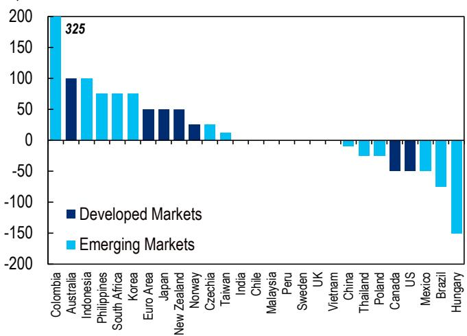
© 2026 Citi Inc. 未经Citi书面许可不得转载。
来源：Citi

图12. 2026年底政策利率预测：自2月以来的变化（Citi）
百分点
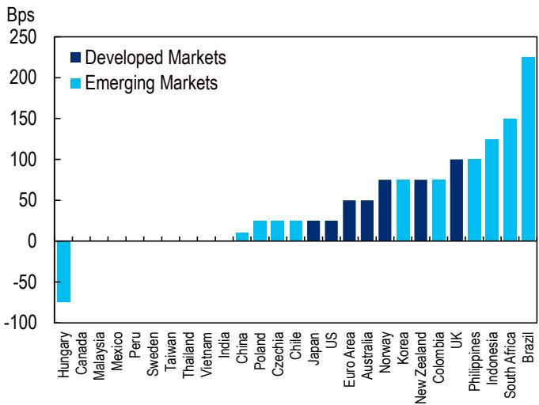
© 2026 Citi Inc. 未经Citi书面许可不得转载。
来源：Citi

在我们追踪的27家主要央行中，降息者与加息者之间的平衡已转向不那么支持性的政策。例如，在6月份，有五家央行加息，包括欧洲央行、日本央行和印度尼西亚央行。因此，我们现在预计这27家央行中有十二家将在今年加息，另外七家将按兵不动（图11）。在预计将降息的八家中，有六家的降息幅度为50个基点或更少。只有巴西和匈牙利预计将有更显著的降息。

这与伊朗冲突前的情况明显不同。在我们追踪的央行中，有十七家现在的政策路径比2月底时更为紧缩，另外九家的政策路径没有变化（图12）。预计年底政策利率在巴西收紧超过200个基点，在菲律宾、英国、印度尼西亚和南非收紧100个基点或更多。只有匈牙利预计将采取更宽松的政策；在这种情况下，总统选举后福林升值给了央行更大的提供支持的空间。

伊朗冲突的一个令人信服（且持续）的解决方案仍可能带来油价的大幅下行轨迹。但就目前而言，这种解决方案看起来并不迫在眉睫。虽然我们预计谈判将恢复，但它们可能会继续充满波折、不平衡且旷日持久。因此，相关航道的压力以及相应的能源市场不确定性，看起来将在未来一段时间内继续存在。

我们以对美联储、欧洲央行和日本央行面临的不同政策情况的简要讨论来结束本节。这些快照为全球央行面临的广泛挑战提供了有用的见解。

美联储。自宣誓就职以来，主席Kevin Warsh消除了对美联储政策出现急剧鸽派、政治性转变的担忧。他强调了在设定美联储政策利率方面保持独立的承诺，并强调了美联储需要加倍努力以实现其2%的通胀目标。美联储已连续五年超出其目标——并且今年很可能再次无法达标（图13）。因此，Warsh在其政策偏好方面采取了略显鹰派的基调，尽管他严格避免任何可能被解读为"前瞻性指引"的言论。

市场继续定价今年年底前美联储加息一到两次。相比之下，我们的美国经济学家仍然担心劳动力市场的持久性，尽管过去六个月表现强劲，他们预计美联储将在今年最后两次会议和明年第一次会议上降息。

主席Warsh也在深入思考美联储货币政策的基本方法。他已委托五个工作组研究一系列关键问题。其中，我们认为研究沟通和资产负债表的工作组尤其重要，因为它们是美联储最终必须解决的开放政策问题。当然，这些也是FOMC参与者可能持有深刻看法的主题，因此工作组的结果几乎不会是决定性的。

其他三个工作组——关于通胀预测、生产力和数据协议——无疑也将产生相关见解并影响美联储政策的更广泛框架。然而，它们是复杂的问题，其影响远远超出美联储的具体政策职权范围。

© 2026 Citi Inc. 未经Citi书面许可不得转载。
来源：Citi, Eurostat, Haver Analytics

图13. 美国核心通胀
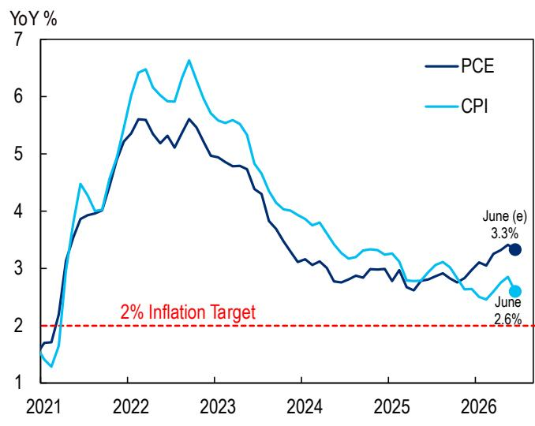
来源：Citi, BLS, BEA, Haver Analytics

图14. 欧元区通胀
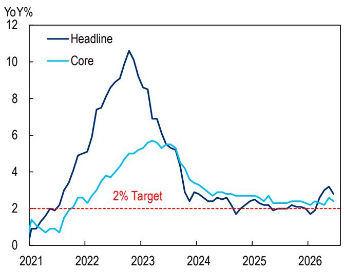

欧洲央行。面对近期的石油冲击，管理委员会一直专注于不重复疫情后时期的政策错误，当时它等待了太久才收紧。考虑到这一点，欧洲央行在6月会议上加息，我们预计另一次加息即将到来，要么在本周晚些时候的会议上，要么（更可能）在9月。虽然油价已从春季高点回落，但政策制定者仍将看到足够的二轮效应压力，以及油价上涨的持续风险，来证明另一次加息是合理的。

如图14所示，整体通胀已明显高于欧洲央行2%的目标。即便如此，当前情况与几年前通胀爆发几乎不可同日而语。整体通胀在5月升至3.2%，但随后在6月回落至2.8%，因油价有所缓和。与此同时，核心通胀徘徊在约2.5%附近。因此，我们认为欧洲央行的收紧在很大程度上是一次先发制人的行动，以加强其信誉并确保通胀预期保持良好锚定。在这方面，欧洲央行选择了比美联储明显更为鹰派的政策路径，至少到目前为止是这样。

日本央行。日本央行继续其逐步正常化政策的轨迹。在经历了数十年的过低通胀之后，行长植田和男一直乐于在结构上落后于曲线。日本央行的政策滞后于经济再通胀的步伐，以谨慎确保经济状况的转变完全稳固。政策的目的是避免急躁，并防止无意中阻碍持续实现2%的通胀。

然而，支持日本央行更积极加息的理性理由正在增强。首先，高市政府的政策旨在实现"高压"经济。其次，日本劳动力市场的状况已发生显著变化。例如，春季工资谈判在过去三年中取得了超过5%的涨幅。第三，日元已跌至历史低位，债券市场的压力似乎正在加剧（图15和16）。因此，有越来越令人信服的理由要求显著收紧货币政策。

图15. 日元汇率\*

© 2026 Citi Inc. 未经Citi书面许可不得转载。

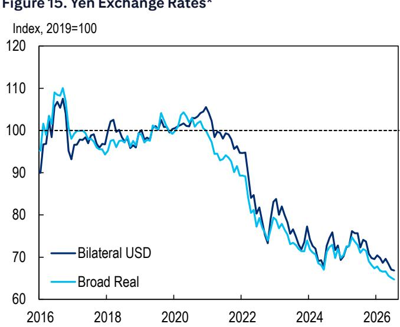
\*数值增加表示日元升值（美元贬值）；广义实际汇率为价格调整后，针对所有贸易伙伴。
来源：Citi, Bloomberg

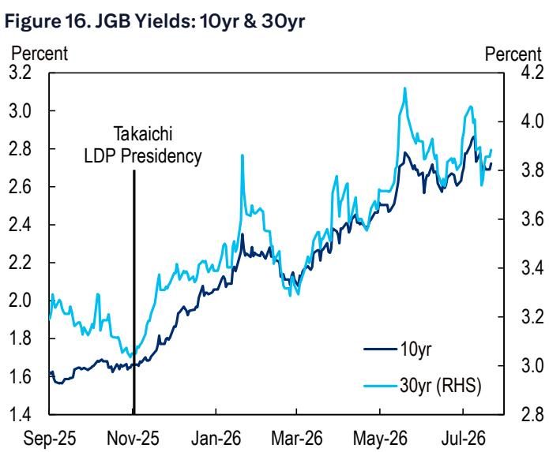
© 2026 Citi Inc. 未经Citi书面许可不得转载。
来源：Citi, Bloomberg

至少，行长植田和男及其同事应仔细考虑收紧政策的理由。一个关键问题是，日本央行的这种转向将如何被高市政府接受，以及政府的抵制在多大程度上会成为日本央行的制约因素。无论如何，随着经济的持续扩张，日本央行和高市政府可能需要在不久的将来解决这个问题。

# 7月预测概览

有关我们的预测，请点击此处。

图17. 选定经济体GDP和CPI通胀预测

[表格内容保留]

图18. 选定经济体政策利率预测（%）

[表格内容保留]

图19. 选定经济体预测

[表格内容保留]

图20. 选定经济体10年期回报表现（%）

[表格内容保留]

# 重点经济体讨论

## 北美

### 美国

稳健的活动、稳定的失业率以及粘性的核心PCE通胀，使得市场定价美联储在未来十二个月内加息。我们仍然认为，美联储的下一次行动更可能是降息而非加息。我们预计，核心通胀年化率接近2%，以及核心CPI同比在夏季数据中降至2.2%，将使美联储官员能够在劳动力市场进一步走弱时降息。我们的基准情景包括在10月、12月和1月降息，使政策利率降至2.75-3%。第一季度GDP增长2.1%，消费者支出增长放缓，但人工智能相关投资保持强劲。第二季度消费增长追踪数据略强，整体GDP可能增长约2%。我们继续预计2026年将实现稳健增长，部分原因是人工智能相关商业投资的持续强劲。

核心PCE通胀同比一直粘性在3%以上，而核心CPI则显著放缓，这是一种异常的分化，因为CPI通常比PCE更强。到目前为止，能源价格向核心通胀的传导并不大，而油价从过去几个月高点的回落应能限制上行空间。核心PCE通胀具有粘性，部分原因是人工智能相关商品（如计算机软件和配件）价格上涨，这些商品在PCE中的权重远高于CPI。9月份对该类别及其他几个类别的方法论变更，应意味着年度核心PCE下调20-30个基点。

月度就业增长在过去一年中逐月波动很大，但6个月移动平均线有所回升。6月份就业增长再次开始放缓，我们预计短期内这一趋势将持续。失业率在过去几年中逐步上升，但在过去几个月中保持在4.2-4.4%的狭窄范围内。我们预计未来几个月劳动力需求将保持弱于劳动力供给，这将给失业率带来进一步的上行压力。劳动力市场的特点仍然是低招聘率，但也低裁员率，并且由于工资增长放缓，它不是通胀压力的来源。

新任美联储主席Warsh继续不就政策利率提供前瞻性指引。其他美联储官员普遍偏向鹰派，关注PCE通胀。Warsh已宣布成立几个工作组，将致力于沟通、资产负债表、数据来源、通胀框架以及生产力/就业等各项优先事项。

图21. 美国——经济预测

[表格内容保留]

### 加拿大

季度GDP增长今年可能仍将波动，受到贸易模式重大转变的影响。GDP连续两个季度收缩，产出缺口仍为负值。第一季度消费出人意料地疲软，而人口增长放缓和利率上升等不利因素今年进一步拖累消费。第二季度GDP增长追踪数据较强，但平均增长仍然疲软。

失业率在过去一年中保持在6.5-7.0%左右的范围内。工资增长在因一些构成问题而推高几个月后，放缓至4%以下。我们预计，尽管人口增长放缓，但劳动力需求仍然疲软，失业率将在下半年保持高位。约6.5-7%的失业率表明产出缺口仍为负值。

整体通胀在6月放缓至同比2.8%，核心指标非常疲软，低于2%。年度核心通胀（CPI-trim和CPI-median的平均值）已连续几个月接近或低于2%。CFIB价格计划跳升等数据使我们对第二季度核心通胀可能更具粘性的一些短期风险保持谨慎，类似于去年。但也像去年一样，我们预计需求疲软最终将使核心通胀保持低迷，今年加息的可能性非常低。房价同比下跌，房价的前瞻性指标普遍疲软。

加拿大央行在过去几次会议上将政策利率维持在2.25%不变，这是中性区间的低端。尽管市场定价了一些加息的可能性，但我们预计加拿大央行今年将继续降息，终端利率为1.75%，因为活动、劳动力市场和核心通胀数据仍然疲软。在房价下跌且核心通胀处于目标水平的环境下，加息对我们来说似乎不太可能。

图22. 加拿大——经济预测，2024-2026F

[表格内容保留]

## 欧元区

仍然滞胀——尽管油价波动，但自上一期全球宏观环境观察以来，我们的通胀预测大致未变，整体通胀预计仍将保持在接近3%的同比水平，直到2027年初。这在一定程度上反映了春季推出的能源税减免的逆转，这使能源通胀保持高位，部分原因是我们仍预计食品价格将在今年晚些时候加速（厄尔尼诺的潜在影响与更高的运输成本和化肥短缺叠加）。我们预计能源价格上涨对核心价格的影响有限且间接，主要体现在核心商品上，核心HICP到年底将小幅上升至2.5%的同比水平。

韧性增长（爱尔兰除外）——爱尔兰GDP的波动使我们本月上调了欧元区2026年GDP预测（上调0.3个百分点至0.6%）。但这仍然是比2025年（1.3%）更弱的增长，我们将放缓主要归因于美国关税对出口的延迟影响，在去年早些时候大量前置之后，这种影响在2025年第四季度和2026年第一季度显现。除爱尔兰外，欧元区增长近期一直非常稳定，年化率略高于1%（国内需求约1.5%）。第二季度高频数据表明保持了类似的速度，服务业的一些放缓被制造业的温和复苏所抵消。我们预计，在财政刺激高峰的推动下，2027年增长将加速至1.4%。欧洲增长应受益于"自主支出"（国防、绿色、技术投资）和全球科技投资周期。

欧洲央行：通胀必须被摧毁——欧洲央行在6月实施了25个基点的"鹰派"加息，会后我们几乎没有理由否定今年第二次加息的可能性。近期油价波动和低于预期的6月通胀可能使欧洲央行跳过7月会议，但鉴于通胀可能在2026年下半年保持在接近3%的水平，且通胀上行风险（来自人工智能、厄尔尼诺、能源中断等）再次明显加剧，我们仍然认为另一次25个基点的加息是基准情景，最可能的时机在9月。

图23. 欧元区——经济预测

[表格内容保留]

### 德国

在经历了第一年的明显瘫痪之后，德国政府开始了某种形式的改革"闪电战"。在承诺全面实施专家委员会的改革提案之后，接着是（适度的）所得税改革以及提高劳动力市场灵活性和减少繁文缛节的计划。今年春天早些时候已达成一致的公共医疗保险体系改革现在也将成为法律，尽管在修改后略微削弱了最初草案的影响。

### 法国

与欧元区同行相比，法国内需仍然疲软，通胀相应较低。从表面上看，在能源价格冲击时期，后者可能是积极的，但由此产生的较高实际利率使经济相对更容易受到货币政策收紧的影响。失业率已经在上升，由于财政政策过于受限而无法提供支持，我们认为短期内情况可能进一步恶化。

### 意大利

我们逆转了近期对预测的一些滞胀调整，2026-27年增长小幅上调，但通胀自6月以来基本未变（当时已大幅下调）。我们仍然认为意大利增长在2026年受到NGEU支出的支持，2027年受到德国财政刺激和欧洲国防投资的支持。我们预计，即使在下一次大选（可能在2027年春季）之后，政府的财政保守主义也将持续，对BTP的需求将保持强劲，未来有可能进一步上调信用评级。

### 西班牙

由于更多地依赖可再生能源和液化天然气，西班牙比其他地区更好地抵御了能源冲击。今年增长稳健，约2.5%，受到NGEU支出、大量移民流入和结构性失业下降的支持。我们预计这些顺风将在2027-28年有所减弱但仍将存在。房地产复苏可能因欧洲央行利率上升而放缓。

图24. 德国、法国、意大利和西班牙——经济预测

[表格内容保留]

## 英国

英国GDP再次展现出韧性。第一季度英国产出增长意外上行，环比增长0.6%。结果是我们机械地上调了2026年GDP预测至1.1%——略高于我们在2月的预期。然而，我们对此解读持谨慎态度。过去几年，第一季度表现优异已成为一种趋势，以至于季节性调整过程受到质疑。我们认为，这看起来与上一年第四季度的递延消费和投资有关，过去几年预算过程在经济中产生了异常程度的不确定性，并将部分产出从第四季度转移到了第一季度。虽然我们预计国家统计局的季节性调整过程最终会捕捉到这一点，但就目前而言，这也意味着我们假设全年增长轨迹较弱，2026年第四季度增长仅为0.1%的环比，以捕捉这一趋势。

通胀路径仍存在疑问。通胀预测面临的挑战与上一期全球宏观环境观察时相同：霍尔木兹；能源账单的财政干预；向二轮效应的传导程度。这些因素中的每一个仍然是未知数，在缺乏明确信息的情况下，我们基本维持预测不变。也就是说，我们继续预计非核心通胀将飙升，而服务业仅出现有限的二轮效应。我们在监测预测时继续关注两个主题。第一个是政府是否选择干预能源账单。这样做将在机械上降低第三季度通胀，但如果没有高价格本应带来的需求破坏，则面临2027年通胀走势强劲的风险。第二个是霍尔木兹，在缺乏解决方案的情况下，随着我们接近夏季，主要存在上行风险。

财政政策面临熟悉的挑战。财政部面临的三难困境——不断增长的支出压力、财政规则以及限制大规模增税能力的宣言——再次成为焦点。随着财政规则的回旋余地继续被侵蚀，这一点更加突出。虽然大部分压力来自借贷成本上升和计划中的燃油税上调的逆转（参见：欧洲经济学——能源价格冲击是否破坏了财政刺激？），但进一步的压力正在增加。首相最近宣布了额外的180亿英镑国防支出——虽然缺乏细节，例如这笔支出是落在CDEL还是RDEL，以及时间框架——但这将增加这些压力。第三和第四季度的能源价格上限也将值得关注。虽然我们认为第三季度的上限将在没有干预的情况下通过（部分原因是燃油税的变化），但随着我们接近冬季，政府可能面临支出以保护家庭的压力。

货币政策仍按兵不动。我们继续维持银行利率将在2026年剩余时间内保持在3.75%不变的观点。与当前市场曲线相比，我们的观点是鸽派的，然而我们认为这是合理的，因为MPC的许多成员在最近的沟通中表示，鉴于他们对潜在增长近期疲软的预期，按兵不动将被视为限制性的。

图25. 英国——经济预测

[表格内容保留]

## 北欧

### 瑞典

GDP复苏仍在继续，尽管第一季度出现暂时挫折，但劳动力市场仍显示出松弛迹象，国外增长放缓仍对出口构成压力。基于第二季度稳健的月度数据，我们将2026年增长预测上调至略高于2%。瑞典处于有利地位，可以从全球科技投资周期以及欧洲其他地区的绿色和国防投资中受益。由于通胀仍低于目标，我们预计瑞典央行将按兵不动，政策利率维持在1.75%的周期性低点直至2027年底。

### 挪威

2026年上半年增长弱于预期，因此我们下调了2026年预测。但我们仍然认为增长将暂时恢复到潜在水平（0.3-0.4%的环比）。国内通胀一直顽固地居高不下，在5月引发了新的货币政策收紧：我们预计挪威央行将在8月再次加息。

图26. 瑞典、挪威和瑞士——经济预测

[表格内容保留]

## 日本

本月早些时候发布的日本央行短观调查显示，商业景气度好于预期，资本支出计划和其他组成部分也指向韧性结果。与此同时，过去几个月消费者价格继续低于2%，受到食品通胀放缓以及政府应对高能源价格措施的支撑。然而，随着中东局势导致油价上涨的影响开始更充分地传导至CPI——通常有大约六个月的滞后——预计通胀将从夏季开始再次升至2%以上，可能在年底和明年初暂时接近3%。也就是说，目前日本宏观环境中更紧迫的问题是市场对政府财政立场的反应，此前即将发布下一财年预算的"骨太"经济财政运营与改革基本方针。对高市政府扩张性财政立场的担忧——该政府倡导"负责任的积极财政政策"——继续对日元和债券市场构成压力，抛售压力持续到7月。

对于日本央行的货币政策而言，日元和日本国债回报表现的市场走势目前可能对政策决策的影响大于近期经济数据发布。我们继续预计每六个月一次的两次进一步加息——在今年12月和明年6月——使当前加息周期的终端利率达到1.5%。然而，如果对日元疲软和落后于曲线风险的担忧过度加剧，不能排除加息步伐加快或终端利率高于当前假设的可能性。关键风险因素包括财政担忧进一步恶化、企业价格传导日益激进，以及美联储更加鹰派可能引发日元进一步走弱。由于日本央行在上个月的会议上加息，本月会议按兵不动是普遍预期。尽管如此，焦点将放在是否有任何委员会成员主张加息，以及《展望报告》中更新的经济和价格展望。

图27. 日本——经济预测

[表格内容保留]

# 澳大利亚与新西兰

### 澳大利亚

中东的反复给近期前景增加了不确定性，即通胀前景，风险偏向上行。下周第二季度通胀数据将是决定澳大利亚央行是否再次加息的关键数据点。我们的基准情景是11月再加息25个基点，但如果下周的CPI高于预期，我们可能将此提前至8月。实际现金利率仍勉强高于零，劳动力市场仍然紧张，最低工资从第三季度开始稳步增长。到今年年底，澳大利亚央行可能面临超级厄尔尼诺天气事件的前景，这可能带来干旱条件和对农业生产的负面供给冲击。这将是澳大利亚在过去10年中遭受的第三次厄尔尼诺事件。因此，我们继续认为2026年下半年风险偏向鹰派。

### 新西兰

新西兰联储于7月开始加息周期，将OCR上调25个基点，符合广泛预期。稳健的第一季度GDP以及对前四个季度中三个季度的向上修正，消除了经济的负产出缺口。该行指出，第二季度增长可能进一步改善。向上修正表明，经济对之前的宽松货币政策反应更为积极，新西兰联储在8月货币政策声明中可能需要对更高的失业率预期进行下调。第二季度CPI也基本符合该行的观点。然而，虽然油价推动了整体通胀1.5%的上涨，但有早期迹象表明，中东冲突的二阶效应正在影响更广泛的通胀。例如，住宅建设成本因材料价格上涨而增加。鉴于新西兰联储将中性利率定在3.00%至3.50%之间，MPC需要解除过度的宽松。我们预计MPC将在9月2日再进行25个基点的加息，将OCR提升至2.75%。

图28. 澳大利亚和新西兰——经济预测

[表格内容保留]

## 中国

GDP增长在2026年第二季度放缓幅度超过预期。季度同比增速降至4.3%，为2023年以来最低。国家统计局报告的环比增速降至0.9%（季调后），也是四年低点。第二季度的季度数据不及预期提醒我们，在K型经济中，整体韧性并非理所当然。[1] 人工智能引领的新经济继续强劲运行。国家统计局指出，新经济对增长的贡献超过40%。6月出口超出预期，同比增长27.0%，其中集成电路出口同比增长121.9%，翻了一番以上。国内工业生产也反弹至同比增长5.3%，高科技产业增加值保持稳健，同比增长14.1%。[2] 旧经济没有回升迹象。以旧换新补贴的加速和基数效应推动零售销售在6月恢复增长，同比增长1.0%，但仍处于低位，而2026年上半年居民储蓄率仍高达40.0%。投资下滑没有缓解迹象，据我们估算，固定资产投资增速仍低至-10.0%的同比。房地产行业的积极迹象似乎得以持续，一线城市销售量和价格保持稳定，但这一趋势尚未扩大到其他地区。

我们预计在数据不及预期后，后续将有增量政策出台。即将召开的政治局会议可能提供更多政策信号。我们继续预计基准情景下人民银行将降息10个基点，并加快财政执行。我们预计降息10个基点将在2026年第三季度实施，人民银行在7月保持LPR不变。我们还预计，随着部署加速，2026年下半年实际财政紧缩将逆转，名义增长在2026年第二季度反弹至6.0%的同比，可能给财政部一些回旋余地。诸如"六网"计划等针对性措施，以支持人工智能转型和稳定投资，可能是关键重点。

我们将全年预测从此前的4.7%下调至4.6%的同比。第二季度不及预期是一个驱动因素。潜在的极端天气事件，如台风、暴雨或洪水，可能导致暂时供应中断，限制后续反弹的步伐：受台风巴威和其他天气事件影响，7月前三周货运量同比下降11.3%。我们预计GDP增长将在2026年第三季度反弹至4.5%的同比，2026年第四季度为4.6%的同比。

图29. 中国——经济预测

[表格内容保留]

## 印度

核心通胀仍无警报：整体通胀在2026年6月升至4.38%的同比，为一年半高点，较5月上升45个基点。这是由食品和能源通胀急剧上升推动的，各贡献约20-25个基点，而核心通胀保持在3.9%的同比不变。我们维持2027财年平均预测：整体通胀4.7%的同比，核心CPI为4.5%的同比。

货币政策：8月印度储备银行MPC可能将2027财年平均CPI预测（5.1%的同比）下调约20个基点，从而减少立即加息行动的必要性。核心通胀略有上升，但来自极低水平，且仍在印度储备银行的舒适区内。印度储备银行可能会关注能源冲击对核心通胀的任何二轮效应的持续性，我们认为，只有当核心通胀持续高于4.5%时，加息的可能性才会出现。我们预计这一条件短期内不太可能满足，因此预计2026年不会加息。然而，有一些风险需要关注。首先，中东敌对行动重新爆发的影响再次给能源/石化价格带来压力。其次，潜在厄尔尼诺冲击对食品价格（特别是蔬菜/豆类/油籽）的干扰可能会滞后显现。尽管7月初有所改善，但降雨量仍比正常水平低24%。截至7月中旬，作物播种面积仍同比下降6%，约占总播种面积的54%。在不利情景下，这些供给侧冲击可能潜在地与需求侧（高零售信贷增长）相结合，从而需要印度储备银行采取行动。

国际收支与印度卢比：我们此前将2027财年国际收支展望上调至450亿美元盈余，而战时峰值赤字为500亿美元，假设净石油进口账单节省315亿美元，以及印度储备银行各项优惠掉期措施带来额外550亿美元流入。关于前者，布伦特价格再次徘徊在每桶90美元左右；每增加10美元/桶，年度经常账户赤字至少增加150亿美元的上行压力。关于后者，在印度储备银行发布数据之前，市场对总流入的预期正在降温，因为有报道
