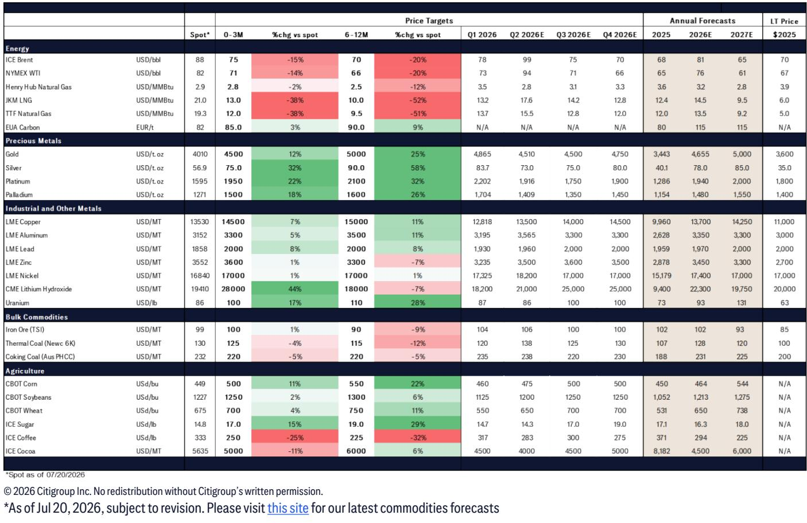
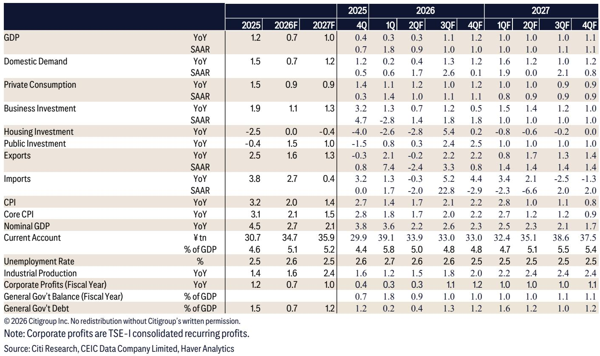
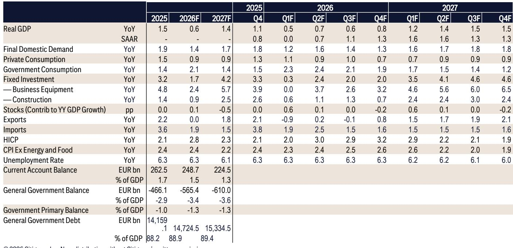

# Citi：研究主题与行业变化观察

全球宏观环境在经历伊朗冲突与霍尔木兹海峡关闭带来的油价冲击后，并未出现市场此前担忧的显著下滑。Citi最新发布的全球宏观展望报告显示，其对2026年全球宏观环境增长的预测仍维持在2.5%附近，仅比年初下调了零点几个百分点。这一判断的核心支撑来自两个方向：一是全球宏观环境对石油的依赖度已较过去数十年明显降低，二是AI相关研究的快速增长正在对冲能源冲击带来的节奏变化不确定性。

报告同时指出，全球通胀预期较2月已上调约0.75个百分点，主要反映油价直接传导效应以及供应链中断、运输成本上升等间接影响。在这一背景下，主要央行的政策路径已发生明显转向。

## 1. AI研究规模快速攀升，对宏观环境增长形成结构性支撑

Citi估算，美国AI研究已从2025年的不到3000亿美元（约占GDP的1%）跃升至2026年第一季度的4300亿美元。行业全年预估显示，这一数字可能达到6000亿美元，接近GDP的2%。报告认为，这一研究浪潮正在向中国、台湾、韩国、日本和新加坡等地区扩散，成为全球制造业PMI自2025年底以来持续回升的重要驱动力。

全球电子行业PMI近几个月出现明显上行，与AI相关硬件和基础设施需求扩张高度吻合。Citi同时提醒，考虑到AI研究增速之快以及相关资产估值已处于较高水平，增速节奏变化甚至短期回调是值得关注的潜在不确定性。

> **KC评论：** 报告将AI研究视为当前全球增长中少数可量化的结构性增量。读者在观察各国增长预测差异时，可以留意一个简单框架：AI产业链参与度越高的地区（如台湾、韩国、新加坡），其增长预测上调幅度越大；而石油进口依赖度高且AI参与度低的地区，则面临更明显的下调不确定性。

## 2. 全球央行政策路径转向收紧，加息与观望成为主流

Citi对27家主要央行的政策路径进行了重新评估。目前预计其中12家将在2026年加息，7家维持利率不变，仅有8家预计降息，且其中6家降息幅度不超过50个基点。这一格局与伊朗冲突爆发前形成鲜明对比。

报告特别指出，美联储主席Kevin Warsh上任后已明确传递出对通胀目标的坚定承诺。美联储已连续五年未实现2%的通胀目标，且2026年大概率继续偏离。市场定价目前反映年内1至2次加息预期，但Citi美国宏观环境学家团队对劳动力市场可持续性仍持谨慎态度，预计美联储可能在今年最后两次会议及明年第一次会议实施降息。这一分歧本身即反映了当前政策路径的不确定性。

## 3. 油价情景仍存较大变数，通胀路径取决于地缘走向

Citi在报告中列出了油价的两条可能路径：若霍尔木兹海峡航运恢复，布伦特油价可能回落至70美元/桶；若紧张局势持续升级，油价可能稳定在100美元/桶以上。报告认为，考虑到11月美国中期选举临近，特朗普政府倾向于缓和路线，前提是伊朗愿意谈判并履行协议。但谈判过程预计将充满波折且旷日持久。

在这一框架下，各国通胀预测的分化值得关注。美国、欧元区、越南和巴西的通胀预测上调幅度均达到1个百分点，而泰国和菲律宾的调整幅度更大。印尼、中国和印度则因存在抑制油价传导至国内通胀的机制，通胀预测上调幅度相对较小。

## 4. 全球宏观环境韧性背后是供给端灵活性与技术创新的累积效应

Citi在报告中多次强调一个观察：近年来全球宏观环境展现出较强的冲击吸收能力。报告认为，这背后是供给端灵活性和适应性的持续提升，技术革新带来的信息获取便利和实时沟通能力是重要驱动因素。全球服务业PMI在冲突爆发初期短暂回落后已回升至扩张区间，制造业PMI则延续自2025年底以来的上行趋势，这些数据共同构成了“韧性”这一判断的实证基础。

此外，全球石油库存仍处于相对充裕水平，2025年积累的大量库存仅部分被消耗，这为油价冲击提供了缓冲空间。报告据此认为，即便能源市场不确定性持续，2026年剩余时间的宏观环境前景仍可维持相对乐观的判断。

---

For informational purposes only. Portions may be generated,translated,summarized,or edited with AI assistance based on source materials and may contain omissions or errors. Please verify independently. This is not investment,legal,tax,accounting,or other professional advice.

For informational purposes only. Portions may be generated,translated,summarized,or edited with AI assistance based on source materials and may contain omissions or errors. Please verify independently. This is not investment,legal,tax,accounting,or other professional advice.

