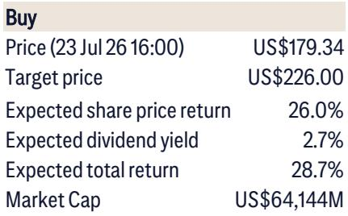
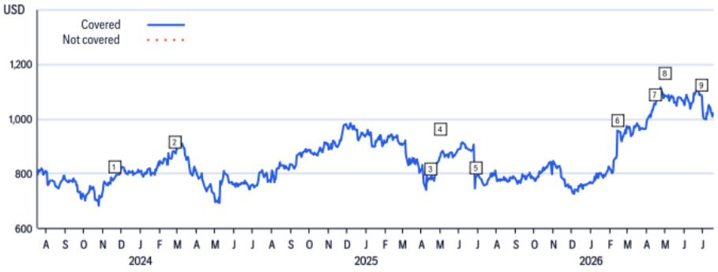
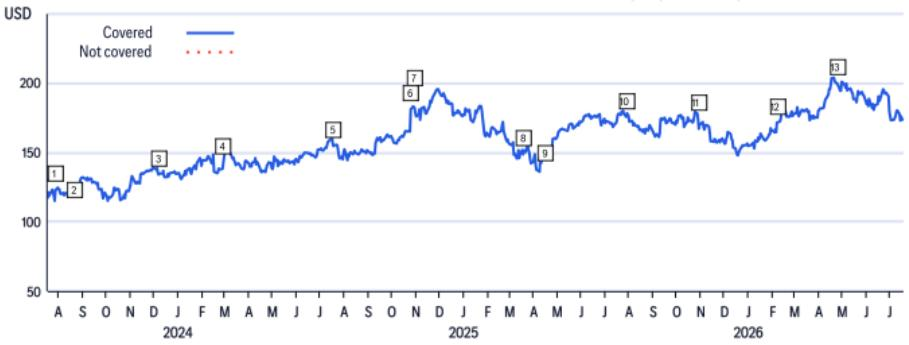

# Digital Realty's Record Backlog and Development Pipeline Signal a Structural Shift in Data Center Economics, Not Just a Cyclical Upswing

Digital Realty Trust reported second-quarter results that revealed an emerging pattern too powerful to dismiss as a temporary pricing spike. Cash renewal spreads hit 25 percent overall, and a staggering 67 percent in the greater-than-1MW segment. These figures are not merely quarterly outliers. They represent the visible consequence of a supply-demand imbalance that is tightening across multiple markets simultaneously, driven by hyperscaler demand, AI workload deployment, and structural constraints on new supply. The company's backlog has reached a record $1.9 billion, representing 30 percent of in-place data center revenue, while its development pipeline now exceeds $20 billion with an 11.5 percent expected ROI and roughly 63 percent of capacity already pre-leased. For those tracking the data center REIT space, the message is unambiguous: the pricing power that emerged in 2024 is not fading. It is compounding.

The significance of this moment extends beyond Digital Realty's own financial trajectory. The company's upward revision of its core FFO per share outlook now implies double-digit growth through 2025, and management has expressed confidence in sustaining that pace into 2027 and 2028. This marks a clear departure from earlier expectations of high-single-digit growth. The source of this upgrade is not a single catalyst. It is the convergence of multiple structural forces: constrained power availability, local opposition to new data center construction, rising replacement costs for older facilities, and a customer base whose capacity requirements are expanding faster than the industry can build. The strategic question for institutional observers is whether to treat this as a peak-cycle phenomenon or as the early innings of a multiyear repricing of data center real estate. The evidence from Digital Realty's operating metrics and forward guidance points decisively toward the latter.

## Record Renewal Spreads Reveal a Structural Supply Constraint That Is Unlikely to Ease Quickly

The 67 percent cash renewal spread in the greater-than-1MW segment is the single most telling data point in the quarter. To understand why, consider what drives renewal spreads in data center leasing. When a tenant's lease expires, the landlord can either renew at a rate reflecting current market conditions or release the space to a new tenant. A spread of this magnitude means that market rents have risen far above the expiring contractual rates. This is not a function of one-off negotiations. It reflects a systemic shortage of available capacity in the markets where Digital Realty operates.

Management noted that second-quarter results benefited from particularly large spreads in Singapore, a market where regulatory hurdles and land constraints have severely limited new supply. But the broader pattern is what matters. Across Digital Realty's portfolio, expiring rates are declining while market rates are increasing, creating an improving mark-to-market opportunity. This dynamic is reinforced by what the report terms NIMBYism and other supply constraints. Local opposition to data center construction is not a temporary phenomenon. It is a structural barrier that raises the cost and extends the timeline for bringing new capacity online. For a company with installed capacity in constrained markets, that barrier becomes a competitive moat.

The implication for observers is straightforward. Renewal spreads at these levels generate incremental cash flow without requiring incremental capital expenditure. Every percentage point of spread improvement flows directly to the bottom line. If the supply-demand imbalance persists or worsens, Digital Realty's existing portfolio becomes an increasingly valuable asset base, and the company's ability to generate organic growth from renewals alone improves materially. The risk is not that spreads normalize. The risk is that they normalize too quickly because new supply enters the market. But the evidence from the development pipeline and the regulatory environment suggests that is unlikely in the near term.

## The 1MW-and-Interconnection Segment Is Becoming a Recurring Revenue Engine, Not a Volatile Add-On

Digital Realty reported $108 million in bookings during the quarter, of which approximately 20 percent were directly attributable to AI deployments. The segment encompassing sub-1MW leases plus interconnection services has become a material and growing contributor to the company's leasing activity. Management indicated that quarterly bookings in this segment could sustain near or above $100 million. For context, that level of recurring volume would make this segment a predictable growth driver rather than an episodic source of upside.

This matters for two reasons. First, the sub-1MW segment captures a different customer profile than the hyperscale leasing that dominates headlines. These are enterprises, financial institutions, and mid-sized technology companies that require colocation space and direct interconnection to cloud providers and network carriers. Their demand is less lumpy than hyperscale deployments and tends to be stickier over multiple renewal cycles. Second, interconnection revenue carries higher margins than raw power-and-space leasing because it involves value-added services such as cross-connects, traffic exchange, and managed networking. As this segment scales, it improves the overall revenue quality of the portfolio.

The AI-related component adds further texture. AI workloads are not monolithic. While large language model training requires hyperscale clusters, inference workloads are increasingly distributed and latency-sensitive, driving demand for edge-adjacent colocation in metropolitan markets. Digital Realty's sub-1MW segment is well positioned to capture this demand. The company's interconnection ecosystems, particularly in markets such as Northern Virginia, Silicon Valley, and London, provide the low-latency connectivity that inference workloads require. As AI adoption broadens from training to inference, the sub-1MW segment could see sustained demand growth independent of the hyperscale cycle.

## Hyperscale Leasing Is Diversifying Across Customers and Geographies, Reducing Concentration Risk

Digital Realty's greater-than-1MW leasing in the quarter was led by the Americas, with management highlighting a record contribution from Sao Paulo. This geographic diversification is important, but the more striking insight is the customer composition. Over the past ten quarters, the top signing came from six different top hyperscalers. That means no single customer dominated the leasing pipeline for an extended period. The hyperscale market is not a one-company story. It is a broad-based expansion across multiple cloud providers, each pursuing independent capacity expansion strategies.

This diversity reduces the risk that a single customer's capital allocation shift could materially disrupt Digital Realty's leasing activity. If one hyperscaler pauses its data center buildout, others are likely to continue. The company's management explicitly noted that while the expanding ecosystem of AI-related customers is additive, Digital Realty remains focused on supporting traditional investment-grade hyperscalers for the largest capacity blocks. This is a deliberate strategic choice. Investment-grade hyperscalers have stronger balance sheets, longer planning horizons, and more predictable demand patterns than emerging AI startups. By prioritizing them for large-scale deployments, Digital Realty anchors its development pipeline to the most creditworthy tenants in the industry.

The geographic dimension reinforces this stability. Sao Paulo's record contribution highlights the growing demand for data center capacity in Latin America, a region where Digital Realty has established a meaningful footprint. Similarly, the Americas region overall continues to drive the majority of hyperscale leasing. The company noted that more than 80 percent of active development is concentrated in the Americas, driven by hyperscale cloud and AI workloads. This geographic focus aligns with the regions where power availability, regulatory certainty, and customer concentration are most favorable. Observers should view this not as a lack of global ambition but as a disciplined allocation of capital to the highest-return opportunities.

## A $20 Billion Development Pipeline with 63 Percent Pre-Leased Provides Multi-Year Visibility into Cash Flow Growth

Digital Realty's development pipeline now stands at more than $20 billion, encompassing roughly 1.4 gigawatts of leased development capacity. That represents approximately a 45 percent expansion relative to the company's existing operating footprint. Even more telling, the pipeline sits within a broader 9-gigawatt growth runway, and management highlighted active customer discussions for nearly 1.5 gigawatts of additional capacity targeted for 2027 and 2028 deliveries. The visibility into future demand is extraordinary by historical standards.

The 63 percent pre-lease rate is the critical metric. Pre-leasing means that tenants have committed to capacity before construction is complete, reducing the risk that newly built space will sit vacant. At an 11.5 percent expected ROI, the pipeline offers attractive risk-adjusted returns, particularly in an environment where interest rates are elevated and the cost of capital has risen. The company's confidence in delivering the required power capacity is supported by the phased timing of capacity coming online, which aligns with utility and grid upgrade schedules.

For observers, the implication is that Digital Realty's earnings trajectory is not dependent on speculative leasing. The backlog has already been converted into contracted revenue. The challenge is execution: delivering projects on time, on budget, and with the power infrastructure that customers require. Management's confidence in this regard is notable, but it is worth acknowledging the risk that power availability constraints could delay some projects. The report explicitly notes that more than 80 percent of active development is in the Americas, where utility interconnection timelines have lengthened in several key markets. Observers should monitor power delivery milestones as a leading indicator of pipeline conversion.

## A Decision Framework for Observers: Evaluate Digital Realty on Backlog Conversion, Renewal Spread Trajectory, and Power Availability

The data from Digital Realty's second quarter provides the inputs for a structured framework. Three metrics should drive the thesis going forward.

First, backlog conversion. The $1.9 billion backlog represents 30 percent of in-place revenue. As this backlog converts to recognized revenue over the next 12 to 18 months, it will provide a visible floor for organic growth. The pace of conversion, combined with the rate at which new backlog is added, will indicate whether demand momentum is accelerating or stabilizing.

Second, renewal spread trajectory. The 67 percent spread in the greater-than-1MW segment is unlikely to repeat every quarter, but the direction of spreads matters more than the absolute level. If spreads remain elevated in the 20 to 40 percent range for the next several quarters, it would confirm that the supply-demand imbalance is structural. If spreads revert to single digits, it would suggest that the market is normalizing. Observers should track this metric as a real-time signal of pricing power.

Third, power availability and development execution. Digital Realty's ability to deliver the 1.4 gigawatts of leased development capacity depends on utility partnerships, regulatory approvals, and construction timelines. Any material delays would push revenue recognition into later periods and could create pressure on the stock if growth expectations are not met. Conversely, successful execution would reinforce confidence in the 9-gigawatt growth runway.

The interplay of these three factors will determine whether Digital Realty's valuation expands or contracts from current levels. The current price of $179 is based on a blend of P/AFFO multiple, cap rate analysis, and discounted cash flow. The DCF analysis assumes 2030 revenue of $10.6 billion with a 44 percent EBITDA margin, implying a 6 percent weighted average cost of capital. These assumptions are reasonable but not conservative. If renewal spreads persist and backlog conversion proceeds as expected, the actual outcomes could exceed these projections.

The risks to the thesis are real and should not be dismissed. Digital Realty's portfolio includes older assets that may require higher maintenance capital spending over time. The company has a higher percentage of lower-yielding power-based-building assets than some competitors, which could drag on returns. Foreign currency exposure in Europe and Asia adds volatility to reported financial performance. Rising interest rates increase the cost of capital and could pressure REIT multiples. And the broader supply-demand dynamics that govern data center pricing are difficult to forecast at the micro-market level, where the most relevant competitive dynamics play out.

Yet the evidence from the second quarter points in a clear direction. Digital Realty is operating in an environment where demand is broad-based, supply is constrained, and pricing power is increasing. The company's development pipeline provides multi-year visibility into growth, and its record backlog converts that visibility into contracted revenue. For those with a multiyear horizon, the structural case for data center real estate has rarely been stronger. The quarterly numbers are not an anomaly. They are a signal.

*For informational purposes only. Portions may be generated, translated, summarized, or edited with AI assistance based on source materials and may contain omissions or errors. Please verify independently. This is not professional advice.*

For informational purposes only. Portions may be generated, translated, summarized, or edited with AI assistance based on source materials and may contain omissions or errors. Please verify independently. This is not professional advice.

