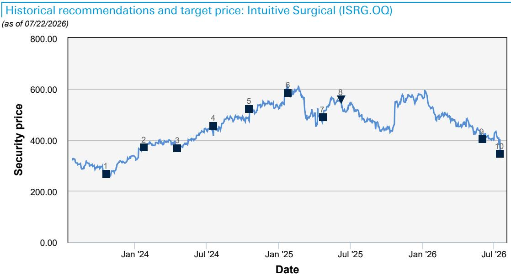

# 机器人行业数据与主题变化观察

一份来自某机构对机器人手术学会年度读者峰会的调研，揭示了全球软组织机器人手术市场正在经历的结构性变化。该机构对451名外科医生的问卷调查显示，受访者预计全球机器人辅助手术渗透率将从目前的33%上升至五年后的48%，对应约11%的年复合增长率。这一增长既来自传统开放手术向微创手术的转换，也来自微创手术内部从常规腹腔镜向机器人辅助手术的迁移。

值得注意的是，美国受访者预计的渗透率增幅更为温和——从64%升至69%，这反映了美国市场已相对成熟。增量几乎全部来自开放手术的转换，常规腹腔镜的使用预计保持平稳。但报告同时指出，由于调查对象为机器人手术学会会员（平均17年主治经验），其技术采纳率本就高于整体市场，因此这一增速可能低估了全球市场的实际潜力。多家参会公司的一致判断是，全球软组织机器人手术总可及市场目前渗透率仍低于10%。

## 1. 某系统五年后全球装机份额预计从81%降至68%

调查显示，某系统目前占全球装机量的81%，五年后预计降至68%。届时另一厂商将成为第二大厂商，其系统预计获得10%的受访者终端份额。在美国市场，某系统当前装机份额高达98%，五年后预计仍将维持84%的支配地位——这一预期在多家拥有长期外科器械优势的竞争者进入市场后，显得尤为突出。

报告提醒，该调查于3月进行，而某系统在7月22日意外提前获得FDA批准，竞争格局仍在快速演变。但核心判断是：该系统在可预见的未来仍将保持明确的品类领导地位。

## 2. 手术向门诊手术中心迁移趋势明确，五年后约三分之一手术将在ASC完成

调查数据显示，五年后约三分之一的适用手术将在门诊手术中心完成。作为参照，报告认为某系统目前在ASC渠道的手术量和装机占比仍处于个位数水平。某公司管理层在预录的讨论中表示，约70%的美国ASC隶属于已拥有该系统的医院网络，公司正与这些客户合作，将低复杂度病例重新分配至手术中心，从而为医院腾出更多复杂手术的容量。

随着医院升级至新一代系统，某型号在ASC渠道的采用情况良好，这得益于其较低的价格点以及ASC对成本的高度敏感。报告还提到，该公司计划在2027年启动第二轮EUP计划，通过降低高容量、低复杂度手术的单次器械与附件费用来推动技术采纳——报告认为这一举措部分也是应对竞争加剧和翻新器械威胁的防御性策略。

## 3. 某系统以差异化尺寸切入市场，战略重心在美国

某系统获得FDA批准的时间早于市场预期，以至于该公司未能在峰会上准备好向外科医生展示系统。其关键差异化特征在于显著缩小了手术室占地面积——比现有系统减少30%至50%，这将在ASC渠道形成竞争优势。初始批准涵盖部分普外科手术，管理层预计泌尿科、妇科及其他普外科适应症的批准将较快跟进。

与另一厂商通常先瞄准美国以外市场的策略不同，该公司刻意选择优先在美国寻求批准，管理层将此视为对平台的信心。海外市场方面，日本和西欧是下一优先区域，但未提供时间表。报告指出，该公司旗下品牌在微创手术领域的强势地位，以及全球TAM渗透率仍为个位数的事实，意味着竞争焦点应更多放在市场增长而非市场份额争夺。

> **观察评论：** 该公司选择从美国起步而非传统路径，暗示该系统在设计上针对美国ASC渠道做了针对性优化。对于关注手术机器人竞争格局的读者，需要留意该系统在ASC场景下的实际装机速度，以及它是否会加速某系统在低复杂度手术领域的定价不确定性。

## 4. 某系统在关节置换领域仍有增长空间，软组织手术仍为并购目标

某公司CEO在峰会上表示，某系统目前占美国膝关节置换手术的70%和全球的50%，但管理层认为在美国和国际市场仍有充足的增长空间。髋关节置换的渗透率仍显著较低，翻修手术的采用正在加速。手持式某系统早期安装多数发生在竞争对手的客户中，且未对原有系统产生蚕食效应。

在软组织手术领域，该公司仍保持高度兴趣，但管理层强调任何进入都将通过并购实现，且与其他厂商的防御性动机不同，该公司的进入将是纯粹的进攻性举措。当被问及翻新某系统器械时，管理层再次确认正在密切关注这一领域——如果该公司在此方向采取行动，将对原有系统产生重大影响。

对于关注手术机器人行业的读者，这份调研提供了一个重要的观察框架：全球渗透率仍处于个位数阶段，市场增长远大于份额争夺；但竞争格局正在从一家独大转向多极分化，尤其是在ASC渠道和低复杂度手术领域。未来五年，谁能在控制成本的同时保持技术差异化，将决定下一阶段的竞争位置。

For informational purposes only. Portions may be generated,translated,summarized,or edited with AI assistance based on source materials and may contain omissions or errors. Please verify independently. This is not investment,legal,tax,accounting,or other professional advice.

For informational purposes only. Portions may be generated,translated,summarized,or edited with AI assistance based on source materials and may contain omissions or errors. Please verify independently. This is not investment,legal,tax,accounting,or other professional advice.

