# Company KONE Corporation

Rating Buy

Europe
Finland

Capital Goods
Engineering

Reuters
KNEBV.HE

Bloomberg
KNEBV FH

Exchange
HEX

ADR
KNYJY

Ticker
KNEBV

ISIN
US50048H1014

Date
23 July 2026

Forecast Change

Price at 22 Jul 2026 (EUR) 46.72
Price Target (EUR) 67.00
52-week range (EUR) 70.00 - 48.20

# Good orders with cost inflation starting to feature, new TP €67, BUY

Q2 results featured strong order growth with the market reaction tempered by a slight decline in backlog margin, limited group margin expansion and modernisation revenue growth. We see some of these concerns as time-and-place as we update our forecasts. KONE continues to execute well as its market leadership reflects in strong order growth. As we head into H2, the industry faces increased cost inflation with KONE putting through price increases to keep price cost stable with H2 margin expansion now expected at +40bps yr/yr versus +40bps delivered in H1 with DB forecasts slightly ahead on orders but in-line on revenues and adj EBIT vs consensus for the year. We maintain our BUY recommendation as we update our target price to €67.

## Colour on the quarter and revised forecasts

Q2 order intake grew +11% yr/yr in local fx with modernisation >15% with price up in all regions ex China to reflect increased costs with Chinese pricing stable. Management indicated there was a bigger lag between tenders to orders in the Q2 intake with a slight decline in margin. In Maintenance, we expect revenue growth to accelerate slightly as we lap the effects of portfolio management in China with mgmt. reiterating its +HSD growth target as we factor in less M&A. In Modernisation, 15%+ order growth in lc was strong while revenue growth of +7% in lc was weaker than normal. As we head into H2, we expect Modernisation revenue growth to reaccelerate to +LDD against weaker growth comps in the second half. In New Building Solutions (NBS), we make minimal changes to revenue estimates for the remainder of FY26. Management confident on price cost as stable despite increased cost inflation as all regions ex China featured price increases. KONE has locked in pricing on raw materials for the rest of year with cost-pass through provisions on logistics a feature on most contracts. That said, we expect margin expansion for H2 in-line with H1 levels at +c40bps yr/yr as price actions to mitigate cost inflation may lag slightly in terms of impact. We also factor in margin progression in backlog which is an incremental headwind to operational leverage going forward in the short-term.

## Changes to DB estimates as we remain slightly ahead on orders for FY26

Versus our previous estimates, we adjusted our FY26 forecasts as follows; no meaningful change to group orders €9.6bn (+5.5% yr/yr growth in lc), increased our group revenues by +1% now €11.8bn (+5.1% yr/yr growth in lc) and increased our adj. EBIT by +1% now €1.49bn (12.6% margin). Versus consensus, our FY26

## Valuation & Risks

John Kim
Research Analyst
+44-20-754-18699

Gael de-Bray, CFA
Research Analyst
+33-1-4495-6562

<table><tr><td colspan="4">Key changes</td></tr>
<tr><td>TP</td><td>66.00 to 67.00</td><td>↑</td><td>1.5%</td></tr>
<tr><td>DB EPS (EUR)</td><td>2.22 to 2.36</td><td>↑</td><td>6.3%</td></tr>
<tr><td>Revenue (EURm)</td><td>11,701 to 11,815</td><td>↑</td><td>1.0%</td></tr>
</table>

Source: DB

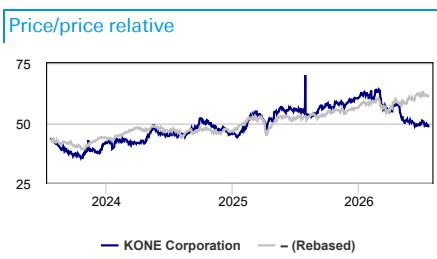

<table><tr><td>Performance (%)</td><td>1m</td><td>3m</td><td>12m</td></tr>
<tr><td>Absolute</td><td>-1.7</td><td>-16.4</td><td>-12.0</td></tr>
<tr><td>DJ (.STOXXE)</td><td>-0.7</td><td>4.9</td><td>17.7</td></tr>
<tr><td colspan="4">Source: DB</td></tr>
</table>

<table><tr><td colspan="2">Key indicators (FY1)</td></tr>
<tr><td>ROE (%)</td><td>36.7</td></tr>
<tr><td>ROA (%)</td><td>11.3</td></tr>
<tr><td>Net debt/equity (%)</td><td>-40.5</td></tr>
<tr><td>Book value/share (EUR)</td><td>5.6</td></tr>
<tr><td>Price/book (x)</td><td>8.4</td></tr>
<tr><td>Net interest cover (x)</td><td>59.9</td></tr>
<tr><td>EBIT margin (%)</td><td>11.8</td></tr>
<tr><td colspan="2">Source: DB</td></tr>
</table>

estimates are +2% ahead on group orders and in-line on revenue, and adj. EBIT. For FY27, we forecast group orders of €10.2bn (+6% yr/yr in lc), revenue of €12.6bn (+6% yr/yr in lc), and adj. EBIT of €1.69bn (13.4% margin). Versus consensus, our FY27 estimates are +3% ahead on group orders, +1% on revenue, and +1% on adj. EBIT.

## Valuation, target price of €67, BUY

We value KONE as a stand-alone business for now and maintain a target price of €67 (was €66) and a BUY rating. We value KONE using a DCF analysis based on our forecasts through 2030 with a terminal value calculation as we roll forward our valuation. We use a CAPM framework to calculate an 8.2% WACC and a terminal value implying a c17x. Downside risks include potentially severe pricing headwinds, and an inability to drive operational improvements.

<table><tr><td colspan="6">Forecasts and ratios</td></tr>
<tr><td>Year End Dec 31</td><td>2024A</td><td>2025A</td><td>2026E</td><td>2027E</td><td>2028E</td></tr>
<tr><td>Revenue (EURm)</td><td>11,098</td><td>11,245</td><td>11,815</td><td>12,628</td><td>13,406</td></tr>
<tr><td>EBITA (EURm)</td><td>1,296</td><td>1,389</td><td>1,441</td><td>1,740</td><td>1,868</td></tr>
<tr><td>DB EPS (EUR)</td><td>1.86</td><td>1.97</td><td>2.36</td><td>2.66</td><td>2.85</td></tr>
<tr><td>P/E (DB EPS) (x)</td><td>24.3</td><td>27.6</td><td>19.8</td><td>17.6</td><td>16.4</td></tr>
<tr><td>EV/EBITA (x)</td><td>17.8</td><td>19.7</td><td>16.1</td><td>13.0</td><td>11.9</td></tr>
<tr><td>DPS (EUR)</td><td>1.80</td><td>1.80</td><td>1.83</td><td>2.36</td><td>2.54</td></tr>
<tr><td>Yield (%)</td><td>4.0</td><td>3.3</td><td>3.9</td><td>5.1</td><td>5.4</td></tr>
<tr><td colspan="6">Source: DB estimates, company data</td></tr>
</table>

## Q2 26 - key charts

Figure 1: Qtly order intake and organic order growth  
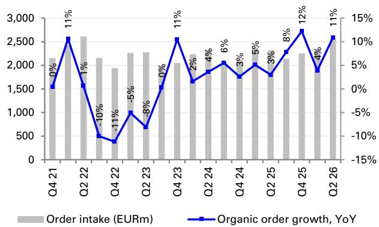  
Source : DB, Company data

Figure 2: Qtly sales and organic sales growth  
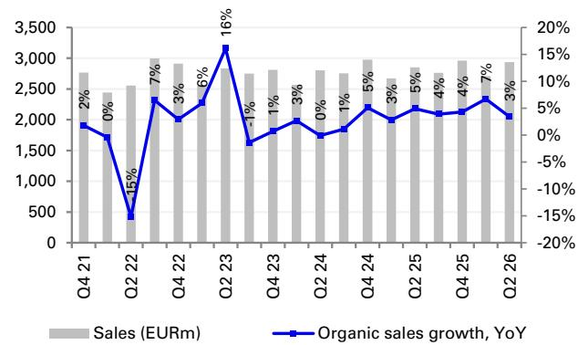  
Source : DB, Company data

Figure 3: Adj EBIT and Adj EBIT margin  
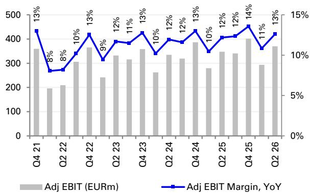  
Source : DB, Company data

Figure 4: FCF (EUR, m)  
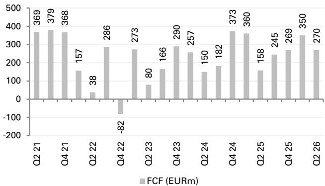  
Source : DB, Company data

Figure 5: Organic Sales Growth (YoY, %)  
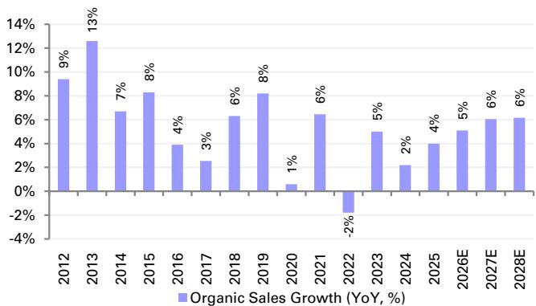  
Source : DB, Company data

Figure 6: Adj EBIT Margin (%)  
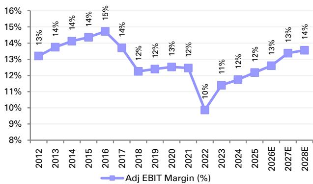  
Source : DB, Company data

## Financials

Figure 7: Annual P&L

<table><tr><td>Profit & Loss (EURm)</td><td>2019</td><td>2020</td><td>2021</td><td>2022</td><td>2023</td><td>2024</td><td>2025</td><td>2026E</td><td>2027E</td><td>2028E</td></tr>
<tr><td>Total sales</td><td>9,982</td><td>9,982</td><td>10,514</td><td>10,907</td><td>10,952</td><td>11,098</td><td>11,245</td><td>11,815</td><td>12,628</td><td>13,406</td></tr>
<tr><td>Growth</td><td>10.0%</td><td>0.0%</td><td>5.3%</td><td>3.7%</td><td>0.4%</td><td>1.3%</td><td>1.3%</td><td>5.1%</td><td>6.9%</td><td>6.2%</td></tr>
<tr><td>-of which constant fx</td><td>8.2%</td><td>0.6%</td><td>6.4%</td><td>-1.8%</td><td>5.0%</td><td>2.2%</td><td>4.0%</td><td>5.1%</td><td>6.1%</td><td>6.2%</td></tr>
<tr><td>-of which currency</td><td>1.8%</td><td>-0.6%</td><td>-1.1%</td><td>5.5%</td><td>-4.6%</td><td>-0.9%</td><td>-2.8%</td><td>0.0%</td><td>0.8%</td><td>0.0%</td></tr>
<tr><td>Cost Of Goods Sold</td><td>-4,022</td><td>-3,958</td><td>-4,297</td><td>-4,458</td><td>-4,168</td><td>-4,335</td><td>-4,180</td><td>-4,029</td><td>-4,386</td><td>-4,773</td></tr>
<tr><td>Other Expenses</td><td>-4,526</td><td>-4,572</td><td>-4,678</td><td>-5,158</td><td>-5,314</td><td>-5,223</td><td>-5,409</td><td>-6,056</td><td>-6,203</td><td>-6,447</td></tr>
<tr><td>EBITDA</td><td>1,434</td><td>1,452</td><td>1,539</td><td>1,291</td><td>1,470</td><td>1,541</td><td>1,656</td><td>1,730</td><td>2,039</td><td>2,186</td></tr>
<tr><td>Margin</td><td>14.4%</td><td>14.5%</td><td>14.6%</td><td>11.8%</td><td>13.4%</td><td>13.9%</td><td>14.7%</td><td>14.6%</td><td>16.1%</td><td>16.3%</td></tr>
<tr><td>Depreciation & Amortisation</td><td>-242</td><td>-239</td><td>-244</td><td>-259</td><td>-269</td><td>-292</td><td>-320</td><td>-340</td><td>-349</td><td>-368</td></tr>
<tr><td>DB EBITA</td><td>1,234</td><td>1,247</td><td>1,346</td><td>1,116</td><td>1,295</td><td>1,350</td><td>1,422</td><td>1,540</td><td>1,740</td><td>1,868</td></tr>
<tr><td>Margin</td><td>12.4%</td><td>12.5%</td><td>12.8%</td><td>10.2%</td><td>11.8%</td><td>12.2%</td><td>12.6%</td><td>13.0%</td><td>13.8%</td><td>13.9%</td></tr>
<tr><td>Adj EBIT</td><td>1,237</td><td>1,251</td><td>1,310</td><td>1,077</td><td>1,248</td><td>1,303</td><td>1,369</td><td>1,488</td><td>1,690</td><td>1,818</td></tr>
<tr><td>Margin</td><td>12.4%</td><td>12.5%</td><td>12.5%</td><td>9.9%</td><td>11.4%</td><td>11.7%</td><td>12.2%</td><td>12.6%</td><td>13.4%</td><td>13.6%</td></tr>
<tr><td>Items affecting comparability</td><td>-45</td><td>-38</td><td>-15</td><td>-45</td><td>-48</td><td>-54</td><td>-33</td><td>-98</td><td>0</td><td>0</td></tr>
<tr><td>Reported EBIT</td><td>1,192</td><td>1,213</td><td>1,295</td><td>1,031</td><td>1,200</td><td>1,249</td><td>1,336</td><td>1,390</td><td>1,690</td><td>1,818</td></tr>
<tr><td>Margin</td><td>11.9%</td><td>12.2%</td><td>12.3%</td><td>9.5%</td><td>11.0%</td><td>11.3%</td><td>11.9%</td><td>11.8%</td><td>13.4%</td><td>13.6%</td></tr>
<tr><td>Associate income</td><td>0</td><td>0</td><td>0</td><td>0</td><td>0</td><td>0</td><td>-1</td><td>0</td><td>0</td><td>0</td></tr>
<tr><td>Extraordinary items</td><td>0</td><td>0</td><td>0</td><td>0</td><td>0</td><td>0</td><td>0</td><td>0</td><td>0</td><td>0</td></tr>
<tr><td>Net financial items</td><td>-9</td><td>11</td><td>-9</td><td>-9</td><td>6</td><td>5</td><td>-8</td><td>-23</td><td>70</td><td>76</td></tr>
<tr><td>Pre-tax profit</td><td>1,184</td><td>1,224</td><td>1,287</td><td>1,023</td><td>1,206</td><td>1,254</td><td>1,327</td><td>1,367</td><td>1,760</td><td>1,894</td></tr>
<tr><td>DB Pre-tax profit</td><td>1,220</td><td>1,261</td><td>1,323</td><td>1,062</td><td>1,253</td><td>1,301</td><td>1,380</td><td>1,517</td><td>1,810</td><td>1,944</td></tr>
<tr><td>Taxes</td><td>-279</td><td>-277</td><td>-298</td><td>-244</td><td>-275</td><td>-293</td><td>-335</td><td>-317</td><td>-405</td><td>-436</td></tr>
<tr><td>Profit from discontinued operation</td><td>0</td><td>0</td><td>0</td><td>0</td><td>0</td><td>0</td><td>0</td><td>0</td><td>0</td><td>0</td></tr>
<tr><td>Minority interests</td><td>-7</td><td>-8</td><td>-9</td><td>-10</td><td>-6</td><td>-10</td><td>-12</td><td>-13</td><td>-16</td><td>-17</td></tr>
<tr><td>Net profit</td><td>898</td><td>939</td><td>980</td><td>769</td><td>926</td><td>951</td><td>980</td><td>1,037</td><td>1,339</td><td>1,441</td></tr>
<tr><td>DB EPS (full dilution)</td><td>1.79</td><td>1.87</td><td>1.95</td><td>1.54</td><td>1.86</td><td>1.86</td><td>1.97</td><td>2.36</td><td>2.66</td><td>2.85</td></tr>
</table>

Source : DB, Company data

Figure 8: Annual cash flow statement

<table><tr><td>Cash flow statement (EURm)</td><td>2019</td><td>2020</td><td>2021</td><td>2022</td><td>2023</td><td>2024</td><td>2025</td><td>2026E</td><td>2027E</td><td>2028E</td></tr>
<tr><td>EBIT</td><td>1,193</td><td>1,213</td><td>1,295</td><td>1,031</td><td>1,200</td><td>1,249</td><td>1,336</td><td>1,390</td><td>1,690</td><td>1,818</td></tr>
<tr><td>Depreciation & amortisation</td><td>242</td><td>239</td><td>244</td><td>259</td><td>269</td><td>292</td><td>320</td><td>340</td><td>349</td><td>368</td></tr>
<tr><td>Chg in provisions/other adj</td><td>-16</td><td>-36</td><td>-119</td><td>58</td><td>24</td><td>-49</td><td>61</td><td>166</td><td>63</td><td>66</td></tr>
<tr><td>Change in working capital</td><td>116</td><td>456</td><td>246</td><td>-533</td><td>-68</td><td>122</td><td>91</td><td>13</td><td>-17</td><td>-16</td></tr>
<tr><td>Operating Cash Flow</td><td>1,534</td><td>1,872</td><td>1,667</td><td>816</td><td>1,425</td><td>1,614</td><td>1,808</td><td>1,908</td><td>2,085</td><td>2,235</td></tr>
<tr><td>Net interest</td><td>23</td><td>12</td><td>27</td><td>34</td><td>3</td><td>5</td><td>-8</td><td>-23</td><td>70</td><td>76</td></tr>
<tr><td>Tax paid</td><td>-287</td><td>-333</td><td>-328</td><td>-275</td><td>-304</td><td>-351</td><td>-441</td><td>-390</td><td>-405</td><td>-436</td></tr>
<tr><td>Cash Earnings</td><td>1,270</td><td>1,550</td><td>1,365</td><td>574</td><td>1,125</td><td>1,268</td><td>1,358</td><td>1,495</td><td>1,750</td><td>1,876</td></tr>
<tr><td>Net investments fixed assets</td><td>-98</td><td>-88</td><td>-97</td><td>-101</td><td>-148</td><td>-120</td><td>-120</td><td>-118</td><td>-126</td><td>-134</td></tr>
<tr><td>Free Cash Flow pre dividend</td><td>1,172</td><td>1,462</td><td>1,269</td><td>473</td><td>977</td><td>1,148</td><td>1,238</td><td>1,377</td><td>1,624</td><td>1,742</td></tr>
<tr><td>% of EBIT</td><td>98%</td><td>121%</td><td>98%</td><td>46%</td><td>81%</td><td>92%</td><td>93%</td><td>99%</td><td>96%</td><td>96%</td></tr>
<tr><td>Dividend</td><td>-852</td><td>-881</td><td>-1,166</td><td>-1,088</td><td>-905</td><td>-906</td><td>-932</td><td>-932</td><td>-948</td><td>-1,224</td></tr>
<tr><td>Free Cash Flow post div</td><td>320</td><td>582</td><td>102</td><td>-615</td><td>72</td><td>243</td><td>306</td><td>445</td><td>676</td><td>518</td></tr>
<tr><td>% of EBIT</td><td>27%</td><td>48%</td><td>8%</td><td>-60%</td><td>6%</td><td>19%</td><td>23%</td><td>32%</td><td>40%</td><td>28%</td></tr>
<tr><td>Acquisitions</td><td>-27</td><td>-27</td><td>-35</td><td>-32</td><td>-172</td><td>-167</td><td>-164</td><td>-50</td><td>-50</td><td>-50</td></tr>
<tr><td>Disposals</td><td>0</td><td>5</td><td>11</td><td>0</td><td>1</td><td>0</td><td>0</td><td>0</td><td>0</td><td>0</td></tr>
<tr><td>Issue of share capital/buyback</td><td>34</td><td>-4</td><td>-47</td><td>-58</td><td>-1</td><td>-20</td><td>-6</td><td>24</td><td>0</td><td>0</td></tr>
<tr><td>Other</td><td>-317</td><td>-740</td><td>-249</td><td>755</td><td>45</td><td>112</td><td>-202</td><td>331</td><td>-50</td><td>-50</td></tr>
<tr><td>Currency movement on cash</td><td>16</td><td>-20</td><td>249</td><td>-46</td><td>-15</td><td>-17</td><td>-70</td><td>0</td><td>0</td><td>0</td></tr>
<tr><td>Net cashflow</td><td>27</td><td>-205</td><td>32</td><td>5</td><td>-71</td><td>151</td><td>-136</td><td>749</td><td>576</td><td>418</td></tr>
<tr><td colspan="10"></td></tr>
<tr><td>Change in net debt</td><td>136</td><td>-407</td><td>-207</td><td>887</td><td>283</td><td>183</td><td>131</td><td>-343</td><td>-576</td><td>-418</td></tr>
<tr><td>Net debt (including pension)</td><td>-1,570</td><td>-1,977</td><td>-2,183</td><td>-1,297</td><td>-1,014</td><td>-831</td><td>-700</td><td>-1,043</td><td>-1,619</td><td>-2,037</td></tr>
</table>

Source : DB, Company data

<table><tr><td>Model updated: 22 July 2026</td></tr>
<tr><td>Running the numbers</td></tr>
<tr><td>Europe</td></tr>
<tr><td>Finland</td></tr>
<tr><td>Engineering</td></tr>
<tr><td>KONE Corporation</td></tr>
</table>

<table><tr><td>Price (22 Jul 26)</td><td>EUR 46.72</td></tr>
<tr><td>Target Price</td><td>EUR 67.00</td></tr>
<tr><td>52 Week range</td><td>EUR 48.20 - 70.00</td></tr>
<tr><td>Market cap (m)</td><td>EURm 24,214USDm 27,617</td></tr>
</table>

## Company Profile

KONE Oyj is an international engineering and service company employing 60,000+ people across c60 countries worldwide. It was founded in 1910 and is headquartered in Espoo near Helsinki, Finland. Kone builds and services moving walkways, automatic doors and gates, escalators and lifts. In addition, the company provides maintenance and modernization solutions for existing installations

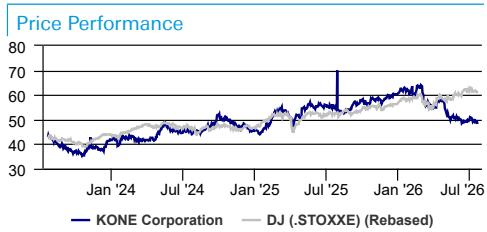

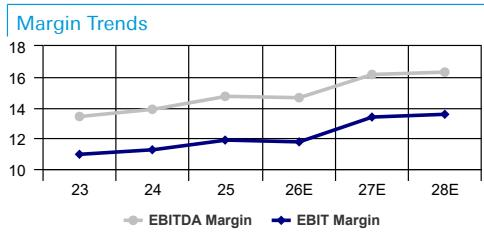

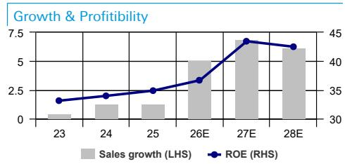

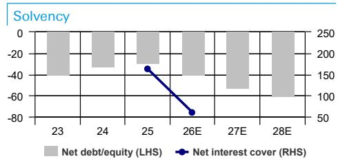  
John Kim

<table><tr><td>Fiscal year end 31-Dec</td><td>2023</td><td>2024</td><td>2025</td><td>2026E</td><td>2027E</td><td>2028E</td></tr>
<tr><td colspan="7">Financial Summary</td></tr>
<tr><td>DB EPS (EUR)</td><td>1.86</td><td>1.86</td><td>1.97</td><td>2.36</td><td>2.66</td><td>2.85</td></tr>
<tr><td>Reported EPS (EUR)</td><td>1.79</td><td>1.80</td><td>1.89</td><td>2.00</td><td>2.58</td><td>2.78</td></tr>
<tr><td>DPS (EUR)</td><td>1.75</td><td>1.80</td><td>1.80</td><td>1.83</td><td>2.36</td><td>2.54</td></tr>
<tr><td>BVPS (EUR)</td><td>5.3</td><td>5.4</td><td>5.4</td><td>5.6</td><td>6.3</td><td>6.8</td></tr>
<tr><td>Weighted average shares (m)</td><td>517</td><td>529</td><td>518</td><td>518</td><td>518</td><td>518</td></tr>
<tr><td>Average market cap (EURm)</td><td>21,857</td><td>24,013</td><td>28,110</td><td>24,214</td><td>24,214</td><td>24,214</td></tr>
<tr><td>Enterprise value (EURm)</td><td>20,789</td><td>23,094</td><td>27,326</td><td>23,149</td><td>22,589</td><td>22,188</td></tr>
</table>

<table><tr><td colspan="7">Income Statement (EURm)</td></tr>
<tr><td>Sales revenue</td><td>10,952</td><td>11,098</td><td>11,245</td><td>11,815</td><td>12,628</td><td>13,406</td></tr>
<tr><td>Gross profit</td><td>6,784</td><td>6,764</td><td>7,065</td><td>7,785</td><td>8,242</td><td>8,633</td></tr>
<tr><td>EBITDA</td><td>1,470</td><td>1,541</td><td>1,656</td><td>1,730</td><td>2,039</td><td>2,186</td></tr>
<tr><td>Depreciation</td><td>222</td><td>246</td><td>267</td><td>288</td><td>299</td><td>318</td></tr>
<tr><td>Amortisation</td><td>47</td><td>47</td><td>53</td><td>51</td><td>50</td><td>50</td></tr>
<tr><td>EBIT</td><td>1,200</td><td>1,249</td><td>1,336</td><td>1,390</td><td>1,690</td><td>1,818</td></tr>
<tr><td>Net interest income(expense)</td><td>6</td><td>5</td><td>-8</td><td>-23</td><td>70</td><td>76</td></tr>
<tr><td>Associates/affiliates</td><td>0</td><td>0</td><td>0</td><td>0</td><td>0</td><td>0</td></tr>
<tr><td>Exceptionals/extraordinaries</td><td>0</td><td>0</td><td>0</td><td>0</td><td>0</td><td>0</td></tr>
<tr><td>Other pre-tax income/(expense)</td><td>0</td><td>0</td><td>-1</td><td>0</td><td>0</td><td>0</td></tr>
<tr><td>Profit before tax</td><td>1,206</td><td>1,254</td><td>1,327</td><td>1,367</td><td>1,760</td><td>1,894</td></tr>
<tr><td>Income tax expense</td><td>275</td><td>293</td><td>335</td><td>317</td><td>405</td><td>436</td></tr>
<tr><td>Minorities</td><td>6</td><td>10</td><td>12</td><td>13</td><td>
