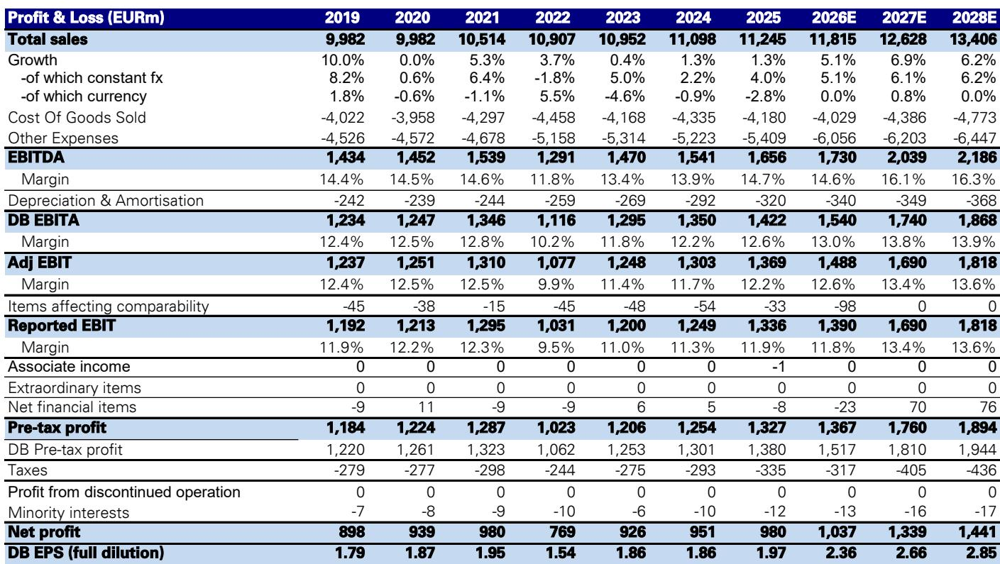
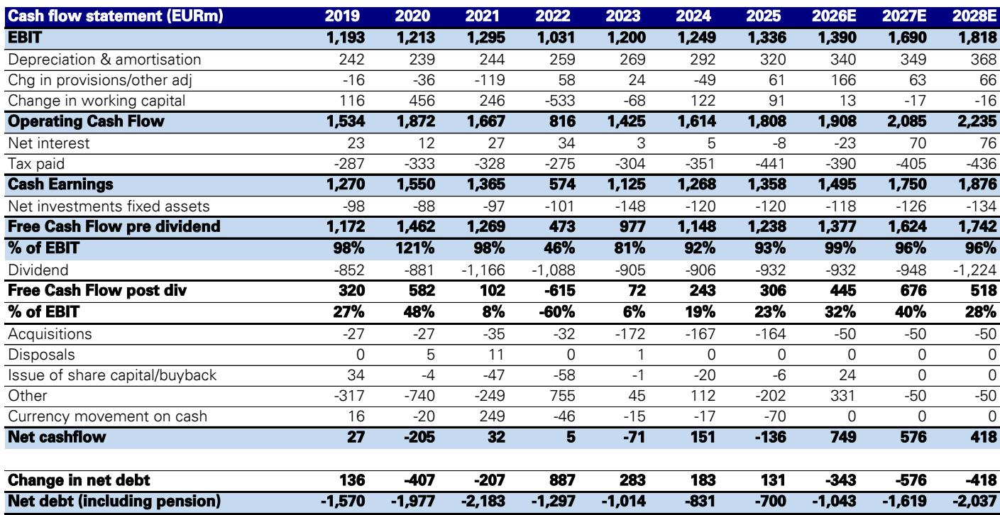
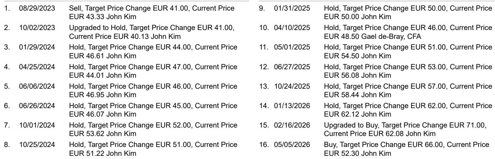

# DB：价格数据与市场变化观察

通力2026年第二季度订单量同比增长11%，现代化改造业务增速超过15%，但市场反应被订单利润率小幅下滑和集团利润率扩张有限所抑制。这份DB研报的核心判断是：通力在执行层面持续表现良好，其市场领导地位反映在强劲的订单增长中，但行业正面临成本通胀上升的挑战，公司正通过提价来维持价格成本稳定。

Q2订单增长中，除中国外所有区域均实现提价，中国定价保持稳定。管理层指出，从招标到订单的确认周期存在明显滞后，这导致订单利润率出现小幅下降。维护业务方面，随着中国组合观察管理的影响逐渐消退，预计收入增速将略有提升。现代化改造业务订单增长强劲，但收入增速仅为7%，低于正常水平。报告预计，下半年现代化改造收入将重新加速，因为同期基数较低。

> **KC评论：** 订单增长与收入确认之间的时间差，是理解通力短期财务表现的关键。Q2订单利润率下滑并非需求出现变化，而是招标到订单的确认节奏问题，这一点在评估公司基本面时容易被忽略。

新建筑解决方案方面，报告对全年剩余时间的收入预测调整幅度很小。管理层对价格成本稳定有信心，尽管成本通胀上升，但除中国外所有区域都实施了提价。通力已锁定原材料价格至年底，且大多数合同包含物流成本转嫁条款。报告预计，下半年利润率扩张幅度将与上半年持平，约40个基点，因为提价行动对成本通胀的抵消效果可能存在时间差。

## 1. 订单增长领先市场共识，收入与利润预测小幅上调

DB对通力2026年的预测调整如下：集团订单预测维持在96亿欧元不变，同比增长5.5%；集团收入上调1%至118亿欧元，同比增长5.1%；调整后EBIT上调1%至14.9亿欧元，利润率为12.6%。与市场共识相比，该机构的订单预测高出2%，收入和调整后EBIT则与共识一致。对于2027年，报告预测集团订单为102亿欧元，收入126亿欧元，调整后EBIT为16.9亿欧元，利润率13.4%，订单预测比共识高出3%。

## 2. 成本通胀与定价策略的博弈是下半年观察主线

报告明确指出，通力在下半年面临的核心问题是成本通胀上升。公司已通过提价来应对，但提价对利润的贡献可能存在滞后。原材料价格已锁定，物流成本转嫁条款覆盖大多数合同，这为利润率提供了一定保护。但订单利润率的下滑趋势，意味着短期内运营杠杆的释放将面临额外阻力。报告认为，H2利润率扩张幅度预计与H1持平，约40个基点，这一判断基于提价行动能够基本抵消成本通胀的影响。

## 3. 估值框架与不确定性因素

报告采用DCF模型对通力进行估值，预测期至2030年，终值计算隐含约17倍估值，WACC为8.2%。节奏变化不确定性包括潜在的严重定价不确定性和运营改善能力不足。从财务数据看，通力2026年预计自由现金流为13.8亿欧元，占EBIT的99%，现金流质量较高。净债务为负值，公司处于净现金状态，这为应对行业周期提供了缓冲。

对于关注工业工程和建筑设备领域的读者，通力这份报告提供了一个观察框架：在成本通胀周期中，具备定价权、供应链管理和服务收入占比高的公司，其利润稳定性往往优于同行。订单增长与收入确认的时间差、现代化改造业务的增速变化、以及中国市场的定价策略，是判断公司短期业绩节奏的三个关键变量。

For informational purposes only. Portions may be generated,translated,summarized,or edited with AI assistance based on source materials and may contain omissions or errors. Please verify independently. This is not investment,legal,tax,accounting,or other professional advice.

For informational purposes only. Portions may be generated,translated,summarized,or edited with AI assistance based on source materials and may contain omissions or errors. Please verify independently. This is not investment,legal,tax,accounting,or other professional advice.

