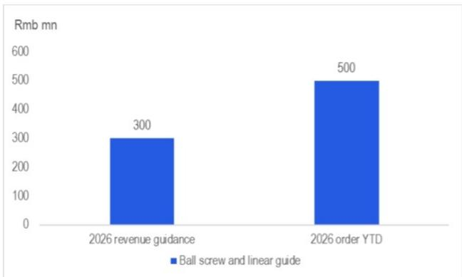
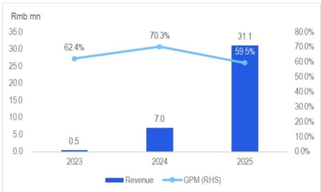
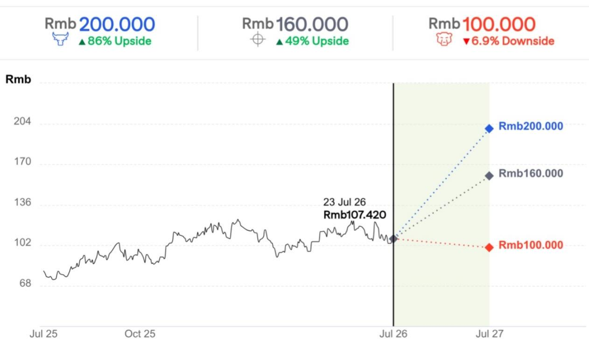
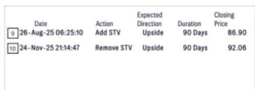
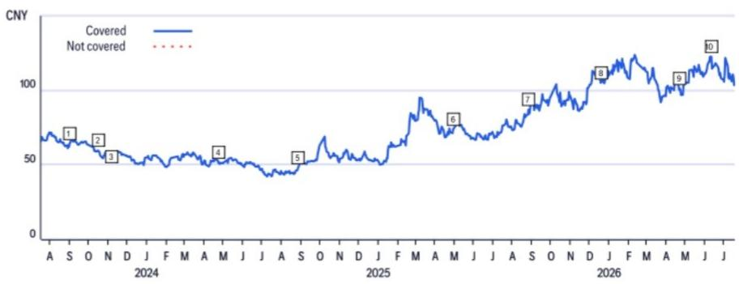
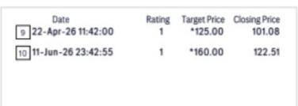
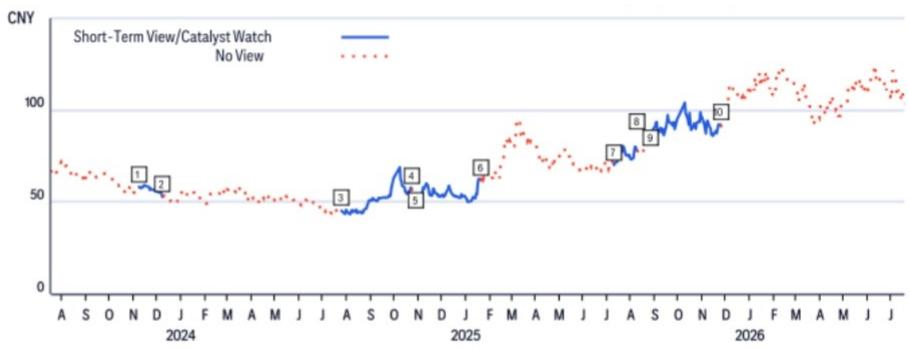

# 恒立液压（601100.SS）

滚珠丝杠与直线导轨业务或超预期；新剑传动带来人形机器人业务正面参考

## Citi观点

我们的日本机械研究分析师Graeme McDonald预计THK（6481.HK）将于8月5日公布强劲的FY12/26第二季度业绩，FY12/26营业利润指引可能上调至约4000亿日元。这再次印证了我们此前调研恒立的结论——公司受益于滚珠丝杠和直线导轨领域的“溢出效应”，因为THK和NSK（6471.T）在中国市场供应偏紧，交货周期延长至九个月。恒立近期也表示，其滚珠丝杠和直线导轨订单年初至今已达5亿元人民币。因此我们认为，恒立有望超出其当前2026年3亿元的营收指引。此外，新剑传动——特斯拉Optimus供应链中的行星滚柱丝杠/直线执行器供应商——在其A股招股说明书中披露，其物理AI直线执行器毛利率在2023/24/25年分别为62.4%/70.3%/59.5%，这使我们相信恒立的人形机器人零部件业务也将对毛利率产生积极贡献。

滚珠丝杠与直线导轨上行空间充足——与日本公司受益于中国半导体和高端精密制造业对滚珠丝杠和直线导轨的强劲需求不同，恒立更多受益于中国注塑机和机床领域的进口替代趋势。近期，AI和人形机器人领域创造了更多机床需求，进而为滚珠丝杠和直线导轨带来增量需求。此外，恒立还可能受益于宁德时代（300750.SZ/3750.HK）在中国换电站的建设，管理层估计每个换电站的滚珠丝杠和直线导轨价值量约为5万元。最后，管理层指引恒立将于2027年推出用于半导体行业的非磁性、超耐腐蚀或高速滚珠丝杠和直线导轨产品，以捕捉中国滚珠丝杠和直线导轨市场25%的份额（详见恒立液压（601100.SS）——中国工业与自动化调研更新 | 滚珠丝杠短期承压，长期受益）。

新剑传动的参考价值——根据我们的行业调研，新剑传动是特斯拉Optimus的直线执行器供应商之一。根据其A股IPO文件，其物理AI直线执行器平均售价在2023年至2025年间保持在约60%或以上，尽管存在一定波动。因此我们认为，恒立为人形机器人客户提供的行星滚柱丝杠产品可能成为其毛利率高于综合平均水平的业务。

近期报告——恒立液压（601100.SS）——2Q26E预览：核心业务强劲但汇兑损失再次较大；人形机器人业务推进中

## 买入

<table><tr><td>价格（2026年7月23日15:00）</td><td>人民币107.420元</td></tr><tr><td>目标价</td><td>人民币160.000元</td></tr><tr><td>预期股价回报</td><td>48.9%</td></tr><tr><td>预期股息率</td><td>0.6%</td></tr><tr><td>预期总回报</td><td>49.6%</td></tr><tr><td>市值</td><td>人民币1,440.31亿元/212.66亿美元</td></tr></table>

Jamie Wang $^{AC}$ +852-2501-2772 jamie.ck.wang@citi.com

Eric Lau

+852-2501-2726

eric.h.lau@citi.com

详见附录A-1分析师认证、重要披露及研究分析师关联信息

图1. 恒立：滚珠丝杠和直线导轨2026年营收指引与年初至今订单对比  
  
© 2026 Citi集团。未经Citi书面许可不得转载。  
来源：Citi、公司报告

图2. 新剑传动：物理AI直线执行器营收与毛利率，2023-25年  
  
© 2026 Citi集团。未经Citi书面许可不得转载。  
来源：Citi、公司报告

## 牛市/熊市：恒立液压

  
价差93个百分点  
当前价格及预期回报（上行/下行）截至2026年7月23日

## 牛市假设

- 基于2027年预期市盈率62倍的估值重估，源于强劲的产品需求。

## 基准假设

- 基于2027年预期市盈率50倍进行估值。

## 熊市假设

- 因需求变化，基于2027年预期市盈率38倍进行估值下调。

## 恒立液压

## 估值

我们对恒立的目标价为人民币160.0元，基于2027年预期市盈率50倍，相当于其平均市盈率加0.5倍标准差，以反映其强劲的核心业务以及因人形机器人业务敞口增加而可能带来的估值重估。

## 风险

主要基本面下行风险包括：1）挖掘机和非挖掘机零部件需求变化；2）滚珠丝杠和墨西哥工厂因规模经济效应不足导致盈利能力变化；3）产品组合变化导致毛利率低于预期。上述任何风险因素都可能导致公司报价偏离我们的目标价。

如果您有视觉障碍并希望与Citi代表就本文件中图形的细节进行沟通，请致电美国1-888-500-5008（TTY：711），美国境外请致电+1-210-677-3788

## 附录A-1

## 分析师认证

主要负责本研究报告准备和内容的研究分析师要么在作者栏中以"AC"标识，要么以粗体列在与该分析师相关的内容旁边。如果作者栏中指定了多位AC分析师，每位分析师仅就整个研究报告进行认证，但以下情况除外：(a) 归属于另一位以粗体标识的AC认证分析师的内容，以及(b) 仅针对特定发行人的观点，该观点归属于下方该发行人价格图表或评级历史表中标识的另一位AC认证分析师。每位分析师就其负责的报告部分认证：(1) 其中表达的观点准确反映了其个人对每个提及的发行人和证券的看法，并且是以独立方式准备的，包括对Citi全球市场公司及其关联方；(2) 研究分析师的薪酬的任何部分过去、现在或将来都不会直接或间接地与本研究报告中该研究分析师表达的具体建议或观点相关。

## 重要披露

<table><tr><td></td><td>日期</td><td>评级</td><td>目标价</td><td>收盘价</td></tr><tr><td>1</td><td>2023年9月3日11:12:07</td><td>1</td><td>*80.00</td><td>64.08</td></tr><tr><td>2</td><td>2023年10月16日11:50:01</td><td>1</td><td>*74.00</td><td>59.56</td></tr><tr><td>3</td><td>2023年11月7日17:22:26</td><td>1</td><td>*68.00</td><td>57.30</td></tr><tr><td>4</td><td>2024年4月23日06:18:54</td><td>1</td><td>*59.00</td><td>51.24</td></tr></table>

\*表示变更

<table><tr><td></td><td>日期</td><td>评级</td><td>目标价</td><td>收盘价</td></tr><tr><td>5</td><td>2024年8月27日09:15:53</td><td>1</td><td>*62.00</td><td>48.12</td></tr><tr><td>6</td><td>2025年4月29日11:21:40</td><td>1</td><td>*85.00</td><td>73.71</td></tr><tr><td>7</td><td>2025年8月26日10:25:10</td><td>1</td><td>*105.00</td><td>86.90</td></tr><tr><td>8</td><td>2025年12月18日11:38:03</td><td>1</td><td>*135.00</td><td>105.00</td></tr></table>

  
评级/目标价变更以上述东部时间反映

<table><tr><td></td><td>日期</td><td>操作</td><td>预期方向</td><td>期限</td><td>收盘价</td></tr><tr><td>1</td><td>2023年11月8日02:23:35</td><td>添加催化剂观察</td><td>下行</td><td>30天</td><td>58.22</td></tr><tr><td>2</td><td>2023年12月8日11:00:30</td><td>移除催化剂观察</td><td>下行</td><td>30天</td><td>52.77</td></tr><tr><td>3</td><td>2024年7月25日02:08:49</td><td>添加短期观点</td><td>上行</td><td>90天</td><td>45.28</td></tr><tr><td>4</td><td>2024年10月23日23:28:11</td><td>移除短期观点</td><td>上行</td><td>90天</td><td>57.35</td></tr></table>

CW - 催化剂观察, STV - 短期观点

<table><tr><td></td><td>日期</td><td>操作</td><td>预期方向</td><td>期限</td><td>收盘价</td></tr><tr><td>5</td><td>2024年10月29日20:50:50</td><td>添加催化剂观察</td><td>下行</td><td>90天</td><td>53.00</td></tr><tr><td>6</td><td>2025年1月20日01:12:43</td><td>移除催化剂观察</td><td>下行</td><td>90天</td><td>61.91</td></tr><tr><td>7</td><td>2025年7月10日04:48:00</td><td>添加催化剂观察</td><td>上行</td><td>30天</td><td>70.20</td></tr><tr><td>8</td><td>2025年8月8日14:18:06</td><td>移除催化剂观察</td><td>上行</td><td>30天</td><td>78.13</td></tr></table>

评级/目标价变更以上述东部时间反映

Citi全球市场公司或其关联方在过去12个月内因非投行服务从恒立液压获得报酬。

<table><tr><td>Citi全球市场公司或其关联方目前拥有，或过去12个月内曾拥有以下客户，并提供非投行、证券相关服务：恒立液压。</td></tr><tr><td>Citi全球市场公司或其关联方目前拥有，或过去12个月内曾拥有以下客户，并提供非投行、非证券相关服务：恒立液压。</td></tr><tr><td>分析师薪酬由Citi管理层和Citi高级管理层根据旨在惠及Citi全球市场公司及其关联方（"公司"）读者客户的活动和服务确定。薪酬不与特定交易或建议挂钩。与所有公司员工一样，分析师的薪酬受到公司整体盈利能力的影响，包括投行、销售和交易以及自营交易收入。股票研究分析师薪酬的一个因素是安排机构客户与被覆盖公司管理层之间的企业接触活动。通常，当分析师对公司持积极看法时，公司管理层更有可能参与。</td></tr><tr><td>对于产品中推荐的公司不是做市商的金融工具，公司是该金融工具（及其任何基础工具）的流动性提供者，并可能作为主体参与此类工具的交易。公司是定期发行与产品中可能推荐的证券挂钩的可交易金融工具的发行人。公司定期交易产品中讨论的发行人证券。公司可能以与产品不一致的方式进行证券交易，并且对于产品涵盖的证券，将以主体身份向客户买入或卖出。</td></tr><tr><td>除非另有说明，研究分析师或其团队成员在过去12个月内均未实地考察过已提供投资观点的公司的运营情况。</td></tr><tr><td>有关本Citi产品（"产品"）所涉及公司的重要披露（包括历史披露副本），请联系Citi，地址：388 Greenwich Street, 6th Floor, New York, NY, 10013，收件人：Legal/Compliance [E6WYB6412478]。此外，相同的重要披露（估值和风险评估以及历史披露除外）包含在公司披露网站https://www.citivelocity.com/cvr/eppublic/citi_research_disclosures上。估值和风险评估可在关于标的公司的最新研究报告/报告的正文中找到。根据市场滥用法规，过去12个月内所有Citi建议的历史记录可通过CitiVelocity（https://www.citivelocity.com/cv2）或您的标准分发门户访问。历史披露（最多过去三年）将根据要求提供。</td></tr></table>

<table><tr><td></td><td colspan="3">12个月评级</td><td colspan="3">催化剂观察</td></tr><tr><td>数据截至2026年7月1日</td><td>买入</td><td>持有</td><td>卖出</td><td>买入</td><td>持有</td><td>卖出</td></tr><tr><td>Citi全球基本面覆盖（中性=持有）</td><td>61%</td><td>32%</td><td>7%</td><td>36%</td><td>48%</td><td>16%</td></tr><tr><td>各评级类别中属于投行客户的公司的百分比</td><td>38%</td><td>42%</td><td>27%</td><td>42%</td><td>37%</td><td>36%</td></tr></table>

## Citi基本面研究投资评级指南：

Citi股票建议包括投资评级和可选的风险评级以标识高风险股票。风险评级同时考虑价格波动性和基本面标准。股票将没有风险评级或分配高风险评级。

投资评级：Citi投资评级为买入、中性、卖出。我们的评级是分析师对预期总回报（"ETR"）和风险的预期函数。ETR是未来12个月内预测股价升值（或贬值）加上股息收益的总和。目标价基于12个月的时间范围。投资评级定义如下：买入（1）ETR为15%或以上，或高风险股票为25%或以上；卖出（3）为负ETR。任何未分配买入或卖出的被覆盖股票均为中性（2）。对于评级为中性（2）的股票，如果分析师认为缺乏足够的估值驱动因素和/或投资催化剂来得出正面或负面的投资观点，经Citi管理层批准，他们可以选择不分配目标价，从而不推导ETR。Citi可能因监管和/或内部政策原因暂停其评级和目标价，并分配"评级暂停"状态。Citi也可能因其他特殊情况（例如缺乏分析师论点关键信息、交易暂停）影响公司和/或公司证券交易而暂停其评级和目标价，并分配"审查中"状态。在这两种情况下，评级和目标价将在评级历史价格图表中显示为"—"和"-"。在2022年4月11日之前，Citi将两种情况均分配"审查中"状态，在2020年11月11日之前仅在特殊情况下分配。在实际可行的情况下，分析师将尽快发布重新建立评级和投资论点的报告。投资评级由上述范围在首次覆盖、投资和/或风险评级变更或目标价变更时确定（受有限管理层酌情权限制）。有时，由于市场价格波动和/或其他短期波动或交易模式，预期总回报可能落在此范围之外。此类临时偏差将被允许，但将受到研究管理部门的审查。您买卖证券的决定应基于您个人的投资目标，并且只有在评估了股票的预期表现和风险后才能做出。

催化剂观察/短期观点（"STV"）评级披露：

催化剂观察和STV上行/下行提示：Citi还可能包括催化剂观察或STV上行或下行提示，以表明分析师预计股价将在指定30天或90天期限内因一项或多项特定的近期催化剂或影响公司或市场的事件而相对上涨（下跌）。当分析师对股价影响发生的信心较高时，将发布催化剂观察；当信心水平中等时，将发布STV。催化剂观察或STV上行/下行提示将在指定的30/90天期限结束时自动到期。如果股价表现（按市场收盘价计算）超过提示方向的15%，催化剂观察也将自动移除（除非分析师推翻）。分析师也可以在指定期限结束前通过发布研究报告移除催化剂观察或STV提示。催化剂观察/STV上行或下行提示可能与股票的基本面股票评级不同，且不影响该评级，基本面评级反映的是更长期的总相对回报预期。出于FINRA评级分布披露规则的目的，催化剂观察/STV上行提示对应于买入建议，催化剂观察/STV下行提示对应于卖出建议。任何未分配催化剂观察上行、催化剂观察下行、STV上行或STV下行提示的股票被视为催化剂观察/STV无观点。出于FINRA评级分布披露规则的目的，我们在催化剂观察/STV上行/下行评级系统的评级分布表中将催化剂观察/STV无观点对应于持有。然而，我们重申我们不认为无观点是一种建议。对于所有催化剂观察/STV上行/下行提示，存在催化剂和相关的股价变动可能不会如预期实现的风险。

## 研究分析师关联/非美国研究分析师披露

本报告作者的雇佣法律实体如下所列（其监管机构进一步列于下文）。准备本报告的非美国研究分析师（即除被标识为受雇于Citi全球市场公司之外的所有下述研究分析师）未在FINRA注册/具备研究分析师资格。此类研究分析师可能不是成员组织的关联人员（但受雇于成员组织的关联方），因此可能不受FINRA规则2241关于与标的公司沟通、公开露面以及研究分析师账户持有证券交易的限制。

Citi全球市场亚洲有限公司

Eric Lau; Jamie Wang

## 其他披露

建议中提及的工具的任何价格均为前一交易日该工具主要市场的收盘价，除非另有说明。

本研究报告中任何建议的完成和首次分发时间均为产品顶部显示的东部日期时间。如果产品引用其他分析师的观点，请参阅价格图表或评级历史表以了解该观点的完成和首次分发的日期/时间。

关于同一金融工具或发行人的建议变更，如果在过去12个月内已发布，则变更和先前建议的日期均会标明。对于基本面覆盖，请参阅本披露附录中的价格图表或评级变更历史，或发行人披露摘要，网址为https://www.citivelocity.com/cvr/eppublic/citi_research_disclosures。

Citi已实施用于识别、考虑和管理因发布或分发投资研究而产生的潜在利益冲突的政策。这些政策的描述可在https://www.citivelocity.com/cvr/eppublic/citi_research_disclosures找到。

过去12个月每个季度末所有Citi建议中相当于"买入"、"持有"、"卖出"的比例（以及其中在过去12个月内接受过Citi投资公司服务的百分比，显示在括号中）如下：2026年第一季度买入33%（63%），持有44%（52%），卖出23%（46%），相对价值0.5%（89%）；2025年第四季度买入33%（63%），持有44%（50%），卖出23%（46%），相对价值0.4%（91%）；2025年第三季度买入33%（61%），持有44%（52%），卖出23%（50%），相对价值0.4%（80%）；2025年第二季度买入33%（63%），持有44%（51%），卖出23%（49%），相对价值0.4%（86%）。为披露除股票以外的建议（其定义可在相应披露部分找到），"买入"表示正向方向性交易想法；"卖出"表示负向方向性交易想法；"相对价值"表示任何没有明确方向的投资策略的交易想法。

欧洲法规要求在引用证券过往表现时提供5年价格历史。CitiVelocity的图表工具（https://www.citivelocity.com/cv2/#go/CHARTING_3_Equities）提供创建可定制价格图表的功能，包括五年选项。该工具可在CitiVelocity（https://www.citivelocity.com/）的任何资产类别菜单下的数据与分析部分找到。如需更多信息，请联系CitiVelocity支持（https://www.citivelocity.com/cv2/go/CLIENT_SUPPORT）。除非另有说明，所有引用价格来源为DataCentral，该数据库从LSEG数据与分析获取价格信息。过往表现不是未来结果的保证或可靠指标。预测不是未来表现的保证或可靠指标。

读者在投资前应始终考虑ETF的投资目标、风险和费用。适用的招股说明书和关键读者信息文件（如适用）应包含有关此类ETF的这些信息和其他信息。在投资前仔细阅读任何此类招股说明书非常重要。客户可从适用的分销商或授权参与者、ETF上市的交易所和/或适用的ETF发行人的适用网站获取ETF的招股说明书和关键读者信息文件。研究价值及其应计收益可能下降或上升。任何过往表现、预测或预报均不指示未来或可能的表现。本文包含的有关ETF的任何信息仅供说明之用，不应被视为出售要约或购买任何ETF单位的要约邀请，无论是明示还是暗示。所表达的意见是作者的意见，不一定反映ETF发行人、其任何代理人或其关联方的观点。

Citi全球市场印度私人有限公司和/或其关联方可能不时实际或实益拥有标的发行人债务证券的1%或以上。

请注意，根据经修订的第13959号行政命令（"命令"），美国人士被禁止投资于美国政府确定为命令标的的任何公司的证券。本研究不旨在以任何可能导致违反命令的方式使用或依赖。鼓励读者依靠自己的法律顾问就遵守命令以及美国财政部外国资产控制办公室管理和执行的其他经济制裁计划提供建议。

本通讯面向符合以色列《研究交流、投资营销和投资组合管理法》（1995年）（"咨询法"）中定义的"合格客户"的人士。在以色列境内，本通讯不针对零售客户，Citi不会向零售客户或非合格客户提供此类产品或交易。演示者未获得以色列证券管理局（"ISA"）的投资顾问或投资营销许可，本通讯不构成投资或营销建议。本文包含的信息可能涉及ISA未监管的事项。本通讯涉及的证券不得向任何以色列人士发行或出售，除非根据《以色列证券法》（1968年）及其规定的公开发售规则获得证券发售豁免。

Citi广泛并同时通过公司专有的电子分发平台（例如CitiVelocity和各种全球财富平台）向公司的机构和零售客户分发其研究内容。为方便起见，某些（但不是全部）研究内容可能通过第三方聚合器分发。客户可酌情通过电子邮件接收已发布的研究报告，且仅在此类研究内容已广泛分发之后。某些研究仅提供给机构读者以满足监管要求。Citi分析师向客户提供的服务水平和类型可能因多种因素而异，例如客户对与分析师沟通频率和方式的个人偏好、客户的风险状况和投资重点及视角（例如全市场、特定行业、长期、短期等）、与公司的整体客户关系的规模和范围以及法律和监管限制。

根据Comissão de Valores Mobiliários Resolução 20和ASIC Regulatory Guide 264，Citi需要披露Citi关联公司或业务是否与标的公司有商业关系。考虑到Citi在全球100多个国家经营多种业务，Citi很可能与标的公司有商业关系。

公司推荐、提供或销售的证券：(i) 不受联邦存款保险公司保险；(ii) 不是任何受保存款机构（包括Citi）的存款或其他义务；以及 (iii) 面临投资风险，包括可能损失本金投资金额。产品仅供信息参考，不构成购买或出售证券的要约或邀请。任何购买产品中提及的证券的决定必须考虑该证券的现有公开信息或任何注册招股说明书。尽管信息来自并基于公司认为可靠的来源，但我们不保证其准确性，且信息可能不完整和经过压缩。但请注意，公司已采取一切合理措施确定产品重要披露部分中披露的准确性和完整性。公司的研究部门已获得产品中提及的标的公司的协助，包括但不限于与标的公司管理层的讨论。公司政策禁止研究分析师向标的公司发送研究草稿。但应假定产品作者已与标的公司讨论以确保发布前的事实准确性。关于ESG（环境、社会、治理）因素的陈述和观点通常基于标的公司发布的公开声明或其他公开新闻，作者可能未独立验证。ESG因素是读者在做出投资决策时可能选择考虑的一个因素。所有意见、预测和估计构成作者截至产品日期的判断，这些以及产品中包含的任何其他信息如有变更，恕不另行通知。金融工具的价格和可用性也可能随时变更，恕不另行通知。尽管公司内部其他部门为产品中讨论的公司提供建议，但在此类角色中获得的信息不用于产品的准备。尽管Citi未设定预定的发布频率，但如果产品是基本面股票或信用研究报告，Citi有意提供对被覆盖发行人的研究覆盖，包括响应影响发行人的新闻。对于非基本面研究报告，Citi可能不会定期更新报告中包含的观点、建议和事实。尽管Citi维持对发行人的覆盖、提出建议或讨论发行人，但Citi可能因法律或政策原因定期被限制引用某些发行人。如果已发布交易想法的组成部分受到限制，该交易想法将从产品中包含的开放交易想法列表中移除。限制解除后，如果分析师继续支持该交易想法，将重新列入开放交易想法列表，否则将正式关闭。Citi可能向不同类别的客户提供不同的研究产品和服务（例如，基于长期或短期投资时间范围），这可能导致不同的结论或建议，可能影响证券价格，与替代研究产品中的建议相反，前提是每个产品与其各自的评级系统一致。

投资非美国证券，包括ADR，可能涉及某些风险。非美国发行人的证券可能未在美国证券交易委员会注册，也不受其报告要求的约束。关于外国证券的信息可能有限。外国公司通常不受与美国公司相当的统一审计和报告标准、实践和要求的约束。某些外国公司的证券可能流动性较低，其价格波动性可能比可比的美国公司更大。此外，汇率变动可能对投资外国股票的价值及其对美国读者的相应股息支付产生不利影响。ADR读者的净股息是估计的，使用预扣税率惯例，被认为是准确的，但鼓励读者咨询其税务顾问以获取准确的股息计算。从公司收到产品的读者可能在某些州或其他司法管辖区被禁止从公司购买产品中提及的证券。请向您的财务顾问咨询更多详细信息。Citi全球市场公司对在美国的产品负责。美国读者根据产品中包含的信息下的任何订单只能通过Citi全球市场公司下达。

对产品生产负责的Citi法律实体是第一位作者受雇的法律实体。

产品在澳大利亚通过Citi全球市场澳大利亚有限公司提供。（ABN 64 003 114 832和AFSL No. 240992），ASX集团的参与者，受澳大利亚证券和投资委员会监管。Citi中心，2 Park Street, Sydney, NSW 2000。Citi全球市场澳大利亚有限公司不是《1959年银行法》下的授权存款机构，也不受澳大利亚审慎监管局监管。

产品在巴西由Citi全球市场巴西CCTVM SA提供，受CVM - Comissão de Valores Mobiliários（"CVM"）、BACEN - 巴西中央银行、APIMEC - Associação dos Analistas e Profissionais de Investimento do Mercado de Capitais和ANBIMA – Associação Brasileira das Entidades dos Mercados Financeiro e de Capitais监管。地址：Av. Paulista, 1111 - 14º andar(parte) - CEP: 01311920 - São Paulo - SP。

本产品在智利通过Banchile Corredores de Bolsa S.A.提供，该公司是Citi公司的间接子公司，受Comisión Para El Mercado Financiero监管。地址：Enrique Foster Sur, 20, piso 6, Las Condes, Santiago, Chile。

哥伦比亚共和国读者披露：本通讯或信息不构成第2555号法令第2.40.1.1.2条或修改、替代或补充该条款的法规意义上的专业研究交流。为准备和分发本文所述的研究报告和一般通讯，无需成为哥伦比亚金融监管局监管的实体。

产品在德国由Citi全球市场欧洲股份公司（"CGME"）提供，受欧洲中央银行和德国联邦金融监管局（Bundesanstalt fur Finanzdienstleistungsaufsicht BaFin）监管。地址：Börsenplatz 9, 60313 Frankfurt am Main, Germany。

除非另有说明，如果准备本报告的分析师位于香港且报告涉及"证券"（定义见香港法例第571章《证券及期货条例》），则该报告由Citi全球市场亚洲有限公司在香港发布。Citi全球市场亚洲有限公司受香港证券及期货事务监察委员会监管。如果报告由非香港分析师准备，请注意该分析师（及其受雇或认可的法律实体）未在香港获得许可/注册，且他们不声称如此。有关分析师雇佣实体的详细信息，请参阅"研究分析师关联/非美国研究分析师披露"部分。

产品在印度由Citi全球市场印度私人有限公司（CGM）提供，该公司作为研究分析师受印度证券交易委员会（SEBI）监管（SEBI注册号INH000000438）。CGM还积极参与印度的商人银行业务（SEBI注册号INM000010718）和股票经纪业务（SEBI注册号INZ000263033），并已就此在SEBI注册。SEBI的注册、孟买证券交易所（BSE）的上市以及国家证券市场研究所（NISM）的认证均不以任何方式保证中介机构的业绩或向读者提供任何回报保证。CGM的注册办公室位于1202, 12th Floor, First International Financial Centre (FIFC), G Block, Bandra Kurla Complex, Bandra East, Mumbai – 400098，注册电话：+91 22 61759999。Citi维持健全的政策、程序、控制和培训，以确保持续遵守所有适用的规则和法规。本文包含的所有建议均由合格的研究分析师做出。CGM的公司识别号为U99999MH2000PTC126657，其合规官[Vishal Bohra]的联系方式为：电话：+91-022-61759994，传真：+91-022-61759851，电子邮件：cgmcompliance@citi.com。关于研究分析师、合规审计报告和投诉信息的读者章程可在https://www.citivelocity.com/cvr/eppublic/citi_research_disclosures找到。申诉官[Niraj Mody]的联系方式为：电话：+91-22-42775002，电子邮件：EMEA.CR.Complaints@citi.com。证券市场投资存在市场风险。投资前请仔细阅读所有相关文件。SEBI规定的客户条款和条件可在https://www.citivelocity.com/rendition/authfilelinksvcs/eppublic/V1/file?paramData=ZmlsZU5hbWU9L1MzL0dETVMvcHViRGlZY2xvc3VyZUh0bWxzL2dkbV9kaXNfc2ViaV9UZXJtc29mVXNILmh0bWw找到。

产品在印度尼西亚通过PTCiti证券印度尼西亚提供。地址：Citibank Tower 10/F, Pacific Century Place, SCBD lot 10, Jl. Jend Sudirman Kav 52-53, Jakarta 12190, Indonesia。本产品及其任何副本不得在印度尼西亚分发或提供给任何印度尼西亚公民（无论其居住地）或印度尼西亚居民，除非符合适用的资本市场法律法规。本产品不是印度尼西亚的证券要约。产品中提及的证券尚未根据相关资本市场法律法规在资本市场和金融服务局（OJK）注册，不得在印度尼西亚共和国境内或向印度尼西亚公民通过公开发售或构成印度尼西亚资本市场法律法规意义上的要约的情况发行或出售。

产品在日本由Citi全球市场日本有限公司（"CGMJ"）提供，受金融厅、证券交易监督委员会、日本证券业协会、东京证券交易所和大阪证券交易所监管。地址：Otemachi Park Building, 1-1-1 Otemachi, Chiyoda-ku, Tokyo 100-8132 Japan。如果在CGMJ研究报告中发现错误，修订版将发布在公司CitiVelocity网站上。如果您对CitiVelocity有疑问，请致电(813) 6270-3019寻求帮助。

产品在沙特阿拉伯王国根据沙特法律通过Citi沙特阿拉伯提供，受资本市场管理局（CMA）根据CMA许可证（17184-31）监管。地址：2239 Al Urubah Rd – Al Olaya Dist. Unit No. 18, Riyadh 12214 – 9597, Kingdom Of Saudi Arabia。

产品在韩国由Citi全球市场韩国证券有限公司（CGMK）提供，受金融委员会、金融监督院和韩国金融投资协会（KOFIA）监管。CGMK的地址为Citibank Center, 50 Saemunan-ro, Jongno-gu, Seoul 03184, Korea。KOFIA在其网站上提供研究分析师的注册信息。如果您希望查找CGMK研究分析师的KOFIA注册信息，请访问以下网站：http://dis.kofia.or.kr/websquare/index.jsp?w2xPath=/wq/fundMgr/DISFundMgrAnalystList.xml&divisionId=MDISO3002002000000&serviceId=SDISO3002002000。产品在韩国由Citi韩国有限公司提供，受金融委员会和金融监督院监管。地址：Citibank Center, 50 Saemunan-ro, Jongno-gu, Seoul 03184, Korea。本研究报告仅提供给《金融投资服务和资本市场法》及其执行法令中定义的韩国专业读者。

产品在马来西亚由Citi全球市场马来西亚有限公司（注册号199801004692 (460819-D)）（"CGMM"）向其客户提供，CGMM对其内容负责。CGMM受马来西亚证券委员会监管。如有关于产品的任何问题，请联系CGMM，地址：Level 43 Menara Citibank, 165 Jalan Ampang, 50450 Kuala Lumpur, Malaysia。

产品在墨西哥由Citi墨西哥Casa de Bolsa, S.A. de C.V., Grupo Financiero Citi México提供，该公司是Citi公司的全资子公司，受Comision Nacional Bancaria y de Valores监管。地址：Prolongación Reforma 1196, 24 floor, Colonia Santa Fe, Alcaldía Cuajimalpa de Morelos, C.P. 05348, Ciudad de México。

产品在波兰由Biuro Maklerskie Banku Handlowego (DMBH)提供，DMBH是Bank Handlowy w Warszawie S.A.的独立部门，Bank Handlowy是Citi公司的子公司，受Komisja Nadzoru Finansowego监管。地址：Biuro Maklerskie Banku Handlowego (DMBH), ul.Senatorska 16, 00-923 Warszawa。

产品在新加坡通过Citi全球市场新加坡私人有限公司（"CGMSPL"）提供，CGMSPL持有资本市场服务和豁免财务顾问许可证，受新加坡金融管理局监管。如有关于本文件分析的任何问题，请联系CGMSPL，地址：8 Marina View, 21st Floor Asia Square Tower 1, Singapore 018960。本产品面向《证券与期货法》（2001年）定义的认可、专家和机构读者。对于Citi私人银行，产品在新加坡由Citi私人银行通过Citi新加坡分行提供。Citi新加坡分行是新加坡的持牌
