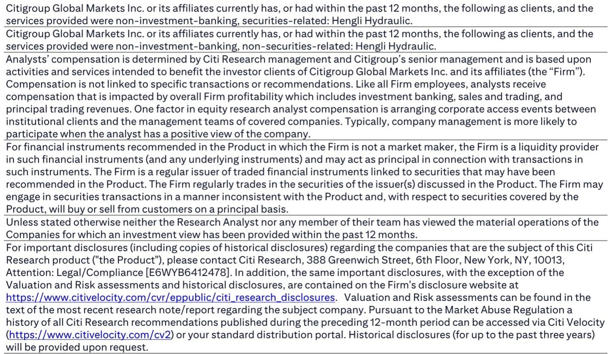
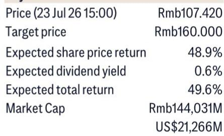

# Hengli Hydraulic's Ball Screw Orders Have Already Surpassed Full-Year Guidance, and the Humanoid Robot Margin Signal Is Even More Compelling

Hengli Hydraulic has accumulated RMB 500 million in ball screw and linear guide orders year-to-date as of mid-2026, a figure that already exceeds the company's full-year revenue guidance of RMB 300 million for this product line. The gap between actual orders and guidance is not a forecasting error. It is a structural signal that demand from import substitution in China's machine tool and plastic injection molding sectors, combined with incremental pull from AI-driven manufacturing and battery swap infrastructure, is running far ahead of internal expectations. For observers, the immediate implication is clear: Hengli will likely beat its 2026 ball screw and linear guide revenue target by a wide margin.

Yet the more consequential insight from the report lies elsewhere. A separate data point from Seenpin, a planetary roller screw and linear actuator supplier in the Tesla Optimus supply chain, reveals that its physical AI linear actuator gross profit margin averaged between 59.5% and 70.3% from 2023 to 2025. This is a direct read-through for Hengli's own humanoid robot component business. If Hengli's planetary roller screw products for humanoid clients achieve similar margin profiles, the robotics segment will not simply be a revenue add-on. It will be gross margin accretive to the entire company, potentially reshaping the blended profitability structure at a time when the core hydraulic business faces its own cyclical and competitive dynamics.

The convergence of these two developments—ball screw orders overshooting guidance and a high-margin humanoid robot pathway becoming visible—creates a strategic inflection point. Hengli is no longer just a hydraulic cylinder manufacturer benefiting from cyclical recovery in China's construction and industrial equipment. It is becoming a precision motion control company with exposure to three high-growth vectors: import replacement in traditional industrial components, infrastructure buildout tied to the electric vehicle ecosystem, and the early-stage but structurally significant humanoid robotics supply chain.

## Japanese Competitors' Capacity Constraints in China Are Creating a Structural Spillover Window for Hengli

The ball screw and linear guide market in China has long been dominated by Japanese producers such as THK and NSK. These companies have historically commanded premium pricing and longer customer relationships, particularly in semiconductor and high-precision manufacturing applications. But the current dynamics are shifting. A global investment bank report indicates that both THK and NSK are experiencing tight supply in China, with delivery times extending to approximately nine months. This is not a temporary hiccup. It reflects a capacity allocation decision by Japanese firms that are prioritizing other global markets or struggling to scale production fast enough to meet China's surging demand from semiconductor equipment and precision manufacturing.

For Hengli, this creates a spillover opportunity. Unlike its Japanese competitors, whose China demand is concentrated in semiconductor and high-end precision manufacturing, Hengli's ball screw and linear guide business is anchored in different end markets: plastic injection molding machines and machine tools. These sectors are undergoing a domestic import replacement cycle, where Chinese manufacturers increasingly prefer local suppliers for cost, lead time, and supply chain security reasons. The Japanese capacity constraint accelerates this trend. Customers who might have waited nine months for a THK or NSK ball screw are now turning to Hengli as a viable alternative. Once these customers qualify Hengli's products and integrate them into their designs, the switching cost to return to Japanese suppliers becomes significant. The spillover effect is not just a volume fill-in. It is a structural market share gain.

The report notes that Hengli also plans to launch non-magnetic, extremely corrosion-resistant, and high-speed ball screw and linear guide products for the semiconductor industry in 2027. This is a deliberate move to capture the 25% of the Chinese ball screw and linear guide total addressable market that sits in semiconductor applications. If successful, this product launch would extend Hengli's addressable market beyond its current PIMM and machine tool strongholds and directly into the heart of Japanese competitors' strongest segment. The capacity constraints at THK and NSK today are effectively handing Hengli a multi-year window to build credibility and customer relationships in semiconductor-adjacent applications before those competitors can resolve their supply issues.

## The Battery Swap Station Buildout Adds a Tangible, Forecastable Demand Layer That Most Observers Are Underweighting

Beyond the import replacement narrative, Hengli's ball screw and linear guide business benefits from a specific, near-term infrastructure catalyst: CATL's battery swap station expansion in China. According to management estimates, the ball screw and linear guide dollar content per battery swap station is approximately RMB 50,000. This figure is not trivial. If CATL executes on its publicly stated plans to build thousands of swap stations across China over the next several years, the aggregate demand for precision motion components from this single application could become material.

The strategic significance of this demand layer is that it is relatively insensitive to the macroeconomic cycles that affect Hengli's traditional excavator and non-excavator hydraulic businesses. Battery swap station buildout is driven by policy support for electric vehicle adoption, fleet operator economics, and CATL's own competitive strategy in the battery-as-a-service model. It is not dependent on China's property construction cycle or global commodity prices. For a company whose core hydraulic business remains exposed to excavator demand volatility, having a growing revenue stream tied to EV infrastructure provides a natural diversification benefit. Observers who focus only on Hengli's hydraulic cyclicality may be underestimating the stabilizing effect of this new demand vector.

The report does not provide a specific forecast for the number of battery swap stations CATL will build, and management's RMB 50,000 per station estimate should be treated as directional rather than precise. But even a conservative buildout scenario implies meaningful incremental revenue for Hengli's ball screw and linear guide division over the next two to three years. Combined with the import replacement tailwind from Japanese capacity constraints, the division's revenue trajectory appears to have multiple independent drivers rather than reliance on a single end market.

## Seenpin's IPO Disclosure Provides a Credible Benchmark for Hengli's Humanoid Robot Component Margins

The most strategically significant data point in the report is not about ball screws at all. It comes from Seenpin, a planetary roller screw and linear actuator supplier to Tesla Optimus, which disclosed in its A-share IPO prospectus that its physical AI linear actuator gross profit margin was 62.4% in 2023, 70.3% in 2024, and 59.5% in 2025. These are exceptionally high margins for precision mechanical components. They are comparable to or higher than the blended gross margins of many premium industrial automation companies, and they suggest that the humanoid robot supply chain is currently pricing components at levels that reflect scarcity, customization, and early-stage production complexity.

The read-through for Hengli is direct. Hengli is developing planetary roller screw products for humanoid robot clients. If its products serve similar functions and compete in the same supply chain as Seenpin's, the margin structure is likely to be comparable. The report explicitly states that Hengli's humanoid robot component business could be gross margin accretive relative to the company's blended average margin. This is a critical distinction. Many industrial companies that diversify into new end markets experience margin dilution during the ramp phase due to low volumes, high R&D costs, and customer qualification expenses. In Hengli's case, the early evidence suggests the opposite: humanoid robot components may carry higher margins than the corporate average from the outset.

Why does this matter beyond the obvious financial benefit? It changes the valuation framework for the company. Currently, Hengli trades at a valuation that reflects its hydraulic and ball screw businesses, with some premium for robotics optionality. If the humanoid robot segment proves to be both high-margin and scalable, the appropriate valuation multiple for that segment should be higher than the multiple applied to cyclical hydraulic earnings. Observers who model Hengli's robotics business at the same margin as its core business are likely underestimating the earnings power and the valuation upside. The Seenpin disclosure provides a real-world benchmark that supports a more optimistic margin assumption.

## A Decision Framework for Observers: Three Questions to Determine Whether Hengli's Current Trajectory Is Sustainable

For an observer evaluating Hengli at its current price of RMB 107.42 with a target of RMB 160, the key question is not whether the ball screw order beat is real. It is whether the underlying drivers are durable enough to support sustained earnings growth beyond 2026. A structured decision framework can help clarify the case.

First, assess the durability of the Japanese capacity constraint. Is the nine-month delivery time at THK and NSK a structural issue or a cyclical one? If it reflects a long-term decision by Japanese firms to reduce China exposure or shift capacity to other regions, then Hengli's market share gains are likely permanent. If it is a temporary post-pandemic supply chain bottleneck that will resolve within 12 to 18 months, then the spillover benefit may fade as Japanese competitors regain delivery competitiveness. The evidence in the report tilts toward the structural interpretation. Japanese producers have been gradually reducing their manufacturing footprint in China for several years due to geopolitical risk and cost considerations. The current capacity tightness is more likely an acceleration of an existing trend than a short-term anomaly.

Second, evaluate the scalability of the humanoid robot component business. Seenpin's margin data is encouraging, but it reflects a single supplier in a nascent supply chain. The critical variable is whether Hengli can move from prototype and early production to volume manufacturing without significant margin erosion. High initial margins in precision components often compress as customers demand cost reductions with scale. However, the report's implication is that humanoid robot components are not simple commodity parts. They require precision engineering, tight tolerances, and reliability standards that limit the pool of qualified suppliers. If Hengli achieves qualification with major humanoid robot platforms, it may enjoy pricing power that protects margins even at higher volumes.

Third, consider the risk of execution failure in the semiconductor product launch. Hengli's plan to introduce non-magnetic and corrosion-resistant ball screws for semiconductor applications in 2027 is ambitious. Semiconductor equipment manufacturers have extremely stringent qualification processes, and new suppliers typically require years of testing and certification before achieving meaningful revenue. The report does not provide evidence that Hengli has already secured customer interest or qualification timelines for these products. Observers should treat the 2027 semiconductor launch as an upside optionality rather than a base-case assumption. If it succeeds, it opens a large new addressable market. If it is delayed or fails to gain traction, the ball screw business will remain dependent on PIMM and machine tool demand, which are themselves cyclical.

The base case for Hengli does not require the semiconductor launch to succeed. The combination of import replacement tailwinds, battery swap infrastructure demand, and the early-stage humanoid robot opportunity already provides a compelling growth trajectory through 2027. The semiconductor product is a potential catalyst for further upside, not a necessary condition for the thesis.

## The Margin Accretion from Robotics Could Reshape the Company's Earnings Profile Faster Than the Market Expects

The most underappreciated implication of the report is the pace at which the humanoid robot component business could become material to Hengli's overall financials. The Seenpin data shows that physical AI linear actuators generate gross margins near 60% to 70%. If Hengli's planetary roller screw products achieve similar margins, and if the company secures meaningful volume from one or more humanoid robot platforms, the earnings contribution from this segment could outpace its revenue contribution significantly. A business line that represents 5% of revenue but carries double the margin of the corporate average can contribute 10% or more of total gross profit.

This dynamic has a direct impact on valuation. Observers who apply a single blended multiple to Hengli's earnings are implicitly assuming that all business segments have similar growth and margin profiles. That assumption is becoming less valid. As the robotics segment scales, it will deserve a higher multiple, pulling the overall valuation upward. The current market price of RMB 107.42 already includes some premium for robotics exposure. But if the margin data from Seenpin proves replicable, and if humanoid robot volumes grow faster than currently modeled, that multiple could prove conservative.

The risk, of course, is that humanoid robot production timelines slip, or that Hengli fails to maintain its competitive position against other precision component suppliers targeting the same opportunity. The report acknowledges that gross margins in Seenpin's physical AI actuator business fluctuated between 59.5% and 70.3% from 2023 to 2025, indicating that even in a favorable pricing environment, margins are not static. Competitive dynamics, customer concentration, and production ramp inefficiencies could all compress margins from peak levels. The prudent assumption is that Hengli's humanoid robot component margins will be above corporate average but below the peak Seenpin levels, at least until production scale justifies further optimization.

Even with that conservative adjustment, the strategic direction is clear. Hengli is transitioning from a hydraulic components manufacturer with a cyclical earnings profile to a diversified precision motion control company with structural growth exposure to import replacement, EV infrastructure, and robotics. The ball screw order beat is the near-term confirmation. The Seenpin margin data is the long-term signal. Together, they make a powerful case that Hengli's current valuation does not fully reflect the earnings power of the business that is emerging.

*For informational purposes only. Portions may be generated, translated, summarized, or edited with AI assistance based on source materials and may contain omissions or errors. Please verify independently. This is not professional advice.*

For informational purposes only. Portions may be generated, translated, summarized, or edited with AI assistance based on source materials and may contain omissions or errors. Please verify independently. This is not professional advice.

