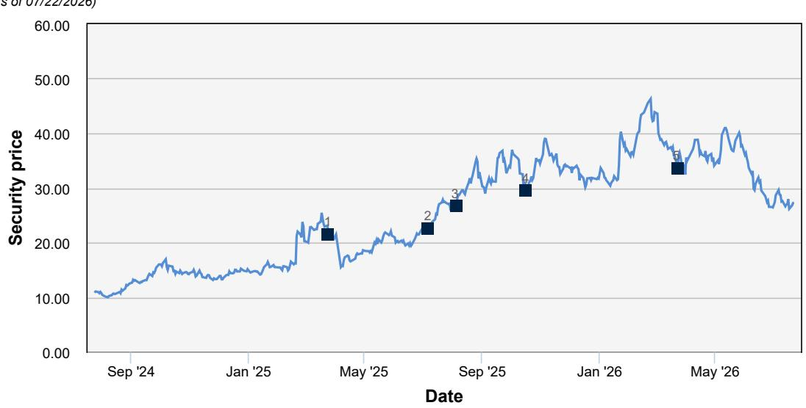
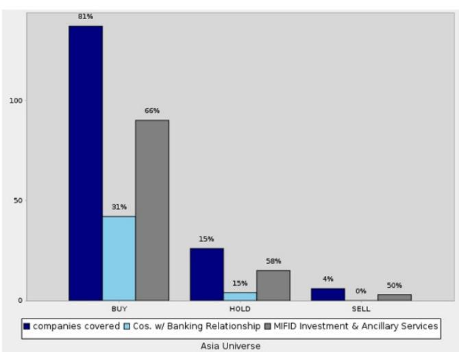

# 欧洲市场表现与韧性利润率抵消国内宏观环境波动

## 公司：敏实集团

**地区：亚洲 香港**

**行业：消费 汽车与汽车技术**

**路透：0425.HK**

**彭博：425 HK**

**ADR：MNTHY**

**交易所：恒生指数**

**代码：0425**

**ISIN：US60448A1016**

**日期：2026年7月23日**

## 预测调整

**2026年7月22日收盘价（港元）：27.30**
**12个月目标价（港元）：42.30**
**52周区间（港元）：46.30 - 25.95**
**恒生指数：24,893**

---

## 欧洲新能源汽车市场6月表现强劲：纯电动车/插电混动车同比增长51%/22.7%

根据ACEA统计，2026年上半年欧洲汽车注册量（涵盖欧盟、冰岛、挪威、瑞士和英国）增长6.1%至7,232,066辆，其中6月表现尤为突出（同比增长13.1%），为上半年带来积极表现。市场持续受益于消费者对电动化技术的强劲需求，主要受市场支持措施和油价上涨推动。纯电动车（BEV）上半年同比增长35.1%，达到1,608,200辆，占欧洲新车销量的22.2%；插电混动车（PHEV）上半年销量同比增长24.8%至742,411辆，占据欧洲汽车市场10.3%的份额。

具体到2026年6月，新注册纯电动车360,843辆，同比增长51%，占欧洲新车市场的25.6%。三大纯电动车市场均实现强劲增长：德国（同比增长78%至84,057辆）、法国（同比增长93.5%至55,851辆）和英国（同比增长35%至63,950辆）。插电混动车注册量也持续增长，6月达到146,168辆（同比增长22.7%），主要市场如德国（同比增长25.8%至32,212辆）、英国（同比增长24.9%至26,702辆）、意大利（同比增长61.2%至15,627辆）和西班牙（同比增长15.3%至15,567辆）均实现增长，插电混动车占欧洲整体汽车注册量的10.4%。

随着2026年上半年欧洲新能源汽车（纯电动车+插电混动车）销量同比增长32%，我们预计敏实集团上半年的电池盒业务收入将同比增长33%至48亿元人民币，推动敏实集团2026年上半年总收入同比增长9%至134亿元人民币。

## 敏实集团报价与欧洲汽车电动化高度相关

敏实集团在中国和欧洲（塞尔维亚、捷克、波兰和法国）设有铝制电池盒生产设施，提供从原材料加工到最终产品组装的全面集成服务。其电池盒客户主要为欧洲汽车制造商，如梅赛德斯-奔驰、宝马、大众、Stellantis、雷诺和沃尔沃汽车。因此，我们注意到欧洲汽车电动化趋势与敏实集团报价之间存在密切关联。2023年下半年，欧洲汽车电动化进程的阶段性调整曾导致敏实集团报价从2023年8月的25港元回落至2024年8月的10港元。当欧洲新能源汽车市场自2024年第四季度恢复增长后，敏实集团报价持续上升，于2026年2月达到46.76港元。鉴于2026年上半年欧洲新能源汽车销量的可观增长，我们认为敏实集团报价有望继续获得支撑。

## 预计敏实集团中期毛利率将改善，尽管原材料价格上涨

尽管原材料价格（尤其是铝）上涨对敏实集团2026年的利润率构成挑战，但公司历史上已展现出管理此类影响的能力。在上一次铝价上涨周期（2020年5月至2022年3月），其铝制品板块毛利率从2020年的32.6%提升至2021年的34%。管理层表示，近期铝价上涨对2026年整体毛利率的影响将非常有限。据此，我们预测敏实集团2026年中期整体毛利率将同比提升0.2个百分点至28.5%。因此，我们预计敏实集团2026年上半年报告净利润将达到14.3亿元人民币的新半年度纪录（同比增长12%），这得益于利润率改善和收入增长（尤其是欧洲地区）的共同推动。基于此，我们将敏实集团2026年全年净利润预测上调0.2%，从而得出基于现金流贴现模型的目标价42.30港元（此前为41.80港元）。

## 敏实集团：中国汽车行业中兼具利润增长与海外布局的研究关注标的

我们将敏实集团列为中国汽车行业中的重点关注对象，预期其将实现两位数的利润增长。这一表现与中国乘用车批发量上半年同比下降5.9%的背景形成对比——国内零售量同比下降18.4%，部分被出口量同比增长72.5%所抵消。与此同时，汽车制造商面临投入成本上升，行业平均磷酸铁锂电池电芯价格从1月的每千瓦时360元人民币逐季上涨至6月的每千瓦时390元人民币，DRAM价格在2026年第二季度环比大幅上涨约50%，直接影响整车企业。除投入成本压力外，汽车制造商还受到2026年政府支持力度减弱的影响，这影响了车辆售价：具体而言，自2026年1月1日起，中国政府对所有新能源汽车购买征收5%的车辆购置税，单车以旧换新补贴金额也较2025年有所下降。此外，中国政府近期宣布自2027年1月1日起对车辆和船舶税进行改革，将取消插电混动车（含增程式电动车）、纯电动商用车和燃料电池商用车的税收优惠。鉴于这些因素，我们更关注海外业务占比较高的公司，例如比亚迪和奇瑞，它们2026年的海外销量目标分别为180万辆和160万辆。敏实集团同样受益于健康的海外业务，2025年下半年其总收入的62%来自海外。

## 估值与风险

我们的目标价通过现金流贴现分析得出，隐含2026年预期市盈率13.4倍。尽管现金流贴现估值方法存在局限性，但我们认为它是评估成长型公司最合适的方法。我们选择五年预测期作为现金流贴现的时间范围，这涵盖了汽车行业电动化和智能化两大趋势的成熟过程。我们采用7.9%的加权平均资本成本进行股权估值。关键假设包括：债务成本3.3%，无风险利率3.5%，市场风险溢价6.0%，贝塔系数1.0，所得税率15%，股权/（股权+债务）比率73.7%，以及与我们区域覆盖一致的终端增长率0.5%。

主要下行风险包括：(a) 由于支持政策退出超预期导致新能源汽车销售复苏弱于预期，电池盒销量低于预期；(b) 由于上游整车企业在行业价格竞争背景下要求更多降价，导致利润率下降。

---

## 附录1

**重要披露**

*其他信息可应要求提供

| 披露清单 | | | |
|---|---|---|---|
| 公司 | 代码 | 近期价格* | 披露 |
| 敏实集团 | 0425.HK | 27.3（港元）2026年7月22日 | 14, 24 |

*除非另有说明，价格均为前一交易日收盘价，数据来源于路透、彭博及其他供应商。其他信息来源于DB、标的公司及其他来源。有关本研究报告主要标的以外证券的建议或估计的披露信息，请参阅最近发布的公司报告，或访问我们网站上的全球披露查询页面：https://research.db.com/Research/Disclosures/EquityResearchDisclosures。除本报告外，重要的风险和利益冲突披露也可在以下网址找到：https://research.db.com/Research/Disclosures/Disclaimer。读者在投资前强烈建议查阅此信息。

## 美国监管机构要求的重要披露

标有星号的披露可能也是美国以外至少一个司法管辖区所要求的。请参阅“非美国监管机构要求的重要披露”及解释性说明。

14. DB及/或其关联公司在过去一年内已从此公司获得非投资银行相关服务的报酬。

## 非美国监管机构要求的重要披露

标有星号的披露可能也是美国以外至少一个司法管辖区所要求的。请参阅“非美国监管机构要求的重要披露”及解释性说明。

24. DB及/或其关联公司目前或过去12个月内已与该公司就提供2014/65/EU指令附件一A节和B节所述服务达成协议，或在过去12个月内已或有义务（视情况而定）就提供2014/65/EU指令附件一A节和B节所述服务支付或收取报酬。

有关本研究报告主要标的以外证券的建议或估计的披露信息，请参阅最近发布的公司报告，或访问我们网站上的全球披露查询页面：https://research.db.com/Research/Disclosures/EquityResearchDisclosures。除本报告外，重要的风险和利益冲突披露也可在以下网址找到：https://research.db.com/Research/Disclosures/Disclaimer。读者在投资前强烈建议查阅此信息。

## 分析师认证

本报告所表达的观点准确反映了署名首席分析师对标的发行人及其证券的个人观点。此外，署名首席分析师未曾且不会因在本报告中提供特定建议或观点而获得任何报酬。王斌。

| 1. | 2025年3月25日 | 买入，目标价调整 25.00港元，当前价格21.50港元 王斌 | 4. | 2025年10月17日 | 买入，目标价调整 42.00港元，当前价格29.48港元 王斌 |
|---|---|---|---|---|---|
| 2. | 2025年7月7日 | 买入，目标价调整 30.00港元，当前价格22.50港元 王斌 | 5. | 2026年3月23日 | 买入，目标价调整 41.80港元，当前价格33.58港元 王斌 |
| 3. | 2025年8月5日 | 买入，目标价调整 35.00港元，当前价格26.66港元 王斌 | | | |

**股权评级分布与银行关系**

**股权评级与分布说明**

股权评级分布图描述如下：

过去12个月内被评为“买入”、“卖出”和“持有”的建议比例。这以指定区域（例如“欧洲覆盖范围”）发行的证券显示。请参见下面的评级定义。这由图表中的“覆盖公司”柱状图表示。柱状图上方显示的百分比值为比例百分比。例如，“买入”/“覆盖公司”柱状图上方显示50%意味着过去12个月内DB股权研究覆盖的公司中有50%获得“买入”评级。

在显示“买入”、“卖出”和“持有”建议比例的三个相应柱状图旁边，我们提供了两个额外的柱状图，以显示：

- 在过去12个月内，DB及/或关联公司提供MIFID投资或辅助服务的“买入”、“卖出”或“持有”建议的比例。这由“MIFID投资和辅助服务”柱状图表示。柱状图上方显示的百分比值显示了在给定评级下，DB在过去12个月内也提供了MIFID投资和辅助服务的覆盖公司的比例。例如，“MIFID投资和辅助服务公司”柱状图上方显示50%意味着在所述评级的覆盖公司中，有50%也从DB获得了MIFID投资和辅助服务。

- 在过去12个月内，DB及/或关联公司已获得报酬的提供投资银行服务的“买入”（或“卖出”或“持有”）建议的比例。柱状图上方显示的百分比值显示了在所述评级下，DB在过去12个月内也提供了投资银行服务的覆盖公司的比例。例如，“投资银行关系公司”柱状图上方显示50%意味着在所述评级的覆盖公司中，有50%也与DB存在投资银行关系。

**买入：** 基于当前12个月的TSR展望，我们建议读者买入该股票。

**卖出：** 基于当前12个月的TSR展望，我们建议读者卖出该股票。

**持有：** 我们对未来12个月的股票持中性看法，基于此时间范围，不建议买入或卖出。

TSR = 股东总回报。股价从当前价格到预测目标价格的百分比变化加上预测股息回报表现。

新发布的研究建议和目标价取代先前发布的研究。

## 附加信息

本报告中的信息和意见由DB股份公司或其关联公司（统称“DB”）编制。尽管此处信息被认为可靠且来自被认为可靠的公开来源，但DB对其准确性或完整性不作任何陈述。本报告中指向第三方网站的超链接仅为方便读者提供。DB既不认可其内容，也不对这些网站的准确性或安全控制负责。

如果您在使用DB服务购买或出售本报告中讨论的证券，或包含在DB分析师的其他（口头或书面）沟通中，DB可能作为其自身账户的委托人或作为他人的代理人行事。

DB可能考虑本报告以决定作为委托人进行交易。它也可能为其自身账户或与客户进行交易，其方式与本研究报告中所持观点不一致。DB内部的其他人员，包括策略师、销售人员和其他分析师，可能持有与本研究报告中所持观点不一致的观点。DB发布多种研究产品，包括基本面分析、股权挂钩分析、定量分析和交易思路。一种类型沟通中的建议可能与另一种类型沟通中的建议不同，无论是由于不同的时间范围、方法论、视角或其他原因。DB及/或其关联公司也可能持有其撰写报告的发行人的债务或股权证券。分析师的薪酬部分基于DB股份公司及其关联公司的盈利能力，包括投资银行、交易和自营交易收入。

意见、估计和预测构成本报告作者截至报告日期的当前判断。它们不一定反映DB的意见，并可能随时更改，恕不另行通知。DB为其覆盖的公司发行的证券的买方和卖方提供流动性。DB分析师有时会有较短期的交易思路，可能与DB现有的较长期评级不一致。一些股权交易思路在研究网站（https://research.db.com/Research/）上列为催化剂电话，可在一般覆盖列表以及覆盖公司的页面上找到。催化剂电话代表分析师高度确信股票将在不少于两周且不超过三个月的时间范围内跑赢或跑输市场和/或指定板块。除催化剂电话外，分析师可能偶尔与我们的客户以及DB销售人员和交易员讨论交易策略或思路，这些策略或思路涉及可能对本报告中讨论的证券市场价格产生短期或中期影响的催化剂或事件，其影响方向可能与分析师当前12个月的总回报或投资回报观点相反。DB没有义务更新、修改或修订本报告，或在意见、预测或估计发生变化或不准确时另行通知接收方。覆盖范围以及市场状况和一般及公司特定经济前景的变化频率使得难以按固定间隔更新研究。更新由覆盖分析师或研究部门管理层自行决定，大多数报告以不规则间隔发布。本报告仅供参考，并未考虑个别客户的特定投资目标、财务状况或需求。它不是购买或出售任何金融工具或参与任何特定交易策略的要约或要约邀请。目标价本质上是不精确的，是分析师判断的产物。本报告中讨论的金融工具可能不适合所有读者，读者必须自行做出明智的投资决策。金融工具的价格和可用性可能随时更改，恕不另行通知，投资交易可能因价格波动和其他因素而导致损失。如果金融工具以读者货币以外的货币计价，汇率变化可能对投资产生不利影响。过往表现不一定预示未来结果。除非另有说明，业绩计算不包括交易成本。除非另有说明，价格均为前一交易日收盘价，数据来源于路透、彭博及其他供应商。数据也来源于DB、标的公司及其他方。人工智能工具可能用于本材料的准备，包括但不限于协助事实查找、数据分析、模式识别、内容起草和与研究材料相关的编辑更正。

DB部门独立于银行的其他业务部门。有关我们组织安排和信息壁垒的详细信息，以及我们为防止和避免研究方面的利益冲突所采取的措施，可在我们的网站（https://research.db.com/Research/）上的免责声明部分找到。

宏观经济波动通常构成与承诺支付固定或浮动利率的工具相关的风险的大部分。对于持有固定利率工具（从而接收这些现金流）的读者来说，利率上升自然会提高应用于预期现金流的贴现因子，从而导致损失。特定现金流的期限越长，贴现因子的变动越大，损失就越高。通胀、财政融资需求和外汇贬值率的意外上行是接收方最常见的负面宏观经济冲击。但交易对手风险、发行人信用状况、客户细分、监管（包括对不同类型读者的资产持有限制的变化）、税收政策变化、货币可兑换性（可能限制货币兑换、利润汇回和/或头寸清算）以及与当地清算机构相关的结算问题也是重要的风险因素。固定收益工具对宏观经济冲击的敏感性可以通过将合同现金流与通胀、外汇贬值或特定利率挂钩来缓解——这些在新兴市场中很常见。指数固定可能——按构造——滞后或错误衡量其旨在跟踪的底层变量的实际变动。在掉期市场中，浮动票息率（即通常与短期利率参考指数挂钩的票息）与固定票息交换，正确固定（或度量）的选择尤为重要。以与票息计价货币不同的货币融资存在外汇风险。掉期期权（swaptions）除了与利率变动相关的风险外，还具有期权的典型风险。

衍生品交易涉及众多风险，包括市场风险、交易对手违约风险和流动性风险。这些产品是否适合读者使用取决于读者自身的具体情况，包括其税务状况、监管环境以及其其他资产和负债的性质；因此，读者在进入与本出版物内容类似或受其启发的任何交易之前，应寻求专业的法律和财务建议。期货交易和国内外期权交易中的损失风险可能很大。由于期货和期权交易可获得的高度杠杆，可能产生的损失大于最初存入的资金金额——理论上可达无限损失。期权交易涉及风险，并不适合所有读者。在购买或出售期权之前，读者必须查阅“标准化期权的特征和风险”，网址为https://www.theocc.com/company-information/documents-and-archives/options-disclosure-document。如果您无法访问该网站，请联系您的DB代表以获取此重要文件的副本。

外汇交易参与者可能面临多种因素产生的风险，包括：(i) 汇率可能波动且可能大幅波动；(ii) 货币价值可能受到众多市场因素的影响，包括世界和国家的经济、政治和监管事件、股权和债务市场的事件以及利率变化；(iii) 货币可能面临贬值或政府实施的汇率管制，这可能会影响货币的价值。投资于ADRs等证券的读者，其价值受底层证券货币的影响，实际上承担了货币风险。

除非管辖法律另有规定，所有交易应通过读者所在司法管辖区的DB实体执行。除本报告外，重要的利益冲突披露也可在https://research.db.com/Research/上每个公司的研究页面或“披露”选项卡下找到。读者在投资前强烈建议查阅此信息。

DB（包括DB股份公司、其分支机构和关联公司）不就本报告中提供的任何信息担任您的财务顾问、顾问或受托人。DB不提供投资、法律、税务或会计建议，DB不担任您的公正顾问，并且不就材料中呈现的任何策略、产品或任何其他信息表达任何意见或建议。此处包含的信息仅基于接收方将独立评估任何投资决策的优点的原则提供，并不构成对任何产品或服务或任何交易策略的建议或意见。

所呈现的信息具有一般性质，不针对退休账户或任何特定个人或账户类型，因此明确基于其不是建议的基础提供给您，您不得依赖它做出您的决定。我们提供的信息仅针对我们认为财务上成熟、能够独立评估投资风险（无论是总体上还是针对特定交易和投资策略）并且理解DB在其产品和服务提供中拥有财务利益的人士。如果不是这种情况，或者您是IRA或其他直接从此处接收信息的零售读者，我们要求您立即通知我们。

2018年7月，DB修订了其短期思路评级系统，品牌名称从SOLAR思路更改为催化剂电话（“CC”）；美洲地区产生的催化剂电话的评级类别已与全球分析师使用的类别保持一致；CC的有效期已从最长180天缩短至90天。

**美国：** 由DB证券公司（FINRA和SIPC成员）批准和/或分发。位于美国以外的分析师受雇于非美国关联公司，未注册/未获得FINRA研究分析师资格。

**欧洲经济区（不包括英国）：** 由DB股份公司批准和/或分发，该公司是在德意志联邦共和国注册的股份有限公司，主要营业地点在法兰克福。DB股份公司根据德国银行法获得授权，并受欧洲中央银行和德国联邦金融监管局（BaFin）监管。

**英国：** 由DB股份公司通过其伦敦分行（地址：21 Moorfields, London EC2Y 9DB）批准和/或分发。DB股份公司在英国由审慎监管局授权，并受审慎监管局和金融行为监管局的有限监管。有关我们授权和监管范围的详细信息可应要求提供。

**香港特别行政区：** 由DB股份公司香港分行分发，但有关《香港证券及期货条例》第571章含义内的期货合约的研究内容除外。此类期货合约的研究报告不打算供位于、注册于、组成于或居住于香港的人士访问。研究报告的作者及其所代表和/或关联的实体可能未获发牌在香港进行受规管活动，如果未获发牌，则不会声称能够这样做。上述“附加信息”部分中的规定应在当地法律法规允许的最大范围内适用，包括但不限于《证券及期货事务监察委员会持牌人或注册人行为准则》。本报告仅旨在分发给《证券及期货条例》附表1第1部分定义的“专业读者”。非专业读者不得依据或依赖本文件行事。本文件相关的任何投资或投资活动仅适用于专业读者，并将仅与专业读者进行。

**印度：** 由Deutsche Equities India Private Limited (DEIPL) 编制，CIN: U65990MH2002PTC137431，注册地址：14th Floor, The Capital, C-70, G Block, Bandra Kurla Complex, Mumbai (India) 400051。电话：+91 22 7180 4444。它在印度证券交易委员会（SEBI）注册为股票经纪人，注册号：INZ000252437；商人银行家，SEBI注册号：INM000010833；研究分析师，SEBI注册号：INH000001741。DEIPL的合规/申诉官是Rashmi Poddar女士（电话：+91 22 7180 4929，电子邮件：complaints.deipl@db.com）。SEBI的注册和NISM的认证绝不保证DEIPL的业绩或为读者提供任何回报保证。证券市场投资受市场风险影响。投资前请仔细阅读所有相关文件。DEIPL可能因违反印度法规而收到SEBI的行政警告。DB及/或其关联公司可能持有标的公司的债务头寸或头寸。有关关联公司的信息，请参阅年度报告中的“持股”部分：https://www.db.com/ir/en/annual-reports.htm。有关最新的印度研究审计报告，请参阅https://country.db.com/india/deutsche-equities-india/index?language_id=1。

**日本：** 由Deutsche Securities Inc. (DSI) 批准和/或分发。注册号 - 注册为金融工具交易商，由关东地方财务局局长（金商）第117号。协会成员：日本证券业协会、第二类金融工具交易商协会和日本金融期货协会。股票交易的佣金和风险 - 对于股票交易，我们按与每位客户约定的佣金率乘以交易金额收取股票佣金和消费税。股票交易可能因股价波动和其他因素导致损失。外国股票交易可能因外汇波动导致额外损失。对于某些类别的研究交流、产品和服务，我们可能收取佣金和费用。推荐的投资策略、产品和服务存在本金损失以及因市场和/或经济趋势变化和/或市场价值波动导致的其他损失的风险。在决定购买金融产品和/或服务之前，客户应仔细阅读相关的披露文件、招股说明书和其他文件。本报告中提到的“穆迪”、“标准普尔”和“惠誉”除非实体名称中特别指定日本或“日本”，否则不是日本的注册信用评级机构。非DSI分析师撰写的关于日本上市公司的报告由DB集团的分析师撰写，覆盖公司由DSI指定。本报告中所述的一些外国证券未根据日本《金融工具和交易法》披露。DB股权分析师设定的目标价基于12个月的预测期。

**韩国：** 由Deutsche Securities Korea Co. 分发。

**南非：** DB股份公司约翰内斯堡分行在德意志联邦共和国注册（南非分行注册号：1998/003298/10）。

**新加坡：** 本报告由DB股份公司新加坡分行（地址：One Raffles Quay #18-00 South Tower Singapore 048583，电话：65 6423 8001）发布，可就与本报告相关的任何事宜联系该分行。如果DB在新加坡向非合格读者、专家读者或机构读者（定义见适用的新加坡法律法规）发布或传播本报告，则其对此人承担本报告内容的法律责任。

**台湾：** 有关在台湾交易的证券/投资的信息仅供参考。读者应独立评估投资风险，并对其投资决策全权负责。未经书面同意，DB不得向台湾公共媒体分发，或由台湾公共媒体引用或使用。有关不在台湾交易的证券/工具的信息仅供参考，不得解释为建议交易此类证券/工具。

**卡塔尔：** 卡塔尔金融中心内的DB股份公司（注册号00032）受卡塔尔金融中心监管局监管。DB股份公司 - QFC分行仅可从事其现有QFCRA许可证范围内的金融服务活动。其在QFC的主要营业地点：Qatar Financial Centre, Tower, West Bay, Level 5, PO Box 14928, Doha, Qatar。此信息由DB股份公司分发。相关金融产品或服务仅适用于卡塔尔金融中心监管局定义的商业客户。

**俄罗斯：** 此处提交的信息、解释和意见不属于且不构成任何需要俄罗斯联邦许可证的评估或鉴定活动。

**沙特阿拉伯王国：** Deutsche Securities Saudi Arabia (DSSA) 是一家封闭式股份公司，由沙特阿拉伯王国资本市场管理局授权，许可证号（第37-07073号），可从事以下业务活动：交易、安排、咨询和托管活动。DSSA注册办公室位于Faisaliah Tower, 17th Floor, King Fahad Road - Al Olaya District Riyadh, Kingdom of Saudi Arabia P.O. Box 301806。

**阿拉伯联合酋长国：** 迪拜国际金融中心内的DB股份公司（注册号00045）受迪拜金融服务管理局监管。DB股份公司 - DIFC分行仅可从事其现有DFSA许可证范围内的金融服务活动。在DIFC的主要营业地点：Dubai International Financial Centre, The Gate Village, Building 5, PO Box 504902, Dubai, U.A.E.。此信息由DB股份公司分发。相关金融产品或服务仅适用于迪拜金融服务管理局定义的专业客户。

**澳大利亚和新西兰：** 本研究仅适用于《澳大利亚公司法》和《新西兰金融顾问法》含义内的“批发客户”。请参阅澳大利亚特定的研究披露及相关信息，网址为https://www.dbresearch.com/PROD/RPS_EN-PROD/PROD0000000000521304.xhtml。如果研究涉及任何特定金融产品，研究接收方在做出是否购买该产品的任何决定之前，应考虑任何产品披露声明、招股说明书或其他适用的披露文件。在编制本报告时，首席分析师或协助编制本报告的个人可能已与作为本研究对象的公司联系，以确认/澄清数据、事实、声明，获得在报告中使用公司来源材料的许可，和/或进行实地考察。未经研究管理部门事先批准，分析师不得接受当前或潜在银行客户的差旅、住宿或分析师参加实地考察、会议、社交活动等所产生的其他费用。同样，未经研究管理部门和反贿赂与反腐败团队的预先批准，分析师不得从其覆盖的发行人处接受供个人使用的福利或其他有价物品。

可应要求提供与本报告中讨论的证券、其他金融产品或发行人相关的附加信息。未经DB事先书面同意，不得复制、分发或发布本报告。

**回测、假设或模拟的业绩结果具有固有的局限性。** 与基于实际客户投资组合交易的业绩记录不同，模拟结果是通过追溯应用一个本身具有事后之明的回测模型实现的。考虑历史事件的回测业绩也与实际账户业绩不同，因为实际投资策略可能随时因任何原因调整，包括对重大、经济或市场因素的反应。回测业绩包括假设结果，不反映股息和其他收益的再投资，也不反映咨询费、经纪或其他佣金以及客户本应支付或实际支付的任何其他费用的扣除。未声明任何交易策略或账户将或可能实现与所示相似或类似的利润或损失。替代建模技术或假设可能产生显著不同的结果，并可能被证明更合适。过去的假设回测结果既不是未来回报的指标，也不是保证。实际结果将有所不同，可能与分析结果存在重大差异。

本文所述的计算个人E、S、G和综合ESG分数的方法是DB部门开发的一种新方法，使用系统方法计算，无需人工干预。不同的数据提供商、市场部门和地区采用不同的方式处理ESG分析并以各种方式纳入研究结果。因此，本文所指的ESG分数可能与市场上其他ESG数据提供商开发和实施的等效评级不同，也可能与DB集团内其他部门开发和实施的等效评级不同。此类ESG分数也不同于DB股份公司先前在研究报告中应用的评级和排名。此外，此类ESG分数并不代表DB股份公司的正式或官方观点。应注意，将ESG因素纳入任何投资策略的决定可能会抑制参与某些研究线索的能力，而这些机会原本符合您的投资目标和其他主要投资策略。主要由可持续投资组成的投资组合的回报可能低于或高于不考虑ESG因素、排除或其他可持续性问题的投资组合，并且此类投资组合可获得的研究线索可能不同。公司可能不一定在ESG或可持续投资问题的所有方面都达到高标准；也无法保证任何公司将在企业责任、可持续性和/或影响力表现方面达到预期。

版权所有 © 2026 DB股份公司

| DB股份公司 |
21 Moorfields
London EC2Y 9DB
United Kingdom
电话：(44) 20 7545 8000 | DB证券公司
The DB Center
1 Columbus Circle
New York, NY 10019
电话：(1) 212 250 2500 | DB股份公司
新加坡分行
One Raffles Quay, South Tower,
Singapore 048583
电话：+65 6423 8001 |

| David Folkerts-Landau
集团首席经济学家兼全球研究主管 |

| Pam Finelli
首席运营官兼固定收益研究主管 | Steve Pollard
全球公司研究与销售主管 | Jim Reid
全球宏观与主题研究主管 | Tim Rokossa
欧洲公司研究主管 |
| Matthew Barnard
美洲公司研究主管 | Debbie Jones
全球可持续发展与数据创新研究主管 | Robin Winkler
德国宏观研究主管 | Sameer Goel
全球新兴市场与亚太研究主管 |
| Francis Yared
全球利率研究主管 | George Saravelos
全球外汇研究主管 | Peter Hooper
研究副主席 | Nilendra de-Mel
亚太及中东产品开发主管 |

## 国际生产地点

| DB股份公司
DB Place
Level 16
Corner of Hunter & Phillip
Streets
Sydney, NSW 2000
Australia
电话：(61) 2 8258 1234 | DB股份公司
股权研究
Mainzer Landstrasse 11-17
60329 Frankfurt am Main
Germany
电话：(49) 69 910 00 | DB股份公司
香港分行
国际金融中心
1 Austin Road West, Kowloon,
Hong Kong
电话：(852) 2203 8888 | Deutsche Securities Inc.
1-3-1 Azabudai
Azabudai Hills Mori JP Tower
Minato-ku, Tokyo 106-0041
Japan
电话：(81) 3 6730 1000 |
