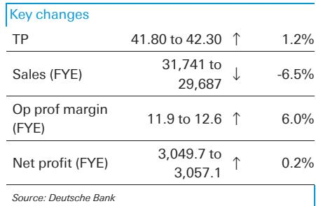

# Minth的欧洲业务：一家中国汽车零部件供应商的全球化转型观察

在2026年上半年，当中国国内乘用车批发量同比下降5.9%、国内零售量下降18.4%时，一家为欧洲汽车制造商供货的供应商却实现了净利润同比增长12%，创下半年业绩新高。总部位于深圳的电池壳体制造商敏实集团，其生产基地遍布中国及四个欧洲国家，期间电池壳体业务收入估计达48亿元人民币，同比增长33%，这一增长与欧洲电动汽车普及加速直接相关。

敏实集团的发展轨迹与中国整体汽车行业的对比十分鲜明。当中国汽车制造商面临投入成本上升——2026年1月至6月间磷酸铁锂电芯价格从每千瓦时360元人民币升至390元人民币，DRAM价格环比上涨约50%——敏实集团展现了保护其利润率的能力。该公司铝制品业务毛利率在2020年5月至2022年3月上一次铝价上涨期间，实际上从32.6%扩大至34%，管理层目前预计当前铝成本上升对2026年整体毛利率的影响将非常有限。

这不仅仅是一家公司运营韧性的故事。这是一个关于地域收入多元化如何与结构性需求变化相结合，将一家周期性汽车供应商转变为持续增长型企业的战略启示。对于研究中国工业公司的观察者而言，敏实的表现表明，海外业务已不再是一种防御性对冲，而是差异化的主要驱动力。

## 欧洲新能源汽车销售加速，直接推动敏实收入增长

2026年上半年欧洲汽车注册数据显示，市场正处于真正的电动化转折点。纯电动汽车注册量达到160万辆，同比增长35.1%，占欧洲新车总销量的22.2%。插电式混合动力汽车新增742,411辆，同比增长24.8%。仅6月份，纯电动汽车注册量同比增长51%，达到360,843辆，其中德国增长78%，法国增长93.5%，英国增长35%。

这些并非渐进式增长。欧洲三大纯电动汽车市场——6月份增长率均超过35%，其中两个超过78%——表明即使在政策支持成熟的情况下，消费者接受度仍在加速。油价上涨和市场支持措施共同创造了一个自我强化的循环：更高的燃料成本使电动汽车的总拥有成本计算更有利，而政府激励措施继续降低前期价格溢价。

对敏实而言，这种欧洲需求并非抽象利好。该公司的电池壳体客户几乎全部是欧洲原始设备制造商——梅赛德斯-奔驰、宝马、大众、斯特兰蒂斯、雷诺和沃尔沃汽车。敏实在塞尔维亚、捷克共和国、波兰和法国的生产基地意味着它不仅仅是向欧洲出口，而是嵌入了区域供应链。这种地理邻近性降低了物流成本和关税风险，同时能够为欧洲各地的装配线提供准时制交付。

欧洲电动汽车普及与敏实股价之间的相关性在经验上清晰可见。当2023年下半年欧洲电动化放缓时，敏实股价从2023年8月的25港元跌至2024年8月的10港元，跌幅达60%。当2024年第四季度欧洲新能源汽车销售恢复增长时，敏实股价回升至2026年2月的46.76港元，较低谷上涨超过四倍。将敏实视为中国汽车股的观察者可能忽略了关键点：该公司的估值现在直接取决于欧洲电动汽车渗透率。

## 敏实通过商品周期展现的利润率韧性创造复合收益优势

汽车零部件投资中的传统观点认为，供应商面临结构性利润率挤压：汽车制造商要求年度降价，原材料成本波动，竞争压力限制定价权。敏实的历史数据挑战了这一假设。在2020年5月至2022年3月的上一次铝价上涨期间，该公司铝制品业务毛利率实际上从32.6%改善至34%。

这一反直觉的结果有其特定机制。敏实提供从原材料加工到最终电池壳体产品组装的全方位集成服务。这种集成使公司能够通过合同指数化条款转嫁部分原材料成本上涨，同时从规模效应中获取效率收益。当铝价上涨时，集成度较低或订单较短的竞争对手面临利润率压缩；敏实的垂直整合模式使其能够维持甚至提高盈利能力。

当前周期正在再次检验这一论点。2026年铝价一直在上涨，但管理层已表示对整体毛利率的影响将"非常有限"。基于这一指引，分析师预计敏实2026年上半年整体毛利率将同比提高0.2个百分点至28.5%。这看似微小的改善，但在许多同行报告利润率侵蚀的汽车供应链背景下，稳定甚至改善的利润率状况是一项显著的竞争优势。

复合效应十分强大。随着上半年收入同比增长9%至估计134亿元人民币，毛利率略有扩大，敏实2026年上半年报告净利润预计将达到14.3亿元人民币的新半年纪录。这种收入增长与利润率韧性的结合，正是推动两位数利润增长、使其在中国整体汽车行业利润压缩中脱颖而出的原因。

## 中国国内汽车市场进入结构性调整，有利于出口导向型供应商

2026年中国国内汽车市场面临的挑战并非周期性，而是结构性的。自2026年1月1日起，中国政府开始对所有新能源汽车购买征收5%的车辆购置税，扭转了此前的免税政策。每辆车的以旧换新补贴也较2025年水平有所下降。这些政策变化代表了一种有意的调整：在多年慷慨补贴加速电动汽车普及后，北京正在逐步撤回财政支持。

影响在数据中可见。2026年上半年中国国内零售量同比下降18.4%。乘用车总批发量仅下降5.9%的相对少见原因是出口同比增长72.5%。中国汽车制造商实际上正在通过出口来应对国内需求问题，比亚迪2026年目标海外销量180万辆，奇瑞目标160万辆。

对敏实等供应商而言，含义明确。海外收入占比高的公司具有结构性优势。敏实2025年下半年已从海外获得总收入的62%。随着欧洲电动汽车普及加速和中国国内需求保持温和，这一比例可能会进一步上升。

政策环境对国内供应商也变得更加具有挑战性。中国政府最近宣布自2027年1月1日起改革车船税，将取消插电式混合动力汽车、增程式电动汽车和纯电动商用车的税收减免。这进一步降低了中国新能源汽车的总拥有成本优势，可能会进一步压缩国内需求。

观察者不应将此解读为对敏实的负面因素。该公司的欧洲业务使其免受国内政策逆风的影响。事实上，中国国内放缓与欧洲加速之间的分化创造了一个不对称机会：敏实受益于欧洲增长，同时部分免受中国需求疲软的影响。

## 当前周期评估中国汽车供应商的决策框架

敏实的案例研究提出了在当前环境下评估中国汽车供应商的四因素框架。首先，衡量海外收入占总收入的百分比，50%或更高的门槛可提供有意义的国内政策和需求风险隔离。其次，通过考察2020-2022年铝价上涨期间的表现来评估商品周期中的利润率韧性——如果供应商的利润率在此期间有所改善，该公司可能拥有结构性成本转嫁机制。第三，具体评估欧洲原始设备制造商的客户集中度，因为欧洲电动汽车普及的增速超过中国和美国。第四，验证供应商的生产足迹是否包括终端市场内或附近的区域设施，以降低关税风险和物流成本。

应用于敏实，该框架得出明确的积极评估。海外收入占比62%超过门槛。毛利率在上一个商品周期中有所改善。客户基础以欧洲原始设备制造商为主。在四个欧洲国家设有生产设施。这些因素共同构成了结构性优势。

该框架也突出了可能出错的地方。主要下行风险是欧洲新能源汽车销售复苏弱于预期，这将直接减少电池壳体产量。如果欧洲政府比预期更积极地撤回政策支持，或者利率上升抑制消费者对大宗商品的购买需求，这种情况可能发生。次要风险是如果上游汽车制造商在行业竞争加剧的情况下要求降价，可能导致利润率压缩，尽管敏实的集成模式提供了一定保护。

## 估值逻辑基于五年周期内电动化与智能化的成熟

采用7.9%的加权平均资本成本、3.5%的无风险利率和0.5%的终值增长率。五年预测期并非随意设定——它旨在捕捉中国汽车行业两大趋势的全面成熟：电动化和智能化。

加权平均资本成本假设较为保守。7.9%的资本成本，贝塔值为1.0，意味着股权风险溢价为4.4%，这对于一家拥有大量海外业务的中国公司来说是合理的。0.5%的终值增长率低于名义GDP增长预测，表明现金流折现模型并未依赖过于乐观的长期假设。

关键变量在于欧洲电动汽车注册量。如果注册量继续以每年35%的速度增长，敏实的电池壳体收入将以类似速度复合增长，现金流折现估值将被证明是保守的。如果欧洲普及速度放缓至个位数，估值将面临压力。

这不是一个为需要确定性的观察者准备的标的。这是一个适合相信欧洲电动化仍处于早期阶段、且一家定位良好、具有证明的利润率韧性的供应商将从这一趋势中获取不成比例价值的观察者的标的。

*仅供参考。部分内容可能基于源材料通过AI辅助生成、翻译、总结或编辑，可能存在遗漏或错误。请独立核实。本文不构成任何专业建议。*

仅供参考。部分内容可能基于源材料通过AI辅助生成、翻译、总结或编辑，可能存在遗漏或错误。请独立核实。本文不构成任何专业建议。

