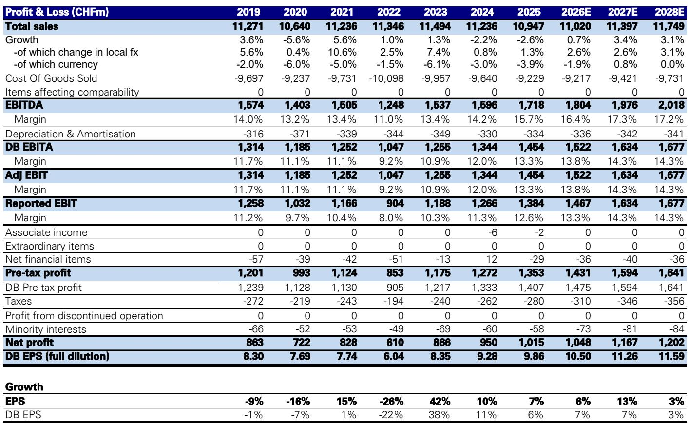
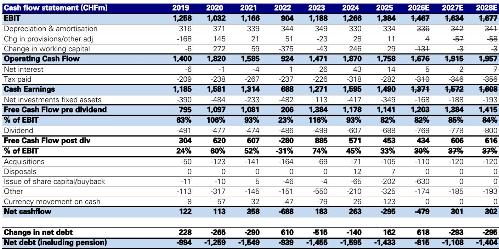
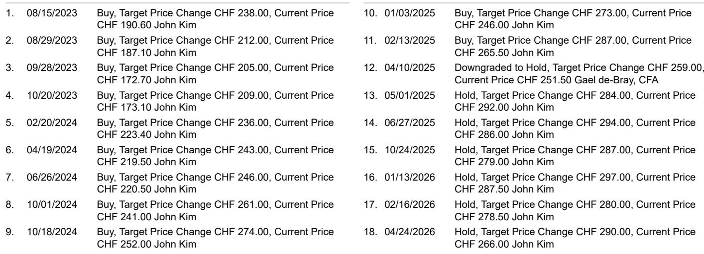

# Schindler’s Margin Story Is Slowing: The Timing Mismatch Between Price and Cost Now Defines the Risk-Reward

Schindler Group reported Q2 2026 with order growth of roughly 3% in local currency, matching Q1’s pace despite a softer comparison base. Revenue growth followed a similar trajectory, and the company continued to apply project selectivity—a disciplined approach that has been filtering into the numbers for several quarters. On the surface, this looks like steady execution. But beneath the headline, the engine of margin expansion is decelerating.

Adjusted EBIT margin expanded by only 35 basis points year-over-year in Q2, down from the rate achieved in Q1. Management explicitly cited stronger cost inflation as the cause, and they expect that headwind to intensify in the second half of the year. The company now forecasts roughly 35 million Swiss francs in total cost inflation for the year, with one-third hitting in the first half and two-thirds concentrated in the second. This is not a temporary blip; it reflects a structural tension in Schindler’s business model.

The core problem is a timing mismatch. Schindler, like other elevator and escalator companies, operates with long-duration order books, especially in new installations. When raw material costs rise—copper and aluminum are the key inputs here—the company can raise prices or apply surcharges. But those price actions take time to flow through to the profit-and-loss statement, while cost increases hit immediately. In Q2, that gap narrowed the margin gain. In H2, management expects it to widen.

This report argues that Schindler’s risk-reward profile is now balanced, not skewed to the upside. The stock trades at 23 times forward earnings, down from 28 times at the start of the year, but the margin trajectory offers less conviction than it did six months ago. The company is gaining share in Europe and modernization, and its backlog is growing with improving margins. Yet the cost headwinds, the negative revenue mix shift ahead, and the ongoing decline in Chinese new installations create enough uncertainty to justify the path to that target depends on whether Schindler can close the price-cost timing gap faster than management currently expects.

## The Margin Deceleration Is Real and Has a Named Cause: Stronger Cost Inflation in H2

The most important single data point from Q2 is the 35-basis-point year-over-year margin expansion, down from a faster pace in Q1. This is not a one-quarter anomaly. Management guided that the second half will see a more negative revenue mix as certain new installation projects that flattered H1 margins are delayed. On top of that, cost inflation is now expected to be roughly 35 million francs for the full year, with two-thirds of that weight falling in H2. The raw material pressure is coming from copper and aluminum, and while management expressed confidence in passing through energy cost increases, the timing of those pass-throughs remains uncertain.

The implication is clear: the margin expansion story that drove Schindler’s valuation higher in 2024 and early 2025 is losing momentum. The company still expects to deliver roughly 53 basis points of EBIT margin expansion for full-year 2026, but that is a trim versus prior expectations. For those who follow the stock on a margin recovery thesis, the incremental data points are now less supportive. The deceleration is real, it is explained, and it is front-loaded into the second half.

## Schindler Is Gaining Share in New Installation and Modernization, but China Remains a Structural Drag

Not all the news is negative. Schindler’s order backlog grew 6% in local currency, with margins improving sequentially. That backlog growth was driven by modernization, which posted low-double-digit growth. In new installations, order value grew high-single-digit and units grew low-double-digit, driven by Asia Pacific excluding China. In Europe, Schindler gained market share in both new installations and modernization.

These are genuine positives. They show that Schindler’s strategy of project selectivity—walking away from low-margin contracts—is not destroying volume. The company is winning where it chooses to compete. The modernization business, in particular, is a bright spot: orders grew 11% year-over-year against a tough comparison of 24% growth a year ago, and growth was broad-based across every region, including China.

But China is the counterweight. Chinese new installations continued to decline, and Schindler’s decline there was faster than that of its peers. This is not a market-wide slowdown; it is a company-specific share loss in a market that remains the world’s largest for elevator installations. The modernization growth in China is encouraging, but it cannot fully offset the volume and margin pressure in the new installation segment. For Schindler, China is a structural headwind that will persist for the foreseeable future, and it limits the upside from share gains elsewhere.

## The Price-Cost Timing Mismatch Creates a Self-Correcting but Slow Mechanism

Schindler’s business model has a natural hedge: when costs rise, the company raises prices. But the hedge operates with a lag. New installation contracts are typically longer-duration, so price increases agreed today take months or quarters to appear in revenue and margin. Meanwhile, raw material costs flow through to the P&L immediately. Management acknowledged this dynamic explicitly, noting that there is a time lag between price actions and their impact on the P&L, particularly in longer-duration new installation orders.

This timing mismatch is not a flaw in strategy; it is a feature of the industry. But it means that in periods of rapid cost inflation, margins compress before they expand. The question for observers is whether the compression is temporary and self-correcting, or whether it signals a more persistent margin ceiling. The report’s estimates suggest the former: Schindler’s EBIT margin is forecast to rise from 13.8% in 2026 to 14.3% in 2027, then at 14.3% in 2028. That is a gradual improvement, not a breakout.

The self-correcting mechanism works, but it works slowly. For a stock trading at 23 times earnings, slow margin improvement may not be enough to drive multiple expansion. The market is already pricing in a gradual recovery, and any disappointment on the pace of cost pass-through will likely cap the stock.

## A Decision Framework for Observers: Three Conditions Must Align for the Upside Case

For someone considering Schindler at current levels, the decision to observe or wait depends on three conditions aligning simultaneously. First, the cost inflation headwind must prove transitory. If copper and aluminum prices stabilize or decline, the 35-million-franc cost estimate will shrink, and the timing mismatch will work in Schindler’s favor rather than against it. Second, the revenue mix must not deteriorate further. Management expects a more negative mix in H2, but if new installation delays extend into 2027, the margin trajectory will be pushed out further. Third, Schindler must continue to gain share in modernization and in Europe to offset the Chinese new installation decline.

If all three conditions align, the stock’s valuation—23 times earnings, 16.4 times EV/EBITA—does not offer a wide margin of safety, but these are reasonable though not conservative. Any upward revision to the cost of capital or downward revision to long-term growth would reduce the target.

This framework does not argue for selling. It argues for patience and for monitoring the H2 cost and mix data closely. The risk-reward is balanced, not compelling.

## The Backlog Quality Is Improving, But New Installation Revenue Will Weigh on Near-Term Growth

A nuanced but important point: Schindler’s backlog grew 6% in local currency, and margins within that backlog improved sequentially. That is a signal that the company is winning better-quality business, not just more business. The improvement is driven by modernization, which carries higher margins and shorter lead times than new installations.

But new installation revenue is still expected to decline high-single-digit in local currency for the full year. That is a drag on group revenue growth, which is forecast at only 2.6% in local currency for 2026. Service revenue is expected to grow low-single to mid-single digit, and modernization should grow double-digit. The mix shift toward modernization is positive for margins in the long run, but in the near term, the decline in new installation revenue limits the overall growth rate.

This creates a tension. The backlog is improving, but the revenue line is not yet reflecting that improvement. The lag between order intake and revenue recognition means that the margin improvement in the backlog will take time to show up in reported results. For a company trading at a premium to its historical average, the market may not have the patience to wait.

## The Dividend and Balance Sheet Offer Support, But Not a Catalyst

Schindler’s balance sheet is strong. Net debt to equity is negative 22%, and net interest cover is over 40 times. The company generates free cash flow post-dividend of roughly 30-37% of EBIT, and the dividend yield is around 2.8% for 2026, rising to 3.0% by 2028. These are defensive characteristics that provide a floor under the stock in a risk-off environment.

But a 2.8% yield is not a catalyst for outperformance, especially when the stock has underperformed the Swiss Performance Index by a wide margin over the past year—down 15.7% absolute versus the index up 20.3%. The dividend is safe, but it does not change the earnings trajectory. The balance sheet provides optionality for acquisitions or share buybacks, but the report does not indicate any imminent capital allocation changes.

For income-oriented observers, Schindler offers stability. For total-return observers, the margin story needs to reaccelerate. Until that happens, the stock is likely to trade in a range.

*For informational purposes only. Portions may be generated, translated, summarized, or edited with AI assistance based on source materials and may contain omissions or errors. Please verify independently. This is not professional advice.*

For informational purposes only. Portions may be generated, translated, summarized, or edited with AI assistance based on source materials and may contain omissions or errors. Please verify independently. This is not professional advice.

