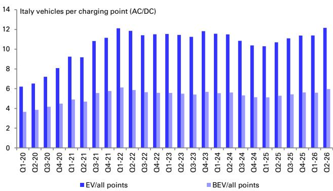
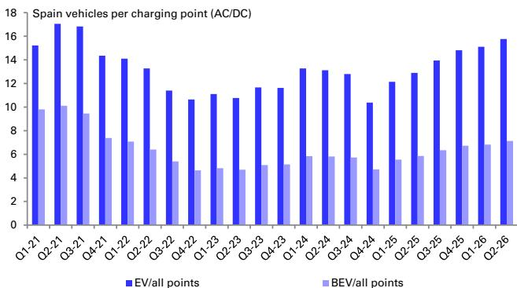

# 欧洲Q2充电需求变化与建设节奏观察

欧洲电动车充电市场正在经历一个结构性变化：需求侧的信号比以往更强烈，但供给侧的建设节奏在调整。根据7月23日发布的Q2行业观察，欧洲BEV注册量在6月出现显著回升，充电需求也随之走高，但公共充电桩的季度建设速度同比下降了20%。这一供需缺口正在扩大，对充电基础设施相关企业意味着持续的发展空间，同时也考验各国电网与审批效率。

报告的核心判断是：充电需求正在脱离季节性规律，进入一个由存量BEV利用率提升和新车注册加速共同驱动的上升阶段。而充电网络的建设速度，尤其是直流快充桩的渗透率，尚未跟上这一节奏。

## 1. 充电需求出现非季节性走强，BEV注册量6月表现突出

报告特别提到一个值得关注的信号：Fastned在Q1的充电需求数据已经显示出与往年不同的走势——在传统淡季反而走强。当时分析师将其归因于油价变化推动存量BEV使用率提升。但到了6月，EU5国家（德国、法国、英国、意大利、西班牙）的BEV注册量开始出现明显上升，整体表现优于汽车市场50个百分点。这意味着充电需求的增长正在从“存量利用率提升”转向“增量车辆入场”的双重驱动。

> **观察：** 这里的关键不是6月单月数据，而是“订单到注册通常有三个月滞后”这一机制。Q1的充电需求走强可能已经提前反映了Q2的新车交付，而6月注册数据的跳升，则意味着Q3的充电需求可能进一步走高。

## 2. 公共充电桩建设节奏调整，季度建设量同比下降20%

截至Q2末，欧盟公共充电桩总量达到117万个，同比增长18%，环比增长4%。但季度新增量仅为4.5万个，低于过去五年平均水平，也低于Q1的6.5万个。如果维持过去几年的平均建设速度，到2026年底欧盟充电网络规模预计为126.7万个——这一数字与AFIR法规要求的2030年目标之间仍有较大差距。报告估算，要达到目标，建设速度需要提升约7倍。

直流快充桩的占比在Q2环比上升30个基点至18.9%，但仍远低于满足高功率充电需求所需的水平。建设节奏调整与快充占比缓慢提升，构成了当前供给端的主要瓶颈。

## 3. EU5国家分化明显：意大利、西班牙领先，德国节奏变化

在EU5国家中，意大利和西班牙的充电网络增速领先，分别同比增长21%和20%。法国和英国与欧盟平均水平持平。德国则增速相对较低，为14%。报告指出，德国在Q1曾领先市场，这种波动反映了充电基础设施建设的行业特性——受审批、电网接入和施工周期影响较大。

从EV与充电桩的比值来看，英国以28.8倍继续位居EU5之首，且自2022年Q2以来持续上升，反映出电网拥堵对充电网络扩张的制约。意大利的比值最低，为12.2倍，但也在环比上升。这一指标上升意味着每根充电桩需要服务的电动车数量在增加，对充电网络的利用效率和排队体验构成不确定性。

## 4. 供需缺口扩大，相关企业受益逻辑清晰

报告认为，更强的BEV销售将直接转化为更高的充电需求，这对充电点运营商（如Fastned）和充电基础设施供应链企业（如Alfen）构成正面影响。Fastned将于8月13日发布Q2业绩，Alfen于8月18日发布，届时市场将获得更清晰的充电需求数据。

从更长的时间维度看，欧盟充电网络的建设缺口是结构性的，而非周期性的。AFIR法规虽然设定了功率输出目标，但实际建设节奏远未达标。这意味着，充电基础设施的“瓶颈”状态将持续，而能够突破审批、电网接入和施工效率限制的企业，将获得更高的议价能力和市场份额。

> **观察：** 报告没有直接给出研究结论，但逻辑链条很清晰——充电需求增长是确定的，建设缺口是确定的，那么能够帮助缩小这一缺口的企业（无论是运营商还是设备商）都处于有利位置。关键在于，Q2财报能否验证这一逻辑。

For informational purposes only. Portions may be generated,translated,summarized,or edited with AI assistance based on source materials and may contain omissions or errors. Please verify independently. This is not investment,legal,tax,accounting,or other professional advice.

For informational purposes only. Portions may be generated,translated,summarized,or edited with AI assistance based on source materials and may contain omissions or errors. Please verify independently. This is not investment,legal,tax,accounting,or other professional advice.

