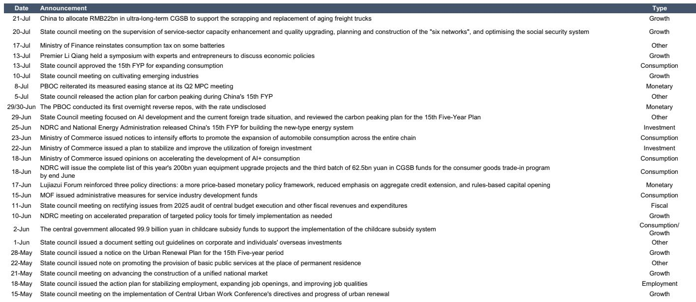

# 宏观环境信号呈现分化：消费端保持韧性，但工业端与市场信心出现调整

近期的高频数据显示，宏观环境呈现出一种结构性分化而非整体性波动。新房和二手房市场交易量在过去一周有所回升，并维持在接近或高于去年同期的水平。国内客运航班数量增加，取消率下降。这些指标并不指向广泛性的动能减弱。然而，在这些表面稳定的数据之下，其他指标则呈现出不同图景。钢材需求小幅回落。沿海省份煤炭消耗量下降。官方港口集装箱吞吐量仍低于去年同期水平。消费者信心指数出现回落。消费端活动的韧性与工业及外部需求的调整，构成了当前宏观阶段的主要特征。这种分化并非统计上的异常，而是一种结构性信号，表明政策干预正变得更加精准，而经济中仍有较大范围未获得充分支撑。

政策回应本身也强化了这一解读。自5月中旬以来，相关部门已宣布超过20项主要宏观政策举措，涵盖用于货车报废更新的超长期特别国债，以及扩大消费的“十五五”规划。然而，这些政策的影响并不均衡。央行在7月初重申了其稳健宽松的立场，银行间回购利率小幅下行，表明流动性充裕。但从政策意图到实际经济活动的传导仍不完整。地方政府专项债券今年迄今已发行2.36万亿元，这是一个可观的数字，但钢铁产量、煤炭消耗等工业生产指标并未以同等力度响应。经济并未面临突然停滞的风险，但也未积聚起政策制定者可能期望的动能。风险不在于危机，而在于一段增长低于潜力的时期，总需求不足以充分利用现有产能。

对于研究者和企业战略制定者而言，启示是清晰的：自上而下的宏观叙事已不再是可靠的指引。数据现在要求一种自下而上、分行业评估的方法。以下分析将最新高频指标转化为一个决策框架，用以区分真正的韧性与脆弱的企稳。

## 房地产市场企稳真实但范围有限，并不意味着固定资产投资的广泛复苏

30城新房日均成交量回升至接近去年同期水平，这是一个积极的信号。16城二手房成交量也小幅上升，并保持在高于去年同期的水平。这与政府近期对城市更新的重视、5月底发布的“十五五”城市更新规划以及专项债券用于基础设施的安排相一致。但房地产交易量是开发商财务状况的滞后指标，并且只有在持续数月后，才能成为土地销售和开工的先行指标。当前数据仅覆盖一周。更重要的是，房地产交易量受到政策驱动型需求释放的支撑，包括多个城市取消限购和降低房贷利率。这是一种有管理的企稳，而非家庭对房地产投资意愿的有机复苏。

更广泛的投资图景仍受到制约。过去一周钢材需求小幅回落，即便钢铁产量有所增加。这种分化表明库存正在累积，而非终端用户需求加速。沿海省份日均煤炭消耗量下降，尽管仍高于去年同期水平。高于去年同期的数据本身并不令人安心；它可能仅仅反映了更炎热的夏季和更高的降温需求。今年迄今已发行的2.36万亿元地方政府专项债券是一个庞大的数字，但发行节奏偏向后半段，且转化为实际建设活动的速度缓慢。7月战略性新兴产业采购经理人指数（EPMI）经季节性调整后微幅上升，但幅度有限。信息是：固定资产投资并未崩溃，但也未加速。房地产行业正在被企稳，而非复苏。对于研究者而言，这意味着与房地产相关的工业大宗商品和建筑材料的风险敞口，应基于一个持平或略有改善的环境来评估，而非周期性上升。

## 消费者信心出现软化，即使出行活动改善，预示着消费质量的结构性转变

国内客运航班数量进一步增加，取消率下降。过去一周交通拥堵状况有所缓解，这可能反映了道路网络效率的提高，或通勤强度的降低。Morning Consult消费者信心指数在过去一周出现下降。这是一个关键的分化。出行数据捕捉的是经济活动的*数量*：有多少人乘飞机，有多少车上路。消费者信心捕捉的是这些活动的*质量*：人们是否感到足够安全以自由消费，还是在精打细算。即使在出行活动保持高位的情况下，信心指数下降表明，消费结构正在向必需品转移，而非可选消费。

这一解读得到了政策记录的支持。自5月中旬以来，国务院已发布关于促进汽车全链条消费、加速人工智能+消费以及发布“十五五”扩大消费规划的通知。这些是供给侧措施，旨在创造新的消费类别，而非旨在提高家庭收入或减少预防性储蓄的需求侧措施。政府正试图为未来的消费增长构建基础设施，但并未解决消费者信心疲弱的直接阻力。财政部7月宣布恢复对部分电池征收消费税，这是一个虽小但具有启示性的信号：即使在促进消费的同时，当局也在管理财政收入需求。对于面向消费者的企业而言，这意味着销量增长可能持续，但随着消费者转向更低价的选项，每用户平均收入和利润率可能承压。

## 外部需求显现压力，但模式因行业和目的地高度分化

官方港口集装箱吞吐量仍低于去年同期水平，这是一个反映贸易量疲软的广泛指标。然而，在台风“巴威”过后，20个主要港口离港船舶货运量出现大幅反弹，这意味着潜在趋势曾受到天气因素的暂时干扰。中国对欧盟的稀土磁材出口量在6月出现反弹，而对美国和日本的出口量则基本持平。这是更大贸易图景的一个缩影：中国的出口表现日益依赖于战略性行业和特定贸易伙伴，而非广泛的竞争力。

对中国石油需求的即时预测在最新读数中小幅下降至每日1640万桶，这一下降既反映了工业活动减少，也可能反映了与出行相关的燃料消耗降低。7月17日，国内汽油和柴油价格每吨分别上调300元和290元，这是全球能源成本的传导，并增加了制造商和物流公司的投入成本压力。对于涉足全球贸易的公司而言，关键风险并非贸易量的突然崩溃，而是随着能源成本上升和发达市场需求保持温和，利润率持续受到挤压。稀土磁材数据显示欧盟是一个相对亮点，但美国和日本市场依然停滞。这表明贸易多元化正在发生，但速度缓慢，且整体蛋糕并未增长。

## 应对分化的决策框架

过去一周的数据可以组织成一个简单的2x2矩阵。第一个维度是国内需求与外部需求。第二个维度是数量与质量。国内需求数量保持稳定：航班、房地产交易和出行活动稳定或改善。国内需求质量正在恶化：消费者信心下降，消费税调整暗示财政压力。外部需求数量喜忧参半：港口吞吐量疲软，但台风过后船舶离港量反弹。外部需求质量同样喜忧参半：对欧盟的稀土磁材出口反弹，但对美日出口持平，石油需求下降。

战略启示是，研究者和企业规划者不应将所有积极数据点等同视之。如果钢材需求下降，房地产交易量的上升并非增加建筑材料风险敞口的信号。如果消费者信心下降，航班数量的增加并非投资可选零售的信号。正确的应对是，为经济持续增长但增速低于潜力、且增长结构受政策优先事项而非市场力量显著影响的场景做好准备。直接受益于政府债券发行的行业，如城市更新和设备升级，可能表现相对稳健。依赖于广泛消费者可选支出或一般工业生产的行业，则可能面临调整。政策追踪显示，自5月中旬以来，政府已发布至少五份与消费相关的政策文件，但其中均不涉及对家庭的直接现金转移。策略是构建消费的基础设施，而非直接提振消费。在这一情况改变之前，活动与信心之间的分化可能持续存在。

*仅供参考。部分内容可能基于源材料通过AI辅助生成、翻译、总结或编辑，可能存在遗漏或错误。请独立核实。本文不构成任何专业建议。*

仅供参考。部分内容可能基于源材料通过AI辅助生成、翻译、总结或编辑，可能存在遗漏或错误。请独立核实。本文不构成任何专业建议。

