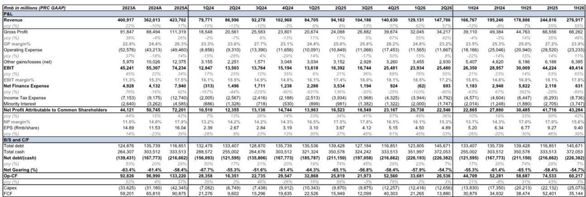
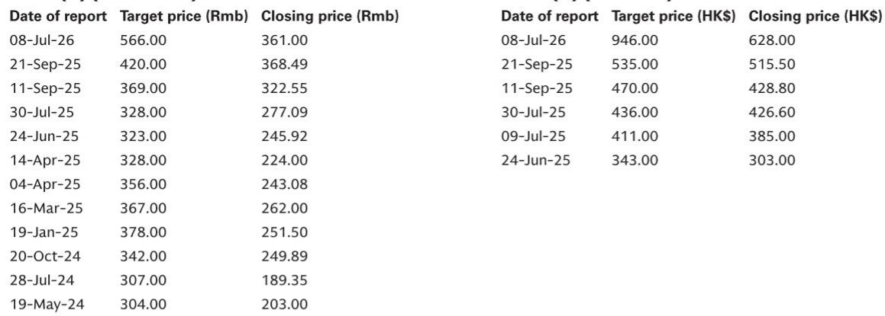
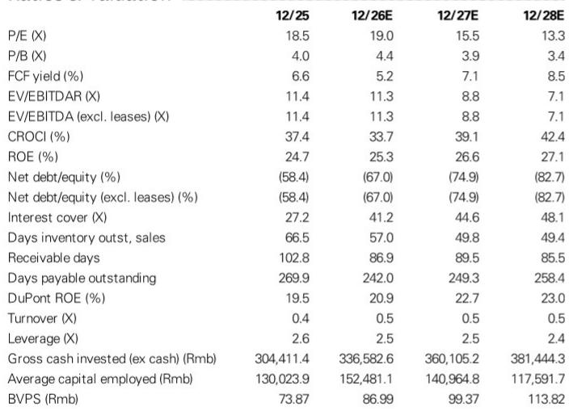

# GS：宁德时代业务与季度数据观察

宁德时代在7月24日盘后发布了二季度业绩。净利润达到225.5亿元，同比增长36%，与GS及市场预期的220-230亿元区间吻合。更值得关注的是，公司同步宣布了一项200-400亿元的相关市场回购计划，用于注销并减少注册资本，这是相关市场迄今规模最大的回购方案。在随后的分析师交流会上，管理层重申了对2026年下半年及2027年需求的乐观判断。

这份业绩报告的核心信号是：在行业价格竞争持续、单位利润环比下降的背景下，宁德时代用创纪录的营收和净利润证明了其规模效应和议价能力。而大规模回购计划的推出，则标志着公司在资本配置策略上的重要转变——从单纯追求产能扩张转向兼顾股东回报。

## 1. 二季度销量维持约60%同比增长，储能占比升至四分之一

上半年电池销量约435GWh，同比增长60%，其中储能电池占总销量的四分之一，较此前的20%有明显提升。二季度单季销量约235GWh，延续了自2025年四季度以来约60%的同比增速。

从收入结构看，上半年动力电池收入1921.3亿元，同比增长46%；储能电池收入532.6亿元，同比增长88%，销量几乎弹性较高。管理层在交流会上提到，海外出货占比已接近50%，并在德国、西班牙、智利、澳大利亚和马来西亚等地获得储能系统集成订单，海外订单增速超过国内。

> **KC评论：** 储能业务从“第二曲线”变成了真正的增长引擎。销量占比从20%跃升至25%，且海外订单增速超过国内，这意味着宁德时代的增长逻辑正在从国内动力电池单一驱动，转向“动力+储能+海外”三引擎模式。单位利润的短期波动，需要放在这个结构性变化中理解。

## 2. 单位净利润环比下降7%，成本传导机制仍在运行

二季度单位净利润为97元/kWh，较一季度的104元/kWh下降7%，也低于2025年四季度的103元/kWh。管理层将毛利率调整归因于产品组合变化和原材料成本上涨，但同时表示，通过金属价格联动的定价机制，成本上涨可以向下游传导。

从利润表细节看，二季度毛利率23.2%，同比下降2.4个百分点，略低于预期。但EBIT利润率17.2%，仅同比下降0.2个百分点，且高于预期0.8个百分点，主要得益于管理费用和减值损失低于预期，以及外汇对冲带来的回报表现增加。净利润率15.3%，同比下降2.3个百分点，主要受外汇波动影响——二季度外汇损失约11亿元，而去年同期为收益16亿元。

这份报告提供了一个观察框架：在原材料价格波动周期中，关注单位利润的相对水平不如关注公司能否通过定价机制和成本控制维持EBIT利润率的稳定。二季度EBIT利润率的表现说明，定价机制正在发挥作用。

## 3. 764GWh在建产能将在未来1-2年投产，钠离子电池商业化加速

管理层在交流会上透露，目前在建产能合计764GWh，大部分将在未来1-2年内投产。在高产能利用率和供应偏紧的背景下，这些产能将为增长提供支撑。

技术路线方面，钠离子电池已获得大额订单，柔性产线支持快速商业化，成本改善与规模挂钩。针对AI数据中心场景的储能解决方案，管理层预计将在未来1-2年内实现规模化商用。

从资产负债表看，二季度末净现金2263.8亿元，经营现金流265.4亿元，是净利润的1.2倍。资本支出126.6亿元，自由现金流138.8亿元。充裕的现金储备为大规模回购提供了基础。

## 4. 200-400亿元回购计划：资本配置逻辑的转变

此次回购计划是相关市场历史上规模最大的单笔回购方案，全部用于注销。结合中期分红64.9亿元（每股1.41元），宁德时代在2026年的股东回报总额可能超过260亿元，按当前市值计算，股东回报率约1.4%。

从财务数据看，公司2025年自由现金流908.8亿元，2026年预计957.3亿元。在资本支出高峰已过、经营现金流持续强劲的背景下，管理层选择将部分现金用于回购注销，而非继续大规模扩产，这反映了对自身估值水平的判断，也意味着公司进入了“现金回报”的新阶段。

> **KC评论：** 200-400亿元的回购规模，相当于当前市值的1.1%-2.2%。在相关市场，如此大规模的回购注销并不常见。这不仅是股东回报的改善，更是一个信号：管理层认为当前报价未能充分反映公司的盈利能力和增长前景。对于跟踪公司基本面的读者来说，回购计划的执行节奏和规模上限，将是观察管理层信心的重要窗口。

For informational purposes only. Portions may be generated,translated,summarized,or edited with AI assistance based on source materials and may contain omissions or errors. Please verify independently. This is not investment,legal,tax,accounting,or other professional advice.

For informational purposes only. Portions may be generated,translated,summarized,or edited with AI assistance based on source materials and may contain omissions or errors. Please verify independently. This is not investment,legal,tax,accounting,or other professional advice.

