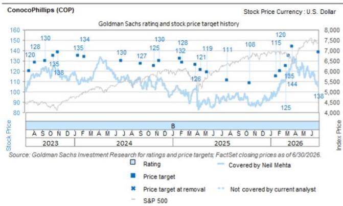
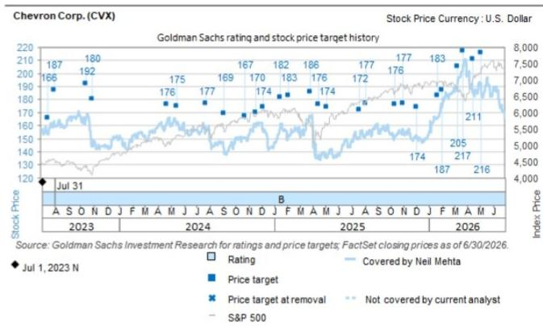
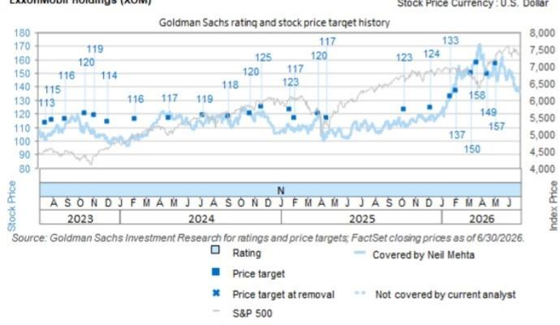

# 美国能源行业观察：原油

## 美国主要公司：关注估值与现金流增长；COP 整体回报潜力受关注

在本报告中，我们在2026年第二季度业绩公布前更新了对美国主要公司（XOM、CVX、COP）的预测，以反映市场价格变动下的商品价格和炼油利润率。在整个板块中，我们关注其对原油价格、炼油利润率以及中东地区生产情况的敞口。在宏观环境波动背景下，我们关注管理层是否维持长期生产增长、资本纪律和股东回报计划。我们特别关注雪佛龙（CVX）和康菲石油（COP）的估值与风险回报特征。我们对CVX的结构性观点基于其多元化、高利润率的产量组合，预计今年在二叠纪、哈萨克斯坦、美国湾和圭亚那地区将实现约7-10%的增长，勘探活动也带来额外空间。这一不断扩大的资产组合，加上资本纪律，有望在布伦特原油70美元/桶的假设下，推动调整后自由现金流和每股收益在2030年前实现约10%的年均增长。对于COP，重大项目投产和成本节约为其到2029年实现约70亿美元的自由现金流增长（基于WTI原油70美元/桶）以及到2030年约20-25%的自由现金流每股复合年增长率提供了清晰路径。这一增长也有望在整个周期内推动强劲的股东回报，约占经营现金流约45%，同时其在阿拉斯加、加拿Daiwa美国本土48州的竞争地位提供了对中东地区波动的经合组织敞口。详情请见下文。

Neil Mehta
+1(212)357-4042 | neil.mehta@gs.com
GS & Co. LLC

Alexa Petrick Breno
+1(917)343-9472 | alexa.breno@gs.com
GS & Co. LLC

Lydia Gould  
+1(212)357-9778 | lydia.gould@gs.com  
GS & Co. LLC

Josiah Knight
+1(212)357-9806 |
josiah.knight@gs.com
GS & Co. LLC

## 主要公司对比表

<table><tr><td rowspan="2"></td><td rowspan="2">评级</td><td>价格</td><td>目标</td><td>股息率</td><td>回报</td><td>总回报</td><td colspan="3">EV / DACF</td><td colspan="3">ND / EBITDA</td><td colspan="3">FCF / 股权价值</td></tr><tr><td>2026/7/24</td><td>12个月</td><td>%</td><td colspan="2">%</td><td>2026E</td><td>2027E</td><td>2028E</td><td>2026E</td><td>2027E</td><td>2028E</td><td>2026E</td><td>2027E</td><td>2028E</td></tr><tr><td colspan="16">美国主要公司</td></tr><tr><td>XOM</td><td>中性</td><td>$158.32</td><td>$164.00</td><td>2.6%</td><td>4%</td><td>6%</td><td>9.5x</td><td>10.2x</td><td>10.0x</td><td>0.2x</td><td>0.2x</td><td>0.2x</td><td>7%</td><td>6%</td><td>6%</td></tr><tr><td>CVX</td><td>关注</td><td>$196.51</td><td>$225.00</td><td>3.7%</td><td>14%</td><td>18%</td><td>7.5x</td><td>8.6x</td><td>8.5x</td><td>0.2x</td><td>0.3x</td><td>0.2x</td><td>10%</td><td>8%</td><td>8%</td></tr><tr><td>COP</td><td>关注</td><td>$121.34</td><td>$140.00</td><td>2.8%</td><td>15%</td><td>18%</td><td>6.6x</td><td>6.9x</td><td>6.9x</td><td>0.4x</td><td>0.4x</td><td>0.4x</td><td>8%</td><td>7%</td><td>8%</td></tr><tr><td>平均/合计</td><td>--</td><td>--</td><td>--</td><td>3.0%</td><td>11%</td><td>14%</td><td>7.9x</td><td>8.5x</td><td>8.5x</td><td>0.3x</td><td>0.3x</td><td>0.3x</td><td>8%</td><td>7%</td><td>7%</td></tr><tr><td colspan="16">欧洲主要公司</td></tr><tr><td>SHEL</td><td>关注</td><td>$88.77</td><td>$111.00</td><td>3.4%</td><td>25%</td><td>28%</td><td>5.1x</td><td>5.2x</td><td>5.1x</td><td>0.6x</td><td>0.5x</td><td>0.4x</td><td>12%</td><td>12%</td><td>12%</td></tr><tr><td>TTE</td><td>中性</td><td>$76.42</td><td>$78.00</td><td>4.5%</td><td>2%</td><td>7%</td><td>5.2x</td><td>5.6x</td><td>5.7x</td><td>0.6x</td><td>0.6x</td><td>0.6x</td><td>10%</td><td>10%</td><td>10%</td></tr><tr><td>BP</td><td>关注</td><td>$44.23</td><td>$52.00</td><td>4.5%</td><td>18%</td><td>22%</td><td>3.7x</td><td>3.9x</td><td>3.7x</td><td>0.4x</td><td>0.2x</td><td>0.1x</td><td>12%</td><td>12%</td><td>12%</td></tr><tr><td>EQNR</td><td>卖出</td><td>$394.13</td><td>$320.00</td><td>2.8%</td><td>-19%</td><td>-16%</td><td>4.0x</td><td>5.4x</td><td>5.4x</td><td>0.1x</td><td>0.1x</td><td>0.1x</td><td>12%</td><td>6%</td><td>6%</td></tr><tr><td>平均/合计</td><td>--</td><td>--</td><td>--</td><td>3.8%</td><td>6%</td><td>10%</td><td>4.5x</td><td>5.0x</td><td>5.0x</td><td>0.4x</td><td>0.3x</td><td>0.3x</td><td>11%</td><td>10%</td><td>10%</td></tr></table>

来源：FactSet，GS全球投资研究

## 康菲石油（COP，关注）

我们持续关注一系列增长项目，包括NFE、Port Arthur、NFS和Willow，这些项目有望推动产量和现金流增长。在经历了一个成功的冬季建设季后，Willow项目现已完成约50%，首批原油预计于2029年初产出，下一个里程碑是处理模块的海运。在美国本土48州，我们关注其活动水平的最新情况，此前公司计划在二叠纪增加一台钻机以匹配持续的完井效率和非作业支出的增加。尽管有这些积极的项目进展，我们仍关注近期来自本土48州天然气价格实现偏弱的因素，上一季度由于当地二叠纪供应过剩，其价格仅为亨利枢纽的约24%。在即将到来的业绩电话会上，我们也关注中东地区的时间安排更新，我们认为我们对NFE第一列装置在2027年第二季度启动的预测可能偏保守。

■ 管理层预计2026年第二季度产量约为218.5-221.5万桶油当量/天，而GS预测约为220万桶油当量/天，这反映了卡塔尔产量的排除、调整后的Surmont矿区使用费以及挪威和Montney地区约2万桶油当量/天的计划维护。

关于资本配置，我们注意到公司仍致力于将约45%的经营现金流返还给股东。尽管上一季度较低的资本回报率引发了一些读者的反馈，但我们预计这一指标将在未来几个季度恢复正常。因此，我们估计2027/2028年的总资本回报率约为7%。

全年资本支出指引仍维持在约120-125亿美元，支持2026年下半年二叠纪活动的增加。我们适度调整了资本支出预测，以反映更正常的递减模式，2027/2028年分别约为120亿美元和117亿美元。此外，我们继续关注成本削减方面的进展，管理层对在年底前实现约10亿美元的年度成本节约有信心。

我们目前预计2026年第二季度每股收益为2.92美元，而FactSet共识预期约为2.89美元。在业绩电话会上，我们预计管理层将讨论（a）本土48州产量、（b）阿拉斯加运营、（c）商品价格实现、（d）资本支出水平以及（e）液化天然气项目。

## 雪佛龙（CVX，关注）

我们关注哈萨克斯坦产量下降和CPC管道中断的进一步情况，以及其对田吉兹运营的影响。我们注意到，公司在上一季度末的美国产量超过约200万桶油当量/天，Gorgon和Wheatstone液化天然气设施满负荷运行，TCO产量超过约100万桶油当量/天，美国炼油厂原油加工量创纪录。在这些资产的支撑下，管理层预计今年总产量增长约7-10%。我们还关注其在拉丁美洲的强劲敞口，圭亚那即将投产的项目以及委内瑞拉和阿根廷的产量增长空间。

虽然下游业务在总利润中的占比相对较小，但我们认为随着管理层最大化产品利润率并优化物流以维持高开工率和可靠供应，整合效应将带来积极影响。在2026年第二季度，管理层预计全球权益原油加工量将同比增长超过一倍至40%，同时亚洲炼油厂利用率超过约80%。

长期来看，我们关注强劲的自由现金流增长和资本纪律。在布伦特原油约70美元/桶的假设下，管理层预计调整后自由现金流和每股收益在2030年前将实现约10%的年均增长。公司预计长期资本支出在约180-210亿美元区间，计划每年回购约100-200亿美元的股份，并预计在年底前实现约30-40亿美元的结构性成本节约。

我们还关注管理层关于人工智能/技术在二叠纪、美国湾和勘探区域应用的评论。此前，公司宣布与微软签署了一项为期20年的电力协议，将在西德克萨斯州的一个数据中心建设一座天然气发电设施。管理层预计该项目将提供2.67吉瓦的容量，使用GE Vernova涡轮机，并通过分阶段模块化设计进行扩展。该项目预计在今年晚些时候做出最终投资决定，我们关注其资本支出和现金流方面的更多信息，该项目目标实现中等双位数回报，首批电力预计于2028年交付。

我们目前预计2026年第二季度每股收益为5.76美元，而FactSet共识预期约为5.53美元。在业绩电话会上，我们预计管理层将讨论（a）国际产量、（b）美国业务活动、（c）资本配置优先级、（d）勘探工作以及（e）近期人工智能/电力相关进展。

## 埃克森美孚（XOM，中性）

我们注意到，公司最近的8-K文件显示，扣除时间效应和已识别项目的影响，其中点隐含每股收益约为3.60美元，上游、下游和化工业务环比均有所改善。

在中东局势再度紧张的背景下，我们关注卡塔尔两座受损液化天然气装置的恢复时间表。虽然中东业务约占上游产量的20%，但我们估计这些装置仅占总产量的约3%。公司此前指引显示，霍尔木兹海峡全面关闭一个季度将使公司中东产量较2025年减少约75万桶/天，并使全球产品解决方案产量较2025年第四季度下降约3%。

在上游其他方面，我们关注其专有的二叠纪技术（包括轻质支撑剂）的最新进展，该技术有望在2030年前将产量提升至约250万桶油当量/天，全年产量预计约为180万桶油当量/天。在圭亚那，管理层专注于运营执行、油藏优化、解除不可抗力下的区块限制以及为Uaru项目投产做准备。在液化天然气方面，我们预计巴布亚新几内亚和莫桑比克项目将在今年晚些时候做出最终投资决定，同时Golden Pass项目也在持续推进，该项目已于今年春季实现首次生产。与此同时，在下游业务方面，管理层致力于提高产品收率并抓住全球炼油利润率上升的机会，这得益于需求的韧性。

我们注意到资本配置策略保持不变，指引显示今年股份回购约200亿美元，资本支出约270-290亿美元。此外，公司在成本效率方面继续保持领先，预计到2030年（相比2019年）累计实现约200亿美元的结构性节约。鉴于其具有竞争力的二叠纪技术和较高的估值倍数，潜在的并购仍是读者关注的焦点。

我们目前预计2026年第二季度每股收益为3.62美元，而FactSet共识预期约为3.61美元。在业绩电话会上，我们预计管理层将讨论（a）优势二叠纪产量、（b）液化天然气战略、（c）勘探工作、（d）中东影响以及（e）并购机会。

## 估值与主要风险

COP。我们对COP持关注评级，基于12个月市盈率、EV/DACF和现金流折现法的目标价现为140美元（此前为138美元）。我们对中期周期预测应用13.5倍市盈率和7.5倍EV/DACF倍数（均未变）。我们的估值综合了85%的基本面价值（137美元）和15%的并购理论价值（160美元），后者基于将原油和天然气价格假设提高至布伦特原油80美元/桶和亨利枢纽3.75美元/百万英热单位。我们2026-2028年每股收益预测现为9.57/9.01/9.62美元（此前为9.16/9.01/9.60美元），以反映市场价格变动下的商品价格以及对产量、股份回购、运营成本和价格实现的调整。主要风险涉及商品价格、资本支出和运营执行。

CVX。我们对CVX持关注评级，基于12个月EV/DACF、自由现金流回报表现和市盈率的目标价现为225美元（此前为216美元）。我们对中期周期预测应用9.0倍EV/DACF倍数、15.0倍市盈率和7.0%自由现金流回报表现（均未变）。我们2026-2028年每股收益预测现为15.68/12.65/13.31美元（此前为15.00/12.44/13.10美元），以反映市场价格变动下的商品价格和炼油利润率，以及对产量、运营成本和价格实现的调整。主要风险涉及商品价格、炼油利润率和运营执行。

XOM。我们对XOM持中性评级，基于12个月EV/DACF、自由现金流回报表现和市盈率的目标价现为164美元（此前为157美元）。我们对中期周期预测应用9.5倍EV/DACF倍数、16.0倍市盈率和6.0%自由现金流回报表现（均未变）。我们2026-2028年每股收益预测现为11.37/10.24/10.63美元（此前为11.96/9.98/10.51美元），以反映市场价格变动下的商品价格和炼油利润率，以及对产量、炼油利用率、运营成本和价格实现的调整。主要风险涉及商品价格、炼油利润率和运营执行。

## 附录：披露信息

## Reg AC

我们，Neil Mehta、Alexa Petrick Breno、Lydia Gould和Josiah Knight，特此证明本报告中表达的所有观点均准确反映了我们个人对相关公司及其证券的看法。我们还证明，我们的薪酬中没有任何部分直接或间接与本报告中表达的具体建议或观点相关。

除非另有说明，本报告封面所列人员为GS全球投资研究部分析师。

撰稿作者：Neil Mehta GS & Co. LLC、Alexa Petrick Breno GS & Co. LLC、Lydia Gould GS & Co. LLC、Josiah Knight GS & Co. LLC。

除非另有说明，本报告撰稿作者披露中列出的个人为GS全球投资研究部分析师。

## GS因子概况

GS因子概况通过将股票的关键属性与市场（即我们评级的股票池）及其行业同行进行比较，提供投资背景。所描绘的四个关键属性是：增长、财务回报、倍数（例如估值）和综合（增长、财务回报和倍数的综合）。增长、财务回报和倍数通过使用每只股票特定指标的标准化排名计算得出。各指标的标准化排名随后被平均并转换为相关属性的百分位数。每个指标的具体计算可能因财年、行业和地区而异，但标准方法如下：

增长基于股票的前瞻性销售增长、EBITDA增长和每股收益增长（对于金融股，仅基于每股收益和销售增长），百分位数越高表示公司增长越快。财务回报基于股票的前瞻性净资产回报表现、已动用资本回报率和现金回报率（对于金融股，仅基于净资产回报表现），百分位数越高表示公司财务回报越高。倍数基于股票的前瞻性市盈率、市净率、价格/股息、EV/EBITDA、EV/FCF和EV/债务调整后现金流（对于金融股，仅基于市盈率、市净率和价格/股息），百分位数越高表示股票交易倍数越高。综合百分位数计算为增长百分位数、财务回报百分位数和（100% - 倍数百分位数）的平均值。

财务回报和倍数使用GS分析师对未来至少三个季度后的财年末的预测。增长使用对未来至少七个季度后的财年与未来至少三个季度后的财年相比的输入数据（所有指标均基于每股）。

有关我们如何计算GS因子概况的更详细说明，请联系您的GS代表。

## 并购排名

在我们的全球覆盖范围内，我们使用并购框架审视股票，同时考虑定性因素和定量因素（可能因行业和地区而异），以纳入某些公司可能被收购的可能性。然后我们分配一个并购排名，作为对我们评级覆盖下的公司进行评分的方法，从1到3，其中1表示公司成为收购目标的可能性较高（30%-50%），2表示中等可能性（15%-30%），3表示较低可能性（0%-15%）。对于排名为1或2的公司，按照我们的标准部门指引，我们在目标价中纳入并购组成部分。并购排名为3被视为不重要，因此不计入我们的目标价，并且可能在研究中讨论或不讨论。

## Quantum

Quantum是GS的专有数据库，提供详细的财务报表历史、预测和比率的访问。它可用于对单个公司进行深入分析，或在不同行业和市场的公司之间进行比较。

## 披露信息

雪佛龙、康菲石油和埃克森美孚控股的评级相对于其覆盖范围内的其他公司：CVR Energy Inc.、Calumet Inc.、Canadian Natural Resources Ltd.、Cenovus Energy Inc.、雪佛龙、康菲石油、Delek US Holdings、埃克森美孚控股、HF Sinclair Corp.、Imperial Oil Ltd.、Kosmos Energy Ltd.、Marathon Petroleum Corp.、PBF Energy Inc.、Par Pacific Holdings、Phillips 66、Suncor Energy Inc.、Valero Energy Corp.

## 公司特定监管披露

以下披露涉及GS集团及其关联公司与GS全球投资研究所涵盖公司之间的关系。

GS在过去12个月内因投资银行服务获得报酬：雪佛龙（194.42美元）、康菲石油（120.20美元）和埃克森美孚控股（156.89美元）

GS预计在未来3个月内将寻求或打算寻求投资银行服务报酬：雪佛龙（194.42美元）、康菲石油（120.20美元）和埃克森美孚控股（156.89美元）

GS在过去12个月内因非投资银行服务获得报酬：雪佛龙（194.42美元）和康菲石油（120.20美元）

GS在过去12个月内与以下公司存在投资银行服务客户关系：雪佛龙（194.42美元）、康菲石油（120.20美元）和埃克森美孚控股（156.89美元）

GS在过去12个月内与以下公司存在非投资银行证券相关服务客户关系：雪佛龙（194.42美元）和康菲石油（120.20美元）

GS在过去12个月内与以下公司存在非证券服务客户关系：雪佛龙（194.42美元）和康菲石油（120.20美元）

GS的一名董事和/或员工担任董事：雪佛龙（194.42美元）

GS做市于以下公司的证券或衍生品：雪佛龙（194.42美元）、康菲石油（120.20美元）和埃克森美孚控股（156.89美元）

埃克森美孚控股（XOM）

评级/投资银行关系分布 GS投资研究全球股票覆盖范围

<table><tr><td rowspan="2"></td><td colspan="3">评级分布</td><td colspan="3">投资银行关系</td></tr><tr><td>买入</td><td>持有</td><td>卖出</td><td>买入</td><td>持有</td><td>卖出</td></tr><tr><td>全球</td><td>50%</td><td>34%</td><td>16%</td><td>65%</td><td>59%</td><td>43%</td></tr></table>

截至2026年7月1日，GS全球投资研究对3,104只股票进行了投资评级。GS将股票指定为各种区域投资清单上的买入或卖出；未如此指定的股票被视为中性。此类指定对应于FINRA规则要求的上述披露中的买入、持有和卖出。请参阅下面的“评级、覆盖范围和相关定义”。投资银行关系图表反映了每个评级类别中GS在过去十二个月内提供过投资银行服务的公司所占的百分比。

## 目标价和评级历史图表

  
所示目标价应结合所有先前发布的GS报告（可能包含或不包含目标价）以及公司、行业和金融市场的发展情况来考虑。

  
所示目标价应结合所有先前发布的GS报告（可能包含或不包含目标价）以及公司、行业和金融市场的发展情况来考虑。

  
所示目标价应结合所有先前发布的GS报告（可能包含或不包含目标价）以及公司、行业和金融市场的发展情况来考虑。

## 目标价历史表格

埃克森美孚控股（XOM）  
雪佛龙（CVX）

<table><tr><td>报告日期</td><td>目标价（美元）</td><td>收盘价（美元）</td><td>报告日期</td><td>目标价（美元）</td><td>收盘价（美元）</td></tr><tr><td>2026-05-07</td><td>157.00</td><td>146.58</td><td>2026-05-06</td><td>216.00</td><td>185.16</td></tr><tr><td>2026-04-16</td><td>149.00</td><td>151.98</td><td>2026-04-16</td><td>211.00</td><td>188.15</td></tr><tr><td>2026-03-22</td><td>158.00</td><td>159.67</td><td>2026-03-22</td><td>217.00</td><td>201.73</td></tr><tr><td>2026-03-11</td><td>150.00</td><td>151.58</td><td>2026-03-11</td><td>205.00</td><td>191.79</td></tr><tr><td>2026-02-04</td><td>137.00</td><td>147.59</td><td>2026-02-02</td><td>187.00</td><td>174.03</td></tr><tr><td>2026-01-21</td><td>133.00</td><td>133.61</td><td>2026-01-21</td><td>183.00</td><td>166.73</td></tr><tr><td>2025-12-10</td><td>124.00</td><td>119.54</td><td>2025-12-04</td><td>174.00</td><td>152.26</td></tr><tr><td>2025-10-09</td><td>123.00</td><td>112.91</td><td>2025-11-03</td><td>177.00</td><td>154.04</td></tr><tr><td>2025-04-17</td><td>117.00</td><td>106.92</td><td>2025-10-13</td><td>176.00</td><td>151.94</td></tr><tr><td>2025-03-27</td><td>120.00</td><td>117.89</td><td>2025-08-06</td><td>177.00</td><td>152.78</td></tr><tr><td>2025-02-04</td><td>117.00</td><td>109.96</td><td>2025-07-22</td><td>172.00</td><td>150.04</td></tr></table>

埃克森美孚控股（XOM）

<table><tr><td>报告日期</td><td>目标价（美元）</td><td>收盘价（美元）</td></tr><tr><td>2025-01-23</td><td>123.00</td><td>110.15</td></tr><tr><td>2024-11-21</td><td>125.00</td><td>121.93</td></tr><tr><td>2024-10-24</td><td>120.00</td><td>119.59</td></tr><tr><td>2024-09-06</td><td>118.00</td><td>112.64</td></tr><tr><td>2024-07-10</td><td>119.00</td><td>111.92</td></tr><tr><td>2024-04-23</td><td>117.00</td><td>121.03</td></tr><tr><td>2024-02-06</td><td>116.00</td><td>102.25</td></tr><tr><td>2023-12-07</td><td>114.00</td><td>98.42</td></tr><tr><td>2023-11-06</td><td>119.00</td><td>105.87</td></tr><tr><td>2023-10-17</td><td>120.00</td><td>111.39</td></tr><tr><td>2023-09-01</td><td>116.00</td><td>113.52</td></tr><tr><td>2023-08-02</td><td>115.00</td><td>105.29</td></tr></table>

<table><tr><td colspan="3">雪佛龙（CVX）</td></tr><tr><td>报告日期</td><td>目标价（美元）</td><td>收盘价（美元）</td></tr><tr><td>2025-05-07</td><td>174.00</td><td>135.79</td></tr><tr><td>2025-04-17</td><td>176.00</td><td>137.87</td></tr><tr><td>2025-03-27</td><td>186.00</td><td>166.65</td></tr><tr><td>2025-02-04</td><td>183.00</td><td>153.22</td></tr><tr><td>2025-01-16</td><td>182.00</td><td>159.38</td></tr><tr><td>2024-12-06</td><td>174.00</td><td>155.24</td></tr><tr><td>2024-11-21</td><td>170.00</td><td>161.63</td></tr><tr><td>2024-10-24</td><td>167.00</td><td>150.45</td></tr><tr><td>2024-09-06</td><td>169.00</td><td>138.56</td></tr><tr><td>2024-07-26</td><td>177.00</td><td>157.84</td></tr><tr><td>2024-05-17</td><td>175.00</td><td>162.67</td></tr><tr><td>2024-04-23</td><td>176.00</td><td>162.85</td></tr><tr><td>2023-10-30</td><td>180.00</td><td>146.09</td></tr><tr><td>2023-10-17</td><td>192.00</td><td>167.59</td></tr><tr><td>2023-07-31</td><td>187.00</td><td>163.66</td></tr></table>

## 康菲石油（COP）

<table><tr><td>报告日期</td><td>目标价（美元）</td><td>收盘价（美元）</td></tr><tr><td>2026-06-29</td><td>138.00</td><td>104.20</td></tr><tr><td>2026-03-22</td><td>144.00</td><td>126.92</td></tr><tr><td>2026-03-11</td><td>135.00</td><td>117.03</td></tr><tr><td>2026-02-27</td><td>125.00</td><td>113.46</td></tr><tr><td>2026-02-06</td><td>120.00</td><td>107.62</td></tr><tr><td>2026-01-21</td><td>115.00</td><td>97.15</td></tr><tr><td>2025-10-16</td><td>108.00</td><td>86.91</td></tr><tr><td>2025-07-23</td><td>111.00</td><td>95.04</td></tr><tr><td>2025-05-09</td><td>119.00</td><td>88.59</td></tr><tr><td>2025-04-17</td><td>121.00</td><td>88.98</td></tr><tr><td>2025-03-27</td><td>126.00</td><td>102.82</td></tr><tr><td>2025-02-07</td><td>128.00</td><td>98.36</td></tr><tr><td>2025-01-29</td><td>132.00</td><td>101.56</td></tr><tr><td>2024-11-13</td><td>130.00</td><td>111.82</td></tr><tr><td>2024-10-24</td><td>125.00</td><td>104.37</td></tr><tr><td>2024-09-06</td><td>127.00</td><td>106.02</td></tr><tr><td>2024-06-24</td><td>130.00</td><td>115.17</td></tr><tr><td>2024-02-09</td><td>134.00</td><td>111.16</td></tr><tr><td>2024-01-16</td><td>135.00</td><td>108.64</td></tr><tr><td>2023-11-03</td><td>138.00</td><td>119.75</td></tr><tr><td>2023-10-17</td><td>135.00</td><td>125.46</td></tr><tr><td>2023-09-14</td><td>130.00</td><td>124.50</td></tr><tr><td>2023-08-07</td><td>128.00</td><td>114.48</td></tr></table>

表格中所示目标价未针对公司行为进行调整。

## 监管披露

## 美国法律法规要求的披露

请参阅上述公司特定监管披露，了解以下任何需要披露的信息：待定交易中的经理或联合经理；1%或其他所有权；特定服务的报酬；客户关系类型；先前期间的承销公开发行；董事职位；对于股票，做市和/或专家角色。GS可能作为本金交易本报告中讨论的发行人的债务证券（或相关衍生品）。

以下是额外的必要披露：所有权和重大利益冲突：GS政策禁止其分析师、向分析师报告的专业人员及其家庭成员持有分析师覆盖范围内的任何公司的证券。分析师薪酬：分析师的薪酬部分基于GS的盈利能力，其中包括投资银行收入。分析师作为高级职员或董事：GS政策通常禁止其分析师、向分析师报告的人员或其家庭成员在分析师覆盖范围内的任何公司担任高级职员、董事或顾问。非美国分析师：非美国分析师可能不是GS & Co. LLC的关联人员，因此可能不受FINRA规则2241或FINRA规则2242关于与主题公司沟通、公开露面以及交易所覆盖证券的限制。

## 美国以外司法管辖区法律法规要求的额外披露

以下披露是各司法管辖区要求的，除非已根据美国法律法规在上文作出。澳大利亚：GS Australia Pty Ltd及其关联公司不是澳大利亚《1959年银行法》定义的授权存款机构，在澳大利亚不提供银行服务，也不从事银行业务。除非GS另有约定，本研究及其访问权限仅面向澳大利亚《公司法》定义的“批发客户”。在制作研究报告时，GS Australia全球投资研究部的成员可能会参加由其研究报告所涉及的公司和其他实体主办或组织的现场访问和其他会议。在某些情况下，如果GS Australia认为在特定情况下与现场访问或会议相关是适当和合理的，此类现场访问或会议的费用可能部分或全部由相关发行人承担。如果本文件内容包含任何金融产品建议，则仅为一般性建议，由GS在未考虑客户目标、财务状况或需求的情况下编制。客户在根据此类建议采取行动前，应考虑该建议是否适合其自身目标、财务状况和需求。某些GS Australia和New Zealand的利益披露以及GS澳大利亚卖方研究独立性政策声明的副本可在以下网址获取：https://www.goldmansachs.com/disclosures/australia-new-zealand/index
