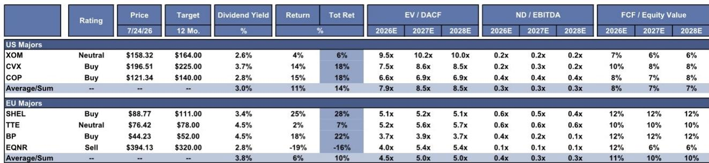
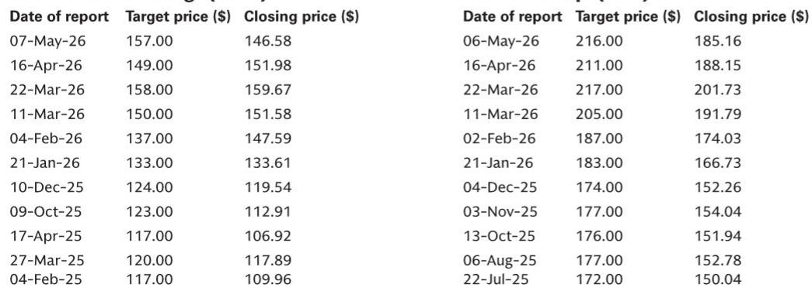

# 美国主要能源公司：生产增长与资本纪律分化下的观察

美国主要能源公司的格局已不再单一。多年来首次，美国三大能源公司在机构读者最关注的指标上出现显著分化：自由现金流增长轨迹、生产可见度和估值支撑。一份在全球能源行业中期报告发布前的研究报告明确指出了这种分化。埃克森美孚，评级为报告观点，以9.5倍远期EV/DACF交易，预期总回报为6%。雪佛龙和康菲石油，均评级为报告观点，各自提供18%的总回报，其背后是不同的增长引擎。对于管理周期性能源敞口的读者而言，选择不再是持有哪家主要公司，而是支持哪种结构性论点。

时机很重要。大宗商品价格仍处高位，炼油利润率稳健，中东生产风险已重新成为实际变量而非理论尾部风险。在此环境下，市场将奖励那些能够同时展示运营动能和资本配置可信度的公司。报告明确指出，三家美国主要公司中有两家现已达到这一标准。第三家虽然运营稳健，但面临估值天花板，在其增长叙事更具差异化之前，上行空间有限。

核心论点很直接。雪佛龙和康菲石油不仅相对于历史估值便宜。它们在结构上能够以当前估值尚未反映的速率复合自由现金流。在布伦特原油每桶70美元时，雪佛龙目标到2030年调整后自由现金流和每股收益年均增长约10%。康菲石油预计到2029年，在WTI每桶70美元时，自由现金流增长约70亿美元，同期每股自由现金流年复合增长率为20%至25%。这些并非周期性复苏故事。它们是得到具体、可衡量项目催化剂支撑的投资组合转型叙事。

## 雪佛龙的多元化生产基础与哈萨克斯坦催化剂：市场低估的自由现金流复合机器

雪佛龙的投资案例建立在一个既广泛又高利润的生产组合之上。公司上一季度末美国产量超过每日200万桶油当量，Gorgon和Wheatstone LNG满负荷运行，Tengiz产量超过每日100万桶，美国炼油厂以创纪录的原油加工量运行。管理层预计今年总产量增长7%至10%。这一增长并非假设。它锚定于特定资产：二叠纪盆地、哈萨克斯坦、美国湾和圭亚那，并辅以拉丁美洲勘探活动的额外上行空间。

哈萨克斯坦的敞口值得特别关注。Tengiz扩建项目一直是全球石油行业最复杂、延迟最多的项目之一。但报告显示，TCO产量现已超过每日100万桶，公司上一季度末该资产运行达到或超过预期。CPC管道流量中断和哈萨克斯坦产量下降仍是短期监控点，但基本生产轨迹保持不变。对读者而言，这意味着雪佛龙的国际生产风险正从二元悬而未决的问题转变为可管理的运营变量。

下游业务在雪佛龙总收益中所占比例较小，但整合策略值得注意。管理层正在最大化产品利润率并优化流量，以维持高利用率并向紧张的市场提供可靠供应。2026年第二季度，管理层预计全球权益原油加工量将同比增长一倍以上至40%，同时亚洲炼油厂利用率超过80%。这不是一个下游复苏故事。这是一个结构性利润率捕获策略，在全球炼油产能持续受限的情况下，其价值更高。

长期资本配置框架强化了复合论点。在布伦特原油每桶70美元时，管理层指引到2030年调整后自由现金流和每股收益年均增长约10%。资本支出预计保持在每年180亿至210亿美元区间。股票回购计划为每年100亿至200亿美元。预计到年底实现30亿至40亿美元的结构性成本节约。综合来看，这些数字描述了一家不仅向股东返还现金，同时还在投资于能够维持增长的投资组合的公司。

最近宣布的与微软在德克萨斯州西部共建天然气发电厂的20年电力协议增加了一个新维度。该项目目标容量为2.67吉瓦，使用GE Vernova涡轮机，并采用分阶段模块化设计。管理层预计回报率在15%左右，首批电力交付在2028年。对读者而言，这不是多元化布局。这是一个信号，表明雪佛龙愿意在回报达到其门槛时，将资本部署到相邻的能源基础设施中，并且其拥有大规模执行的资产负债表和运营信誉。

## 康菲石油：集团中最具吸引力的自由现金流增长轨迹，由清晰的项目管道和经合组织权重生产支撑

康菲石油提出了一个不同但同样引人注目的论点。该公司不如雪佛龙多元化，但其专注于经合组织辖区的大型、长周期项目，创造了一种读者应仔细权衡的独特风险状况。项目清单包括卡塔尔的NFE、亚瑟港LNG、NFS和阿拉斯加的Willow项目。这些不是勘探野猫井。它们是具有明确时间表和资本预算的开发阶段资产。

Willow是最明显的催化剂。在成功的冬季施工季之后，该项目现已完成约50%。首次产油仍按计划在2029年初，处理模块的海运将是下一个重要里程碑。对于康菲石油这样规模的公司，Willow代表了一个多年期产量增长驱动因素，从建设角度来看已基本去风险。报告指出，管理层还正在二叠纪增加一台钻机，以匹配持续的完井效率和非运营支出的增加，表明近期活动并未因长周期项目而牺牲。

自由现金流计算使估值案例引人注目。在WTI每桶70美元时，康菲石油预计到2029年自由现金流增长约70亿美元。到2030年的每股自由现金流年复合增长率估计为20%至25%。这些数字得到了具体成本削减目标的支持。管理层对在年底前实现约10亿美元的运行率节约充满信心。对于以6.6倍2026年EV/DACF评估该股票的读者而言，问题是市场是否正在为这一增长轨迹定价。根据报告的估值框架，答案是否定的。

资本回报框架同样重要。管理层目标是将运营现金流的约45%返还给股东。尽管上一季度较低的资本回报支付率引起了一些读者的质疑，但报告预计该指标将在未来几个季度正常化。估计2027年和2028年的总资本回报率约为7%。对于以收入为导向的机构读者而言，这一回报表现在行业内具有竞争力，尤其是与自由现金流增长状况相结合时。

地理敞口是一个审慎的风险管理选择。康菲石油在阿拉斯加、加拿Daiwa美国本土48州的竞争地位提供了经合组织敞口，使其投资组合免受中东波动的影响。在该地区地缘政治紧张局势重燃的时期，这不是一个小问题。报告明确指出，该公司以经合组织为主的产量状况为历史上曾影响中东敞口较大公司的那些中断类型提供了缓冲。

一个值得注意的局限性是来自美国本土48州天然气实现价格疲软的近期收益逆风，由于当地二叠纪供应过剩，上一季度该价格已降至亨利枢纽的约24%。这是一个具体、可衡量的拖累因素，读者应予以关注。然而，这不是结构性损害。二叠纪供应过剩是由基础设施限制导致的局部现象，报告的自由现金流长期估计锚定于油价，而非天然气实现价格。

## 埃克森美孚的估值天花板：执行可信度但近期估值倍数扩张催化剂有限

埃克森美孚仍然是三家美国主要公司中运营能力较强的。该公司最近的8-K文件显示，2026年第二季度隐含每股收益中点约为3.60美元，上游、下游和化工业务均实现环比改善。专有的二叠纪技术，包括轻质支撑剂，旨在到2030年将产量提升至约每日250万桶油当量。在圭亚那，管理层专注于运营执行、油藏优化和为Uaru项目启动做准备。在LNG方面，巴布亚新几内亚和莫桑比克的最终投资决定预计将在今年晚些时候做出。

问题不在于运营质量。而在于估值。以9.5倍2026年EV/DACF计算，埃克森美孚的交易价格高于雪佛龙的7.5倍和康菲石油的6.6倍。考虑到公司的规模、技术优势和成本效率计划（目标到2030年相对于2019年累计结构性节约200亿美元），这一溢价是合理的。但它也限制了上行空间：额外的2.6%股息回报表现，总回报约为6%。对于认为油价将保持高位的读者来说，这不是一个引人注目的风险回报主张。

中东敞口增加了另外两家主要公司未同等面临的复杂性。中东业务约占埃克森美孚上游产量的20%。卡塔尔两座受损LNG生产线的恢复时间表是一个具体的监控点。报告估计这些生产线约占总产量的3%，但更广泛的敞口是实质性的。公司先前的指引表明，霍尔木兹海峡全面关闭一个季度将使中东产量较2025年减少约每日75万桶，并使全球产品解决方案吞吐量较2025年第四季度降低约3%。对于一家以溢价倍数交易的公司而言，这种规模的尾部风险难以忽视。

鉴于埃克森美孚具有竞争力的二叠纪技术和溢价倍数，潜在的并购仍是读者的关键关注点。报告为康菲石油分配了并购理论价值成分，但未明确为埃克森美孚做同样处理。这与以下观点一致：埃克森美孚更可能是收购方而非目标，并且任何并购活动都需要对已经溢价的估值产生增值效应。

## 机构读者评估美国主要公司敞口的决策框架

对于构建或调整能源敞口的机构读者而言，三家美国主要公司呈现出三种不同的风险回报状况，对应不同的市场观点。以下框架将报告的分析综合为可操作的区别。

如果读者的主要信念是未来三到五年油价将保持在布伦特每桶70美元以上，那么雪佛龙提供了生产增长、自由现金流复合和股东回报之间最平衡的组合。今年7%至10%的产量增长锚定于具有可靠执行记录的特定资产。到2030年10%的年均自由现金流和每股收益增长得到了既纪律严明又灵活的资本支出框架的支持。18%的总回报估计，包括3.7%的股息回报表现和14%的价格升值，是集团中最具吸引力的，适合希望获得油价敞口而不承担不成比例运营风险的读者。

如果读者的主要信念是自由现金流增长将推动相对表现优于大盘，无论油价方向如何，那么康菲石油是最引人注目的选择。到2030年20%至25%的每股自由现金流年复合增长率是集团中最高的。6.6倍2026年EV/DACF倍数是最低的，创造了埃克森美孚所没有的估值缓冲。项目管道可见且已去风险。以经合组织为主的产量状况提供了地缘政治绝缘。18%的总回报估计与雪佛龙相当，但实现该回报的路径更依赖于公司特定执行而非大宗商品价格方向。

如果读者的主要信念是埃克森美孚的运营优势最终将获得更高倍数，那么当前的报告观点是等待而非回避的理由。公司的技术优势、成本效率计划和LNG期权价值是真实的。但9.5倍EV/DACF倍数几乎没有容错空间，中东敞口引入了尚未完全定价的尾部风险。6%的总回报估计不足以证明主动配置的合理性，除非且直到与雪佛龙和康菲石油的估值差距缩小。

贯穿所有三家公司的统一主题是资本纪律。每个管理团队都在维持生产增长、资本支出和股东回报的长期计划，尽管宏观环境波动。这不是2010年代的石油行业，当时价格上涨引发了顺周期资本支出浪潮。报告的估计反映了按市值计价的大宗商品价格和炼油利润率，但基本的资本配置框架未变。对读者而言，这是美国主要公司领域最重要的结构性转变，也是即使在当前估值下，对该领域进行选择性敞口仍然具有吸引力的原因。

*仅供参考。部分内容可能基于源材料通过AI辅助生成、翻译、总结或编辑，可能包含遗漏或错误。请独立核实。这不是投资、法律、税务、会计或其他专业建议。*

仅供参考。部分内容可能基于源材料通过AI辅助生成、翻译、总结或编辑，可能包含遗漏或错误。请独立核实。这不是投资、法律、税务、会计或其他专业建议。

