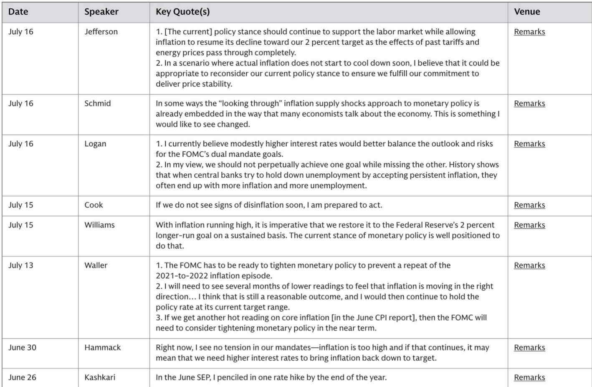
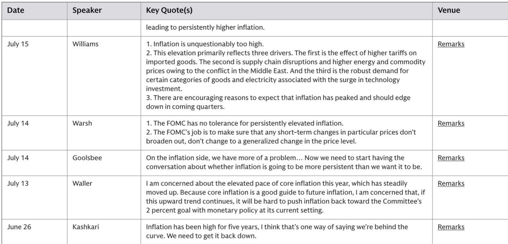
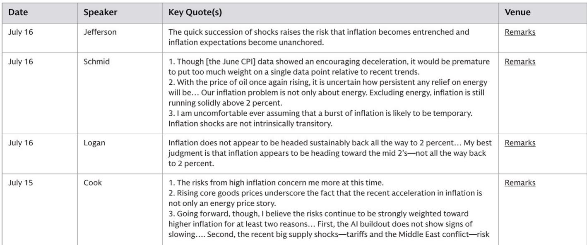

# 美联储内部关于通胀的分歧并非数据之争——而是关于供给冲击是否具有暂时性的分歧

美联储内部并非铁板一块。在6月CPI报告显示读数温和后，副主席杰斐逊表示当前政策立场“应继续支持劳动力市场，同时让通胀恢复下降”，而洛根行长则表示她认为“适度提高利率将更好地平衡前景和风险”。这些并非语气上的细微差别。它们反映了一种根本性的战略分歧，这种分歧将决定今年剩余时间的利率路径。

对这种分歧的传统解读是鹰派与鸽派之争。这种解读具有误导性。真正的分歧在于，一些官员认为当前通胀是由将自然消退的供给冲击（关税、能源价格和中东局势）驱动的，而另一些官员则认为这些冲击已嵌入核心通胀，需要主动抑制需求才能逆转。前者倾向于维持利率不变。后者则公开表示，如果未来几项数据未显示持续的通胀回落，他们将投票支持加息。

这一点之所以重要，是因为美联储的决策框架不仅仅关乎通胀是否高企。它关乎通胀持续高企的机制是结构性的还是暂时性的。这个问题的答案决定了终端利率是否已经达到，还是另一次加息即将到来。对于市场参与者而言，这一区别比任何单一CPI数据都更有价值。

以下分析将7月美联储官员公开评论转化为一个决策框架，该框架将依赖数据的信号与结构性论点区分开来。目标不是预测下一次FOMC投票结果，而是识别哪些条件会触发加息，哪些条件会支持维持利率不变——并评估哪一方的论据更为有力。

## 温和的CPI数据并未解决“维持派”与“加息派”之间的核心矛盾

6月CPI报告无疑令人鼓舞。它引发了一波官员评论，他们将其视为通缩进程仍在持续的佐证。副主席杰斐逊将当前政策立场描述为应“允许通胀恢复下降”，威廉姆斯行长也呼应称该立场“定位良好”，能够使通胀回归目标。这些表述都基于一个假设：温和的数据是趋势的开端，而非异常值。

但加息派并未退却。洛根行长在6月CPI数据公布后明确表示，她仍认为“适度提高利率将更好地平衡前景和风险”。沃勒理事将维持利率不变的意愿建立在需要“连续几个月看到较低读数”的条件上。库克理事直言不讳：“如果我们很快看不到通缩迹象，我准备采取行动。”哈马克行长更进一步，表示“通胀过高，如果这种情况持续，可能意味着我们需要提高利率。”

矛盾不在于通胀是否过高。所有人都同意这一点。矛盾在于6月数据是代表一个转折点，还是一次喘息。维持派押注推动通胀上升的供给冲击正在消退。加息派则押注这些冲击已嵌入更广泛的通胀动态中，不会自行修正。一份温和的CPI数据并不能解决这一赌局。它只是推迟了做出决定的时刻。

## 支持加息的结构性论点基于供给冲击不再具有暂时性的主张

加息派在分析上最重要的论点并非关于需求。而是关于当前通胀驱动因素的性质。施密德行长明确否定了通胀冲击是暂时性的假设，他表示：“我从不乐于假设一轮通胀爆发很可能是暂时的。通胀冲击本质上并非暂时性的。”这是对2021年指导美联储的框架的直接反驳，当时“暂时性”成为央行政策中最昂贵的词汇。

库克理事通过指出她认为将使通胀保持高位的两个结构性力量，强化了这一观点。首先，人工智能建设“没有显示出放缓迹象”，这推动了对某些类别商品和电力的强劲需求。其次，近期的供给冲击——关税和中东冲突——可能导致“持续更高的通胀”。这些并非一次性的价格水平调整。它们是持续的成本压力，通过供应链、投入成本和预期传导至核心通胀。

通常属于维持派的威廉姆斯行长也承认了相同的三个驱动因素：关税、中东地区的能源和大宗商品价格，以及技术投资需求。不同之处在于，威廉姆斯认为这些因素正在消退，而库克和施密德则认为它们将持续存在或变得具有结构性。这不是关于数据的分歧。这是关于传导机制的分歧。如果供给冲击完全传导，通胀将自行下降。如果它们变得根深蒂固，只有更高的利率才能打破这一循环。

## 通胀根深蒂固和预期脱锚的风险是加息最重要的理由

副主席杰斐逊提出了一个跨越维持派与加息派分歧的担忧：“冲击的快速接连发生增加了通胀变得根深蒂固和通胀预期脱锚的风险。”这不是一个预测。这是一个风险评估。这也是加息派最有力的论据。

其逻辑很简单。当通胀长期保持高位时，家庭和企业开始将这种通胀纳入其工资要求、定价决策和长期合同中。一旦预期发生转变，将通胀拉回低位所需的货币紧缩力度将比央行更早采取行动时大得多。美联储在1970年代吸取了这一教训。加息派认为当前阶段面临同样的风险。

沃勒理事表达了相关的担忧：“如果这种上升趋势持续下去，以当前货币政策设定将很难将通胀推回委员会2%的目标。”这是对当前立场有效性的陈述。沃勒的意思是，如果核心通胀继续上升，当前的利率水平将不足以使其下降，无论维持多久。这是现在就应该加息的直接论据，以免问题变得更难解决。

维持派反驳称，冲击正在传导，耐心将得到回报。但通胀根深蒂固的风险是不对称的。如果维持派错了，美联储将不得不在以后加息，可能幅度更大，而且可能在通胀预期已经转变之后。如果加息派错了，美联储将不必要地加息，对经济的抑制超过所需。加息派认为，在谨慎方面犯错成本低于在耐心方面犯错。

## 下一步行动的决策框架取决于核心通胀是滞后指标还是领先指标

从美联储官员评论中得出的最可行见解并非利率预测。而是各位官员为自己设定的决策框架。该框架可以概括为一个条件性陈述：如果核心通胀在未来几个月内未显示持续的通缩，加息派将有足够的票数采取行动。

关键变量不是整体CPI。而是核心通胀，特别是剔除能源后的核心商品和服务部分。库克理事指出，“核心商品价格上涨突显了近期通胀加速不仅仅是能源价格的故事。”施密德行长对此表示赞同：“剔除能源后，通胀仍稳稳运行在2%以上。”如果能源价格下跌但核心通胀仍居高不下，加息派将认为根本问题尚未解决。

关键的分析问题是核心通胀是滞后指标还是领先指标。如果是滞后指标，那么温和的CPI数据最终将传导至更低的核心读数，耐心是合理的。如果是领先指标，那么高核心通胀的持续性意味着温和的数据是一次性的，需要进一步收紧。维持派隐含地押注于滞后效应。加息派则押注核心通胀正在告诉他们一些关于经济结构的信息，而整体通胀并未反映这些信息。

对于市场参与者而言，这意味着未来两个月的核心通胀数据——特别是7月和8月的数据——将具有决定性作用。温和的核心数据将加强维持派的论据，使加息不太可能发生。火热的通胀数据将引发一波鹰派评论，并大幅改变加息的可能性。美联储并非处于自动驾驶状态。它正在等待数据来解决内部辩论。

## 最重要的战略意义在于美联储的反应函数已变得更加不对称

从7月评论中得出的最终见解是，美联储的反应函数现在以一种今年早些时候未曾有过的方式变得不对称。在2024年初，争论焦点在于定价多少次降息。现在，争论焦点在于是否要加息。这一转变改变了每个对政策利率敏感的资产类别的风险状况。

这种不对称只朝一个方向起作用。温和的通胀数据不会触发降息。它只会推迟加息。火热的通胀数据将触发加息，而且会很快发生。沃勒理事表示，如果6月CPI数据火热，“FOMC将需要考虑在近期内收紧货币政策。”卡什卡利行长在6月的SEP预测中已经预计年底前加息一次。加息派组织有序且直言不讳。维持派则处于守势且有所保留。

这种不对称之所以重要，是因为它意味着糟糕的通胀消息比好消息对市场的影响更大。温和的数据将带来宽慰，但政策不会改变。火热的数据将立即引发对整个利率路径的重新定价。因此，持有久期或利率敏感资产的风险回报比是向下的，直到数据明确地以有利于维持派的方式解决这场辩论。

美联储并非处于等待模式。它处于观察模式，但这种观察并非无所作为。这是关于通胀过程的两种在分析上自洽的观点之间的较量，结果将由接下来两个核心通胀数据决定。市场参与者应为加息派赢得这场较量、终端利率尚未达到的可能性做好准备。

*仅供参考。部分内容可能基于源材料通过AI辅助生成、翻译、总结或编辑，可能存在遗漏或错误。请独立核实。本文不构成投资、法律、税务、会计或其他专业建议。*

仅供参考。部分内容可能基于源材料通过AI辅助生成、翻译、总结或编辑，可能存在遗漏或错误。请独立核实。本文不构成投资、法律、税务、会计或其他专业建议。

