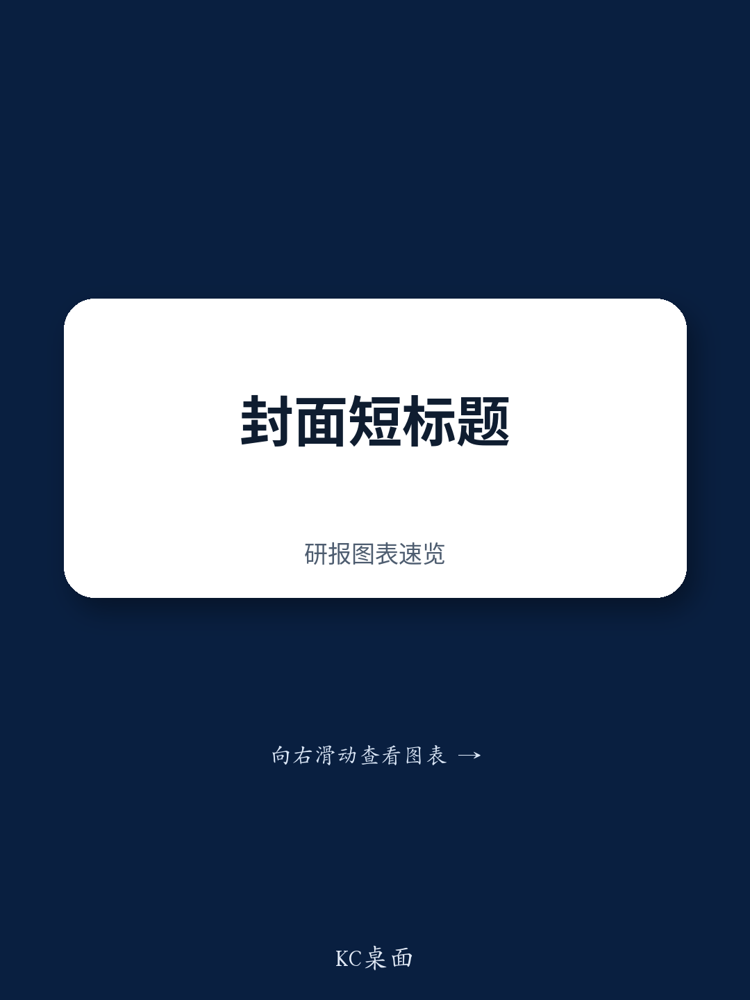

# 美国财政部悄然调整汇率政策框架：从对抗到条件化的转变

在最新发布的半年度报告中，美国财政部未将任何主要贸易伙伴列为汇率操纵国。这一标题虽在预期之内，却掩盖了一个更具深远意义的变化。报告并非维持现状，而是调整了分析框架，缓和了针对中国的措辞，并为经济体退出监测名单引入了条件化路径。对于那些多年来在汇率冲突被视为二元威胁（要么被贴上操纵国标签，要么没有）的环境中运作的市场参与者和企业财务管理者而言，新机制更为精细、更具条件性，也可能以自身方式带来新的不确定性。

2025年美元走弱为这一转变提供了宏观环境掩护。当美元走弱时，贸易伙伴货币自然升值，财政部自身的评估标准也更容易满足。但报告的变化远不止于有利的汇率环境。财政部现在释放信号，将更广泛地评估汇率实践——包括主权财富基金活动、养老基金行为和资本管制——同时为仅满足三项法定标准中一项的经济体提供可信的退出路径。这并非监管放松，而是对监管含义的重新校准。

影响显而易见。对于目前监测名单上的十个经济体——中国、日本、韩国、台湾地区、新加坡、越南、德国、爱尔兰、泰国和瑞士——问题不再是它们是否会被贴上操纵国标签，而是它们能否应对一套更广泛、更不透明、可能比旧有明确规则更具侵入性的隐性预期。对于市场参与者而言，风险并非由操纵国认定引发的突然汇率波动，而是全球最大经济体评估其最大贸易伙伴汇率实践的可预测性正在缓慢削弱。

## 财政部分析范围扩大尚未产生实质影响，但框架已具备法律基础

2026年1月的报告引入了更广泛的汇率实践评估标准，包括政府投资工具活动、外汇储备覆盖率、资本管制、货币政策以及财政部所称的“升值压力下的不对称干预”。7月的报告延续了这一扩展分析，详细阐述了日本政府养老投资基金、日本邮政银行和韩国国民年金公团的实践。报告未发现这些实践存在问题，尤其是在日本和韩国均面临显著贬值压力的背景下。但关于中国投资有限责任公司的章节被删除，财政部明确提到台湾地区近期对寿险公司外汇对冲规定的调整“也可能有助于减轻新台币的升值压力”。

其意义有两点。首先，财政部现已正式确立先例，将养老基金和主权财富基金活动纳入其合法分析领域。即便本轮未采取行动，未来干预的法律和行政基础设施已就位。其次，删除中投公司章节并不代表对华态度软化——而是表明财政部已从该调查方向获取了所需的分析价值。未发现问题的结论不等于没有担忧。对于拥有大规模国有资本池的经济体，信号明确：你们的结构性特征现已纳入考量，财政部将逐案判断它们是否构成有问题的汇率实践。

## 条件化退出机制为监测名单经济体创造新的激励结构

泰国、新加坡和瑞士在本报告中仅满足三项法定标准中的一项。财政部表示，如果它们在下一个报告期内满足少于两项标准，将被移出监测名单。这是一项实质性变化。此前，监测名单功能类似于半永久性指定，没有明确的退出路径。现在，首次出现了透明、基于标准的退出机制。

对这三个经济体的战略影响直接明了：它们有直接动力调整政策，使其剩余标准降至阈值以下。对于满足显著双边顺差标准的泰国，这可能意味着允许进一步货币升值或通过其他渠道降低出口竞争力。对于满足经常账户顺差标准的新加坡和瑞士，路径虽不那么明显，但同样意义重大。这两个经济体因其金融中心和出口枢纽角色而拥有结构性经常账户顺差。调整这些顺差需要要么通过政策变化减少储蓄或增加投资，要么通过汇率升值重新平衡贸易流动。

对于名单上其他七个经济体——中国、日本、韩国、台湾地区、越南、德国和爱尔兰——条件化退出机制不直接适用，因为它们各满足两项标准。但退出路径的存在改变了所有监测名单成员的政治考量。财政部现已证明，该名单并非永久性污点，而是带有明确退出路径的试用状态。这创造了新的谈判动态：经济体现在可以被要求做出具体政策调整以换取最终退出，而非仅仅被告知要遵守模糊的期望。

## 对华措辞转变标志着战术调整，而非战略撤退

7月报告在几个具体方面缓和了对华措辞。它不再强调允许人民币“根据宏观经济基本面及时有序地”走强的重要性，而是指出“随着贸易紧张局势缓解，当局转向允许人民币在2025年底前对美元渐进、有管理地升值”。它省略了此前关于中国政策“抑制进口”并强化“过度依赖出口增长”的表述。在承认中国主权财富基金不积极进行外汇交易后，财政部删除了关于中国政府投资工具的章节。

这些并非表面变化。每一次省略都代表着有意缓和修辞姿态的选择。财政部实际上是在承认中国已采取具体步骤——允许人民币渐进升值、缓解贸易紧张局势——并以更温和的措辞作为回应。但报告也重申了此前表述，即中国相对缺乏透明度不会阻止财政部在现有代理指标存在局限的情况下仍将其认定为操纵国。报告再次提到“对国内制造业的大规模非市场支持”。

总体效果是一种有条件的缓和。财政部释放信号，表示看到进展并愿意相应调整语气，但并未放弃任何法律权力或分析裁量权。对中国而言，激励明确：在汇率政策上持续合作将换来持续的修辞克制。但潜在的结构性担忧——缺乏透明度、产业政策支持——仍未解决，随时可能被重新激活。这不是战略撤退，而是战术调整，在允许近期关系更具建设性的同时，保留最大压力作为储备。

## 新框架下评估汇率风险的决策框架

对于企业财务管理者、主权读者和汇率策略师而言，旧框架简单：避免操纵国标签、避免监测名单，财政部就不太可能干预。新框架需要更细致的评估。根据报告逻辑，以下因素现在决定贸易伙伴是否面临财政部加强审查。

首先，满足法定标准的数量仍是主要筛选工具。满足两项或以上标准的经济体在监测名单上，无立即退出路径。满足一项标准的经济体有条件退出路径，但须证明持续合规。满足零项标准的经济体基本不在关注范围内，除非财政部行使1988年法案裁量权——目前其对此似乎并无强烈意愿。

其次，扩展的分析范围引入了新的风险因素。拥有大规模主权财富基金、活跃养老基金外汇操作或限制升值压力的资本管制的经济体，即使满足很少或零项法定标准，也面临额外审查。财政部决定从本报告中删除中投公司章节，并不意味着未来报告不会重新回到该调查方向。

第三，美元走势至关重要。本报告的建设性基调得益于美元走弱，这使得贸易伙伴货币自然升值。如果美元在下一个报告期内走强，财政部对相同经济体的评估可能发生显著变化。汇率风险现在具有路径依赖性——在弱美元环境下可接受的政策，在强美元环境下可能成为问题。

第四，条件化退出机制创造了新形式的政策杠杆。处于退出边缘的经济体将面临做出具体调整的压力，而远高于阈值的经济体可能面临较少直接审查，但仍将处于持续观察之下。财政部实际上创建了分层参与体系，对不同经济体根据其具体情况提出不同期望。

## 透明度附件的缺失削弱了财政部自身目标之一

1月报告包含一份关于外汇政策与实践透明度的附件。7月报告没有。理论上，通过定期披露提高透明度可以抑制外汇干预，使当局更难在缺乏公众监督的情况下行动。实践中，报告作者指出，在当局重申现有承诺或提供额外透明度的历史案例中，他们发现这种效果的证据有限。

因此，省略附件并非微小的编辑决定。它代表着承认透明度议程未达到预期效果。当局愿意披露更多关于其外汇操作的信息，但这种披露并未显著改变其行为。财政部实际上是在说：我们尝试了透明度路线，它未如预期奏效，我们不会继续发布一份没有可证明影响的附件。

对于市场参与者而言，这是一个有用的现实检验。认为更多数据总能带来更好结果的假设，在这一具体背景下并未得到证据支持。当局可以在满足透明度要求的同时，继续以财政部认为有问题的方式进行干预。附件的缺失并不意味着财政部放弃了透明度，而是意味着财政部正在将重点转向其他工具——扩展标准、条件化退出、修辞压力——它认为这些工具会更有效。

*仅供参考。部分内容可能基于源材料通过AI辅助生成、翻译、总结或编辑，可能存在遗漏或错误。请独立核实。本文不构成专业建议。*

仅供参考。部分内容可能基于源材料通过AI辅助生成、翻译、总结或编辑，可能存在遗漏或错误。请独立核实。本文不构成专业建议。

