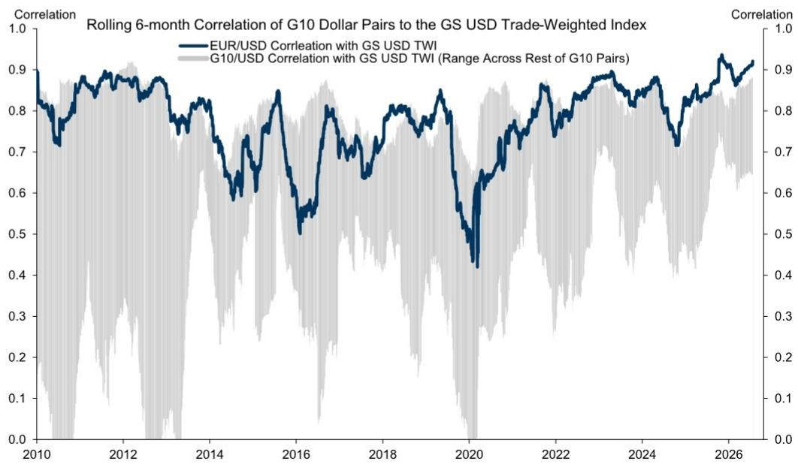

# 全球宏观观察

## 利差交易与能源因素

关于美元、欧元、英镑、南非兰特、日元、匈牙利福林、澳元/新西兰元及印尼盾的观察

■ **美元**：近期尽管宏观消息面较为丰富，但美元的实际波动范围相当有限。从过去几周的表层表现来看，一些熟悉的主题仍在驱动市场表现——高息与低息货币的利差交易最为突出，同时能源贸易条件也重新成为焦点。就后者而言，我们认为美元相对温和的表现与其起点较强以及避险需求低于3月份的情况一致。不过，能源价格高企也应为美元提供一定支撑。如果油价维持高位，我们预计累计加息定价或美元反应不会有太大变化。从中期来看，我们认为美联储维持利率不变至年底的预期，对其G10货币表现构成温和但可控的影响。利差、贸易条件和相关回报前景等因素，仍是我们对未来几个月美元表现分化这一基准展望的关键。尽管如此，我们仍看到一些路径——如冲突再度升级、关于AI资本支出的讨论，以及英国和日本等地转向更扩张性财政政策——可能导致更分化且更具破坏性的汇率波动。低隐含波动率似乎与实际的行情表现相符，但也放大了汇率在对冲这些情景中的价值。

**欧元**：处于阴影之中。从许多方面来看，欧元继续作为美元广泛走势的镜像进行交易。两者之间的相关性近几个月来异常紧密，超过任何其他G10货币对（图表1）。我们认为，这在一定程度上反映了欧元区本土数据和政策带来的特定波动有限。德国财政支出持续推进，但其对区域增长的影响已被全球能源冲击所抵消。欧洲央行的政策通常也传达得较为清晰，包括本周会议维持利率不变，以及9月加息被广泛预期和定价。虽然加息定价已明显领先于我们经济学家对9月最后一次加息的基准预期，但这一动态在几乎所有G10市场中都很常见，我们认为这提高了欧洲央行驱动的利率差异变化对欧元表现产生实质性影响的门槛。从全球角度来看，欧元在贸易条件冲击（尤其是欧洲天然气价格现在比3月/4月时参与度更高）以及高息与低息货币的分化中均处于不利地位。我们认为这两个全球主题目前是汇率市场展望的核心，应有助于在未来几个月对欧元/美元构成一定影响，并支持以欧元融资的利差交易。

图表1：欧元与广义美元的相关性比任何其他G10货币对都更紧密

来源：GS FICC和股票，GS全球投资研究

**英镑**：首周表现偏弱。伯纳姆政府首周的支出公告规模相对较小。但围绕其计划融资来源的疑问——以及未来更大规模支出计划的前景——使读者重新关注英国财政方面的风险和约束。我们认为，这种重新审视帮助英镑在本周回吐了7月部分涨幅，同时能源价格回升和相关避险情绪也构成拖累。英镑7月部分脱离周期性基本面的走势因此有所回调，但我们认为近期风险偏向于延续过去一周的主题和行情。展望中期，我们认为首周的事态发展意味着财政溢价回归的风险增加，并可能在秋季预算前后引发英镑的阶段性波动。这些波动在我们看来仍应相对短暂，但一旦出现，很可能与英国宏观风险方向一致——尤其是英国央行加息定价的回调，这在其他G10市场中更为明显地超出了我们经济学家维持利率不变的基准预期。英镑的长期前景在我们看来则更为平衡。该货币的结构性高估仍是一个关键因素，但应部分被英镑相对较强的利差优势所抵消。

**南非兰特**：支撑有限。兰特本周在SARB维持利率不变的决定后走弱，该决定与彭博共识和市场定价相悖（尽管符合我们经济学家的预期）。我们认为这一汇率反应与意外程度一致，特别是考虑到它恰逢6月通胀数据强于预期以及近期能源价格上涨。后者导致南非贸易条件恶化。贸易条件下降本身对兰特构成显著影响，兰特自冲突开始以来一直是对油价变化最敏感的货币之一。从某些方面来看，做多兰特的逻辑并未发生实质性转变，因为它此前基于能源价格持续下跌，或至少油价上行尾部风险被压缩的情景。然而，随着能源供应和价格的不确定性和风险增加，SARB的沟通并未从汇率读者的角度适应这一背景。这使得兰特在短期内更容易受到能源价格波动和更广泛新兴市场风险情绪的影响，尤其是汇率利差不像其他能源进口国那样高。不过，从中期来看，假设油价趋于温和，我们认为美元/南非兰特的当前水平为博弈冲突缓和以及依然强劲的本地基本面提供了有吸引力的切入点，尤其是在财政方面。

**日元**：对利差交易更为谨慎。美元/日元已攀升至40年新高，战术性日元空头头寸接近2024年7月干预及随后8月初利差交易平仓前的拉伸水平（图表2）。这一点，加上围绕能源、政策和AI的波动性上升（迄今对汇率影响较小），引发了对美元/日元可能大幅下跌的担忧。我们认为头寸方面的脆弱性相似，应使读者保持警惕，尤其是资金回流可能性增加时。但突然平仓的风险看起来比当时略低。2024年夏季，市场越来越担心美国经济衰退并定价美联储降息——推动回报表现和股票同时走低，而日元往往在这种时候表现最佳。现在，美国经济看起来越来越远离衰退，美联储在整体积极的风险环境中积极考虑加息。如果美联储确实开始收紧，短期内可能对美国股票构成挑战，并限制日元相对其他货币的弱势。但日元走强引发平仓的催化剂将是AI估值受到更多质疑，导致回报表现与股票一同走低。我们仍预计美联储不会加息，风险情绪将保持积极，这应继续推动美元/日元走高。此外，国内财政风险看起来可能继续对日本国债和日元构成影响，尤其是如果政府在8月初推动通过消费税削减——与其转向更宽松的短期财政框架一致。但读者有理由关注利差交易平仓的风险，因为虽然宏观环境可能不那么有利于日元走强（除非日本央行转向更激进的加息），但干预可以显著减少投机性头寸。我们已经看到，当更广泛的宏观环境指向相反方向时，日元买入操作的有效性往往相对短暂。然而，成功鼓励资金回流的政策将是一个更可信和可持续的杠杆，可能催化其严重低估的修复，尤其是如果美国前景走弱。政府似乎比我们想象的更接近推行这一政策。这很可能是一个渐进且低调的过程，特别是为了保留更具吸引力的入场水平。但如果资金流开始显示出一些轮动迹象，那可能标志着长期头寸平仓的开始。总体而言，我们认为近期压力将继续对日元构成影响。但更快速且更无序的贬值可能会进一步提高干预风险——以及可能是最可信的形式，也可能改变长期轨迹。

图表2：战术性日元空头头寸接近2024年8月利差交易平仓前的拉伸水平

来源：Haver Analytics，CFTC，GS全球投资研究

■ **匈牙利福林**：恰到好处。上周我们讨论过，虽然我们维持对福林中期的建设性展望，但近期动态看起来更具挑战性，因为全球因素仍然不利（即能源价格上涨），而额外的积极本地催化剂（如较低的通胀目标）可能要到今年晚些时候才会显现。在此背景下，本周MNB会议并未给福林带来太多缓解，央行降息25个基点（符合广泛预期）并维持下月再次降息的指引。MNB还表示国内风险溢价下降持续，略微软化了关于汇率稳定有助于锚定通胀预期的措辞，行长Varga指出福林既不太强也不太弱。我们认为，这表明自6月中旬以来的欧元/福林上涨幅度还不足以引发更显著的政策立场变化（可能是因为通胀发展仍然温和），并且目前倾向于将国家风险溢价减少的更大份额反映在利率而非汇率上。当然，如果福林从当前水平大幅快速走弱，或者能源价格大幅上涨，我们预计政策会有更大转变。但就目前而言，由于本地锚定因素较弱，我们预计福林的日常波动将继续主要由全球因素驱动。

**澳元/新西兰元**：受到提振。上周我们注意到澳元/新西兰元可能终于迎来转折，但本周该货币对因中东局势再度升级导致能源价格大幅上涨而受到提振。澳大利亚6月就业报告也略强于预期，就业增长和参与率均出现上行惊喜。尽管如此，我们的经济学家提醒，第二季度失业率平均比RBA预测高出20个基点，就业不足率在过去两个月上升了60个基点，他们继续预计劳动力市场状况将趋于温和。与此同时，在新西兰，第二季度CPI意外上行，整体通胀加速至同比4.1%。作为回应，我们的经济学家现在预计RBNZ将在12月额外加息25个基点，加上已经确定的9月加息。综合来看，这些国内发展与我们关于新西兰数据和政策正趋同于澳大利亚及更广泛G10背景的观点基本一致。我们继续认为澳元/新西兰元中期存在回调空间，并倾向于使用长期澳元/新西兰元看跌期权来表达这一观点，同时管理围绕战术催化剂的近期波动。然而，新西兰通胀意外对澳元/新西兰元缺乏后续影响，表明能源价格压力重现是这一观点面临的关键风险。虽然澳元/新西兰元对能源价格的敏感性在最近几周有所减弱——使我们在尽管存在贸易条件风险的情况下仍对下行感到放心——但更持久的能源冲击可能重新建立对该交叉盘的持续上行压力，抵消国内基本面。

**印尼盾**：稳定但仍需谨慎。在年初至今大幅贬值和表现落后之后，印尼盾在过去一个月趋于稳定。作为部分回应，BI本周维持政策利率不变（此前今年已累计加息100个基点至5.75%），但扩大了吸引外资流入的激励措施。这些措施包括将对冲在岸资产（如地方政府债券）的读者折扣提高至12.5%，并引入15%的国内无本金交割远期折扣。我们认为，BI的决定反映了其对通胀保持在目标范围内的满意，同时保留了政策空间（以备日后加息），以防美联储加息导致印尼盾再次面临贬值压力。本地方面，消息面也趋于稳定，但中期挑战依然存在。标普于7月13日确认印尼'BBB'评级，展望稳定，这提供了一些缓解；国内股票市场在6月避免了MSCI从新兴市场下调至前沿市场，但指数提供商的讯息仍然谨慎，下一次评估在11月。尽管如此，读者仍然担心扩大BI授权范围的法律及其对通胀目标框架的影响；政府监管自然资源出口的计划以及增加的官僚程序是否会导致延误；以及政府的财政需求，包括维持燃料补贴和免费餐计划，是否会危及3%的财政赤字上限。鉴于这些国内担忧，我们对印尼盾保持谨慎，并预计其表现将落后于其他北亚货币。

## 全球汇率预测

[表格内容保留，因涉及大量数据，此处省略具体数值，请参考原文链接]

查看动态表格（或点击上方图片）：https://publishing.gs.com/content/themes/fx-forecasts.html
来源：GS全球投资研究

## 回报预测与估值

[表格内容保留，因涉及大量数据，此处省略具体数值，请参考原文链接]

查看动态表格（或点击上方图片）：https://publishing.gs.com/content/themes/table.html?criteriaKey=1k2HGqqS2h
来源：GS全球投资研究

## 披露附录

## Reg AC

我们，Kamakshya Trivedi, Michael Cahill, Danny Suwanapruti, Teresa Alves, Karen Reichgott Fishman, Stuart Jenkins, Victor Engel 和 Lexi Kanter，特此证明本报告中表达的所有观点准确反映了我们的个人观点，这些观点未受公司业务或客户关系考虑的影响。

除非另有说明，本报告封面所列的个人是GS全球投资研究部门的分析师。

贡献作者：Kamakshya Trivedi GS International, Michael Cahill GS International, Danny Suwanapruti GS (Singapore) Pte, Teresa Alves GS International, Karen Reichgott Fishman GS & Co. LLC, Stuart Jenkins GS International, Victor Engel GS International, Lexi Kanter GS & Co. LLC。

除非另有说明，本报告贡献作者披露中列出的个人是GS全球投资研究部门的分析师。

## 披露信息

## 监管披露

## 美国法律法规要求的披露

请参阅上述针对本报告提及公司的特定监管披露，了解以下任何要求的披露：待定交易中的经理或联合经理；1%或其他所有权；特定服务的报酬；客户关系类型；先前期间的已管理/联合管理公开发行；董事职位；对于股权证券，做市和/或专家角色。GS可能作为本金交易本报告讨论的发行人的债务证券（或相关衍生品）。

以下为额外要求的披露：所有权和重大利益冲突：GS政策禁止其分析师、向分析师报告的专业人员及其家庭成员持有分析师覆盖范围内任何公司的证券。分析师薪酬：分析师的薪酬部分基于GS的盈利能力，其中包括投资银行收入。分析师作为高管或董事：GS政策通常禁止其分析师、向分析师报告的人员或其家庭成员担任分析师覆盖范围内任何公司的高管、董事或顾问。非美国分析师：非美国分析师可能不是GS & Co. LLC的关联人士，因此可能不受FINRA规则2241或FINRA规则2242关于与主题公司沟通、公开露面以及交易分析师所覆盖证券的限制。

## 美国以外司法管辖区法律法规要求的额外披露

以下为所指示司法管辖区要求的披露，除非已根据美国法律法规在上文作出。澳大利亚：GS Australia Pty Ltd及其关联公司不是澳大利亚的授权存款机构（该术语在1959年银行法（联邦）中定义），不提供银行服务，也不在澳大利亚开展银行业务。除非GS另有约定，本研究及其访问权限仅面向澳大利亚公司法意义上的"批发客户"。在制作研究报告时，GS Australia全球投资研究部门的成员可能参加由其研究报告主题的公司和其他实体主办或组织的实地考察和其他会议。在某些情况下，如果GS Australia认为在实地考察或会议的具体情况下适当且合理，此类实地考察或会议的费用可能部分或全部由相关发行人承担。如果本文档内容包含任何金融产品建议，则仅为一般性建议，由GS在未考虑客户目标、财务状况或需求的情况下编制。客户在根据任何此类建议采取行动前，应考虑该建议是否适合其自身目标、财务状况和需求。某些GS Australia和New Zealand利益披露以及GS澳大利亚卖方研究独立性政策声明的副本可在以下网址获取：https://www.goldmansachs.com/disclosures/australia-new-zealand/index.html。巴西：有关CVM第20号决议的披露信息可在https://www.gs.com/worldwide/brazil/area/gir/index.html获取。如适用，根据CVM第20号决议第20条定义，本研究报告内容的巴西注册主要分析师为本报告开头指定的第一作者，除非文末另有说明。加拿大：此信息仅供您参考，在任何情况下均不应被解释为GS & Co. LLC为在加拿大购买证券而向加拿大证券购买者提供的广告、要约或招揽。GS & Co. LLC未在加拿大任何司法管辖区根据适用的加拿大证券法注册为交易商，通常不被允许交易加拿大证券，并可能被禁止在加拿大某些司法管辖区销售某些证券和产品。如果您希望在加拿大交易任何加拿大证券或其他产品，请联系GS Canada Inc.（GS Group Inc.的关联公司）或其他注册的加拿大交易商。香港：有关本研究中涵盖公司证券的进一步信息可向GS (Asia) L.L.C.索取。印度：有关本研究中提及的主题公司或公司的进一步信息可从GS (India) Securities Private Limited获取，研究分析师 - SEBI注册号INH000001493，地址：10th Floor, Ascent-Worli, Sudam Kalu Ahire Marg, Worli, Mumbai-400 025, India，公司识别号U74140MH2006FTC160634，电话+91 22 6616 9000，传真+91 22 6616 9001。GS可能实益拥有本研究报告提及的主题公司或公司1%或以上的证券（该术语在1956年印度证券合同（监管）法第2(h)条中定义）。SEBI的注册和NISM的认证绝不保证中介机构的业绩或向读者提供任何回报保证。GS (India) Securities Private Limited的合规官和读者投诉联系详情、年度合规审计报告副本以及其他相关信息和披露可在以下链接找到：https://www.goldmansachs.com/worldwide/india/research-analyst。日本：见下文。韩国：除非GS另有约定，本研究及其访问权限仅面向金融服务和资本市场法意义上的"专业读者"。有关本研究中提及的主题公司或公司的进一步信息可从GS (Asia) L.L.C.首尔分行获取。新西兰：GS New Zealand Limited及其关联公司不是新西兰的"注册银行"或"存款接受者"（定义见1989年新西兰储备银行法）。除非GS另有约定，本研究及其访问权限面向"批发客户"（定义见2008年金融顾问法）。某些GS Australia和New Zealand利益披露的副本可在以下网址获取：https://www.goldmansachs.com/disclosures/australia-new-zealand/index.html。俄罗斯：在俄罗斯联邦分发的研究报告不属于俄罗斯立法定义中的广告，而是信息和分析，其主要目的不是产品推广，并且不提供俄罗斯立法关于评估活动意义上的评估。研究报告不构成俄罗斯法律法规定义的个人化研究交流，不针对特定客户，并且在未分析客户财务状况、投资概况或风险状况的情况下编制。GS不对客户或任何其他人基于本研究可能做出的任何投资决定承担责任。新加坡：GS (Singapore) Pte.（公司编号：198602165W），受新加坡金融管理局监管，接受对本研究的法律责任，如有任何与本相关的事宜，应联系该实体。台湾：此材料仅供参考，未经许可不得转载。读者应仔细考虑自身的投资风险。投资结果由个人读者负责。英国：在英国将被归类为零售客户的人士（该术语定义见金融行为监管局规则）应结合先前GS关于本报告所涵盖公司的研究报告阅读本研究，并应参考GS International已发送给他们的风险警告。这些风险警告的副本以及本报告中使用的某些金融术语的词汇表可向GS International索取。

欧盟和英国：关于欧盟委员会授权条例（EU）（2016/958）第6(2)条补充欧洲议会和理事会条例（EU）第596/2014号（包括该授权条例在英国脱离欧盟和欧洲经济区后转化为英国国内法律和法规）中关于研究交流或推荐或暗示投资策略的其他信息客观呈现的技术安排以及特定利益或利益冲突迹象披露的技术标准的披露信息，可在https://www.gs.com/disclosures/europeanpolicy.html获取，其中说明了与投资研究相关的利益冲突管理欧洲政策。

日本：GS Japan Co., Ltd.是在关东财务局注册的金融工具交易商，注册号Kinsho 69，是日本证券交易商协会、日本金融期货协会、第二类金融工具公司协会和日本投资管理协会的成员。股票买卖需支付与客户预先确定的佣金加上消费税。有关日本证券交易所、日本证券交易商协会或日本证券金融公司要求的任何适用披露，请参阅公司特定披露。

## 全球产品；分销实体

GS全球投资研究为GS客户制作和分销研究产品。全球GS办公室的分析师对行业和公司以及宏观经济、货币、大宗商品和投资组合策略进行研究。本研究在澳大利亚由GS Australia Pty Ltd（ABN 21 006 797 897）分发；在巴西由GS do Brasil Corretora de Títulos e Valores Mobiliários S.A.分发；GS巴西公共沟通渠道：0800 727 5764和/或contatogoldmanbrasil@gs.com。工作日（节假日除外），上午9点至下午6点。在加拿大由GS & Co. LLC分发；在香港由GS (Asia) L.L.C.分发；在印度由GS (India) Securities Private Ltd.分发；在日本由GS Japan Co., Ltd.分发；在韩国由GS (Asia) L.L.C.首尔分行分发；在新西兰由GS New Zealand Limited分发；在俄罗斯由OOO GS分发；在新加坡由GS (Singapore) Pte.（公司编号：198602165W）分发；在美国由GS & Co. LLC分发。GS International已批准本研究在英国的分发。

GS International（"GSI"），由审慎监管局（"PRA"）授权，受金融行为监管局（"FCA"）和PRA监管，已批准本研究在英国的分发。

欧洲经济区：GS Bank Europe SE（"GSBE"）是一家在德国注册的信贷机构，在单一监管机制下，受欧洲中央银行直接审慎监管，并在其他方面受德国联邦金融监管局（Bundesanstalt für Finanzdienstleistungsaufsicht, BaFin）和德意志联邦银行监管，并在欧洲经济区内分发研究。

## 一般披露

本研究仅供我们的客户使用。除与GS相关的披露外，本研究基于我们认为可靠的当前公开信息，但我们不保证其准确或完整，也不应依赖于此。本文所含信息、意见、估计和预测截至本文日期，如有更改，恕不另行通知。我们寻求适时更新我们的研究，但各种法规可能阻止我们这样做。除某些定期发布的行业报告外，大部分报告根据分析师的判断不定期发布。

GS开展全球全方位服务、综合投资银行、投资管理和经纪业务。我们与全球投资研究所涵盖的相当比例的公司存在投资银行和其他业务关系。GS & Co. LLC，美国经纪交易商，是SIPC成员（https://www.sipc.org）。

我们的销售人员、交易员和其他专业人员可能向我们的客户和主要交易部门提供口头或书面的市场评论或交易策略，这些评论或策略反映的观点可能与本研究表达的观点相反。我们的资产管理领域、主要交易部门和投资业务可能做出与本研究中表达的建议或观点不一致的投资决策。

我们及我们的关联公司、高管、董事和员工可能不时持有本研究中提及的证券或衍生品（如有）的多头或空头头寸，作为本金进行交易，并买入或卖出，除非GS政策或法规另有禁止。

在GS安排的会议上归因于第三方演讲者（包括来自GS其他部门的个人）的观点不一定反映全球投资研究的观点，也不是GS的官方观点。

本文引用的任何第三方，包括任何销售人员、交易员和其他专业人员或其家庭成员，可能持有本报告中提到的产品头寸，这些头寸与本报告指定分析师表达的观点不一致。

本研究侧重于跨市场、行业和部门的投资主题。它不试图区分我们描述的任何行业或部门内个别公司的前景或表现，或提供分析。

本研究中与股权或信用证券或行业或部门内证券相关的任何交易建议反映了所讨论的投资主题，并不是对任何此类证券的孤立建议。

本研究不构成在任何司法管辖区出售或招揽购买任何证券的要约，如果此类要约或招揽在该司法管辖区将是非法的。它不构成个人推荐，也未考虑个别客户的具体投资目标、财务状况或需求。客户应考虑本研究中的任何建议或推荐是否适合其特定情况，并在适当时寻求专业建议，包括税务建议。本研究中提及的投资的价格和价值以及从中获得的收入可能会波动。过往表现并非未来表现的指引，未来回报不保证，原始资本可能发生损失。汇率波动可能对某些投资的价值或价格或从中获得的收入产生不利影响。

某些交易，包括涉及期货、期权和其他衍生品的交易，带来重大风险，不适合所有读者。读者应查阅当前的期权和期货披露文件，可从GS销售代表或https://www.theocc.com/about/publications/character-risks.jsp和https://www.goldmansachs.com/disclosures/cftc_fcm_disclosures获取。在需要多次买卖期权的期权策略（如价差）中，交易成本可能很大。将根据要求提供支持文件。

全球投资研究提供的不同服务水平：GS全球投资研究向您提供的服务水平和类型可能与向GS内部和其他外部客户提供的服务有所不同，取决于各种因素，包括您个人对沟通频率和方式的偏好、您的风险概况和投资重点及视角（如市场范围、特定行业、长期、短期）、您与GS整体客户关系的规模和范围，以及法律和监管限制。例如，某些客户可能要求在特定研究报告发布时收到通知，某些客户可能要求将分析师基础分析中可用的特定数据通过数据馈送或其他方式以电子方式交付给他们。分析师基础研究观点（例如，评级、目标价或对股权证券盈利预测的重大变化）的任何变更，在通过电子方式广泛发布到我们的内部客户网站或通过其他方式向所有有权接收此类报告的客户传达之前，不会向任何客户传达。

所有研究报告同时通过电子方式发布到我们的内部客户网站，供所有客户使用。并非所有研究内容都重新分发给我们的客户或提供给第三方聚合商，GS也不对第三方聚合商重新分发我们的研究负责。有关一个或多个证券、市场或资产类别的研究、模型或其他数据（包括相关服务），请联系您的GS代表或访问https://research.gs.com。

披露信息也可在https://www.gs.com/research/hedge.html或联系Research Compliance, 200 West Street, New York, NY 10282获取。

## © 2026 GS.

您仅可为自己使用而存储、显示、分析、修改、重新格式化及打印通过本服务向您提供的信息。未经GS明确书面同意，您不得转售或逆向工程此信息以计算或开发任何用于披露和/或营销的指数，或创建任何其他衍生作品或商业产品、数据或产品。未经GS明确书面同意，您不得以任何格式向任何第三方发布、传输或以其他方式复制此信息的全部或部分。前述限制包括但不限于使用、提取、下载或检索此信息的全部或部分，以训练或微调机器学习或人工智能系统，或向任何此类系统提供或复制此信息的全部或部分作为提示或输入。
