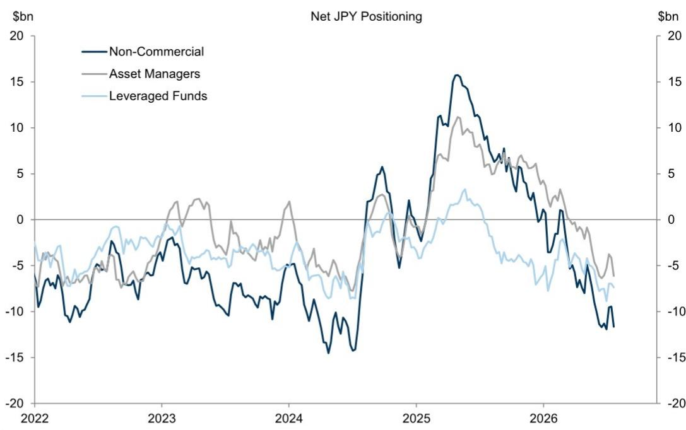

# 能源价格对汇率市场的影响超过央行决策，读者需重新审视其策略

当前驱动汇率市场的最重要力量，并非美联储的下一次利率决策、欧洲央行精心传达的暂停信号，甚至不是日本央行的干预威胁。而是能源价格的回升及其对各经济体贸易条件的不对称影响。过去几周，高收益与低收益货币之间的相关性有所收紧，能源贸易条件重新成为汇率表现的核心因素，一种熟悉的模式再次显现：能源进口国的货币面临一定压力，而出口国或能源自给型经济体的货币则相对稳健。美元尽管面临诸多宏观头条，但一直保持相对区间波动——这并非因为市场风平浪静，而是因为通常驱动美元的力量正相互拉扯。对观察者而言，其含义是明确的：仅基于利率差异进行汇率交易的传统方法已显不足。新的环境要求一个综合考量能源敞口、贸易条件动态以及央行沟通可信度变化的框架。

美元近期的受限交易区间本身就是一个有意义的信号，而非信号缺失。表面之下，自能源冲击升级以来主导汇率市场的相同主题仍在驱动回报：高收益与低收益货币之间的利差交易，以及能源贸易条件的重新凸显。美元表现平淡，与其起点较高——该货币在进入这一时期时已处于高位——以及避险需求低于3月波动时期的情况相符。高能源价格为美元提供了缓冲，以应对美联储预计将维持利率不变的决策。即使市场已定价了一定概率的加息，油价高企与美联储按兵不动的组合也不太可能引发美元大幅波动。中期来看，美联储在年底前维持利率不变，对美元相对于G10其他货币构成温和但可控的影响。然而，真正的故事并非美元本身，而是能源与利差关联所导致的不同货币之间的分化表现。

## 欧元与美元的紧密相关性反映出缺乏独立动能，使其成为结构性融资货币

欧元与广义美元的相关性极为紧密，超过G10其他任何货币对。这并非因为欧元区基本面在驱动该货币对，而是因为欧元区国内数据和政策产生的独立波动有限。德国财政支出持续推进，但其对区域整体增长的影响已被全球能源冲击所抵消。欧洲央行的政策已得到充分传达——本周会议维持利率不变，随后是9月广泛预期的加息——尽管加息定价已超过经济学家的基线预期，但这一动态在几乎所有G10市场中都很常见。这提高了欧洲央行驱动的利率差异变化对欧元表现产生实质性影响的门槛。更重要的是，欧元处于两个主导全球主题的不利一方：贸易条件冲击——尤其是欧洲天然气价格目前比3月和4月表现出更大的参与度——以及高收益与低收益货币的分化。这两股力量应会在未来几个月对欧元兑美元汇率构成一定压力，并强化以欧元作为融资货币的利差交易逻辑。对观察者而言，欧元正越来越不像是表达欧洲增长的可交易工具，而更像是表达对全球能源和风险偏好观点的被动载体。

## 英镑的脆弱性已从货币政策转向财政可信度，在秋季预算前形成新的关注点

英镑近期的走弱主要并非源于英国央行。新政府支出公告的第一周，尽管规模相对较小，但已重新将读者关注点聚焦于英国财政方面的风险与约束。围绕资金来源的疑问，以及未来更大规模支出计划的前景，部分抵消了英镑7月的优异表现。该货币与周期性基本面的背离已部分回撤，风险倾向于这一主题在短期内延续。展望中期，过去一周的发展意味着财政溢价回归的风险正在增加，并可能在秋季预算前后引发英镑的阶段性波动。这些波动应相对短暂，但它们将与英国宏观风险——尤其是英国央行加息定价的回落，该定价在G10市场中已比经济学家的基线预期更显著地超调——方向一致。英镑的长期前景更为平衡：结构性高估仍是一个不利因素，但应会被其相对较强的利差优势以及对全球周期性背景的基线看法部分抵消。对观察者的关键启示是，英镑脆弱性的来源已从货币政策转向财政可信度，而秋季预算——而非下一次英国央行会议——现在是关键事件。

## 南非兰特的能源价格脆弱性增加，因南非储备银行未根据新现实调整其沟通

兰特在南非储备银行维持利率不变的决策后显著走弱，该决策与彭博共识和市场定价相悖，但与经济学家的预期一致。汇率反应与意外程度相符，尤其是考虑到该决策恰逢6月通胀数据强于预期以及近期能源价格上涨。后者导致南非贸易条件恶化，程度超过4月初的水平。贸易条件下降本身对兰特构成显著不利因素，自冲突开始以来，兰特一直是对油价变动最敏感的货币之一。此前做多兰特的论点基于能源价格持续下跌，或至少油价上行尾部风险被压缩——这种情景也可能不需要南非储备银行进一步加息。但随着能源供应和价格的不确定性与风险增加，从汇率观察者的角度来看，南非储备银行的沟通并未根据这一背景进行调整。这使得兰特更容易受到能源价格变动和更广泛新兴市场风险情绪的影响，尤其是其利差并不像其他能源进口国（如埃及镑或印度卢比，这些国家央行采取更有力的行动来缓解贬值压力）那样高。中期内，假设油价趋于温和，美元兑兰特的当前水平可能提供一个有吸引力的入场点，但这一假设是关键变量。

## 日元面临的突然反转风险低于2024年8月，因宏观环境对日元走强不太有利

美元兑日元已升至40年新高，战术性日元空头头寸接近2024年7月干预及随后8月初利差交易反转前的极端水平。这，加上围绕能源、政策和人工智能的波动性上升（迄今对汇率影响较小），引发了对美元兑日元大幅下跌的担忧。头寸方面的脆弱性相似，应使读者保持警惕，尤其是考虑到资金回流可能性增加。但突然反转的风险看起来低于2024年夏季。当时，市场日益担忧美国经济衰退并定价美联储降息——推动回报表现和股票同步下跌，这是日元往往表现较强的环境。现在，美国经济看起来越来越远离衰退，美联储在整体建设性的风险环境中积极考虑加息。如果美联储确实开始收紧政策，那将在短期内对美国股票构成挑战，并限制日元相对于其他货币的弱势。但日元走强反转的催化剂将是人工智能估值受到更多质疑，导致回报表现与股票同步下跌。基线预期是美联储不会加息，风险情绪将保持建设性，这应会继续推动美元兑日元走高。国内财政风险看起来可能继续对日本国债和日元构成压力，尤其是如果政府推动消费税削减。读者有理由关注利差交易反转的风险，但当更广泛的宏观环境指向相反方向时，干预的有效性往往短暂。成功鼓励资金回流的政策将是更可信的杠杆，而政府似乎比之前认为的更接近推行此类政策。总体而言，近期压力将继续对日元不利，但更快、更无序的贬值可能会增加干预风险——并且可能是最有可能改变长期轨迹的可信形式。

## 能源-利差环境下的定位决策框架

对于在当前汇率环境中进行观察的人士，以下框架将报告逻辑综合为可参考的考量因素。首先，评估一种货币的能源敞口，不仅要看其净进口头寸，还要看其贸易条件对石油和天然气价格边际变化的敏感度。兰特和欧元在此指标上高度敏感；美元和澳元则不那么敏感。其次，评估央行沟通相对于市场定价的可信度。南非储备银行的沟通未根据能源背景进行调整，使兰特面临风险。欧洲央行充分传达的路径为欧元提供了一定缓冲，但不足以克服贸易条件的拖累。美联储按兵不动的立场对美元构成温和不利因素，但在能源支持下是可控的。第三，区分头寸紧张且宏观环境支持反转的货币。日元头寸紧张，但宏观环境不如2024年8月那样有利于急剧反转，使得做空日元头寸有风险但并非不可行。第四，将财政可信度作为一个独立的风险因素进行监测，特别是对于英镑和日元，其国内财政政策正成为比货币政策更重要的驱动因素。第五，对于利差交易，优先选择利差较高且能源敞口较低或已被央行行动对冲的货币，如印度卢比或埃及镑，而不是像兰特这样利差不足以补偿能源尾部风险的货币。

汇率市场并非失灵或缺乏方向。它正受到那些只关注央行会议和利率差异的观察者不太容易察觉的力量的驱动。能源价格、贸易条件和财政可信度现在是分化的主要轴线。那些央行已可信地适应能源冲击、财政状况被认为可持续、且利差足够高以补偿能源不确定性所带来波动的货币，将表现稳健。而那些结合了能源进口依赖与央行沟通未适应新现实的货币，则将面临压力。在这种环境下，最危险的头寸并非做空错误的货币，而是假设旧的关系仍然有效。

*仅供参考。部分内容可能基于源材料通过AI辅助生成、翻译、总结或编辑，可能存在遗漏或错误。请独立核实。这不构成专业建议。*
