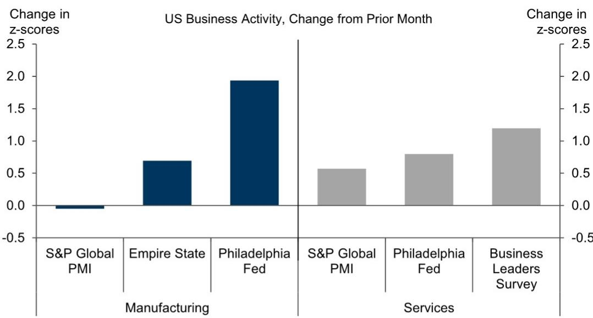
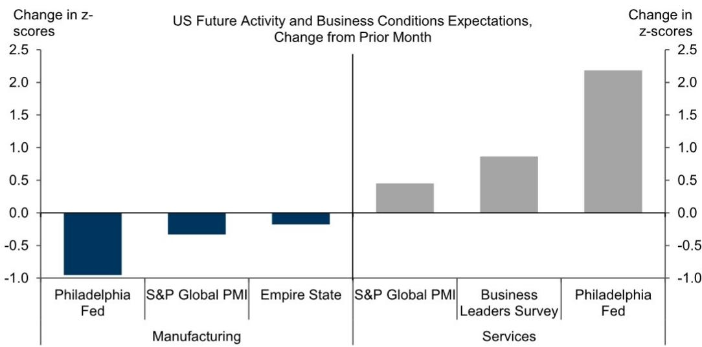
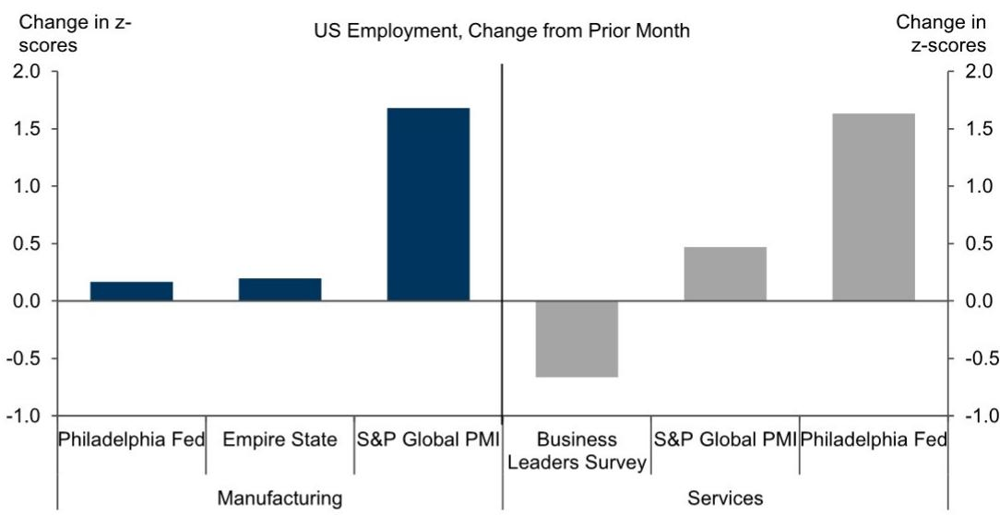

# 供应链压力是7月PMI数据中的隐藏信号，而非表面扩张

7月发达市场综合PMI初值上升1.6点至52.8，连续第四个月处于50以上的扩张区间。这一表面数字是积极的，但并非关键所在。关键在于，制造业供应商交货时间在主要发达经济体仍接近历史高位，尽管在美国以外的发达市场略有缓解。这是核心矛盾：经济活动在扩张，但通常伴随过热的供应侧摩擦并未消退。对于企业高管和资产管理者而言，7月PMI数据包含一个明确的战略提示：全球经济并非平稳地从供应受限的复苏过渡到需求驱动的扩张，而是进入了一个持续交货延迟与服务投入成本上升并存、制造业与服务业前瞻指标分化的阶段。数据要求重新评估库存策略、定价能力假设和行业配置。

综合读数掩盖了制造业与服务业之间日益扩大的差距，这对成本预测有直接影响。发达市场制造业PMI初值仅上升0.1点至53.2，而服务业PMI跃升1.9点至52.6。在前瞻性成分中，动能差距更为明显。制造业订单库存比小幅上升0.03至1.10，但服务业未来活动指数飙升1.9点至61.9。这些并非对称信号。制造业在持续供应瓶颈下艰难爬升，而服务业加速增长且产能约束不那么明显。这种不对称意味着成本压力正从商品转向服务，这一转变将改变哪些行业面临利润压缩、哪些行业能保持定价能力。

## 制造业交货时间仍结构性偏高，表明供应正常化尚未开始

7月发达市场制造业供应商交货时间指数为41.8，较上月上升1.0点。读数低于50表示交货时间延长，因此41.8处于压力区间。该指数在美国以外的发达市场略有缓解，但整体水平仍接近历史高位。这不是周期性波动，而是持续两年多的结构性状况，由物流劳动力短缺、地缘政治路线调整和中间品产能限制共同驱动。欧洲和日本的轻微缓解不应被解读为趋势逆转，它反映了此前极端读数的基数效应，而非系统性改善。对于采购和供应链管理者而言，含义明确：认为交货时间将在下半年正常化的假设缺乏数据支持。为应对正常化而建立的库存缓冲可能需要维持或增加，这将在可预见的未来占用营运资金并压缩投入资本回报率。

交货时间持续偏高还会对定价产生二阶效应。当供应商无法按时交货时，买方要么接受延迟，要么为加急或替代采购支付溢价。这部分溢价会转化为投入成本。7月发达市场制造业投入价格PMI下降3.3点至68.4，看似好消息。但68.4仍远高于50的扩张收缩分界线，且下降更可能反映大宗商品价格走低，而非真正的供应侧缓解。制造业产出价格PMI下降1.6点至59.6，表明制造商吸收了部分投入成本缓解，而非将其传导出去。这是利润挤压信号。依赖提价保护利润的公司可能会发现这一窗口正在关闭，尤其是在服务业通胀加速的背景下。

## 服务业投入价格上升而制造业投入价格缓解，形成分化通胀格局

7月发达市场服务业投入价格PMI上升0.4点至62.4，服务业产出价格PMI上升0.6点至56.6。这与制造业的情况相反。服务企业正经历投入成本上升，并成功将其转嫁给客户。这种分化之所以重要，是因为服务业通胀比商品通胀更具粘性。工资、租金和专业服务费用不会像大宗商品价格那样迅速回落。对央行而言，这造成了困境。经济中的制造业方面显示出通胀放缓信号，但服务业方面却在重新加速。单一政策利率无法同时应对这两种动态。对企业财务主管和首席财务官而言，这意味着利率预期可能保持波动，市场将在基于商品通胀放缓的降息预期和基于服务业再通胀的加息预期之间摇摆。这种波动将影响借贷成本、货币敞口以及资本预算中使用的贴现率。

国家层面的数据强化了这种分化。欧元区制造业PMI初值上升0.6点至52.0，而英国服务业PMI跃升3.1点至51.8。美国制造业PMI下降0.2点至53.8，日本服务业下降0.3点至51.9。模式并不统一，但方向明确：服务业在欧洲和英国获得动能，而制造业在美国和日本失去动力。这种地域分散意味着跨国公司在每个地区面临不同的通胀和需求动态。一刀切的定价或库存策略将失效。企业需要根据自身更多暴露于制造业供应链还是服务业需求周期，来调整区域策略。

## 前瞻性成分预示从商品到服务需求的轮动，将重塑行业表现

发达市场制造业前瞻性成分（以订单库存比衡量）上升0.03至1.10。这是积极但温和的改善。该比率数月来徘徊在1.10附近，表明订单增长勉强超过库存积累。相比之下，服务业未来活动指数飙升1.9点至61.9，为当前周期最高水平。这不是边际差异，而是明确信号：商业预期正决定性地转向服务业。对观察者而言，这意味着与可选服务、商务旅行、酒店和专业服务相关的行业，可能优于与耐用品制造和商品分销相关的行业。对企业战略制定者而言，这意味着资本支出计划应倾向于服务导向型投资，包括技术平台、劳动生产率工具和客户体验改善，而非扩大可能面临持续供应约束和需求疲软的制造产能。

美国数据提供了更细致的轮动视角。7月美国早期商业调查显示制造业和服务业活动均出现积极信号，但服务业未来活动指数明显更强。美国综合就业PMI初值上升1.6点至50.7，而日本下降0.1点至51.6。就业是滞后指标，但美国就业改善表明服务企业有信心招聘，而制造企业仍保持谨慎。这种谨慎是合理的。如果交货时间持续偏高且投入成本居高不下，制造企业将优先考虑成本控制而非扩张。由此产生的招聘分化将强化需求轮动，因为更多服务业从业者将收入用于服务消费，形成自我强化的循环。

## 应对分化PMI信号的决策框架

7月PMI数据提供了一个清晰但令人不安的决策框架。综合表面数字具有误导性，因为它平均了两种截然不同的现实。正确方法是按三个维度分解数据：行业、地域和时间跨度。

在行业维度上，数据支持增加服务业敞口、减少制造业敞口，但需注意细微差别。并非所有服务业都相同。服务业产出价格PMI上升，意味着服务企业拥有定价能力。但这种定价能力将吸引监管和竞争关注。定位最佳的服务业是那些进入壁垒高、经常性收入模式强、劳动密集度低的行业，因为它们能在不引发工资通胀的情况下维持利润率。在制造业方面，关键变量不是需求而是交货时间。拥有多元化供应链或大量库存缓冲的公司，比依赖压力地区即时生产模式的公司更具优势。

在地域维度上，数据表明欧洲和英国正经历服务业引领的加速，而美国和日本则出现制造业引领的放缓。对于在多个地区运营的公司而言，这意味着欧洲和英国的子公司可能需要投资于服务能力，而美国和日本的子公司可能需要专注于供应链韧性和成本削减。资本配置应遵循区域PMI分化，而非全球综合指标。

在时间跨度维度上，前瞻性成分比当前活动读数更重要。服务业未来活动指数61.9是六个月领先指标，表明服务业需求将持续强劲至年底及明年初。制造业订单库存比1.10是三个月领先指标，表明制造业产出将持平或小幅正增长，但不会加速。对库存规划而言，这意味着企业不应为预期中的制造业激增而建立库存。它们应保持商品库存精简，转而投资于服务能力。

框架的最后一部分是定价策略。制造业与服务业投入价格的分化意味着企业不能使用单一通胀假设进行预算。它们需要模拟两种通胀情景：一种是商品领域，投入成本缓解但产出价格也面临压力；另一种是服务领域，投入成本上升但产出价格可以上调。风险在于，商品领域的企业会假设投入成本缓解将保护利润率，而实际上竞争压力将迫使它们将节省的成本转嫁出去。更稳妥的做法是假设商品利润率将压缩并相应规划成本削减，同时假设服务业利润率将保持或扩大并相应规划能力投资。

7月PMI数据并不指向衰退，但确实指向经济增长构成的结构性转变。扩张是真实的，但不对称。这种不对称创造了表面数字无法直接显现的赢家和输家。能够分解数据并基于分化采取行动的公司和观察者，将比那些将综合PMI视为单一信号的人更具优势。

*仅供参考。部分内容可能基于源材料通过AI辅助生成、翻译、总结或编辑，可能存在遗漏或错误。请独立核实。本文不构成专业建议。*

仅供参考。部分内容可能基于源材料通过AI辅助生成、翻译、总结或编辑，可能存在遗漏或错误。请独立核实。本文不构成专业建议。

