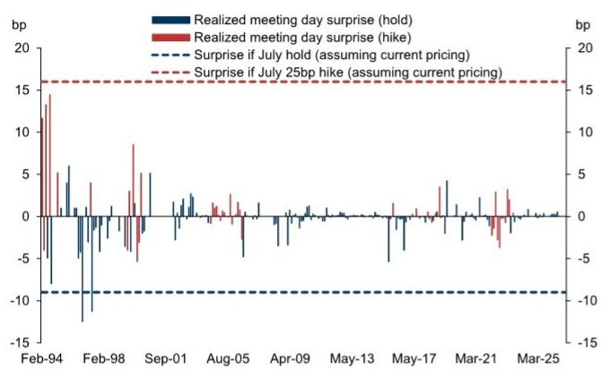
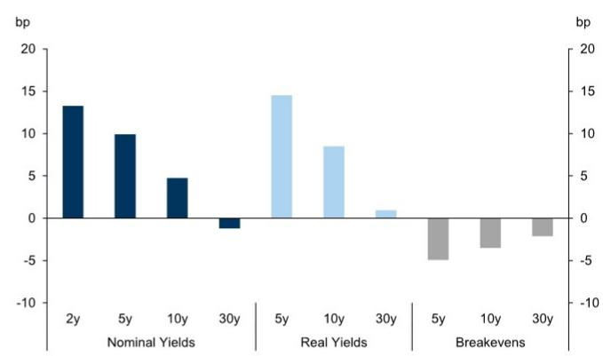
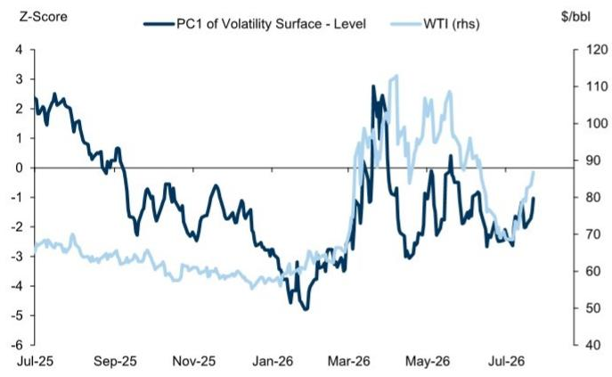
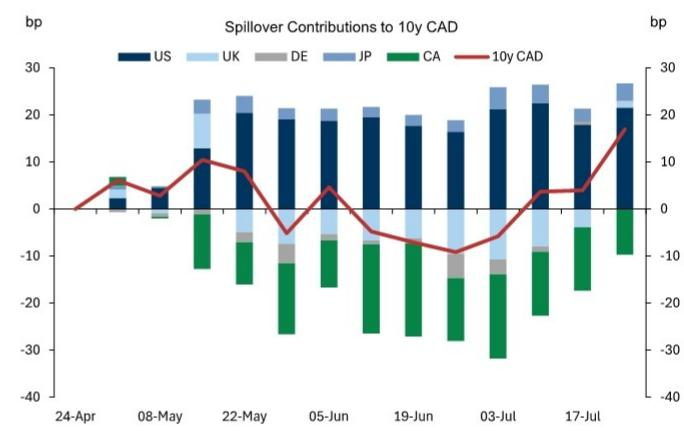
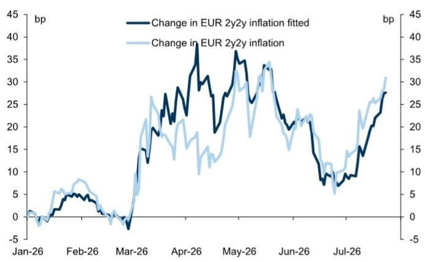
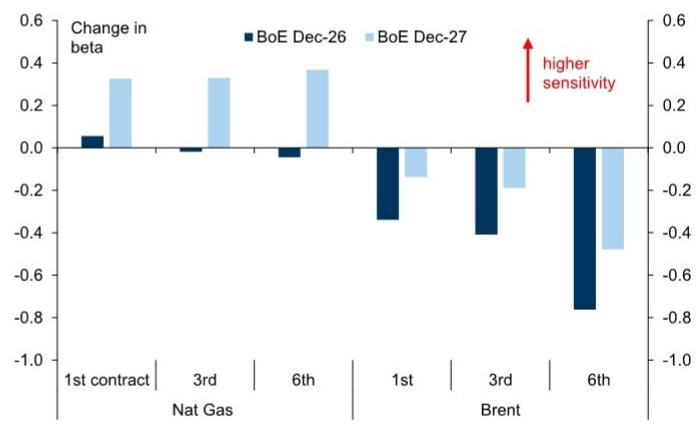
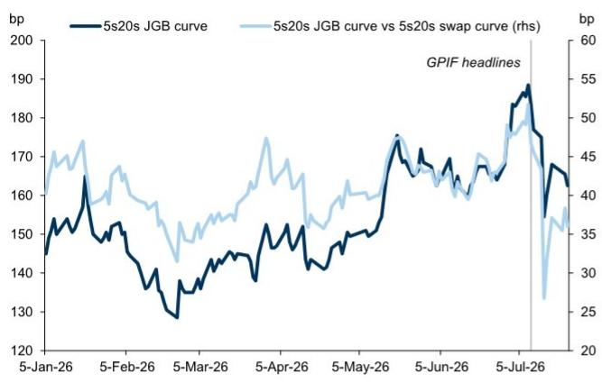
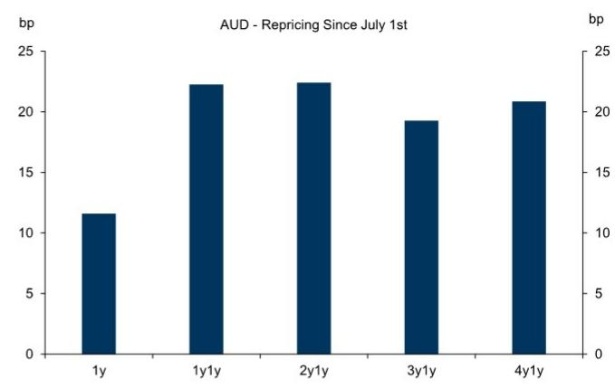

# 全球利率市场观察

## 美国与加拿大

CPI数据缓解趋势出现逆转。自上周CPI数据发布以来，原油价格约15%的上涨，已使市场从将7月加息视为小概率事件，转变为将其视为一个值得关注的风险。我们的研究团队的基本预期仍是政策利率保持不变；若当前市场定价持续，无论最终结果如何，都将为近期会议日带来最大的非降息“意外”（图表1）。尽管上一轮周期中的媒体报道有助于在决策前引导市场定价，但会议日的意外仍反映出前瞻性指引方式的转变。假设会议期间油价维持高位，我们预期维持利率不变将大概率导致加息定价重新调整，使2026年末/2027年初的定价更具粘性（而加息则可能将前端峰值前移），但更广泛的市场行为将高度依赖于决策的沟通方式。我们认为，维持利率不变且对前景或反应机制解释有限，可能对中期和长期头寸构成风险，因为这可能削弱6月FOMC会议后建立的“可信度”重新定价（图表2），并重新将通胀风险引入远期定价。长期远期估值在近期抛售中已进入相对便宜区间，但尚未达到足以在没有宏观催化剂的情况下出现修正的程度——我们仍认为，抑制通胀风险或削弱增长韧性预期的宏观因素，将对较短期限品种产生更大影响。

图表1：若当前对7月FOMC的定价成立，我们估计这将是近期会议日中最大的非降息“意外”

图表2：6月FOMC引发了明显的鹰派重新定价

波动率在近期能源价格上涨中保持粘性。尽管回报表现在油价重新加速上涨中触及阶段高点，但隐含波动率在近期抛售中相对稳定，仅小幅上升（图表3）。冲突初期，波动率曾随利率路径重新定价而急剧上升，这为波动率卖出策略提供了有利的入场点，即便在油价见顶之前也是如此。虽然波动率起点较高，但缺乏溢价重建使得隐含波动率整体水平处于我们估值框架的低端区间，表明应对进一步冲击的缓冲空间有限。短期内，我们认为波动率卖出策略的回报可能与能源价格呈反向关系（即更好的回报取决于能源价格走低）。正如我们此前所论证的（且在Warsh首次担任主席的FOMC会议后可见），美联储反应机制的不确定性增加，也应使波动率向尾部曲线迁移，继续使曲线趋于平坦，但短期内存在风险：若下周维持利率不变，市场担忧政策倾向更为鸽派，可能推高中期和长期波动率。

关于互换利差稳定性的问题。在融资条件稳定、波动率相对可控以及今年美国国债吸收情况良好的背景下，互换利差基本锚定在公允价值附近。假设下周美联储资产负债表政策不变，8月的再融资公告将是下一个关键的供给消息。关于后者，我们认为财政部迄今在增加票据供给方面感知到的成本较低，但前端不确定性上升以及未来几个季度已较为沉重的票据供给——我们的估计显示2026年第三季度至2027年第一季度净票据供给约1.2至1.3万亿美元——构成风险，周四8周期票据拍卖的冷淡反应是前端需求动态更为谨慎的近期迹象。我们的基本预期仍是2027年5月前息票拍卖规模保持稳定——届时我们预计调整将限于2年至7年期——财政部的“未来几个季度”指引再次成为关键焦点。利差和美国国债便利性指标的相对稳定表明，宏观风险而非供需平衡变化是回报表现变动的主要因素，但我们认为财政部若调整指引，可能需要同时给出关于曲线调整方向的某种信号，以避免市场负面反应。我们仍认为3年期互换利差多头作为持有收益策略可行，估值并非不利因素，但认为以相对紧凑的止损位进行管理是合理的，并会在出现明显走阔时平仓。

图表3：能源价格上涨尚未转化为波动率上升或尾部曲线平坦化

图表4：全球溢出效应推动加元回报表现走高

\- 加元前端：油价与贸易风险的双重作用。本周白宫宣布对200亿加元的加拿大商品征收50%关税后，贸易紧张局势再度成为焦点，这可能给加拿大利率前景带来鸽派风险。对加拿大进口商品的有效关税率提高2.5个百分点——若实施——可能因出口减少而对增长造成约0.2个百分点的拖累。尽管实施仍存在不确定性（Polymarket显示今年实施部分关税的概率为69%），但我们的研究团队估计，无论关税是否生效，政策不确定性和投资减少将额外对增长造成0.2个百分点的冲击。加拿大央行曾表示在贸易限制重现时愿意放宽政策；虽然我们认为这一宣布尚不足以支持进一步宽松，但若无明确的潜在通胀压力证据，加拿大央行不太可能加息至其中性区间中点。考虑到12月前定价19个基点的加息、4月前定价50个基点，我们认为前端加息溢价仍有进一步消退的空间。相比之下，能源价格上涨以及全球回报表现重新定价的溢出效应，为多头头寸带来战术性阻力（图表4）；我们仍偏好加元2s10s陡化策略。

## 欧洲

欧洲利率：估值与动量的角力。欧洲前端利率仍与能源价格挂钩，伊朗战争再度升级推动回报表现走高。上周的欧洲央行会议对压低回报表现作用有限，市场预期围绕9月加息趋于一致，这也是我们的基准情景。但由于近期利率路径缺乏新的信号，前端曲线陡化，Z6Z7合约目前定价接近一次完整加息，此外12月前还定价了两次加息。这种熊市陡化是通胀风险上升时的常见动态，但近期会议定价的波动率仍受控。这可能出现两种结果：通胀压力消退，或近期会议的速度上限被提高。目前来看，2y2y通胀定价与能源价格变动基本一致（图表5），但欧洲利率波动率重新定价的滞后表明，除非能源风险消退，否则前端波动率存在上行风险——这对追踪利率波动率而非核心利率水平的欧洲主权信用而言具有相关性。我们仍预期欧元互换曲线将在前端回报表现走低时陡化——1y1y OIS接近3%看起来尤其偏高——但经济数据韧性和欧洲天然气价格粘性可能延迟缓解的到来。

图表5：远期HICP定价与能源价格变动一致

图表6：市场对英国央行路径的定价日益反映天然气与油价的关系

能源价格上涨推高英国国债回报表现。能源价格再度上涨已将英国国债回报表现和前端定价推回冲突高点附近。与欧洲类似，能源价格上涨带来的通胀压力日益反映在2027年利率定价中，SFIZ6Z7合约目前比伊朗战争开始时更为陡峭。最近一轮升级导致了两次轮动：从Z6到Z7，以及从石油到天然气（图表6）。这些变动与英国央行不愿比当前市场定价更快加息的态度一致，因为贝利行长在近期沟通中保持了相对鸽派的立场。我们的研究团队仍预期英国央行在下周会议及年底前维持利率不变，因经济活动仍显疲弱，潜在通胀动态迄今受控。然而，伯纳姆首相对生活成本的关注——尽管尚未转化为实质性支出承诺——可能使市场持续关注能源冲击恶化时潜在的财政措施。由于财政空间取决于政府融资成本，能源价格上涨已增加财政压力，这很可能使英国国债风险溢价保持高位。尽管前端利率的短期方向将由能源价格变动决定，但考虑到2027年前已定价近三次加息，我们仍认为英国2s10s曲线将在三个月内趋于陡化。

## 日本

对曲线平坦化的支持取决于日本央行的信号。本周有报道称，由于日元贬值带来的通胀上行风险，日本央行可能以高于市场预期的速度加息——这为5s30s曲线适度平坦化提供了支撑。由于宏观因素一直是日本市场波动率的最大来源，更为鹰派的日本央行可能缓解利率和日元面临的部分压力。我们认为任何缓解的程度可能不仅取决于时机和节奏的考量，还取决于对终端利率定价的解读。单纯将预期加息提前可能无法持久地抑制曲线进一步陡化和10年期品种的相对弱势，因为市场一段时间以来已将1.5%的终端利率视为不足以持续抑制通胀，因此目前需要进一步增加期限溢价。政府近期也更加关注利息成本风险，上周提出了鼓励GPIF和NISA账户增加日本国债流入的措施。我们估计两者都可能提升对日本国债的需求，但大部分影响更可能通过信号效应和正反馈循环——如鼓励其他机构读者的需求——而非直接购买来实现。我们看到在受供给因素影响最大的回报表现和利差曲线部分——即20年期和30年期——存在相对表现改善的空间（图表7）。但最终，我们仍认为日本国债波动率的可持续下降和曲线中部的支撑需要宏观经济背景和/或货币与财政政策组合的支持。我们的研究团队不预期下周加息，但植田行长的沟通将至关重要，高市首相或片山财务大臣的任何后续评论也同样关键。鹰派基调——暗示对更高终端利率或短期中性利率持开放态度——可能缓解对日本央行独立性和财政主导风险的担忧，并支持曲线进一步平坦化。

图表7：NISA或GPIF账户的日本国债流入可能支撑受供给因素影响最大的曲线部分

图表8：中期远期承受了近期油价引发的重新定价的主要压力，我们预期前端将平坦化

## 澳大利亚与新西兰

鹰派风险已在纽元中定价，澳元远期可能获得缓解。新西兰2026年第二季度通胀数据高于预期，CPI（同比）较我们研究团队和纽储行的预期高出0.2个百分点。鉴于纽储行此前的鹰派转向，这提高了进一步收紧的可能性，我们的研究团队现预期12月将再加息一次。我们认为近期的沟通加上油价再度上涨，短期内可能为前端利率提供底部支撑。然而，我们仍认为未来一年定价的120个基点紧缩幅度过高，因为核心通胀仍在目标区间内，且我们的研究团队预期劳动力市场闲置将缓解潜在通胀压力。因此，数据的积累应会随时间推移抑制加息溢价，我们仍预期2s10s曲线将陡化。在澳大利亚，2y1y部分相对于前端承受了近期油价重新定价的主要压力（图表8）。但尽管劳动力市场数据走强提高了8月澳洲联储最后一次加息的可能性——正如我们的研究团队所预期——迄今已实施的紧缩力度已开始改变通胀风险的分布，这应允许长期远期与油价脱钩。在抛售之后，我们看到多头或前端平坦化策略重新显现价值。

## 最新专题研究：

全球市场分析：更新G10期限溢价估计——仍处高位——2026年6月19日

欧元区主权信用监测：欧盟债券——仍在深化——2026年6月12日

全球市场分析：重新审视美联储资产负债表前景——2026年5月21日

全球利率报告：美国国债估值与回报表现反转的条件——2026年5月20日

全球市场分析：英国国库券——非英国国债的灵丹妙药——2026年5月11日

最新全球市场日报：

日本储蓄能否提振日本国债？——2026年7月20日

美国国债需求中期检查——2026年7月16日

美国交易通胀信号不一——2026年7月13日

欧元区货币市场接近关键时刻——2026年7月8日

偿付能力II审查将强化良性主权信用风险背景——2026年6月23日

作者感谢Dario Scordamaglia对本报告的贡献。Dario是市场团队的实习生。

## 预测

G10 10年期回报表现预测

（表格数据略）

## G4曲线预测

（图表略）

## 央行仪表盘

（图表略）

## 持仓与资金流监测

（图表略）

## CFTC持仓报告

（表格数据略）

## 持有收益/滚动收益监测

（图表略）

## 美国国债供给监测

（表格数据略）

## GS期限溢价分解

（图表略）

## 2026年交易建议

（表格数据略）

## 全球利率策略团队

（联系方式略）

## 披露附录

（披露信息略）
